# Qwiic 红外阵列(MLX90640)连接指南

> 原文：<https://learn.sparkfun.com/tutorials/qwiic-ir-array-mlx90640-hookup-guide>

## 介绍

Melexis MLX90640 ( [110](https://www.sparkfun.com/products/14843) 和 [55](https://www.sparkfun.com/products/14844) FOV)包含一个 32x24 阵列的热电堆传感器，本质上是一个低分辨率热成像相机。如图所示，你可以在几英尺之外检测表面温度，精确度为 1.5 摄氏度(最好的情况)。我们将 MLX90640 封装在一个易于使用的 Qwiic 板上，板上有安装孔和少量去耦电容。

[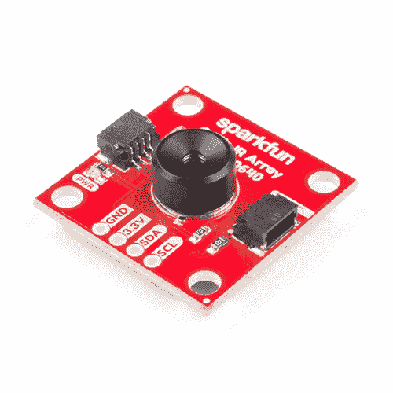](https://www.sparkfun.com/products/14843) 

将**添加到您的[购物车](https://www.sparkfun.com/cart)中！**

### [【spark fun 红外阵列突破- 110 度 FOV，MLX90640 (Qwiic)](https://www.sparkfun.com/products/14843)

[In stock](https://learn.sparkfun.com/static/bubbles/ "in stock") SEN-14843

mlx 90640 spark fun IR Array Breakout 配备了一个 110 FOV、32x24 阵列的热电堆传感器，创建了一个低分辨率的

$74.956[Favorited Favorite](# "Add to favorites") 19[Wish List](# "Add to wish list")****[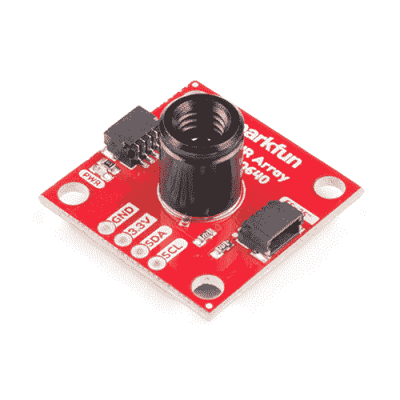](https://www.sparkfun.com/products/14844) 

将**添加到您的[购物车](https://www.sparkfun.com/cart)中！**

### [【spark fun 红外阵列突破- 55 度 FOV，MLX90640 (Qwiic)](https://www.sparkfun.com/products/14844)

[In stock](https://learn.sparkfun.com/static/bubbles/ "in stock") SEN-14844

mlx 90640 spark fun IR Array Breakout 配备了一个 55 FOV、32x24 阵列的热电堆传感器，创建了一个低分辨率…

$74.954[Favorited Favorite](# "Add to favorites") 14[Wish List](# "Add to wish list")**** ****[https://www.youtube.com/embed/FA-H_g-2A4I/?autohide=1&border=0&wmode=opaque&enablejsapi=1](https://www.youtube.com/embed/FA-H_g-2A4I/?autohide=1&border=0&wmode=opaque&enablejsapi=1)

在本指南中，我们将介绍如何将 Qwiic 红外阵列与 MLX90640 连接，并使其与处理器进行通信，以产生良好的热图像。

### 所需材料

**Not Uno Compatible:** The MLX90640 requires complex calculations by the host platform. A regular Uno doesn't have enough RAM or flash to complete the complex computations required to turn the raw pixel data into temperature data. You will need a microcontroller with 20,000 bytes or more of RAM. We recommend a Teensy 3.1 or above. Make sure to grab headers if you get a headerless version of the Teensy.[](https://www.sparkfun.com/products/116) 

将**添加到您的[购物车](https://www.sparkfun.com/cart)中！**

### [破开头球——直击](https://www.sparkfun.com/products/116)

[In stock](https://learn.sparkfun.com/static/bubbles/ "in stock") PRT-00116

一排标题-打破适应。40 个引脚，可切割成任何尺寸。用于定制 PCB 或通用定制接头。

$1.7520[Favorited Favorite](# "Add to favorites") 133[Wish List](# "Add to wish list")****[](https://www.sparkfun.com/products/13736) 

### [Teensy 3.2](https://www.sparkfun.com/products/13736)

[Out of stock](https://learn.sparkfun.com/static/bubbles/ "out of stock") DEV-13736

Teensy 3.2 是一款试验板友好型开发板，在一个小小的封装中提供了大量功能。

68[Favorited Favorite](# "Add to favorites") 83[Wish List](# "Add to wish list")[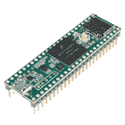](https://www.sparkfun.com/products/14056) 

### [田晶晶 3.5(头球)](https://www.sparkfun.com/products/14056)

[Out of stock](https://learn.sparkfun.com/static/bubbles/ "out of stock") DEV-14056

Teensy 3.5 更大，更快，能够进行更多的项目，特别是其板载微型 SD 卡端口和预焊…

1[Favorited Favorite](# "Add to favorites") 12[Wish List](# "Add to wish list")[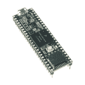](https://www.sparkfun.com/products/14058) 

### [田晶晶 3.6(头球)](https://www.sparkfun.com/products/14058)

[Out of stock](https://learn.sparkfun.com/static/bubbles/ "out of stock") DEV-14058

Teensy 3.6 更大，更快，能够进行更复杂的项目，特别是其板载微型 SD 卡端口，ARM 公司…

7[Favorited Favorite](# "Add to favorites") 22[Wish List](# "Add to wish list")** **我们没有为 Teensy 提供任何 Qwiic 屏蔽，所以如果你还没有将 Teensy 连接到 MLX90640，你应该为自己准备一个试验板和一个试验板友好的 Qwiic 电缆。

[](https://www.sparkfun.com/products/12002) 

将**添加到您的[购物车](https://www.sparkfun.com/cart)中！**

### [【试验板-不干胶(白色)](https://www.sparkfun.com/products/12002)

[In stock](https://learn.sparkfun.com/static/bubbles/ "in stock") PRT-12002

这是你的尝试和真正的白色无焊试验板。它有 2 条电源总线，10 列，30 行，总共 400 个连接…

$5.5048[Favorited Favorite](# "Add to favorites") 93[Wish List](# "Add to wish list")****[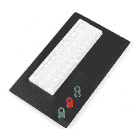](https://www.sparkfun.com/products/112) 

将**添加到您的[购物车](https://www.sparkfun.com/cart)中！**

### [试验板——经典](https://www.sparkfun.com/products/112)

[In stock](https://learn.sparkfun.com/static/bubbles/ "in stock") PRT-00112

你第一次接触电气工程-面包板。谁知道会带来这么大的挫败感？这是你的…

$10.9517[Favorited Favorite](# "Add to favorites") 28[Wish List](# "Add to wish list")****[](https://www.sparkfun.com/products/14425) 

将**添加到您的[购物车](https://www.sparkfun.com/cart)中！**

### [Qwiic 电缆-试验板跳线(4 针)](https://www.sparkfun.com/products/14425)

[In stock](https://learn.sparkfun.com/static/bubbles/ "in stock") PRT-14425

这是一根跳线适配器电缆，一端带有一个 Qwiic JST 母接头，另一端带有一个试验板连接…

$1.50[Favorited Favorite](# "Add to favorites") 34[Wish List](# "Add to wish list")****[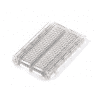](https://www.sparkfun.com/products/9567) 

将**添加到您的[购物车](https://www.sparkfun.com/cart)中！**

### [【试验板】半透明不干胶(透明)](https://www.sparkfun.com/products/9567)

[In stock](https://learn.sparkfun.com/static/bubbles/ "in stock") PRT-09567

**描述* *:有没有想过这些东西里面是什么？这块透明的面包板可能会启发。超越极限…

$5.5015[Favorited Favorite](# "Add to favorites") 37[Wish List](# "Add to wish list")******** ********### 工具

根据你的设置，你可能需要一个烙铁、焊料和[通用焊接附件](https://www.sparkfun.com/categories/49)如果你买了一个无头的 Teensy。

[](https://www.sparkfun.com/products/14228) 

### [威勒 WLC100 焊台](https://www.sparkfun.com/products/14228)

[Out of stock](https://learn.sparkfun.com/static/bubbles/ "out of stock") TOL-14228

Weller 的 WLC100 是一款多功能的 5 瓦至 40 瓦焊台，非常适合业余爱好者、DIY 爱好者和学生。…

2[Favorited Favorite](# "Add to favorites") 17[Wish List](# "Add to wish list")[](https://www.sparkfun.com/products/9325) 

将**添加到您的[购物车](https://www.sparkfun.com/cart)中！**

### [无铅焊料- 100 克线轴](https://www.sparkfun.com/products/9325)

[In stock](https://learn.sparkfun.com/static/bubbles/ "in stock") TOL-09325

这是带有水溶性树脂芯的无铅焊料的基本线轴。0.031 英寸规格，100 克。这是一个好主意…

$9.957[Favorited Favorite](# "Add to favorites") 33[Wish List](# "Add to wish list")** **### 推荐阅读

如果你不熟悉 Qwiic 系统，我们推荐你在这里阅读[以获得一个概述](https://www.sparkfun.com/qwiic)。

| [](https://www.sparkfun.com/qwiic) |
| *[Qwiic 连接系统](https://www.sparkfun.com/qwiic)* |

由于我们还将在其中一个演示中使用处理功能，我们建议您查看将 Arduino 与处理功能挂钩的教程。如果你不熟悉下面的教程，我们也建议你看一看。

[](https://learn.sparkfun.com/tutorials/how-to-solder-through-hole-soldering) [### 如何焊接:通孔焊接](https://learn.sparkfun.com/tutorials/how-to-solder-through-hole-soldering) This tutorial covers everything you need to know about through-hole soldering.[Favorited Favorite](# "Add to favorites") 70[](https://learn.sparkfun.com/tutorials/connecting-arduino-to-processing) [### 将 Arduino 连接到处理](https://learn.sparkfun.com/tutorials/connecting-arduino-to-processing) Send serial data from Arduino to Processing and back - even at the same time 35[](https://learn.sparkfun.com/tutorials/i2c) [### I2C](https://learn.sparkfun.com/tutorials/i2c) An introduction to I2C, one of the main embedded communications protocols in use today.[Favorited Favorite](# "Add to favorites") 128

## 硬件概述

首先，让我们来看看我们正在处理的 [MLX90640 IR 阵列](https://cdn.sparkfun.com/assets/7/b/f/2/d/MLX90640-Datasheet-Melexis.pdf)的一些特性，这样我们就知道对电路板有什么期望了。请记住，视野有两种选择 **110 x75** 和 **55 x35**

| **特性** | **范围** |
| 工作电压 | **3V-3.6V** |
| 电流消耗 | 约 18 毫安 |
| 测定范围 | -40 摄氏度至 300 摄氏度 |
| 解决 | &pm; 1.5 摄氏度 |
| 刷新率 | 0.5Hz - 64 Hz |
| I ² C 地址 | 0x33 |

## 腿

下表列出了 MLX90640 的所有引脚及其功能。

| 别针 | 描述 | 方向 |
| GND | 地面 | 在…里 |
| 3.3V | 力量 | 在…里 |
| 国家药品监督管理局 | 数据 | 进/出 |
| SCL | 时钟 | 在…里 |

### 可选功能

MLX90640 IR 阵列具有连接到 I ² C 总线的上拉电阻；如果多个传感器连接到总线并使能上拉电阻，并联等效电阻将产生过强的上拉电阻，使总线无法正常工作。一般来说，如果总线上连接了多个器件，则除一对上拉电阻外，应禁用所有上拉电阻。如果需要断开上拉电阻，可以通过切断下面突出显示的相应跳线上的走线来移除。

[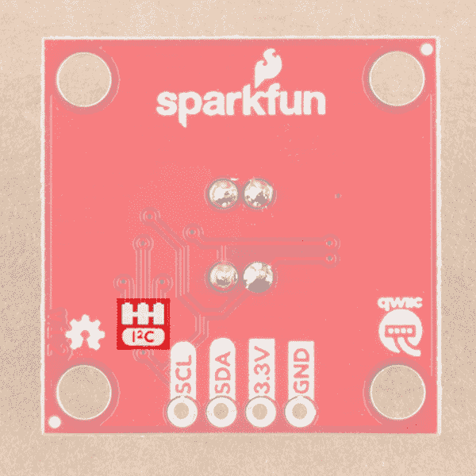](https://cdn.sparkfun.com/assets/learn_tutorials/8/0/5/i2cpu1.png)*I²C Pull Up Jumper*

当主板通电时，板载 LED(下面突出显示)将亮起，并且在您的应用中，传感器(下面也突出显示)应保持不被覆盖。

[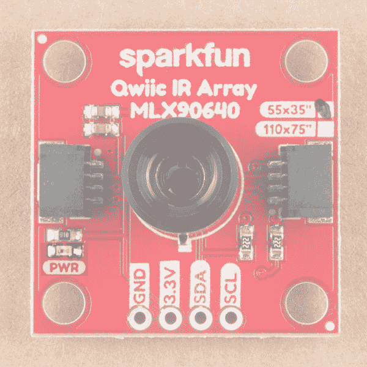](https://cdn.sparkfun.com/assets/learn_tutorials/8/0/5/PWRLED1.png)*Power LED*

## 硬件装配

由于目前我们还没有适合青少年的 Qwiic 屏蔽，我们需要通过[兼容 Qwiic 电缆](https://www.sparkfun.com/products/14425)的试验板连接我们的 Qwiic 红外阵列。如果您不确定如何连接 Qwiic 线缆，请查看下表。Teensy 3.5 引脚可用[这里](https://cdn.sparkfun.com/datasheets/Dev/Arduino/Boards/teensy35_front.pdf)。更多引脚分配，请参考[青少年参考页](https://www.pjrc.com/teensy/pinout.html)。

| **颜色** | **功能** | **引脚** |
| 黑色 | 地面 | 任何 GND 别针 |
| 红色 | 电源(3.3V) | 任何 3.3V 引脚 |
| 黄色 | 时钟 | Nineteen |
| 蓝色 | 数据 | Eighteen |

一旦你有你的电缆连接到试验板，继续插入你的 MLX90640 红外阵列，你就可以开始了。

[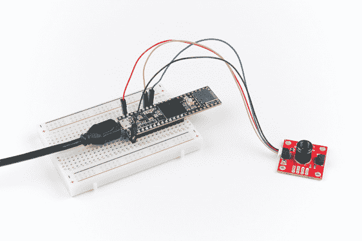](https://cdn.sparkfun.com/assets/learn_tutorials/8/0/5/Qwiic_IR_Array_Teensy_Hardware_Hookup.jpg)*MLX90640 Plugged into Breadboard*

## 示例代码

**注意:**此示例假设您在桌面上使用的是最新版本的 Arduino IDE。如果这是你第一次使用 Arduino，请回顾我们关于[安装 Arduino IDE 的教程。](https://learn.sparkfun.com/tutorials/installing-arduino-ide)

### Teensyduino 附加组件

如果你以前没有使用过 Teensy，你可能需要下载并安装 Arduino IDE 的扩展，名为 [Teensyduino，位于此处。](https://www.pjrc.com/teensy/td_download.html)

### 图书馆

Melexis 写了一个库，用 MLX90640 控制 Qwiic IR 阵列。你可以通过点击下面的按钮获得这些库，其中也包括来自 [GitHub 库](https://github.com/sparkfun/SparkFun_MLX90640_Arduino_Example)的 SparkFun 书面示例草图。只是确保打开每个示例时关联的文件都在相同的路径中。

[MLX90640 Library and Examples (ZIP)](https://github.com/sparkfun/SparkFun_MLX90640_Arduino_Example/archive/master.zip)

### 例 1 -基本阅读

下载完示例草图和库后，继续打开**spark fun _ mlx 90640 _ Arduino _ Example-master**>**Firmware**>**Example 1 _ BasicReadings**>**Example 1 _ BasicReadings**下的第一个示例。为了初始化传感器，我们首先尝试使用`isConnected()`功能与 MLX90640 对话。仔细观察我们的`setup()`循环可以发现，我们使用`MLX90640_DumpEE`和`MLX90640_ExtractParamaters`从 MLX 中提取了一组参数。在开发板准备使用之前，只需要在`setup()`循环中执行一次，代码如下所示。

```
language:c
void setup()
{
  Wire.begin();
  Wire.setClock(400000); //Increase I2C clock speed to 400kHz

  Serial.begin(9600);
  while (!Serial); //Wait for user to open terminal
  Serial.println("MLX90640 IR Array Example");

  if (isConnected() == false)
  {
    Serial.println("MLX90640 not detected at default I2C addres. Please check wiring. Freezing.");
    while (1);
  }
  Serial.println("MLX90640 online!");

  //Get device parameters - We only have to do this once
  int status;
  uint16_t eeMLX90640[832];
  status = MLX90640_DumpEE(MLX90640_address, eeMLX90640);
  if (status != 0)
    Serial.println("Failed to load system parameters");

  status = MLX90640_ExtractParameters(eeMLX90640, &mlx90640);
  if (status != 0)
    Serial.println("Parameter extraction failed");

  //Once params are extracted, we can release eeMLX90640 array
} 
```

一旦你选择了你的板和串口，上传草图到你的系统。然后**打开设置为 115200 波特的[串行监视器](https://learn.sparkfun.com/tutorials/terminal-basics/arduino-serial-monitor-windows-mac-linux)T3。输出应该类似下图，每个像素的温度值以 c 显示。**

[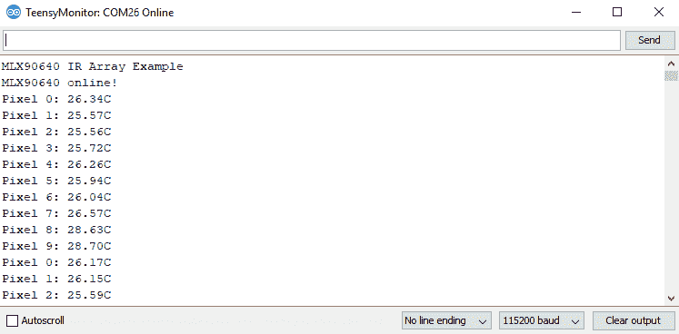](https://cdn.sparkfun.com/assets/learn_tutorials/8/0/5/EX1.PNG)*Example 1 Output*

### 示例 2 -输出到处理

**注:** Processing 是一种软件，除了其他功能之外，它还可以实现数据的可视化表示。如果你以前从未处理过加工，我们建议你也看看 [Arduino to Processing 教程](https://learn.sparkfun.com/tutorials/connecting-arduino-to-processing)。请按下面的按钮继续下载并安装处理程序。

[Download Processing IDE](https://processing.org/download/)

下一个例子涉及到处理 IDE。处理监听串行数据，所以我们需要让 Arduino 产生对处理有意义的串行数据。要调出下一个示例，请转到**spark fun _ mlx 90640 _ Arduino _ Example-master**>**固件** > **示例 2 _ output to processing**>**示例 2_OutputToProcessing** 打开示例草图。这个草图简单地打印了一个逗号分隔的温度列表，用于处理监听。

一旦这个草图被上传，我们需要告诉 Processing 如何将这个数据转化为可视化。执行此操作的处理草图位于与示例 2 相同的文件夹中。所以去 sketch 文件夹打开处理中的 **MLXHeatCam** 文件。尝试运行草图将在调试窗口中显示可用的串行端口。

[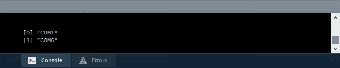](https://cdn.sparkfun.com/assets/learn_tutorials/7/4/6/EX4-DEBUG.PNG)

确定你的孩子在哪个串行端口上。例如，我的 Teensy 在 COM6 上，对应于上图中的`[1]`,所以我需要在下面一行将 0 改为 1，以确保处理在正确的位置监听。

```
language:c
myPort = new Serial(this, Serial.list()[0], 115200); 
```

一旦我这样做了，我们应该能够运行处理草图，它会给我们一个很好的可视化像素在我们的 Qwiic 红外阵列与 MLX90640。将你的脸或手移到传感器前面，看看它在屏幕上是什么样子。输出应该类似于下图。请注意，由于 I ² C 以上的数据速率，相机只能达到约 4Hz。mlx 90640 的假设刷新率为 64 Hz，但除非你有一个能够达到更快 I ² C 速率的微控制器，否则你不会达到接近该速率的帧速率。

[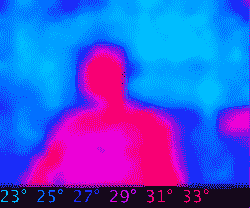](https://cdn.sparkfun.com//assets/parts/1/3/0/1/4/SparkFun_MLX90640_Thermal_Imaging_Camera-Demo.gif)*IR Camera Display*

## 资源和更进一步

既然您已经成功地使用 MLX90640 启动并运行了 Qwiic IR 阵列，那么是时候将它集成到您自己的项目中了！

有关更多信息，请查看以下资源:

*   SparkFun 红外阵列(MLX90640) 110 FOV
    *   [示意图(PDF)](https://cdn.sparkfun.com/assets/1/d/e/8/7/sparkfun-mlx90640-qwiic-breakout-110.pdf)
    *   [老鹰文件(ZIP)](https://cdn.sparkfun.com/assets/4/f/7/a/e/sparkfun-mlx90640-qwiic-breakout-110.zip)
    *   [数据表](https://cdn.sparkfun.com/assets/3/1/c/6/f/MLX90640-Datasheet.pdf)
    *   开源代码库
        *   [软件回购](https://github.com/sparkfun/SparkFun_MLX90640_Arduino_Example)
        *   [产品回购](https://github.com/sparkfun/Qwiic_IR_Array_MLX90640)
            
*   SparkFun 红外阵列(MLX90640) 55 FOV
    *   [示意图(PDF)](https://cdn.sparkfun.com/assets/9/0/b/e/7/sparkfun-mlx90640-qwiic-breakout-55.pdf)
    *   [老鹰文件(ZIP)](https://cdn.sparkfun.com/assets/2/3/8/2/3/sparkfun-mlx90640-qwiic-breakout-55.zip)
    *   [数据表](https://cdn.sparkfun.com/assets/3/1/c/6/f/MLX90640-Datasheet.pdf)
    *   开源代码库
        *   [软件回购](https://github.com/sparkfun/SparkFun_MLX90640_Arduino_Example)
        *   [产品回购](https://github.com/sparkfun/Qwiic_IR_Array_MLX90640)
*   [SFE 产品展示区](https://youtu.be/FA-H_g-2A4I)

你的下一个项目需要一些灵感吗？查看一些相关教程:

[](https://learn.sparkfun.com/tutorials/flir-lepton-hookup-guide) [### FLIR 轻子连接指南](https://learn.sparkfun.com/tutorials/flir-lepton-hookup-guide) See the invisible world of infrared radiation using the FLIR Dev Kit and Raspberry Pi.[Favorited Favorite](# "Add to favorites") 8[](https://learn.sparkfun.com/tutorials/mlx90614-ir-thermometer-hookup-guide) [### MLX90614 红外温度计连接指南](https://learn.sparkfun.com/tutorials/mlx90614-ir-thermometer-hookup-guide) How to use the MLX90614 or our SparkFun IR Thermometer Evaluation Board to take temperatures remotely, over short distances.[Favorited Favorite](# "Add to favorites") 9[](https://learn.sparkfun.com/tutorials/qwiic-grid-eye-infrared-array-amg88xx-hookup-guide) [### Qwiic 栅眼红外阵列(AMG88xx)连接指南](https://learn.sparkfun.com/tutorials/qwiic-grid-eye-infrared-array-amg88xx-hookup-guide) The Panasonic GRID-Eye (AMG88xx) 8x8 thermopile array serves as a functional low-resolution infrared camera. This means you have a square array of 64 pixels each capable of independent temperature detection. It’s like having thermal camera (or Predator’s vision), just in really low resolution.[Favorited Favorite](# "Add to favorites") 0****************