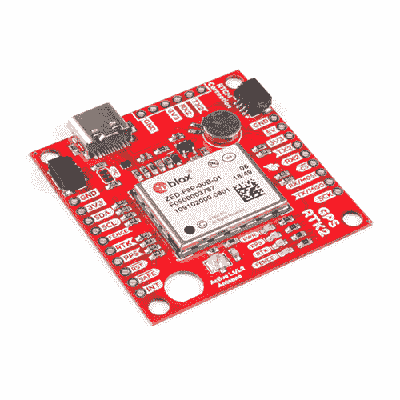
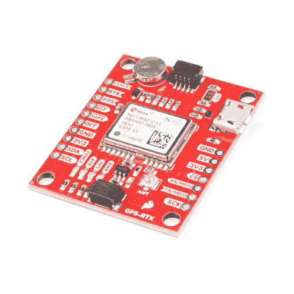

# 什么是 GPS RTK？

> 原文：<https://learn.sparkfun.com/tutorials/what-is-gps-rtk>

## 实时运动学

RTK 是**实时运动学**的缩写。能够进行 RTK 的 GPS 接收器接收来自全球导航卫星系统的正常信号以及校正流，以实现 1cm 的定位精度。GNSS 包括来自 GPS(美国)、GLONASS(俄国)、北斗(中国)和伽利略(欧洲)的卫星。在这些信号之上，RTK 接收器接收 RTCM 校正流，然后实时计算出你的位置，精确度为 1 厘米。接收器之间的速率不同，但大多数接收器每秒至少输出一次解；有些接收机每秒可以输出 20 次这种更高精度的解。具有 RTK 功能的 GPS 接收器过去要几千美元，并且仅限于专业测量员和政府团体。多亏了科学、数学和经济学，RTK 接收器现在不到 300 美元。

[](https://www.sparkfun.com/products/16481) 

将**添加到您的[购物车](https://www.sparkfun.com/cart)中！**

 **### [踢腿式 GPS-RTK-SMA 突围-zed-F9(qwiic)T3](https://www.sparkfun.com/products/16481)

[In stock](https://learn.sparkfun.com/static/bubbles/ "in stock") GPS-16481

SparkFun GPS-RTK-SMA 提高了高精度 GPS 的标准，是一系列功能强大的 RTK 板中最新的一款

$274.9511[Favorited Favorite](# "Add to favorites") 33[Wish List](# "Add to wish list")****[](https://www.sparkfun.com/products/15136) 

将**添加到您的[购物车](https://www.sparkfun.com/cart)中！**

 **### [【spark fun GPS-RTK 2 Board-ZED-F9P(Qwiic)](https://www.sparkfun.com/products/15136)

[In stock](https://learn.sparkfun.com/static/bubbles/ "in stock") GPS-15136

SparkFun GPS-RTK2 是 ZED-F9P 模块的一个强大突破。ZED-F9P 是 GNSS 和 GPS 系统的顶级模块

$274.9521[Favorited Favorite](# "Add to favorites") 61[Wish List](# "Add to wish list")****[](https://www.sparkfun.com/products/15005) 

将**添加到您的[购物车](https://www.sparkfun.com/cart)中！**

 **### [【spark fun GPS-RTK 板- NEO-M8P-2 (Qwiic)](https://www.sparkfun.com/products/15005)

[In stock](https://learn.sparkfun.com/static/bubbles/ "in stock") GPS-15005

SparkFun GPS-RTK 板是 u-blox NEO-M8P-2 模块的一个强大突破。NEO-M8P-2 是一款顶级的移动…

$264.956[Favorited Favorite](# "Add to favorites") 22[Wish List](# "Add to wish list")****[](https://www.sparkfun.com/products/17722) 

将**添加到您的[购物车](https://www.sparkfun.com/cart)中！**

 **### [【spark fun micro mod GNSS 载板(ZED-F9P)](https://www.sparkfun.com/products/17722)

[In stock](https://learn.sparkfun.com/static/bubbles/ "in stock") GPS-17722

SparkFun MicroMod GNSS 载板具有 GNSS 实时运动学(RTK)的准确性和微型计算机的灵活性

$324.95[Favorited Favorite](# "Add to favorites") 6[Wish List](# "Add to wish list")****[](https://www.sparkfun.com/products/20000) 

将**添加到您的[购物车](https://www.sparkfun.com/cart)中！**

 **### [SparkFun RTK 刻面 L 波段](https://www.sparkfun.com/products/20000)

[34 available](https://learn.sparkfun.com/static/bubbles/ "34 available") GPS-20000

RTK Facet L-Band 是您满足高精度地理定位和勘测需求的一站式商店，无需基座或漫游车…

$1,499.955[Favorited Favorite](# "Add to favorites") 5[Wish List](# "Add to wish list")****[](https://www.sparkfun.com/products/18442) 

将**添加到您的[购物车](https://www.sparkfun.com/cart)中！**

 **### [spark fun RTK Express](https://www.sparkfun.com/products/18442)

[In stock](https://learn.sparkfun.com/static/bubbles/ "in stock") GPS-18442

SparkFun RTK Express 是一款易于使用的 GNSS 接收器，用于厘米级定位。非常适合测量、伐木和…

$534.951[Favorited Favorite](# "Add to favorites") 5[Wish List](# "Add to wish list")************ ************在左边，我们有一个质量极高的 GPS 接收器(上面看到的 [ZED-F9P](https://www.sparkfun.com/products/15136) )，没有校正数据。位置大幅漂移超过 1.5 米及以上。在右边，具有相同天线和 RTCM 校正数据的相同接收器使位置低于 25 厘米，紧密分组低于 10 厘米。

[](https://cdn.sparkfun.com/assets/learn_tutorials/8/1/3/Location-Wandering-GPS-combined.jpg)

### 你说的是 1 *cm* 吗？Zomg 我如何获得 1 cm 的精度！？

您需要一个能够接收 RTCM 校正数据并将其整合到定位解决方案中的 GPS 接收器。你还需要一个 RTCM 校正数据的来源。这通常来自互联网连接或每秒大约 500 字节的长距离无线电。LoRa 和 LTE-CAT M1 是这种回程的绝佳选择。

一旦所有的设置和工作，漫游者 GPS 模块将输出正常的 NMEA 句子，但具有真正准确的经度和纬度。明确一点，不是 1cm 精度；是 1cm *精度*。精度 0.1mm！

通过从 GPS 卫星捕获原始数据流，然后使用名为 [RTKLIB](http://www.rtklib.com/) 的开源程序对日志进行后处理，一些低成本接收器(如 NEO-M8T)也可以达到 1 厘米的精度。这对于航空摄影和农业检测等事后校准非常重要的应用来说非常方便。也可以将低成本接收器(如 NEO-M8T)连接到笔记本电脑，统一运行 RTKLIB，实现实时解决方案，但这是一个相当大的高功耗设置，对于嵌入式移动应用来说并不理想。在这些教程中，我们将重点关注实时(RTK)接收器。

## 什么是 RTCM？

RTCM 是技术委员会的缩写，也是时间委员会的缩写。这个政府机构在几十年前就想出了一种方法来为船只和其他船只传递位置信息。从技术上讲，RTCM 只是一个协议。然而，我们将使用术语 *RTCM* 来表示与 GPS 定时异常相关的校正数据的字节。

[](https://cdn.sparkfun.com/assets/learn_tutorials/8/1/3/RTCM_3_Format_with_Preamble.jpg)*From [Review of GNSS Formats for Real-Time Positioning](https://www.researchgate.net/profile/Eldar_Rubinov/publication/268403391_Review_of_GNSS_Formats_for_Real-Time_Positioning/links/546f3db00cf2d67fc0310356/Review-of-GNSS-Formats-for-Real-Time-Positioning.pdf) and [Geo++](http://www.geopp.com/pdf/gppigs06_rtcm_f.pdf)*

RTCM 帧的内容可以被解码，但你，用户，很少需要。相反，您只需将字节传递给 GPS 接收器，它将解析校正数据。

有几种不同类型的消息，但我们关心的是数字 1005、1077、1087 和 1230。每种消息类型都有不同的长度，但根据经验，每秒钟有几百个字节。每条 RTCM 信息都包含有关全球定位系统/全球导航卫星系统网络以及电离层和对流层扰动的详细信息。

记住，GPS 卫星离我们很远。大约 20，000 公里或 12，000 英里远。在那段距离内，GPS 卫星给你的信号会发生很多变化。磁暴会造成轻微的时间延迟，增加定位误差。地球的重力场是不均匀的，因此相对论效应会增加不准确性。如果我们知道本地附近的第二到第二个问题，具有 RTCM 能力的接收机可以非常精确地校正定位解。

**Note:** There are a few different versions of RTCM. The most popular versions are v2 and v3\. Because v3 is considered an ‘open’ standard, and because it incorporates messages helpful for RTK, more companies have implemented version 3 making it the more common standard.

## 我在哪里得到 RTCM 更正？

有一个不免费但超级简单的解决方案，还有高速公路。

### 非免费:云雀

[](https://cdn.sparkfun.com/assets/learn_tutorials/8/1/3/Skylark-Coverage.png)*Skylark coverage maps*

一家名为 SwiftNav 的公司提供名为[云雀](https://www.swiftnav.com/skylark)的服务。截至发稿时，每月 49 美元，你就可以获得北美、欧洲和亚太地区的更正。您将获得 NTRIP 凭证，可立即用于 Lefebure、SW Maps 或任何支持 NTRIP 的 GIS 应用程序。一个不利之处是，对于像 Skylark 这样的“地区性”供应商，到校正站的距离可能超过 10 公里。虽然我们*总是*获得 RTK 定位，但当使用我们自己的 [GNSS 参考站](https://learn.sparkfun.com/tutorials/how-to-build-a-diy-gnss-reference-station/all)时，我们经常看到大约 30 毫米的精度，而不是 14 毫米。您的里程可能会有所不同。

### 有点免费:建造你自己的

[](https://cdn.sparkfun.com/assets/learn_tutorials/1/3/6/3/Roof_Enclosure.jpg)*The SparkFun RTK Base Station complete with an NTRIP internet connection and a 915MHz RF connection*[](https://cdn.sparkfun.com/assets/learn_tutorials/1/3/6/3/SparkFun_ESP32_Server_-_RTCM_connected_over_Qwiic.jpg)*SparkFun GPS RTK transmitting RTCM over Qwiic to ESP32 Thing Plus*

你可以[建造自己的 GNSS 参考站](https://learn.sparkfun.com/tutorials/how-to-build-a-diy-gnss-reference-station/all#introduction)。这需要一些工作，一些硬件，而且你需要待在 10 公里以内的 ¹ ，但是没有年费，你可以控制自己的系统。此外，在 RTK 固定模式下，我们获得了非常好的 14 毫米水平精度报告。

随着到参考站的距离超过 10 公里，RTK 定位[的精度会增加几厘米](https://www.hindawi.com/journals/js/2019/3572605/)。

### 免费:UNAVCO

如果你幸运的话，在你 10 公里(6 英里)范围内有一个电台通过互联网广播 RTCM 3.x 数据。我们在离 SparkFun 总部 10 公里多一点的地方找到了一个非常好用的。

[](https://cdn.sparkfun.com/assets/learn_tutorials/8/1/3/RTCM_Station_Distance_more_than_10km.jpg)

这是我们找到的电台列表。如果您知道更多信息，请告诉我们:

*   UNAVCO -主要在美国
*   [NTRIP 列表](https://igs.bkg.bund.de/root_ftp/NTRIP/streams/streamlist_world-wide.htm) -全球
*   [欧洲参考站](http://www.epncb.oma.be/_networkdata/data_access/real_time/map.php)
*   RTK2go 和 [SNIP](https://www.use-snip.com/kb/knowledge-base/an-open-ntrip-caster/) -运行一个可以访问几十个站点的服务器(见评论部分)

许多广播实时 RTCM 校正数据的电台需要注册。这是全球科学和非营利民间组织的大杂烩。感觉很像 1995 年的互联网。如果有人有更直接的方法来发现和连接 RTCM 提供商，请在评论区告诉我们。

我们建议使用 [RTKLIB](http://www.rtklib.com/) 订阅提要，并通过串行端口将流输出到支持 GPS RTK 的模块。为了获得最佳精度，您的 GPS 接收器需要在广播站 10 公里(6 英里)以内。如果距离超过 10 公里，ZED-F9P 仍可创建一个固定位置，但精度会下降，接收器将输出以下内容:

```
WARNING: DGNSS baseline big: 10km 
```

## 我如何将 RTCM 的信息发送到 GPS 接收器？

这取决于您的最终应用。如果您需要最大的便携性，那么最好的解决方案是在您创建的基站和移动 GPS RTK 接收器之间建立无线电连接。SparkFun 提供各种 [LoRa 无线电和天线](https://www.sparkfun.com/categories/410)来支持这种回程，如下面列出的一些产品。

[](https://www.sparkfun.com/products/18573) 

将**添加到您的[购物车](https://www.sparkfun.com/cart)中！**

 **### [SparkFun MicroMod LoRa 功能板](https://www.sparkfun.com/products/18573)

[In stock](https://learn.sparkfun.com/static/bubbles/ "in stock") WRL-18573

SparkFun MicroMod LoRa 功能板为您的 MicroMod 项目提供 LoRa 和 LoRaWAN 功能。

$39.95[Favorited Favorite](# "Add to favorites") 3[Wish List](# "Add to wish list")****[](https://www.sparkfun.com/products/18074) 

### [【spark fun LoRa Gateway-1-Channel(ESP32)](https://www.sparkfun.com/products/18074)

[Out of stock](https://learn.sparkfun.com/static/bubbles/ "out of stock") WRL-18074

SparkFun 1-Channel LoRa Gateway 是一款功能强大的 3-network 设备，它配备了机载 ESP32 WROOM 模块和 RFM…

[Favorited Favorite](# "Add to favorites") 12[Wish List](# "Add to wish list")[](https://www.sparkfun.com/products/18572) 

将**添加到您的[购物车](https://www.sparkfun.com/cart)中！**

 **### [LoRa 1W 突围-915 s3os](https://www.sparkfun.com/products/18572)

[In stock](https://learn.sparkfun.com/static/bubbles/ "in stock") SPX-18572

需要动力吗？EBYTE 的 915M30S 模块分线点是一款 1W (30dBm) LoRa 收发器。劳拉是伟大的长期 r…

$29.952[Favorited Favorite](# "Add to favorites") 3[Wish List](# "Add to wish list")**** ****如果您的终端应用已经需要 GSM 或 LTE-CAT 等互联网连接，那么与 GPS-RTK 接收器的串行连接可能是最简单的方法。

如果您的应用附近有手机，那么第三种选择是创建一个从手机到串行蓝牙设备的串行桥，如 [Bluetooth Mate Silver](https://www.sparkfun.com/products/12576) ，然后连接到 GPS-RTK 上的串行端口。有一些兼容 NTRIP 的移动应用程序。我们对安卓版的 [Lefebure](https://play.google.com/store/apps/details?id=com.lefebure.ntripclient) 很满意。

## 资源和更进一步


## 准备好动手操作 GPS 了吗？

我们为您准备了一个页面！我们将带您了解 GPS 的基本工作原理、所需的硬件以及项目教程，帮助您入门。

带我去那里！

我们希望这个教程能帮助你更多地了解 GPS RTK。这只是开始！有关更多信息，请查看以下资源:

*   RTKLIB:一个用于 GNSS 定位的开源软件包
*   [研究之门:全球导航卫星系统实时定位格式审查](https://www.researchgate.net/publication/268403391_Review_of_GNSS_Formats_for_Real-Time_Positioning)
*   [Geo++:全球导航卫星系统实时数据传输标准 RTCM 3.0 (PDF)](http://www.geopp.com/pdf/gppigs06_rtcm_f.pdf)
*   站
    *   所有实时网络&站监控 -主要是美国
    *   [BKG 的 GNSS 数据中心:Ntrip 广播公司的 GNSS 实时数据流全球列表](https://igs.bkg.bund.de/root_ftp/NTRIP/streams/streamlist_world-wide.htm) -全球
    *   [EUREF 永久 GNSS 网络:实时地图](http://www.epncb.oma.be/_networkdata/data_access/real_time/map.php)
    *   简单的 NTRIP Caster -运行一个可以访问几十个站点的服务器
*   [安卓应用:Lefebure NTRIP 客户端](https://play.google.com/store/apps/details?id=com.lefebure.ntripclient)

寻找更多 GPS RTK 相关信息？查看以下教程:

[](https://learn.sparkfun.com/tutorials/bluetooth-basics) [### 蓝牙基础知识](https://learn.sparkfun.com/tutorials/bluetooth-basics) An overview of the Bluetooth wireless technology.[Favorited Favorite](# "Add to favorites") 42[](https://learn.sparkfun.com/tutorials/lorawan-with-prorf-and-the-things-network) [### LoRaWAN 与 ProRF 和物联网](https://learn.sparkfun.com/tutorials/lorawan-with-prorf-and-the-things-network) Learn how to make a LoRaWAN node for your next long range IoT project and connect it to the internet with The Things Network 11[](https://learn.sparkfun.com/tutorials/gps-rtk-hookup-guide) [### GPS-RTK 连接指南](https://learn.sparkfun.com/tutorials/gps-rtk-hookup-guide) Find out where you are! Use this easy hook-up guide to get up and running with the SparkFun high precision GPS-RTK NEO-M8P-2 breakout board.[Favorited Favorite](# "Add to favorites") 5[](https://learn.sparkfun.com/tutorials/getting-started-with-u-center-for-u-blox) [### u-blox 的 U-Center 入门](https://learn.sparkfun.com/tutorials/getting-started-with-u-center-for-u-blox) Learn the tips and tricks to use the u-blox software tool to configure your GPS receiver.[Favorited Favorite](# "Add to favorites") 2[](https://learn.sparkfun.com/tutorials/gps-rtk2-hookup-guide) [### GPS-RTK2 连接指南](https://learn.sparkfun.com/tutorials/gps-rtk2-hookup-guide) Get precision down to the diameter of a dime with the new ZED-F9P from u-blox.[Favorited Favorite](# "Add to favorites") 9[](https://learn.sparkfun.com/tutorials/setting-up-a-rover-base-rtk-system) [### 设置基于流动站的 RTK 系统](https://learn.sparkfun.com/tutorials/setting-up-a-rover-base-rtk-system) Getting GNSS RTCM correction data from a base to a rover is easy with a serial telemetry radio! We'll show you how to get your high precision RTK GNSS system setup and running.[Favorited Favorite](# "Add to favorites") 15[](https://learn.sparkfun.com/tutorials/how-to-build-a-diy-gnss-reference-station) [### 如何建立一个 DIY GNSS 参考站](https://learn.sparkfun.com/tutorials/how-to-build-a-diy-gnss-reference-station) Learn how to affix a GNSS antenna, use PPP to get its ECEF coordinates and then broadcast your own RTCM data over the internet and cellular using NTRIP to increase rover reception to 10km 14[](https://learn.sparkfun.com/tutorials/sparkfun-rtk-surveyor-hookup-guide) [### SparkFun RTK 测量员连接指南](https://learn.sparkfun.com/tutorials/sparkfun-rtk-surveyor-hookup-guide) Learn how to use the enclosed RTK Surveyor product to achieve millimeter level geospatial coordinates.[Favorited Favorite](# "Add to favorites") 9[](https://learn.sparkfun.com/tutorials/sparkfun-rtk-express-hookup-guide) [### SparkFun RTK 快速连接指南](https://learn.sparkfun.com/tutorials/sparkfun-rtk-express-hookup-guide) Learn how to use the enclosed RTK Express product to achieve millimeter level geospatial coordinates.[Favorited Favorite](# "Add to favorites") 2[](https://learn.sparkfun.com/tutorials/sparkfun-rtk-facet-hookup-guide) [### SparkFun RTK 刻面连接指南](https://learn.sparkfun.com/tutorials/sparkfun-rtk-facet-hookup-guide) Setup the RTK Facet in minutes to begin gathering millimeter level geospatial coordinates.[Favorited Favorite](# "Add to favorites") 1

或者看看这篇博客来寻找灵感。

[](https://www.sparkfun.com/news/3339 "August 4, 2020: When a GPS module with a small footprint and extreme accuracy is needed, GPS-RTK2 is just the thing.") [### SparkFun 的 GPS RTK 让定向运动梦想成真

August 4, 2020](https://www.sparkfun.com/news/3339 "August 4, 2020: When a GPS module with a small footprint and extreme accuracy is needed, GPS-RTK2 is just the thing.")[Favorited Favorite](# "Add to favorites") 0****************