# GPS-RTK 连接指南

> 原文：<https://learn.sparkfun.com/tutorials/gps-rtk-hookup-guide>

## 介绍

[NEO-M8P-2 模块](https://www.sparkfun.com/products/15005)是高精度 GNSS 和 GPS 定位解决方案(包括 RTK)的绝佳模块。NEO-M8P-2 的独特之处在于，它是 u-blox 首批能够同时进行流动站和基站操作的模块之一。“-2”标志意味着该模块具有*勘测输入*模式，允许该模块成为基站并产生 RTCM 3.x 校正数据。从现在起，我们将把该模块称为 NEO-M8P，但不应将其与 NEO-M8P-0 模块(后者不能产生 RTCM 数据)相混淆。

[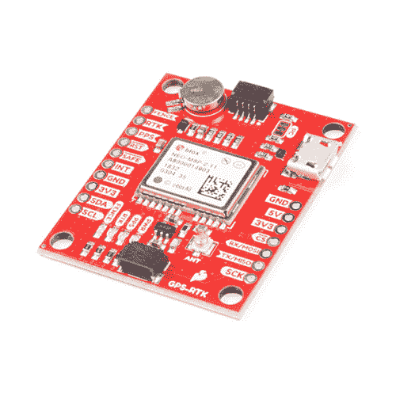](https://www.sparkfun.com/products/15005) 

将**添加到您的[购物车](https://www.sparkfun.com/cart)中！**

 **### [【spark fun GPS-RTK 板- NEO-M8P-2 (Qwiic)](https://www.sparkfun.com/products/15005)

[In stock](https://learn.sparkfun.com/static/bubbles/ "in stock") GPS-15005

SparkFun GPS-RTK 板是 u-blox NEO-M8P-2 模块的一个强大突破。NEO-M8P-2 是一款顶级的移动…

$264.956[Favorited Favorite](# "Add to favorites") 22[Wish List](# "Add to wish list")** **[https://www.youtube.com/embed/PKTDkGRHY0Q/?autohide=1&border=0&wmode=opaque&enablejsapi=1](https://www.youtube.com/embed/PKTDkGRHY0Q/?autohide=1&border=0&wmode=opaque&enablejsapi=1)

### 推荐阅读

在开始之前，请务必查看我们的[什么是 GPS RTK？](https://learn.sparkfun.com/tutorials/what-is-gps-rtk)教程，如果你想预读一点，看看我们的[开始使用 U-Center](https://learn.sparkfun.com/tutorials/getting-started-with-u-center) 。

[](https://learn.sparkfun.com/tutorials/i2c) [### I2C](https://learn.sparkfun.com/tutorials/i2c) An introduction to I2C, one of the main embedded communications protocols in use today.[Favorited Favorite](# "Add to favorites") 128[](https://learn.sparkfun.com/tutorials/serial-basic-hookup-guide) [### 串行基本连接指南](https://learn.sparkfun.com/tutorials/serial-basic-hookup-guide) Get connected quickly with this Serial to USB adapter.[Favorited Favorite](# "Add to favorites") 10[](https://learn.sparkfun.com/tutorials/what-is-gps-rtk) [### 什么是 GPS RTK？](https://learn.sparkfun.com/tutorials/what-is-gps-rtk) Learn about the latest generation of GPS and GNSS receivers to get 14mm positional accuracy 9[](https://learn.sparkfun.com/tutorials/getting-started-with-u-center-for-u-blox) [### u-blox 的 U-Center 入门](https://learn.sparkfun.com/tutorials/getting-started-with-u-center-for-u-blox) Learn the tips and tricks to use the u-blox software tool to configure your GPS receiver.[Favorited Favorite](# "Add to favorites") 2

## 硬件概述

### 通信端口

NEO-M8P-2 的独特之处在于它有四个同时处于活动状态的通信端口。您可以通过 I2C 读取 NMEA 数据，同时通过 UART 发送配置命令，反之亦然。唯一的限制是 SPI 引脚映射到 I2C 和 UART 引脚，因此要么是 SPI，要么是 I2C+UART。USB 端口随时可用。

[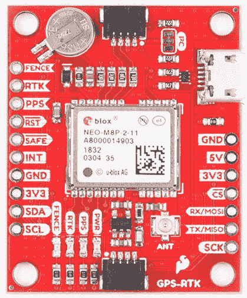](https://cdn.sparkfun.com/assets/learn_tutorials/8/1/4/SparkFun_GPS_GNSS-RTK_Evaluation_Board.jpg)

### 通用串行总线

micro-B 连接器可以轻松地将 NEO-M8P 连接到 u-center，以便进行配置和快速查看 NMEA 句子。也可以通过 USB 连接 Raspberry Pi 或其他 SBC。NEO-M8P 列举了一个串行 COM 端口，它是一个独立于 UART 接口的串行端口。参见[U-Center](https://learn.sparkfun.com/tutorials/getting-started-with-u-center)入门，了解有关将 USB 端口变为串行 COM 端口的更多信息。

[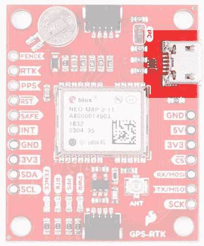](https://cdn.sparkfun.com/assets/learn_tutorials/8/1/4/SparkFun_GPS_GNSS-RTK_Evaluation_Board-USB.jpg)

提供一个 3.3V 调节器，将 5V USB 电压下调至模块所需的 **3.3V** 。可以施加外部 5V 电压，也可以直接提供 3.3V 电压。请注意，如果您直接为电路板提供 3.3V 电压，它应该是一个干净的电源，噪声极小(小于 50mV 的 VPP 纹波是精确定位的理想选择)。

### I ² C(又名 DDC)

u-blox NEO-M8P 有一个“DDC”端口，这实际上只是一个 I2C 端口(没有商标问题的所有麻烦)。所有功能都可以通过 I2C 端口访问，包括阅读 NMEA 语句、发送 UBX 配置字符串、将 RTCM 数据输入模块等。我们已经写了一些草图和一个 Arduino 库来帮助在 I2C 上空快速使用 NEO-M8P。你可以通过搜索' **SparkFun u-blox GNSS** '通过 Arduino library manager 获得该库。查看 [SparkFun u-blox GNSS Arduino 库](https://learn.sparkfun.com/tutorials/gps-rtk-hookup-guide#sparkfun-u-blox-arduino-library)部分了解更多信息。

[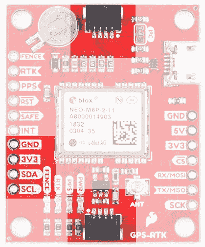](https://cdn.sparkfun.com/assets/learn_tutorials/8/1/4/SparkFun_GPS_GNSS-RTK_Evaluation_Board-I2C.jpg)

### UART/串行

NEO-M8P 提供经典串行引脚，但与 SPI 引脚共享。因为 USB 涵盖了大多数串行需求，所以我们没有明确标记 UART 引脚。默认情况下，UART 引脚使能。确保电路板背面的 DSEL 跳线**打开**。

*   MISO =来自 NEO-M8P 的 TX out
*   MOSI = RX 到 NEO-M8P

[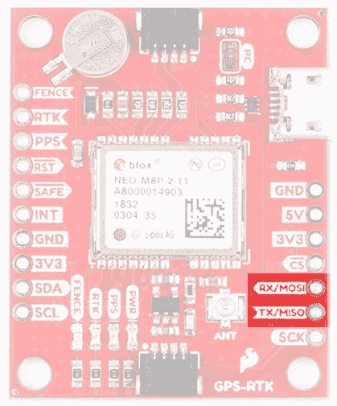](https://cdn.sparkfun.com/assets/learn_tutorials/8/1/4/SparkFun_GPS_GNSS-RTK_Evaluation_Board-UART.jpg)

### 精力

NEO-M8P 也可以配置为 SPI 通信。默认情况下，SPI 端口禁用。要启用 SPI，关闭电路板背面的 **DSEL** 跳线。关闭此跳线将禁用 UART 和 I2C 接口。

[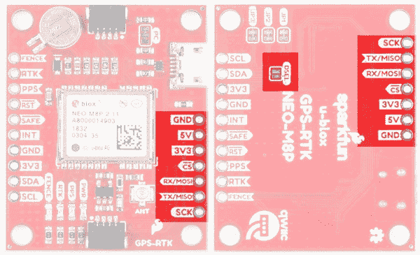](https://cdn.sparkfun.com/assets/learn_tutorials/8/1/4/SparkFun_GPS_GNSS-RTK_Evaluation_Board-SPI.jpg)

### 控制引脚

下面突出显示了控制引脚。

[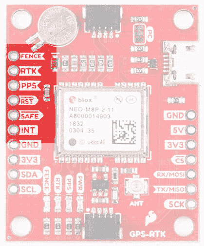](https://cdn.sparkfun.com/assets/learn_tutorials/8/1/4/SparkFun_GPS_GNSS-RTK_Evaluation_Board-GPIO.jpg)

这些引脚用于 NEO-M8P 的各种额外控制:

*   **FENCE** : Geofence 输出引脚。配置有 U 型中心。设置地理围栏后，将变为高电平或低电平。当模块退出设定的边界时，用于触发警报和动作。
*   **RTK** : RTK 输出引脚。当模块处于正常 GPS 模式时，保持高电平。当接收到 RTCM 校正且模块进入 RTK 浮点模式时，开始闪烁。当模块进入 RTK 固定模式并开始输出厘米级精确位置时，变为低电平。
*   **PPS** :每秒脉冲输出引脚。当模块获得基本 GPS/GNSS 位置锁定时，开始以 1Hz 的频率闪烁。
*   **RST** :复位输入引脚。将此线拉低以复位模块。
*   **SAFE** : Safeboot 输入 pin。这是模块固件更新所必需的，通常不应使用或连接。
*   **INT** :中断输入/输出引脚。可以使用 U-Center 进行配置，以将模块从深度睡眠中唤醒，或者针对各种模块状态输出中断。

### 天线

NEO-M8P 需要高质量的 GPS 或 GNSS(首选)天线。提供了一种 U.FL 连接器。注意:U.FL 连接器仅额定几个配合周期(大约 30 °),所以我们建议您设置它并忘记它。穿过安装孔的 [U.FL 到 SMA 电缆](https://www.sparkfun.com/products/9145)提供了一个坚固的连接，如果需要，也可以很容易地在 SMA 连接处断开。可以使用低成本的磁性 [GPS/GNSS 天线](https://www.sparkfun.com/categories/18)(查看 [u-blox 白皮书](https://cdn.sparkfun.com/assets/learn_tutorials/8/1/4/AntennasForRTK_WhitePaper__UBX-16010559_.pdf))，但需要在天线下放置一个 4" / 10cm 的金属盘作为接地层。

[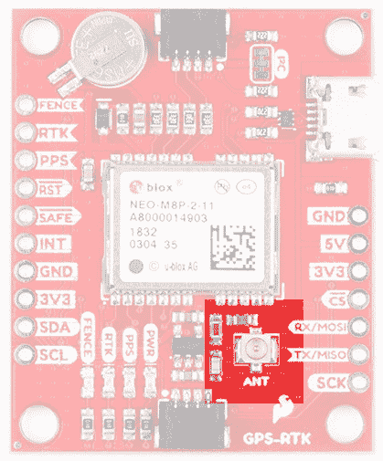](https://cdn.sparkfun.com/assets/learn_tutorials/8/1/4/SparkFun_GPS_GNSS-RTK_Evaluation_Board-Antenna.jpg)

### 发光二极管

该板包括四个状态指示灯，如下图所示。

[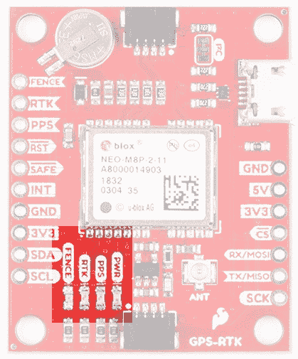](https://cdn.sparkfun.com/assets/learn_tutorials/8/1/4/SparkFun_GPS_GNSS-RTK_Evaluation_Board-LEDs.jpg)

当通过 USB 或 Qwiic 总线激活 3.3V 时，电源( **PWR** ) LED 将亮起。

一旦实现位置锁定，每秒脉冲( **PPS** ) LED 将随着每次成功更新而亮起。

通电时， **RTK** LED 将持续点亮。一旦成功接收到 RTCM 数据，它将开始闪烁。这是一个很好的方式来看看 NEO-M8P 是否从各种来源获得 RTCM。

**围栏** LED 可配置为地理围栏应用的开/关。

### 针织套衫

电路板背面有四个跳线用于配置 GPS-RTK。

[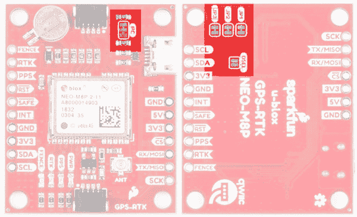](https://cdn.sparkfun.com/assets/learn_tutorials/8/1/4/SparkFun_GPS_GNSS-RTK_Evaluation_Board-Jumpers.jpg)

关闭 **DSEL** 使能 SPI 接口，禁用 UART 和 I2C 接口。USB 仍然可以工作。

切断 **I2C** 跳线将从 I2C 总线上移除 2.2k 欧姆电阻。如果您的 I2C 总线上有许多设备，您可能需要移除这些跳线。不知道怎么剪跳线？[看这里！](https://learn.sparkfun.com/tutorials/how-to-work-w-jumper-pads-and-pcb-traces/cutting-a-trace-between-jumper-pads)

跳线 **JP1** 、 **JP2** 、 **JP3** 被提供在板的后部，以允许各种状态 led 的隔离。

### 备用电池

MS621FE 充电电池维持 NEO-M8P 上的电池支持 RAM (BBR)。这允许更快的位置锁定。BBR 也用于模块配置保持。当通电时，电池会自动涓流充电，并应在断电的情况下保持设置和 GNSS 轨道数据长达两周。

[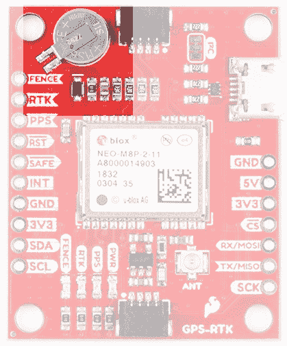](https://cdn.sparkfun.com/assets/learn_tutorials/8/1/4/SparkFun_GPS_GNSS-RTK_Evaluation_Board-RTC.jpg)

## 连接天线

单位 FL 连接器非常好，但它们是为在笔记本电脑等小型嵌入式应用中实现而设计的。将 U.FL 连接器暴露在野外会有损坏的风险。为了防止损坏 U.FL 连接，我们建议将 U.FL 电缆穿过支座孔，然后连接 U.FL 连接器。这将极大地减轻天线连接的应力。现在附上你选择的 SMA 天线。

[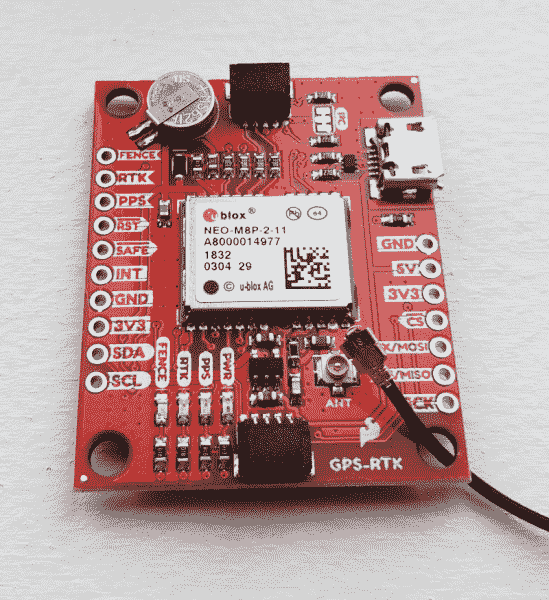](https://cdn.sparkfun.com/assets/learn_tutorials/8/1/4/SparkFun_GPS-RTK_Antenna_Through_Hole.jpg)**Be Careful!** U.FL connectors are easily damaged. Make sure the connectors are aligned, flush face to face (not at an angle), then press down using a rigid blunt edge such as the edge of a PCB or point of a small flat head screwdriver. For more information, check out our [tips and tricks on using a u.FL connector](https://learn.sparkfun.com/tutorials/three-quick-tips-about-using-ufl).

如果你在室内，你必须用一根足够长的 T2 SMA 延长线来定位天线，使其能够清晰地看到天空。这意味着在天线和天空之间没有树木、建筑、墙壁、车辆或混凝土金属物。确保将天线安装在 4 英寸/10 厘米的金属接地板上，以增强接收效果。

[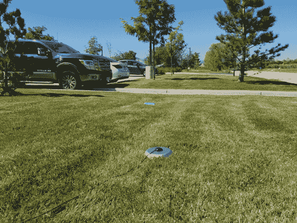](https://cdn.sparkfun.com/assets/learn_tutorials/8/1/4/GPS_RTK_Antenna_with_clear_view_of_sky.jpg)

## 将 GPS-RTK 连接到校正源

在去野外工作之前，最好了解如何获取 RTCM 数据，以及如何将数据传输到 GPS-RTK。在本例中，我们将展示如何从 UNAVCO 网络获取校正数据，使用 RTKLIB 获取该数据，并通过串行传输至 GPS-RTK。

#### 所需材料

*   1x [GPS-RTK](https://www.sparkfun.com/products/14980)
*   1x [L1/L2 GNSS 天线](https://www.sparkfun.com/products/15192)
*   1 个 4 英寸或更大的金属板
*   1 根 SMA 延长线(如果需要获得清晰的天空视野)
*   2x [micro-B USB 线缆](https://www.sparkfun.com/products/14742)
*   1x [串行基本](https://www.sparkfun.com/products/14050)
*   几根[跳线](https://www.sparkfun.com/products/12795)

#### 所需软件

*   免费 RTCM 提供商(如 UNAVCO)的凭证
*   [U 形中心](https://www.u-blox.com/en/product/u-center)
*   下载并解压 [RTKLIB](http://www.rtklib.com/) 。我们将使用 2.4.2。

UNAVCO 在美国的覆盖率相当高。使用他们的[互动地图](http://www.unavco.org/instrumentation/networks/status/all/realtime)找到你所在位置附近的车站。如果距离超过 10 公里(6 英里)也没关系，我们只是在练习。

[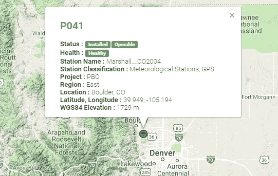](https://cdn.sparkfun.com/assets/learn_tutorials/8/1/4/UNAVCO_site.jpg)

P041 站点离 SparkFun 总部很近。我们会用到它。要访问 UNAVCO 数据馈送，您需要向[rtgps@unavco.org](mailto:rtgps@unavco.org)发送电子邮件请求凭据。请告知 UNAVCO 您是否隶属于任何企业、学校或组织，以及您是否将该帐户用于个人用途。进入 UNAVCO 是免费的；我相信他们需要这些信息来报告他们的资助。

一旦你有了你的 UNAVCO 凭证，打开 RTKLIB(在 Windows 中运行*rtklaunch.exe*)。这个小窗口允许你启动各种 RTK 程序。在本教程中，我们将使用 RTKNAVI，右边第二个按钮。

[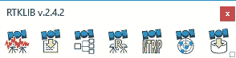](https://cdn.sparkfun.com/assets/learn_tutorials/8/1/4/RTKLaunch.jpg)

RTKNAVI 允许您连接到来自不同提供商的 RTCM 提要，包括 UNAVCO。点击小“I”按钮。

[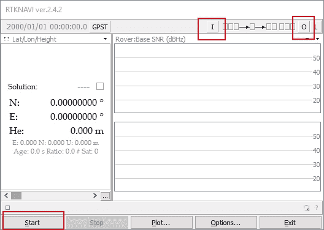](https://cdn.sparkfun.com/assets/learn_tutorials/8/1/4/RTKnavi.jpg)

从输入流窗口中点击“**基站**旁边的复选框，从下拉列表中选择 **NTRIP 客户端**和 **RTCM 3** 格式。接下来点击 Opt 下面的三个小点——这将打开 NTRIP 客户端配置选项。

[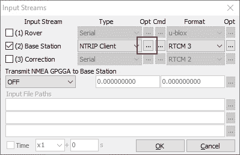](https://cdn.sparkfun.com/assets/learn_tutorials/8/1/4/RTKnavi-input_streams.jpg)

输入您获得的 UNAVCO 域、端口和凭据。接下来点击 **Ntrip...**按钮。这将启动 Ntrip 浏览器，以便我们可以定位 P041 站点。

[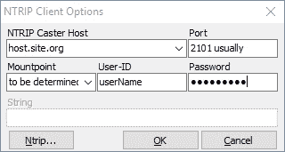](https://cdn.sparkfun.com/assets/learn_tutorials/8/1/4/RTKnavi-input_streams-client_options.jpg)

Ntrip 浏览器允许您连接到不同的提供商，并查看哪些流可用。我希望它像能够搜索给定位置附近的所有 RTCM 溪流一样简单，但目前没有选项存在。相反，我们必须连接到每个提供者，并查看他们提供什么位置，以及给定位置产生什么类型的校正流。记住，NEO-M8P 只适用于 RTCM 3.x

[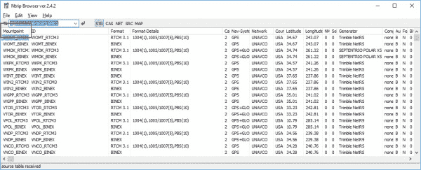](https://cdn.sparkfun.com/assets/learn_tutorials/8/1/4/RTKnavi-input_streams-client_options-ntrip_browser.jpg)

这个列表很大，我们正在寻找 P041。点击**挂载点**列标题，按字母顺序排列列表。

[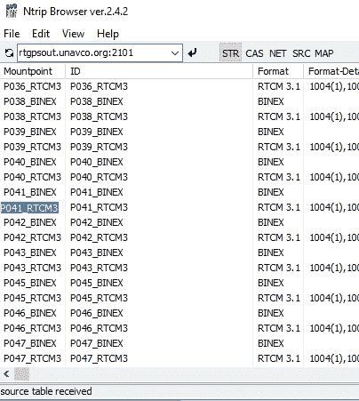](https://cdn.sparkfun.com/assets/learn_tutorials/8/1/4/RTKnavi-input_streams-client_options-ntrip_browser-mountpoint.jpg)

一旦我们确定了 P041 的位置，我们就要 RTCM 信号。将挂载点复制并粘贴回 RTKNAVI 中的“**挂载点**”框中。一旦你输入了所有的证书和挂载点，点击 **OK** 关闭 *NTRIP 客户端选项*窗口。您也可以关闭 Ntrip 浏览器。

应该配置输入流，因此在输入流窗口中单击 OK 以完成配置。在 RTKNAVI 窗口中点击“ **Start** ，测试与 UNAVCO 服务器的连接。

[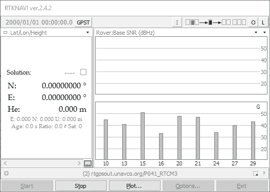](https://cdn.sparkfun.com/assets/learn_tutorials/8/1/4/RTKnavi-streaming.jpg)

成功！我们正在接收一个数据流。现在我们需要输出这些数据。单击“记录”的 L 按钮。

[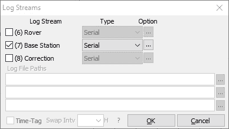](https://cdn.sparkfun.com/assets/learn_tutorials/8/1/4/RTKnavi-streaming-log_stream.jpg)

我们希望将基站流记录到串行端口，因此现在是连接您的[串行基本](https://www.sparkfun.com/products/14050)或 FTDI 板的好时机。一旦板枚举，你应该有一个新的串行端口。如果你遇到问题或需要司机检查[串行基本连接指南](https://learn.sparkfun.com/tutorials/serial-basic-hookup-guide)。

点击'**...**按钮来配置你的串口。请注意，您需要选择与 GPS-RTK 模块配置相同的波特率。默认情况下，NEO-M8P 以 **9600bps** 8-N-1 进行通信，因此使用此设置。正确配置后，串行基本接口上的 TX LED 应每秒闪烁一次，表示 UNAVCO 服务器正在将数据一路推送到串行基本接口上的 TX 引脚。

[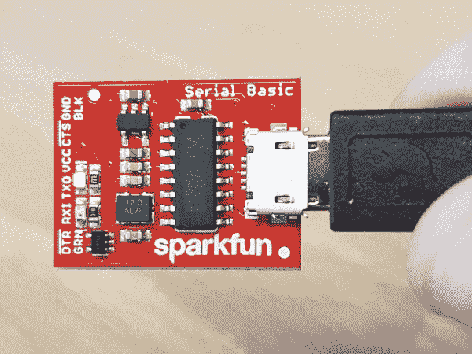](https://cdn.sparkfun.com/assets/learn_tutorials/8/1/4/RTCM_on_Serial_Basic.jpg)

RTCM 管道完工了。现在我们需要将“最后一英寸”连接到 NEO-M8P 上。

[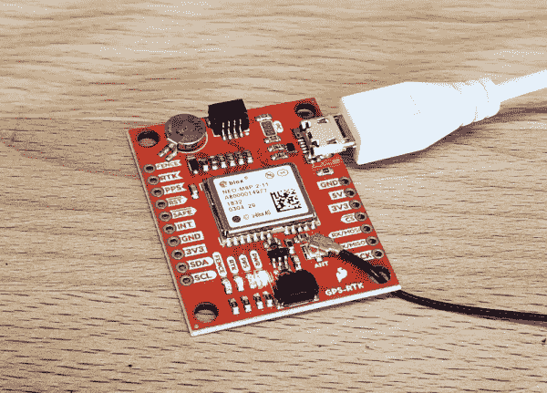](https://cdn.sparkfun.com/assets/learn_tutorials/8/1/4/SparkFun_GPS-RTK_USB_and_antenna_connected.jpg)

是时候给 GPS-RTK 板加电了。将 micro-B 电缆连接到 GPS-RTK 板上。电源指示灯应该亮起。从 U-blox 打开 U-Center 软件。如果您还没有阅读过[U-Center](https://learn.sparkfun.com/tutorials/getting-started-with-u-center)入门，请务必阅读。幸运的是，NEO-M8P 的默认配置允许它接收 RTCM 校正数据，而无需任何进一步的更改。你所需要做的就是向 NEO-M8P 提供串行数据，它将开始计算高精度定位解决方案。

选择正确的 COM 端口并开始查看 NMEA 数据。你应该很快就能锁定仓位。一旦 PPS LED 开始闪烁，你就可以开始将 RTCM 数据传输到 GPS-RTK 板。

[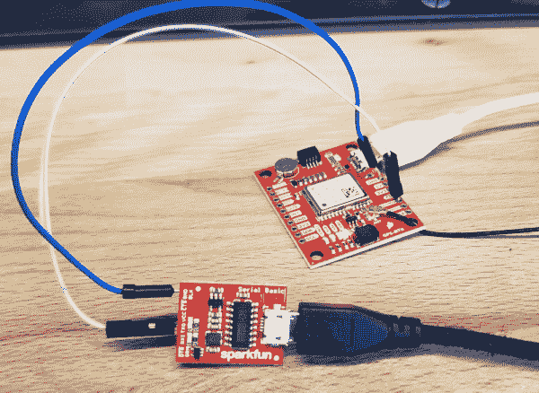](https://cdn.sparkfun.com/assets/learn_tutorials/8/1/4/SparkFun_GPS-RTK_RTCM_connected_over_Serial_Basic.jpg)

串行基本板仍应每秒闪烁一次，显示来自 UNAVCO 服务器的 RTCM 数据。使用两根跳线将串行基础上的 GND 连接到 GPS-RTK 上的 GND。接下来，将 TXO 连接到 GPS-RTK 上的 MOSI 引脚。默认情况下，MOSI 引脚是 RX UART 引脚(当 **DSEL** 跳线打开时)。没有焊料的跳线显然是一个不稳定的设置，但我们只是在测试。安排好事情，让这种联系成为半永久性的。几秒钟内，您应该会看到 RTK LED 开始闪烁。

恭喜你！您的 GPS 模块已进入 RTK 浮点模式。当 RTK LED 完全关闭时，则模块已经解决了载波模糊，并进入 RTK 固定模式，正在输出厘米级位置！

一旦 GPS-RTK 成功接收到 RTCM 校正数据，就可以开始计划如何获取 RTCM 数据并将其传送给 GPS-RTK。选择范围很广，多种多样:

*   可以在 Android 应用程序上获取 Ntrip 数据，并通过蓝牙串行设备(如 [Bluetooth Mate Silver](https://www.sparkfun.com/products/12576) )进行传输。将蓝牙串行设备连接到 GPS-RTK 串行引脚非常简单。
*   如果你需要最大的便携性，无线电链路可以是最低功率、最小尺寸的。SparkFun 提供各种 [LoRa 无线电和天线](https://www.sparkfun.com/categories/410)。在微控制器的帮助下，这些无线电可以通过 Qwiic I2C 端口、串行甚至 SPI 从 LoRa 回程传输数据。
*   如果您的终端应用已经需要 GSM 或 LTE-CAT 等互联网连接，那么微控制器可以通过互联网连接到 Ntrip 服务器，并通过 GPS-RTK 上的串行或 I2C 连接传输 RTCM 数据。

## SparkFun u-blox Arduino 图书馆

**Note:** This example assumes you are using the latest version of the Arduino IDE on your desktop. If this is your first time using Arduino, please review our tutorial on [installing the Arduino IDE.](https://learn.sparkfun.com/tutorials/installing-arduino-ide) If you have not previously installed an Arduino library, please check out our [installation guide.](https://learn.sparkfun.com/tutorials/installing-an-arduino-library)

GPS-RTK Arduino 库支持通过 I2C 读取 NMEA 数据，以及通过 I2C 发送二进制 UBX 配置命令。这有助于配置 NEO-M8P-2 等高级模块。

SparkFun u-blox Arduino 库可以通过搜索' **SparkFun u-blox GNSS** '使用 Arduino 库管理器下载，或者您可以从 [GitHub 库](https://github.com/sparkfun/SparkFun_u-blox_GNSS_Arduino_Library)获取 zip 文件:

[SparkFun U-blox Arduino Library (ZIP)](https://github.com/sparkfun/SparkFun_u-blox_GNSS_Arduino_Library/archive/master.zip)

一旦你安装了库，就可以检查各种例子。

*   **例 1:** 使用 u-blox 模块 SAM-M8Q、NEO-M8P 等阅读 I ² C 上的 NMEA 句子
*   **示例 2:** 使用 MicroNMEA 库解析 NMEA 句子。这个例子还演示了如何重写`processNMEA`函数，这样你就可以将来自 u-blox 模块的 NMEA 字符定向到你喜欢的任何库、显示器、收音机等。
*   **示例 3:** 获取纬度、经度、高度和可见卫星(SIV)。这个例子还演示了如何关闭从 I ² C 端口发出的 NMEA 消息。你仍然可以在 UART1 和 USB 上看到 NMEA，但在 I ² C 上看不到。仅使用 UBX 二进制消息有助于减少 I ² C 流量，并且是一个重量轻得多的协议。
*   **示例 4:** 显示您的定位类型，最常见的两种是无定位和全 3D 定位。此草图还显示了如何确定您是否有 RTK 修复以及修复的类型(浮动与固定)。
*   **示例 5:** 显示了如何获取当前速度、航向和精度因子。
*   **Example6:** 演示如何将输出速率从默认的每秒 1 个提高到每秒多个；某些模块高达 30Hz！
*   **例 7:**SAM-M8Q 等旧模块使用旧协议(版本 18)，而 ZED-F9P 等新模块使用最新协议(版本 27)删除一些命令。该草图显示了如何查询模块以获取协议版本。
*   **示例 8:** u-blox 模块使用 I ² C 地址 0x42，但这可通过软件配置。该草图将允许您更改模块的 I ² C 地址。
*   **例 9:** 海拔不是简单的测量。这张草图显示了如何获得基于椭球面的高度和基于 MSL(平均海平面)的高度读数。
*   **例 10:** 有时候你只需要对硬件进行硬复位。该草图显示了如何将 u-blox 模块设置回出厂默认设置。
*   **NEO-M8P:**NEO-M8P 的具体示例。
    *   **NEO-M8P 示例 1:** 发送 UBX 二进制命令，启用 U-blox NEO-M8P-2 模块上的 RTCM 语句。此示例是将 NEO-M8P 设置为基站所需的步骤之一。要了解更多信息，请查看 u-blox 设置 RTK 链接的手册。
    *   **NEO-M8P 示例 2:** 本示例扩展了前面的示例，将所有命令发送到 NEO-M8P-2，使其作为基础运行。此外，`processRTCM`功能被暴露。这允许用户重写该功能，以将 RTCM 字节定向到用户想要的任何连接(无线电、串行等)。
    *   **NEO-M8P 示例 3:** 这是与 NEO-M8P 的示例 2 相同的示例。然而，数据通过 I ² C 发送到串行 LCD
*   **ZED-F9P:**ZED-F9P 的具体例子。
    *   **ZED-F9P 示例 1:** 该模块能够实现高精度解决方案。这张草图显示了如何检查解决方案的准确性。看着我们的定位精度下降到毫米级是很有趣的。
    *   **ZED-F9P 例 2:**ZED-F9P 采用了 VALGET/VALSET/VALDEL 的全新 u-blox 配置系统。这张草图展示了这些方法的基础。
    *   **ZED-F9P 例 3:** 设置 ZED-F9P 为基站，输出 RTCM 数据。
    *   **ZED-F9P 示例 4:** 这是与 ZED-F9P 的示例 3 相同的示例。然而，数据通过 I ² C 发送到串行 LCD

这个 SparkFun u-blox 库真正关注 I ² C，因为它比串行更快，并且支持菊花链。该库也使用 UBX 协议，因为它比 NMEA 解析需要更少的开销，并且没有 NMEA 的精度限制。

## 设置基站

**Heads up!** This section is a bit out of date. We've got a shiny new [How to Build a GNSS Reference Station](https://learn.sparkfun.com/tutorials/how-to-build-a-diy-gnss-reference-station) tutorial that provides up to date information. We plan to keep this section for reference.

如果您的位置距离校正站超过 20 公里，您可以使用 NEO-M8P-2 创建自己的校正站。u-blox 提供了很好的设置指南，显示了通过 u-center 所需的各种设置。我们将涵盖如何设置 GPS-RTK 只使用 I2C 命令。这将实现输出 RTCM 校正数据的基站的无头(无计算机)配置。您可以在产品视频中观看简短的演示:

[https://www.youtube.com/embed/PKTDkGRHY0Q/?autohide=1&border=0&wmode=opaque&enablejsapi=1](https://www.youtube.com/embed/PKTDkGRHY0Q/?autohide=1&border=0&wmode=opaque&enablejsapi=1)

在开始之前，我们建议您使用 u-center 配置模块。使用 U-Center 查看我们关于[的教程，然后阅读关于](https://learn.sparkfun.com/tutorials/getting-started-with-u-center)[的 u-blox 数据表，使用 U-Center](https://cdn.sparkfun.com/assets/learn_tutorials/8/1/4/C94-M8P-AppBoard_UserGuide__UBX-15031066_.pdf) 为 RTK 配置 NEO-M8P。一旦你在实验室里成功地控制了模块，那么考虑去户外。

在本练习中，我们将使用以下零件:

*   [SparkFun GPS-RTK 板](https://www.sparkfun.com/products/15005)
*   [SparkFun 黑板](https://www.sparkfun.com/products/14669)让 I2C 变得简单
*   [微波电缆](https://www.sparkfun.com/products/14741)如果你需要的话
*   [天线 L1/L2 GNSS 3-5V 磁架](https://www.sparkfun.com/products/15192)
*   [GPS 天线接地板](https://www.sparkfun.com/products/17519)
*   [U.FL 至 SMA 电缆](https://www.sparkfun.com/products/9145)
*   [两根 Qwiic 电缆](https://www.sparkfun.com/search/results?term=qwiic+cable)
*   焊接有 [Qwiic 适配器](https://www.sparkfun.com/products/14495)的 20x4 SerLCD
*   1x 20+ft [SMA extension](https://www.sparkfun.com/products/17495) 在第一次尝试基站时非常方便，因此您可以坐在室内用笔记本电脑分析 GPS-RTK 的输出
*   标准的相机三脚架

NEO-M8P-2 可以使用串行、SPI 或 I2C 进行配置。我们是 I2C 的 daisychain-ability 的粉丝，所以我们将专注于 Qwiic 系统。在这个练习中，我们将使用两根 Qwiic 电缆将液晶显示器和 GPS-RTK 连接到黑板上。

[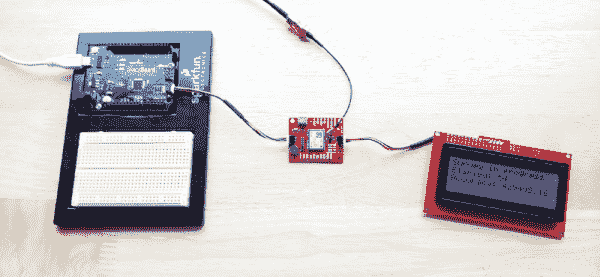](https://cdn.sparkfun.com/assets/learn_tutorials/8/1/4/SparkFun_GPS_RTK_Survey_In_Mode.jpg)

对于天线，你需要一个清晰的天空视野。天线位置越好，系统的精确度和性能就越好。我们设计了 [GPS 天线接地板](https://www.sparkfun.com/products/15004)来简化设置。该板有一个“螺纹孔，可以直接拧到相机三脚架上。选择足够厚的板厚度，以便螺纹螺钉与板齐平，从而不会干扰天线。不知道我们为什么要用接地板？阅读关于使用 RTK 低成本 GNSS 天线的[的 u-blox 白皮书。安装磁性安装天线，将 SMA 电缆连接到 U.FL 到 SMA 电缆，再连接到 GPS-RTK 板。](https://cdn.sparkfun.com/assets/0/c/0/1/c/AntennasForRTK_WhitePaper__UBX-16010559_.pdf)

[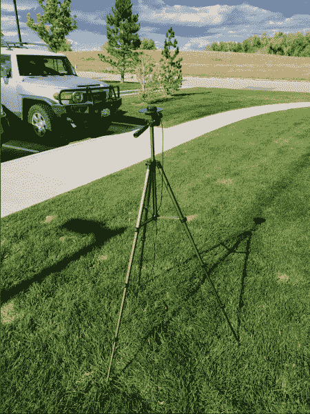](https://cdn.sparkfun.com/assets/learn_tutorials/8/1/4/SparkFun_GPS_RTK_Antenna_on_a_camera_tripod.jpg)

启动基站只需三个步骤:

*   启用调查模式 5 分钟(300 秒)
*   启用 RTCM 输出消息
*   开始通过选择的回程传输 RTCM 数据包

一定要拿到 [SparkFun u-blox GNSS Arduino 库](https://github.com/sparkfun/SparkFun_u-blox_GNSS_Arduino_Library)。您可以通过搜索“SparkFun u-blox GNSS”通过库管理器轻松安装。安装完成后，点击`File->Examples->SparkFun_u-blox_GNSS_Arduino_Library`。

NEO-M8P 子文件夹包含一些特定于其设置的草图。*示例 3* 演示了如何向 GPS-RTK 发送各种命令以启用勘测模式。让我们讨论一下重要的代码。

```
language:c
response = myGNSS.enableSurveyMode(300, 2.000); //Enable Survey in, 300 seconds, 2.0m 
```

该库能够通过 I2C 发送 UBX 二进制命令以及所有必要的报头、包长度和 CRC 字节。`enableSurveyMode(minimumTime, minimumRadius)`命令完成了告诉模块进入调查模式的所有工作。模块将开始记录锁定数据并计算 3D 标准偏差。当达到最小时间和最小半径时，测量过程结束。u-blox 推荐 300 秒(5 分钟)，半径 2m。天空清晰，低成本 GNSS 天线安装在[接地板](https://www.sparkfun.com/products/15004)上，我们看到勘测在 301 秒内完成，半径约为 1.5 米

```
language:c
response &= myGNSS.enableRTCMmessage(UBX_RTCM_1005, UBX_RTCM_I2C_PORT, 1); //Enable message 1005 to output through I2C port, message every second
response &= myGNSS.enableRTCMmessage(UBX_RTCM_1077, UBX_RTCM_I2C_PORT, 1);
response &= myGNSS.enableRTCMmessage(UBX_RTCM_1087, UBX_RTCM_I2C_PORT, 1);
response &= myGNSS.enableRTCMmessage(UBX_RTCM_1230, UBX_RTCM_I2C_PORT, 10); //Enable message every 10 seconds 
```

这四条线路支持第二个 GPS-RTK 接收校正数据所需的四个 RTCM 输出消息。一旦这些语句被启用(并假设勘测过程完成)，GPS-RTK 基本模块将在 NMEA 语句之后每秒开始输出 RTCM 数据(RTCM_1230 语句将每 10 秒输出一次)。您可以在这里查看这个输出的示例[。](https://cdn.sparkfun.com/assets/learn_tutorials/8/1/4/Example_RTCM_Binary_Output.txt)

RTCM 校正数据的大小各不相同，但通常约为每秒 350 字节(传输 1230 字节时，约为每 10 秒 500 字节)。

```
language:c
//This function gets called from the SparkFun u-blox GNSS Arduino Library.
//As each RTCM byte comes in you can specify what to do with it
//Useful for passing the RTCM correction data to a radio, Ntrip broadcaster, etc.
void SFE_UBLOX_GNSS::processRTCM(uint8_t incoming)
{
  //Let's just pretty-print the HEX values for now
  if (myGNSS.rtcmFrameCounter % 16 == 0) Serial.println();
  Serial.print(" ");
  if (incoming < 0x10) Serial.print("0");
  Serial.print(incoming, HEX);
} 
```

如果你在野外有一个需要修正数据的“漫游者”,你需要把 RTCM 字节传给它。SparkFun u-blox 库自动检测 NMEA 句子和 RTCM 数据之间的差异。`processRTCM()`功能允许您将 RTCM 校正数据“传输”到您选择的通道。一旦基站完成调查并启用 RTCM 消息，您的自定义`processRTCM()`功能可以将每个字节传递给任意数量的通道:

*   诸如 LoRa 或蜂窝的无线系统
*   通过 Ntrip caster 使用 WiFi 或有线以太网在互联网上发布字节
*   通过 RS485 等有线解决方案

`processRTCM()`函数的强大之处在于它不在乎；它向用户提供输入字节，并且不知道反向信道。

**Heads up!** We’ve been experimenting with various LoRa solutions and the bandwidth needed for RTCM (~500 bytes per second) is right at the usable byte limit for many LoRa setups. It’s possible but you may need to adjust your LoRa settings to reach the throughput necessary for RTK.

配置火星车怎么样？u-blox 将 NEO-M8P 设计为一旦在任何端口上检测到 RTCM 数据就自动进入 RTK 模式。只需将 RTCM 字节从你的反向信道推入漫游者 GPS-RTK 上的一个端口(UART、SPI、I2C ),定位精度将从米到厘米。漫游者的 NMEA 信息将包含改进的纬度/经度数据，你会以令人难以置信的准确度知道你在哪里。看着很有意思！

## NMEA 和 RTK

### 我真的可以使用高精度 GPS 接收机的 NMEA 吗？

是啊！除了 NMEA 的句子已经足够精确了。NMEA 的句子大概是这样的:

```
language:bash
$GNGGA,012911.00,4003.19080,N,10416.95542,W,1,12,0.75,1647.1,M,-21.3,M,,*4F 
```

NMEA 以 ddmm.mmmmm 格式输出坐标。那么最低有效位的权重是多少呢？换个说法，一位数的变化有什么影响？

```
language:bash
104 16.95542 
```

相对

```
language:bash
104 16.95543 
```

如果我们知道在赤道 1 度纬度是 111.3 公里[，我们可以收集到一分钟内的变化:](https://en.wikipedia.org/wiki/Decimal_degrees)

*   1 度= 60 分钟
*   1 分钟= 1 度/60 = 111.32 公里/60 = 1.855 公里
*   1 分钟= 1855 米
*   0.1 分钟= 185.5 米
*   0.01 分钟= 18.55 米
*   0.001 分钟= 1.855 米
*   0.0001 分钟= 0.1855 米= 185.5 毫米
*   0.00001 分钟= 0.0185 米= 18.55 毫米= 1.855 厘米

使用 NMEA 语句，NEO-M8P 将只能传达第 5 个位置的每个数字的大约 1.5 厘米的位置变化。这非常接近模块的 2.5 厘米精度。如果您想要额外的精度，您应该考虑使用 UBX 协议，它可以以 dd.dddddddd 格式输出高达 8 位的精度，这将使您的精度降至 1.11 毫米！

## 资源和更进一步


## 准备好动手操作 GPS 了吗？

我们为您准备了一个页面！我们将带您了解 GPS 的基本工作原理、所需的硬件以及项目教程，帮助您入门。

带我去那里！

享受你新发现的超能力:亚分米级 GPS！

有关 GPS-RTK 的更多信息，请查看以下链接:

*   [示意图(PDF)](https://cdn.sparkfun.com/assets/e/9/4/4/1/Qwiic_GPS-RTK_-_ublox_NEO-M8P.pdf)
*   [老鹰文件(ZIP)](https://cdn.sparkfun.com/assets/4/d/d/b/a/Qwiic_GPS-RTK_-_ublox_NEO-M8P.zip)
*   [NEO-M8P-2 的 RTCM 输出示例](https://cdn.sparkfun.com/assets/5/3/8/5/7/Example_RTCM_Binary_Output.txt)
*   [NEO-M8P-2 数据表(PDF)](https://cdn.sparkfun.com/assets/2/f/6/8/3/NEO-M8P_DataSheet__UBX-15016656_.pdf)
*   使用 U-Center 来[配置基站](https://cdn.sparkfun.com/assets/6/e/7/1/0/C94-M8P-AppBoard_UserGuide__UBX-15031066_.pdf) RTCM 输出的 NEO-M8P
*   [NEO-M8P 硬件集成手册(PDF)](https://cdn.sparkfun.com/assets/a/a/d/2/2/NEO-M8P_HardwareIntegrationManual__UBX-15028081_.pdf)
*   [NEO-M8P 产品摘要(PDF)](https://cdn.sparkfun.com/assets/6/2/0/3/a/NEO-M8P_ProductSummary__UBX-15015836_.pdf)
*   [u-blox M8 系列协议](https://cdn.sparkfun.com/assets/0/9/4/3/5/u-blox8-M8_ReceiverDescrProtSpec__UBX-13003221__Public.pdf)
*   [U-blox ECCN](https://cdn.sparkfun.com/assets/9/b/5/5/8/Ublox_ECCN.pdf) 预告
*   开源代码库
    *   [Arduino 库](https://github.com/sparkfun/SparkFun_u-blox_GNSS_Arduino_Library)
    *   [产品回购](https://github.com/sparkfun/Qwiic_GPS-RTK)
*   [SFE 产品展示区](https://youtu.be/PKTDkGRHY0Q)

需要一些灵感吗？查看一些相关教程:

[](https://learn.sparkfun.com/tutorials/building-an-autonomous-vehicle-the-batmobile) [### 建造自主车辆:蝙蝠战车](https://learn.sparkfun.com/tutorials/building-an-autonomous-vehicle-the-batmobile) Documenting a six-month project to race autonomous Power Wheels at the SparkFun Autonomous Vehicle Competition (AVC) in 2016\.[Favorited Favorite](# "Add to favorites") 8[](https://learn.sparkfun.com/tutorials/what-is-gps-rtk) [### 什么是 GPS RTK？](https://learn.sparkfun.com/tutorials/what-is-gps-rtk) Learn about the latest generation of GPS and GNSS receivers to get 14mm positional accuracy 9[](https://learn.sparkfun.com/tutorials/getting-started-with-u-center-for-u-blox) [### u-blox 的 U-Center 入门](https://learn.sparkfun.com/tutorials/getting-started-with-u-center-for-u-blox) Learn the tips and tricks to use the u-blox software tool to configure your GPS receiver.[Favorited Favorite](# "Add to favorites") 2[](https://learn.sparkfun.com/tutorials/gps-rtk2-hookup-guide) [### GPS-RTK2 连接指南](https://learn.sparkfun.com/tutorials/gps-rtk2-hookup-guide) Get precision down to the diameter of a dime with the new ZED-F9P from u-blox.[Favorited Favorite](# "Add to favorites") 9[](https://learn.sparkfun.com/tutorials/setting-up-a-rover-base-rtk-system) [### 设置基于流动站的 RTK 系统](https://learn.sparkfun.com/tutorials/setting-up-a-rover-base-rtk-system) Getting GNSS RTCM correction data from a base to a rover is easy with a serial telemetry radio! We'll show you how to get your high precision RTK GNSS system setup and running.[Favorited Favorite](# "Add to favorites") 15[](https://learn.sparkfun.com/tutorials/how-to-build-a-diy-gnss-reference-station) [### 如何建立一个 DIY GNSS 参考站](https://learn.sparkfun.com/tutorials/how-to-build-a-diy-gnss-reference-station) Learn how to affix a GNSS antenna, use PPP to get its ECEF coordinates and then broadcast your own RTCM data over the internet and cellular using NTRIP to increase rover reception to 10km 14**