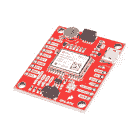
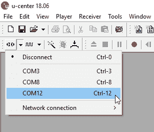

# u-blox 的 U-Center 入门

> 原文：<https://learn.sparkfun.com/tutorials/getting-started-with-u-center-for-u-blox>

## 介绍

u-blox 的 U-center 是一个在 Windows 下配置 u-blox GPS 接收机的免费软件工具。U-center 是一个有很多界面元素的密集程序。一开始可能会让人不知所措，但随着时间的推移，它会变得更容易使用。尽管它的 GUI 有缺点，但它对于配置 u-blox 系列模块非常强大(例如 [NEO-M8P-2](https://www.sparkfun.com/products/15005) 和 [SAM-M8Q](https://www.sparkfun.com/products/15210) 等等)。在本教程中，我们将探索 NEO-M8P-2 的一些功能。

### 所需材料

要跟随本教程，您将需要以下材料。你可能不需要所有的东西，这取决于你有什么和 u-blox 板的设计。在本指南中，我们将使用 NEO-M8P-2。请随意将它(或另一个 u-blox 模块)添加到您的购物车中，通读指南，并根据需要调整购物车。

 

将**添加到您的[购物车](https://www.sparkfun.com/cart)中！**

 **### [【spark fun GPS-RTK 板- NEO-M8P-2 (Qwiic)](https://www.sparkfun.com/products/15005)

[In stock](https://learn.sparkfun.com/static/bubbles/ "in stock") GPS-15005

SparkFun GPS-RTK 板是 u-blox NEO-M8P-2 模块的一个强大突破。NEO-M8P-2 是一款顶级的移动…

$264.956[Favorited Favorite](# "Add to favorites") 22[Wish List](# "Add to wish list")**** 

将**添加到您的[购物车](https://www.sparkfun.com/cart)中！**

 **### 

[In stock](https://learn.sparkfun.com/static/bubbles/ "in stock") GPS-15192

ANN-MB-00 GNSS 多波段天线与其他 GNSS/GPS 天线相比极为独特，因为它设计用于接收…

$72.951[Favorited Favorite](# "Add to favorites") 26[Wish List](# "Add to wish list")**** 

将**添加到您的[购物车](https://www.sparkfun.com/cart)中！**

 **### [USB micro-B 线- 6 脚](https://www.sparkfun.com/products/10215)

[In stock](https://learn.sparkfun.com/static/bubbles/ "in stock") CAB-10215

USB 2.0 型到微型 USB 5 针。这是一种新的、更小的 USB 设备连接器。微型 USB 连接器大约是…

$5.5014[Favorited Favorite](# "Add to favorites") 21[Wish List](# "Add to wish list")**** 

将**添加到您的[购物车](https://www.sparkfun.com/cart)中！**

 **### [接口电缆 SMA 到 U . FL](https://www.sparkfun.com/products/9145)

[Out of stock](https://learn.sparkfun.com/static/bubbles/ "out of stock") WRL-09145

这是一条 4 英寸的连接器电缆，可将 U.FL 射频连接器连接到常规 SMA 连接器。这种电缆通常用于连接…

$5.503[Favorited Favorite](# "Add to favorites") 19[Wish List](# "Add to wish list")******** ********### 所需软件

该软件可从 u-blox 获得。要跟随本教程，请下载并安装 u-center。完成后，打开它。

[Download U-Center](https://www.u-blox.com/en/product/u-center)

## 安装驱动程序

对于本教程，我们将假设你有 [SparkFun GPS-RTK](https://www.sparkfun.com/products/15005) ，但 u-center 可以用于任何基于 u-blox 的产品。首先将 micro-B 电缆连接到 GPS-RTK 板上。

现在打开 Windows 设备管理器。NEO-M8 系列有一个恼人的功能，该模块作为 Windows 传感器出现，而不是串行设备。如果你的 u-blox 接收器*没有*出现在 COM 端口下，那么右击 **u-blox GNSS 位置传感器**，然后**更新驱动**。接下来，点击**浏览我的电脑上的驱动软件**。

然后“让我来选”...

选择第一个 **USB 串行设备**。

SparkFun GPS-RTK 板现在应该枚举为 USB 串行 COM 端口。在下面的列表中，GPS-RTK 板是 **COM12** 。

返回 u-center 并下拉端口列表。选择作为 RTK 板的 COM 端口。恭喜你。您现在可以使用 u-center。

## 配置和输出 NMEA 句子

让我们回顾一下您可能会用到的一些功能:

### 文本控制台

文本控制台按钮将显示原始的 NMEA 句子。这对于快速检查来自 USB 模块的可见 ASCII 非常方便。

### 安装ˌ使成形

配置按钮打开最强大的窗口。在此窗口中，您可以检查和配置新设置。这并不明显，但当你点击一个设置，如“消息”，u-center 将轮询模块的当前状态。角上的“10s”表示显示的信息有多旧。在这种情况下，距离上次查询该设置已经过去了 10 秒钟。单击“投票”按钮更新信息。继续选择`F0-00 NMEA GxGGA`消息。当您单击下拉菜单时，软件将轮询当前设置。一开始有点迷惑，但随着时间的推移会变得更好。

MSG 配置很强大。它允许你启用或禁用各种 NMEA 语句以及二进制协议，如导航 PVT(检查[完整的协议数据表](https://cdn.sparkfun.com/assets/learn_tutorials/8/1/5/u-blox8-M8_ReceiverDescrProtSpec__UBX-13003221__Public.pdf))。一旦选择了一个句子，比如 GxGGA，复选框就会被填充。如果您想禁用 SPI 接口的 GxGGA 语句，请取消选中 SPI 复选框，然后单击“发送”。恭喜你。GxGGA 语句不再出现在 SPI 界面上。这提出了一个重要的事实:

**注:**NEO-M8 系列有 4 个接口:USB(串行)、I2C、SPI 和 UART。所有界面都可以同时访问信息。这意味着当 Arduino 通过 I2C 端口更改设置时，您可以通过 USB 串行端口检查配置设置。您可以通过 I2C 端口读取 NMEA 句子，或者通过 SPI 将 RTCM 数据发送到模块中。这都是高度可配置的。

#### NEO-M8P 上的 USB 口是什么？

它就像任何其他 USB 转串行设备。它将在您的计算机上作为 COM 端口进行枚举，并以此方式运行。它独立于专用 TTL 串行端口的 UART 端口。

如果通过 u-center 无法*或*访问某些内容，可能意味着该功能或设置与当前连接的设备不兼容。例如，上图中的 UART2 框是灰色的。NEO-M8P 没有第二个 UART，因此无法寻址。

### 港口

配置下的端口(PRT)子菜单非常有用。你可以改变波特率、I2C 地址和协议。根据您的应用，您可能希望启用或禁用整个接口协议。例如，如果您想为 SPI 接口启用 NMEA 句子，您可以在这里这样做。幸运的是，NEO-M8P 的出厂默认设置适用于 I2C 和 UART1 的 RTK 用途(两个端口的 RTCM3 输入均使能)。

这也是允许您更改 GPS-RTK 的 I2C 地址的菜单。因为我们是 Qwiic 系统的忠实粉丝，我们将在 I2C 公交车上使用 GPS-RTK。如果总线上有另一个使用地址 0x42 的设备，此菜单将允许我们更改 GPS-RTK 的地址。

浏览各种配置菜单。如果您的模块进入未知状态，您可以拔出并重新插入以重置设置。

### 信息

“消息”窗口将允许您查看模块报告的各种句子。这并不明显，但如果你双击“NMEA”，消息树就会折叠起来。同样，如果你双击“UBX ”,它会展开显示各种 UBX 句子。默认情况下，这些选项中有许多是不启用的。

## 资源和更进一步

## 准备好动手操作 GPS 了吗？

我们为您准备了一个页面！我们将带您了解 GPS 的基本工作原理、所需的硬件以及项目教程，帮助您入门。

带我去那里！

我们只研究了 u-center 的一些特性。要获取更多资源，我们建议查看您的模块的协议规范和 u-center 的文档以获取更多信息。

*   [u-blox u-center 下载量](https://www.u-blox.com/en/product/u-center)
    *   [用户指南](https://www.u-blox.com/sites/default/files/u-center_Userguide_%28UBX-13005250%29.pdf)

一旦你掌握了 U-Center，你就可以开始配置你的 Ublox 模块了！查看一些相关教程:

 [### 建造自主车辆:蝙蝠战车](https://learn.sparkfun.com/tutorials/building-an-autonomous-vehicle-the-batmobile) Documenting a six-month project to race autonomous Power Wheels at the SparkFun Autonomous Vehicle Competition (AVC) in 2016\.[Favorited Favorite](# "Add to favorites") 8 [### GPS-RTK 连接指南](https://learn.sparkfun.com/tutorials/gps-rtk-hookup-guide) Find out where you are! Use this easy hook-up guide to get up and running with the SparkFun high precision GPS-RTK NEO-M8P-2 breakout board.[Favorited Favorite](# "Add to favorites") 5 [### GPS-RTK2 连接指南](https://learn.sparkfun.com/tutorials/gps-rtk2-hookup-guide) Get precision down to the diameter of a dime with the new ZED-F9P from u-blox.[Favorited Favorite](# "Add to favorites") 9 [### 设置基于流动站的 RTK 系统](https://learn.sparkfun.com/tutorials/setting-up-a-rover-base-rtk-system) Getting GNSS RTCM correction data from a base to a rover is easy with a serial telemetry radio! We'll show you how to get your high precision RTK GNSS system setup and running.[Favorited Favorite](# "Add to favorites") 15 [### 如何建立一个 DIY GNSS 参考站](https://learn.sparkfun.com/tutorials/how-to-build-a-diy-gnss-reference-station) Learn how to affix a GNSS antenna, use PPP to get its ECEF coordinates and then broadcast your own RTCM data over the internet and cellular using NTRIP to increase rover reception to 10km 14********