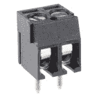

# I2S 音频转接指南

> 原文：<https://learn.sparkfun.com/tutorials/i2s-audio-breakout-hookup-guide>

## 介绍

[I2S 音频分线点](https://www.sparkfun.com/products/14809)板使用 MAX98357A 数模转换器(DAC)，将 I2S(不要与 I2C 混淆)音频转换为模拟信号来驱动扬声器。MAX98357A 内置 D 类放大器，可向 4ω负载提供高达 3.2W 的功率。更多信息，参见下面的[硬件概述](https://learn.sparkfun.com/tutorials/i2s-audio-breakout-hookup-guide#hardware-overview)部分。

 

将**添加到您的[购物车](https://www.sparkfun.com/cart)中！**

 **### [SparkFun I2S 音响突破- MAX98357A](https://www.sparkfun.com/products/14809)

[In stock](https://learn.sparkfun.com/static/bubbles/ "in stock") DEV-14809

SparkFun I2S 音频分线板使用 MAX98357A 数模转换器(DAC ),将 I2S 音频转换为音频信号

$6.502[Favorited Favorite](# "Add to favorites") 21[Wish List](# "Add to wish list")** **[https://www.youtube.com/embed/NOIPlq6bywg/?autohide=1&border=0&wmode=opaque&enablejsapi=1](https://www.youtube.com/embed/NOIPlq6bywg/?autohide=1&border=0&wmode=opaque&enablejsapi=1)

### 建议的工具

你需要一个烙铁、焊料、[通用焊接附件](https://www.sparkfun.com/categories/49)、螺丝刀和业余爱好刀。

 

将**添加到您的[购物车](https://www.sparkfun.com/cart)中！**

 **### [威勒 WE1010 焊台](https://www.sparkfun.com/products/14734)

[Only 1 left!](https://learn.sparkfun.com/static/bubbles/ "only 1 left!") TOL-14734

韦勒的 WE1010 是一个强大的 70 瓦焊接站，非常适合热情的爱好者，DIY 者和任何人…

$138.504[Favorited Favorite](# "Add to favorites") 26[Wish List](# "Add to wish list")**** 

将**添加到您的[购物车](https://www.sparkfun.com/cart)中！**

 **### [无铅焊料- 100 克线轴](https://www.sparkfun.com/products/9325)

[In stock](https://learn.sparkfun.com/static/bubbles/ "in stock") TOL-09325

这是带有水溶性树脂芯的无铅焊料的基本线轴。0.031 英寸规格，100 克。这是一个好主意…

$9.957[Favorited Favorite](# "Add to favorites") 33[Wish List](# "Add to wish list")**** 

将**添加到您的[购物车](https://www.sparkfun.com/cart)中！**

 **### [袖珍螺丝刀套装](https://www.sparkfun.com/products/12891)

[In stock](https://learn.sparkfun.com/static/bubbles/ "in stock") TOL-12891

每个黑客都应该拥有什么？没错，一把螺丝刀(你必须以某种方式进入那些箱子)。什么…

$4.505[Favorited Favorite](# "Add to favorites") 24[Wish List](# "Add to wish list")**** 

将**添加到您的[购物车](https://www.sparkfun.com/cart)中！**

 **### [爱好刀](https://www.sparkfun.com/products/9200)

[In stock](https://learn.sparkfun.com/static/bubbles/ "in stock") TOL-09200

就像一把 Xacto 刀，只是更好。我们在处理多氯联苯时广泛使用这些技术。这些小刀子很适合切割…

$3.502[Favorited Favorite](# "Add to favorites") 18[Wish List](# "Add to wish list")******** ********### 推荐阅读

如果您不熟悉以下概念，我们建议您在继续之前查看这些教程。

 [### 如何焊接:通孔焊接](https://learn.sparkfun.com/tutorials/how-to-solder-through-hole-soldering) This tutorial covers everything you need to know about through-hole soldering.[Favorited Favorite](# "Add to favorites") 70 [### 如何为项目提供动力](https://learn.sparkfun.com/tutorials/how-to-power-a-project) A tutorial to help figure out the power requirements of your project.[Favorited Favorite](# "Add to favorites") 67 [### 按钮和开关基础知识](https://learn.sparkfun.com/tutorials/button-and-switch-basics) A tutorial on electronics' most overlooked and underappreciated component: the switch! Here we explain the difference between momentary and maintained switches and what all those acronyms (NO, NC, SPDT, SPST, ...) stand for.[Favorited Favorite](# "Add to favorites") 53 [### ESP32 事物连接指南](https://learn.sparkfun.com/tutorials/esp32-thing-hookup-guide) An introduction to the ESP32 Thing's hardware features, and a primer on using the WiFi system-on-chip in Arduino.[Favorited Favorite](# "Add to favorites") 22 [### 如何使用跳线焊盘和 PCB 走线](https://learn.sparkfun.com/tutorials/how-to-work-with-jumper-pads-and-pcb-traces) Handling PCB jumper pads and traces is an essential skill. Learn how to cut a PCB trace, add a solder jumper between pads to reroute connections, and repair a trace with the green wire method if a trace is damaged.[Favorited Favorite](# "Add to favorites") 11 [### ESP32 事物运动屏蔽连接指南](https://learn.sparkfun.com/tutorials/esp32-thing-motion-shield-hookup-guide) Getting started with the ESP32 Thing Motion Shield to detect movements using the on-board LSM9DS1 IMU and adding a GPS receiver. Data can be easily logged by adding an microSD card to the slot.[Favorited Favorite](# "Add to favorites") 2

## 硬件概述

I2S 音频分线点使用 [I2S 标准](https://en.wikipedia.org/wiki/I%C2%B2S)将数字音频信号转换为模拟信号，并使用 D 类放大器放大信号。该板可以配置为仅输出左声道、右声道或两者。有关如何配置电路板的更多信息，请参考下面的跳线选择部分。

### 电路板规格

| 参数 | 描述 |
| 电源电压范围 | **2.5V-5.5v。** |
| 输出功率 | 5V 时 3.2W 变为 4ω。 |
| 输出通道选择 | 左、右或左/2 +右/2(默认)。 |
| 抽样率 | 8kHz - 96kHz。 |
| 样本分辨率 | 16/32 位。 |
| 静态电流 | 2.4 毫安。 |
| 附加功能 | 无滤波器 D 类输出，无需 MCLK，减少咔哒声和爆音，提供短路和热保护。 |

### 引脚描述

SparkFun I2S 音频分线板相当简单，只需要几个引脚连接就可以让板工作。

#### 输入

| Pin Label | 描述 |
| 伊拉克战争 | 帧时钟(左/右时钟)输入。 |
| BCLK 公司 | 位时钟输入。 |
| 联邦德国工业标准 | 串行数据输入。 |
| 增加 | 增益设置。可以设置为+3/6/9/12/15dB。默认设置为+9dB。 |
| 南达科他州 | 关断和通道选择。拉低关断，或使用跳线选择通道输出(更多信息参见跳线选择)。 |
| GND | 连接到地面 |
| VDD | 电源输入。必须在 **2.5** 和 **5.5VDC** 之间。 |

#### 输出

输出是连接扬声器的地方。

| Pin Label | 描述 |
| + | 正扬声器输出。 |
| - | 负扬声器输出。 |

扬声器线可以直接焊接到输出焊盘上，但是如果螺丝端子更适合你，你可以使用我们的 T2 3.5 毫米螺丝端子。

 

将**添加到您的[购物车](https://www.sparkfun.com/cart)中！**

 **### 螺距 3.5mm 的螺丝端子(2 针)

[In stock](https://learn.sparkfun.com/static/bubbles/ "in stock") PRT-08084

将端子 3.5 毫米节距销与滑动锁紧装置拧在一起，形成您需要的任何尺寸。额定高达 125V @ 6A，并可接受…

$1.05[Favorited Favorite](# "Add to favorites") 23[Wish List](# "Add to wish list")** **### 跳线选择

默认情况下，电路板配置为“单声道”操作，这意味着左右信号组合在一起驱动单个扬声器。

如果你想要一个左右声道的独立扬声器，你首先需要如下图所示切断单声道跳线。

要配置板以响应特定的音频通道，您需要关闭立体声跳线，如下所示。

### 增益选择

除了能够选择音频通道输出，增益还可以通过几种方式进行配置。放大器的增益可配置为从低至+3dB 的**到高达+15dB 的**。虽然通道选择可以在板上配置，但增益是通过 gain 引脚在外部控制的。默认情况下，该板配置为 **+9dB** ，但可以使用下表进行更改。

| 增益(分贝) | 增益引脚连接 |
| Fifteen | 通过 100k 电阻连接到 GND。 |
| Twelve | 连接到 GND。 |
| nine | 未连接(**默认**)。 |
| six | 连接到 VDD。 |
| three | 通过 100k 电阻连接到 VDD。 |

## 例子

**Note:** These example assumes you are using the latest version of the Arduino IDE on your desktop. If this is your first time using Arduino, please review our tutorial on [installing the Arduino IDE.](https://learn.sparkfun.com/tutorials/installing-arduino-ide) If you have not previously installed an Arduino library, please check out our [installation guide.](https://learn.sparkfun.com/tutorials/installing-an-arduino-library)

该板可以与任何具有 I2S 功能引脚的微控制器或单板计算机一起工作。在这些例子中，我们将看到一个非常强大的库，它允许你使用一个 [ESP32 东西](https://www.sparkfun.com/products/13907)来播放来自各种来源的音频。首先，我们将播放一个存储在 ESP32 程序存储器中的音频文件，一旦该文件运行，我们将考虑创建一个 MP3 触发器。需要以下库来运行最初为 ESP8266 编写的示例，但也可以用于 ESP32。

### ESP8266Audio Arduino 库

你需要安装由[厄尔·f·菲尔豪](https://github.com/earlephilhower)编写的 [ESP8266 音频 Arduino 库](https://github.com/earlephilhower/ESP8266Audio)，你可以从下面的链接获得。这个库允许你播放各种各样的音频格式，包括:AAC，FLAC，MIDI，MOD，MP3，RTTTL 和 WAV。要使用该库，您可以通过选择**草图* *>* *包括库* *>* *添加，从 Arduino 添加该库。ZIP 库**...并选择**。从你存储文件下载的任何地方压缩文件。**

[ESP8266 Audio Library (ZIP)](https://github.com/earlephilhower/ESP8266Audio/archive/master.zip)

### ESP8266_Spiram Arduino 库

ESP8266 音频库依赖于由 [Giancarlo Bacchio](https://github.com/Gianbacchio) 编写的 [ESP8266 Spiram 库](https://github.com/Gianbacchio/ESP8266_Spiram)，也需要下载。你可以从下面的链接下载这个库。安装库的过程与上面概述的过程相同。

[ESP8266 Spiram Library (ZIP)](https://github.com/Gianbacchio/ESP8266_Spiram/archive/master.zip)

### 首次测试

在第一个示例中，我们将运行一个快速示例草图，以确保 I2S 音频分线板接线正确且工作正常。

#### 所需材料

下面的愿望清单中列出了本例中使用的零件。你可能不需要所有的东西，这取决于你拥有什么。将它添加到您的购物车中，通读示例，并根据需要调整购物车。************