# ESP32 LoRa 1-CH 网关、LoRaWAN 和物联网

> 原文：<https://learn.sparkfun.com/tutorials/esp32-lora-1-ch-gateway-lorawan-and-the-things-network>

## 介绍

**Note:** Please note that this tutorial is for [SPX-14893](https://www.sparkfun.com/products/14893). If you are using this with latest version [[WRL-15006](https://www.sparkfun.com/products/15006) ] please refer to the [SparkFun LoRa Gateway 1-Channel Hookup Guide](https://learn.sparkfun.com/tutorials/sparkfun-lora-gateway-1-channel-hookup-guide).[](https://www.sparkfun.com/sparkx)
**Experimental Products:** [SparkX products](https://www.sparkfun.com/sparkx) are rapidly produced to bring you the most cutting edge technology as it becomes available. These products are tested but come with no guarantees. Live technical support is not available for SparkX products.

[ESP32 LoRa 1-CH 网关](https://www.sparkfun.com/products/14893)将 ESP32(一种具有 WiFi 和蓝牙无线电功能的可编程微控制器)与 RFM95W LoRa 收发器相结合，创建了一个单通道 LoRa 网关。这是一个完美的低成本工具，用于监控十几个 LoRa 设备，并将它们的信息转发到云端。

[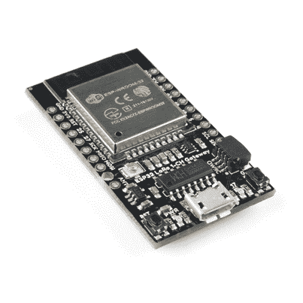](https://www.sparkfun.com/products/retired/14893) 

### [ESP32 LoRa 单路网关](https://www.sparkfun.com/products/retired/14893)

[Retired](https://learn.sparkfun.com/static/bubbles/ "Retired") SPX-14893

ESP32 LoRa 1-CH 网关结合了 ESP32 - a 可编程微控制器，具有 WiFi 和蓝牙无线电功能- w…

**Retired**[Favorited Favorite](# "Add to favorites") 2[Wish List](# "Add to wish list")

该板配有一个 [Qwiic 连接器](https://www.sparkfun.com/qwiic)和一系列与试验板兼容的 ESP32 引脚分线点，还可以用作通用 ESP32/RFM95W 开发平台。因此，你可以把它变成一个 **LoRa 设备**，并使用强大的 ESP32 微控制器来监控传感器，托管网络服务器，运行显示器等等，而不是把它用作 LoRaWAN 网关。

这些板是一个很好的方式，让你开始涉足劳拉和劳拉万的世界。它们不仅可以编程为多功能单通道网关，还可以用作 LoRa 器件或通用 ESP32/RFM95W 开发板。

本教程的目标是让您快速启动并运行 ESP32 LoRa 1-CH 网关。它将解释如何在 Arduino 中对板进行编程，如何使用我们推荐的网关固件，甚至如何将板变成 LoRa 设备。

### 所需材料

ESP32 LoRa 单通道网关是一个近乎完整的 LoRa 网关。您可能需要一些额外的组件来启动并运行它。你可能不需要所有的东西，这取决于你拥有什么。将它添加到您的购物车，通读指南，并根据需要调整购物车。

为了给电路板供电和编程，你需要一根 [micro-B USB 线](https://www.sparkfun.com/products/10215)和一台安装了 Arduino 的电脑。为了增强你的劳拉收音机的信号，你还需要一个天线。你可以使用附带的 U.FL 连接器-带有一个 [U.FL-to-SMA 适配器](https://www.sparkfun.com/products/662)和 [900 MHz SMA 天线](https://www.sparkfun.com/products/9143) -或者焊接在一条大约 3 英寸长的[电线](https://www.sparkfun.com/products/11367)上。

[](https://www.sparkfun.com/products/11367) 

将**添加到您的[购物车](https://www.sparkfun.com/cart)中！**

 **### [](https://www.sparkfun.com/products/11367)

[In stock](https://learn.sparkfun.com/static/bubbles/ "in stock") PRT-11367

各种颜色的电线:你知道这是一个美丽的东西。六种不同颜色的硬纸板实芯焊丝…

$21.5037[Favorited Favorite](# "Add to favorites") 86[Wish List](# "Add to wish list")****[](https://www.sparkfun.com/products/10215) 

将**添加到您的[购物车](https://www.sparkfun.com/cart)中！**

 **### [USB micro-B 线- 6 脚](https://www.sparkfun.com/products/10215)

[In stock](https://learn.sparkfun.com/static/bubbles/ "in stock") CAB-10215

USB 2.0 型到微型 USB 5 针。这是一种新的、更小的 USB 设备连接器。微型 USB 连接器大约是…

$5.5014[Favorited Favorite](# "Add to favorites") 21[Wish List](# "Add to wish list")****[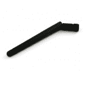](https://www.sparkfun.com/products/9143) 

将**添加到您的[购物车](https://www.sparkfun.com/cart)中！**

 **### [900/1800MHz 双频鸭式天线- RP-SMA](https://www.sparkfun.com/products/9143)

[In stock](https://learn.sparkfun.com/static/bubbles/ "in stock") WRL-09143

900/1800 MHz 鸭式天线 2dBi，带常规 RP-SMA 射频连接器。非常适合与 XBee 900MHz 设备一起使用。50 欧姆阻抗…

$8.95[Favorited Favorite](# "Add to favorites") 10[Wish List](# "Add to wish list")****[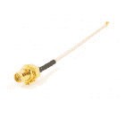](https://www.sparkfun.com/products/retired/662) 

### [接口电缆 RP-SMA 到 U . FL](https://www.sparkfun.com/products/retired/662)

[Retired](https://learn.sparkfun.com/static/bubbles/ "Retired") WRL-00662

通常用于将基于 WiFi、蓝牙或 nRFxxx 的设备连接到 2.4GHz 天线。

1 **Retired**[Favorited Favorite](# "Add to favorites") 13[Wish List](# "Add to wish list")****** ******### 工具

你需要一个烙铁、焊料和一般的焊接附件。

[](https://www.sparkfun.com/products/14228) 

### [威勒 WLC100 焊台](https://www.sparkfun.com/products/14228)

[Out of stock](https://learn.sparkfun.com/static/bubbles/ "out of stock") TOL-14228

Weller 的 WLC100 是一款多功能的 5 瓦至 40 瓦焊台，非常适合业余爱好者、DIY 爱好者和学生。…

2[Favorited Favorite](# "Add to favorites") 17[Wish List](# "Add to wish list")[](https://www.sparkfun.com/products/9325) 

将**添加到您的[购物车](https://www.sparkfun.com/cart)中！**

 **### [无铅焊料- 100 克线轴](https://www.sparkfun.com/products/9325)

[In stock](https://learn.sparkfun.com/static/bubbles/ "in stock") TOL-09325

这是带有水溶性树脂芯的无铅焊料的基本线轴。0.031 英寸规格，100 克。这是一个好主意…

$9.957[Favorited Favorite](# "Add to favorites") 33[Wish List](# "Add to wish list")** **### 推荐阅读

如果您不熟悉以下概念，我们建议您在继续之前查看这些教程。

[](https://learn.sparkfun.com/tutorials/how-to-solder-through-hole-soldering) [### 如何焊接:通孔焊接](https://learn.sparkfun.com/tutorials/how-to-solder-through-hole-soldering) This tutorial covers everything you need to know about through-hole soldering.[Favorited Favorite](# "Add to favorites") 70[](https://learn.sparkfun.com/tutorials/installing-arduino-ide) [### 安装 Arduino IDE](https://learn.sparkfun.com/tutorials/installing-arduino-ide) A step-by-step guide to installing and testing the Arduino software on Windows, Mac, and Linux.[Favorited Favorite](# "Add to favorites") 16[](https://learn.sparkfun.com/tutorials/serial-basic-hookup-guide) [### 串行基本连接指南](https://learn.sparkfun.com/tutorials/serial-basic-hookup-guide) Get connected quickly with this Serial to USB adapter.[Favorited Favorite](# "Add to favorites") 10

## 硬件设置

ESP32 LoRa 1-CH 网关几乎包括设置 LoRaWAN 网关或设备所需的一切。你甚至不需要焊接任何东西来开始！这里有一个开始使用主板所需的最低要求的快速纲要。

### 天线

为了让电路板与其他 LoRa 设备通信，您需要添加一个天线。这可以连接到电路板上的 U.FL 连接器或 **ANT** 引脚。

U.FL 连接器可以连接到一根 [SMA 到 U.FL](https://www.sparkfun.com/products/662) 适配器电缆上，然后可以与一根 [900 MHz 鸭式天线](https://www.sparkfun.com/products/9143)配对。

[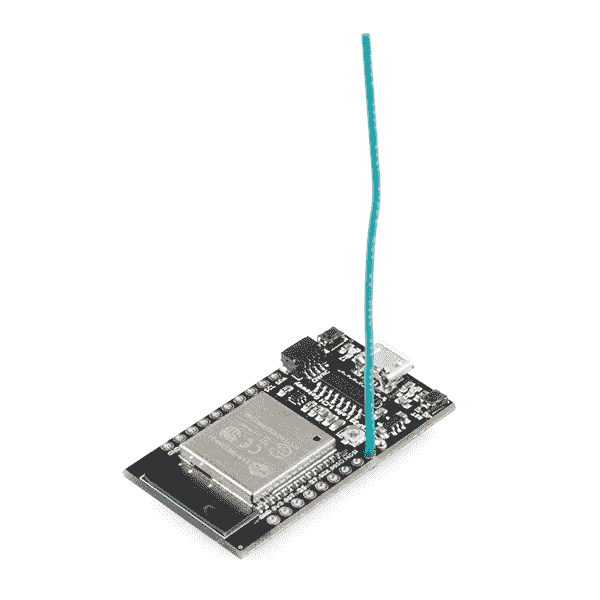](https://cdn.sparkfun.com/assets/learn_tutorials/8/0/4/14893-ESP32_LoRa_1-Channel_Gateway-06.jpg)*3.07" strip of 22-AWG solid-core wire soldered to the ANT pin. Use the hole adjacent to the ANT pin for strain relief!*

代替 U.FL 天线，一条[导线](https://www.sparkfun.com/products/11367)焊接到 ANT 引脚并垂直向上粘贴也可以工作。以下是 915MHz 和 434MHz 四分之一波长天线的线长:

| **频率** | **长度(英寸)** | **长度(毫米)** |
| 915 兆赫 | 3.07" (3 + 1/16") | 78 毫米 |
| 434 兆赫 | 6.47" (6 + 1/2") | 164 毫米 |

### 为电路板供电

该板名义上通过板载**微型 USB** 连接器供电。USB 线的另一端可以插入电脑、[墙壁适配器](https://www.sparkfun.com/products/12890)或 [USB 电池组](https://www.sparkfun.com/products/14169)。

[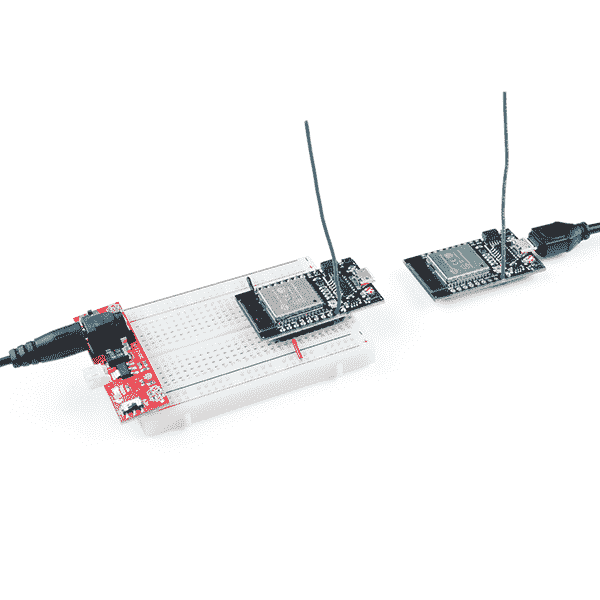](https://cdn.sparkfun.com/assets/learn_tutorials/8/0/4/14893-ESP32_LoRa_1-Channel_Gateway-05.jpg)

或者，电路板可以使用**稳压 3.3V 电源**供电。该电源应施加于 3.3V 和 GND 引脚。

Under normal operation the ESP32 LoRa 1-CH Gateway consumes between **50-100mA**. (Running the ESP-sc-gway sketch.)

## Arduino IDE 设置

要设置网关软件，您需要安装 ESP32 Arduino 核心以及 ESP32 LoRa Gateway sketch 的库依赖项。

### Arduino 板设置

该板的示例代码和库都是为 Arduino IDE 编写的。如果您还没有这样做，您需要**为 ESP32** 安装 Arduino 内核。ESP32 Arduino 核心必须手动安装。你可以在 espressif 的 GitHub 上找到核心文件:【https://github.com/espressif/arduino-esp32[。按照](https://github.com/espressif/arduino-esp32)[安装说明](https://github.com/espressif/arduino-esp32#installation-instructions)将内核添加到你的 Arduino IDE 中。

#### 添加自定义电路板

虽然可以使用标准板定义将代码上传到板上，但我们建议定制核心以添加对 SparkX ESP32 LoRa 网关的支持。

要添加定制板，请从下面下载板的变体文件开始。

[Download the SparkX ESP32 LoRa Arduino variant definition (ZIP)](https://cdn.sparkfun.com/assets/learn_tutorials/8/0/4/sparkx_esp32_lora-v01.zip)

然后将内容解压到**...{ Arduino Sketchbook }/hardware/espressif/esp32/variants**。

[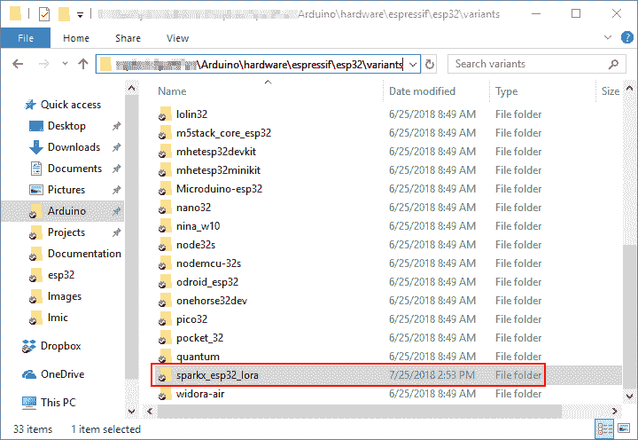](https://cdn.sparkfun.com/assets/learn_tutorials/8/0/4/esp32-variant-install-location.png)*The "sparkx_esp32_lora" folder should live in the "variants" folder of your ESP32 hardware directory.*

接下来，复制下面的文本并将其添加到**的底部...{ Arduino Sketchbook }/hardware/espressif/esp32/boards . txt**:

```
language:c
##############################################################

sparkx_esp32_lora.name=SparkX ESP32 LoRa Gateway

sparkx_esp32_lora.upload.tool=esptool
sparkx_esp32_lora.upload.maximum_size=1310720
sparkx_esp32_lora.upload.maximum_data_size=294912
sparkx_esp32_lora.upload.wait_for_upload_port=true

sparkx_esp32_lora.serial.disableDTR=true
sparkx_esp32_lora.serial.disableRTS=true

sparkx_esp32_lora.build.mcu=esp32
sparkx_esp32_lora.build.core=esp32
sparkx_esp32_lora.build.variant=sparkx_esp32_lora
sparkx_esp32_lora.build.board=ESP32_DEV

sparkx_esp32_lora.build.f_cpu=240000000L
sparkx_esp32_lora.build.flash_size=4MB
sparkx_esp32_lora.build.flash_freq=40m
sparkx_esp32_lora.build.flash_mode=dio
sparkx_esp32_lora.build.boot=dio
sparkx_esp32_lora.build.partitions=default

sparkx_esp32_lora.menu.PartitionScheme.default=Default
sparkx_esp32_lora.menu.PartitionScheme.default.build.partitions=default
sparkx_esp32_lora.menu.PartitionScheme.minimal=Minimal (2MB FLASH)
sparkx_esp32_lora.menu.PartitionScheme.minimal.build.partitions=minimal
sparkx_esp32_lora.menu.PartitionScheme.no_ota=No OTA (Large APP)
sparkx_esp32_lora.menu.PartitionScheme.no_ota.build.partitions=no_ota
sparkx_esp32_lora.menu.PartitionScheme.no_ota.upload.maximum_size=2097152
sparkx_esp32_lora.menu.PartitionScheme.min_spiffs=Minimal SPIFFS (Large APPS with OTA)
sparkx_esp32_lora.menu.PartitionScheme.min_spiffs.build.partitions=min_spiffs
sparkx_esp32_lora.menu.PartitionScheme.min_spiffs.upload.maximum_size=1966080

sparkx_esp32_lora.menu.FlashMode.qio=QIO
sparkx_esp32_lora.menu.FlashMode.qio.build.flash_mode=dio
sparkx_esp32_lora.menu.FlashMode.qio.build.boot=qio
sparkx_esp32_lora.menu.FlashMode.dio=DIO
sparkx_esp32_lora.menu.FlashMode.dio.build.flash_mode=dio
sparkx_esp32_lora.menu.FlashMode.dio.build.boot=dio
sparkx_esp32_lora.menu.FlashMode.qout=QOUT
sparkx_esp32_lora.menu.FlashMode.qout.build.flash_mode=dout
sparkx_esp32_lora.menu.FlashMode.qout.build.boot=qout
sparkx_esp32_lora.menu.FlashMode.dout=DOUT
sparkx_esp32_lora.menu.FlashMode.dout.build.flash_mode=dout
sparkx_esp32_lora.menu.FlashMode.dout.build.boot=dout

sparkx_esp32_lora.menu.FlashFreq.80=80MHz
sparkx_esp32_lora.menu.FlashFreq.80.build.flash_freq=80m
sparkx_esp32_lora.menu.FlashFreq.40=40MHz
sparkx_esp32_lora.menu.FlashFreq.40.build.flash_freq=40m

sparkx_esp32_lora.menu.FlashSize.4M=4MB (32Mb)
sparkx_esp32_lora.menu.FlashSize.4M.build.flash_size=4MB

sparkx_esp32_lora.menu.UploadSpeed.921600=921600
sparkx_esp32_lora.menu.UploadSpeed.921600.upload.speed=921600
sparkx_esp32_lora.menu.UploadSpeed.115200=115200
sparkx_esp32_lora.menu.UploadSpeed.115200.upload.speed=115200
sparkx_esp32_lora.menu.UploadSpeed.256000.windows=256000
sparkx_esp32_lora.menu.UploadSpeed.256000.upload.speed=256000
sparkx_esp32_lora.menu.UploadSpeed.230400.windows.upload.speed=256000
sparkx_esp32_lora.menu.UploadSpeed.230400=230400
sparkx_esp32_lora.menu.UploadSpeed.230400.upload.speed=230400
sparkx_esp32_lora.menu.UploadSpeed.460800.linux=460800
sparkx_esp32_lora.menu.UploadSpeed.460800.macosx=460800
sparkx_esp32_lora.menu.UploadSpeed.460800.upload.speed=460800
sparkx_esp32_lora.menu.UploadSpeed.512000.windows=512000
sparkx_esp32_lora.menu.UploadSpeed.512000.upload.speed=512000

sparkx_esp32_lora.menu.DebugLevel.none=None
sparkx_esp32_lora.menu.DebugLevel.none.build.code_debug=0
sparkx_esp32_lora.menu.DebugLevel.error=Error
sparkx_esp32_lora.menu.DebugLevel.error.build.code_debug=1
sparkx_esp32_lora.menu.DebugLevel.warn=Warn
sparkx_esp32_lora.menu.DebugLevel.warn.build.code_debug=2
sparkx_esp32_lora.menu.DebugLevel.info=Info
sparkx_esp32_lora.menu.DebugLevel.info.build.code_debug=3
sparkx_esp32_lora.menu.DebugLevel.debug=Debug
sparkx_esp32_lora.menu.DebugLevel.debug.build.code_debug=4
sparkx_esp32_lora.menu.DebugLevel.verbose=Verbose
sparkx_esp32_lora.menu.DebugLevel.verbose.build.code_debug=5 
```

该定制板文件指定了 SPI 和内置 LED 引脚。没有它，你需要在你的草图中重新定义它们。

一旦自定义板被添加到 ESP32 核心，打开 Arduino 并在**工具>板> ESP32** Arduino 菜单下选择“ **SparkX ESP32 LoRa 网关**”。

[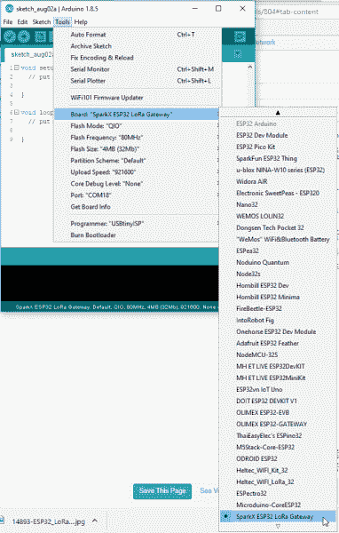](https://cdn.sparkfun.com/assets/learn_tutorials/8/0/4/arduino-select-sparkx-board.png)

## 单通道劳拉旺网关代码

ESP32 单通道网关示例代码由 GitHub 上的 [things4u 托管。从他们的存储库中下载。](https://github.com/things4u/ESP-1ch-Gateway-v5.0)

[GitHub: ESP-1ch-Gateway-v5.0 (ZIP)](https://github.com/things4u/ESP-1ch-Gateway-v5.0/archive/master.zip)

这个库包括 Arduino 草图和它所依赖的库。在编译草图之前，您需要将所有库从资源库的“library”文件夹提取到 Arduino sketchbook 的“libraries”文件夹中。有关安装库的更多帮助，请查看自述文件的[入门部分](https://github.com/things4u/ESP-1ch-Gateway-v5.0#getting-started)。

要打开示例代码，请打开 **ESP-sc-gway.ino** 文件。当 IDE 加载时，它应该包括另外十几个选项卡——这是一个庞大的、但是很好分割的草图！

### 配置网关草图

在将 ESP-1ch-Gateway 草图上传到您的主板之前，您需要对几个文件进行一些修改。这里有一个快速概述:

#### ESP-sc-gway.h

该文件是网关草图配置的主要来源。您可能需要修改的定义是:

*   收音机
    *   **`_LFREQ`** -设置你的无线电通讯的频率范围。将此设置为`433`(亚洲)、`868`(欧盟)或`915`(美国)
    *   **`_SPREADING`** -设置 LoRa 扩展因子。可以使用`SF7`、`SF8`、`SF9`、`SF10`、`SF11`或`SF12`。请注意，这将影响您的网关可以与哪些设备通信。
    *   **`_CAD`** -通道活动检测。如果启用(设置为 1)，CAD 将允许网关监控以任何扩展因子发送的消息。启用的代价是:无线电可能收不到非常微弱的信号。
*   五金器具
    *   **`OLED`** -此板不包括有机发光二极管，**将此设置为 0** 。
    *   **`_PIN_OUT`** -配置 SPI 和其他硬件设置。**将此项设置为 6** ，稍后我们将添加自定义硬件定义。
    *   **`CFG_sx1276_radio`**——确保定义了这个，并且 CFG_sx1272_radio 是*而不是*。这将配置连接到 ESP32 的 LoRa 无线电。
*   物联网(TTN)
    *   **`_TTNSERVER`** -您的 LoRa 路由器的服务器。例如`"router.eu.thethings.network"`或`"us-west.thethings.network"`
    *   **`_TTNPORT`** - `1700`是 TTN 的标准港口
    *   **`_DESCRIPTION`** -自定义您的网关名称
    *   **`_EMAIL`**——您的电子邮件地址，或网关所有者的地址
    *   **`_LAT`****_`LON`**-您网关的 GPS 坐标
*   无线局域网（wireless fidelity 的缩写）
    *   将至少一个 WiFi 网络添加到`wpas wpa[]`阵列，但将第一个条目留空。例如:

```
language:c
wpas wpa[] = {
  { "" , "" },                          // Reserved for WiFi Manager
  { "my_wifi_network", "my_wifi_password" }
}; 
```

还有许多其他值都可以选择配置。要获得完整的概要，请查看自述文件中的[编辑 ESP-sc-gway.h](https://github.com/things4u/ESP-1ch-Gateway-v5.0#editing-the-esp-sc-gwayh-file) 部分。

#### loramodem.h

该文件定义了如何配置 LoRa 调制解调器，包括它可以使用哪些频道以及 ESP32 使用哪些引脚与之通信。修改这里的大部分定义时要小心，但是有一部分必须修改，那就是`_PIN_OUT`声明。

首先，找到写着`#error "Pin Definitions _PIN_OUT must be 1(HALLARD) or 2 (COMRESULT)"`和**的那一行，删除它**。然后将这些线复制并粘贴到它的位置(在`#else`和`#endif`之间):

```
language:c
struct pins {
  uint8_t dio0 = 26;
  uint8_t dio1 = 33;
  uint8_t dio2 = 32;
  uint8_t ss = 16;
  uint8_t rst = 27; // Reset not used
} pins;
#define SCK  14
#define MISO 12
#define MOSI 13
#define SS  16
#define DIO0 26 
```

如果你想使用不同的子带，可以调整`int freqs[]`数组，但是，除此之外，这里没有什么我们建议修改的了。

### 上传草图

修改完成后，尝试编译草图并上传到您的 ESP32。上传后，打开你的[串口监视器](https://learn.sparkfun.com/tutorials/terminal-basics/arduino-serial-monitor-windows-mac-linux)，设置波特率为 **115200** 。这里的调试消息非常方便，如果您想监控 web 服务器，找到网关的 IP 地址是非常重要的。

第一次创建草图可能需要很长时间——它将格式化您的 SPIFFS 文件系统并创建一个非易失性配置文件。完成后，您应该会看到 ESP32 尝试连接到您的 WiFi 网络，然后初始化无线电。

在 ESP32 连接后，寻找它打印出一个 IP 地址。打开你电脑的网络浏览器，把它插入地址栏。您应该会看到 ESP 网关配置门户网站:

[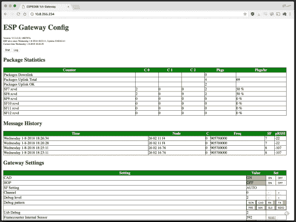](https://cdn.sparkfun.com/assets/learn_tutorials/8/0/4/esp-gateway-config-web.png)*Config and log page served by the ESP32.*

该网页可用于监控传入的消息以及它们以何种频率和传播因素传入。它还可以用来动态更改网关的配置。您可以调整通道或扩展因子，或者打开/关闭 CAD，甚至打开简单的跳频。

当然，要查看通过的任何消息，您需要设置一个 LoRa 设备(或 device_s_)来与您的网关通信。查看下一节，快速了解如何将第二块 ESP32 LoRa 板设置为 LoRa 设备。

## 将网关变成设备

如果您有一对 ESP32 网关，您可以将其中一个用作 LoRaWAN 设备。这一节将让你使用我们首选的 LoRaWAN Arduino 库和一个简单的示例草图开始设置。

### 获取 Arduino-LMIC 库来设置设备

如果您有一对 ESP32 网关，并希望将其中一个设置为 LoRa 设备，我们建议使用 Arduino-LMIC 库。似乎有很多版本的 Arduino-LMIC 库，我们在 mcci-catena 开发的库上取得了很大的成功:

[mcci-catena: arduino-lmic](https://github.com/mcci-catena/arduino-lmic)

要安装这个库，请从 GitHub 下载 ZIP 文件。然后使用 Arduino 的“添加 ZIP 库”功能(**Sketch>Include Library>Add。zip 库**)将 ZIP 文件导入到您的 Arduino sketchbook 中。

#### 配置 LMIC

在可以使用 LMIC 库中的示例草图之前，您需要对其进行配置。要配置库，请导航到**中的“arduino-lmic”库..{ Arduino Sketchbook }/libraries**文件夹。然后进入 **project_config** ，打开 **lmic_project_config.h** 。

您可以在这里定义您的 LoRa 设备将使用的频段。您还可以使用该文件中的定义打开调试和启用/禁用许多功能。

确保您取消注释了一个且仅一个“CFG ...”声明。如果你在美国，取消注释`#define CFG_us915`。最终，这个频率应该与您在网关中设置的频率相匹配。

下面是我的配置文件——我已经打开了调试，因为我是一个日志迷。

```
language:c
// project-specific definitions
//#define CFG_eu868 1
#define CFG_us915 1
//#define CFG_au921 1
//#define CFG_as923 1
// #define LMIC_COUNTRY_CODE LMIC_COUNTRY_CODE_JP   /* for as923-JP */
//#define CFG_in866 1
#define CFG_sx1276_radio 1

//#define LMIC_PRINTF_TO Serial
#define LMIC_DEBUG_LEVEL 2

//#define DISABLE_INVERT_IQ_ON_RX 
```

如果您试图使用该库中的“原始”示例，您将需要取消对`DISABLE_INVERT_IQ_ON_RX`的注释，否则将其保留为注释掉。

#### 修改“SPI.begin”调用

为了确保您的 pin 定义是正确的，我建议将**arduino-lmic/src/Hal/Hal . CPP**中的`SPI.begin`行修改为:

```
language:c
SPI.begin(14, 12, 13, 16); 
```

这将确保您的 SPI 引脚设置正确-这可能只有在您没有使用自定义的“SparkX ESP32 LoRa Gateway”Arduino 板时才有必要。

#### 加载单通道设备示例

我们采用了 Arduino-LMIC 库中的一个例子，并对其进行了修改，以更可靠地与单通道网关一起工作。

单击下面的按钮下载示例。然后打开**ESP-1CH-TTN-设备-总部编号**:

[Download the single-channel LoRaWAN device example (ZIP)](https://cdn.sparkfun.com/assets/learn_tutorials/8/0/4/ESP-1CH-TTN-Device-ABP-v01.zip)

本例中的修改包括 radio 和 ESP32 之间的引脚映射，设置如下:

```
language:c
const lmic_pinmap lmic_pins = {
  .nss = 16,
  .rxtx = LMIC_UNUSED_PIN,
  .rst = 5,
  .dio = {26, 33, 32},
}; 
```

我们还修改了已启用的频道，使其仅使用以下线路的单个频道(注意，这一修改尚未在非美国频段上进行测试)。

```
language:c
// First disable all sub-bands
for (int b = 0; b < 8; ++b) {
  LMIC_disableSubBand(b);
}
// Then enable the channel(s) you want to use
LMIC_enableChannel(8); // 903.9 MHz 
```

使用`LMIC_setDrTxpow(DR_SF7, 14);`线在设置()接近结束时设置扩展因子。这可以用默认 903.9MHz 频率的`DR_SF8`、`DR_SF9`或`DR_SF10`来代替。

但是等等！在上传这个例子之前，您还需要做一个修改:您的 LoRaWAN 应用程序、网络会话和设备密钥！为此，以及应用服务器，我们推荐物联网。

## 路由到物联网

LoRaWAN 网络的最终组成部分是服务器和应用程序。你可以建立一个自己的 LoRaWAN 服务器，但是，至少对于原型来说，Things Network 是一个很棒的免费工具，可以用来认证和路由你的数据。

**单通道蓝调**

以低成本为代价，该网关只能在有限的扩频因子集上监控单个 LoRa 信道。单通道网关没有得到 LoRaWAN 平台如[物联网](https://www.thethingsnetwork.org/docs/gateways/start/single-channel.html)的支持，因为它们不一定符合 LoRaWAN。然而，它们是开始探索洛拉和洛拉万世界的好方法！

如果您还没有，请前往[thethingsnetwork.org](https://www.thethingsnetwork.org/)创建一个帐户。一旦完成，去你的**控制台**。

[The Things Network](https://www.thethingsnetwork.org/)

### 创建应用程序

为了创建一个设备，您首先需要创建一个应用程序来容纳它。在控制台中，点击**应用**，然后点击**添加应用**。

填写任何你想要的身份证和描述。当您创建应用程序时，**应用程序 EUI** 将自动生成。您还可以为应用程序选择您喜欢的处理程序(例如 ttn-handler-us-west)。

[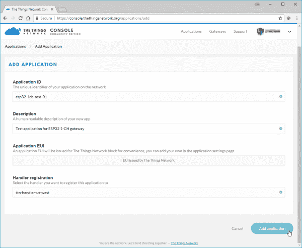](https://cdn.sparkfun.com/assets/learn_tutorials/8/0/4/ttn-application-create.png)

### 创建和配置设备

接下来，在应用程序中创建一个设备。在“**设备**部分，点击“**注册设备**”。

这也很简单。填写唯一的设备 ID，点击“**设备 EUI** 下的“**生成**按钮，自动生成 EUI。然后点击**注册**

[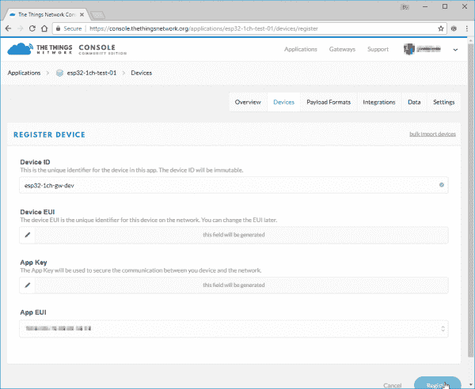](https://cdn.sparkfun.com/assets/learn_tutorials/8/0/4/ttn-device-create.png)

该示例草图仅支持 **ABP 激活**，因此您需要在设备设置中进行修改。在“设备概述”页面中，单击“设置”。从那里，在“激活方法”下点击**总部**。我还建议**禁用帧计数器检查**。网关能够进行帧计数器检查，但是它可能会失去同步——特别是如果您附近有另一个网关的话。

[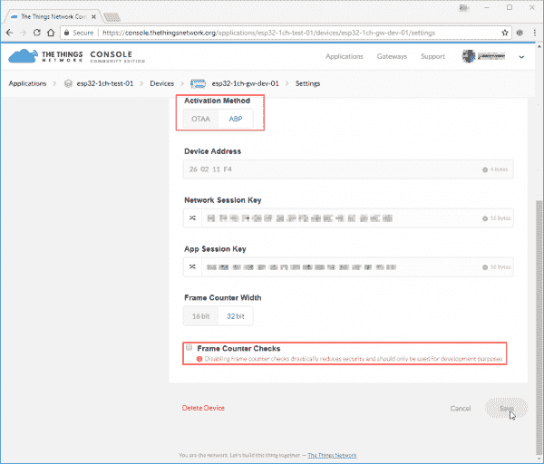](https://cdn.sparkfun.com/assets/learn_tutorials/8/0/4/ttn-device-settings.png)

保存设置并返回到您的“**设备概述**页面。您应该会看到新的密钥，包括“**网络会话密钥**”、“ **App 会话密钥**”和“**设备地址**”这些将需要插入设备草图并上传到设备。

### 更新示例代码

有了应用程序、网络会话和设备密钥，您就可以完成 ESP32 LoRa 设备草图的配置并开始发布数据了！

在“**设备概述**”页面上，点击“**网络会话密钥**”和“ **App 会话密钥**”旁边的“**代码**”符号(`<>`)——这将使密钥可见，并显示为 16 字节数组。复制这些键中的每一个，并将它们粘贴到`{PASTE KEY HERE}`占位符的位置。将“**网络会话密钥**粘贴到`NWKSKEY`变量中，将“ **App 会话密钥**粘贴到`APPSKEY`变量中。

`DEVADDR`变量需要一个 32 位变量，所以复制如图所示的“**设备地址**键，并将其粘贴到`PASTE_DEV_ADDR_HERE`占位符中。

[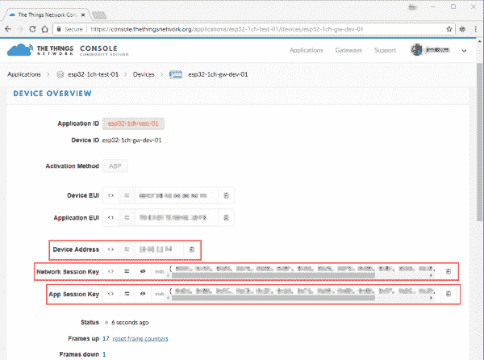](https://cdn.sparkfun.com/assets/learn_tutorials/8/0/4/ttn-device-keys.png)

这里有一个例子，说明你的三个常量一旦完成应该是什么样子:

```
language:c
// LoRaWAN NwkSKey, network session key
// This is the default Semtech key, which is used by the early prototype TTN
// network.
static const PROGMEM u1_t NWKSKEY[16] = { 0x01, 0x23, 0x45, 0x67, 0x89, 0xAB, 0xCD, 0xEF, 0x01, 0x23, 0x45, 0x67, 0x89, 0xAB, 0xCD, 0xEF };

// LoRaWAN AppSKey, application session key
// This is the default Semtech key, which is used by the early prototype TTN
// network.
static const u1_t PROGMEM APPSKEY[16] = { 0xFE, 0xDC, 0xBA, 0x98, 0x76, 0x54, 0x32, 0x10, 0xFE, 0xDC, 0xBA, 0x98, 0x76, 0x54, 0x32, 0x10 };

// LoRaWAN end-device address (DevAddr)
static const u4_t DEVADDR = 0x01234567; 
```

就是这样！现在将代码上传到您的 ESP32 LoRa 板。

### 测试代码

设置完成后，设备应立即发送“Hello，World”消息。它会继续每分钟或任何时候按下板上的“0”按钮发送一条信息。

要检查您的网关是否正在接收消息，您可以检查串行监视器或监视网关提供的 ESP 网关配置页面。每次收到消息时，都应该将其添加到“消息历史”表中。

如果您的网关收到了消息，请单击设备上的“**数据**选项卡来查看新消息。

[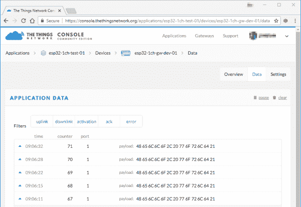](https://cdn.sparkfun.com/assets/learn_tutorials/8/0/4/ttn-data.png)

消息的有效载荷在离开设备和到达路由器之间被加密，应该是一系列十六进制值加起来的“Hello，world”。

### 解决纷争

如果消息没有到达你的网关，首先确保**通道和传播因子**匹配。保持不变，设备示例代码应该在扩频因子为 7 的 903.9MHz 通道上发送数据(假设您已经将 LMIC 库设置为`CFG_us915`)。如果设置为欧洲频谱，则为 868.1MHz，SF7)。

您可以使用网关的 web 服务器动态调整这些设置。请注意，频道号应该顺序匹配 **loraModem.h** 中的`freqs`数组——例如，频道 0 应该是 903.9MHz(再次假设美国频率)。

如果消息正在到达您的网关，但没有显示在您的 TTN 设备控制台上，请考虑更改" **ESP-sc-gway.h** 中的`_TTNSERVER`变量。我还没有成功使用 us-west 路由器，但是 **`"router.eu.thethings.network"`** 工作得非常好(甚至在美国)。

## 资源和更进一步

感谢您和我们一起踏上单通道 LoRaWAN gateway 之旅！以下是一些链接和文档，可能会对您继续使用该板探索 LoRa 世界有所帮助:

*   [产品存储库](https://github.com/sparkfunX/ESP32_LoRa_1CH_Gateway) - GitHub 存储库，您可以在这里找到我们所有最新的硬件和软件设计文件。
*   **硬件**
    *   [示意图](https://cdn.sparkfun.com/assets/learn_tutorials/8/0/4/esp32_lora_gateway-x01.pdf) - PDF 示意图
    *   [Eagle 文件](https://cdn.sparkfun.com/assets/learn_tutorials/8/0/4/esp32_lora_gateway-x01.zip) - PCB 设计文件
    *   [ESP32 工作间数据表](https://cdn.sparkfun.com/assets/learn_tutorials/8/0/4/esp32-wroom-32_datasheet_en.pdf)-ESP32 工作间模块数据表
    *   [RFM95W 数据表](https://cdn.sparkfun.com/assets/learn_tutorials/8/0/4/RFM95_96_97_98W.pdf)-RFM 95 w LoRa 无线电模块数据表
*   **软件**
    *   [ESP-1ch-Gateway-v5.0](https://github.com/things4u/ESP-1ch-Gateway-v5.0) -本教程使用的单通道 LoRaWAN 网关 Arduino 固件。
    *   [Arduino-LMIC 库](https://github.com/mcci-catena/arduino-lmic) - LoRaMAC-in-C (LMIC) Arduino 库，用于创建 LoRaWAN 设备。
        *   ESP-1CH-TTN-设备-ABP -使用 Arduino-LMIC 库的单通道 LoRaWAN 设备示例。********