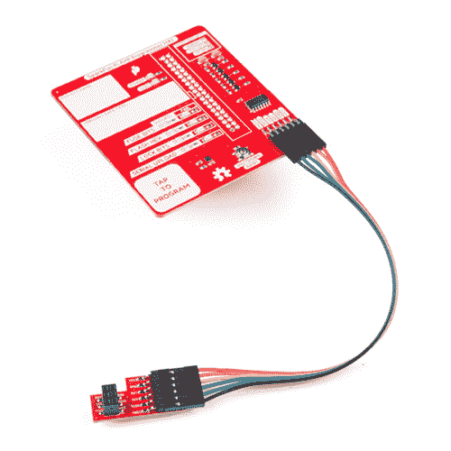

# Pi AVR 程序员帽连接指南

> 原文：<https://learn.sparkfun.com/tutorials/pi-avr-programmer-hat-hookup-guide>

## 介绍

在本教程中，我们将使用一个 [Pi AVR 编程器帽](https://www.sparkfun.com/products/14747)和一个[树莓 Pi 3B+](https://www.sparkfun.com/products/14643) 来编程一个 ATMega328P 目标 IC ( [RedBoard](https://www.sparkfun.com/products/13975) )。我们将使用 capsense pad 通过 SPI 对 Arduino 引导加载程序进行编程，然后在命令行中使用 avrdude 进行一些编程。我们还将介绍 Pi AVR 程序员帽硬件如何与 Python、avrdude 和 shell 命令文件协同工作。

 

### [SparkFun Pi AVR 程序员帽](https://www.sparkfun.com/products/14747)

[Out of stock](https://learn.sparkfun.com/static/bubbles/ "out of stock") DEV-14747

SparkFun Pi AVR 程序员帽可以轻松地直接从任何 Raspberry Pi 上的 SPI 硬件引脚对 AVR 进行编程。

2[Favorited Favorite](# "Add to favorites") 25[Wish List](# "Add to wish list")

[https://www.youtube.com/embed/6QzftAy1fAg/?autohide=1&border=0&wmode=opaque&enablejsapi=1](https://www.youtube.com/embed/6QzftAy1fAg/?autohide=1&border=0&wmode=opaque&enablejsapi=1)

Pi AVR 编程器帽使得直接从任何 Raspberry Pi 上的 SPI 硬件引脚对 AVR 进行编程变得非常容易。它最初是作为 SparkFun 产品的内部解决方案设计的，但现在是作为一个强大的编程工具提供给任何人购买。这是迄今为止最快、最可靠、可破解(完全开源)的 AVR 编程解决方案之一。它可以使用 avrdude 命令直接从命令行使用，或者通过一些简单的设置步骤，它可以作为一个独立的编程器，具有 capsense-pad engage 和状态 led！

所有设计文件、固件和示例编程文件均可在此处找到:

[SparkFun Pi AVR Programmer Github Repository](https://github.com/sparkfun/SparkFun_Pi_AVR_Programmer_HAT)

通过系统内编程器(ISP)对 AVR 进行编程有很多原因:

*   如果你的 AVR 没有安装引导程序，这可能是加载代码的唯一方法。
*   ISP 提供更快、更可靠的代码上传。
*   如果您的项目要求您的硬件 UART 引脚(RX/TX)连接到另一个器件，这可能会与代码的串行上传发生冲突。ISP 编程不需要使用这些引脚。而是使用 MOSI/米索/SCK/RESET - Arduino 引脚 D11/D12/D13/RESET。这意味着您可以在开发期间保持 RX 和 TX 连接，并使用新代码对 AVR 进行重新编程，而无需拔出和重新插入任何编程线路。
*   有了 ISP，你可以覆盖 bootloader，挤出一些额外的闪存空间。
*   ISP 允许你拨动保险丝来改变许多设置，包括掉电电压。

### 本教程涵盖的内容

在本教程中，我们将向您介绍 Pi AVR 程序员帽的所有重要方面。它分为一系列部分，包括:

*   [电路板概述](https://learn.sparkfun.com/tutorials/pi-avr-programmer-hat-hookup-guide#board-overview) -看看构成 Pi AVR 编程器的硬件组件。
*   [Raspberry Pi 设置](https://learn.sparkfun.com/tutorials/pi-avr-programmer-hat-hookup-guide#raspberry-pi-setup) -要开始编程，需要对您的 Raspberry Pi 做一些设置工作。这里，我们将展示要更改的设置以及需要修改和/或复制的文件。
*   [仔细查看存储库文件](https://learn.sparkfun.com/tutorials/pi-avr-programmer-hat-hookup-guide#closer-look-at-repository-files)——在这里，您可以找到设置 Pi 所需的每个文件的更详细描述。
*   如何将 Pi AVR 编程器从您的 Raspi 连接到示例目标 AVR。
*   [ISP 编程:独立](https://learn.sparkfun.com/tutorials/pi-avr-programmer-hat-hookup-guide#isp-programming-stand-alone-aka-headless)——如何在独立模式下使用 HAT，并通过 SPI 将 arduino 引导程序(或任何十六进制文件)编程到 ATMega328p 目标 Redboard)上。
*   ISP 编程:命令行 -使用 Pi AVR 程序员帽的更高级的基于命令行的方法。
*   [ISP 编程:在 Arduino IDE 中](https://learn.sparkfun.com/tutorials/pi-avr-programmer-hat-hookup-guide#isp-programming-within-the-arduino-ide) -如何在 Arduino IDE 中使用 HAT。一个很好的一键式解决方案，用 ISP 的速度编程你的 Arduino。
*   速度测试 -我们拿着帽子进行速度测试，看看它能跑多快！

### 所需材料

**Note** The wishlist is our list of suggested parts to complete this tutorial. You can use any other [Raspberry Pi Model](https://www.sparkfun.com/categories/233) you'd like (0, 2, 3, etc.). In this tutorial we use the 3B+ model. Another good option is the [Raspberry Pi 3 Starter Kit](https://www.sparkfun.com/products/13826), which includes *most* everything you need to get up and running with your Pi. You can choose a different target [Arduino board](https://www.sparkfun.com/categories/242). We use the Redboard in this tutorial.

要完成本教程，您需要以下硬件。你可能不需要所有的东西，这取决于你拥有什么。将它添加到您的购物车，通读指南，并根据需要调整购物车。