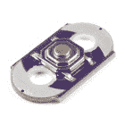
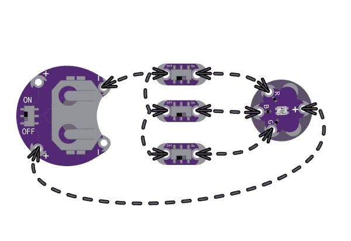
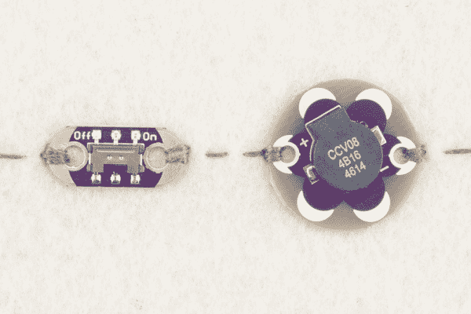
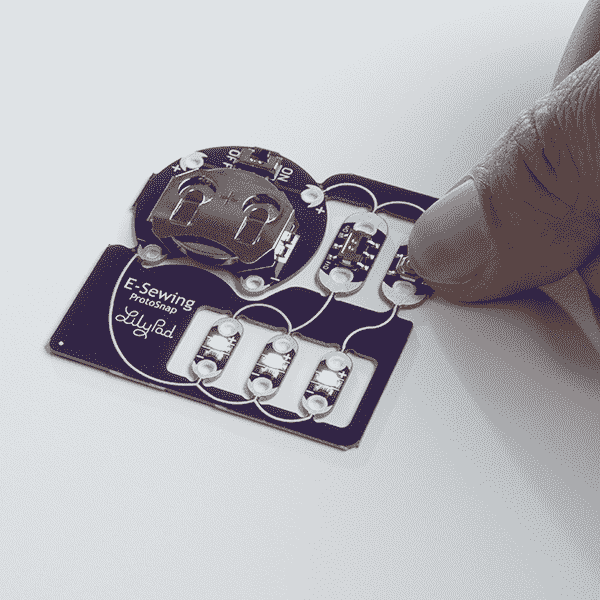

# LilyPad 按钮和开关

> 原文：<https://learn.sparkfun.com/tutorials/lilypad-buttons-and-switches>

## 介绍

[按钮](https://www.sparkfun.com/products/8776)、[滑动开关](https://www.sparkfun.com/products/9350)和[簧片开关](https://www.sparkfun.com/products/13343)是电子元件，你可以用它们来控制一个项目，打开或关闭它，或者触发程序代码中的行为。本指南将概述 LilyPad 可缝合电子产品系列中的可用选项，并提供一些在项目中使用这些选项的示例。

 

将**添加到您的[购物车](https://www.sparkfun.com/cart)中！**

 **### [LilyPad 按钮板](https://www.sparkfun.com/products/8776)

[In stock](https://learn.sparkfun.com/static/bubbles/ "in stock") DEV-08776

我们设计这个板是为了给用户一个没有任何锐边的低调按钮。按钮按下时关闭，按下时打开…

$2.1010[Favorited Favorite](# "Add to favorites") 32[Wish List](# "Add to wish list")**** 

将**添加到您的[购物车](https://www.sparkfun.com/cart)中！**

 **### [LilyPad 滑动开关](https://www.sparkfun.com/products/9350)

[In stock](https://learn.sparkfun.com/static/bubbles/ "in stock") DEV-09350

这是一个简单的 LilyPad 滑动开关。使用它作为一个简单的开/关开关，或控制发光二极管，蜂鸣器，传感器等。T…

$1.992[Favorited Favorite](# "Add to favorites") 26[Wish List](# "Add to wish list")**** 

将**添加到您的[购物车](https://www.sparkfun.com/cart)中！**

 **### [LilyPad 簧片开关](https://www.sparkfun.com/products/13343)

[18 available](https://learn.sparkfun.com/static/bubbles/ "18 available") DEV-13343

LilyPad 簧片开关是簧片开关的一个简单突破，它将使它在电子纺织品电路中的使用变得非常简单

$4.501[Favorited Favorite](# "Add to favorites") 22[Wish List](# "Add to wish list")****** ******您还可以使用 [E-Sewing ProtoSnap](https://www.sparkfun.com/products/14546) 或使用 [LilyPad ProtoSnap Plus](https://www.sparkfun.com/products/14346) 中的 Arduino 探索预连线电路中的按钮和开关。

 

将**添加到您的[购物车](https://www.sparkfun.com/cart)中！**

 **### [lily pad E-seating proto snap](https://www.sparkfun.com/products/14546)

[In stock](https://learn.sparkfun.com/static/bubbles/ "in stock") DEV-14546

LilyPad E-Sewing ProtoSnap 是一个很好的方式来探索按钮和开关在简单的 E-Sewing 电路中的行为

$6.954[Favorited Favorite](# "Add to favorites") 11[Wish List](# "Add to wish list")**** 

将**添加到您的[购物车](https://www.sparkfun.com/cart)中！**

 **### [LilyPad ProtoSnap 加](https://www.sparkfun.com/products/14346)

[In stock](https://learn.sparkfun.com/static/bubbles/ "in stock") DEV-14346

LilyPad ProtoSnap Plus 是一个可缝合的电子原型板，您可以使用它来探索电路和编程，测试

$42.95[Favorited Favorite](# "Add to favorites") 10[Wish List](# "Add to wish list")**** ****### 推荐阅读

在开始之前，您可以查看以下附加资源:

 [### 按钮和开关基础知识](https://learn.sparkfun.com/tutorials/button-and-switch-basics) A tutorial on electronics' most overlooked and underappreciated component: the switch! Here we explain the difference between momentary and maintained switches and what all those acronyms (NO, NC, SPDT, SPST, ...) stand for.[Favorited Favorite](# "Add to favorites") 53 [### LilyPad 基础:电子缝纫](https://learn.sparkfun.com/tutorials/lilypad-basics-e-sewing) Learn how to use conductive thread with LilyPad components.[Favorited Favorite](# "Add to favorites") 16 [### LilyPad 入门](https://learn.sparkfun.com/tutorials/getting-started-with-lilypad) An introduction to the LilyPad ecosystem - a set of sewable electronic pieces designed to help you build soft, sewable, interactive e-textile projects.[Favorited Favorite](# "Add to favorites") 12

## 什么是按钮和开关？

按钮和开关是控制电路中电流流动的电子元件。它们可以作为点亮 LED 的简单网关，或者作为微控制器的输入。按钮被认为是开关的一种类型，通常具有瞬时的推动动作。在本节中，我们将两者都称为交换机。

### 切换状态

要将开关从一种状态改变到另一种状态，需要物理动作，通常是翻转、滑动或推动。这叫做**启动**开关。不同类型的开关有不同的启动方法。在 LilyPad 系列中，你可以通过滑动、推动甚至使用磁铁来触发来激活开关。

### 维持开关与瞬时开关

保持一种状态直到改变的开关被称为**保持**开关。一些常见的维护开关的例子有灯开关、设备上的开/关开关和拨动开关。LilyPad 滑动开关是维护开关的一个例子。

一个**瞬时**开关仅在被启动时激活。按钮是瞬时开关的常见例子。你可能在你周围找到的其他瞬时开关是你键盘上的按键——一个字母只有在按键时才能被打出。LilyPad 按钮是瞬时开关的一个例子。

## LilyPad 滑动开关

LilyPad 滑动开关有一个标有开/关的小开关。当移动到关闭位置时，开关内部的零件相互远离，并打开电路(断开电路)。没有电流通过开关流到与其 sew 接头相连的部件。当拨动开关移动到 ON 位置时，开关上的两个 sew 凸耳连接，允许电流流过并闭合电路。

*Using a LilyPad Slide Switch on the LilyPad ProtoSnap Plus*

### 例子

滑动开关可用于控制电子缝纫项目中的单个发光二极管。这里有一个使用三个用导电线连接的滑动开关来控制 [LilyPad 三色 LED](https://www.sparkfun.com/products/8467) 上每个颜色通道的例子。

*Simple color mixing circuit using LilyPad Switches connected to each color tab of the tri-color LED.*

滑动开关也可用于关闭项目中的元素，如在调试时或当您想要一点安静时关闭蜂鸣器或指示器。下面的例子显示了缝在 [LilyPad 蜂鸣器](https://www.sparkfun.com/products/8463)中的滑动开关。这使得项目的其他功能在蜂鸣器断电时仍能发挥作用。

您也可以将滑动开关连接到 LilyPad Arduino，并在您的程序中读取其状态。这是一个在 LilyPad ProtoSnap Plus 上的项目中使用 LilyPad 按钮和 LilyPad 开关来控制 led 的示例。

[https://www.youtube.com/embed/X2X3WJJ-Cl8/?autohide=1&border=0&wmode=opaque&enablejsapi=1](https://www.youtube.com/embed/X2X3WJJ-Cl8/?autohide=1&border=0&wmode=opaque&enablejsapi=1)

这个可穿戴骰子项目教程利用七个滑动开关从 4、6、8、10、12、20 和 100 面虚拟骰子中进行选择。

 [### 龙与地下城骰子战书

#### 2013 年 8 月 13 日](https://learn.sparkfun.com/tutorials/dungeons-and-dragons-dice-gauntlet) A playful, geeky tutorial for a leather bracer that uses a LilyPad Arduino, LilyPad accelerometer, and seven segment display to roll virtual 4, 6, 8, 10, 12, 20, and 100 side dice for gaming.[Favorited Favorite](# "Add to favorites") 9

## LilyPad 簧片开关

LilyPad 簧片开关是 LilyPad 系列中的另一种开关。与其他 LilyPad 开关产品不同，簧片开关不需要您触摸电路板来激活它。簧片开关内部是两个薄金属片，当暴露在磁场中时，它们相互接触。

请阅读完整的连接指南，了解如何使用它。

 [### LilyPad 簧片开关连接指南

#### 2015 年 11 月 5 日](https://learn.sparkfun.com/tutorials/lilypad-reed-switch-hookup-guide) A guide to using the LilyPad Reed Switch breakout in your projects.[Favorited Favorite](# "Add to favorites") 2

### 例子

在这一集的 Electricute 中，Dia 和 Nick 使用 LilyPad 簧片开关和磁铁制作了一个互动的坎卜斯长袜。

[https://www.youtube.com/embed/-ZHPc9gk9wg/?autohide=1&border=0&wmode=opaque&enablejsapi=1](https://www.youtube.com/embed/-ZHPc9gk9wg/?autohide=1&border=0&wmode=opaque&enablejsapi=1)

## LilyPad 按钮

LilyPad 按钮板也是一种开关。当您按下电路板中间的按钮时，它会连接两个 sew 标签并允许电流通过。当您放开按钮时，连接会再次打开，按钮会弹回原位。该按钮是瞬时开关的一个例子。

*Pressing the LilyPad Button on the E-Sewing ProtoSnap*

### 例子

这个填充的生物使用滑动开关和按钮来控制嵌入其中的发光二极管。

 [### 发光长毛绒

#### 2016 . 12 . 16](https://learn.sparkfun.com/tutorials/light-up-plush) Craft a light-up plush with LilyPad LEDs controlled by pressing a button and sliding a switch in the creature's hands.[Favorited Favorite](# "Add to favorites") 8

这是一个按钮的例子，它被用作连接到 LilyMini 微控制器的输入，以切换 LED 模式。

[https://www.youtube.com/embed/tL7klrrHkR8/?autohide=1&border=0&wmode=opaque&enablejsapi=1](https://www.youtube.com/embed/tL7klrrHkR8/?autohide=1&border=0&wmode=opaque&enablejsapi=1)

## 资源和更进一步

除了使用 LilyPad 片段为项目添加交互性之外，您还可以创建自己的自定义按钮和开关。查看这些博客文章了解更多信息:

*   [4 种制作 Diy 可缝合电子传感器的巧妙方法](https://blog.sparkfuneducation.com/5-crafty-ways-to-make-diy-sewable-electronic-sensors)
*   [6 个简单的 DIY 软组件](https://www.sparkfun.com/news/2625)

准备好使用 LilyPad Arduino 为项目添加一些交互性了吗？请查看 ProtoSnap Plus 活动指南，以获取代码示例。

 [### LilyPad ProtoSnap Plus 活动指南

#### 2017 年 12 月 7 日](https://learn.sparkfun.com/tutorials/lilypad-protosnap-plus-activity-guide) Learn how to program in Arduino with the LilyPad ProtoSnap Plus. This guide includes 10 example activities that use the pre-wired LilyPad boards on the LilyPad ProtoSnap Plus.[Favorited Favorite](# "Add to favorites") 6

为了获得灵感，看看下面的一些项目吧！

 [### 对 LilyTiny / LilyTwinkle 重新编程](https://learn.sparkfun.com/tutorials/re-programming-the-lilytiny--lilytwinkle) A quick tutorial showing how to reprogram the ATtiny85 IC found on the LilyTiny or LilyTwinkle boards.[Favorited Favorite](# "Add to favorites") 4 [### 电致发光(EL)线入门](https://learn.sparkfun.com/tutorials/getting-started-with-electroluminescent-el-wire) This guide will help you get started with electroluminescent (EL) wire, tape, panel, chasing wire, and bendable wire to let your project glow 14 [### 规划可穿戴电子项目](https://learn.sparkfun.com/tutorials/planning-a-wearable-electronics-project) Tips and tricks for brainstorming and creating a wearables project.[Favorited Favorite](# "Add to favorites") 25 [### LilyPad 温度传感器连接指南](https://learn.sparkfun.com/tutorials/lilypad-temperature-sensor-hookup-guide) How to hook up the LilyPad Temperature Sensor as well as some project ideas and example code.[Favorited Favorite](# "Add to favorites") 3**********