# Qwiic Flex 手套控制器连接指南

> 原文：<https://learn.sparkfun.com/tutorials/qwiic-flex-glove-controller-hookup-guide>

## 介绍

Flex 传感器非常适合用来判断项目中物体的弯曲程度，但在手套等可穿戴应用中使用时，我们遇到了耐用性问题。 [Qwiic Flex Glove 控制器](https://www.sparkfun.com/products/14666)隔离了弱点，以允许更持久的弯曲传感器应用。该板有一个片上 ADS1015 ADC 来 I ² C，因此我们可以获得一整串模拟输入，而无需接触微控制器的 ADC 引脚。

[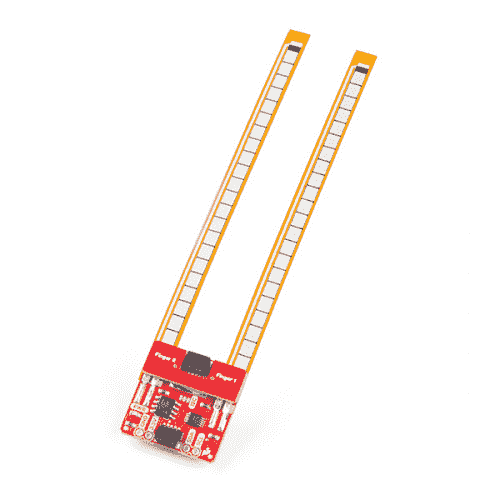](https://www.sparkfun.com/products/14666) 

将**添加到您的[购物车](https://www.sparkfun.com/cart)中！**

### [SparkFun Qwiic Flex 手套控制器](https://www.sparkfun.com/products/14666)

[In stock](https://learn.sparkfun.com/static/bubbles/ "in stock") SEN-14666

SparkFun Qwiic Flex 手套控制器允许您将 Flex 传感器集成到手套中，以控制灯光、声音和…

$44.95[Favorited Favorite](# "Add to favorites") 24[Wish List](# "Add to wish list")** **[https://www.youtube.com/embed/8PYa828t3MQ/?autohide=1&border=0&wmode=opaque&enablejsapi=1](https://www.youtube.com/embed/8PYa828t3MQ/?autohide=1&border=0&wmode=opaque&enablejsapi=1)

在本连接指南中，我们将了解如何从手指上获取数值，以及如何针对我们的运动范围校准传感器。我们还将介绍将这些应用到手套中的推荐放置和安装方法。

### 所需材料

首先，你需要一个微控制器来控制一切。

[](https://www.sparkfun.com/products/13975) 

将**添加到您的[购物车](https://www.sparkfun.com/cart)中！**

### [spark fun red board——用 Arduino 编程 T3](https://www.sparkfun.com/products/13975)

[In stock](https://learn.sparkfun.com/static/bubbles/ "in stock") DEV-13975

SparkFun RedBoard 结合了 UNO 的 Optiboot 引导程序的简单性、FTDI 的稳定性和 shield com…

$21.5049[Favorited Favorite](# "Add to favorites") 89[Wish List](# "Add to wish list")****[](https://www.sparkfun.com/products/13907) 

将**添加到您的[购物车](https://www.sparkfun.com/cart)中！**

### [SparkFun ESP32 东西](https://www.sparkfun.com/products/13907)

[In stock](https://learn.sparkfun.com/static/bubbles/ "in stock") DEV-13907

SparkFun ESP32 Thing 是 Espressif 的 ESP32 的综合开发平台，ESP32 是他们的超级充电版本…

$23.5069[Favorited Favorite](# "Add to favorites") 83[Wish List](# "Add to wish list")****[](https://www.sparkfun.com/products/13774) 

将**添加到您的[购物车](https://www.sparkfun.com/cart)中！**

### [【粒子光子】](https://www.sparkfun.com/products/13774)

[Out of stock](https://learn.sparkfun.com/static/bubbles/ "out of stock") WRL-13774

Particle 的 IoT(物联网)硬件开发板 Photon 提供了构建互联网络所需的一切…

$19.0032[Favorited Favorite](# "Add to favorites") 51[Wish List](# "Add to wish list")****[](https://www.sparkfun.com/products/retired/13825) 

### [树莓派 3](https://www.sparkfun.com/products/retired/13825)

[Retired](https://learn.sparkfun.com/static/bubbles/ "Retired") DEV-13825

每个人都知道并喜欢 Raspberry Pi，但如果您不需要额外的外设来使其无线化会怎么样呢？覆盆子…

92 **Retired**[Favorited Favorite](# "Add to favorites") 97[Wish List](# "Add to wish list")****** ******现在，要进入 Qwiic 生态系统，关键是以下 Qwiic 屏蔽之一，以符合您对微控制器的偏好:

[](https://www.sparkfun.com/products/14352) 

将**添加到您的[购物车](https://www.sparkfun.com/cart)中！**

### [ArduinoT3 的 SparkFun Qwiic 盾](https://www.sparkfun.com/products/14352)

[In stock](https://learn.sparkfun.com/static/bubbles/ "in stock") DEV-14352

SparkFun Qwiic Shield 是一种易于组装的板，它提供了一种简单的方法来将 Qwiic Connect 系统与

$7.508[Favorited Favorite](# "Add to favorites") 39[Wish List](# "Add to wish list")****[](https://www.sparkfun.com/products/14459) 

将**添加到您的[购物车](https://www.sparkfun.com/cart)中！**

### [树莓派的 SparkFun Qwiic 帽子](https://www.sparkfun.com/products/14459)

[In stock](https://learn.sparkfun.com/static/bubbles/ "in stock") DEV-14459

树莓派的 SparkFun Qwiic 帽子是进入 Qwiic 生态系统的最快捷、最简单的方式，并且仍然适用于

$6.505[Favorited Favorite](# "Add to favorites") 33[Wish List](# "Add to wish list")****[](https://www.sparkfun.com/products/14477) 

将**添加到您的[购物车](https://www.sparkfun.com/cart)中！**

### [光子盾](https://www.sparkfun.com/products/14477)

[28 available](https://learn.sparkfun.com/static/bubbles/ "28 available") DEV-14477

SparkFun Qwiic Shield for Photon 是一个易于组装的板，提供了一种简单的方法来整合 Qwiic 系统…

$6.50[Favorited Favorite](# "Add to favorites") 7[Wish List](# "Add to wish list")****** ******您还需要一根 Qwiic 电缆来连接屏蔽层和传感器，选择适合您需要的长度。

[](https://www.sparkfun.com/products/14427) 

将**添加到您的[购物车](https://www.sparkfun.com/cart)中！**

### [Qwiic 线缆- 100mm](https://www.sparkfun.com/products/14427)

[In stock](https://learn.sparkfun.com/static/bubbles/ "in stock") PRT-14427

这是一条 100 毫米长的 4 芯电缆，带有 1 毫米 JST 端接。它旨在将支持 Qwiic 的组件连接在一起…

$1.50[Favorited Favorite](# "Add to favorites") 32[Wish List](# "Add to wish list")****[](https://www.sparkfun.com/products/14429) 

将**添加到您的[购物车](https://www.sparkfun.com/cart)中！**

### [Qwiic 线缆- 500mm](https://www.sparkfun.com/products/14429)

[In stock](https://learn.sparkfun.com/static/bubbles/ "in stock") PRT-14429

这是一根 500mm 长的 4 芯电缆，带有 1mm JST 端接。它旨在将支持 Qwiic 的组件连接在一起…

$1.951[Favorited Favorite](# "Add to favorites") 25[Wish List](# "Add to wish list")****[](https://www.sparkfun.com/products/14426) 

将**添加到您的[购物车](https://www.sparkfun.com/cart)中！**

### [Qwiic 线缆- 50mm](https://www.sparkfun.com/products/14426)

[In stock](https://learn.sparkfun.com/static/bubbles/ "in stock") PRT-14426

这是一根 50 毫米长的 4 芯电缆，带有 1 毫米 JST 端接。它旨在将支持 Qwiic 的组件连接在一起…

$0.95[Favorited Favorite](# "Add to favorites") 29[Wish List](# "Add to wish list")****[](https://www.sparkfun.com/products/14428) 

### [Qwiic 线缆- 200mm](https://www.sparkfun.com/products/14428)

[Out of stock](https://learn.sparkfun.com/static/bubbles/ "out of stock") PRT-14428

这是一根 200 毫米长的 4 芯电缆，带有 1 毫米 JST 端接。它旨在将支持 Qwiic 的组件连接在一起…

[Favorited Favorite](# "Add to favorites") 21[Wish List](# "Add to wish list")****** ******如果你没有缝纫针，我们建议你拿一个，如果你想把这些弯曲传感器加到一些手套上。

[](https://www.sparkfun.com/products/10405) 

将**添加到您的[购物车](https://www.sparkfun.com/cart)中！**

### [针套](https://www.sparkfun.com/products/10405)

[Out of stock](https://learn.sparkfun.com/static/bubbles/ "out of stock") TOL-10405

这一套缝纫针是缝合你的下一个电子纺织品项目的必备工具。每个信封包含三个 4…

$2.10[Favorited Favorite](# "Add to favorites") 10[Wish List](# "Add to wish list")** **### 推荐阅读

如果你不熟悉 Qwiic 系统，我们推荐你在这里阅读[以获得一个概述](https://www.sparkfun.com/qwiic)。

| [](https://www.sparkfun.com/qwiic) |
| *[Qwiic 连接系统](https://www.sparkfun.com/qwiic)* |

如果你还没有看 Qwiic Shield 的连接指南，我们也建议你看一看。也建议你温习一下 I ² C 的技能，因为所有的 Qwiic 传感器都是 I ² C 的

[](https://learn.sparkfun.com/tutorials/i2c) [### I2C](https://learn.sparkfun.com/tutorials/i2c) An introduction to I2C, one of the main embedded communications protocols in use today.[Favorited Favorite](# "Add to favorites") 128[](https://learn.sparkfun.com/tutorials/terminal-basics) [### 串行终端基础知识](https://learn.sparkfun.com/tutorials/terminal-basics) This tutorial will show you how to communicate with your serial devices using a variety of terminal emulator applications.[Favorited Favorite](# "Add to favorites") 46[](https://learn.sparkfun.com/tutorials/qwiic-shield-for-arduino--photon-hookup-guide) [### Arduino 和光子连接指南的 Qwiic 屏蔽](https://learn.sparkfun.com/tutorials/qwiic-shield-for-arduino--photon-hookup-guide) Get started with our Qwiic ecosystem with the Qwiic shield for Arduino or Photon.[Favorited Favorite](# "Add to favorites") 5

你也很可能想把这些木板缝进一个可穿戴的项目中，所以如果你以前从来没有拿过针线，我们建议你看看[如何手工缝纫](https://www.youtube.com/watch?v=ZvzMMcKHVR4)。

## 硬件概述

让我们看一下 ADS1015 的一些特性，以便更好地了解手套控制器的工作原理。

| **特性** | **范围** |
| 工作电压 | **2.0V - 5.5V** |
| 工作温度 | -40 摄氏度- 125 摄氏度 |
| 解决 | 12 位 |
| 抽样率 | 128 赫兹- 3.3 千赫 |
| 电流消耗 | 150 微安(典型值。) |
| I ² C 地址 | 0x48(默认)、0x49、0x4A、0x4B |

### 腿

下表概述了磁力计上可用引脚的特性。

| Pin Label | 引脚功能 | 输入/输出 | 笔记 |
| 3.3V | 电源 | 投入 | 应该在 **2.2V - 3.6V** 之间 |
| GND | 地面 | 投入 | 0V/公共电压。 |
| 国家药品监督管理局 | I ² C 数据信号 | 双向的 | 双向数据线。电压不应超过电源电压(例如 3.3V)。 |
| SCL | I ² C 时钟信号 | 投入 | 主控时钟信号。电压不应超过电源电压(例如 3.3V)。 |

### 可选功能

Qwiic 柔性手套控制器具有板载 I ² C 上拉电阻；如果多个传感器连接到总线并使能上拉电阻(如果您要制作一整套手套，很可能会这样)，并联等效电阻将产生太强的上拉电阻，使总线无法正常工作。一般来说，如果总线上连接了多个器件，则除一对上拉电阻外，应禁用所有上拉电阻。如果需要断开上拉电阻，可以通过切断下面突出显示的相应跳线上的走线来移除。

[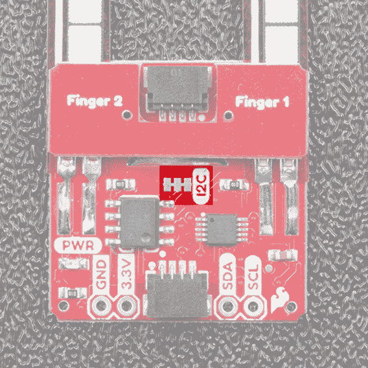](https://cdn.sparkfun.com/assets/learn_tutorials/7/8/5/I2CPU.png)

可以使用电路板背面的跳线更改电路板的 I ² C 地址。地址选择引脚连接到每个跳线的中心焊盘，下表显示了地址选择引脚连接到 4 个可用焊盘时的可用地址。

| **引脚** | **地址** |
| GND | 0x48(默认) |
| VCC | 0x49 |
| 国家药品监督管理局 | 0x4A |
| SCL | 0x4B |

下图显示了跳线的位置。

[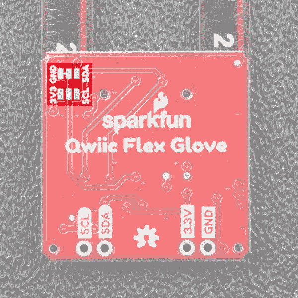](https://cdn.sparkfun.com/assets/learn_tutorials/7/8/5/ADR.png)

木板底角的孔用于将木板缝进你选择的手套中。

[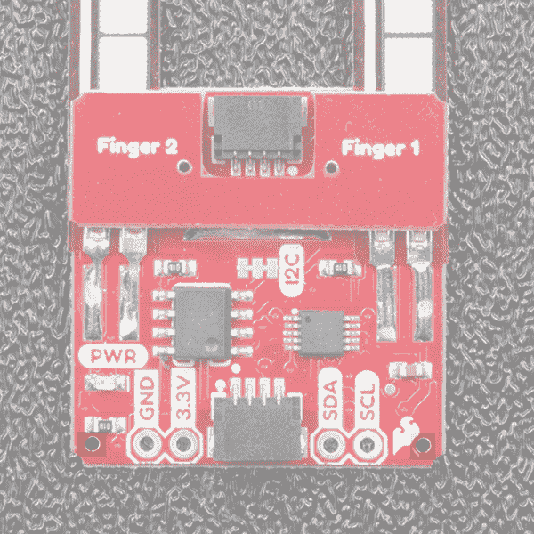](https://cdn.sparkfun.com/assets/learn_tutorials/7/8/5/Sewing.png)

确保不要弄皱柔性传感器，否则会损坏传感器！

## 硬件装配

如果你还没有组装你的 Qwiic 盾，现在是时候去那个教程了。

[Qwiic Shield for Arduino Photon Hookup Guide](https://learn.sparkfun.com/tutorials/qwiic-shield-for-arduino--photon-hookup-guide)

随着盾牌的组装，SparkFun 的新 Qwiic 环境意味着连接传感器不可能更容易。只需将 Qwiic 电缆的一端插入 Flex Glove Controller 分接头，另一端插入您选择的 Qwiic Shield，您就可以上传草图并计算出您的手指弯曲程度。它似乎太容易使用了，但这就是为什么我们要这样做！

[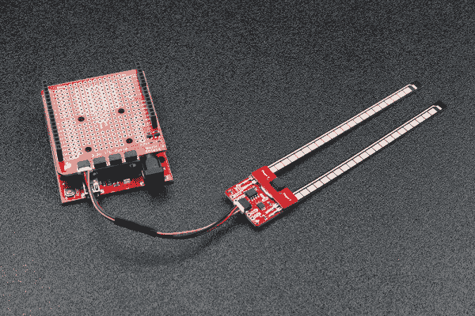](https://cdn.sparkfun.com/assets/learn_tutorials/7/8/5/Qwiic_Flex_Glove_Controller-01.jpg)

你可能想把这块板集成到一些手套里，毕竟这是它最初设计的目的。如果你想在 8 个手指上安装传感器，你需要 4 块手套板，如果你在同一 I ^s C 总线上有 4 块板，你需要使用 ADS1015 的所有可用地址。所以从改变你的板的地址开始，这样就不会有两块板共享同一个地址。

现在我们想把冲浪板贴在手套上。我们发现最好将电路板夹在两层手套之间，以保持传感器与手指齐平。为了做到这一点，我们将把木板缝到内层手套的外层。首先，将手套平放，将板子放在手套上，使弯曲传感器的末端接触到指尖。

[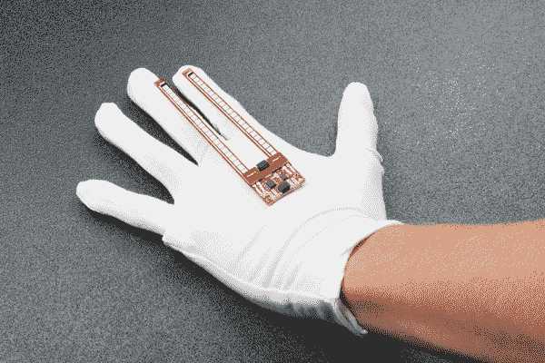](https://cdn.sparkfun.com/assets/learn_tutorials/7/8/5/Qwiic_Flex_Glove_Controller-04.jpg)

一旦你把传感器放在手套上，用记号笔在缝纫孔接触手套的地方做个标记。

[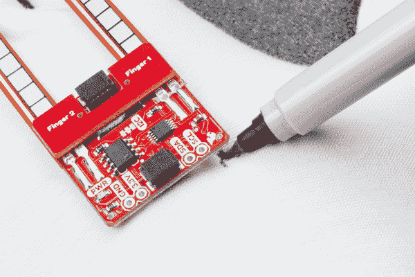](https://cdn.sparkfun.com/assets/learn_tutorials/7/8/5/Qwiic_Flex_Glove_Controller-05.jpg)

现在只需将这些点缝到传感器上可用的安装孔中，成品应该看起来像下面的手套。

[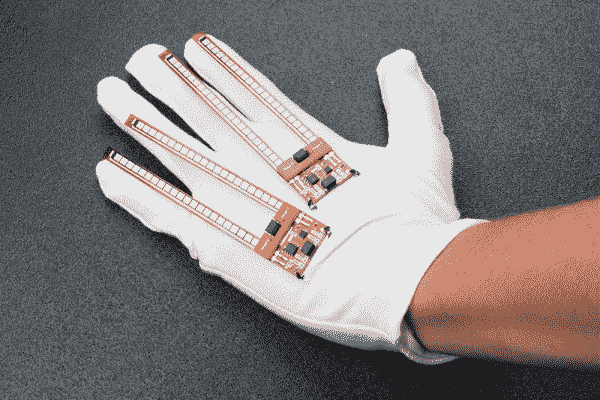](https://cdn.sparkfun.com/assets/learn_tutorials/7/8/5/Qwiic_Flex_Glove_Controller-06.jpg)

现在是时候把电路藏在第二只手套下面了。继续戴上第二只手套的手指，然后将弯曲传感器滑入两层织物之间的缝隙。下图显示了此过程中不同状态下的传感器。

[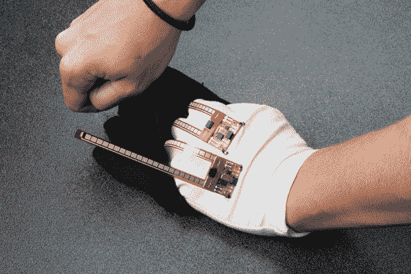](https://cdn.sparkfun.com/assets/learn_tutorials/7/8/5/Qwiic_Flex_Glove_Controller-07.jpg)

现在只需插入 Qwiic 电缆将两块电路板连接在一起，然后将一块电路板插入您的微控制器，这样我们就可以从手套中获取读数。

## 库概述

**注意:**此示例假设您在桌面上使用的是最新版本的 Arduino IDE。如果这是你第一次使用 Arduino，请回顾我们关于[安装 Arduino IDE 的教程。](https://learn.sparkfun.com/tutorials/installing-arduino-ide)如果您之前没有安装 Arduino 库，请查看我们的[安装指南。](https://learn.sparkfun.com/tutorials/installing-an-arduino-library)

在我们开始从 flex 传感器获取数据之前，让我们看看库中可用的函数。我们编写了一个库来控制 flex 传感器。你可以通过 Arduino 库管理器来抓取这个库。搜索 **SparkFun ADS1015 Arduino 库**应该可以安装最新版本。如果你喜欢从 [GitHub 库](https://github.com/sparkfun/SparkFun_ADS1015_Arduino_Library)手动下载库，你可以在这里下载:

[Download the SparkFun ADS1015 Arduino Library (ZIP)](https://github.com/sparkfun/SparkFun_ADS1015_Arduino_Library/archive/master.zip)

让我们从查看设置 flex 控制器的函数开始。

### 设置和设置

*   **`boolean begin(uint8_t deviceAddress = BNO080_DEFAULT_ADDRESS, TwoWire &wirePort = Wire);`**——默认情况下使用默认的 I2C 地址和使用有线端口。否则，传入一个自定义 I ² C 地址和有线端口。

*   **`uint16_t getAnalogData(uint8_t channel);`** -返回传感器未校准的模拟值。

*   **`float getScaledAnalogData(uint8_t channel);`** -根据校准返回 0 到 1 之间的值。不先运行`calibrate()`将无法正常工作
*   **`void calibrate();`** -用于校准传感器并将灵活范围映射到用户给定的值。运行校准时，只需将每个传感器弯曲到将在您的项目中使用的最小和最大值。

*   **`void setMode(uint16_t mode);`** -设置传感器的模式。模式 0 是连续读取模式，模式 1 是单次读取模式

*   **`uint16_t getMode();`** -获取 ADS1015 的读取模式。
*   **`getCalibration(uint8_t channel, bool hiLo)`** -获取某个通道的高或低校准值。如果`hiLo`为真，`getCalibration()`将返回给定通道的高校准。
*   **`setCalibration(uint8_t channel, bool hiLo, uint16_t value)`** -设置通道的高或低校准值，不使用自动校准功能。允许手动校准。
*   **`resetCalibration()`** -将校准重置为 0。

*   **`void setGain(uint16_t gain);`**——传入不同的值获得不同的增益

*   **`uint16_t getGain();`** -获得 ADS1015 的增益。这将返回 16 位十六进制值。下面列出了这些值及其相应的增益。

    *   **`0x0E00`**:&pm；0.256 伏
    *   **`0X0000`**:&pm；6.144 伏
    *   **`0X0200`**:&pm；4.096 伏
    *   **`0X0400`**:&pm；2.048 伏
    *   **`0X0600`**:&pm；1.024 伏
    *   **`0X0800`**:&pm；0.512 伏
    *   **`0X0A00`**:&pm；0.256 伏
*   **`void setSampleRate(uint16_t sampleRate);`** -设置 ADS1015 的采样速率，传入下面的 16 位值来改变相应的采样速率。

    *   **`0X0000`** : 128 赫兹
    *   **`0X0020`** : 250 赫兹
    *   **`0X0040`** : 490 赫兹
    *   **`0X0060`** : 920 赫兹
    *   **`0X0080`** : 1600 赫兹
    *   **`0X00A0`** : 2400 赫兹
    *   **`0X00C0`** : 3300 赫兹
*   **`uint16_t getSampleRate();`** -根据上面的采样率列表返回采样率。

## 示例代码

现在我们知道了库是如何工作的，让我们开始从 flex 传感器中提取值。

### 例 1 -基本阅读

从第一个例子开始，打开**文件** > **例子**>**spark fun ads 1015 Arduino 库** > **Qwiic Flex 手套控制器** > **例子 1 _ basic creadings**。在这个例子中，我们首先创建一个名为`fingerSensor`的 **`ADS1015`** 对象，然后在`setup()`循环中初始化我们的传感器对象。然后，我们通过循环读取 ADS1015 上的每个通道来获得每个手指的值。这方面的代码如下所示。

```
language:c
#include <SparkFun_ADS1015_Arduino_Library.h>

ADS1015 fingerSensor;

void setup() {

  Wire.begin();
  Serial.begin(115200);

  if (fingerSensor.begin(Wire, 100000, ADS1015_ADDRESS_GND) == false) {
     Serial.println("Device not found. Check wiring.");
     while (1);
  }

}

void loop() {  
  uint16_t data;
  for (int finger = 0; finger < 2; finger++) {
    data = fingerSensor.getAnalogData(finger);
    Serial.print(finger);
    Serial.print(": ");
    Serial.print(data);
    Serial.print(",");
  }
  Serial.println();
} 
```

上传这个草图，打开串行监视器到 115200 bps，会产生一个类似下图的输出。

[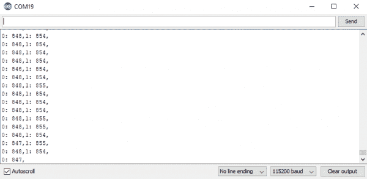](https://cdn.sparkfun.com/assets/learn_tutorials/7/8/5/EX1.PNG)*Single Sensor Output - click the image for a closer look*

### 示例 2 -设置手

在本例中，我们将了解如何设置一整只手的 flex 传感器。从这个例子开始，打开**文件** > **例子**>**spark fun ads 1015 Arduino 库** > **Qwiic Flex 手套控制器** > **例子 2_SetupHand** 。在这个例子中，我们创建了两个`ADS1015`对象，将它们命名为`indexSensor`和`pinkySensor`，以对应它们在手套上的位置。我们还创建了一个包含 4 个点的数组来保存名为`hand`的手的数据。然后我们用来自每个传感器的值填充`hand`。完成此任务的代码如下所示。

```
language:c
#include <SparkFun_ADS1015_Arduino_Library.h>

ADS1015 pinkySensor;
ADS1015 indexSensor;
uint16_t hand[4] = {0, 0, 0, 0};

void setup() { 
  Wire.begin();
  Serial.begin(115200);

  if (pinkySensor.begin(Wire, 100000, ADS1015_ADDRESS_SDA) == false) {
     Serial.println("Pinky not found. Check wiring.");
     while (1);
  }
  if (indexSensor.begin(Wire, 100000, ADS1015_ADDRESS_GND) == false) {
     Serial.println("Index not found. Check wiring.");
     while (1);
  }  
}

void loop() {  
  uint16_t data;
  for (int finger = 0; finger < 2; finger++) {
    hand[finger] = indexSensor.getAnalogData(finger);
    hand[finger + 2] = pinkySensor.getAnalogData(finger);
  }
  for (int finger = 0; finger < 4; finger++)
  {
    Serial.print(finger);
    Serial.print(": ");
    Serial.print(hand[finger]);
    Serial.print(" ");
  }
  Serial.println();
} 
```

上传这个草图，打开串行监视器到 115200 bps，会产生一个类似下图的输出。

[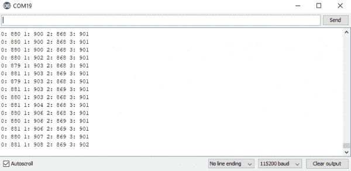](https://cdn.sparkfun.com/assets/learn_tutorials/7/8/5/EX2.PNG)*Full Glove Output - click the image for a closer look*

### 示例 3 -校准

第二个例子将向我们展示如何校准我们的 flex 传感器，以便当我们的手指合拢时得到 0，张开时得到 1。要上手，打开**文件** > **示例**>**spark fun ads 1015 Arduino 库** > **Qwiic Flex 手套控制器** > **示例 3 _ 校准**。在本例中，我们将校准传感器的最大值和最小值，以便找到传感器的范围。

```
language:c
#include <SparkFun_ADS1015_Arduino_Library.h>
#include <Wire.h>

ADS1015 fingerSensor;

void setup() {

  Wire.begin();
  Serial.begin(115200);

  if (fingerSensor.begin(Wire, 100000, ADS1015_ADDRESS_GND) == false) {
     Serial.println("Device not found. Check wiring.");
     while (1);
  }
  Serial.println("Calibrating, send 'e' when finished");
}

void loop() {
  uint8_t incoming;
  do
  {
    fingerSensor.calibrate();

    if(Serial.available())
    {
       incoming = Serial.read();
    }
  } while (incoming != 'e');
  Serial.println("Calibrated");

  for (int channel; channel < 2; channel++)
  {
    Serial.print("Channel ");
    Serial.print(channel);
    Serial.print(": ");
    for (int hiLo = 0; hiLo < 2; hiLo++)
    {
      switch (hiLo)
      {
        case 0:
        Serial.print("Low: ");
        Serial.print(fingerSensor.getCalibration(channel, hiLo));
        break;
        case 1:
        Serial.print(" High: ");
        Serial.print(fingerSensor.getCalibration(channel, hiLo));
        break;
      }
    }
    Serial.println();
  }
} 
```

传感器以与第一个例子相同的方式初始化，然后我们的`loop()`开始校准传感器。要校准传感器，只需将它们弯曲到最大和最小弯曲半径，然后在完成后通过串行监视器发送一个`e`。这将保存当前校准，并显示已保存的值。一旦你发送了`e`并保存了校准，上传这个草图并打开串行监视器到 115200 bps 会产生一个类似下图的输出。

[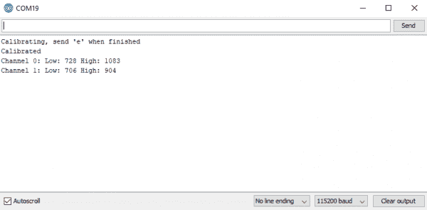](https://cdn.sparkfun.com/assets/learn_tutorials/7/8/5/EX3.PNG)*Calibration Output - click the image for a closer look*

### 示例 4 -校准的指针

你不一定想每次戴上内置 flex 控制器的手套时都校准你的手，所以如果我们已经知道如何手动设置校准，让我们来看看如何手动设置校准。要上手，打开**文件** > **示例**>**spark fun ads 1015 Arduino 库** > **Qwiic Flex 手套控制器** > **示例 4 _ 手动校准**。我们可以在代码的序言中看到，我们有一个所有校准值的数组，这些值是使用前面的示例草图获得的。然后，我们在设置功能中使用一个循环以及我们的`setCalibration()`功能来设置各个校准值。这方面的代码如下所示。

```
language:c
#include <SparkFun_ADS1015_Arduino_Library.h>
#include <Wire.h>

ADS1015 pinkySensor;
ADS1015 indexSensor;
float hand[4] = {0, 0, 0, 0};
uint16_t handCalibration[4][2] = {
//{hi , low}
  {722, 1080},//index
  {600, 980},//middle
  {680, 900},//ring
  {736, 907} //pinky
};

void setup() {

  Wire.begin();
  Serial.begin(115200);

  //Begin our finger sensors, change addresses as needed.
  if (pinkySensor.begin(Wire, 100000, ADS1015_ADDRESS_SDA) == false) 
  {
     Serial.println("Pinky not found. Check wiring.");
     while (1);
  }
  if (indexSensor.begin(Wire, 100000, ADS1015_ADDRESS_GND) == false) 
  {
     Serial.println("Index not found. Check wiring.");
     while (1);
  }

  //Set the calibration values for the hand.
  for (int channel; channel < 2; channel++)
  {
    for (int hiLo = 0; hiLo < 2; hiLo++)
    {
      indexSensor.setCalibration(channel, hiLo, handCalibration[channel][hiLo]);
      pinkySensor.setCalibration(channel, hiLo, handCalibration[channel + 2][hiLo]);
    }
    Serial.println();
  }
}

void loop() {
  for (int channel = 0; channel < 2; channel++)
  {
    //Keep in mind that getScaledAnalogData returns a float
    hand[channel] = indexSensor.getScaledAnalogData(channel);
    hand[channel + 2] = pinkySensor.getScaledAnalogData(channel);
  }
  for (int finger = 0; finger < 4; finger++)
  {
    Serial.print(finger);
    Serial.print(": ");
    Serial.print(hand[finger]);
    Serial.print(" ");
  }
  Serial.println();
} 
```

上传该草图并打开串行监视器将显示一系列校准值。使用这些来缩放项目中您想要的任何其他变量。

[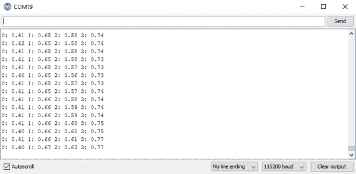](https://cdn.sparkfun.com/assets/learn_tutorials/7/8/5/EX4.PNG)*Calibrated Hand Output - click the image for a closer look*

## 资源和更进一步

既然您已经成功地启动并运行了 Qwiic Flex Glove 控制器，那么是时候将它整合到您自己的项目中了！

有关更多信息，请查看以下资源:

*   [示意图(PDF)](https://cdn.sparkfun.com/assets/c/b/9/4/7/SparkFun_Qwiic_Flex_Glove_Controller.pdf)
*   [老鹰文件(ZIP)](https://cdn.sparkfun.com/assets/7/e/8/d/c/SparkFun_Qwiic_Flex_Glove_Controller.zip)
*   [ADS1015 数据手册(PDF)](https://cdn.sparkfun.com/assets/1/8/1/0/d/ads1015.pdf)
*   [Qwiic 登陆页面](https://www.sparkfun.com/qwiic)
*   吉卜赛人休息
    *   [产品](https://github.com/sparkfun/Qwiic_Glove)
    *   [Arduino 库](https://github.com/sparkfun/SparkFun_ADS1015_Arduino_Library)
*   [SparkFun 产品展示:Qwiic Flex 手套控制器](https://youtu.be/8PYa828t3MQ)

你的下一个项目需要更多的灵感吗？查看一些相关教程:

[](https://learn.sparkfun.com/tutorials/samd51-thing-plus-hookup-guide) [### SAMD51 Thing Plus 连接指南](https://learn.sparkfun.com/tutorials/samd51-thing-plus-hookup-guide) This tutorial covers the basic functionality of the SAMD51 Thing Plus and highlights the features of the new ARM Cortex-M4F development board.[Favorited Favorite](# "Add to favorites") 2[](https://learn.sparkfun.com/tutorials/qwiic-digital-indoor-thermometer) [### Qwiic 数字室内温度计](https://learn.sparkfun.com/tutorials/qwiic-digital-indoor-thermometer) Qwiic-ly build a digital indoor thermometer to measure the ambient temperature of the room and display it using an OLED on an I2C bus 8[](https://learn.sparkfun.com/tutorials/micromod-rp2040-processor-board-hookup-guide) [### MicroMod RP2040 处理器板连接指南](https://learn.sparkfun.com/tutorials/micromod-rp2040-processor-board-hookup-guide) This tutorial covers the basic functionality of the MicroMod RP2040 Processor Board and highlights the features of the dual-core ARM Cortex-M0+ processors development board. Get started with the first microcontroller from the Raspberry Pi Foundation 0[](https://learn.sparkfun.com/tutorials/micromod-main-board-hookup-guide-v2)[New!

### MicroMod 主板连接指南 V2](https://learn.sparkfun.com/tutorials/micromod-main-board-hookup-guide-v2) The MicroMod Main Board - Single and Double are specialized carrier boards that allow you to interface a Processor Board with a Function Board(s). The modular system allows you to add an additional feature(s) to a Processor Board with the help of a Function Board(s). In this tutorial, we will focus on the basic functionality of the Main Board - Single V2.1 and Main Board - Double and V2.2\.[Favorited Favorite](# "Add to favorites") 0

或者看看这篇博客来寻找灵感。

[](https://www.sparkfun.com/news/2582 "January 18, 2018: As Andrew finishes up his fiber optic light suit, he's adding in gesture control. Let's see how it works.") [### Enginursday:手势反应可穿戴光纤

January 18, 2018](https://www.sparkfun.com/news/2582 "January 18, 2018: As Andrew finishes up his fiber optic light suit, he's adding in gesture control. Let's see how it works.")[Favorited Favorite](# "Add to favorites") 6[](https://www.sparkfun.com/news/3189 "January 30, 2020: I have finally gotten the hardware in (mostly) working order for my wacky fiber optic light suit. Let's check out what I've done!") [### Enginursday:轻套装更新

January 30, 2020](https://www.sparkfun.com/news/3189 "January 30, 2020: I have finally gotten the hardware in (mostly) working order for my wacky fiber optic light suit. Let's check out what I've done!")[Favorited Favorite](# "Add to favorites") 1**********************