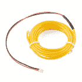
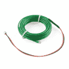
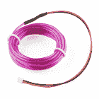
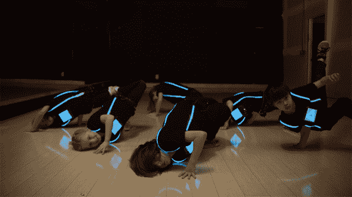
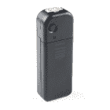
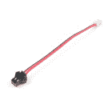
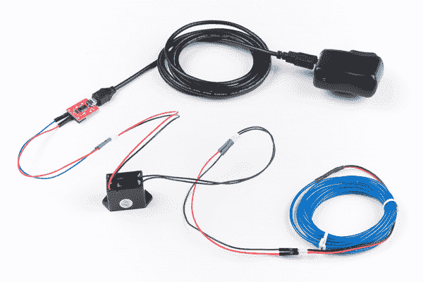
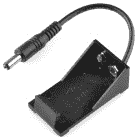

# 电致发光(EL)线入门

> 原文：<https://learn.sparkfun.com/tutorials/getting-started-with-electroluminescent-el-wire>

## 介绍

当谈到创造发光的项目时，没有什么能比得上[电致发光](http://en.wikipedia.org/wiki/Electroluminescence)线(简称 EL 线)。发光二极管很有趣，但所有时髦的孩子都在用 EL 线。无论你是想在晚上巡游时点亮你的自行车，还是想为《燃烧的人》制作一整套亮灯服装，EL wire 都是一个很好的解决方案。

在本教程中，我们将向您展示如何开始使用 EL wire。使用正确的零件，EL wire 可以非常容易地集成到任何项目中！

### 推荐阅读

如果您不熟悉以下概念，我们建议您在继续之前查看这些教程。[对电的一般理解](https://learn.sparkfun.com/tutorials/what-is-electricity)对于理解 EL 线操作背后的理论是必要的。EL 线由[交流电源](https://learn.sparkfun.com/tutorials/alternating-current-ac-vs-direct-current-dc)供电。它不像来自你家插座的电那样危险，但它确实值得同样的尊重。根据您的设置，您需要了解电路的工作原理。

 [### 什么是电路？](https://learn.sparkfun.com/tutorials/what-is-a-circuit) Every electrical project starts with a circuit. Don't know what a circuit is? We're here to help.[Favorited Favorite](# "Add to favorites") 82 [### 什么是电？](https://learn.sparkfun.com/tutorials/what-is-electricity) We can see electricity in action on our computers, lighting our houses, as lightning strikes in thunderstorms, but what is it? This is not an easy question, but this tutorial will shed some light on it 83 [### 串联和并联电路](https://learn.sparkfun.com/tutorials/series-and-parallel-circuits) An introduction into series and parallel circuits.[Favorited Favorite](# "Add to favorites") 58 [### 交流电与直流电(DC)](https://learn.sparkfun.com/tutorials/alternating-current-ac-vs-direct-current-dc) Learn the differences between AC and DC, the history, different ways to generate AC and DC, and examples of applications.[Favorited Favorite](# "Add to favorites") 53

### 建议的视频

[https://www.youtube.com/embed/J5M3suakZLA/?autohide=1&border=0&wmode=opaque&enablejsapi=1](https://www.youtube.com/embed/J5M3suakZLA/?autohide=1&border=0&wmode=opaque&enablejsapi=1)

[https://www.youtube.com/embed/z3TKUdfCTbY/?autohide=1&border=0&wmode=opaque&enablejsapi=1](https://www.youtube.com/embed/z3TKUdfCTbY/?autohide=1&border=0&wmode=opaque&enablejsapi=1)

*Having a hard time seeing the videos? Try viewing them in a full screen mode.*

## EL 如何工作

EL 线(电致发光线的缩写)由于许多原因特别有用。然而，有几个特征要记住。

**Note:** For the sake of this tutorial, we will refer to EL wire, tape, and panels simply as EL wire unless stated otherwise.

### EL 线、胶带、面板、跟踪线、可弯曲线模板

电致发光产品有许多不同的形状和尺寸。你可以得到金属丝(最典型的形状)，胶带，面板和可弯曲的形式。所有这些都可以切割成任何形状或大小，以达到预期的效果。只是一定要重新密封已被切断的两端。

 

### [EL Tape - Red (1m)](https://www.sparkfun.com/products/retired/10796)

[Retired](https://learn.sparkfun.com/static/bubbles/ "Retired") COM-10796

谁不爱电致发光的柔和光芒？这种 EL 带是一种柔性塑料带，其中含有荧光层

**Retired**[Favorited Favorite](# "Add to favorites") 2[Wish List](# "Add to wish list") 

将**添加到您的[购物车](https://www.sparkfun.com/cart)中！**

 **### [【EL 丝-红色 3m】](https://www.sparkfun.com/products/12931)

[Only 7 left!](https://learn.sparkfun.com/static/bubbles/ "only 7 left!") COM-12931

EL 线或电致发光线是一种涂有荧光粉的柔性线。施加适当的电压，它就亮了！电子邮件…

$9.95 $8.462[Favorited Favorite](# "Add to favorites") 6[Wish List](# "Add to wish list")**** 

### [EL 丝-红色 3m](https://www.sparkfun.com/products/retired/10191)

[Retired](https://learn.sparkfun.com/static/bubbles/ "Retired") COM-10191

EL 线或电致发光线是一种涂有荧光粉的柔性线。施加适当的电压，它就亮了！我…

1 **Retired**[Favorited Favorite](# "Add to favorites") 8[Wish List](# "Add to wish list") 

### [【嵌板-红色(10×10 厘米)](https://www.sparkfun.com/products/retired/10801)

[Retired](https://learn.sparkfun.com/static/bubbles/ "Retired") COM-10801

谁不爱电致发光的柔和光芒？这种 EL 板是一种柔性塑料片，其中含有荧光层

1 **Retired**[Favorited Favorite](# "Add to favorites") 8[Wish List](# "Add to wish list") 

### [可弯曲的 EL 线——红色 3m](https://www.sparkfun.com/products/retired/14703)

[Retired](https://learn.sparkfun.com/static/bubbles/ "Retired") COM-14703

这种红色的 EL 线包含一个特殊的可弯曲的线芯，允许你以任何方式连接和塑造你的 EL 线…

**Retired**[Favorited Favorite](# "Add to favorites") 2[Wish List](# "Add to wish list")******Heads up!** The benefit of bendable EL wire is that it allows you to articulate and mold your EL wire any way that you want! However, it is thicker than standard EL wire and chasing wire due to the additional bendable wire that runs alongside the phosphor wire. The extra bendable wire makes its ideal for art projects but it can be still used for e-textiles depending on the application.

### 颜色；色彩；色调

EL 也有许多不同的颜色。以下是标准 EL 线的几种选择。

 

### [EL 丝-红色 3m](https://www.sparkfun.com/products/retired/10191)

[Retired](https://learn.sparkfun.com/static/bubbles/ "Retired") COM-10191

EL 线或电致发光线是一种涂有荧光粉的柔性线。施加适当的电压，它就亮了！我…

1 **Retired**[Favorited Favorite](# "Add to favorites") 8[Wish List](# "Add to wish list") 

### [EL 丝-黄色 3m](https://www.sparkfun.com/products/retired/10192)

[Retired](https://learn.sparkfun.com/static/bubbles/ "Retired") COM-10192

EL 线或电致发光线是一种涂有荧光粉的柔性线。施加适当的电压，它就亮了！我…

2 **Retired**[Favorited Favorite](# "Add to favorites") 5[Wish List](# "Add to wish list") 

### [EL 丝-橙色 3m](https://www.sparkfun.com/products/retired/10193)

[Retired](https://learn.sparkfun.com/static/bubbles/ "Retired") COM-10193

EL 线或电致发光线是一种涂有荧光粉的柔性线。施加适当的电压，它就亮了！我…

1 **Retired**[Favorited Favorite](# "Add to favorites") 4[Wish List](# "Add to wish list") 

### [EL 丝-绿色 3m](https://www.sparkfun.com/products/retired/10194)

[Retired](https://learn.sparkfun.com/static/bubbles/ "Retired") COM-10194

EL 线或电致发光线是一种涂有荧光粉的柔性线。施加适当的电压，它就亮了！我…

2 **Retired**[Favorited Favorite](# "Add to favorites") 7[Wish List](# "Add to wish list") 

### [EL 钢丝蓝 3m](https://www.sparkfun.com/products/retired/10195)

[Retired](https://learn.sparkfun.com/static/bubbles/ "Retired") COM-10195

EL 线或电致发光线是一种涂有荧光粉的柔性线。施加适当的电压，它就亮了！我…

**Retired**[Favorited Favorite](# "Add to favorites") 16[Wish List](# "Add to wish list") 

### [EL 丝-紫色 3m](https://www.sparkfun.com/products/retired/10196)

[Retired](https://learn.sparkfun.com/static/bubbles/ "Retired") COM-10196

EL 线或电致发光线是一种涂有荧光粉的柔性线。施加适当的电压，它就亮了！我…

2 **Retired**[Favorited Favorite](# "Add to favorites") 8[Wish List](# "Add to wish list") 

### [EL 丝-白色 3m](https://www.sparkfun.com/products/retired/10197)

[Retired](https://learn.sparkfun.com/static/bubbles/ "Retired") COM-10197

EL 线或电致发光线是一种涂有荧光粉的柔性线。施加适当的电压，它就亮了！我…

**Retired**[Favorited Favorite](# "Add to favorites") 7[Wish List](# "Add to wish list") 

### [EL 线-蓝-绿 3m](https://www.sparkfun.com/products/retired/10199)

[Retired](https://learn.sparkfun.com/static/bubbles/ "Retired") COM-10199

EL 线或电致发光线是一种涂有荧光粉的柔性线。施加适当的电压，它就亮了！我…

1 **Retired**[Favorited Favorite](# "Add to favorites") 3[Wish List](# "Add to wish list") 

### [EL 线-荧光-绿色 3m](https://www.sparkfun.com/products/retired/10200)

[Retired](https://learn.sparkfun.com/static/bubbles/ "Retired") COM-10200

EL 线或电致发光线是一种涂有荧光粉的柔性线。施加适当的电压，它就亮了！我…

**Retired**[Favorited Favorite](# "Add to favorites") 4[Wish List](# "Add to wish list")

EL 胶带、面板、追踪线和可弯曲线还有其他选项。

[Click to Browse More Colors Options for Different EL Materials](https://www.sparkfun.com/categories/226)**Heads up!** Depending on the manufacturer, the color may vary between standard EL wire, tape, panel, chasing wire, and bendable wire.

### 灵活的

EL 线在一定程度上是柔性的。它可以让你把它缝进衣服里，附着在移动的部件上，还可以把它弯曲成你想要的任何形状。EL 电线比使用 LED 灯条更灵活，但您需要避免急转弯。

*EL Wire Bends on a [DIY Neon Sign](https://www.sparkfun.com/news/2358)*

EL 胶带和面板也可用于电子纺织项目。然而，它们不像 EL 线那样柔韧。当有加固织物支撑材料时，它们在项目中更好。

|  |  |
| *衬衫上的 EL 胶带和面板* | *EL 面板[帽子、包、夹克上的补丁](https://learn.sparkfun.com/tutorials/pokmon-go-patches-with-el-panels)* |

### 低功耗

与在一个项目中使用多个 led 相比，EL 需要更少的电力来运行。EL 也很棒，因为它摸起来很凉，即使开了几个小时。因此，它经常出现在服装应用中。EL 不会变热，因为 EL 中的发光不是通过加热元件来实现光学现象，而是通过向由半导体混合物组成的材料中发送电流来实现的。流经材料的电子流产生光子，从而产生我们所看到的辉光。

### 让它发光...在黑暗的房间里

虽然 EL 有很好的发光效果，但在白天或室内有光时很难看到。最好在弱光条件下使用 EL，以获得最佳效果。下面的图片展示了一件 [EL 连帽衫](https://learn.sparkfun.com/tutorials/el-wire-hoodie)在一个光线不同的房间里。

|  |  |
| *EL 在明亮的房间里* | *低照度下的 EL* |

### 交流功率

很多人会问，“*我就不能把 EL 线接到电池上*吗？”答案是，**没有**！为了正确操作 EL 线，您必须使用[交流电源](https://learn.sparkfun.com/tutorials/alternating-current-ac-vs-direct-current-dc)。这类似于你家里墙上的电源插座，尽管插座提供的电流比电线所需的电流大得多。这就是逆变器的用武之地！

 

### [EL 逆变器-电池组](https://www.sparkfun.com/products/retired/11222)

[Retired](https://learn.sparkfun.com/static/bubbles/ "Retired") COM-11222

即使 Tron 电影已经上映一段时间了，电致发光仍然是自切片面包以来最酷的东西。的…

5 **Retired**[Favorited Favorite](# "Add to favorites") 9[Wish List](# "Add to wish list") 

### [EL 逆变器- 3v](https://www.sparkfun.com/products/retired/10201)

[Retired](https://learn.sparkfun.com/static/bubbles/ "Retired") COM-10201

EL 逆变器允许您驱动 EL 线。这种特殊的 EL 逆变器接受 3V 输入，输出 110VAC 驱动 EL 线。T…

7 **Retired**[Favorited Favorite](# "Add to favorites") 17[Wish List](# "Add to wish list") 

### [EL 逆变器- 12v](https://www.sparkfun.com/products/retired/10469)

[Retired](https://learn.sparkfun.com/static/bubbles/ "Retired") COM-10469

EL 逆变器允许您驱动 EL(电致发光)线。这种特殊的 EL 逆变器接受 12 伏直流电墙上适配器。的…

4 **Retired**[Favorited Favorite](# "Add to favorites") 13[Wish List](# "Add to wish list") 

### [【EL 逆变器-3v】](https://www.sparkfun.com/products/retired/12933)

[Retired](https://learn.sparkfun.com/static/bubbles/ "Retired") COM-12933

EL 逆变器，如果你想用 EL 照明做任何事情，你需要一个。这 3V EL 逆变器是一种特殊的类型…

6 **Retired**[Favorited Favorite](# "Add to favorites") 8[Wish List](# "Add to wish list")

EL starter kit 和 chasing 逆变器中包含的电池组不仅仅是一个电池盒。它还装有一个逆变器。该逆变器将电池产生的 DC(直流电)转化为交流电。如果您在逆变器电池组打开时仔细聆听，您会听到轻微的嗡嗡声，类似于您站在电线下或靠近变压器箱时听到的声音。然而，与电池组相比，3V 和 12V 逆变器没有内置电池座。

**Note:** SparkFun does not condone hanging out around high voltage areas.

有鉴于此，重要的是要提到，来自逆变器的交流电源不足以伤害或杀死你。但是，足以给你一个很好的震撼。处理 EL 产品和任何交流侧供电的外露电路时要小心。您可以将 EL 切割成任何长度或形状，但必须重新密封切割的两端。如果您没有 EL 线的端盖，您仍然可以用热胶或环氧树脂密封末端，以密封切割的电线。如果你不重新密封，你可能会得到一个很好的颠簸。

### EL 的剖析

EL 由几层组成。让我们来看看标准 EL 线的解剖。

*   **彩色透明 PVC 套管** -外面是彩色 PVC 套管。根据制造商和颜色，这可能是透明或半透明的。
*   **透明 PVC 套管** -第二层是另一个 PVC 套管。这个袖子没有外层厚，也是清透的。
*   **电晕线** -有两根细线缠绕并延伸到 EL 线的末端。这些线非常细，有时被称为角线。线对与中心芯线隔离。
*   **荧光粉涂层** -在涂层周围施加交流电，激发荧光粉，产生漂亮的发光效果。它还将电晕线和芯线分开。
*   **芯线**-EL 线的中心是另一根线。

左边是 EL 线的物理图。右边是打开的白色 EL 线的特写。不管图像中的标签如何，每个组件的功能都是相同的。

|  |  |
| *图片来自[维基百科:电致发光电线](https://en.wikipedia.org/wiki/Electroluminescent_wire)* | *标准 EL 线特写* |

#### 极化连接器

EL 线的末端通常端接一个极化 2 针 JST-PH 连接器(极化 4 针追逐 EL 线除外)。配套连接器安装在 SparkFun 目录中销售的 EL 逆变器和电路板上。

如果您从不同的供应商处订购了 EL 电线，它们可以用极化 2 针 JST-SM 连接器端接。您可以使用以下适配器连接到 EL 逆变器和 EL 板。 [PRT-14998](https://www.sparkfun.com/products/14998) 用于将不同供应商的 EL 线连接到 SparkFun 逆变器和电路板。 [PRT-14999](https://www.sparkfun.com/products/14999) 用于将 SparkFun EL 电线连接到逆变器和其他供应商出售的电路板。

 

将**添加到您的[购物车](https://www.sparkfun.com/cart)中！**

 **### [LED 条形尾纤连接器(2 针)](https://www.sparkfun.com/products/14574)

[In stock](https://learn.sparkfun.com/static/bubbles/ "in stock") CAB-14574

这些 2 针 JST-SM 尾纤连接器与 LED 灯条和其他只需要两条线路和一根引线的应用完美匹配

$1.05[Favorited Favorite](# "Add to favorites") 8[Wish List](# "Add to wish list")**** 

### [JST-PH 公转 JST-SM 公转接头- 100mm](https://www.sparkfun.com/products/retired/14998)

[Retired](https://learn.sparkfun.com/static/bubbles/ "Retired") PRT-14998

这种简单的适配器线在一端终止于 JST-PH 公接头，在另一端终止于 JST-SM 公接头。

**Retired**[Favorited Favorite](# "Add to favorites") 1[Wish List](# "Add to wish list") 

### [JST-PH 母转 JST-SM 母转接头- 100mm](https://www.sparkfun.com/products/retired/14999)

[Retired](https://learn.sparkfun.com/static/bubbles/ "Retired") PRT-14999

这种简单的适配器线的一端是 JST-PH 母接头，另一端是 JST-SM 母接头。

**Retired**[Favorited Favorite](# "Add to favorites") 1[Wish List](# "Add to wish list")** **## 硬件连接- EL

### 推荐材料

至少，您需要以下内容来驱动 EL。我们将使用以下组件开始。你可能不需要所有的东西，这取决于你拥有什么。将它添加到您的购物车，通读指南，并根据需要调整购物车。

*   **EL 元件** - 1x-2x 股任意颜色的 [EL 线](https://www.sparkfun.com/search/results?term=el+wire)
*   **逆变器** - 1x [EL 逆变器电池组](https://www.sparkfun.com/products/11222)。
*   **电源** -需要 2 节 [AA 电池](https://www.sparkfun.com/products/9100)为逆变器供电。

**Note:** You may have opted for Chasing EL Wire instead of the standard solid colors. That's fine. This tutorial will focus on both kinds of EL Wire and how to use each. We'll discuss this in detail a little later.

根据您的逆变器，您可能还需要以下设备:

*   **电线** *(可选)* -根据您的设置和使用的变频器，您可能需要电线。
*   **绝缘** *(可选)* -绝缘胶带、热收缩、热胶或环氧树脂，用于密封连接到交流侧的裸露引脚和电线。

**Note:** SparkFun sells a kit with the parts available in the [EL Wire Starter Kit](https://www.sparkfun.com/products/11421) with one strand of blue EL wire (3m).

 

### [EL 丝启动套件](https://www.sparkfun.com/products/retired/11421)

[Retired](https://learn.sparkfun.com/static/bubbles/ "Retired") RTL-11421

想玩电线，但不知道从哪里开始？这个初学者工具包有你需要添加一些电致发光的一切…

5 **Retired**[Favorited Favorite](# "Add to favorites") 4[Wish List](# "Add to wish list")

### EL 逆变器-电池组

使用 EL 就像使用 EL 逆变器电池组一样简单。

 

### [EL 逆变器-电池组](https://www.sparkfun.com/products/retired/11222)

[Retired](https://learn.sparkfun.com/static/bubbles/ "Retired") COM-11222

即使 Tron 电影已经上映一段时间了，电致发光仍然是自切片面包以来最酷的东西。的…

5 **Retired**[Favorited Favorite](# "Add to favorites") 9[Wish List](# "Add to wish list")

沿着包装上指示的方向滑动，取下电池盖。将两节 AA 电池放入电池组逆变器中，然后盖上盖子。将 EL 线上的 JST 公接头插入逆变器电池组上的两个 JST 母接头中的一个。确保两者之间有牢固的联系。

按下箱子上的按钮，你的 EL 线就会亮起。再次按下可获得慢速闪烁效果，再次按下可快速闪烁。该逆变器组件允许您一次连接两个您选择的 EL 产品。你可以混合搭配颜色和形状。你可以有一个带有蓝色电线的红色面板，一条带有粉色电线的绿色胶带，或者两条黄色和紫色电线。可能性是无限的！

**Note:** The following current readings were taken while the pack was connected to one or more of our 3m of EL wire:

*   单股**一直在**上:*190 毫安到 260 毫安*
*   单股**闪烁** : *90mA 到 120mA*
*   两股**一直在**上:*~ 300 毫安*
*   两股**闪烁**:*~ 150 毫安*

Different color strands were used but the lengths were identical. Your mileage may vary.**Modifying the EL Inverter Battery Pack:** We got a chance to play with these inverters and you can easily hack these to work with our Li-Po batteries (yep, fully charged at 4.2V). To get inside, you’ll need to remove a pair of screws (one is hiding under the CE sticker) and afterwards you’ll want to wrap things up with electrical tape to avoid getting shocked (it just tingles a little).

### EL 逆变器- 3V

我们还有一个 3V 逆变器。电线在末端与 JST PH 连接器端接。这些需要更多一点的工作才能开始，因为它们被设计成直接插入我们的 EL Escudo Dos 或 EL Sequencer。它们是小型 EL 显示器的理想选择。

 

### [EL 逆变器- 3v](https://www.sparkfun.com/products/retired/10201)

[Retired](https://learn.sparkfun.com/static/bubbles/ "Retired") COM-10201

EL 逆变器允许您驱动 EL 线。这种特殊的 EL 逆变器接受 3V 输入，输出 110VAC 驱动 EL 线。T…

7 **Retired**[Favorited Favorite](# "Add to favorites") 17[Wish List](# "Add to wish list")

这种特殊的 EL 逆变器接受来自 **2.5V-4.2V** 的任何输入(分别在用于+Vcc 和 GND 的**红/黑**线对上)，所以你可以使用电池。一旦通电，它可以输出高达 110VAC(在**黑/黑**线对上)来驱动 EL 线。

⚡ **Note:** While that datasheet states that the input is between *2.5V-3.5V*, we have tested the inverter with LiPo batteries. The 3V inverter can take up to 4.2V, so it's safe to run on a LiPo battery.

使用 3V 逆变器，您可以直接驱动 EL 电线，而无需使用 EL Escudo Dos 或 EL 序列器。但是，您可能需要重新端接它们，制作一个适配器，或者可能降低电源的电压。下面是一个简单的连接，如果你只是使用一个 [5V USB 电源](https://www.sparkfun.com/products/12890)、 [3.3V FTDI](https://www.sparkfun.com/products/13746) 调节电压、 [M/M 跳线](https://www.sparkfun.com/products/8431)和一根 EL 线为一个装置供电。跳线的引脚足够小，可以插入 JST 连接器。

*Having a hard time seeing the circuit? Click on the image for a closer look.*

你甚至可以通过平行连接将两条链连接在一起。出于测试目的，电路被放置在试验板上。因为是交流电，所以连接在逆变器输出端的电线的颜色无关紧要。为了保持一致，电线颜色连接在一起。

*Having a hard time seeing the circuit? Click on the image for a closer look.***Tests with Different Lengths of EL Wire:** Some real world testing revealed that this inverter can easily drive a 3m length of EL wire. When adding a second 3m length, the two get a bit dimmer, but still close to full brightness. At three 3m lengths, you can only tell all three wires are on if the room is dark. While the inverter can light up 4 strands, they are barely visible in normal light and very dim in the dark as well.

As you can see from the images below, connecting more EL wire in parallel with the 3V inverter will cause both EL wires to dim. The brightness can depend on the length of EL you are using, how you are wiring the EL, and the type of inverter.

|  |  |
| *一根 3m EL 线亮起* | *两根 3m EL 线亮起但变暗* |

当您在项目中完成测试和集成 EL 线时，请确保密封任何暴露的 EL 线或交流侧的连接。如果您决定继续在逆变器和 EL 线之间使用 M/M 跳线，绝缘胶带是保护连接和绝缘任何裸露引脚的好选择。

### EL 逆变器- 12V

当使用几股 EL 时，您可能要考虑使用 [12V 逆变器](https://www.sparkfun.com/products/10469)。逆变器由一个筒式插孔连接器和一对以 JST PH 连接器端接的导线组成。这是最大、最亮显示器的理想选择！

 

### [EL 逆变器- 12v](https://www.sparkfun.com/products/retired/10469)

[Retired](https://learn.sparkfun.com/static/bubbles/ "Retired") COM-10469

EL 逆变器允许您驱动 EL(电致发光)线。这种特殊的 EL 逆变器接受 12 伏直流电墙上适配器。的…

4 **Retired**[Favorited Favorite](# "Add to favorites") 13[Wish List](# "Add to wish list")

这种特殊的 EL 逆变器通过 5.5 毫米 x 2.1mm 毫米筒式插孔连接器接受输入。只需将电源与中心正极筒式插孔连接器连接。输出(**红色/黑色**线对)设计用于连接 EL Escudo Dos 或 EL Sequencer 板上的配套 JST 连接器。侧面还有一个小开关，可以让你在“开”、“闪烁”和“关”之间切换。

与 3V 逆变器一样，您可以使用 12V 逆变器直接驱动 EL 线。但是，您可能需要重新终止它们或制作一个适配器。如果您只是使用 12V 电源、M/M 跳线和一股 EL 线为一个装置的一股供电，下面是一个简单的连接。

*Having a hard time seeing the circuit? Click on the image for a closer look.*

同样，你可以通过平行连接将两条链连接在一起。出于测试目的，电路被放置在试验板上。因为是交流电，所以连接在逆变器输出端的电线的颜色无关紧要。为了保持一致，电线颜色连接在一起。

*Having a hard time seeing the circuit? Click on the image for a closer look.*

完成后，记得密封任何外露的 EL 线或交流侧的连接。

⚡ **Remote/Mobile Applications:** While that datasheet states that the input is between **11V-13V**, you can power the 12V EL Inverter with **9V** alkaline battery and adapter for remote applications. The EL might not be as bright as using a 12V power supply but you will not notice a significant difference in the dark with a few meters of EL.

 

将**添加到您的[购物车](https://www.sparkfun.com/cart)中！**

 **### [9V 转筒式插孔适配器](https://www.sparkfun.com/products/9518)

[Only 11 left!](https://learn.sparkfun.com/static/bubbles/ "only 11 left!") PRT-09518

这根简单的电缆有如此多的用途！将 9 伏电池夹插在标准 9 伏电池上，将另一端连接到任何…

$3.502[Favorited Favorite](# "Add to favorites") 35[Wish List](# "Add to wish list")**** 

将**添加到您的[购物车](https://www.sparkfun.com/cart)中！**

 **### [9V 电池座](https://www.sparkfun.com/products/10512)

[In stock](https://learn.sparkfun.com/static/bubbles/ "in stock") PRT-10512

这款 9V 电池盒可让您的电池卡紧并固定到位，这在您没有…

$3.503[Favorited Favorite](# "Add to favorites") 20[Wish List](# "Add to wish list")**** 

将**添加到您的[购物车](https://www.sparkfun.com/cart)中！**

 **### [9V 碱性电池](https://www.sparkfun.com/products/10218)

[In stock](https://learn.sparkfun.com/static/bubbles/ "in stock") PRT-10218

这些是 Rayovac 的标准 9 伏碱性电池。想都别想给这些充电。使用它们与…

$2.251[Favorited Favorite](# "Add to favorites") 6[Wish List](# "Add to wish list")**************Stress Tests with the 12V Inverter:** The 12V inverter has been tested to run 8x strands of 3m EL wire using an EL Sequencer and a 12V power supply. Remember, as you increase the length or wire more in parallel, this will increase the load on the inverter causing the EL to dim.

## EL 追踪线是如何工作的

EL 追踪线的工作方式与标准 EL 线相似。不是一根芯线，而是三根涂有荧光粉的细线。基本上，你可以把三股标准 EL 线想象成一股 EL 追逐线。因此，EL 追逐线需要 4x 连接:每股三个，公共接地一个。通过打开和关闭内部的每一条链，我们就有了级联或“追逐”效应。

让我们来看看 EL 追线的解剖。

*   **彩色透明 PVC 套管** -外面是彩色 PVC 套管。根据制造商和颜色，这可能是透明或半透明的。
*   **透明 PVC 套管** -第二层是另一个 PVC 套管。这个袖子没有外层厚，也是清透的。
*   **电晕线** -有两根细线缠绕并延伸到 EL 线的末端。这些线非常细，有时被称为角线。线对与中心芯线隔离。
*   **荧光粉涂层** -在涂层周围施加交流电，激发荧光粉，产生漂亮的发光效果。它还分离电晕线和芯线。
*   **芯线**-EL 追逐线的中心是三根被包覆并在中心绞合的细线。

如果您比较 EL 标准线和追逐线的尺寸，您将不会注意到差异，直到您修改和修复芯线。正如你所看到的，EL 追线在核心处使用了三根细线。

## 硬件连接- EL 追踪

### EL 逆变器- 3v(追踪)

[EL 追逐逆变器](https://www.sparkfun.com/products/12933)的工作原理类似于 3V EL 逆变器电池组。

 

### [【EL 逆变器-3v】](https://www.sparkfun.com/products/retired/12933)

[Retired](https://learn.sparkfun.com/static/bubbles/ "Retired") COM-12933

EL 逆变器，如果你想用 EL 照明做任何事情，你需要一个。这 3V EL 逆变器是一种特殊的类型…

6 **Retired**[Favorited Favorite](# "Add to favorites") 8[Wish List](# "Add to wish list")

只需将电池盖滑下，插入两节 AA 电池供电，将电池盖滑回，并将一根 EL 追踪器线连接到 4 针配套连接器。按下按钮，打开并开始将三股 EL 电线编为一股。继续按下按钮，通过三种模式循环:慢，快，超级快速追逐！

**Stress Tests with the EL Chasing Inverter:** It is recommended that these inverters only run up to 5m of EL wire, you may not have enough power to support longer lengths.

## EL 电线延长电缆

### 拼接电线

需要在 JST 连接器和 EL 之间增加一点长度吗？有几种方法可以将电线延伸到您的 EL。一种方法是拼接通向 EL 材料的导线。下面是一个将电线延伸到 el 面板的示例，但它也可用于连接到任何 EL 的电线。有关如何延长电线的更多信息，请前往[带 EL 面板的 Pokémon Go 补丁:添加 EL 延长线](https://learn.sparkfun.com/tutorials/pokmon-go-patches-with-el-panels#adding-extension-cables)教程。

*Spliced Wires to Extend Wires to EL*

### 定制延长线

寻找拼接电线的替代方案？您还可以制作一根带有 PCB 和 JST 连接器的[定制 EL 线延长线](https://learn.sparkfun.com/tutorials/how-to-make-a-custom-el-wire-extension-cable)，以便在逆变器位于外壳中或连接到单独的衣服上时，轻松断开 EL 线与逆变器的连接。

 [### 如何制作定制的 EL 电线延长线

#### 2018 年 10 月 24 日](https://learn.sparkfun.com/tutorials/how-to-make-a-custom-el-wire-extension-cable) In this tutorial, we will make a custom EL Wire extension cable as an alternative to splicing wire.[Favorited Favorite](# "Add to favorites") 4

## EL 的控制和排序

使用几个 EL 产品是相当简单的。然而，如果你正在寻找更多的挑战，不要害怕。EL 项目可能会变得非常复杂，非常迅速。您可能已经注意到，这种影响在某种程度上对逆变器是有限的，并且两种产品在插入时表现相同。

假设您希望一种颜色闪烁，而另一种颜色保持稳定。你可以购买另一个逆变器电池组，或者你可以得到一个专门为 EL 产品设计的电路板。SparkFun 有两块这样的板，分别是 [EL Sequencer](https://www.sparkfun.com/products/12781) 和 [EL Escudo Dos](https://www.sparkfun.com/products/10878) 。这两种板都是为同时处理许多 EL 产品而设计的，你可以用这两种板创造许多不同的效果。

*SparkFun Animated Flame from [Setting Up an EL Display with the EL Escudo Dos](https://www.sparkfun.com/tutorials/353) Tutorial*

如需了解更多信息，请查看这些产品的连接指南。

 [### EL 序列器/Escudo Dos 连接指南

#### 2015 年 12 月 3 日](https://learn.sparkfun.com/tutorials/el-sequencerescudo-dos-hookup-guide) A basic guide to getting started with the SparkFun EL Sequencer and Escudo Dos to control electroluminescence (EL) wire, panels, and strips.[Favorited Favorite](# "Add to favorites") 5

## 资源和更进一步

感谢查看我们的教程！现在你已经成功地建立并运行了你的 EL 线/面板/条，是时候把它整合到你自己的项目中了！有关更多信息，请查看以下资源:

*   技术信息和规格
    *   [EL Wire (PDF)](https://www.sparkfun.com/datasheets/Components/LED/Technical%20Information%20of%20Flexible%20Neon%20wire.pdf)
    *   [面板(PDF)](https://cdn.sparkfun.com/datasheets/Components/General/ELPanelSpecification.pdf)
    *   [EL 磁带(PDF)](https://cdn.sparkfun.com/datasheets/Components/General/ELTapeSpecification.pdf)
    *   [EL 追线(PDF)](https://cdn.sparkfun.com/datasheets/Components/EL/ELWire-Chasing-TechnicalData.pdf)
    *   [3V 逆变器(PDF)](https://www.sparkfun.com/datasheets/Components/LED/SPECIFICATION%20of%203V3M%20-%20%E5%89%AF%E6%9C%AC.pdf)
    *   [12V 逆变器(PDF)](https://www.sparkfun.com/datasheets/Components/LED/SPECIFICATION%20of%2012V12M-1.pdf)
*   维基百科(一个基于 wiki 技术的多语言的百科全书协作计划ˌ也是一部用不同语言写成的网络百科全书ˌ 其目标及宗旨是为全人类提供自由的百科全书)ˌ开放性的百科全书
    *   [电致发光](https://en.wikipedia.org/wiki/Electroluminescence)
    *   [电致发光线](https://en.wikipedia.org/wiki/Electroluminescent_wire)
*   SFE 产品展示
    *   [EL 线演示](https://www.youtube.com/watch?v=D4ZcCuBsfuM)
    *   [铁环梦](https://youtu.be/YfPsow7_Mg0?t=46s)
    *   [电致发光产品](https://www.youtube.com/watch?v=J5M3suakZLA)
    *   [可弯曲的 EL 线](https://youtu.be/z3TKUdfCTbY)
    *   [SparkFun 拆箱](https://youtu.be/MtU0umhjQpA)

你的下一个项目需要一些灵感吗？查看一些相关教程:

 [### ELastoLite 连接导轨](https://learn.sparkfun.com/tutorials/elastolite-hookup-guide) Everything you need to setup a circuit using ELastoLite super flexible EL Panels from Oryon Technologies.[Favorited Favorite](# "Add to favorites") 11 [### EL 序列器/Escudo Dos 连接指南](https://learn.sparkfun.com/tutorials/el-sequencerescudo-dos-hookup-guide) A basic guide to getting started with the SparkFun EL Sequencer and Escudo Dos to control electroluminescence (EL) wire, panels, and strips.[Favorited Favorite](# "Add to favorites") 5 [### 带 EL 面板的神奇宝贝 Go 补丁](https://learn.sparkfun.com/tutorials/pokmon-go-patches-with-el-panels) Add a cloth stencil over EL panels to create glowing logos and designs.[Favorited Favorite](# "Add to favorites") 6 [### EL 钢丝裤](https://learn.sparkfun.com/tutorials/el-wire-pants) In this tutorial, we will sew standard electroluminescent (EL) wire to a pair of pants.[Favorited Favorite](# "Add to favorites") 1

想了解更多想法，请查看以下相关博文:

 [### 安全的雅各布之梯？

November 4, 2010](https://www.sparkfun.com/news/477 "November 4, 2010: We're still exploring some Halloween projects - this time, a Jacob's Ladder!")[Favorited Favorite](# "Add to favorites") 0 [### 工程圆桌会议- EL 电线燃烧人标志

August 13, 2012](https://www.sparkfun.com/news/932 "August 13, 2012: Check out Chris Taylor's project for his Burning Man camp.")[Favorited Favorite](# "Add to favorites") 0 [### 电子弹力纹身

February 10, 2014](https://www.sparkfun.com/news/1394 "February 10, 2014: Check out today's edition of ElectriCute to build a light-up tattoo made with Elastolite.")[Favorited Favorite](# "Add to favorites") 1 [### 工程圆桌会议- ELastoLite 美国队长盾

April 2, 2014](https://www.sparkfun.com/news/1444 "April 2, 2014: Nick Poole shows us how to make a Captain America shield with ELastoLite!")[Favorited Favorite](# "Add to favorites") 0 [### 新产品星期五:铁环梦

June 20, 2014](https://www.sparkfun.com/news/1516 "June 20, 2014: EL wire, power supplies, and some beginner electronics kits. Check out the goodies for this week.")[Favorited Favorite](# "Add to favorites") 0 [### 英语日:启蒙

August 7, 2014](https://www.sparkfun.com/news/1561 "August 7, 2014: In this week's Enginursday post, Joel discusses how he went about making a control box for a large scale interactive EL wire art installation. ")[Favorited Favorite](# "Add to favorites") 0 [### SparkFun 现场预览- EL 运动衫

September 24, 2014](https://www.sparkfun.com/news/1607 "September 24, 2014: Get ready for the next episode of "SparkFun Live!"  ")[Favorited Favorite](# "Add to favorites") 0 [### SparkFun 直播-万圣节黑客

October 14, 2014](https://www.sparkfun.com/news/1623 "October 14, 2014: Join us this afternoon for some Halloween-themed projects! ")[Favorited Favorite](# "Add to favorites") 0 [### 电气产品

December 29, 2014](https://www.sparkfun.com/news/1701 "December 29, 2014: Have you always wanted to experiment with electroluminescence? ")[Favorited Favorite](# "Add to favorites") 0 [### 口袋妖怪 go el 项目

August 10, 2016](https://www.sparkfun.com/news/2160 "August 10, 2016: Making illuminated costume items for late-night Pokémon hunting")[Favorited Favorite](# "Add to favorites") 0 [### t:宠物店霓虹灯

September 13, 2016](https://www.sparkfun.com/news/2184 "September 13, 2016: How to make faux neon signs with EL wire and rigid aquarium tubing")[Favorited Favorite](# "Add to favorites") 6 [### 硬件驼峰日:3 个简易 EL 线项目

April 12, 2017](https://www.sparkfun.com/news/2358 "April 12, 2017: Add light elements to your projects quickly and easily! ")[Favorited Favorite](# "Add to favorites") 3 [### EL Wire 实验室外套

December 18, 2017](https://www.sparkfun.com/news/2562 "December 18, 2017: I am no expert at soldering, coding or developing, but I know how to plug something in and press a power button.")[Favorited Favorite](# "Add to favorites") 1

或者查看此附加项目教程以了解更多信息。

*   [用 EL Escudo Dos 设置 EL 显示器](https://www.sparkfun.com/tutorials/353)
*   [仪表上的 EL 项目](http://www.instructables.com/tag/type-id/category-technology/channel-el-wire/)**********