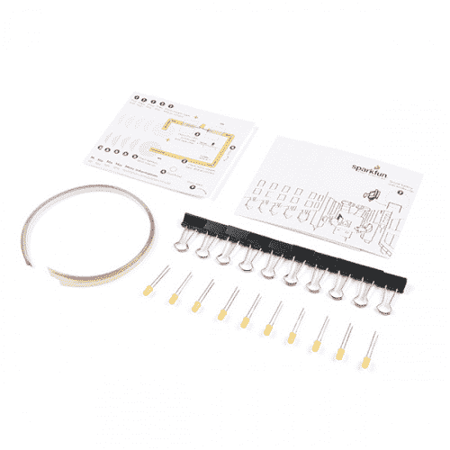
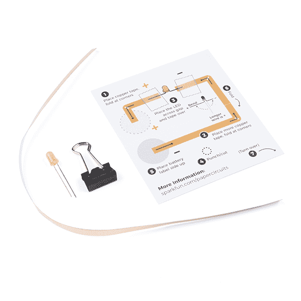

# SparkFun 纸质电路套件

> 原文：<https://learn.sparkfun.com/tutorials/sparkfun-paper-circuit-kits>

## 介绍

设计和建造时间:5-10 分钟

* * *

欢迎来到[纸电路](https://www.sparkfun.com/products/15817)的世界——使用简单的组件直接在纸上创建电子项目。本指南将指导您使用铜带、5 毫米 LED 和 3V 纽扣电池构建一个简单的电路。

SparkFun 提供了两个专门为这个纸电路项目设计的套件。这两个套件的主要区别在于[教室包](https://www.sparkfun.com/products/15818)包括电池、四种 LED 颜色选项和一些备件。如果使用 SparkFun Paper Circuits 套件，您需要提供或购买自己的[3V Cr 2032 20 毫米硬币电池](https://www.sparkfun.com/products/338)来跟进并完成该项目。

 

将**添加到您的[购物车](https://www.sparkfun.com/cart)中！**

### [SparkFun 纸质电路套件](https://www.sparkfun.com/products/15817)

[34 available](https://learn.sparkfun.com/static/bubbles/ "34 available") KIT-15817

SparkFun 纸电路包教的基础和基本原理，创造一个电路，而不需要出售…

$17.501[Favorited Favorite](# "Add to favorites") 4[Wish List](# "Add to wish list")**** 

将**添加到您的[购物车](https://www.sparkfun.com/cart)中！**

### [SparkFun 纸电路教室包](https://www.sparkfun.com/products/15818)

[25 available](https://learn.sparkfun.com/static/bubbles/ "25 available") KIT-15818

SparkFun 纸质电路课堂包向学生教授创建电路的基础知识，而无需…

$58.951[Favorited Favorite](# "Add to favorites") 4[Wish List](# "Add to wish list")**** ****[https://www.youtube.com/embed/fsg1v8jN6-M/?autohide=1&border=0&wmode=opaque&enablejsapi=1](https://www.youtube.com/embed/fsg1v8jN6-M/?autohide=1&border=0&wmode=opaque&enablejsapi=1)

### 所需材料和工具

在您的纸质电路套件中，您会发现一个塑料袋，其中包括:

*   印刷纸质电路模板
*   12 英寸厚的 5 毫米铜带
*   黄色 5 毫米 LED
*   长尾夹

### 您还需要:

*   3V CR2032 纽扣电池(*包含在教室包*中)
*   剪刀
*   打孔
*   透明带
*   装饰用品(马克笔、钢笔、蜡笔),如果你想在完成的项目中上色

Don't have a SparkFun Paper Circuits Kit? You can follow along with this project using this [wish list](https://www.sparkfun.com/wish_lists/146672) of individual pieces. You will need to print the template on cardstock and supply your own binder clip (available at local craft stores) to complete the project.****