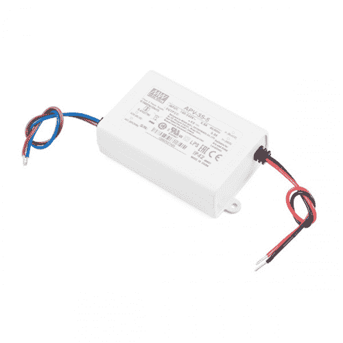
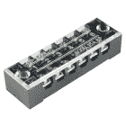
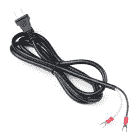
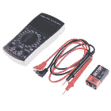
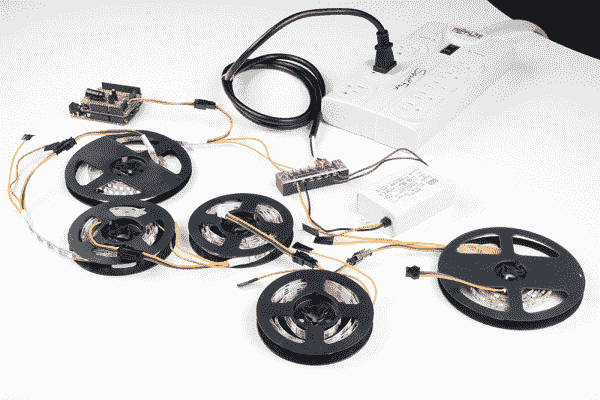
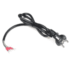
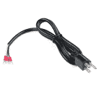

# 平均良好的 LED 开关电源连接指南

> 原文：<https://learn.sparkfun.com/tutorials/mean-well-led-switching-power-supply-hookup-guide>

## 介绍

在本教程中，我们将把一个普通的 LED 开关电源( [5V/25W](https://www.sparkfun.com/products/14601) 或 [5V/40W](https://www.sparkfun.com/products/14602) )连接到一个由 Arduino 控制的可寻址 LED 灯条。

 

### [指 LED 开关电源-5v 直流，5A](https://www.sparkfun.com/products/retired/14601)

[Retired](https://learn.sparkfun.com/static/bubbles/ "Retired") TOL-14601

这是一款 40W 单输出开关电源，来自 Mean Well，专为 LED 应用而设计

**Retired**[Favorited Favorite](# "Add to favorites") 8[Wish List](# "Add to wish list") 

### [表示 LED 开关电源-5v 直流，8A 表示 ](https://www.sparkfun.com/products/retired/14602)

[Retired](https://learn.sparkfun.com/static/bubbles/ "Retired") TOL-14602

这是一款 40W 单输出开关电源，来自 Mean Well，专为 LED 应用而设计

1 **Retired**[Favorited Favorite](# "Add to favorites") 7[Wish List](# "Add to wish list")

### 所需材料

按照本教程，你将需要以下材料与平均井 5V 电源。这是假设您使用 120VAC 的墙壁适配器电缆。对于负载，我们将使用可寻址的 LED 灯条。你可能不需要所有的东西，这取决于你拥有什么。将它添加到您的购物车，通读指南，并根据需要调整购物车。

 

### [【端子排- 6 位(15A，600V)](https://www.sparkfun.com/products/retired/13061)

[Retired](https://learn.sparkfun.com/static/bubbles/ "Retired") PRT-13061

这种 6 位螺丝端子板提供了一种将电线连接到单一连接点的简单方法。这些块允许…

2 **Retired**[Favorited Favorite](# "Add to favorites") 10[Wish List](# "Add to wish list") 

将**添加到您的[购物车](https://www.sparkfun.com/cart)中！**

### [iPixel 墙壁适配电缆-双端子【NA】](https://www.sparkfun.com/products/14603)

[In stock](https://learn.sparkfun.com/static/bubbles/ "in stock") CAB-14603

iPixel 的这些墙壁适配器电缆在一端与一个标准 NA 插头和两个绝缘扁平端子连接器端接

$3.95 $2.96[Favorited Favorite](# "Add to favorites") 1[Wish List](# "Add to wish list")**** 

### [端子台- 3 位(15A，600V)](https://www.sparkfun.com/products/retired/13060)

[Retired](https://learn.sparkfun.com/static/bubbles/ "Retired") PRT-13060

这种 3 位螺丝端子板提供了一种将电线连接到单一连接点的简单方法。这些块允许…

1 **Retired**[Favorited Favorite](# "Add to favorites") 10[Wish List](# "Add to wish list") 

### 

[Retired](https://learn.sparkfun.com/static/bubbles/ "Retired") COM-14730

这些是 1 米长的超薄可寻址 5V RGB LED 灯条，装有 60 个 SK6812s。SK6812 LEDs 非常类似于…

**Retired**[Favorited Favorite](# "Add to favorites") 6[Wish List](# "Add to wish list")** **### 建议的工具

根据您的设置，您可能需要烙铁、焊料和[通用焊接附件](https://www.sparkfun.com/categories/49)。否则，一个螺丝端子板和一个螺丝刀就足够了。

 

将**添加到您的[购物车](https://www.sparkfun.com/cart)中！**

### [-数字万用表基础](https://www.sparkfun.com/products/12966)

[In stock](https://learn.sparkfun.com/static/bubbles/ "in stock") TOL-12966

数字万用表(DMM)是每个电子爱好者的必备工具。斯帕克芬数字万用表，高…

$16.50 $9.9023[Favorited Favorite](# "Add to favorites") 57[Wish List](# "Add to wish list")**** 

### [威勒 WLC100 焊台](https://www.sparkfun.com/products/14228)

[Out of stock](https://learn.sparkfun.com/static/bubbles/ "out of stock") TOL-14228

Weller 的 WLC100 是一款多功能的 5 瓦至 40 瓦焊台，非常适合业余爱好者、DIY 爱好者和学生。…

2[Favorited Favorite](# "Add to favorites") 17[Wish List](# "Add to wish list") 

将**添加到您的[购物车](https://www.sparkfun.com/cart)中！**

### [无铅焊料- 100 克线轴](https://www.sparkfun.com/products/9325)

[In stock](https://learn.sparkfun.com/static/bubbles/ "in stock") TOL-09325

这是带有水溶性树脂芯的无铅焊料的基本线轴。0.031 英寸规格，100 克。这是一个好主意…

$9.957[Favorited Favorite](# "Add to favorites") 33[Wish List](# "Add to wish list")**** 

将**添加到您的[购物车](https://www.sparkfun.com/cart)中！**

### [SparkFun 迷你螺丝刀](https://www.sparkfun.com/products/9146)

[In stock](https://learn.sparkfun.com/static/bubbles/ "in stock") TOL-09146

这只是你的基本可逆螺丝刀口袋大小！有平头和十字头可供选择。配有别针和…

$1.053[Favorited Favorite](# "Add to favorites") 11[Wish List](# "Add to wish list")****** ******您还需要:

*   电工胶带
*   电涌保护器

### 推荐阅读

如果您不熟悉以下概念，我们建议您在继续之前查看这些教程。

 [### 电压、电流、电阻和欧姆定律](https://learn.sparkfun.com/tutorials/voltage-current-resistance-and-ohms-law) Learn about Ohm's Law, one of the most fundamental equations in all electrical engineering.[Favorited Favorite](# "Add to favorites") 132 [### 如何为项目提供动力](https://learn.sparkfun.com/tutorials/how-to-power-a-project) A tutorial to help figure out the power requirements of your project.[Favorited Favorite](# "Add to favorites") 67 [### 使用导线](https://learn.sparkfun.com/tutorials/working-with-wire) How to strip, crimp, and work with wire.[Favorited Favorite](# "Add to favorites") 50 [### 电力](https://learn.sparkfun.com/tutorials/electric-power) An overview of electric power, the rate of energy transfer. We'll talk definition of power, watts, equations, and power ratings. 1.21 gigawatts of tutorial fun 54 [### WS2812 分线连接指南](https://learn.sparkfun.com/tutorials/ws2812-breakout-hookup-guide) How to create a pixel string with the WS2812 and WS2812B addressable LEDs 10 [### 如何使用万用表](https://learn.sparkfun.com/tutorials/how-to-use-a-multimeter) Learn the basics of using a multimeter to measure continuity, voltage, resistance and current.[Favorited Favorite](# "Add to favorites") 67

## 硬件概述

**Heads up!** There are a few versions of the switching power supplies. We will be using the 5V series of the power supplies.

Mean Well APV-35 和 LPV-60 系列电源专为 led 供电而设计。它们包括用于输入(棕色和蓝色)和输出(红色和黑色)的线对。输入电压需要连接交流电源电缆，该电缆不包含在电源中。APV-35-5 提供高达 5.0A 的 **5V。LPV-60-5 提供的 **5V 高达 8.0A** 。**

|  |  |
| *APV-35 系列* | *LPV-60 系列* |

### 插脚引线图

| 平均井电源 | 笔记 |
| ACL *(棕色)* | 输入交流电压，带电/火线 |
| ACN *(蓝色)* | 输入交流电压，中性线，墙壁插座侧的宽刀片 |
| V+ *(红色)* | 输出电压(DC) |
| V- *(GND，黑色)* | 输出接地(DC) |

## 硬件装配

**Note:** The tutorial follows the [North American standard wiring](https://en.wikipedia.org/wiki/Electrical_wiring) at 120VAC for a [polarized cable](https://en.wikipedia.org/wiki/AC_power_plugs_and_sockets#North_American_and_IEC_60906-2). If you are unsure about the standard wiring color in your region, please consult a certified electrician to connect to the AC input voltage side.

### 连接表

以下是将墙壁适配器电缆连接到 Mean Well 电源，然后连接到您的负载的连接表。在电缆和 Mean Well 电源之间进行以下连接时，请确保电缆未连接到墙上插座！

| 120 伏交流电插座(北美标准) | 平均井电源 | 负载(即 LED 灯条) | 笔记 |
| 带电/带电电线*(黑色)* | ACL *(棕色)* |  | 输入交流电压，带电/火线 |
| 中性线*(白色)* | ACN *(蓝色)* |  | 输入交流电压，中性线，墙壁插座侧的宽刀片 |
|  | V+ *(红色)* | 5V | 输出电压(DC) |
|  | V- *(GND，黑色)* | GND | 输出接地(DC) |

### 用螺丝端子连接交流输入电压

⚡ **Warning!** Make sure that your wires are secure and are rated to handle the current! Please be careful with the spade terminals when the cable is plugged into a wall outlet. **Touching the terminals while powered could result in injury.**

开始之前，请确保从墙壁插座上拔下电源线。小心地将接线盒上的塑料盖从黑色外壳上来回晃动，将其取下。

将热线的扁平连接器插入金属板之间的接线盒。

|  |  |

拧紧螺钉。轻轻拉动电线，看看它是否牢固。

对中性线的铲形连接器重复上述步骤。

通过将电线插入金属板之间并拧紧螺钉，将热线连接到平均孔的热线。

记得轻轻拉动电线，看看连接是否牢固。

对输入中性线重复上述步骤。

### 用螺钉端子连接 DC 输出电压

将您的 Mean Well 电源的输出接地线连接到端子板的一侧。

将输出电压的电线连接到另一个螺钉端子。

将负载线连接到平均输出电压的另一端。

### 连接到平均井电源的其他方法

根据您的喜好，您也可以拼接电线或使用扁平连接器。如果你决定用[铲形连接器](https://www.sparkfun.com/products/14407)连接，确保你使用正确的工具[正确压接连接](https://learn.sparkfun.com/tutorials/working-with-wire#how-to-crimp-an-electrical-connector)。尖嘴钳可能无法提供足够的力来将铲形连接器夹紧在电线上。确保从墙壁插座上拔下电源线。

记住用绝缘胶带或热收缩带来绝缘你的连接，这样连接就不会暴露出来。

一旦连接，确保在安装前用万用表和电涌保护器进行测试。

### 测试输出

让我们用万用表测试电源，看看我们是否连接正确！为了安全测试，我们将使用鳄鱼夹、探针和试验板来测量输出电压，看看我们是否得到了预期的电压。如果你对你的连接有信心，你也可以将万用表的鳄鱼夹直接连接到输出端。将双头电缆插入关闭的电涌保护器。准备就绪后，将电涌保护器上的开关拨到“开”的位置以供电。

|  |  |
| *测试 APV-35 系列输出电压* | *测试 LPV-60 系列输出电压* |

如果您正在测量的电压接近您的平均井电源的输出电压额定值，您就可以开始了！

### 添加负载

断开电源，将负载连接到输出端。在这种情况下，我决定使用 Arduino 和定制的屏蔽为可寻址的 LED 灯条供电。

|  |  |

为了安全和安装，确保在暴露的输入电压侧周围添加绝缘带，并将电子设备牢固地安装在[外壳](https://www.sparkfun.com/products/11366)中。

 

将**添加到您的[购物车](https://www.sparkfun.com/cart)中！**

### [红色大盒子——外壳](https://www.sparkfun.com/products/11366)

[In stock](https://learn.sparkfun.com/static/bubbles/ "in stock") PRT-11366

这就是那个红色的大盒子！这些结实的、鲜红色的、带凸缘的塑料外壳将会给你的小部件提供保护(和保养……

$10.5014[Favorited Favorite](# "Add to favorites") 50[Wish List](# "Add to wish list")** **### [给大负载供电，菊花链 LED 灯条](#daisychain)

以菊花链形式连接可寻址 LED 灯条时，可能会出现压降，具体取决于:

*   连接的 led 数量
*   LED 灯条的长度
*   发光二极管的亮度设置
*   动画

下图是由 Arduino 控制的可寻址 LED 灯串菊花链在一起。作为极端情况，Arduino 被编程为使用一个 5V/25W 电源以全亮度打开所有 led。

从下图可以看出，由于电压下降，led 在一定时间后无法完全打开。这是因为当你远离电源时，电阻会增加。您可能会注意到，并非所有颜色都打开，或者色带变暗。如果您看不到电压下降，您也可以使用万用表检查每个仪表后的电压，看看是否有任何电压下降。

**Warning:** Turning on all the LEDs at full brightness is an extreme case. Higher density LED strips may not be able to handle the power and dissipate heat properly. It is recommended to use a lower brightness setting.

如果您发现电压下降，并且 LED 灯条没有正常打开，您需要在大约 1、2 或 5 米后，在每个 LED 灯条的 Vcc 和 GND 之间连接平均井的输出。如果您以菊花链形式连接 LED 灯条，并在每根电缆之间注入电源，您的电路看起来可能与此设置类似。

*Click image for a closer view.*

连接后，您的电源应该在每个 LED 灯带之间有一个连接。

**Warning:** Make sure to use appropriate wire gauges that can handle the current. The example shown here was a temporary setup for testing. When using the LED strips for permanent installations, you will want to avoid using a breadboard and thin wires to power a large amount of LEDs.

正如您从下图中看到的，当连接每个 LED 灯条之间的电源时，整个灯条中的 LED 能够完全打开。

同样，以最大亮度打开所有 led 是一种极端情况。如果您的设置使用较低的亮度设置并对 led 进行排序，则在超过几米后，您可能可以免于注入电源。

⚡ **Using More Than One Power Supply Unit?** If you are using more than one power supply for larger installations, it is recommended to disconnect the Vcc wire between each section's JST cable so that they are not conflicting. The data line(s) for data and ground for reference will still be connected.

*Click on image for closer view.*⚡ **Need More Power?** You could also use a beefier power supply like the Mean Well 5V/20A with an adapter cable for your region.

 

将**添加到您的[购物车](https://www.sparkfun.com/cart)中！**

### [Adam Tech 墙壁适配器电缆-三端子(欧盟)](https://www.sparkfun.com/products/14093)

[In stock](https://learn.sparkfun.com/static/bubbles/ "in stock") CAB-14093

这些 Adam Tech 墙壁适配器电缆的一端是标准欧洲(CEE 7/7)插头，另一端是三根绝缘电缆

$4.95 $2.95[Favorited Favorite](# "Add to favorites") 1[Wish List](# "Add to wish list")**** 

### [【Adam Tech 墙壁适配器电缆-三端子【NA】](https://www.sparkfun.com/products/retired/14092)

[Retired](https://learn.sparkfun.com/static/bubbles/ "Retired") CAB-14092

这些 Adam Tech 墙壁适配器电缆的一端是标准北美(NEMA 5 - 15P)插头，另一端是三个 in…

**Retired**[Favorited Favorite](# "Add to favorites") 4[Wish List](# "Add to wish list") 

### [指井开关电源-5v 直流，20A](https://www.sparkfun.com/products/retired/14098)

[Retired](https://learn.sparkfun.com/static/bubbles/ "Retired") TOL-14098

这是一款来自 Mean Well 的 100W 单输出开关电源。这种电源非常可靠，能够输出很高的电压

**Retired**[Favorited Favorite](# "Add to favorites") 19[Wish List](# "Add to wish list")** **## 资源和更进一步

现在，您已经成功地启动并运行了您的 Mean Well 电源，是时候将它整合到您自己的项目中了！

有关更多信息，请查看以下资源:

*   数据表
    *   [APV-35 系列](https://cdn.sparkfun.com/assets/2/9/f/2/7/APV-35-SPEC.PDF)
    *   [LPV-60 系列](https://cdn.sparkfun.com/assets/1/4/0/b/9/LPV-60-spec-795017.pdf)
*   维基百科(一个基于 wiki 技术的多语言的百科全书协作计划ˌ也是一部用不同语言写成的网络百科全书ˌ 其目标及宗旨是为全人类提供自由的百科全书)ˌ开放性的百科全书
    *   [北美标准电线绝缘颜色](https://en.wikipedia.org/wiki/Electrical_wiring)
    *   [交流电源插头和插座](https://en.wikipedia.org/wiki/AC_power_plugs_and_sockets#North_American_and_IEC_60906-2)

你的下一个项目需要一些灵感吗？查看一些相关教程:

 [### RGB 面板连接指南](https://learn.sparkfun.com/tutorials/rgb-panel-hookup-guide) Make bright, colorful displays using the 32x16, 32x32, and 32x64 RGB LED matrix panels. This hookup guide shows how to hook up these panels and control them with an Arduino.[Favorited Favorite](# "Add to favorites") 11 [### 大数字驱动器连接指南](https://learn.sparkfun.com/tutorials/large-digit-driver-hookup-guide) Getting started guide for the Large Digit display driver board. This tutorial explains how to solder the module (backpack) onto the back of the large 7-segment LED display and run example code from an Arduino.[Favorited Favorite](# "Add to favorites") 11 [### 如何建立一个远程断路开关](https://learn.sparkfun.com/tutorials/how-to-build-a-remote-kill-switch) Learn how to build a wireless controller to kill power when things go... sentient.[Favorited Favorite](# "Add to favorites") 18 [### 建造一个安全的破解机器人](https://learn.sparkfun.com/tutorials/building-a-safe-cracking-robot) How to crack an unknown safe in under an hour.[Favorited Favorite](# "Add to favorites") 21

或者看看这些关于电源的博客帖子

 [### 电源保护

January 13, 2009](https://www.sparkfun.com/news/220 "January 13, 2009: What is the best way to protect electronics against reverse polarization?")[Favorited Favorite](# "Add to favorites") 0 [### Enginursday:补给！

December 10, 2015](https://www.sparkfun.com/news/1986 "December 10, 2015: A look inside some common power supplies.")[Favorited Favorite](# "Add to favorites") 7 [### 周五产品帖子:一切都好，这意味着一切都好

March 24, 2017](https://www.sparkfun.com/news/2339 "March 24, 2017: A whole slew of new power supplies to help bring your next project to life!")[Favorited Favorite](# "Add to favorites") 0 [### Enginursday: 60 个 USB 充电器并联

May 25, 2017](https://www.sparkfun.com/news/2394 "May 25, 2017: Here I've got 60 USB charger power supplies wired in parallel, just to see what happens. ")[Favorited Favorite](# "Add to favorites") 0 [### enginursday:60 个 USB 电源带来更多乐趣

July 6, 2017](https://www.sparkfun.com/news/2425 "July 6, 2017: Now I'll use these 60 USB supplies to see if I can weld!")[Favorited Favorite](# "Add to favorites") 0 [### ATP:led 电路设计

July 2, 2018](https://www.sparkfun.com/news/2723 "July 2, 2018: We tend to over-simplify the act of dropping an LED into a circuit. But do you know what all of those specs in the data sheet mean?")[Favorited Favorite](# "Add to favorites") 0************