# 将 USB 逻辑分析仪与 sigrok PulseView 配合使用

> 原文：<https://learn.sparkfun.com/tutorials/using-the-usb-logic-analyzer-with-sigrok-pulseview>

## 介绍

一台 [8 通道、24MHz USB 逻辑分析仪](https://www.sparkfun.com/products/18627)售价不到 20 美元。多好的交易啊！

这个 USB 逻辑分析仪已经更新到一个新的型号，带有 USB-C！如果你有之前版本的带微 B，请查看[TOL-15033](https://www.sparkfun.com/products/15033)；现已退休。

[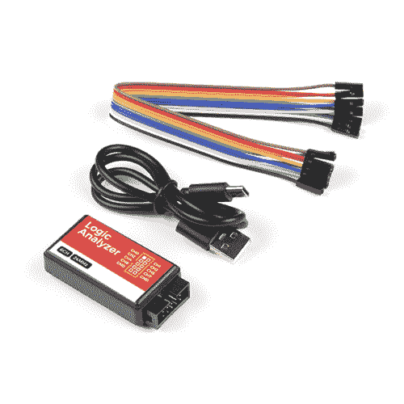](https://www.sparkfun.com/products/18627) 

将**添加到您的[购物车](https://www.sparkfun.com/cart)中！**

 **### [USB 逻辑分析仪- 24MHz/8 通道](https://www.sparkfun.com/products/18627)

[Out of stock](https://learn.sparkfun.com/static/bubbles/ "out of stock") TOL-18627

这款 8 通道 USB 逻辑分析仪支持高达 24MHz 的采样速率，是经济实惠的选择

$19.951[Favorited Favorite](# "Add to favorites") 9[Wish List](# "Add to wish list")** **但是，USB 逻辑分析仪(LA)的作用仅限于配置和监控该工具所需的软件。该 USB 逻辑分析仪有几个软件选项可用；在本教程中，我们旨在让您熟悉 sigrok 的 PulseView。

[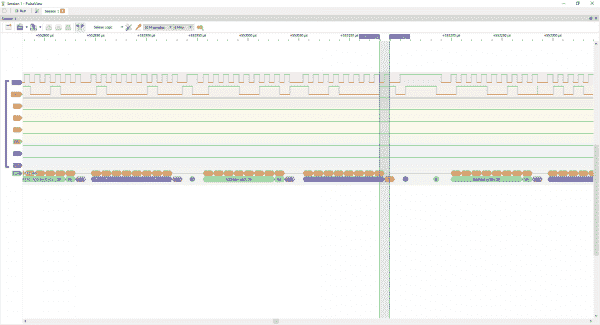](https://cdn.sparkfun.com/assets/learn_tutorials/7/9/3/PulseView-I2C-Example.png)

sigrok 是一个开源软件项目套件——专注于支持信号分析工具。该项目包括:

*   [PulseView](https://sigrok.org/wiki/PulseView) -带有简单 GUI 的逻辑分析仪前端。
*   SIG ROK-CLI——SIG ROK 的命令行界面——用于脚本测试或在无头机器上运行。
*   fx2grok -开源硬件布局、原理图和 BOM 的集合。

着眼于逻辑分析仪，本教程将主要关注 PulseView。

## 获取软件

从 [sigrok 的下载页面](https://sigrok.org/wiki/Downloads)下载最新的 PulseView 版本。以下是最新 Windows、Mac 和 Linux 下载的直接链接:

*   [窗户](https://sigrok.org/wiki/Windows#Windows_installers)
*   麦克·OS X
*   [Linux](https://sigrok.org/wiki/Downloads#Binaries_and_distribution_packages)

Windows 用户可以运行安装程序可执行文件(**pulseview-NIGHTLY-32bit-static-release-installer.exe**)在你的机器上安装软件。Mac 安装程序是一个二进制磁盘映像( **DMG** )，例如，它可以被拖到你的应用程序文件夹中。

**Heads up!** You may need to install drivers before using the USB logic analyzer. If you are using a Windows OS, check out the drivers section:

[Windows Drivers for the USB Logic Analyzer](https://sigrok.org/wiki/Windows#Drivers)

安装后，打开 pulse view-SIG ROK 的 GUI 前端。

## 设置软件/硬件

打开 PulseView，插入 USB 逻辑分析仪。您应该会看到标签下方微弱的红色和绿色发光二极管亮起。

[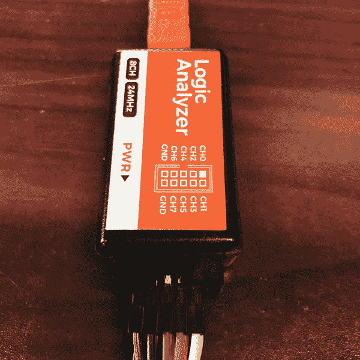](https://cdn.sparkfun.com/assets/learn_tutorials/7/9/3/IMG_6916-1000w.JPG)

如果 PulseView 不能自动检测您的逻辑分析仪，您需要手动设置:

1.  点击“\ <no device="">”下拉菜单。</no>
2.  从下拉菜单中选择 **fx2lafw(基于 FX2 的 LAs 的通用驱动程序)**。
3.  选择 USB 作为接口
4.  点击**扫描使用高于**的驱动程序的设备
5.  选择“8 通道逻辑”并点击“确定”

[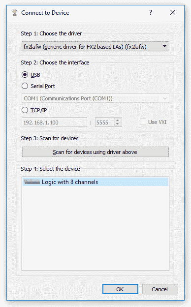](https://cdn.sparkfun.com/assets/learn_tutorials/7/9/3/connect-to-device-2.png)

迎接您的将是一个由八个彩色逻辑通道带组成的空白板，编号为 D0 到 D7(与 LA 上的 CH0-CH7 标签相匹配)。

点击窗口左上角的**运行**按钮开始扫描。

[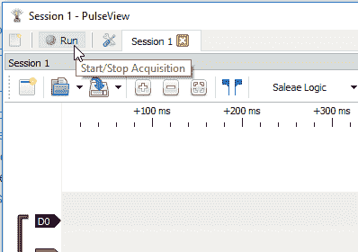](https://cdn.sparkfun.com/assets/learn_tutorials/7/9/3/run-stop.png)

采样参数设置为缺省值——100 万个样本，20k Hz——收集所有 100 万个样本几乎需要一分钟。你可以点击“停止”来提前结束扫描。

除非你已经连接了几个通道和地，否则第一次扫描可能不会那么有趣。

## 探索能力

**注意:**此示例假设您在桌面上使用的是最新版本的 Arduino IDE。如果这是你第一次使用 Arduino，请回顾我们关于[安装 Arduino IDE 的教程。](https://learn.sparkfun.com/tutorials/installing-arduino-ide)

这里有一个有趣而痛苦的 Arduino 草图，您可以加载它来帮助自己熟悉 PulseView 的功能:

```
language:c
void setup() {
  // put your setup code here, to run once:
  randomSeed(analogRead(A0));
  Serial.begin(random(1, 115200)); // Set the baud rate to a random value between 1 and 115200 bps
}

void loop() {
  Serial.println(millis()); // Print the time
  delay(250);
} 
```

将其加载到 Arduino 上，然后将逻辑分析仪“CH0”连接到 Arduino 的 TX 引脚(引脚 1)。也将 GND 的一根电线连接到 GND。

[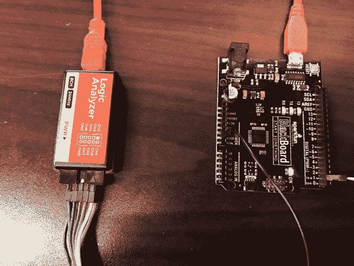](https://cdn.sparkfun.com/assets/learn_tutorials/7/9/3/IMG_6914-1000w.jpg)

扫描前，将采样率提高到 **1MHz** 并将样本量改为 **1 M 样本**。根据你要分析的内容，这些下拉菜单可能会有很多用处。设置好这些值后，点击**运行**。

您应该会收到一秒钟的样本，D0 通道上每隔 250 毫秒会出现一些信号。

[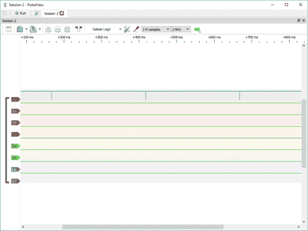](https://cdn.sparkfun.com/assets/learn_tutorials/7/9/3/mystery-baud-01.png)

您可以使用鼠标的滚轮来放大和缩小，或者使用工具栏上的“+”和“-”按钮。放大其中一个光点。现在轮到你猜波特率了！

**显示光标**(一对蓝色旗帜图标)工具对测量时间很有用。点击它，然后试着将光标放在传输的一个比特周围。测得的频率应该就是我们的神秘波特率！

[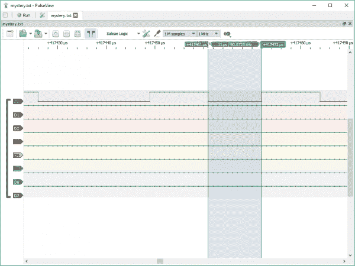](https://cdn.sparkfun.com/assets/learn_tutorials/7/9/3/mystery-baud-02-2.png)

要解码字符串，使用**添加低级、非堆叠协议解码器**工具(看起来像黄色和绿色解码信号)。然后选择**UART**——注意，这里会弹出一个巨大的协议列表，包括 I ² C、I ² S、SDIO 和 SPI。

[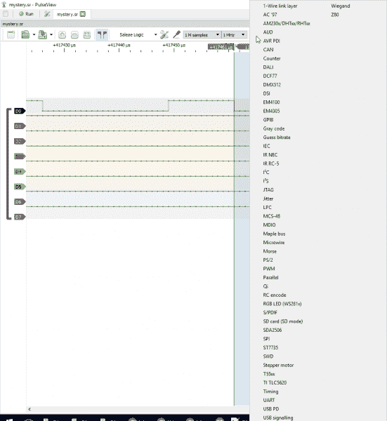](https://cdn.sparkfun.com/assets/learn_tutorials/7/9/3/protocl-analyzers.png)

单击左下角出现的绿色“UART”图标，将波特率更改为您测量的频率。您还可以将数据格式更改为 **ascii** 以使数据更容易解析。

[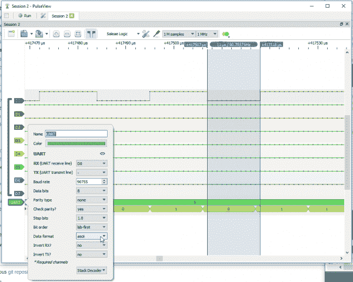](https://cdn.sparkfun.com/assets/learn_tutorials/7/9/3/mystery-baud-05.png)

现在，如果你缩小，你应该看到你的连续打印解码！

## 资源和更进一步

有关更多信息，请查看以下资源:

*   西格罗克
    *   [脉搏观察](https://sigrok.org/wiki/PulseView)
    *   [窗户](https://sigrok.org/wiki/Windows#Windows_installers)
    *   麦克·OS X
    *   [Linux](https://sigrok.org/wiki/Downloads#Binaries_and_distribution_packages)
    *   [sigrok-cli](https://sigrok.org/wiki/Sigrok-cli)
    *   [fx2grok](https://sigrok.org/wiki/Fx2grok)

### CLI 的进一步探索

如果您正在将逻辑分析仪连接到一台无头机器，或者想要自动化基于 LA 的测试，请查看[sigrok-CLI](https://sigrok.org/wiki/Sigrok-cli)-sigrok 的命令行接口。例如，如果安装了 sigrok-cli，您可以使用如下命令:

```
language:bash
sigrok-cli.exe -d fx2lafw --time 3000 --channels D0=RX --config samplerate=1m -P uart:baudrate=115200 
```

解码连接到通道 0 的 UART。

[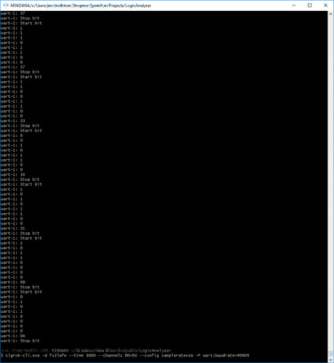](https://cdn.sparkfun.com/assets/learn_tutorials/7/9/3/sigrok-cli-2.png)*Click the image for a closer look.*

CLI 有很大的自动化潜力，主页非常有用！

当你冒险进入这个逻辑分析的世界时，一定要尝试 PuseView 的所有协议解码器和特性。这是一个很棒的软件工具，背后有一个强大的开源社区。**