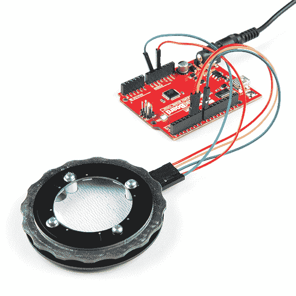

# 旋转拨号套件装配指南

> 原文：<https://learn.sparkfun.com/tutorials/rotary-dial-kit-assembly-guide>

## 简单的界面

[](https://www.sparkfun.com/sparkx)
**Experimental Products:** [SparkX products](https://www.sparkfun.com/sparkx) are rapidly produced to bring you the most cutting edge technology as it becomes available. These products are tested but come with no guarantees. Live technical support is not available for SparkX products.

[旋转拨号套件](https://www.sparkfun.com/products/14790)旨在为您的项目提供一个简单的接口设备。输入通过旋转编码器挡板实现，输出由可寻址 RGB LEDs 环沿环内边缘处理。两个锁眼挂钩被铣入旋转刻度盘的背面，因此它可以安装在墙上。

[](https://www.sparkfun.com/products/retired/14790) 

### [旋转拨号套件](https://www.sparkfun.com/products/retired/14790)

[Retired](https://learn.sparkfun.com/static/bubbles/ "Retired") SPX-14790

旋转拨号套件是为您的项目设计的一个简单的接口设备。使用旋转编码器实现输入…

**Retired**[Favorited Favorite](# "Add to favorites") 6[Wish List](# "Add to wish list")

设计灵感来自我的三星 Gear 智能手表上的旋转表圈以及 Nest 恒温器等壁挂式物联网设备。

### 工具

要组装该套件，您需要:

*   小十字螺丝刀
*   一个烙铁和一些焊料(一支[助焊剂笔](https://www.sparkfun.com/products/14579)也有帮助！)
*   钳子或镊子很方便，但不是必需的

## 硬件装配

### 第一步-清点你的零件！

确保你有你需要的一切。该套件包括三个 PCB、三个 pogo 引脚、四个 4-40 螺栓、四个 4-40 螺母和四个 1/4 英寸支座。

[](https://cdn.sparkfun.com/assets/learn_tutorials/7/9/2/RotaryDialComponents_small.jpg)

### 步骤 2 -焊接弹簧针

组装中最棘手的部分将是焊接这些引脚。不过，这并不太难，所以现在让我们把它解决掉吧！如果你有的话，先在每个垫子上涂一些助焊剂。

[](https://cdn.sparkfun.com/assets/learn_tutorials/7/9/2/ApplyFluxtoSoldertoPad.jpg)

然后把弹簧针放在垫子上，尽可能地居中。不要太担心它，因为如果你添加足够的焊料，它会自动居中。非常小心地将焊料涂在焊盘上，让它流到引脚。添加足够的焊料，使引脚底部周围有一个圆池。一旦有一小滴焊料，迅速平稳地将烙铁拉开，小心不要打翻弹簧针。仍然熔化的焊料的表面张力应该将弹簧针拖到焊盘的中心。

[](https://cdn.sparkfun.com/assets/learn_tutorials/7/9/2/AddSolderPogoPin.jpg)

检查以确保销垂直对齐。它不需要完全垂直于棋盘，但应该相对垂直。您可能需要用镊子夹住引脚，重新加热焊料，并将其压到焊盘上，使其对齐。

[](https://cdn.sparkfun.com/assets/learn_tutorials/7/9/2/SolderedPogoPin.jpg)

对每个引脚重复此过程。

### 步骤 3 -在支座孔中加入一些焊料

将组件固定在一起的螺栓也是挡圈上 RGB LEDs 的信号路径，因此建立良好的电气连接非常重要。为此，在基板背面和固定板正面的每个支座孔表面添加一点焊料。确保不要过度，使孔太紧，螺栓无法通过。这样做的目的是为了让螺母或螺栓头有一个小的凸起，以便拧紧。

[](https://cdn.sparkfun.com/assets/learn_tutorials/7/9/2/SolderOnMountingHoles.jpg)

### 第 4 步-制作你的三明治！

现在是时候把所有东西堆在一起了！可能有很多方法可以做到这一点，但这是我发现最简单的方法。

首先，将 4-40 个螺栓穿过扣环(上面有 led 的板)的前面，使 led 位于螺栓头的对面。现在把它放在一边，把你的基板和弹簧针朝上。

[](https://cdn.sparkfun.com/assets/learn_tutorials/7/9/2/SandwichComponentsRotaryDial.jpg)

小心地在四个支架孔上各放一个尼龙支架，将环形 pcb 的闪亮面朝上，走线朝下放在弹簧针上。

[](https://cdn.sparkfun.com/assets/learn_tutorials/7/9/2/AttachNylonStandoffs.jpg)

现在拿起您的 LED 固定板，小心地将其放在顶部，将每个螺栓穿过相应的支架。板上的四个安装孔中有三个有裸露的铜焊盘，在下图中以绿色突出显示。为了获得正确的方向，请确保将安装孔与没有基板和 LED 环电镀通孔(以红色突出显示)的安装孔对齐。

[](https://cdn.sparkfun.com/assets/learn_tutorials/7/9/2/MountingHolesHighlighted.png)

如果你的方向不对，LED 环就不会工作。小心提起整个烟囱，将螺母放在螺栓末端。

[](https://cdn.sparkfun.com/assets/learn_tutorials/7/9/2/AlignMountingHolesPlatedThroughHoles.jpg)

把所有东西都拧紧，但不要太紧。

[](https://cdn.sparkfun.com/assets/learn_tutorials/7/9/2/TightenScrews.jpg)

### 第五步-享受！

现在，您可以将一些导线或引脚接头焊接到基板上的 5 引脚接头上，并将其连接到您的项目上！

[](https://cdn.sparkfun.com/assets/learn_tutorials/7/9/2/AssembledRotaryDial.jpg)

## 示例代码

**注意:**此示例假设您在桌面上使用的是最新版本的 Arduino IDE。如果这是你第一次使用 Arduino，请回顾我们关于[安装 Arduino IDE 的教程。](https://learn.sparkfun.com/tutorials/installing-arduino-ide)如果您之前没有安装 Arduino 库，请查看我们的[安装指南。](https://learn.sparkfun.com/tutorials/installing-an-arduino-library)

[](https://cdn.sparkfun.com/assets/learn_tutorials/7/9/2/14790-Rotary_Dial.gif)

### 连接表

这里有两个简单的 Arduino 例子来帮助你入门。两者都已经过测试，可与 SparkFun RedBoard 配合使用，连接方式如下:

| zedboard | 旋转刻度盘 |
| GND | GND |
| **5V** | **5V** |
| D8 | 导入 |
| D5 | 附件 A |
| D6 | 附录 B |

连接后，您的设置应该类似于下图。

[](https://cdn.sparkfun.com/assets/learn_tutorials/7/9/2/14790-Rotary_Dial-05.jpg)

两个例子都使用了 [PJRC 编码器库](https://www.pjrc.com/teensy/td_libs_Encoder.html)和[阿达果新像素库](https://github.com/adafruit/Adafruit_NeoPixel)。

### 示例 1 -色轮

这个示例使用 NeoPixel 示例代码片段和 Encoder 示例代码片段来实现颜色选择器。当您向一个方向或另一个方向转动编码器轮时，您将同时在所有八个 RGB LEDs 上的 RGB 色彩空间中循环。

```
language:c
#include <Adafruit_NeoPixel.h>
#include <Encoder.h>

Encoder myEnc(5, 6);

Adafruit_NeoPixel strip = Adafruit_NeoPixel(8, 8, NEO_GRB + NEO_KHZ800);

void setup() {
  strip.begin();
  strip.show();
}

long oldPosition  = -999;

void loop() {
  long newPosition = myEnc.read();
  if (newPosition != oldPosition) {
    oldPosition = newPosition;

    for(int i = 0 ; i < 8; i++){
      strip.setPixelColor(i, Wheel((newPosition*5) & 255));
    }

    strip.show();

  }

}

// Input a value 0 to 255 to get a color value.
// The colours are a transition r - g - b - back to r.
uint32_t Wheel(byte WheelPos) {
  WheelPos = 255 - WheelPos;
  if(WheelPos < 85) {
    return strip.Color(255 - WheelPos * 3, 0, WheelPos * 3);
  }
  if(WheelPos < 170) {
    WheelPos -= 85;
    return strip.Color(0, WheelPos * 3, 255 - WheelPos * 3);
  }
  WheelPos -= 170;
  return strip.Color(WheelPos * 3, 255 - WheelPos * 3, 0);
} 
```

### 示例 2 -旋转式选择器

这个例子几乎是相同的，除了当你转动编码环时，一次只有一个发光二极管将会点亮，其方向与你转动编码环的方向相同。

```
language:c
#include <Adafruit_NeoPixel.h>
#include <Encoder.h>

Encoder myEnc(5, 6);

Adafruit_NeoPixel strip = Adafruit_NeoPixel(8, 8, NEO_GRB + NEO_KHZ800);

void setup() {
  strip.begin();
  strip.show();
}

long oldPosition  = -999;

void loop() {
  long newPosition = myEnc.read();
  if (newPosition != oldPosition) {
    oldPosition = newPosition;

    for(int i = 0 ; i < 8; i++){
      strip.setPixelColor(i, 0);
    }

    int dot = abs(newPosition)%8;
    strip.setPixelColor(dot, Wheel((newPosition*5) & 255));
    strip.show();

  }

}

// Input a value 0 to 255 to get a color value.
// The colours are a transition r - g - b - back to r.
uint32_t Wheel(byte WheelPos) {
  WheelPos = 255 - WheelPos;
  if(WheelPos < 85) {
    return strip.Color(255 - WheelPos * 3, 0, WheelPos * 3);
  }
  if(WheelPos < 170) {
    WheelPos -= 85;
    return strip.Color(0, WheelPos * 3, 255 - WheelPos * 3);
  }
  WheelPos -= 170;
  return strip.Color(WheelPos * 3, 255 - WheelPos * 3, 0);
} 
```

[](https://cdn.sparkfun.com/assets/learn_tutorials/7/9/2/FFFFFF-0.0.png)

## 资源和更进一步

现在你已经成功地启动并运行了你的转盘，是时候把它整合到你自己的项目中了！

有关更多信息，请查看以下资源:

*   [GitHub 产品回购](https://github.com/sparkfunX/Rotary_Dial)
*   [PJRC 编码器库](https://www.pjrc.com/teensy/td_libs_Encoder.html)
*   [Adafruit 新像素库](https://github.com/adafruit/Adafruit_NeoPixel)

你的下一个项目需要一些灵感吗？查看一些相关教程:

[](https://learn.sparkfun.com/tutorials/getting-started-with-the-lilypad-mp3-player) [### LilyPad MP3 播放器入门](https://learn.sparkfun.com/tutorials/getting-started-with-the-lilypad-mp3-player) The LilyPad MP3 Player is an amazing little board that contains almost everything you need to play audio files. You can use it to create all kinds of noisy projects, from MP3 hoodies to talking teddy bears. Your imagination is the only limit! This tutorial will help you get started.[Favorited Favorite](# "Add to favorites") 12[](https://learn.sparkfun.com/tutorials/ws2812-breakout-hookup-guide) [### WS2812 分线连接指南](https://learn.sparkfun.com/tutorials/ws2812-breakout-hookup-guide) How to create a pixel string with the WS2812 and WS2812B addressable LEDs 10[](https://learn.sparkfun.com/tutorials/experiment-guide-for-redbot-with-shadow-chassis) [### 带影子底盘的 RedBot 实验指南](https://learn.sparkfun.com/tutorials/experiment-guide-for-redbot-with-shadow-chassis) This Experiment Guide offers nine experiments to get you started with the SparkFun RedBot. This guide is designed for those who are familiar with our SparkFun Inventor's Kit and want to take their robotics knowledge to the next level.[Favorited Favorite](# "Add to favorites") 11[](https://learn.sparkfun.com/tutorials/building-a-safe-cracking-robot) [### 建造一个安全的破解机器人](https://learn.sparkfun.com/tutorials/building-a-safe-cracking-robot) How to crack an unknown safe in under an hour.[Favorited Favorite](# "Add to favorites") 21