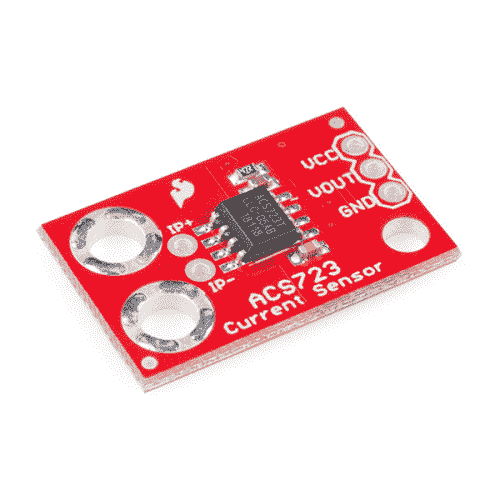
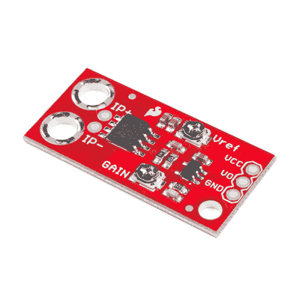

# 电流传感器引线盒(ACS723)连接指南

> 原文：<https://learn.sparkfun.com/tutorials/current-sensor-breakout-acs723-hookup-guide>

## 介绍

**Note:** This tutorial is for the ACS723 breakout boards. If you are using either of the ACS712 breakout boards, please refer to the older [ACS712 Low Current Sensor Hookup Guide](https://learn.sparkfun.com/tutorials/acs712-low-current-sensor-hookup-guide).

ACS723 是 Allegro MicroSystems 公司的一款便携式小电流传感器，适合中低电流检测应用。SparkFun 提供两种类型的分线板，[一种只有传感器](https://www.sparkfun.com/products/13679)和[，另一种带有板载放大器](https://www.sparkfun.com/products/14544)以提高灵敏度。

 

将**添加到您的[购物车](https://www.sparkfun.com/cart)中！**

### [火花电流传感器分接头- ACS723](https://www.sparkfun.com/products/13679)

[Out of stock](https://learn.sparkfun.com/static/bubbles/ "out of stock") SEN-13679

SparkFun 电流传感器分线点是一个高精度板，利用 ACS723 进行中等交流和 DC 电流检测…

$9.953[Favorited Favorite](# "Add to favorites") 15[Wish List](# "Add to wish list")**** 

将**添加到您的[购物车](https://www.sparkfun.com/cart)中！**

### [【火花电流传感器分接头- ACS723(低电流)](https://www.sparkfun.com/products/14544)

[In stock](https://learn.sparkfun.com/static/bubbles/ "in stock") SEN-14544

SparkFun 电流传感器分线点的低电流版本是一种高精度板，利用 ACS723 实现低 to …

$17.502[Favorited Favorite](# "Add to favorites") 9[Wish List](# "Add to wish list")**** ****ACS723 传感器使用霍尔效应传感器输出与流经 IP+和 IP-引脚的电流相关的电压。使用霍尔效应传感器的优点是被检测的电路和读取传感器的电路*是电气隔离的*。这意味着，尽管您的 Arduino 运行在 5V 电压下，但感应电路可以在更高的 DC 或交流电压下工作！

放大分线板(低电流)能够检测低至约 10mA 的极小电流和高达 5A 的大电流！然而，由于输出是模拟的，可用读数将受到噪声和读取输出的 ADC 分辨率的限制。不建议将该传感器用于低于 10 毫安的电流检测。

### 所需材料

根据您可用的设备，您将需要以下一些物品来遵循本连接指南:****