# 核电池装配指南

> 原文：<https://learn.sparkfun.com/tutorials/nuclear-battery-assembly-guide>

## 健康的绿光

**Experimental Products:** [SparkX products](https://www.sparkfun.com/sparkx) are rapidly produced to bring you the most cutting edge technology as it becomes available. These products are tested but come with no guarantees. Live technical support is not available for SparkX products.

在发现[一些非常酷的人](https://hackaday.com/2016/12/01/make-your-own-nuclear-battery/)在制作他们自己的自制核电池后，我们受到启发，开发了[核电池套件](https://www.sparkfun.com/products/14773)。下面的组装指南将带你一步一步地完成这个项目，甚至讨论一些使核电池成为可能的化学物质！

 

### [【核能电池套装(自带氚)](https://www.sparkfun.com/products/retired/14773)

[Retired](https://learn.sparkfun.com/static/bubbles/ "Retired") SPX-14773

在我们看到[一些非常酷的人](https://hack aday . com/2016/12/01/make-your-own-nuclear-battery/)在线制作之后…

**Retired**[Favorited Favorite](# "Add to favorites") 5[Wish List](# "Add to wish list")

这些设备实际上被称为“*放射性同位素光伏发电机*或“*光电发电机*”，它们是一个非常聪明的设计:充满氚气体并涂有磷光材料的发光玻璃丸被夹在两个光伏电池之间。氚发出的β辐射被药丸的玻璃壁阻挡，但它们会使磷光涂层发光。这种光毫无困难地穿过玻璃，落在光伏电池上，产生少量的电！

[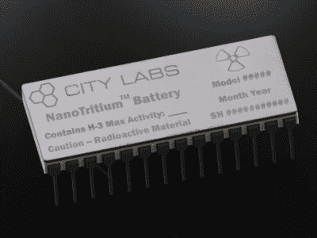](https://cdn.sparkfun.com/assets/learn_tutorials/7/8/8/28-Pin-CERDIP-2-400x300.jpg)*Image courtesy of [citylabs.net](http://citylabs.net)*

商业氚电池——像城市实验室生产的那些——通过使用直接接触氚气体的β伏打(相对于光伏)电池，避开了中间人。这些商用设备更加坚固和高效，但是价格昂贵(每台数千美元)。

[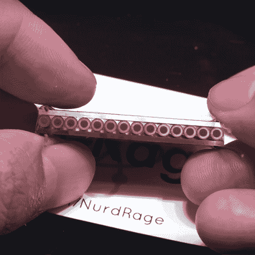](https://cdn.sparkfun.com/assets/learn_tutorials/7/8/8/thu1.png)*Image courtesy of [NurdRage's Video](https://www.youtube.com/watch?v=KKdzhPiOqqg)*

另一方面，使用包装带夹层法制造的自制设备非常便宜，但并不特别坚固。

这个套件在价格和建筑质量之间提供了一个很好的折衷方案。我们为两种光伏电池设计了载板，我们提供预焊接，并用 chipbonder 固定在板上。我们还设计并铸造了定制的硅橡胶垫圈，用于缓冲两个光伏电池之间的氚小瓶，防止电池被划伤或碎裂，最重要的是，小瓶不会破裂。载板还允许您选择光伏电池是串联还是并联，并为电池端子提供与试验板兼容的引脚间距。

### 所需材料

既然我们已经解释了这个工具包背后的科学，是时候开始建造了。为了制造你自己的核电池，除了必须从别处购买的氚之外，你还需要以下材料:

 

将**添加到您的[购物车](https://www.sparkfun.com/cart)中！**

### [【试验板-迷你模块化(黑色)](https://www.sparkfun.com/products/12047)

[In stock](https://learn.sparkfun.com/static/bubbles/ "in stock") PRT-12047

这个黑色的迷你试验板是你的小项目原型的好方法！有了 170 个并列点，就有足够的空间…

$4.50[Favorited Favorite](# "Add to favorites") 21[Wish List](# "Add to wish list")****[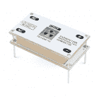](https://www.sparkfun.com/products/retired/14773) 

### [【核能电池套装(自带氚)](https://www.sparkfun.com/products/retired/14773)

[Retired](https://learn.sparkfun.com/static/bubbles/ "Retired") SPX-14773

在我们看到[一些非常酷的人](https://hack aday . com/2016/12/01/make-your-own-nuclear-battery/)在线制作之后…

**Retired**[Favorited Favorite](# "Add to favorites") 5[Wish List](# "Add to wish list")** **这个项目不需要试验板，但它会简化所需的焊接。有关寻找和购买氚瓶的信息，请参考下一节“[氚气灯简介](https://learn.sparkfun.com/tutorials/nuclear-battery-assembly-guide#a-brief-word-on-tritium-gas-lights)”你至少需要十个小瓶来做这个指南。

### 工具

你还需要一些基本的焊接设备和一些简单的工具。以下产品是一个很好的起点:

 

将**添加到您的[购物车](https://www.sparkfun.com/cart)中！**

### [尖嘴钳](https://www.sparkfun.com/products/8793)

[In stock](https://learn.sparkfun.com/static/bubbles/ "in stock") TOL-08793

迷你钳子。这些是很棒的小钳子！任何爱好者或电气工程师的必备。对于插入设备至关重要…

$3.501[Favorited Favorite](# "Add to favorites") 22[Wish List](# "Add to wish list")**** 

### [威勒 WLC100 焊台](https://www.sparkfun.com/products/14228)

[Out of stock](https://learn.sparkfun.com/static/bubbles/ "out of stock") TOL-14228

Weller 的 WLC100 是一款多功能的 5 瓦至 40 瓦焊台，非常适合业余爱好者、DIY 爱好者和学生。…

2[Favorited Favorite](# "Add to favorites") 17[Wish List](# "Add to wish list") 

将**添加到您的[购物车](https://www.sparkfun.com/cart)中！**

### [无铅焊料- 100 克线轴](https://www.sparkfun.com/products/9325)

[In stock](https://learn.sparkfun.com/static/bubbles/ "in stock") TOL-09325

这是带有水溶性树脂芯的无铅焊料的基本线轴。0.031 英寸规格，100 克。这是一个好主意…

$9.957[Favorited Favorite](# "Add to favorites") 33[Wish List](# "Add to wish list")**** 

将**添加到您的[购物车](https://www.sparkfun.com/cart)中！**

### [【镊子弯曲(ESD 安全)](https://www.sparkfun.com/products/10602)

[In stock](https://learn.sparkfun.com/static/bubbles/ "in stock") TOL-10602

你可以从我们种类繁多的镊子看出，我们 SparkFun 非常擅长拾取细小的东西。为了确保我们…

$4.507[Favorited Favorite](# "Add to favorites") 47[Wish List](# "Add to wish list")****** ******请注意，镊子和钳子不是必需的，但会使建造过程更容易。此外，建议使用软布清洁套件的各种组件，在组装过程中，遮蔽胶带可能有助于保持电池部件的静止。

### 推荐阅读

如果你是焊接新手，或者想在开始这个项目之前提高你的焊接技能，请查看下面的教程:

 [### 如何焊接:通孔焊接](https://learn.sparkfun.com/tutorials/how-to-solder-through-hole-soldering) This tutorial covers everything you need to know about through-hole soldering.[Favorited Favorite](# "Add to favorites") 70

## 简述氚气灯

在你开始之前，你需要得到一些 2x 12 毫米的氚辉光瓶。

[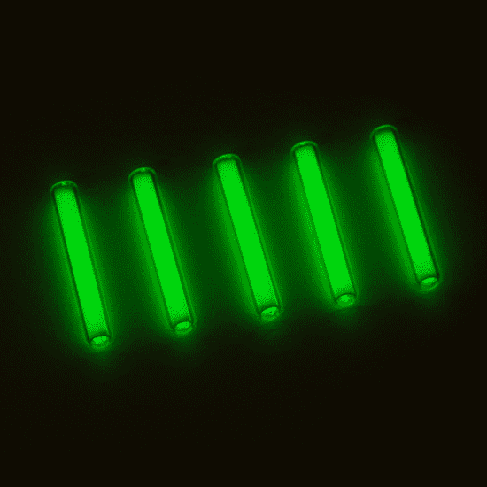](https://cdn.sparkfun.com/assets/learn_tutorials/7/8/8/14773-Nuclear_Battery_Kit-04.jpg)

请记住，你将需要 10 倍。这些产品以各种商标出售，例如:

*   马克斯格洛
*   日光
*   很接近了
*   气态氚光源(GTLS)
*   氚辉光管
*   氚气体管
*   氚辉光小瓶

在诸如[易趣](https://www.ebay.com/sch/i.html?_from=R40&_trksid=m570.l1313&_nkw=2x12+tritium&_sacat=0)、[邦古德](https://www.banggood.com/Wholesale-Tritium-Gadgets-c-4596.html)、[速卖通](https://www.aliexpress.com/wholesale?catId=0&initiative_id=SB_20180608115530&SearchText=tritium+2x12)等网站上很容易找到它们。以及某些[专业网站](https://www.mixglo.com/store/p4/T2b_2x12mm_Vials.html)。虽然它们的销售在许多国家都受到管制——在试图购买任何放射性同位素之前，你应该了解当地的法律——但我们在美国邮购少量放射性同位素没有任何问题。

这些氚辉光管处理起来非常安全，因为氚衰变产生的β辐射不能穿过小瓶的玻璃壁。顺便提一下，β粒子与玻璃的碰撞*确实*产生了非常微量的 x 射线，但不足以伤害任何东西。与氚气体相关的唯一危险是如果它被吸入、注射或以其他方式插入体内，这只有在你打碎玻璃小瓶时才会发生。如果一个小瓶*真的*破了，暂时撤离房间让气体消散。氚在自然界中的含量非常少，与其他发光产品(如镭)相比，它的半衰期非常短，所以打碎发光小瓶不会把你的家变成超级基金场所。

如果你想了解更多关于氚辉光管的知识，你可以看看[这篇关于氚辉光管是如何制造的以及如何用于制表业的精彩博文](https://www.ablogtowatch.com/how-glow-dark-tritium-gas-tubes-made-mb-microtec/)！

## 需要一些组件

### 硬件概述

在开始组装之前，让我们再多谈谈你的[核电池套件](https://www.sparkfun.com/products/14773)中包含了什么。每个套件包括以下内容:

*   顶部和底部 PCB 与非晶硅光伏电池。这些将利用氚瓶产生的能量。

[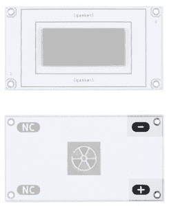](https://cdn.sparkfun.com/assets/learn_tutorials/7/8/8/PCB_detail.jpg)*Boards labeled with headers corresponding to Power (+) and Ground (-)*[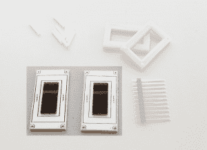](https://cdn.sparkfun.com/assets/learn_tutorials/7/8/8/Battery_Mat_PCB_sized.jpg)

*   两个硅橡胶垫圈。这些将保持小瓶在适当的位置，并有助于保持它们的安全。

[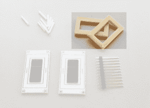](https://cdn.sparkfun.com/assets/learn_tutorials/7/8/8/Battery_Mat_silicone_sized.jpg)

*   长条分离式集管。只需添加一些焊料，这些接头将桥接两块电路板！

[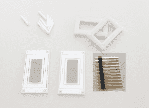](https://cdn.sparkfun.com/assets/learn_tutorials/7/8/8/Battery_Mat_head_sized.jpg)

### 第一步-收集材料

准备十个 2x12mm 的氚气体管、工具包的内容、我们之前讨论过的各种工具和一块试验板(可选)。别忘了柔软的布料！擦亮光伏电池，也许你的氚瓶只是为了去除任何可能影响电池效率的污迹或灰尘，这不是一个坏主意。

[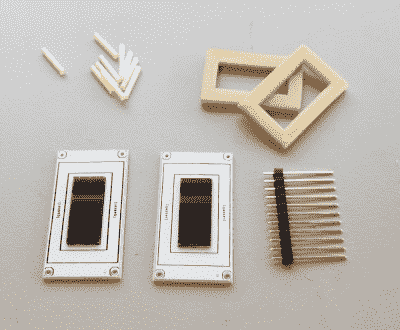](https://cdn.sparkfun.com/assets/learn_tutorials/7/8/8/Battery_Mat_sized.jpg)

### 步骤 2 -将接头连接到顶部 PCB

用钳子掰下几个单独的头。你真的只需要四个，但它们有时会弯曲或不整齐地折断，所以为了安全起见，我们扔了一堆进去。

[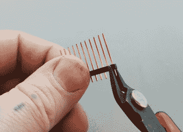](https://cdn.sparkfun.com/assets/learn_tutorials/7/8/8/clip_headers_crop.jpg)

如果你在工作时有一个试验板来固定引脚，那么下一步就简单多了，但是没有试验板你也能应付。在下面的图片中，我将引脚头长边朝下插入试验板，准备将它们焊接到我的顶部 PCB 上。你可以告诉哪一个是顶部，因为它将有 SparkX 标志，以及在光伏电池对面的一些焊接跳线。

[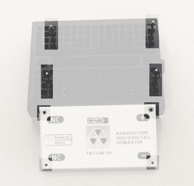](https://cdn.sparkfun.com/assets/learn_tutorials/7/8/8/breadboard_setup_high.jpg)

现在，只需用一个宽大的焊点将每个引脚焊接到位:

[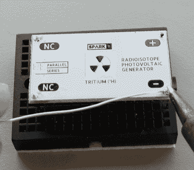](https://cdn.sparkfun.com/assets/learn_tutorials/7/8/8/solder1_scale.jpg)

现在，您可以移除焊接的组件，并将其上下翻转，为下一步做准备。

### 第三步-制作堆栈

现在你需要抓住一个硅橡胶垫圈。哪一个并不重要，因为它们是相同的。将其平面朝下放置，管道朝上放置在 PCB 上标有“垫片”的区域。

[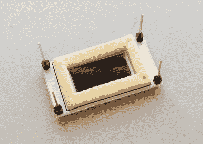](https://cdn.sparkfun.com/assets/learn_tutorials/7/8/8/stack_crop.jpg)

这一步可能有点挑剔，但是不要着急，如果需要的话可以用镊子。将每个 10x 氚气管放入橡胶垫圈中。它有助于从一端开始，然后跨越。将每根管子的一端轻轻放入垫圈一侧的脊中，然后轻轻向下压，直到另一端滑入相应的脊中。

[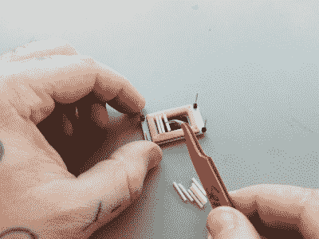](https://cdn.sparkfun.com/assets/learn_tutorials/7/8/8/IMG_20180608_123839.jpg)

在所有的管子都就位后，你可以用一个扁平的物体轻轻按压它们，以确保它们就位。它们应该是这样的:

[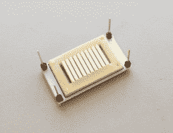](https://cdn.sparkfun.com/assets/learn_tutorials/7/8/8/vials_done_crop.jpg)

现在用另一个橡胶垫圈盖住管子，确保孔和管子对齐，使它们紧密配合。

[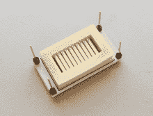](https://cdn.sparkfun.com/assets/learn_tutorials/7/8/8/more_silicone_crop.jpg)

最后，您可以将底部 PCB 滑到堆叠上。**小心！**确保电路板方向正确。两块板上的“ **NC** 、“ **+** 、“ **-** ”引脚标签要对齐！

[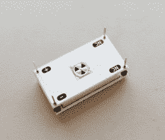](https://cdn.sparkfun.com/assets/learn_tutorials/7/8/8/top_board_crop.jpg)

### 第四步-焊接在一起

对于这一步，您需要对堆叠施加一些夹紧力。太大的力会使橡胶垫圈变形，导致管子在装配时发出嘎嘎声。在这种情况下，您需要重建堆栈。小重量或非常弱的装订夹应该可以，但我发现美纹纸也可以接受。

[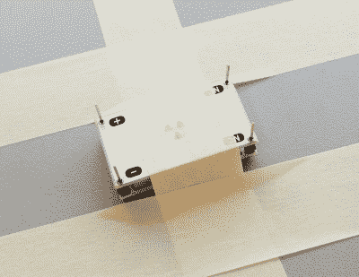](https://cdn.sparkfun.com/assets/learn_tutorials/7/8/8/tape_crop.jpg)

现在焊接四个引脚中的每一个，这些引脚提供了光伏电池之间的电气连接和将发电机固定在一起的机械连接。**焊接后不要夹住接头，因为它们会充当电池的引线。**

[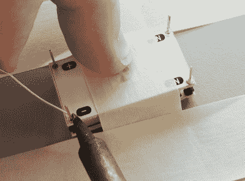](https://cdn.sparkfun.com/assets/learn_tutorials/7/8/8/solder2_crop.jpg)

一旦你完成焊接，你的电池就完成了！

[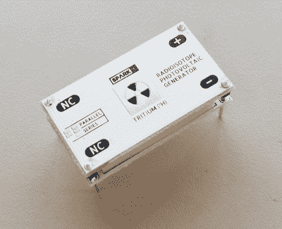](https://cdn.sparkfun.com/assets/learn_tutorials/7/8/8/done_scale.jpg)

## 一点点权力

那么它能产生多少能量呢？不多。我们能够进行的最佳测量(使用 NurdRage 概述的方法)表明，如果您可以构建一个适当负载的电路，这种配置的最大功率点为 25nW(约 0.6v 时为 20 至 30nA)。

[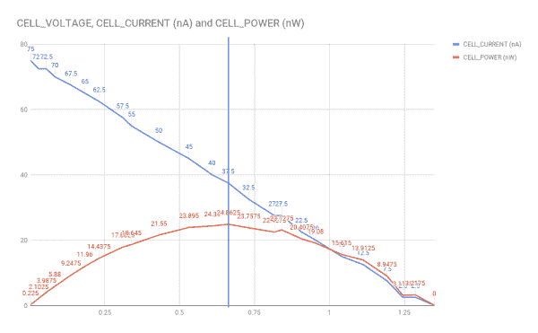](https://cdn.sparkfun.com/assets/learn_tutorials/7/8/8/chart.png)*Having a hard time seeing the graph? Click on the image for a closer look.*

进一步的实验表明，如果时间足够长，电池可以将电容器充电到 1.5 伏。使用这种电池做任何工作都可能需要一个聪明的能量收集电路，但请记住，这种微量的能量将继续流动约 20 年——氚的半衰期为 12 年。

## 资源和更进一步

有关更多信息，请查看以下页面:

*   [GitHub](https://github.com/sparkfunX/Nuclear_Battery_Kit)
*   [黑客日:制造自己的核电池](https://hackaday.com/2016/12/01/make-your-own-nuclear-battery/)
*   [城市实验室:核电池](http://citylabs.net/products/)
*   [YouTube: NurdRage -制造氚核电池或放射性同位素光伏发电机](https://www.youtube.com/watch?v=KKdzhPiOqqg)
*   [值得关注的博客:对 MB-MICROTEC 如何制造夜光氚气体管的独特观察](https://www.ablogtowatch.com/how-glow-dark-tritium-gas-tubes-made-mb-microtec/)

如果你发现自己在寻找更多的动力，看看这些教程和连接指南:

 [### 测量电池的内阻](https://learn.sparkfun.com/tutorials/measuring-internal-resistance-of-batteries) Classroom STEM activity that has students build a battery from a lemon, measure the open and closed circuit voltages, and determine the battery's internal resistance.[Favorited Favorite](# "Add to favorites") 7 [### 可调脂肪充电器连接指南](https://learn.sparkfun.com/tutorials/adjustable-lipo-charger-hookup-guide) The SparkFun Adjustable LiPo Charger is a single-cell lithium polymer (LiPo) and lithium ion battery charger. Because it’s adjustable, this charger will be able to safely charge all of our singe-cell batteries.[Favorited Favorite](# "Add to favorites") 6 [### LuMini 环连接指南](https://learn.sparkfun.com/tutorials/lumini-ring-hookup-guide) The LuMini Rings (APA102-2020) are the highest resolution LED rings available.[Favorited Favorite](# "Add to favorites") 6

或者，如果你想了解更多关于放射性的知识，请随意看看这些博客帖子:

 [### 茂氏盖革计数器

March 29, 2011](https://www.sparkfun.com/news/579 "March 29, 2011: Using the SparkFun Geiger Counter to measure radiation levels in Japan.")[Favorited Favorite](# "Add to favorites") 0 [### 切尔诺贝利又回来了

May 28, 2013](https://www.sparkfun.com/news/1146 "May 28, 2013: I'm back from Chernobyl, and I have data, pictures, and more details about the Leiger.")[Favorited Favorite](# "Add to favorites") 0 [### 如何(不)运输放射性大理石

February 16, 2017](https://www.sparkfun.com/news/2307 "February 16, 2017: But they're so green!")[Favorited Favorite](# "Add to favorites") 2********