# 红纸板边缘连接导轨

> 原文：<https://learn.sparkfun.com/tutorials/redboard-edge-hookup-guide>

## 介绍

[RedBoard Edge](https://www.sparkfun.com/products/14525) 是对 [SparkFun RedBoard](https://www.sparkfun.com/products/13975) 的巧妙改造，旨在安装在您的定制项目外壳中的面板上，以便轻松制作干净、外观精美的产品。它具有普通红纸板的所有功能，允许您在红纸板上制作原型，并轻松地将您的项目移到红纸板边缘，没有任何复杂性。

[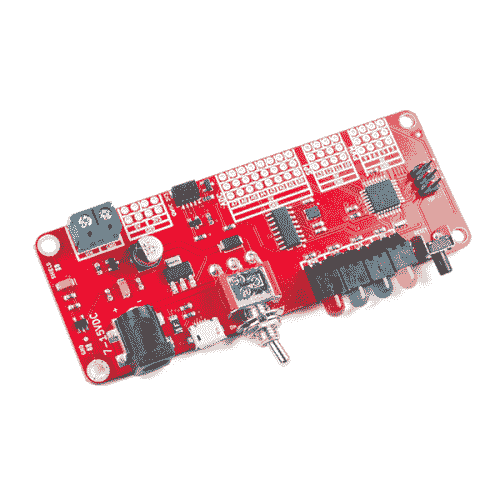](https://www.sparkfun.com/products/retired/14525) 

### [spark fun RedBoard Edge](https://www.sparkfun.com/products/retired/14525)

[Retired](https://learn.sparkfun.com/static/bubbles/ "Retired") DEV-14525

SparkFun RedBoard Edge 是 SparkFun RedBoard 的返工产品，旨在安装在您的定制产品中的面板上

4 **Retired**[Favorited Favorite](# "Add to favorites") 26[Wish List](# "Add to wish list")

[https://www.youtube.com/embed/6aBzgzBO_p4/?autohide=1&border=0&wmode=opaque&enablejsapi=1](https://www.youtube.com/embed/6aBzgzBO_p4/?autohide=1&border=0&wmode=opaque&enablejsapi=1)

RedBoard Edge 和普通的 RedBoard 一样容易使用，所以它仍然是物理计算的一个优秀的学习平台。

本教程的目标是让您熟悉 RedBoard Edge，以便在您准备好从原型产品过渡到封闭产品时，能够轻松地转换您的 RedBoard 项目。因为它基本上是一个重塑的 RedBoard，如果你熟悉 RedBoard 的工作原理，你可以浏览本教程的部分内容。

### 所需材料

要跟随本教程，您将需要以下材料。你可能不需要所有的东西，这取决于你拥有什么。将它添加到您的购物车，通读指南，并根据需要调整购物车。

你需要一根 [RedBoard Edge](https://www.sparkfun.com/products/14525) 和一根 [micro-B-to-A USB 线](https://www.sparkfun.com/products/10215)。USB 接口有两个用途:它为 RedBoard Edge 供电，并允许您向其上传程序。

 

将**添加到您的[购物车](https://www.sparkfun.com/cart)中！**

 **### [USB micro-B 线- 6 脚](https://www.sparkfun.com/products/10215)

[In stock](https://learn.sparkfun.com/static/bubbles/ "in stock") CAB-10215

USB 2.0 型到微型 USB 5 针。这是一种新的、更小的 USB 设备连接器。微型 USB 连接器大约是…

$5.5014[Favorited Favorite](# "Add to favorites") 21[Wish List](# "Add to wish list")****[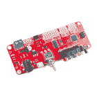](https://www.sparkfun.com/products/retired/14525) 

### [spark fun RedBoard Edge](https://www.sparkfun.com/products/retired/14525)

[Retired](https://learn.sparkfun.com/static/bubbles/ "Retired") DEV-14525

SparkFun RedBoard Edge 是 SparkFun RedBoard 的返工产品，旨在安装在您的定制产品中的面板上

4 **Retired**[Favorited Favorite](# "Add to favorites") 26[Wish List](# "Add to wish list")** **你还需要一台安装了 Arduino IDE 的电脑——Mac、PC 或 Linux 都可以。你可以[从他们的网站下载 Arduino](http://arduino.cc/en/Main/Software) 。那里有安装说明，但我们也将在本教程中讨论安装。

[Download the Arduino IDE](http://arduino.cc/en/Main/Software)

### 工具

根据您的设置，您可能需要烙铁、焊料和[通用焊接附件](https://www.sparkfun.com/categories/49)。

 

### [威勒 WLC100 焊台](https://www.sparkfun.com/products/14228)

[Out of stock](https://learn.sparkfun.com/static/bubbles/ "out of stock") TOL-14228

Weller 的 WLC100 是一款多功能的 5 瓦至 40 瓦焊台，非常适合业余爱好者、DIY 爱好者和学生。…

2[Favorited Favorite](# "Add to favorites") 17[Wish List](# "Add to wish list") 

将**添加到您的[购物车](https://www.sparkfun.com/cart)中！**

 **### [无铅焊料- 100 克线轴](https://www.sparkfun.com/products/9325)

[In stock](https://learn.sparkfun.com/static/bubbles/ "in stock") TOL-09325

这是带有水溶性树脂芯的无铅焊料的基本线轴。0.031 英寸规格，100 克。这是一个好主意…

$9.957[Favorited Favorite](# "Add to favorites") 33[Wish List](# "Add to wish list")** **### 推荐阅读

RedBoard Edge 旨在尽可能方便初学者使用微控制器平台。你可以在没有欧姆定律或 T2 电是如何工作的先天知识的情况下使用它。).开发板使用 Qwiic 系统，因此我们建议阅读此处的[以获得概述](https://www.sparkfun.com/qwiic)。

|  |
| *[Qwiic 连接系统](https://www.sparkfun.com/qwiic)* |

也建议你温习一下 I ² C 的技能，因为所有的 Qwiic 传感器都是 I ² C。如果你不熟悉以下概念，我们建议你在继续之前查看这些教程。

 [### 什么是电路？](https://learn.sparkfun.com/tutorials/what-is-a-circuit) Every electrical project starts with a circuit. Don't know what a circuit is? We're here to help.[Favorited Favorite](# "Add to favorites") 82 [### 什么是 Arduino？](https://learn.sparkfun.com/tutorials/what-is-an-arduino) What is this 'Arduino' thing anyway? This tutorials dives into what an Arduino is and along with Arduino projects and widgets.[Favorited Favorite](# "Add to favorites") 50 [### I2C](https://learn.sparkfun.com/tutorials/i2c) An introduction to I2C, one of the main embedded communications protocols in use today.[Favorited Favorite](# "Add to favorites") 128

## 重新排列的红纸板

借助 RedBoard Edge，我们重新安排了使用 Arduino 编程的 RedBoard，使其在电路板的一侧包含所有“面向用户”(即“正面”)的内容，在电路板的另一侧包含所有“面向项目”的内容。

| [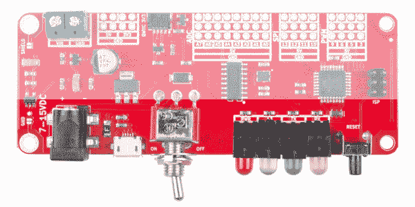](https://cdn.sparkfun.com/assets/learn_tutorials/7/3/6/14525-SparkFun_RedBoard_Edge-04_User-Facing_Side.jpg) | [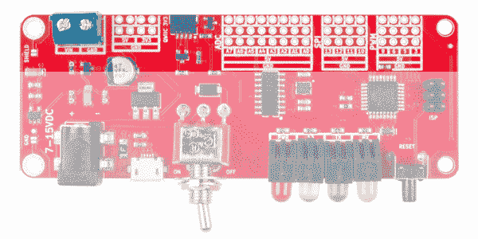](https://cdn.sparkfun.com/assets/learn_tutorials/7/3/6/14525-SparkFun_RedBoard_Edge-04_Project-Facing_Side.jpg) |
| *面向用户的一侧(即“前”侧)* | *面向项目侧* |

下面的图片突出显示了你在你的旧红纸板上已经知道和喜欢的所有东西都已经转移到了哪里。引脚按功能(PWM、ADC、SPI)分组，5V 电源轨和地平行于每组。5mm 2 引脚螺丝端子旁边还有 4 引脚 5V 和 3.3V 电源轨，通过电路板面向用户一侧的拨动开关连接到 VIN。

### 面向用户的一侧(即“前”侧)

#### 微型 usb

RedBoard Edge 可以通过 USB 或桶形插孔连接器供电。如果您选择通过 USB 供电，USB 电缆的另一端可以连接到电脑或(5V 调节) [USB 壁式充电器](https://www.sparkfun.com/products/11456)。

[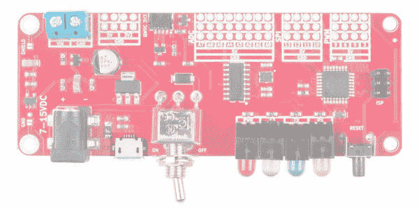](https://cdn.sparkfun.com/assets/learn_tutorials/7/3/6/14525-SparkFun_RedBoard_Edge-04_USB.jpg)

#### VIN 的筒式千斤顶

电源插孔接受外径为 5.5 毫米、内径为 2.1 毫米的中心正极筒形连接器。如果您希望以这种方式为 RedBoard 供电，我们的 [9V](https://www.sparkfun.com/products/298) 和 [12V 墙壁适配器](https://www.sparkfun.com/products/9442)是不错的选择。连接到该插孔的任何墙壁适配器都应提供 7V 至 15V 之间的 **DC 电压。**

[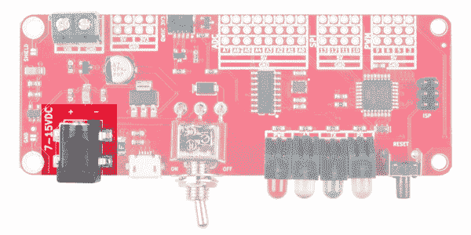](https://cdn.sparkfun.com/assets/learn_tutorials/7/3/6/14525-SparkFun_RedBoard_Edge-04_Barrel_Jack.jpg)

#### 电源开关

该板有一个开关来切换板的其余部分的电源。请注意，拨动开关不会断开 USB 电源。

[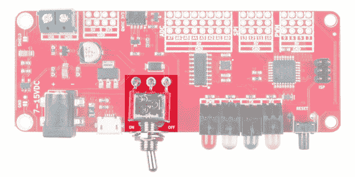](https://cdn.sparkfun.com/assets/learn_tutorials/7/3/6/14525-SparkFun_RedBoard_Edge-04_Power_Switch.jpg)

#### 为 RedBoard Edge 选择电源

根据您的偏好和项目需求，有几个选项可以为 RedBoard Edge 供电。USB 通常是为电路板供电的最简单方式，尤其是在编程时，因为上传代码也需要 USB 接口。你为什么要用桶形千斤顶？通常，这是因为你需要更多的力量。一个 USB 端口通常只允许提供 500mA 的电流。如果您需要更多，墙壁适配器可能是您唯一的选择。

同时连接筒形插孔和 USB 连接器是可以接受的。RedBoard Edge 具有电源控制电路，可自动选择最佳电源。如前所述，拨动开关不会断开 USB 电源。

#### 指示和接口

所有指示灯都移到了主板的前侧，因此您可以在自定义机箱中看到它们。从左到右，指示灯连接到电源、引脚 13、TX 和 RX，如下图所示。控制板最右边的按钮控制复位。

[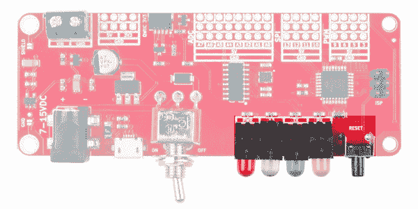](https://cdn.sparkfun.com/assets/learn_tutorials/7/3/6/14525-SparkFun_RedBoard_Edge-04_StatusLEDs_Reset.jpg)

### 面向项目的一侧

#### VIN 螺钉端子

该筒形连接器通过电路板正面的拨动开关连接到电路板面向投影面的螺丝端子。

[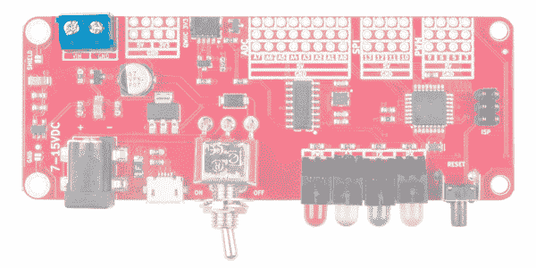](https://cdn.sparkfun.com/assets/learn_tutorials/7/3/6/14525-SparkFun_RedBoard_Edge-04_Screw_Terminals.jpg)

#### PTH 电源引脚

该板还配有 5V、3.3V 和 GND 引脚。

[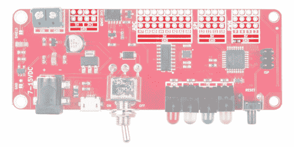](https://cdn.sparkfun.com/assets/learn_tutorials/7/3/6/14525-SparkFun_RedBoard_Edge-04_Power_Rails.jpg)

#### 引脚分组

RedBoard Edge 的引脚在电路板面向项目的一侧分为三组(ADC、SPI 和 PWM)，如下图所示。这些大头针和它们的红纸板具有相同的功能，所以希望能够像在你的普通旧红纸板上一样使用它们。每组三行的引脚在顶行断开，5V 轨在中间行，地在底行。

#### 模拟输入

模拟接头上有八个**模拟输入**。这些管脚都有[模数转换器](https://learn.sparkfun.com/tutorials/analog-to-digital-conversion)，可以用来读入 0 到 5V 之间的模拟电压。如果您需要读取电位计或其他模拟传感器的输出，这些非常有用。只有模拟引脚 A0 至 A5 也可以用作数字输入和输出。

[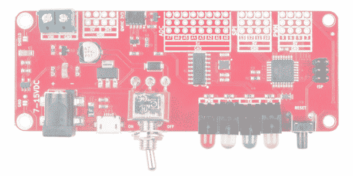](https://cdn.sparkfun.com/assets/learn_tutorials/7/3/6/14525-SparkFun_RedBoard_Edge-04_ADC.jpg)**Heads up!** The ADC pins on A6 and A7 are only for analog input. You will not be able to use a digital read or write on these pins.

#### 串行外设接口(SPI)

中间一组 4 个管脚是 [SPI 接口](https://learn.sparkfun.com/tutorials/serial-peripheral-interface-spi)，其中`pin 10 = SS`、`pin 11 = MOSI`、`pin 12 = MISO`和`pin 13 = SCK`。

[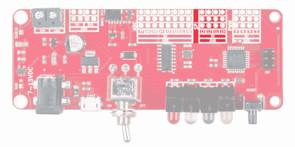](https://cdn.sparkfun.com/assets/learn_tutorials/7/3/6/14525-SparkFun_RedBoard_Edge-04_SPI.jpg)

#### 脉冲宽度调制

最右边的一组引脚是[脉宽调制(PWM)](https://learn.sparkfun.com/tutorials/pulse-width-modulation) 引脚，可用于驱动 LED 或伺服系统。

[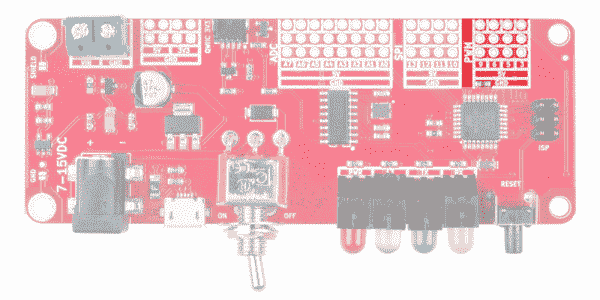](https://cdn.sparkfun.com/assets/learn_tutorials/7/3/6/14525-SparkFun_RedBoard_Edge-04_PWM.jpg)

### 头球

RedBoard Edge 没有板载接头，因此您可以选择将完成的电路直接焊接到电路板上。然而，如果你想把你的优势用在更符合原型的事情上，就拿一些头文件吧。****