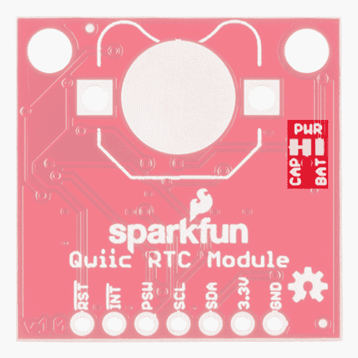

# Qwiic 实时时钟模块(RV-1805)连接指南

> 原文：<https://learn.sparkfun.com/tutorials/qwiic-real-time-clock-module-rv-1805-hookup-guide>

## 介绍

[Qwiic 实时时钟(RTC)模块](https://www.sparkfun.com/products/14558)是 RV-1805 模块的 Qwiic 启用分线板！RTC 是超低功耗的(在最低功率设置下运行约 22 nA ),因此它可以使用超级电容器作为备用电源，而不是普通电池。这意味着无限的充电和放电循环不会对“电池”(在这种情况下，是一个超级电容器)造成任何损害。分线板也是 SparkFun 的 [Qwiic 系统](https://www.sparkfun.com/categories/399)的一部分，所以你不必做任何焊接就能知道现在是什么时间。

[](https://www.sparkfun.com/products/14558) 

将**添加到您的[购物车](https://www.sparkfun.com/cart)中！**

### [](https://www.sparkfun.com/products/14558)spark fun 实时时钟模块- RV-1805 (Qwiic)

[In stock](https://learn.sparkfun.com/static/bubbles/ "in stock") BOB-14558

这款 SparkFun 实时时钟(RTC)模块是一款支持 Qwiic 的分线板，适用于 RV-1805 芯片组，运行速度仅为 22…

$18.50 $8.334[Favorited Favorite](# "Add to favorites") 17[Wish List](# "Add to wish list")** **在本连接指南中，我们将利用 Arduino IDE 自动将 RTC 的时间设置为编译器时间。一旦我们设置好时间，我们将闹钟设置到我们选择的时间，并让它在中断引脚上产生一个信号。我们还将看看 RTC 是如何充电的，这样我们就知道何时将 RTC 从电源上拔下(当然是充满的时候)。最后，我们将了解如何将其他数据存储到 RTC 中，以便在系统断电时保护重要变量的安全。我们还将讨论如何通过添加外部电池来延长 RTC 的电池寿命。

### 所需材料

首先，您需要一个微控制器来控制项目中的一切。

[](https://www.sparkfun.com/products/13975) 

将**添加到您的[购物车](https://www.sparkfun.com/cart)中！**

### [spark fun red board——用 Arduino 编程 T3](https://www.sparkfun.com/products/13975)

[In stock](https://learn.sparkfun.com/static/bubbles/ "in stock") DEV-13975

SparkFun RedBoard 结合了 UNO 的 Optiboot 引导程序的简单性、FTDI 的稳定性和 shield com…

$21.5049[Favorited Favorite](# "Add to favorites") 89[Wish List](# "Add to wish list")****[](https://www.sparkfun.com/products/13907) 

将**添加到您的[购物车](https://www.sparkfun.com/cart)中！**

### [SparkFun ESP32 东西](https://www.sparkfun.com/products/13907)

[In stock](https://learn.sparkfun.com/static/bubbles/ "in stock") DEV-13907

SparkFun ESP32 Thing 是 Espressif 的 ESP32 的综合开发平台，ESP32 是他们的超级充电版本…

$23.5069[Favorited Favorite](# "Add to favorites") 83[Wish List](# "Add to wish list")****[](https://www.sparkfun.com/products/13774) 

将**添加到您的[购物车](https://www.sparkfun.com/cart)中！**

### [【粒子光子】](https://www.sparkfun.com/products/13774)

[Out of stock](https://learn.sparkfun.com/static/bubbles/ "out of stock") WRL-13774

Particle 的 IoT(物联网)硬件开发板 Photon 提供了构建互联网络所需的一切…

$19.0032[Favorited Favorite](# "Add to favorites") 51[Wish List](# "Add to wish list")****[](https://www.sparkfun.com/products/retired/13825) 

### [树莓派 3](https://www.sparkfun.com/products/retired/13825)

[Retired](https://learn.sparkfun.com/static/bubbles/ "Retired") DEV-13825

每个人都知道并喜欢 Raspberry Pi，但如果您不需要额外的外设来使其无线化会怎么样呢？覆盆子…

92 **Retired**[Favorited Favorite](# "Add to favorites") 97[Wish List](# "Add to wish list")****** ******现在，要让您的微控制器进入 Qwiic 生态系统，关键是以下 Qwiic 屏蔽之一，以符合您对微控制器的偏好:

[](https://www.sparkfun.com/products/14352) 

将**添加到您的[购物车](https://www.sparkfun.com/cart)中！**

### [ArduinoT3 的 SparkFun Qwiic 盾](https://www.sparkfun.com/products/14352)

[In stock](https://learn.sparkfun.com/static/bubbles/ "in stock") DEV-14352

SparkFun Qwiic Shield 是一种易于组装的板，它提供了一种简单的方法来将 Qwiic Connect 系统与

$7.508[Favorited Favorite](# "Add to favorites") 39[Wish List](# "Add to wish list")****[](https://www.sparkfun.com/products/14459) 

将**添加到您的[购物车](https://www.sparkfun.com/cart)中！**

### [树莓派的 SparkFun Qwiic 帽子](https://www.sparkfun.com/products/14459)

[In stock](https://learn.sparkfun.com/static/bubbles/ "in stock") DEV-14459

树莓派的 SparkFun Qwiic 帽子是进入 Qwiic 生态系统的最快捷、最简单的方式，并且仍然适用于

$6.505[Favorited Favorite](# "Add to favorites") 33[Wish List](# "Add to wish list")****[](https://www.sparkfun.com/products/14477) 

将**添加到您的[购物车](https://www.sparkfun.com/cart)中！**

### [光子盾](https://www.sparkfun.com/products/14477)

[28 available](https://learn.sparkfun.com/static/bubbles/ "28 available") DEV-14477

SparkFun Qwiic Shield for Photon 是一个易于组装的板，提供了一种简单的方法来整合 Qwiic 系统…

$6.50[Favorited Favorite](# "Add to favorites") 7[Wish List](# "Add to wish list")****** ******你还需要一根 Qwiic 电缆来连接屏蔽层和 RTC，选择适合你需要的长度。

[](https://www.sparkfun.com/products/14427) 

将**添加到您的[购物车](https://www.sparkfun.com/cart)中！**

### [Qwiic 线缆- 100mm](https://www.sparkfun.com/products/14427)

[In stock](https://learn.sparkfun.com/static/bubbles/ "in stock") PRT-14427

这是一条 100 毫米长的 4 芯电缆，带有 1 毫米 JST 端接。它旨在将支持 Qwiic 的组件连接在一起…

$1.50[Favorited Favorite](# "Add to favorites") 32[Wish List](# "Add to wish list")****[](https://www.sparkfun.com/products/14429) 

将**添加到您的[购物车](https://www.sparkfun.com/cart)中！**

### [Qwiic 线缆- 500mm](https://www.sparkfun.com/products/14429)

[In stock](https://learn.sparkfun.com/static/bubbles/ "in stock") PRT-14429

这是一根 500mm 长的 4 芯电缆，带有 1mm JST 端接。它旨在将支持 Qwiic 的组件连接在一起…

$1.951[Favorited Favorite](# "Add to favorites") 25[Wish List](# "Add to wish list")****[](https://www.sparkfun.com/products/14426) 

将**添加到您的[购物车](https://www.sparkfun.com/cart)中！**

### [Qwiic 线缆- 50mm](https://www.sparkfun.com/products/14426)

[In stock](https://learn.sparkfun.com/static/bubbles/ "in stock") PRT-14426

这是一根 50 毫米长的 4 芯电缆，带有 1 毫米 JST 端接。它旨在将支持 Qwiic 的组件连接在一起…

$0.95[Favorited Favorite](# "Add to favorites") 29[Wish List](# "Add to wish list")****[](https://www.sparkfun.com/products/14428) 

### [Qwiic 线缆- 200mm](https://www.sparkfun.com/products/14428)

[Out of stock](https://learn.sparkfun.com/static/bubbles/ "out of stock") PRT-14428

这是一根 200 毫米长的 4 芯电缆，带有 1 毫米 JST 端接。它旨在将支持 Qwiic 的组件连接在一起…

[Favorited Favorite](# "Add to favorites") 21[Wish List](# "Add to wish list")****** ******最后，如果您的应用要求您的 RTC 断电超过一个月，我们建议使用可选的电池和电池座来延长 RTC 在断电时保持活动的时间。

[](https://www.sparkfun.com/products/337) 

将**添加到您的[购物车](https://www.sparkfun.com/cart)中！**

### [纽扣电池- 12mm (CR1225)](https://www.sparkfun.com/products/337)

[In stock](https://learn.sparkfun.com/static/bubbles/ "in stock") PRT-00337

CR1225 锂金属 3V 12mm 47mAh 纽扣电池。微型传感器节点应用的完美小型电池。Thes…

$2.102[Favorited Favorite](# "Add to favorites") 14[Wish List](# "Add to wish list")****[](https://www.sparkfun.com/products/7948) 

将**添加到您的[购物车](https://www.sparkfun.com/cart)中！**

### [](https://www.sparkfun.com/products/7948)12mm 纽扣电池座

[34 available](https://learn.sparkfun.com/static/bubbles/ "34 available") PRT-07948

这是一个通孔 12 毫米硬币电池座。它是我们喜欢用作 GPS 单元的 RTC 备份和 SRAM 备份的单元…

$1.60[Favorited Favorite](# "Add to favorites") 5[Wish List](# "Add to wish list")**** ****### 推荐阅读

如果你不熟悉 Qwiic 系统，我们推荐你在这里阅读[以获得一个概述](https://www.sparkfun.com/qwiic)。

| [](https://www.sparkfun.com/qwiic) |
| *[Qwiic 连接系统](https://www.sparkfun.com/qwiic)* |

如果你还没有看 Qwiic Shield 的连接指南，我们也建议你看一看。也建议你温习一下 I ² C 的技能，因为所有的 Qwiic 传感器都是 I ² C 的

[](https://learn.sparkfun.com/tutorials/how-to-solder-through-hole-soldering) [### 如何焊接:通孔焊接](https://learn.sparkfun.com/tutorials/how-to-solder-through-hole-soldering) This tutorial covers everything you need to know about through-hole soldering.[Favorited Favorite](# "Add to favorites") 70[](https://learn.sparkfun.com/tutorials/i2c) [### I2C](https://learn.sparkfun.com/tutorials/i2c) An introduction to I2C, one of the main embedded communications protocols in use today.[Favorited Favorite](# "Add to favorites") 128[](https://learn.sparkfun.com/tutorials/qwiic-shield-for-arduino--photon-hookup-guide) [### Arduino 和光子连接指南的 Qwiic 屏蔽](https://learn.sparkfun.com/tutorials/qwiic-shield-for-arduino--photon-hookup-guide) Get started with our Qwiic ecosystem with the Qwiic shield for Arduino or Photon.[Favorited Favorite](# "Add to favorites") 5

## 硬件概述

让我们来看看 RV-1805 RTC 的一些特征，这样我们就能对它的行为有更多的了解。

| **特性** | **范围** |
| 工作电压(启动) | 1.6V - 3.6V |
| 工作电压(计时) | 1.5V - 3.6V |
| 工作温度 | -40 摄氏度- 85 摄氏度 |
| 时间准确度 | &plusmn2.0 ppm |
| 电流消耗 | 22 分钟。(请注意) |
| I ² C 地址 | 0x69 |

### 腿

下表列出了 RTC 上可用引脚的特性。

| Pin Label | 引脚功能 | 输入/输出 | 笔记 |
| 3.3V | 电源 | 投入 | 应该在 **1.95 - 3.6V** 之间 |
| GND | 地面 | 投入 | 0V/公共电压。 |
| 国家药品监督管理局 | I ² C 数据信号 | 双向的 | 双向数据线。电压不应超过电源电压(例如 3.3V)。 |
| SCL | I ² C 时钟信号 | 投入 | 主控时钟信号。电压不应超过电源电压(例如 3.3V)。 |
| 毕业生工作签证 | 电源开关 | 输出 | 电源开关引脚，数字输出。能够切换外部微控制器的电源。 |
| （同 Internationalorganizations）国际组织 | 中断 | 输出 | 中断引脚，低电平有效，数字输出。也可配置为最高 32.768 kHz 的方波 |
| 英特尔的快速储存技术 | 重置 | 输出 | Reset 引脚，低电平有效，数字输出 |

### 可选功能

Qwiic RTC 具有板载 I ² C 上拉电阻；如果多个传感器连接到总线并使能上拉电阻，并联等效电阻将产生过强的上拉电阻，使总线无法正常工作。一般来说，如果总线上连接了多个器件，则除一对上拉电阻外，应禁用所有上拉电阻。如果需要断开上拉电阻，可以通过移除下面突出显示的相应跳线上的焊料来移除。

[](https://cdn.sparkfun.com/assets/learn_tutorials/7/4/7/PU.png)

如果超级电容器不能让你的项目供电足够长的时间，也可以选择在电路板上添加电池(记住，超级电容器可以让电路板保持大约 35 天的时间)，你可以焊接外部电池。请记住，如果这样做，您需要切断连接电源到电容器的迹线，并在连接电源到标有 **BAT** 的电池的跳线一侧添加焊料。

[](https://cdn.sparkfun.com/assets/learn_tutorials/7/4/7/PWR.png)

## 硬件装配

如果你还没有组装好你的 Qwiic 盾，现在是时候去上那个教程了。

随着盾牌的组装，Sparkfun 的新 Qwiic 环境意味着连接传感器不可能更容易。只需将 qw IC 电缆的一端插入 RTC 分接头，另一端插入您选择的 qw IC 屏蔽。您将准备好上传草图并开始记录时间。它看起来太容易使用了，但这就是为什么我们要这样做！

[](https://cdn.sparkfun.com/assets/learn_tutorials/7/4/7/SparkFun_Real_Time_Clock_Module_-_RV-1805__Qwiic__Hookup_Guide-04.jpg)

### 外部纽扣电池

现在，如果您决定用电池而不是超级电容为 RTC 供电，则需要切断电路板背面的走线跳线，以断开超级电容的电源。将焊料添加到跳线的另一侧，以将电源连接到电池。完成后，在圆形接触垫上加一点焊料，将电池支架腿焊接到电路板上，插入电池，就可以开始了！

[](https://cdn.sparkfun.com/assets/learn_tutorials/7/4/7/SparkFun_Real_Time_Clock_Module_-_RV-1805__Qwiic__Hookup_Guide-08.jpg)

## 库概述

**注意:**此示例假设您在桌面上使用的是最新版本的 Arduino IDE。如果这是你第一次使用 Arduino，请回顾我们关于[安装 Arduino IDE 的教程。](https://learn.sparkfun.com/tutorials/installing-arduino-ide)如果您之前没有安装 Arduino 库，请查看我们的[安装指南。](https://learn.sparkfun.com/tutorials/installing-an-arduino-library)

在开始编写我们的 RTC 之前，让我们下载并检查一下库中可用的函数。SparkFun 编写了一个库来控制 Qwiic RTC。您可以通过 Arduino 库管理器获得这些库。搜索**spark fun Qwiic RTC RV 1805 Arduino 库**安装最新版本。如果您喜欢从 GitHub 库下载库并手动安装，您可以在这里下载:

[Download the SparkFun Qwiic RTC RV1805 Library (ZIP)](https://github.com/sparkfun/SparkFun_RV-1805_Arduino_Library/archive/master.zip)

让我们从查看设置 RTC 的函数开始。

### 设置和设置

*   **`boolean begin( TwoWire &wirePort = Wire );`**-begin 功能初始化 RTC，启用涓流充电电路和低功耗模式。还将 RTC 设置为 12 小时时间格式。
*   **`void reset(void);`** -在 RTC 上执行完全软件复位。
*   **`bool setToCompilerTime();`** -将 RTC 设置为编译器上的时间。
*   **`bool setTime(uint8_t hund, uint8_t sec, uint8_t min, uint8_t hour, uint8_t date, uint8_t month, uint8_t year, uint8_t day);`** -使用单个变量将 RTC 的时间寄存器设置为选定的时间。
*   **`bool setTime(uint8_t * time, uint8_t len)`** -按照以下顺序使用时间数组将 RTC 的时间寄存器设置为选定的时间`{Hundredths, Seconds, Minutes, Hours, Date, Month, Year, Day}`。请注意`uint8_t len`必须是 **7** ，时间数组的长度，该功能才能正确设置时间。
*   **`bool setHundredths(uint8_t value);`** -将**的百分之一**寄存器设置为`value`。
*   **`bool setSeconds(uint8_t value);`** -将**秒**寄存器设置为`value`。
*   **`bool setMinutes(uint8_t value);`** -将**分钟**寄存器设置为`value`。
*   **`bool setHours(uint8_t value);`** -将**小时**寄存器设置为`value`。
*   **`bool setWeekday(uint8_t value);`** -将**工作日**寄存器设置为`value`。
*   **`bool setDate(uint8_t value);`** -将**日期**寄存器设置为`value`。
*   **`bool setMonth(uint8_t value);`** -将**月份**寄存器设置为`value`。
*   **`bool setYear(uint8_t value);`** -将**年**寄存器设置为`value`。
*   **`void set12Hour();`** -将 RTC 设置为 12 小时模式。
*   **`void set24Hour();`** -将 RTC 设置为 24 小时模式。
*   **`void enableTrickleCharge(uint8_t diode = DIODE_0_3V, uint8_t rOut = ROUT_3K);`** -连接内部二极管和电阻，使涓流充电电路能够为超级电容器充电。默认值是电容器充电的最快速度，尽管可以传递其他全局变量(如下所列)来更改充电电路中使用的二极管和电阻器的值。
    *   **`DIODE_0_3V`** - 0.3V 二极管
    *   **`DIODE_0_6V`** - 0.6V 二极管
    *   **`DIODE_DISABLE`** -断开二极管，禁用涓流充电电路
    *   **`ROUT_3K`**-3kω电阻
    *   **`ROUT_6K`**-6kω电阻
    *   **`ROUT_11K`**-11kω电阻
    *   **`ROUT_DISABLE`** -断开电阻，禁用涓流充电电路。
*   **`void disableTrickleCharge();`** -禁用涓流充电电路。
*   **`void enableLowPower();`** -当 RTC 由超级电容器或电池供电时，允许切换到低功耗 RC 振荡器。

### 中断功能

*   **`void enableInterrupt(uint8_t source);`** -根据`source`的值使能给定的中断，该值可以是以下任意值。
    *   **`INTERRUPT_EIE`** -外部中断
    *   **`INTERRUPT_AIE`** -报警中断
    *   **`INTERRUPT_TIE`** -定时器中断
    *   **`INTERRUPT_BLIE`** -电池中断
*   **`void disableInterrupt(uint8_t source);`** -根据`source`的值禁用给定的中断，参见上述`source`的可能值。
*   **`void clearInterrupts();`** -清除所有中断源。
*   **`void setCountdownTimer(uint8_t duration, uint8_t unit, bool repeat = true, bool pulse = true);`** -设置倒计时定时器，如果`INTERRUPT_TIE`启用，则触发中断。
    *   **`uint8_t duration`** -设置持续时间(要知道这只是一个 BCD，递增一个 LSB 所需的时间由`unit`决定)。
    *   **`uint8_t unit`** -设置每个 LSB 的时间分辨率。
        *   `0b00:` 1/4096 s
        *   `0b01:`1/64·s
        *   `0b10:` 1 秒
        *   `0b11:` 60 年代
    *   **`bool repeat`**——如果 repeat 为真，则倒计时定时器到达 0 时会重置，否则会停止。
    *   **`bool pulse`** -中断通常是一个脉冲，除非脉冲和重复都为假，在这种情况下，中断将是一个电平，直到中断标志被手动清除。
*   **`enableSleep()`** -启用睡眠
*   **`setPowerSwitchFunction(uint8_t function);`** -改变 PSW 引脚的行为。
    *   `0b000:`如果至少一个中断被使能，组合中断信号 IRQ 的反相。
    *   `0b001:`方波如果 SQW = 1；
    *   `0b010:`保留。
    *   `0b011:`如果设置了报警中断，则报警反转
    *   `0b100:`定时器如果设置了定时器中断
    *   `0b101:`如果设置了定时器中断，则定时器反转
    *   `0b110:`睡眠信号
    *   `0b111:`静 PSWB 钻头
*   **`setPowerSwitchLock(bool lock)`** -设置电源开关锁定，如果锁定被启用，PSWB 位不能设置为 1。这通常在使用 PSW 作为电源开关时使用，因为设置 PSWB 会将 PSW 置于高阻抗状态。
*   **`setsStaticPowerSwitchOutput(bool psw);`** -启用 PSW 位进行切换。
*   **`bool setAlarm(uint8_t sec, uint8_t min, uint8_t hour, uint8_t date, uint8_t month);`** -使用单个变量将闹铃设置到选定的时间。
*   **`bool setAlarm(uint8_t * time, uint8_t len);`** -使用时间数组将闹铃设置到选定的时间。`uint8_t len`必须是 **7** ，时间数组的长度，该功能才能正确设置报警。
*   **`enableAlarmInterrupt();`** -将中断引脚附加到报警功能。
*   **`void setAlarmMode(uint8_t mode);`** - `mode`必须在 0 到 7 之间，根据`mode`的值，闹铃随着秒、分、小时等的匹配而响起。
    *   **`0`** :禁用
    *   **`1`** :百分之一秒、秒、分钟、小时、日期和月份匹配(每年一次)
    *   **`2`** :百分位、秒、分、小时、日期匹配(每月一次)
    *   **`3`** :百分之一秒、秒、分、小时和工作日匹配(每周一次)
    *   **`4`** :百分之一秒、秒、分、小时匹配(每天一次)
    *   **`5`** :百分之一秒分钟匹配(每小时一次)
    *   **`6`** :百分之一秒匹配(每分钟一次)
    *   **`7`** :取决于报警值为**百分之一**。
        *   **`0-99`** :百分之一匹配(每秒一次)
        *   **`240-249`** :每十分之一次(10 Hz)
        *   **`255`** :百分之一次(100 Hz)
*   **`void enableBatteryInterrupt(uint8_t voltage, bool edgeTrigger);`** -启用电池中断并设置触发中断的电压。`voltage`和`edgeTrigger`不同值的触发电压见下表。

| **电压** | **EdgeTrigger = true** | **EdgeTrigger = false** |
| **0** | 3.0V | 2.5V |
| **1** | 2.5V | 2.1V |
| **2** | 2.2V | 1.8V |
| **3** | 1.6V | 1.4V |

*   **`void setReferenceVoltage(uint8_t voltage, bool edgeTrigger);`** -可以用来设置用于电池中断的参考电压。使用上表中的值。
*   **`bool checkBattery(uint8_t voltage, bool edgeTrigger);`** -检查电池电量是否高于由值`voltage`和`edgeTrigger`设定的阈值。

### 读取 RTC

*   **`bool updateTime();`** -用 RTC 时间寄存器更新本地时间数组。
*   **`stringDateUSA();`** -以 **MM-DD-YYYY** 格式返回日期。
*   **`stringDate();`**——返回日期 **DD-MM-YYYY** 格式。
*   **`stringTime();`** -如果 RTC 处于 12 小时模式，返回时间以**时:分:秒**表示，带 AM/PM。
*   **`uint8_t getHundredths();`**——返回第**百分之一**寄存器的值。
*   **`uint8_t getSeconds();`**——返回**秒**寄存器的值。
*   **`uint8_t getMinutes();`**——返回**分钟**寄存器的值。
*   **`uint8_t getHours();`**——返回**小时**寄存器的值。
*   **`uint8_t getWeekday();`**——返回**工作日**寄存器的值。
*   **`uint8_t getDate();`**——返回**日期**寄存器的值。
*   **`uint8_t getMonth();`**——返回**月份**寄存器的值。
*   **`uint8_t getYear();`**——返回**年**寄存器的值。
*   **`bool is12Hour();`** -如果设置了 12 小时位，则返回 true。
*   **`bool isPM();`** -如果`is12Hour() == true`和 PM 位被置位，则返回真。
*   **`uint8_t status();`** -返回状态字节。
*   **`uint8_t BCDtoDEC(uint8_t val);`** -从 BCD 转换成十进制格式。
*   **`uint8_t DECtoBCD(uint8_t val);`** -从十进制转换为 BCD 格式。
*   **`uint8_t readRegister(uint8_t addr);`**——在`addr`读取寄存器。
*   **`bool writeRegister(uint8_t addr, uint8_t val);`**——将`val`写到地点`addr`。
*   **`bool readMultipleRegisters(uint8_t addr, uint8_t * dest, uint8_t len);`**——读取`len`个寄存器，从`addr`位置开始递增，放入数组`dest`。
*   **`bool writeMultipleRegisters(uint8_t addr, uint8_t * values, uint8_t len);`**——写入`len`个寄存器，从`addr`位置开始递增，从数组`values`开始。

## 示例代码

### 示例 1 -设置时间

一旦你安装了 SparkFun Qwiic RTC RV-1805 Arduino 库，进入**文件** > **示例**>**spark fun Qwiic RTC RV-1805 Arduino 库** > **示例 1-Set_Time** 打开示例草图。我们将使用第一张草图来设置 RTC 的内部时钟。请注意下面几行代码，它们使用编译器时间来设置 RTC 的时钟。

```
language:c
if (rtc.setToCompilerTime() == false) {
  Serial.println("Something went wrong setting the time");
} 
```

请注意，这不会在我们每次上传代码到 Arduino 时重置，所以请确保在上传之前重新启动 IDE，以获得上传到 RTC 的最新时间。

### 示例 2 -打印时间

现在，我们已经在 RTC 上设置了时间，让我们读出它。打开下一个例子通过标题到**文件** > **例子**>**spark fun Qwiic RTC RV-1805 Arduino 库** > **例子 2-Print_Time** 打开例子草图。在初始化 RTC 对象后，我们尝试使用下面的一些代码，用 RTC 中的值更新微控制器中的时间变量。如果成功了，我们就把它们打印出来。

```
language:c
if (rtc.updateTime() == false) //Updates the time variables from RTC
  {
    Serial.print("RTC failed to update");
  } 
```

此外，为了让自己感觉与众不同，美国的日期格式与世界其他国家不同(我们采用 **MM/DD/YYYY** 格式，而其他国家都采用 **DD/MM/YYYY** 格式)。因此，如果您不住在美国，或者您只是喜欢世界上其他地方格式化日期的方式，那么您需要在您的草图中取消对以下代码行(第 50 行)的注释。

```
language:c
//String currentDate = rtc.stringDate()); 
```

一旦你将这段代码上传到你的微控制器，继续打开波特率为 **9600** 的[串行监视器](https://learn.sparkfun.com/tutorials/terminal-basics)。你应该看到当前的日期和时间流过，看起来像下面的图片。

[](https://cdn.sparkfun.com/assets/learn_tutorials/7/4/7/EX2.PNG)

如果您的输出显示不正确的时间，您可能需要使用第一个例子中的代码**重新编译您的草图**以获得最新的编译器时间。如果这不起作用，请尝试重新启动 Arduino IDE 以获得新的编译器时间。

### 示例 3 -涓流充电

要拉起下一个例子，去**文件** > **例子**>**spark fun Qwiic RTC RV-1805 Arduino 库** > **例子 3-Trickle_Charging** 。这个例子将向我们展示如何摆弄 RTC 的涓流充电电路，以配置不同的充电速率，以及禁用它，如果我们想使用一个硬币电池。

涓流充电电路由一个二极管(0.3v 或 0.6v 压降)与一个电阻(3 千欧、6 千欧或 11 千欧)串联组成，这些电阻可用于传递到功能中，如`DIODE_0_3V`、`DIODE_0_6V`、`ROUT_3K`、`ROUT_6K`、`ROUT_11K`。默认情况下，使用 0.3V 二极管和 3kω电阻时，会使能最快的速率。请注意，涓流充电器应仅用于超级电容器充电。如果您已经连接了可选电池，只需调用`disableTrickleCharge()`即可禁用涓流充电器。

### 示例 4 -报警中断

要拉起下一个例子，去**文件** > **例子**>**spark fun Qwiic RTC RV-1805 Arduino 库** > **例子 4-Alarm_Interrupt** 。本例说明了如何启用和使用报警中断，以便在部分或全部报警寄存器与时间寄存器匹配时产生中断。首先，我们需要设置闹钟响起的时间。为此，我们将前导码中的变量设置为我们想要的时间。它们默认为以下值，因为这些是默认报警值。

```
language:c
byte secondsAlarm = 0;
byte minuteAlarm = 0;
byte hourAlarm = 0;
byte dateAlarm = 0;
byte monthAlarm = 0; 
```

接下来，我们需要设置时间的哪些部分必须匹配，以便触发警报。为此，我们使用了`setAlarmMode(uint8_t mode);`，其中`mode`是一个介于 0 和 7 之间的数字。如果你想改变闹钟触发的频率，请转到第 60 行(在设置循环中)。下面列出了与哪些寄存器最匹配相对应的值。

*   **`0`** :禁用
*   **`1`** :百分之一秒、秒、分钟、小时、日期和月份匹配(每年一次)
*   **`2`** :百分位、秒、分、小时、日期匹配(每月一次)
*   **`3`** :百分之一秒、秒、分、小时和工作日匹配(每周一次)
*   **`4`** :百分之一秒、秒、分、小时匹配(每天一次)
*   **`5`** :百分之一秒分钟匹配(每小时一次)
*   **`6`** :百分之一秒匹配(每分钟一次)
*   **`7`** :取决于报警值为**百分之一**。
    *   **`0-99`** :百分之一匹配(每秒一次)
    *   **`240-249`** :每十分之一次(10 Hz)
    *   **`255`** :百分之一次(100 Hz)

一旦你根据自己的喜好设置了闹钟，继续上传代码到你的微控制器。现在，每次触发警报时，中断引脚都会降低。如果不想实际检查中断引脚的状态，可以取消 void 循环中读取 RTC 状态寄存器的代码段的注释。这将在警报触发时提醒您。

### 示例 5 -电池中断

要调出下一个例子，进入**文件** > **例子**>**spark fun Qwiic RTC RV-1805 Arduino 库** > **例子 5-Battery_Interrupt** 打开例子草图。该示例检查超级电容器的电荷水平，并在达到 2.5V 时提醒用户。您可以通过更改传入`checkBattery(voltage, edgeTrigger);`的值来更改提醒用户的电压水平。按照**库概述**页面上的图表选择合适的电压。将示例代码上传到微控制器后，继续将串行监视器打开到 **9600** 波特。RTC 充电至选定电压后，输出应类似下图。

[](https://cdn.sparkfun.com/assets/learn_tutorials/7/4/7/EX5.PNG)

## 资源和更进一步

现在您已经成功地启动并运行了 Qwiic RTC (RV-1805)模块，是时候将它合并到您自己的项目中了！

有关 Qwiic RTC (RV-1805)模块的更多信息，请查看以下资源:

*   [示意图(PDF)](https://cdn.sparkfun.com/assets/5/7/0/4/6/SparkFun-Qwiic-RTC-Module.pdf)
*   [老鹰文件(ZIP)](https://cdn.sparkfun.com/assets/d/f/a/9/e/SparkFun-Qwiic-RTC-Module.zip)
*   房车-1805
    *   [数据表(PDF)](https://cdn.sparkfun.com/assets/1/8/9/e/2/RV-1805-C3.pdf)
    *   [应用手册(PDF)](https://cdn.sparkfun.com/assets/0/8/4/2/f/RV-1805-C3_App-Manual.pdf)
*   [DSK-141 数据表(PDF)](https://sparkle.sparkfun.com/sparkle/learn_tutorials/572#tab-attributes)
*   [Qwiic 登陆页面](https://www.sparkfun.com/qwiic)
*   开源代码库
    *   [产品回购](https://github.com/sparkfun/Qwiic_RTC_Module)
    *   [Arduino 库](https://github.com/sparkfun/SparkFun_RV-1805_Arduino_Library)

你的下一个项目需要一些灵感吗？查看一些相关教程:

[](https://learn.sparkfun.com/tutorials/real-time-clock-module-hookup-guide) [### 实时时钟模块连接指南](https://learn.sparkfun.com/tutorials/real-time-clock-module-hookup-guide) A quick introduction to the DS1307 RTC module and a hookup guide for the SparkFun Breakout.[Favorited Favorite](# "Add to favorites") 6[](https://learn.sparkfun.com/tutorials/iot-power-relay) [### 物联网电源继电器](https://learn.sparkfun.com/tutorials/iot-power-relay) Using the ESP32 to make a web-configured timed relay.[Favorited Favorite](# "Add to favorites") 4[](https://learn.sparkfun.com/tutorials/how-to-make-a-magic-mirror-with-raspberry-pi) [### 如何用树莓皮制作魔镜](https://learn.sparkfun.com/tutorials/how-to-make-a-magic-mirror-with-raspberry-pi) Need a great project for your Raspberry Pi 4 kit? Use it to create a command center to display the weather, clock, your calendar, or even a news feed 11[](https://learn.sparkfun.com/tutorials/qwiic-gps-clock) [### Qwiic GPS 时钟](https://learn.sparkfun.com/tutorials/qwiic-gps-clock) What time is it? Time for you to... Qwiic-ly build a GPS clock and output it to a display! This project provides you with the current date and time using GPS satellites. Read the date and time as a digital or analog clock. Or even configure the clock for military, your time zone, or automatically adjust the time for daylight savings time 3

或者看看下面的一些博客帖子来寻找灵感:

[](https://www.sparkfun.com/news/2205 "October 6, 2016: New tutorials and Arduino libraries for the DeadOn RTC and Real Time Clock module breakout boards – plus, a fun little analog clock project.") [### 今日英语:RTC 之战

October 6, 2016](https://www.sparkfun.com/news/2205 "October 6, 2016: New tutorials and Arduino libraries for the DeadOn RTC and Real Time Clock module breakout boards – plus, a fun little analog clock project.")[Favorited Favorite](# "Add to favorites") 0[](https://www.sparkfun.com/news/2364 "April 19, 2017: Make an easy project for energy conservation! ") [### 硬件驼峰日:地球日黑客

April 19, 2017](https://www.sparkfun.com/news/2364 "April 19, 2017: Make an easy project for energy conservation! ")[Favorited Favorite](# "Add to favorites") 0[](https://www.sparkfun.com/news/2646 "March 26, 2018: Waking up is the worst. Let's try and make it a little easier on ourselves.") [### DIY 日出闹钟

March 26, 2018](https://www.sparkfun.com/news/2646 "March 26, 2018: Waking up is the worst. Let's try and make it a little easier on ourselves.")[Favorited Favorite](# "Add to favorites") 4[](https://www.sparkfun.com/news/2683 "May 8, 2018: I built an alternative clock using a 3D printer and laser cutter.") [### 谢妮 LED 钟

May 8, 2018](https://www.sparkfun.com/news/2683 "May 8, 2018: I built an alternative clock using a 3D printer and laser cutter.")[Favorited Favorite](# "Add to favorites") 5************************