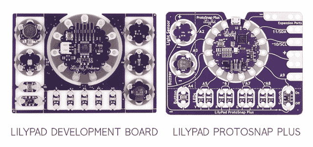

# 使 LilyPad 开发板项目适应 LilyPad ProtoSnap Plus

> 原文：<https://learn.sparkfun.com/tutorials/adapting-lilypad-development-board-projects-to-the-lilypad-protosnap-plus>

## 介绍

[LilyPad ProtoSnap Plus](https://www.sparkfun.com/products/14346) 是对 [LilyPad 开发板](https://www.sparkfun.com/products/retired/11262)成功的更新和重新展望，后者是我们最受欢迎的电子纺织产品之一。在与在他们的程序和教室中使用 LilyPad 开发板的教育工作者进行了多次讨论后，我们的开发团队创建了一个新的板，该板具有新的功能和更新，旨在提高学生和辅导员的易用性。本指南将概述在开发 LilyPad ProtoSnap Plus 期间所做的更改，以及如何改编 LilyPad 开发中的现有代码或课程以用于 ProtoSnap Plus。

## ProtoSnap Plus 中的新功能

**清晰、直观的布局** —将 LilyPad 电路板连接在一起以展示其电气连接的银色走线是 ProtoSnap 系列的一个重要特征。新的 LilyPad ProtoSnap Plus 包括易于遵循的跟踪，供学生在将项目分开之前以及在编程课上用作设计项目的指南。在 LilyPad 开发板中，许多这样的痕迹是隐藏的，或者在课程中很难看到和指出。

**LilyPad USB Plus** —许多用户更喜欢 LilyPad USB 而不是其他格式，并一直要求对开发板进行更新以包含一个。SparkFun 的产品团队创建了 LilyPad USB Plus，增加了一些功能，包括内置的 RGB LED 和 LED 条形图，以及两个额外的电源(+)和接地(-) sew 标签，以便于使用。

*The LilyPad USB Plus*

**更新标签**—lily pad USB Plus 上的每个 sew 标签的中心都有一个符号(~)，表示 PWM 功能或模数转换器(ADC)，以便用户在原型制作期间快速参考。这消除了在教学和构建时查看文档或数据表的需要。这些标签也包括在 LilyPad 纸板的底部。标签延伸到 ProtoSnap 板上硬件旁边的电路板名称，以便在教学或探索时快速识别。

**更多 led 灯** —学习编程时最引人注目的早期活动之一是用 Arduino 创建闪烁的灯光图案。学生们可以只用一个 LED 和他们的想象力来创建非常复杂的程序。LilyPad ProtoSnap Plus 在条形图配置中用四对彩色 LED(黄色、红色、蓝色、绿色)、一个 RGB LED 和六个白色 LED 取代了原始 LilyPad 开发板上提供的五个白色 LED 和三色 LED。将 RGB 和白光 led 构建到 LilyPad USB Plus 微控制器上，释放了 sew 标签以连接其他 LilyPad 板，并消除了额外的缝合连接。

**扩展端口** —为了增加新的 ProtoSnap Plus 的灵活性，增加了四个扩展端口，允许学生探索电路板上未预连线的不同传感器和输出选项，包括 I ² C 板。

有关 LilyPad ProtoSnap Plus 及其功能的完整概述，请查看 [LilyPad ProtoSnap Plus 连接指南](https://learn.sparkfun.com/tutorials/lilypad-protosnap-plus-hookup-guide)。

 [### LilyPad ProtoSnap Plus 连接指南

#### 2017 年 10 月 5 日](https://learn.sparkfun.com/tutorials/lilypad-protosnap-plus-hookup-guide) The LilyPad ProtoSnap Plus is a sewable electronics prototyping board that you can use to learn circuits and programming with Arduino, then break apart to make an interactive fabric or wearable project.[Favorited Favorite](# "Add to favorites") 2

## 纸板对比图

下表列出了每个主板上可用的组件。请注意，在 ProtoSnap Plus 中，一些电路板已被移除。使用选项卡 A9、10 和 11 上的扩展端口，可以很容易地将它们再次连接起来。

| LilyPad 开发板组件 | LilyPad 开发板引脚 | LilyPad ProtoSnap Plus 引脚 | 笔记 |
| LilyPad 共鸣板(+) | three | 不适用的 | ProtoSnap Plus 不包括 vibe 板。 |
| LilyPad 三色 LED | 红色 LED: 9 个
绿色 LED: 11 个
蓝色 LED: 10 个
 | 红色 LED: 12 个
绿色 LED: 13 个
蓝色 LED: 14 个 | ProtoSnap Plus 在主板中心的 LilyPad USB 上用内置的 RGB LED 取代了独立的三色 LED。
 |
| LilyPad 按钮 | A5 号 | A4 号 |  |
| LilyPad 开关 | Two | A9 | 2 是开发板上的隐藏选项卡。 |
| LilyPad 温度传感器 | 一流的 | 不适用的 | ProtoSnap Plus 不包括温度传感器。 |
| LilyPad 光传感器 | A6 | 主动脉第二声 | ProtoSnap Plus 使用了更新的光线传感器。 |
| LilyPad 蜂鸣器(+) | seven | A3 号 | 7 是开发板上的隐藏标签 |
| 5 个 LilyPad 发光二极管(+) | 白色 LED 1: 5
白色 LED 2: 6
白色 LED 3: A2
白色 LED 4: A4
白色 LED 5: A3 | 黄色 LED 对:A5
红色 LED 对:6
绿色 LED 对:A7
蓝色 LED 对:A8 | LilyPad ProtoSnap Plus 用成对的彩色 led 取代了 5 个白色 led。它还包括内置在 LilyPad USB Plus 第 15-20 针上的白色 LED 条形图。 |

## 改编代码并上传到 ProtoSnap Plus

为 LilyPad 开发板编写的代码只需做一些简单的修改，就可以适用于 ProtoSnap Plus。

首先，使用电路板比较表确定这些部件是否预先布线并包含在 LilyPad ProtoSnap Plus 上。只需将开发板代码中分配的引脚号更新到 ProtoSnap Plus 上的协调连接。

To test boards not included on the ProtoSnap Plus, use alligator clips to connect them from one of the three Expansion Ports at the right edge of the board.

 

将**添加到您的[购物车](https://www.sparkfun.com/cart)中！**

 **### [【鳄鱼测试引线】多色(10 支装)](https://www.sparkfun.com/products/12978)

[In stock](https://learn.sparkfun.com/static/bubbles/ "in stock") PRT-12978

鳄鱼夹(或者鳄鱼夹，如果你喜欢的话)可能是你工作台上除了工作之外最有用的东西…

$3.504[Favorited Favorite](# "Add to favorites") 51[Wish List](# "Add to wish list")** **### LilyPad 共鸣板

将 [LilyPad Vibe 板](https://www.sparkfun.com/products/11008)的正极(+)标签连接到其中一个扩展端口，并在您的代码中重新分配 pin 号。如果您希望将 PWM 与 vibe 板一起使用，我们建议使用扩展端口 10。

 

将**添加到您的[购物车](https://www.sparkfun.com/cart)中！**

 **### [LilyPad Vibe 板](https://www.sparkfun.com/products/11008)

[In stock](https://learn.sparkfun.com/static/bubbles/ "in stock") DEV-11008

施加 5V 电压，通过这个小而强大的振动马达进行振动。作为一个物理指示器工作很好，不需要通知…

$8.502[Favorited Favorite](# "Add to favorites") 23[Wish List](# "Add to wish list")** **### LilyPad 三色 LED

位于 ProtoSnap Plus 中心的 LilyPad USB Plus 有一个内置的 RGB LED，可以用来代替 [LilyPad 三色 LED](https://www.sparkfun.com/products/8467) 。请注意，LilyPad 开发板上的三色 LED 是一个**公共阳极**，而 USB Plus 上的 RGB 是一个**公共阴极**，因此您的代码可能需要稍加修改才能实现相同的功能。

 

### [LilyPad 三色 LED](https://www.sparkfun.com/products/retired/8467)

[Retired](https://learn.sparkfun.com/static/bubbles/ "Retired") DEV-08467

眨你需要的任何颜色！使用三色 LED 板作为一个简单的指标，或通过脉冲红色，绿色和蓝色通道，…

2 **Retired**[Favorited Favorite](# "Add to favorites") 7[Wish List](# "Add to wish list")

#### 关于共阳极与共阴极的说明

三色 LED 上的颜色通道都通过一个公共阳极(正极)引脚连接。与其他一些 RGB LEDs 不同，这种配置意味着要点亮 LED，您需要将各个红色、绿色和蓝色 LED 接地，而不是给它们供电。对于简单的电路连接，这意味着您需要将 R、G 或 B sew 标签连接到地(-)并在代码中将其设置为低(对于数字输出)或 0(对于模拟输出)以打开它们。

*The RGB LED on the tri-color LED has 4 connections: red, green, blue channels, and a common anode pin. If you look closely you can see the individual LEDs inside the package.*

#### 外部三色 LED

您也可以将三色 LED 连接到三个扩展端口。只有扩展端口 10 具有 PWM 功能，因此在这种连接方法中，led 只能在其中一个 RGB 通道上减弱。

### LilyPad 温度传感器

将外部 [LilyPad 温度传感器](https://www.sparkfun.com/products/8777)的 S 标签连接到扩展端口 A9，并将代码中与温度传感器相关的 pin 号重新分配给 A9。

 

将**添加到您的[购物车](https://www.sparkfun.com/cart)中！**

 **### [LilyPad 温度传感器](https://www.sparkfun.com/products/8777)

[In stock](https://learn.sparkfun.com/static/bubbles/ "in stock") DEV-08777

MCP9700 是一种小型热敏电阻型温度传感器。LilyPad 是一种可穿戴的电子纺织品技术，由……

$5.50[Favorited Favorite](# "Add to favorites") 21[Wish List](# "Add to wish list")** **### 上传代码

请注意，LilyPad 开发板需要 FTDI 分线板来上传代码，而 LilyPad ProtoSnap Plus 板可以通过 microUSB 连接器进行编程。

在将代码上传到 ProtoSnap Plus 之前，您需要从 board 菜单中选择一个新的电路板。LilyPad 开发板使用 *LilyPad Arduino* ，而 LilyPad ProtoSnap 开发板使用 **LilyPad USB Plus** 。如果你保持选中 LilyPad Arduino，它会在上传时显示一个错误。请参考 [LilyPad ProtoSnap Plus 连接指南](https://learn.sparkfun.com/tutorials/lilypad-protosnap-plus-hookup-guide)，了解如何添加对开发板的支持以及将代码上传到 USB Plus 的完整说明。

**Reminder:** When uploading code, make sure you make the correct board selection in Arduino!

         **LilyPad Development Board:** LilyPad Arduino
         **LilyPad ProtoSnap Plus:** LilyPad USB Plus

## 资源和更进一步

有关 LilyPads 的更多信息，请查看下面的参考资料:

 [### 为您的项目选择 LilyPad Arduino](https://learn.sparkfun.com/tutorials/choosing-a-lilypad-arduino-for-your-project) Not sure which LilyPad Arduino is right for you? We'll discuss the features of each and help you decide.[Favorited Favorite](# "Add to favorites") 13 [### LilyPad 入门](https://learn.sparkfun.com/tutorials/getting-started-with-lilypad) An introduction to the LilyPad ecosystem - a set of sewable electronic pieces designed to help you build soft, sewable, interactive e-textile projects.[Favorited Favorite](# "Add to favorites") 12******