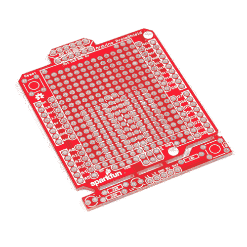
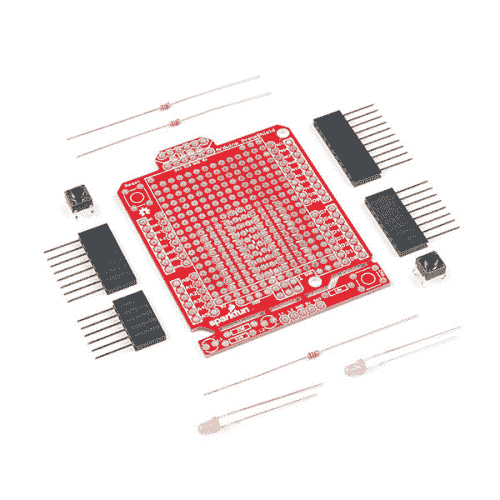

# SparkFun Arduino ProtoShield 连接指南

> 原文：<https://learn.sparkfun.com/tutorials/sparkfun-arduino-protoshield-hookup-guide>

## 介绍

**Heads Up!** This tutorial is for the latest version of the SparkFun Arduino ProtoShield. If you have an older version, please consult the retired [Arduino ProtoShield Quickstart Guide](https://learn.sparkfun.com/tutorials/arduino-protoshield-quickstart-guide)

spark fun Arduino proto shield PCB 和 [ProtoShield 套件](https://www.sparkfun.com/products/13820)让你可以使用你能想到的任何定制电路定制你自己的 Arduino shield！本教程将详细介绍它的功能、硬件装配以及如何使用 shield。

 

将**添加到您的[购物车](https://www.sparkfun.com/cart)中！**

### [spark fun Arduino ProtoShield-Bare PCB](https://www.sparkfun.com/products/13819)

[In stock](https://learn.sparkfun.com/static/bubbles/ "in stock") DEV-13819

SparkFun Arduino ProtoShield 是一个裸露的 PCB，没有附加或包含的零件，让您定制自己的盾牌使用…

$5.502[Favorited Favorite](# "Add to favorites") 13[Wish List](# "Add to wish list")**** 

将**添加到您的[购物车](https://www.sparkfun.com/cart)中！**

### [SparkFun 原盾套装](https://www.sparkfun.com/products/13820)

[19 available](https://learn.sparkfun.com/static/bubbles/ "19 available") DEV-13820

SparkFun ProtoShield 套件让你使用你能想到的任何电路定制你自己的 Arduino 盾牌，然后…

$12.503[Favorited Favorite](# "Add to favorites") 17[Wish List](# "Add to wish list")**** ****### 建议的材料

要跟随本项目教程，您将需要以下材料。根据您拥有的设备，您可能不需要此处列出的所有设备。将它添加到您的购物车，通读指南，并根据需要调整购物车。****