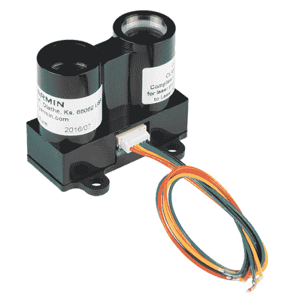
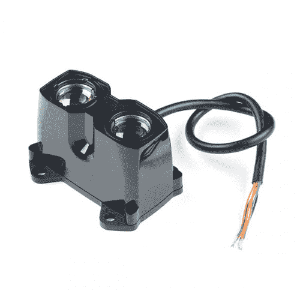

# LIDAR-Lite v3 连接指南

> 原文：<https://learn.sparkfun.com/tutorials/lidar-lite-v3-hookup-guide>

## 介绍

**Note:** While this guide was written primarily for the LIDAR-Lite v3, it can be used for the LIDAR-Lite v3HP.

LIDAR-Lite 系列的 [v3](https://www.sparkfun.com/products/14032) 和 [v3HP](https://www.sparkfun.com/products/14599) 是紧凑型光学距离测量传感器，非常适合无人机和无人驾驶车辆。

 

将**添加到您的[购物车](https://www.sparkfun.com/cart)中！**

 **### [激光雷达一点点 v3](https://www.sparkfun.com/products/14032)

[In stock](https://learn.sparkfun.com/static/bubbles/ "in stock") SEN-14032

这是 LIDAR-Lite v3，一种紧凑型光学距离测量传感器。当空间和重量要求严格时，L…

$129.9928[Favorited Favorite](# "Add to favorites") 87[Wish List](# "Add to wish list")**** 

将**添加到您的[购物车](https://www.sparkfun.com/cart)中！**

 **### [激光雷达一点 v3hpT3](https://www.sparkfun.com/products/14599)

[In stock](https://learn.sparkfun.com/static/bubbles/ "in stock") SEN-14599

激光雷达从来没有这么好看过！LIDAR-Lite v3HP 是*无人机、机器人或无人驾驶车辆的*理想光学测距解决方案

$149.997[Favorited Favorite](# "Add to favorites") 38[Wish List](# "Add to wish list")**** ****激光雷达是“光”和“雷达”两个词的组合或者，如果你愿意，也可以用“光探测和测距”或“激光成像、探测和测距”的反义词激光雷达的核心工作原理是向物体发射激光，然后测量光线返回传感器所需的时间。这样，可以相当精确地测量到物体的距离。

通过扫描或旋转激光雷达装置，系统可以创建详细的距离地图。勘测设备、卫星和飞机可以配备复杂的激光雷达系统来创建地形和建筑物的地形图。幸运的是，Garmin 已经为您的机器人和 DIY 需求创建了一个用户友好的激光雷达单元！

请注意，如果您担心自己的安全，这些使用的是[1 级激光](https://en.wikipedia.org/wiki/Laser_safety#Class_1)(简而言之:1 级激光在所有正常使用条件下都是安全的)。

**CLASS 1 LASER PRODUCT CLASSIFIED EN/IEC 60825-1 2014.** This product is in conformity with performance standards for laser products under 21 CFR 1040, except with respect to those characteristics authorized by Variance Number FDA-2016-V-2943 effective September 27, 2016.

### 建议观看

LIDAR-Lite v3 和 LIDAR-Lite v3HP 有什么区别？我们去问问肖恩·海默吧！

[https://www.youtube.com/embed/rPPDmfRknvE/?autohide=1&border=0&wmode=opaque&enablejsapi=1](https://www.youtube.com/embed/rPPDmfRknvE/?autohide=1&border=0&wmode=opaque&enablejsapi=1)

### 所需材料

要学习本项目教程，您需要以下材料:****