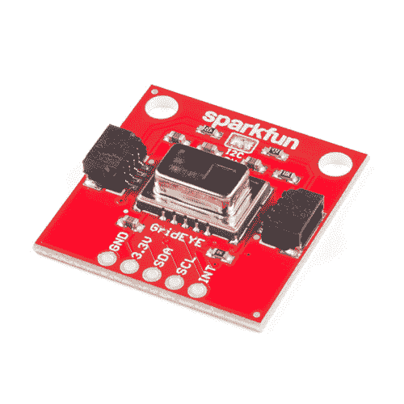
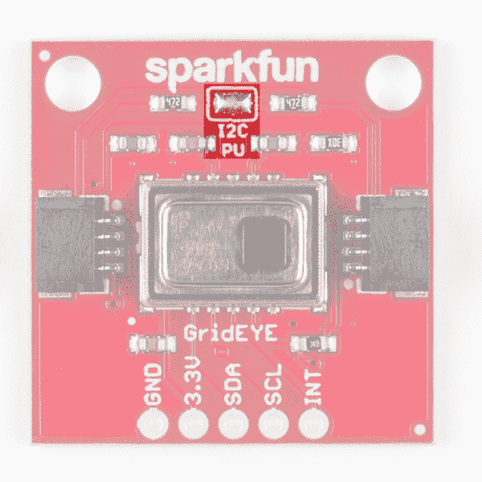
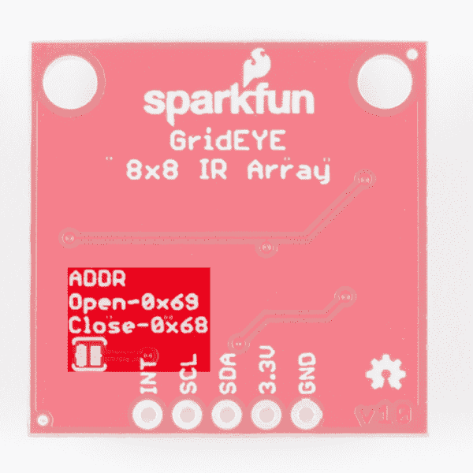
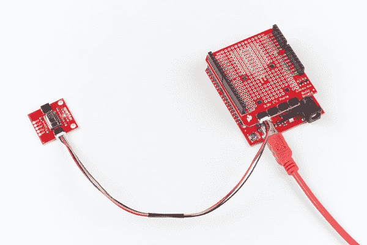
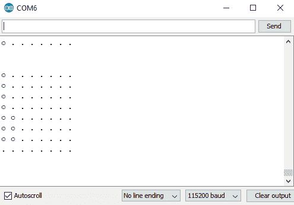
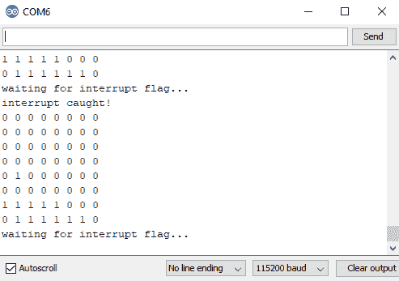
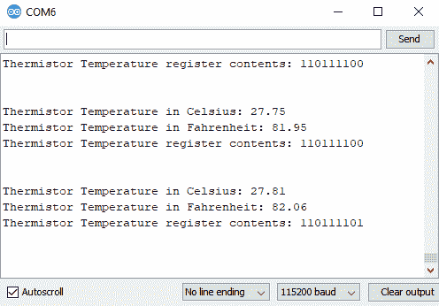
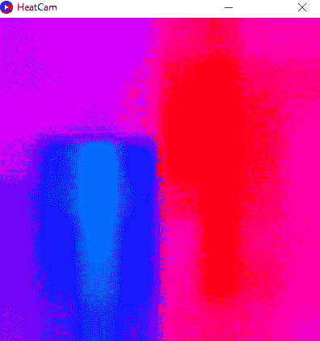
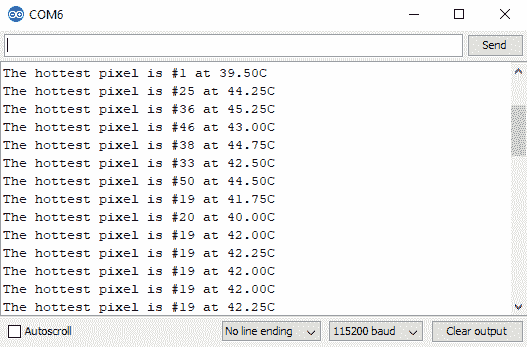
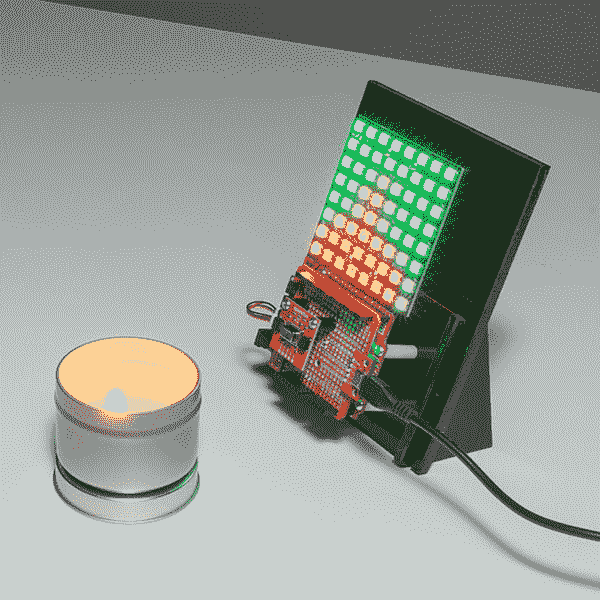

# Qwiic 栅眼红外阵列(AMG88xx)连接指南

> 原文：<https://learn.sparkfun.com/tutorials/qwiic-grid-eye-infrared-array-amg88xx-hookup-guide>

## 介绍

来自松下的[栅眼](https://www.sparkfun.com/products/14607)是一个 8×8 的热电堆阵列。这意味着您有一个 64 像素的方形阵列，每个阵列都能够进行独立的温度检测。这就像拥有热感相机(或[掠夺者的视觉](https://www.youtube.com/watch?v=OW1gGDbO_1U))，只是分辨率非常低。它是 SparkFun 的 [Qwiic 系统](https://www.sparkfun.com/categories/399)的一部分，因此更容易连接以获得你的低分辨率红外图像。

[](https://www.sparkfun.com/products/14607) 

将**添加到您的[购物车](https://www.sparkfun.com/cart)中！**

 **### [【spark fun Grid-EYE 红外阵列突围- AMG8833 (Qwiic)](https://www.sparkfun.com/products/14607)

[In stock](https://learn.sparkfun.com/static/bubbles/ "in stock") SEN-14607

SparkFun Grid-EYE 红外阵列分线板是一个 8×8 热电堆阵列，给你一个 64 像素的正方形，能够

$45.952[Favorited Favorite](# "Add to favorites") 30[Wish List](# "Add to wish list")** **[https://www.youtube.com/embed/s9dFk1rvYBw/?autohide=1&border=0&wmode=opaque&enablejsapi=1](https://www.youtube.com/embed/s9dFk1rvYBw/?autohide=1&border=0&wmode=opaque&enablejsapi=1)

在本连接指南中，我们将把传感器连接到我们选择的微控制器，并在 Arduino 串行监视器中以 0 和 1 的形式读取阵列。我们还将读取中断数组，找出哪些像素检测到高于某个阈值的值。我们将讨论如何使用内置热敏电阻检查芯片本身的温度。一旦我们弄清楚如何在 Arduino IDE 中与 GRID-Eye 接口，我们将从我们的像素阵列中获得一些简洁的视觉效果，并实际上获得一个好看的热感相机。

### 所需材料

首先，您需要一个微控制器来控制项目中的一切。

[](https://www.sparkfun.com/products/13975) 

将**添加到您的[购物车](https://www.sparkfun.com/cart)中！**

 **### [spark fun red board——用 Arduino 编程 T3](https://www.sparkfun.com/products/13975)

[In stock](https://learn.sparkfun.com/static/bubbles/ "in stock") DEV-13975

SparkFun RedBoard 结合了 UNO 的 Optiboot 引导程序的简单性、FTDI 的稳定性和 shield com…

$21.5049[Favorited Favorite](# "Add to favorites") 89[Wish List](# "Add to wish list")****[](https://www.sparkfun.com/products/13907) 

将**添加到您的[购物车](https://www.sparkfun.com/cart)中！**

 **### [SparkFun ESP32 东西](https://www.sparkfun.com/products/13907)

[In stock](https://learn.sparkfun.com/static/bubbles/ "in stock") DEV-13907

SparkFun ESP32 Thing 是 Espressif 的 ESP32 的综合开发平台，ESP32 是他们的超级充电版本…

$23.5069[Favorited Favorite](# "Add to favorites") 83[Wish List](# "Add to wish list")****[](https://www.sparkfun.com/products/13774) 

将**添加到您的[购物车](https://www.sparkfun.com/cart)中！**

 **### [【粒子光子】](https://www.sparkfun.com/products/13774)

[Out of stock](https://learn.sparkfun.com/static/bubbles/ "out of stock") WRL-13774

Particle 的 IoT(物联网)硬件开发板 Photon 提供了构建互联网络所需的一切…

$19.0032[Favorited Favorite](# "Add to favorites") 51[Wish List](# "Add to wish list")****[](https://www.sparkfun.com/products/retired/13825) 

### [树莓派 3](https://www.sparkfun.com/products/retired/13825)

[Retired](https://learn.sparkfun.com/static/bubbles/ "Retired") DEV-13825

每个人都知道并喜欢 Raspberry Pi，但如果您不需要额外的外设来使其无线化会怎么样呢？覆盆子…

92 **Retired**[Favorited Favorite](# "Add to favorites") 97[Wish List](# "Add to wish list")****** ******现在，要让您的微控制器进入 Qwiic 生态系统，关键是以下 Qwiic 屏蔽之一，以符合您对微控制器的偏好:

[](https://www.sparkfun.com/products/14352) 

将**添加到您的[购物车](https://www.sparkfun.com/cart)中！**

 **### [ArduinoT3 的 SparkFun Qwiic 盾](https://www.sparkfun.com/products/14352)

[In stock](https://learn.sparkfun.com/static/bubbles/ "in stock") DEV-14352

SparkFun Qwiic Shield 是一种易于组装的板，它提供了一种简单的方法来将 Qwiic Connect 系统与

$7.508[Favorited Favorite](# "Add to favorites") 39[Wish List](# "Add to wish list")****[](https://www.sparkfun.com/products/14459) 

将**添加到您的[购物车](https://www.sparkfun.com/cart)中！**

 **### [树莓派的 SparkFun Qwiic 帽子](https://www.sparkfun.com/products/14459)

[In stock](https://learn.sparkfun.com/static/bubbles/ "in stock") DEV-14459

树莓派的 SparkFun Qwiic 帽子是进入 Qwiic 生态系统的最快捷、最简单的方式，并且仍然适用于

$6.505[Favorited Favorite](# "Add to favorites") 33[Wish List](# "Add to wish list")****[](https://www.sparkfun.com/products/14477) 

将**添加到您的[购物车](https://www.sparkfun.com/cart)中！**

 **### [光子盾](https://www.sparkfun.com/products/14477)

[28 available](https://learn.sparkfun.com/static/bubbles/ "28 available") DEV-14477

SparkFun Qwiic Shield for Photon 是一个易于组装的板，提供了一种简单的方法来整合 Qwiic 系统…

$6.50[Favorited Favorite](# "Add to favorites") 7[Wish List](# "Add to wish list")****** ******你还需要一根 Qwiic 电缆来连接屏蔽层和栅眼，选择适合你需要的长度。

[](https://www.sparkfun.com/products/14427) 

将**添加到您的[购物车](https://www.sparkfun.com/cart)中！**

 **### [Qwiic 线缆- 100mm](https://www.sparkfun.com/products/14427)

[In stock](https://learn.sparkfun.com/static/bubbles/ "in stock") PRT-14427

这是一条 100 毫米长的 4 芯电缆，带有 1 毫米 JST 端接。它旨在将支持 Qwiic 的组件连接在一起…

$1.50[Favorited Favorite](# "Add to favorites") 32[Wish List](# "Add to wish list")****[](https://www.sparkfun.com/products/14429) 

将**添加到您的[购物车](https://www.sparkfun.com/cart)中！**

 **### [Qwiic 线缆- 500mm](https://www.sparkfun.com/products/14429)

[In stock](https://learn.sparkfun.com/static/bubbles/ "in stock") PRT-14429

这是一根 500mm 长的 4 芯电缆，带有 1mm JST 端接。它旨在将支持 Qwiic 的组件连接在一起…

$1.951[Favorited Favorite](# "Add to favorites") 25[Wish List](# "Add to wish list")****[](https://www.sparkfun.com/products/14426) 

将**添加到您的[购物车](https://www.sparkfun.com/cart)中！**

 **### [Qwiic 线缆- 50mm](https://www.sparkfun.com/products/14426)

[In stock](https://learn.sparkfun.com/static/bubbles/ "in stock") PRT-14426

这是一根 50 毫米长的 4 芯电缆，带有 1 毫米 JST 端接。它旨在将支持 Qwiic 的组件连接在一起…

$0.95[Favorited Favorite](# "Add to favorites") 29[Wish List](# "Add to wish list")****[](https://www.sparkfun.com/products/14428) 

### [Qwiic 线缆- 200mm](https://www.sparkfun.com/products/14428)

[Out of stock](https://learn.sparkfun.com/static/bubbles/ "out of stock") PRT-14428

这是一根 200 毫米长的 4 芯电缆，带有 1 毫米 JST 端接。它旨在将支持 Qwiic 的组件连接在一起…

[Favorited Favorite](# "Add to favorites") 21[Wish List](# "Add to wish list")****** ******### 推荐阅读

如果您不熟悉我们的新 Qwiic 系统，我们建议您阅读此处的[以获得概述](https://www.sparkfun.com/qwiic)。如果你还没有看 Qwiic Shield 的连接指南，我们也建议你看一看。也建议你温习一下 I ² C 的技能，因为所有的 Qwiic 传感器都是 I ² C。由于我们也将在其中一个演示中使用处理功能，我们建议你查看一下将 Arduino 连接到处理功能的教程。

[](https://learn.sparkfun.com/tutorials/connecting-arduino-to-processing) [### 将 Arduino 连接到处理](https://learn.sparkfun.com/tutorials/connecting-arduino-to-processing) Send serial data from Arduino to Processing and back - even at the same time 35[](https://learn.sparkfun.com/tutorials/i2c) [### I2C](https://learn.sparkfun.com/tutorials/i2c) An introduction to I2C, one of the main embedded communications protocols in use today.[Favorited Favorite](# "Add to favorites") 128[](https://learn.sparkfun.com/tutorials/qwiic-shield-for-arduino--photon-hookup-guide) [### Arduino 和光子连接指南的 Qwiic 屏蔽](https://learn.sparkfun.com/tutorials/qwiic-shield-for-arduino--photon-hookup-guide) Get started with our Qwiic ecosystem with the Qwiic shield for Arduino or Photon.[Favorited Favorite](# "Add to favorites") 5

## 硬件概述

让我们来看看 Qwiic Grid-EYE 的一些特征，这样我们就能对它的行为有更多的了解。

| **特性** | **范围** |
| 工作电压(启动) | 1.6V - 3.6V |
| 工作电压(计时) | 1.5V - 3.6V |
| 工作温度 | -40 摄氏度- 85 摄氏度 |
| 时间准确度 | &plusmn2.0 ppm |
| 温度精度 | &plusmn2.5&degC |
| 电流消耗 | 4.5 毫安 |
| I ² C 地址 | **0x69(开路跳线，默认)**或 0x68(闭路跳线) |

### 腿

网格眼上可用引脚的特征如下表所示。

| Pin Label | 引脚功能 | 输入/输出 | 笔记 |
| 3.3V | 电源 | 投入 | 应该在 **1.95 - 3.6V** 之间 |
| 国家药品监督管理局 | I ² C 数据信号 | 双向的 | 双向数据线。电压不应超过电源电压(例如 3.3V)。 |
| SCL | I ² C 时钟信号 | 投入 | 主控时钟信号。电压不应超过电源电压(例如 3.3V)。 |
| （同 Internationalorganizations）国际组织 | 中断 | 输出 | 中断引脚，数字输出。 |
| GND | 地面 | 投入 | 0V/公共电压。 |

### 可选功能

#### 上拉电阻

Qwiic 栅眼具有板载 I ² C 上拉电阻；如果多个传感器连接到总线并使能上拉电阻，并联等效电阻将产生过强的上拉电阻，使总线无法正常工作。一般来说，如果总线上连接了多个器件，则除一对上拉电阻外，应禁用所有上拉电阻。如果需要断开上拉电阻，可以通过移除下面突出显示的相应跳线上的焊料来移除。

[](https://cdn.sparkfun.com/assets/learn_tutorials/7/4/6/I2CPU.png)

#### I ² C 地址

电路板背面有一个额外的跳线，如果您在同一 I ² C 总线上有多个栅眼相机，它允许 I ² C 从默认的 **0x69** 更改为 0x68。正常情况下，跳线将 I ² C 地址设置为 0x69。用焊料封闭跳线将得到 0x68 的 I ² C 地址。然而，如果你有 2 个以上的栅眼，你将需要 [Qwiic Mux](https://www.sparkfun.com/products/14293) 把它们都放在同一个 I ² C 总线上。跳线在下面突出显示。

[](https://cdn.sparkfun.com/assets/learn_tutorials/7/4/6/ADDR.png)

## 硬件装配

如果你还没有组装好你的 Qwiic 盾，现在是时候去上那个教程了。随着盾牌的组装，Sparkfun 的新 Qwiic 环境意味着连接传感器不可能更容易。只需将 Qwiic 电缆的一端插入 GRID-Eye breakout，另一端插入您选择的 Qwiic Shield，您就可以上传草图，并计算出您离那边的那个东西有多远。它看起来太容易使用了，但这就是为什么我们要这样做！

[](https://cdn.sparkfun.com/assets/learn_tutorials/7/4/6/Qwiic_GridEYE-03.jpg)

## Arduino 示例代码

**注意:**此示例假设您在桌面上使用的是最新版本的 Arduino IDE。如果这是你第一次使用 Arduino，请回顾我们关于[安装 Arduino IDE 的教程。](https://learn.sparkfun.com/tutorials/installing-arduino-ide)如果您之前没有安装 Arduino 库，请查看我们的[安装指南。](https://learn.sparkfun.com/tutorials/installing-an-arduino-library)

SparkFun 编写了一个库来控制 Qwiic GRID-Eye。您可以通过 Arduino 库管理器获得这些库。搜索 **SparkFun GridEYE AMG88 库**应该可以安装最新版本。如果你喜欢手动下载这些库，你可以从 [GitHub 库](https://github.com/sparkfun/SparkFun_GridEYE_Arduino_Library/)中获取它们:

[Download the SparkFun GRID-Eye Library (ZIP)](https://github.com/sparkfun/SparkFun_GridEYE_Arduino_Library/archive/master.zip)

### 示例 1 -串行可视化工具

一旦你安装了 Grid-EYE 库，重启 Arduino。然后进入**文件** > **示例**>**spark fun GridEYE AMG 88 库**>**example 1-serial visualizer**打开示例草图。

一旦你设置好你的板和串口，上传草图到你的 Arduino。然后**打开[串行监视器](https://learn.sparkfun.com/tutorials/terminal-basics/arduino-serial-monitor-windows-mac-linux)和**。您将开始看到一个介于 0 和 3 之间的 8×8 数组。Arduino 将介于`HOT`和`COLD`之间的温度值映射为介于 0 和 3 之间的值，然后这些值用代表 0 的`.`、`o`代表 1、`0`代表 2 和`O`代表 3。试着在摄像机前移动，看看是否有数值发生变化。调整`HOT`和`COLD`的值，查看从 0 到 3 的不同温度范围。注意我们如何使用函数`grideye.getPixelTemperature(i)`来获得像素`i`的温度，其中`i`在 0 到 64 之间。将这些温度映射到网格后，输出应该类似于下图。

[](https://cdn.sparkfun.com/assets/learn_tutorials/7/4/6/EX1.PNG)

### 示例 2 -使用中断

要调出下一个示例，请转到**文件** > **示例**>**spark fun GridEYE AMG 88 库** > **示例 2-使用中断**打开示例草图。

一旦你把这个例子加载到你的微控制器上，继续检查`void setup()`循环。我们用下面的代码设置如何触发中断。

```
language:c
grideye.setInterruptModeAbsolute();
grideye.setUpperInterruptValue(UPPER_LIMIT);
grideye.setLowerInterruptValue(LOWER_LIMIT);
grideye.setInterruptHysteresis(HYSTERESIS); 
```

其中`UPPER_LIMIT`、`LOWER_LIMIT`、`HYSTERESIS`如上所述。打开串行监视器将显示一个表，其中列出了已经触发的中断(如果有)。摆弄`UPPER_LIMIT`、`LOWER_LIMIT`和`HYSTERESIS`的值，观察它们对触发中断的影响。中断表看起来应该和下图相似，很明显，根据网格眼所看到的内容，会有不同的中断触发。

[](https://cdn.sparkfun.com/assets/learn_tutorials/7/4/6/EX2.PNG)

### 示例 3 -设备温度

要调出下一个示例，请转到**文件** > **示例**>**spark fun GridEYE AMG 88 库** > **示例 3-DeviceTemperature** 打开示例草图。这个例子相对简单，仅仅检查设备的温度。要获得设备温度，我们可以使用 3 个函数，`getDeviceTemperature()`，它返回我们的摄氏温度，`getDeviceTemperatureFahrenheit()`，它返回我们的华氏温度，`getDeviceTemperatureRaw()`返回热敏电阻寄存器的原始二进制内容。打开串行监视器应该会产生类似下图的图像。

[](https://cdn.sparkfun.com/assets/learn_tutorials/7/4/6/EX3.PNG)

### 示例 4 -加工热凸轮

**注:** Processing 是一种软件，除了其他功能之外，它还可以实现数据的可视化表示。如果你以前从未处理过加工，我们建议你也看看 [Arduino to Processing 教程](https://learn.sparkfun.com/tutorials/connecting-arduino-to-processing)。请按下面的按钮继续下载并安装处理程序。

[Download Processing IDE](https://processing.org/download/)

下一个例子涉及到处理 IDE。处理监听串行数据，所以我们需要让 Arduino 产生对处理有意义的串行数据。要调出下一个示例，请转到**文件** > **示例**>**spark fun GridEYE AMG 88 库** > **示例 4-ProcessingHeatCam** 打开示例草图。这个草图简单地打印了一个逗号分隔的温度列表，用于处理监听。

一旦这个草图被上传，我们需要告诉 Processing 如何将这个数据转化为可视化。执行此操作的处理草图位于与示例 4 相同的文件夹中。于是转到**文档**>**Arduino**>**spark fun _ grid eye _ AMG 88 _ Library**>**示例** > **示例 4-Processing HeatCam**>**HeatCam**并打开 **HeatCam** 文件进行处理。尝试运行草图将在调试窗口中显示可用的串行端口。

[](https://cdn.sparkfun.com/assets/learn_tutorials/7/4/6/EX4-DEBUG.PNG)

确定你的 Arduino 在哪个串行端口上，例如，我的 RedBoard 在 COM6 上，这对应于上图中的`[1]`，所以我需要在下面一行将 0 改为 1，以确保处理在正确的位置监听。

```
language:c
myPort = new Serial(this, Serial.list()[0], 115200); 
```

一旦我这样做了，我们应该能够运行处理草图，它会给我们一个很好的网格眼像素可视化。将你的脸或手移到传感器前面，看看它在屏幕上是什么样子。输出应该看起来类似下图，这是网格眼指向一杯冰水和一盏熔岩灯的输出。

[](https://cdn.sparkfun.com/assets/learn_tutorials/7/4/6/EX4-HEATCAM.PNG)

### 示例 5 -热像素

要调出下一个示例，请转到**文件** > **示例**>**spark fun GridEYE AMG 88 库** > **示例 5-HotPixel** 打开示例草图。该示例遍历每个像素，找到最热的像素，然后输出该像素的位置和温度。这是通过比较当前`hotPixelValue`温度和当前像素的温度来实现的。如果当前像素更热，其值存储在`hotPixelValue`中。该草图的输出应该类似于下图。

[](https://cdn.sparkfun.com/assets/learn_tutorials/7/4/6/EX5.PNG)

## 资源和更进一步

感谢阅读！既然你已经成功地启动并运行了你的 Grid-EYE，是时候把它整合到你自己的项目中了！我们很期待看到你用网格眼做的东西。如果您需要更多与 Grid-EYE 相关的文档，请查看以下资源:

*   [示意图(PDF)](https://cdn.sparkfun.com/assets/4/4/3/5/d/SparkFun_Grid-EYE_Infrared_Array_Breakout.pdf) -网格眼分线板的 PDF 示意图。
*   [Eagle 文件(ZIP)](https://cdn.sparkfun.com/assets/8/0/f/e/f/SparkFun_Grid-EYE_Infrared_Array_Breakout_1.zip) -网格眼分线的 PCB 设计文件。
*   [数据表(PDF)](https://cdn.sparkfun.com/assets/4/1/c/0/1/Grid-EYE_Datasheet.pdf) -关于 Grid-EYE 电气特性、寄存器、通信规范等的大量信息。
*   [Qwiic 登陆页面](https://www.sparkfun.com/qwiic)
*   吉卜赛人休息
    *   [产品报告](https://github.com/sparkfun/Qwiic_GRIDEye) -所有与网格眼相关的设计文件和示例代码。
    *   [库回购](https://github.com/sparkfun/SparkFun_GridEYE_Arduino_Library) - Arduino 库
*   [SFE 产品展示区](https://youtu.be/s9dFk1rvYBw)
    *   [GridEye LED 阵列演示](https://gist.github.com/ShawnHymel/9efcdfd76635fe2b4d85ca01f88022af)

你的下一个项目需要一些灵感吗？查看一些相关教程:

[](https://learn.sparkfun.com/tutorials/flir-lepton-hookup-guide) [### FLIR 轻子连接指南](https://learn.sparkfun.com/tutorials/flir-lepton-hookup-guide) See the invisible world of infrared radiation using the FLIR Dev Kit and Raspberry Pi.[Favorited Favorite](# "Add to favorites") 8[](https://learn.sparkfun.com/tutorials/mlx90614-ir-thermometer-hookup-guide) [### MLX90614 红外温度计连接指南](https://learn.sparkfun.com/tutorials/mlx90614-ir-thermometer-hookup-guide) How to use the MLX90614 or our SparkFun IR Thermometer Evaluation Board to take temperatures remotely, over short distances.[Favorited Favorite](# "Add to favorites") 9

或者用可寻址的 WS2812 LEDs 反射热信号:

[](https://cdn.sparkfun.com/assets/learn_tutorials/7/4/6/14607-_SparkFun_GridEYE_Infrared_Array_-_AMG8833__Qwiic_Addressable_LED.jpg)*Example code for the demo can be found in [GitHub Gist - GridEye LED Array Demo](https://gist.github.com/ShawnHymel/9efcdfd76635fe2b4d85ca01f88022af)*

或者看看这篇博文，了解更多的想法！

[](https://www.sparkfun.com/news/3244 "February 13, 2020: Using Sapien LLC's Arduino Shield and Electrode array we can expand our human senses. ") [### Enginursday:克苏鲁盾的全新感官体验

February 13, 2020](https://www.sparkfun.com/news/3244 "February 13, 2020: Using Sapien LLC's Arduino Shield and Electrode array we can expand our human senses. ")[Favorited Favorite](# "Add to favorites") 6********************