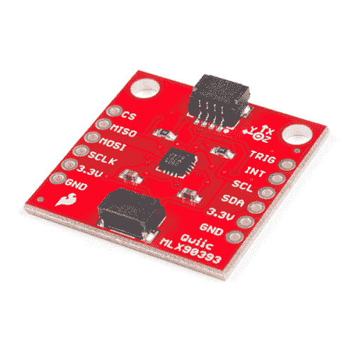

# Qwiic 磁力计(MLX90393)连接指南

> 原文：<https://learn.sparkfun.com/tutorials/qwiic-magnetometer-mlx90393-hookup-guide>

## 介绍

[MLX90393](https://www.sparkfun.com/products/14571) 是一种三轴磁传感器，能够感测非常小的磁场，同时在较大磁场饱和期间表现出人们想要和期望的行为(就像附近的磁体)。事实证明，最受欢迎的 HMC5883L 和其他用于指南针应用的此类传感器的动态范围较低，但在大磁场中也有奇怪和不确定的行为。Ted Yapo 在 [Hackaday](https://hackaday.io/project/11865/logs) 上对传感器做了令人难以置信的广泛描述。他发表了测试一些传感器的控制实验，发现 MLX90393 更优越。

MLX90393 可以用作指南针传感器，也可以用作非接触式控制器(操纵杆)、流量计(带磁性叶轮)或线性执行器位置传感器。分线板也是 SparkFun 的 [Qwiic 系统](https://www.sparkfun.com/categories/399)的一部分，所以你不必做任何焊接来弄清楚磁场是什么样子的。

 

将**添加到您的[购物车](https://www.sparkfun.com/cart)中！**

 **### [【spark fun 三轴磁力仪突破- MLX90393 (Qwiic)](https://www.sparkfun.com/products/14571)

[Out of stock](https://learn.sparkfun.com/static/bubbles/ "out of stock") SEN-14571

SparkFun MLX90393 磁力计突破是一个 3 轴磁传感器，即使在饱和状态下也能感应非常小的磁场

$17.50[Favorited Favorite](# "Add to favorites") 7[Wish List](# "Add to wish list")** **[https://www.youtube.com/embed/Z3LpSdmwgFU/?autohide=1&border=0&wmode=opaque&enablejsapi=1](https://www.youtube.com/embed/Z3LpSdmwgFU/?autohide=1&border=0&wmode=opaque&enablejsapi=1)

在本连接指南中，我们将从获取传感器的一些基本读数开始，然后看看如何在不同的 I ² C 地址上配置传感器。

### 所需材料

首先，您需要一个微控制器来控制项目中的一切。

 

将**添加到您的[购物车](https://www.sparkfun.com/cart)中！**

 **### [spark fun red board——用 Arduino 编程 T3](https://www.sparkfun.com/products/13975)

[In stock](https://learn.sparkfun.com/static/bubbles/ "in stock") DEV-13975

SparkFun RedBoard 结合了 UNO 的 Optiboot 引导程序的简单性、FTDI 的稳定性和 shield com…

$21.5049[Favorited Favorite](# "Add to favorites") 89[Wish List](# "Add to wish list")**** 

将**添加到您的[购物车](https://www.sparkfun.com/cart)中！**

 **### [SparkFun ESP32 东西](https://www.sparkfun.com/products/13907)

[In stock](https://learn.sparkfun.com/static/bubbles/ "in stock") DEV-13907

SparkFun ESP32 Thing 是 Espressif 的 ESP32 的综合开发平台，ESP32 是他们的超级充电版本…

$23.5069[Favorited Favorite](# "Add to favorites") 83[Wish List](# "Add to wish list")**** 

将**添加到您的[购物车](https://www.sparkfun.com/cart)中！**

 **### [【粒子光子】](https://www.sparkfun.com/products/13774)

[Out of stock](https://learn.sparkfun.com/static/bubbles/ "out of stock") WRL-13774

Particle 的 IoT(物联网)硬件开发板 Photon 提供了构建互联网络所需的一切…

$19.0032[Favorited Favorite](# "Add to favorites") 51[Wish List](# "Add to wish list")**** 

### [树莓派 3](https://www.sparkfun.com/products/retired/13825)

[Retired](https://learn.sparkfun.com/static/bubbles/ "Retired") DEV-13825

每个人都知道并喜欢 Raspberry Pi，但如果您不需要额外的外设来使其无线化会怎么样呢？覆盆子…

92 **Retired**[Favorited Favorite](# "Add to favorites") 97[Wish List](# "Add to wish list")****** ******现在，要让您的微控制器进入 Qwiic 生态系统，关键是以下 Qwiic 屏蔽之一，以符合您对微控制器的偏好:

 

将**添加到您的[购物车](https://www.sparkfun.com/cart)中！**

 **### [ArduinoT3 的 SparkFun Qwiic 盾](https://www.sparkfun.com/products/14352)

[In stock](https://learn.sparkfun.com/static/bubbles/ "in stock") DEV-14352

SparkFun Qwiic Shield 是一种易于组装的板，它提供了一种简单的方法来将 Qwiic Connect 系统与

$7.508[Favorited Favorite](# "Add to favorites") 39[Wish List](# "Add to wish list")**** 

将**添加到您的[购物车](https://www.sparkfun.com/cart)中！**

 **### [树莓派的 SparkFun Qwiic 帽子](https://www.sparkfun.com/products/14459)

[In stock](https://learn.sparkfun.com/static/bubbles/ "in stock") DEV-14459

树莓派的 SparkFun Qwiic 帽子是进入 Qwiic 生态系统的最快捷、最简单的方式，并且仍然适用于

$6.505[Favorited Favorite](# "Add to favorites") 33[Wish List](# "Add to wish list")**** 

将**添加到您的[购物车](https://www.sparkfun.com/cart)中！**

 **### [光子盾](https://www.sparkfun.com/products/14477)

[28 available](https://learn.sparkfun.com/static/bubbles/ "28 available") DEV-14477

SparkFun Qwiic Shield for Photon 是一个易于组装的板，提供了一种简单的方法来整合 Qwiic 系统…

$6.50[Favorited Favorite](# "Add to favorites") 7[Wish List](# "Add to wish list")****** ******你还需要一根 Qwiic 电缆来连接屏蔽层和磁力计，选择适合你需要的长度。

 

将**添加到您的[购物车](https://www.sparkfun.com/cart)中！**

 **### [Qwiic 线缆- 100mm](https://www.sparkfun.com/products/14427)

[In stock](https://learn.sparkfun.com/static/bubbles/ "in stock") PRT-14427

这是一条 100 毫米长的 4 芯电缆，带有 1 毫米 JST 端接。它旨在将支持 Qwiic 的组件连接在一起…

$1.50[Favorited Favorite](# "Add to favorites") 32[Wish List](# "Add to wish list")**** 

将**添加到您的[购物车](https://www.sparkfun.com/cart)中！**

 **### [Qwiic 线缆- 500mm](https://www.sparkfun.com/products/14429)

[In stock](https://learn.sparkfun.com/static/bubbles/ "in stock") PRT-14429

这是一根 500mm 长的 4 芯电缆，带有 1mm JST 端接。它旨在将支持 Qwiic 的组件连接在一起…

$1.951[Favorited Favorite](# "Add to favorites") 25[Wish List](# "Add to wish list")**** 

将**添加到您的[购物车](https://www.sparkfun.com/cart)中！**

 **### [Qwiic 线缆- 50mm](https://www.sparkfun.com/products/14426)

[In stock](https://learn.sparkfun.com/static/bubbles/ "in stock") PRT-14426

这是一根 50 毫米长的 4 芯电缆，带有 1 毫米 JST 端接。它旨在将支持 Qwiic 的组件连接在一起…

$0.95[Favorited Favorite](# "Add to favorites") 29[Wish List](# "Add to wish list")**** 

### [Qwiic 线缆- 200mm](https://www.sparkfun.com/products/14428)

[Out of stock](https://learn.sparkfun.com/static/bubbles/ "out of stock") PRT-14428

这是一根 200 毫米长的 4 芯电缆，带有 1 毫米 JST 端接。它旨在将支持 Qwiic 的组件连接在一起…

[Favorited Favorite](# "Add to favorites") 21[Wish List](# "Add to wish list")****** ******或者，这里有一个愿望清单，完全按照这个指南:********************