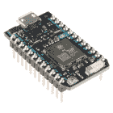

# Qwiic VR IMU (BNO080)连接指南

> 原文：<https://learn.sparkfun.com/tutorials/qwiic-vr-imu-bno080-hookup-guide>

## 介绍

博世的 [BNO080](https://www.sparkfun.com/products/14686) 是一款组合式三轴加速度计/陀螺仪/磁力计，与运行强大算法的 ARM Cortex M0+封装在一起。BNO080 惯性测量单元(IMU)可产生精确的旋转矢量航向，非常适合 VR 和其他航向应用，静态旋转误差不超过 2 度。这就是我们一直在等待的:所有的传感器数据被合并和漂移校正成有意义的，准确的 IMU 信息。它非常适合任何需要感知方向或运动的项目。我们把这个 IMU 放在一个 [Qwiic 使能的](https://www.sparkfun.com/categories/399)分线板上，以使与微小的 QFN 封装的接口更容易连接。

[](https://www.sparkfun.com/products/14686) 

### [【spark fun VR IMU 突围- BNO080 (Qwiic)](https://www.sparkfun.com/products/14686)

[Out of stock](https://learn.sparkfun.com/static/bubbles/ "out of stock") SEN-14686

SparkFun VR IMU 突破是一个尖端的三轴加速度计/陀螺仪/磁力计都在一个单一的封装，你可以…

5[Favorited Favorite](# "Add to favorites") 14[Wish List](# "Add to wish list")

在本连接指南中，我们将传感器连接到我们选择的微控制器，并分别读取旋转矢量(这是我们主要想要的)、加速度矢量、陀螺仪值和磁力计矢量。我们将了解如何在 BNO080 上实现计步器，以便将其用作计步器。我们还将从传感器中读取 Q 值和各种其他元数据。了解您正在进行的活动非常重要，因此我们将学习如何对 IMU 正在进行的活动进行分类(例如，坐着不动、移动、骑自行车、行走、跑步等...)以及 IMU 对正在执行的每项活动的信心程度。这些示例还将展示如何校准我们的硬件，以尽可能获得最准确的读数。出于调试目的，还将检查打印出的原始数据包。最后，我们将研究如何在不同的 I ² C 端口和地址上配置传感器。在处理中提供了一个额外的示例，向我们展示如何使用四元数数据来定向立方体。

### 所需材料

首先，你需要一个微控制器来控制一切。

[](https://www.sparkfun.com/products/13975) 

将**添加到您的[购物车](https://www.sparkfun.com/cart)中！**

 **### [spark fun red board——用 Arduino 编程 T3](https://www.sparkfun.com/products/13975)

[In stock](https://learn.sparkfun.com/static/bubbles/ "in stock") DEV-13975

SparkFun RedBoard 结合了 UNO 的 Optiboot 引导程序的简单性、FTDI 的稳定性和 shield com…

$21.5049[Favorited Favorite](# "Add to favorites") 89[Wish List](# "Add to wish list")****[](https://www.sparkfun.com/products/13907) 

将**添加到您的[购物车](https://www.sparkfun.com/cart)中！**

 **### [SparkFun ESP32 东西](https://www.sparkfun.com/products/13907)

[In stock](https://learn.sparkfun.com/static/bubbles/ "in stock") DEV-13907

SparkFun ESP32 Thing 是 Espressif 的 ESP32 的综合开发平台，ESP32 是他们的超级充电版本…

$23.5069[Favorited Favorite](# "Add to favorites") 83[Wish List](# "Add to wish list")****[](https://www.sparkfun.com/products/13774) 

将**添加到您的[购物车](https://www.sparkfun.com/cart)中！**

 **### [【粒子光子】](https://www.sparkfun.com/products/13774)

[Out of stock](https://learn.sparkfun.com/static/bubbles/ "out of stock") WRL-13774

Particle 的 IoT(物联网)硬件开发板 Photon 提供了构建互联网络所需的一切…

$19.0032[Favorited Favorite](# "Add to favorites") 51[Wish List](# "Add to wish list")****[](https://www.sparkfun.com/products/retired/13825) 

### [树莓派 3](https://www.sparkfun.com/products/retired/13825)

[Retired](https://learn.sparkfun.com/static/bubbles/ "Retired") DEV-13825

每个人都知道并喜欢 Raspberry Pi，但如果您不需要额外的外设来使其无线化会怎么样呢？覆盆子…

92 **Retired**[Favorited Favorite](# "Add to favorites") 97[Wish List](# "Add to wish list")****** ******现在，要进入 Qwiic 生态系统，关键是以下 Qwiic 屏蔽之一，以符合您对微控制器的偏好:

[](https://www.sparkfun.com/products/14352) 

将**添加到您的[购物车](https://www.sparkfun.com/cart)中！**

 **### [ArduinoT3 的 SparkFun Qwiic 盾](https://www.sparkfun.com/products/14352)

[In stock](https://learn.sparkfun.com/static/bubbles/ "in stock") DEV-14352

SparkFun Qwiic Shield 是一种易于组装的板，它提供了一种简单的方法来将 Qwiic Connect 系统与

$7.508[Favorited Favorite](# "Add to favorites") 39[Wish List](# "Add to wish list")****[](https://www.sparkfun.com/products/14459) 

将**添加到您的[购物车](https://www.sparkfun.com/cart)中！**

 **### [树莓派的 SparkFun Qwiic 帽子](https://www.sparkfun.com/products/14459)

[In stock](https://learn.sparkfun.com/static/bubbles/ "in stock") DEV-14459

树莓派的 SparkFun Qwiic 帽子是进入 Qwiic 生态系统的最快捷、最简单的方式，并且仍然适用于

$6.505[Favorited Favorite](# "Add to favorites") 33[Wish List](# "Add to wish list")****[](https://www.sparkfun.com/products/14477) 

将**添加到您的[购物车](https://www.sparkfun.com/cart)中！**

 **### [光子盾](https://www.sparkfun.com/products/14477)

[28 available](https://learn.sparkfun.com/static/bubbles/ "28 available") DEV-14477

SparkFun Qwiic Shield for Photon 是一个易于组装的板，提供了一种简单的方法来整合 Qwiic 系统…

$6.50[Favorited Favorite](# "Add to favorites") 7[Wish List](# "Add to wish list")****** ******你还需要一根 Qwiic 电缆来连接屏蔽层和加速度计，选择适合你需要的长度。

[](https://www.sparkfun.com/products/14427) 

将**添加到您的[购物车](https://www.sparkfun.com/cart)中！**

 **### [Qwiic 线缆- 100mm](https://www.sparkfun.com/products/14427)

[In stock](https://learn.sparkfun.com/static/bubbles/ "in stock") PRT-14427

这是一条 100 毫米长的 4 芯电缆，带有 1 毫米 JST 端接。它旨在将支持 Qwiic 的组件连接在一起…

$1.50[Favorited Favorite](# "Add to favorites") 32[Wish List](# "Add to wish list")****[](https://www.sparkfun.com/products/14429) 

将**添加到您的[购物车](https://www.sparkfun.com/cart)中！**

 **### [Qwiic 线缆- 500mm](https://www.sparkfun.com/products/14429)

[In stock](https://learn.sparkfun.com/static/bubbles/ "in stock") PRT-14429

这是一根 500mm 长的 4 芯电缆，带有 1mm JST 端接。它旨在将支持 Qwiic 的组件连接在一起…

$1.951[Favorited Favorite](# "Add to favorites") 25[Wish List](# "Add to wish list")****[](https://www.sparkfun.com/products/14426) 

将**添加到您的[购物车](https://www.sparkfun.com/cart)中！**

 **### [Qwiic 线缆- 50mm](https://www.sparkfun.com/products/14426)

[In stock](https://learn.sparkfun.com/static/bubbles/ "in stock") PRT-14426

这是一根 50 毫米长的 4 芯电缆，带有 1 毫米 JST 端接。它旨在将支持 Qwiic 的组件连接在一起…

$0.95[Favorited Favorite](# "Add to favorites") 29[Wish List](# "Add to wish list")****[](https://www.sparkfun.com/products/14428) 

### [Qwiic 线缆- 200mm](https://www.sparkfun.com/products/14428)

[Out of stock](https://learn.sparkfun.com/static/bubbles/ "out of stock") PRT-14428

这是一根 200 毫米长的 4 芯电缆，带有 1 毫米 JST 端接。它旨在将支持 Qwiic 的组件连接在一起…

[Favorited Favorite](# "Add to favorites") 21[Wish List](# "Add to wish list")****** ******### 推荐阅读

如果你不熟悉 Qwiic 系统，我们推荐你在这里阅读[以获得一个概述](https://www.sparkfun.com/qwiic)。

| [](https://www.sparkfun.com/qwiic) |
| *[Qwiic 连接系统](https://www.sparkfun.com/qwiic)* |

如果你不熟悉下面的教程，我们也建议你看一看。我们在本教程中也深入研究了处理，如果你不熟悉，可以看看下面的处理教程。

[](https://learn.sparkfun.com/tutorials/serial-communication) [### 串行通信](https://learn.sparkfun.com/tutorials/serial-communication) Asynchronous serial communication concepts: packets, signal levels, baud rates, UARTs and more 100[](https://learn.sparkfun.com/tutorials/gyroscope) [### 陀螺仪](https://learn.sparkfun.com/tutorials/gyroscope) Gyroscopes measure the speed of rotation around an axis and are an essential part in determines ones orientation in space.[Favorited Favorite](# "Add to favorites") 22[](https://learn.sparkfun.com/tutorials/accelerometer-basics) [### 加速度计基础知识](https://learn.sparkfun.com/tutorials/accelerometer-basics) A quick introduction to accelerometers, how they work, and why they're used.[Favorited Favorite](# "Add to favorites") 29[](https://learn.sparkfun.com/tutorials/connecting-arduino-to-processing) [### 将 Arduino 连接到处理](https://learn.sparkfun.com/tutorials/connecting-arduino-to-processing) Send serial data from Arduino to Processing and back - even at the same time 35[](https://learn.sparkfun.com/tutorials/i2c) [### I2C](https://learn.sparkfun.com/tutorials/i2c) An introduction to I2C, one of the main embedded communications protocols in use today.[Favorited Favorite](# "Add to favorites") 128[](https://learn.sparkfun.com/tutorials/qwiic-shield-for-arduino--photon-hookup-guide) [### Arduino 和光子连接指南的 Qwiic 屏蔽](https://learn.sparkfun.com/tutorials/qwiic-shield-for-arduino--photon-hookup-guide) Get started with our Qwiic ecosystem with the Qwiic shield for Arduino or Photon.[Favorited Favorite](# "Add to favorites") 5

## 硬件概述

让我们看一下 BNO080 传感器的一些特征，以便对它的行为有更多的了解。

| **特性** | **范围** |
| 工作电压 | 1.65 伏至 3.6 伏 |
| 线性加速度精度 | & plus Mn . 35 米/秒 ² |
| 陀螺仪精度 | & plus Mn . 35 米/秒 ² |
| I ² C 地址 | **0x4B (S0 拉高)**或 0x4A (S0 接地) |

### 腿

BNO080 上有多行引脚，第一行用于默认 I ² C 接口(可配置高达 400 kHz ),如下表所述。

| Pin Label | 引脚功能 | 输入/输出 | 笔记 |
| PS0 | 协议选择 | 投入 | 通信接口的配置(默认值:0，I ² C) |
| PS1 | 协议选择 | 投入 | 通信接口的配置(默认值:0，I ² C) |
| GND | 地面 | 投入 | 0V/公共电压。 |
| 3V3 | 电源 | 投入 | 应该在 **1.65 - 3.6V** 之间 |
| 国家药品监督管理局 | I ² C 数据信号 | 双向的 | 双向数据线。电压不应超过电源电压(例如 3.3V)。 |
| SCL | I ² C 时钟信号 | 投入 | 时钟信号。电压不应超过电源电压(例如 3.3V)。 |
| RST | 复位信号 | 投入 | 复位信号，低电平有效，拉低以复位 IC |
| INT | 中断 | 输出 | 当 BNO080 准备好通信时，低电平有效中断拉低。 |

板上还有一个[串行外设接口(SPI)](https://learn.sparkfun.com/tutorials/serial-peripheral-interface-spi) ，可以运行最高 3MHz 的数据。该接口的引脚概述如下。在任何引脚上，电压不应超过在 **3V3** 引脚上提供的电压。

**Note:** You may not recognize the COPI/CIPO labels for SPI pins. SparkFun has joined with other members of OSHWA in a resolution to move away from using "Master" and "Slave" to describe signals between the controller and the peripheral. Check out [this page](https://www.sparkfun.com/spi_signal_names) for more on our reasoning behind this change. You can also see OSHWA's resolution [here](https://www.oshwa.org/a-resolution-to-redefine-spi-signal-names).

| Pin Label | 引脚功能 | 输入/输出 | 笔记 |
| GND | 地面 | 投入 | 0V/公共电压 |
| 3V3 | 力量 | 投入 | 应该在 **1.65 - 3.6V** 之间 |
| 血清肌酸激酶 | 时钟 | 投入 | 同步控制器和外设的时钟信号。 |
| 因此 | 奇波 | 输出 | 控制器输入，外设输出。设备通过这条线路向控制器发送数据。 |
| 国际度量单位制 | COPI/ADDR | 投入 | 控制器输出，外设输入。设备在这条线上接收来自微控制器的数据。连接到 3.3V，将 I ² C 地址从 0x4A 更改为 0x4B |
| CS | 芯片选择 | 投入 | 片选，低电平有效，用作 SPI 上的片选 |
| WAK | 叫醒 | 投入 | 低电平有效，用于将处理器从睡眠模式唤醒。 |
| RST | 复位信号 | 投入 | 复位信号，低电平有效，拉低以复位 IC |

您也可以使用高达 3 Mbps 的 UART 接口，或者一种简化的 UART，称为 UART-RVC(用于机器人真空吸尘器)，可以以 115200 kbps 的数据速率运行。UART 接口位于板的中间，黑色和绿色引脚标在板的背面，如下图所示。这些串行引脚已被安排与我们的[串行基本](https://www.sparkfun.com/products/14050)板一起工作，以使与计算机的接口简单而快速。 *GRN* 和 *BLK* 标签有助于正确对齐串行连接。

还要注意 Qwiic 连接器旁边的 BOOT 引脚，这是配置通信模式所必需的。如果 BOOT 引脚在复位或上电时为低电平，芯片将进入引导加载模式，以允许对新固件进行编程。

[](https://cdn.sparkfun.com/assets/learn_tutorials/7/6/4/BOOT.png)

### 可选功能

#### 上拉电阻跳线

Qwiic VR IMU 具有板载 I ² C 上拉电阻；如果多个传感器连接到总线并使能上拉电阻，并联等效电阻将产生过强的上拉电阻，使总线无法正常工作。一般来说，如果总线上连接了多个器件，则除一对上拉电阻外，应禁用所有上拉电阻。如果需要断开上拉电阻，可以通过移除下面突出显示的相应跳线上的焊料来移除。

[](https://cdn.sparkfun.com/assets/learn_tutorials/7/6/4/I2C.png)

#### 协议选择跳线

您可以使用`PS0`和`PS1`跳线更改 BNO080 正在使用的通信协议。默认情况下，跳线保持打开(0)，以下配置将允许其对应的通信协议。

| PS0 | PS1 | 连接 |
| Zero | Zero | I ² C |
| one | Zero | UART-RVC |
| Zero | one | 通用非同步收发传输器(Universal Asynchronous Receiver/Transmitter) |
| one | one | 精力 |

跳线本身位于电路板的背面，如下所示

[](https://cdn.sparkfun.com/assets/learn_tutorials/7/6/4/PS.png)

#### I ² C 跳线

您也可以通过连接`I2C ADR`跳线将 BNO080 的地址从 **0x4B(默认)**更改为 0x4A。跳线本身显示在下图中。

[](https://cdn.sparkfun.com/assets/learn_tutorials/7/6/4/ADR.png)

#### 轴参考

此外，请务必查看电路板正面的标签，该标签指示 X、Y 和 Z 轴的正方向，以便您知道数据指向哪个方向。

[](https://cdn.sparkfun.com/assets/learn_tutorials/7/6/4/XYZ.png)

## 硬件装配

如果你还没有组装好你的 Qwiic 盾，现在是时候去上那个教程了。随着盾牌的组装，SparkFun 的新 Qwiic 环境意味着连接传感器不可能更容易。只需将 Qwiic 电缆的一端插入 BNO080 分支，另一端插入您选择的 Qwiic 屏蔽，您就可以上传草图并弄清楚如何移动该板。它看起来太容易使用了，但这就是为什么我们要这样做！

[](https://cdn.sparkfun.com/assets/learn_tutorials/7/6/4/SparkFun_VR_IMU_Breakout_-_BNO080__Qwiic__-01.jpg)

## 库概述

**注意:**此示例假设您在桌面上使用的是最新版本的 Arduino IDE。如果这是你第一次使用 Arduino，请回顾我们关于[安装 Arduino IDE 的教程。](https://learn.sparkfun.com/tutorials/installing-arduino-ide)如果您之前没有安装 Arduino 库，请查看我们的[安装指南。](https://learn.sparkfun.com/tutorials/installing-an-arduino-library)

在我们开始编程 IMU 之前，让我们下载并查看我们库中可用的函数。SparkFun 写了一个库来控制 Qwiic VR IMU。您可以通过 Arduino 库管理器获得这些库。搜索 **SparkFun BNO080 基于 Cortex 的 IMU** ，你应该可以安装最新版本。如果你喜欢从 [GitHub 库](https://github.com/sparkfun/SparkFun_BNO080_Arduino_Library)手动下载库，你可以在这里下载:

[Download the SparkFun BNO080 Cortex Based IMU Library (ZIP)](https://github.com/sparkfun/SparkFun_BNO080_Arduino_Library/archive/main.zip)

让我们从设置 IMU 的功能开始。

### 设置和设置

*   **`boolean begin(uint8_t deviceAddress = BNO080_DEFAULT_ADDRESS, TwoWire &wirePort = Wire);`**——默认情况下使用默认的 I2C 地址，并使用有线端口，否则，传入一个自定义的 I ² C 地址和有线端口。

*   **`void enableDebugging(Stream &debugPort = Serial);`**——打开调试打印。如果用户没有指定打印方法，那么将使用序列。

*   **`void enableRotationVector(uint16_t timeBetweenReports);`** -使旋转矢量每隔`timeBetweenReports`毫秒报告一次
*   **`void enableGameRotationVector(uint16_t timeBetweenReports);`** -使游戏旋转向量每隔`timeBetweenReports`毫秒报告一次
*   **`void enableAccelerometer(uint16_t timeBetweenReports);`** -启用加速度计，单位为毫秒`timeBetweenReports`
*   **`void enableGyro(uint16_t timeBetweenReports);`** -以毫秒为单位用`timeBetweenReports`使能陀螺仪
*   ** `void enableMagnetometer(uint16_t timeBetweenReports);` -启用磁力计，单位为毫秒`timeBetweenReports`。
*   **`void enableStepCounter(uint16_t timeBetweenReports);`** -以毫秒为单位用`timeBetweenReports`启用计步器
*   **`void enableStabilityClassifier(uint16_t timeBetweenReports);`** -以毫秒为单位用`timeBetweenReports`启用稳定性分类器
*   **`void enableActivityClassifier(uint16_t timeBetweenReports, uint32_t activitiesToEnable,`**
    **`uint8_t (&activityConfidences)[9]);`** -启用带有`timeBetweenReports`(单位为毫秒)、`activitiesToEnable` (0x1F 启用所有活动)和`activityConfidences[9]`数组的活动分类器，以存储 IMU 对活动发生的信心。

*   **`void softReset();`** -尝试通过软件重置 IMU

*   **`uint8_t resetReason();`** -查询 IMU 上次复位的原因

*   **`float qToFloat(int16_t fixedPointValue, uint8_t qPoint);`**——给定一个 Q 值，将定点浮点数转换为常规浮点数

*   **`void setFeatureCommand(uint8_t reportID, uint16_t timeBetweenReports();`** -用于启用 IMU 的不同传感器和功能(特性)，在报告之间用`timeBetweenReports` ms 进行报告。

*   **`void setFeatureCommand(uint8_t reportID, uint16_t timeBetweenReports, uint32_t specificConfig);`** -用于启用 IMU 的不同传感器和功能(特性)，在报告之间用`timeBetweenReports` ms 进行报告。
*   **`void sendCommand(uint8_t command);`** -向传感器发送命令。
*   **`void sendCalibrateCommand(uint8_t thingToCalibrate);`** -向选择的传感器发送校准命令。下面列出了可能的参数。
    *   **T2`CALIBRATE_ACCEL`**
    *   **T2`CALIBRATE_GYRO`**
    *   **T2`CALIBRATE_MAG`**
    *   **T2`CALIBRATE_PLANAR_ACCEL`**
    *   **`CALIBRATE_ACCEL_GYRO_MAG`** -校准所有传感器。
    *   **`CALIBRATE_STOP`** -停止所有校准。

### 通信和数据处理

*   **`boolean waitForI2C();`** -基于延迟的 I2C 流量轮询
*   **`boolean receivePacket(void);`**——从 IMU 接收 I ² C 包。
*   **`boolean getData(uint16_t bytesRemaining);`**——给定若干字节，在`I2C_BUFFER_LENGTH`块中发送请求
*   **`boolean sendPacket(uint8_t channelNumber, uint8_t dataLength);`**——发送一个长度为`dataLength`的数据包给`channelNumber`。
*   **`void printPacket(void);`** -打印当前 shtp 报头和数据包

*   **`bool dataAvailable(void);`** -检查 IMU 中是否有新数据。

*   **`void parseInputReport(void);`** -从 IMu 获取数据，并将其放入适当的变量中，以便正确读取。

### 获取值

*   **`float getQuatI();`** -从 IMU 中检索 I 轴四元数。
*   **`float getQuatJ();`** -从 IMU 中检索 j 轴四元数。
*   **`float getQuatK();`** -从 IMU 中检索 k 轴四元数。
*   **`float getQuatReal();`** -从 IMU 中检索四元数的实部。
*   **`float getQuatRadianAccuracy();`** -从 IMU 中检索四元数的精度，单位为弧度。
*   **`uint8_t getQuatAccuracy();`** -从 IMU 中检索四元数的精度。

*   **`float getAccelX();`** -检索 x 轴加速度。

*   **`float getAccelY();`** -检索 y 轴加速度。
*   **`float getAccelZ();`** -检索 z 轴加速度。
*   **`uint8_t getAccelAccuracy();`** -检索加速度计读数的准确性。

*   **`float getGyroX();`** -检索 x 轴陀螺仪读数。

*   **`float getGyroY();`** -检索 y 轴陀螺仪读数。
*   **`float getGyroZ();`** -检索 z 轴陀螺仪读数。
*   **`uint8_t getGyroAccuracy();`** -检索陀螺仪读数的准确度。

*   **`float getMagX();`** -检索 x 轴磁力计读数。

*   **`float getMagY();`** -检索 y 轴磁力计读数。
*   **`float getMagZ();`** -检索 z 轴磁力计读数。
*   **`uint8_t getMagAccuracy();`** -检索磁力计读数的准确性。

### 传感器校准

检查[校准程序](https://cdn.sparkfun.com/assets/c/6/f/4/9/Sensor-Calibration-Procedure-v1.1.pdf)以便使用下列功能校准 IMU。

*   **`void calibrateAccelerometer();`** -开始 IMU 加速度计的校准功能。
*   **`void calibrateGyro();`** -开始 IMU 陀螺仪的校准功能。
*   **`void calibrateMagnetometer();`** -开始 IMU 磁力计的校准功能。
*   **`void calibratePlanarAccelerometer();`** -开始 IMU 加速度计的平面校准功能。
*   **`void calibrateAll();`** -开始所有校准功能。
*   **`void endCalibration();`** -结束主动校准功能。
*   **`void saveCalibration();`** -保存当前校准的数据。

### 特殊函数

*   **`uint16_t getStepCount();`** -从 BNO080 的机载计步器中获取步数。
*   **`uint8_t getStabilityClassifier();`** -检索稳定性分类，一个介于 0 和 6 之间的数字。
    *   **0** -未知分类
    *   **1** -在桌子上
    *   **2** -静止
    *   **3** -稳定
    *   **4** -运动
    *   **5** -保留
*   **`uint8_t getActivityClassifier();`** -检索活动分类，一个介于 0 和 8 之间的数字，基于每个活动中置信度的比较。
    *   **0**——未知
    *   **1** -车内
    *   **2** -骑自行车
    *   **3** -步行
    *   **4** -静止
    *   **5** -倾斜
    *   **6** -行走
    *   **7** -运行中
    *   **8** -在楼梯上

### 元数据处理函数

*   **`int16_t getQ1(uint16_t recordID);`**——给定一个记录 ID，从闪存记录系统(FRS)的元数据记录中读取 Q1 值。Q1 用于所有传感器数据计算。
*   **`int16_t getQ2(uint16_t recordID);`**——给定一个记录 ID，从 FRS 中的元数据记录中读取 Q2 值。Q2 用于传感器偏置。
*   **`int16_t getQ3(uint16_t recordID);`**——给定一个记录 ID，从 FRS 中的元数据记录读取 Q3 值。Q3 用于传感器变化灵敏度。
*   **`float getResolution(uint16_t recordID);`** -给定一个记录 ID，从传感器元数据读取分辨率值
*   **`float getRange(uint16_t recordID);`** -给定一个记录 ID，从 FRS 的元数据记录中读取给定传感器的范围值
*   **** `uint32_t readFRSword(uint16_t recordID, uint8_t wordNumber);` ** -给定记录 ID 和单词编号，查找单词数据。用于`getQ1()`、`getResolution()`等..
*   **`void frsReadRequest(uint16_t recordID, uint16_t readOffset, uint16_t blockSize);`** -向传感器请求来自闪光记录系统的数据。
*   **`bool readFRSdata(uint16_t recordID, uint8_t startLocation, uint8_t wordsToRead);`** -从闪存记录系统中读取数据。

### 全局变量

*   **`uint8_t shtpHeader[4];`**——在 Hillcrest 的传感器集线器传输协议中，每个数据包都有一个 4 字节的报头
*   **`uint8_t shtpData[MAX_PACKET_SIZE];`** -为要存储的 SHTP 数据创建一个数组。
*   **`uint8_t sequenceNumber[6] = {0, 0, 0, 0, 0, 0};`**——共有 6 个通讯频道。每个通道都有自己的序列号。
*   **`uint8_t commandSequenceNumber = 0;`**——命令也有顺序号。这些都在命令包内，每个信道的报头都有自己的序列号。
*   **`uint32_t metaData[MAX_METADATA_SIZE];`** -元数据记录中有超过 10 个单词，但我们将在 Q 点 3 处停止

## Arduino 示例代码

现在我们已经安装了我们的库，我们可以开始使用我们的例子来学习更多关于 IMU 如何工作的知识。从那里，我们将能够建立自己的定制代码，将传感器集成到一个项目中。

### 示例 1 -旋转矢量

第一个例子让我们开始读取我们的复数值旋转向量，或[四元数](https://en.wikipedia.org/wiki/Quaternion)，它告诉我们如何定向。首先，打开**文件** > **下的**示例 1-旋转矢量**示例** > **SparkFun BNO080 基于皮层的 IMU** > **示例 1-旋转矢量**。要访问 BNO080 库中的所有函数，我们必须包含该库并创建一个 IMU 对象，这是通过以下代码行完成的。

```
language:c
#include "SparkFun_BNO080_Arduino_Library.h"
BNO080 myIMU; 
```

在我们的`setup()`中，我们必须初始化传感器，并启用我们想要从中获取读数的传感器部件(陀螺仪、加速度计、磁力计)。我们还将通过将该值传递给 ms 中的 enable 函数来告诉 IMU 我们希望从所选传感器获取读数的频率，概述该传感器设置的代码如下所示。请注意这一点，因为我们将在剩余的许多示例中执行类似的设置。

```
language:c
Serial.begin(9600); //Don't forget to enable Serial to talk to your microcontroller
Serial.println();
Serial.println("BNO080 Read Example");

Wire.begin(); //Begin the I2C bus
Wire.setClock(400000); //Increase I2C data rate to 400kHz

myIMU.begin();
myIMU.enableRotationVector(50); //Send data update every 50ms 
```

现在我们的传感器已经设置好了，我们可以查看我们的`void loop()`,看看我们如何获取和打印数据。当循环执行时，它开始用`myIMU.dataAvailable()`检查传感器是否有新数据，当新数据可用时返回 true。然后，我们使用下面几行代码来获得 I、j、k 和实四元数值以及测量精度(单位为弧度)。

```
language:c
float quatI = myIMU.getQuatI();
float quatJ = myIMU.getQuatJ();
float quatK = myIMU.getQuatK();
float quatReal = myIMU.getQuatReal();
float quatRadianAccuracy = myIMU.getQuatRadianAccuracy(); 
```

打印旋转向量就像使用几个`Serial.print(quatI, 2)`语句一样简单。上传代码并打开[串行监视器](https://learn.sparkfun.com/tutorials/terminal-basics)到波特率 **9600** 应该产生类似下图的输出。

[](https://cdn.sparkfun.com/assets/learn_tutorials/7/6/4/EX1.PNG)

### 示例 2 -加速度计

示例 2 处理从我们的传感器中提取加速度计值，以了解它是如何运动的。首先，打开**文件下的**示例 2-加速度计****>**示例** > **SparkFun BNO080 基于皮层的 IMU** > **示例 2-加速度计**。乍一看，您会注意到我们设置 IMU 的方式与第一个示例几乎相同。一个不同之处是在我们的`setup()`中，我们调用`myIMU.enableAccelerometer(50);`而不是`myIMU.enableRotationVector(50);`，后者让加速度计每 50 毫秒报告一次值。我们再次通过使用`myIMU.dataAvailable()`等待数据，在`void loop()`中获取并输出我们的数据。一旦数据可用，我们使用下面几行代码来获得 x、y 和 z 加速度值。

```
language:c
float x = myIMU.getAccelX();
float y = myIMU.getAccelY();
float z = myIMU.getAccelZ(); 
```

然后我们可以打印这些值来获得我们的加速度向量，上传代码，打开串行监视器到波特率 **9600** 应该会产生类似下图的输出。

[](https://cdn.sparkfun.com/assets/learn_tutorials/7/6/4/EX2.PNG)

### 示例 3 -陀螺仪

在示例 3 中，我们将从 IMU 陀螺仪中提取值，以获得角速度矢量。要开始，打开**例 3-陀螺**下**文件** > **例** > **SparkFun BNO080 基于皮层的 IMU** > **例 3-陀螺**。本例与例 1 的区别与例 1 & 2 的区别非常相似。我们以与示例 1 完全相同的方式初始化传感器，只是调用`myIMU.enableGyro(50);`而不是`myIMU.enableRotationVector(50);`让陀螺仪每隔 50 毫秒报告一次其值。我们通过使用`myIMU.dataAvailable()`等待数据，再次在`void loop()`中获取并输出数据。一旦数据可用，我们使用以下代码行来获得 x、y 和 z 陀螺仪值。

```
language:c
float x = myIMU.getGyroX();
float y = myIMU.getGyroY();
float z = myIMU.getGyroZ(); 
```

然后，我们可以打印这些值以获得陀螺仪角速度矢量，上传代码，并将串行监视器打开到波特率为 **9600** 应该会产生类似下图的输出。

[](https://cdn.sparkfun.com/assets/learn_tutorials/7/6/4/EX3-A.PNG)

此外，通过将串行绘图仪打开到相同的波特率，检查图形中的值，以查看每个陀螺仪通道的读数。旋转 IMU，看看数值如何响应，让 IMU 在其电缆上摆动，我得到了以下输出。

[](https://cdn.sparkfun.com/assets/learn_tutorials/7/6/4/EX3-B.PNG)

### 示例 4 -磁力计

下面的例子将让我们读出磁场的矢量。首先，打开**文件下的**示例 4-磁力计****>**示例** > **SparkFun BNO080 基于皮层的 IMU** > **示例 4-磁力计**。本示例和示例 1 之间的差异与示例 1 之间的差异非常相似& 2，您是否开始发现其中的规律了？我们以与示例 1 完全相同的方式初始化传感器，只是调用`myIMU.enableMagnetometer(50);`而不是`myIMU.enableRotationVector(50);`让磁力计每 50 毫秒报告一次它的值。我们通过使用`myIMU.dataAvailable()`等待数据，再次在我们的`void loop()`中获取并输出我们的数据。一旦数据可用，我们使用以下代码行来获得 x、y 和 z 磁力计值。我们还得到了磁强计的不确定度。

```
language:c
float x = myIMU.getMagX();
float y = myIMU.getMagY();
float z = myIMU.getMagZ();
byte accuracy = myIMU.getMagAccuracy(); 
```

然后，我们可以打印这些值以获得我们的磁力计向量，上传代码，并将串行监视器打开到波特率为 **9600** 应该会产生类似下图的输出。

[](https://cdn.sparkfun.com/assets/learn_tutorials/7/6/4/EX-4.PNG)

### 示例 5 -步进计数器

BNO080 具有一些非常简洁的内置功能，因为它内置了 Cortex。其中之一是内置的步进计数器。要开始使用这个计步器，打开**文件** > **下的**示例 5-计步器**示例** > **SparkFun BNO080 基于皮层的 IMU** > **示例 5-计步器**。本示例和示例 1 之间的差异与前面示例中的差异非常相似。我们用比以前的函数更低的采样速率初始化我们的步骤计数器函数，因为我们不期望步骤以那么高的速率发生。因此，我们调用`myIMU.enableStepCounter(500)`来允许报告之间有半秒钟的间隔。通过使用`myIMU.dataAvailable()`等待数据，我们再次在`void loop()`中获取并输出数据。一旦数据可用，我们使用`unsigned int steps = myIMU.getStepCount()`从 IMU 中提取步数，并用步数初始化并填充`unsigned int`。然后，我们将这个值打印到我们的串行监视器上。上传代码并将串行监视器打开到波特率为 **9600** 应该会产生类似下图的输出。

[](https://cdn.sparkfun.com/assets/learn_tutorials/7/6/4/EX-5.PNG)

### 示例 6 -元数据

这个例子向我们展示了如何从 IMU 中的不同传感器检索静态元数据。首先，打开**文件** > **下的**示例 6-元数据**示例** > **SparkFun BNO080 基于皮层的 IMU** > **示例 6-元数据**。注意这个例子中有一个空的`void loop()`？在我们的`setup()`循环中，一切都只发生一次。要获取传感器的元数据，我们只需将相应的`FRS_RECORD_ID`传递给`getRange()`、`getResolution()`、`getQ1()`、`getQ2()`和`getQ3()`来检索传感器的元数据。不同的`FRS_RECORD_ID`变量如下所示。

```
language:c
#define FRS_RECORDID_ACCELEROMETER 0xE302
#define FRS_RECORDID_GYROSCOPE_CALIBRATED 0xE306
#define FRS_RECORDID_MAGNETIC_FIELD_CALIBRATED 0xE309
#define FRS_RECORDID_ROTATION_VECTOR 0xE30B 
```

然后像这样使用它们来打印每个传感器元数据的不同部分。关于元数据的更多信息，请查看[参考手册](https://cdn.sparkfun.com/assets/0/4/8/d/1/SH-2-Reference-Manual-v1.2.pdf)的第 29 页。上传代码并将串行监视器打开到波特率为 **9600** 应该会产生类似下图的输出。

[](https://cdn.sparkfun.com/assets/learn_tutorials/7/6/4/EX-6.PNG)

### 示例 7 -稳定性分类器

这个示例草图允许我们使用内置的稳定性分类器来计算 IMU 的稳定性。首先，打开**文件** > **下的**示例 7-稳定性分类器**示例** > **SparkFun BNO080 基于皮层的 IMU** > **示例 7-稳定性分类器**。这个例子与我们的前几个例子非常相似，因为我们必须在我们的`setup()`函数中调用`myIMU.enableStabilityClassifier(50);`来让稳定性分类器每 50 毫秒报告一次数据。然而，我们还需要在我们的`setup()`函数中调用`myIMU.calibrateGyro()`来启用我们所有的稳定性分类输出。然后我们使用`myIMU.dataAvailable()`检查数据是否可用。如果是，我们拉出稳定性分类(使用`myIMU.getStabilityClassifier()`从 0-5 的一个数字)并输出对应于该分类的文本。在`void loop()`中完成这项工作的代码如下所示。此外，请注意哪个数字对应于哪个活动。

```
language:c
if (myIMU.dataAvailable() == true)
  {
    byte classification = myIMU.getStabilityClassifier();

    if(classification == 0) Serial.print(F("Unknown classification"));
    else if(classification == 1) Serial.print(F("On table"));
    else if(classification == 2) Serial.print(F("Stationary"));
    else if(classification == 3) Serial.print(F("Stable"));
    else if(classification == 4) Serial.print(F("Motion"));
    else if(classification == 5) Serial.print(F("[Reserved]"));

    Serial.println();
  } 
```

上传代码并将串行监视器打开到波特率 **9600** 应该会产生类似下图的输出。

[](https://cdn.sparkfun.com/assets/learn_tutorials/7/6/4/EX-7.PNG)

### 示例 8 -活动分类器

活动分类器有点类似于稳定性分类器，因为它使用板载皮层来确定 IMU 正在进行什么活动。首先，打开**文件** > **下的**示例 8-活动分类器**示例** > **SparkFun BNO080 基于皮层的 IMU** > **示例 8-活动分类器**。要设置活动分类器，我们需要告诉 IMU 要查找哪些活动。我们使用 32 位字来实现这一点。目前只有 8 种可能的活动，所以我们设置我们的单词`enableActivities = 0x1F`来启用一切。活动分类器还给出每个活动的置信度。为了存储这些置信度，我们在我们的`setup()`函数之上创建了一个变量`byte activityConfidences[9]`。然后，我们可以通过调用`myIMU.enableActivityClassifier(50, enableActivities, activityConfidences);`在我们的`setup()`函数中设置活动分类器。使用此功能启用报告间隔 50 ms 的活动分类器，活动由`enableActivities`指定，其置信度存储在`activityConfidences`中。然后我们使用`myIMU.dataAvailable()`检查数据是否可用。如果是，我们提取活动分类(使用`myIMU.getActivityClassifier()`从 0 到 9 的一个数字)并输出对应于分类的文本。完成这项工作的代码如下所示。记下哪个数字对应于哪个活动。

```
language:c
void loop()
{
  //Look for reports from the IMU
  if (myIMU.dataAvailable() == true)
  {
    //getActivityClassifier will modify our activityConfidences array
    //It will return the most likely activity as well.
    byte mostLikelyActivity = myIMU.getActivityClassifier(); 

    Serial.print("Most likely activity: ");
    printActivityName(mostLikelyActivity);
    Serial.println();

    Serial.println("Confidence levels:");
    for(int x = 0 ; x < 9 ; x++)
    {
      printActivityName(x);
      Serial.print(F(") "));
      Serial.print(activityConfidences[x]);
      Serial.print(F("%"));
      Serial.println();
    }

    Serial.println();
  }
}

//Given a number between 0 and 8, print the name of the activity
//See page 73 of reference manual for activity list
void printActivityName(byte activityNumber)
{
  if(activityNumber == 0) Serial.print("Unknown");
  else if(activityNumber == 1) Serial.print("In vehicle");
  else if(activityNumber == 2) Serial.print("On bicycle");
  else if(activityNumber == 3) Serial.print("On foot");
  else if(activityNumber == 4) Serial.print("Still");
  else if(activityNumber == 5) Serial.print("Tilting");
  else if(activityNumber == 6) Serial.print("Walking");
  else if(activityNumber == 7) Serial.print("Running");
  else if(activityNumber == 8) Serial.print("On stairs");
} 
```

这段代码的输出应该类似于下图。

[](https://cdn.sparkfun.com/assets/learn_tutorials/7/6/4/EX-8.PNG)

### 示例 9 -校准

当在不同的磁环境(不同的房间、室内、室外等)之间移动时...)，可能需要重新校准 IMU 以获得最佳读数。为此，我们将运行一个校准函数。首先，打开**示例 9-校准**文件下的** > **示例** > **SparkFun BNO080 基于皮层的 IMU** > **示例 9-校准**。在我们的设置函数中，我们调用函数`myIMU.calibrateAll()`来开始校准我们的传感器。我们还需要确保我们启用我们的游戏旋转矢量和磁力计，因为这些是计算磁力计校准所必需的。继续将代码上传到 IMU，并将串行监视器打开到 **9600** 波特。查看您的输出，并寻找校准状态。这个大概应该说`Unreliable`。确保您处于干净的磁性环境中，并完成[校准程序](https://cdn.sparkfun.com/assets/c/6/f/4/9/Sensor-Calibration-Procedure-v1.1.pdf)中列出的校准步骤。一旦你的传感器被校准，你的准确度应该从`Unreliable`变为`Medium`或`High`。校准后，通过串行监视器向您的微控制器发送一个`s`，以运行以下代码并保存校准。**

```
language:c
if(incoming == 's')
{
  myIMU.saveCalibration(); //Saves the current dynamic calibration data (DCD) to memory
  myIMU.endCalibration(); //Turns off all calibration
  Serial.println("Calibration ended");
  }
} 
```

校准传感器时，您的串行监视器应该类似于下图。请记住，当您的置信水平令人满意时，发送`s`以保存校准。

[](https://cdn.sparkfun.com/assets/learn_tutorials/7/6/4/EX-9.PNG)

### 示例 10 -打印数据包

有时，出于调试目的，查看来自传感器的原始数据更容易。这个例子向您展示了如何做到这一点。首先，打开**文件** > **下的**example 10-print packet**example**>**spark fun bno 080 基于 Cortex 的 IMU**>**example 10-print packet**。在我们的设置中，我们设置了想要使用的传感器(在本例中，我们将磁力计和加速度计设置为 1000 ms 采样速率)。因为我们很可能在这种模式下调试，我们也将调用`myIMU.enableDebugging(Serial)`。然后我们的`void loop()`简单地监听并使用下面的代码打印数据包。

```
language:c
void loop()
{
  //Look for reports from the IMU
  if (myIMU.receivePacket() == true)
  {
    myIMU.printPacket();
  }
} 
```

上传示例代码后，您的串行监视器应该类似于下图。确保将波特率更改为 **115200** ，而不是之前示例中的 9600。

[](https://cdn.sparkfun.com/assets/learn_tutorials/7/6/4/EX-10.PNG)

### 示例 11 -高级配置

最后一个例子简单地向我们展示了如何在不同的地址和 I ² C 总线上配置传感器。首先，打开**文件** > **下的**示例 11-高级配置**示例** > **SparkFun BNO080 基于 Cortex 的 IMU** > **示例 11-高级配置**。这只是以不同的方式设置传感器的问题。我们称之为`myIMU.begin(0x4A, Wire1)`，而不是不带参数地调用`myIMU.begin()`。如果我们将`SI`引脚拉高，地址将是 **0x4B** 。如果通过传入`Wire2`代替`Wire1`，我们也可以在不同的 I ² C 总线上设置传感器。

### 额外示例-串行多维数据集可视化工具

**注:** Processing 是一种软件，除了其他功能之外，它还可以实现数据的可视化表示。如果你以前从未处理过加工，我们建议你也看看 [Arduino to Processing 教程](https://learn.sparkfun.com/tutorials/connecting-arduino-to-processing)。请按下面的按钮继续下载并安装处理程序。

[Download Processing IDE](https://processing.org/download/)

这个额外的例子没有包含在库中，因为它需要处理。要获得它，继续下载或克隆 [BNO080 Github Repo](https://github.com/sparkfun/Qwiic_IMU_BNO080) 。

[Download BNO080 Github Repo (ZIP)](https://github.com/sparkfun/Qwiic_IMU_BNO080/archive/master.zip)

处理监听串行数据，所以我们需要让 Arduino 产生对处理有意义的串行数据。所需的 Arduino 草图位于 **Qwiic_IMU_BNO080 >软件>Serial _ Cube _ Rotate>Serial _ Cube _ Rotate . ino**中。这个草图简单地打印了一个由逗号分隔的四元数列表，以供处理和收听。

一旦这个草图被上传，我们需要告诉 Processing 如何将这个数据转化为可视化。完成这项工作的加工草图位于 Arduino 草图上方的一个文件夹中，在 **Qwiic_IMU_BNO080 >软件> Serial_Cube_Rotate.pde** 中。打开正在加工的 **Serial_Cube_Rotate** 文件。在运行草图之前，我们需要下载 ToxicLibs，一个用于计算设计的库。为此，转到**草图>导入库...>添加库...**。然后搜索下载 **`ToxicLibs`** 。尝试运行处理草图将从这行代码向我们显示调试窗口中可用的串行端口。

```
language:c
myPort = new Serial(this, Serial.list()[0], 115200); 
```

识别您的 Arduino 在哪个串行端口上。例如，我的 RedBoard 在 COM6 上，对应于下图中的`[1]`，所以我需要在下面一行将 0 改为 1，以确保处理正在监听正确的串行端口。

[](https://cdn.sparkfun.com/assets/learn_tutorials/7/6/4/BONUS-EX-A.PNG)

一旦我们这样做了，我们应该能够运行处理草图，它会给我们一个很好的可视化，我们的 IMU 是如何在三维空间作为一个立方体的方向。试着旋转 IMU，看看它的反应。你应该得到一个整洁的小输出，如下图 GIF 所示。

[](https://cdn.sparkfun.com/assets/learn_tutorials/7/6/4/SerialCube.gif)

## 资源和更进一步

感谢阅读！我们很高兴看到你用 Qwiic VR IMU 构建的东西。如果您还需要更多与 BNO080 相关的文档，请查阅以下资源:

*   [原理图(PDF)](https://cdn.sparkfun.com/assets/5/c/c/8/8/SparkFun_Qwiic_VR_IMU_Breakout.pdf)-qw IIC VR IMU(bno 080)的 PDF 原理图。
*   [Eagle 文件(ZIP)](https://cdn.sparkfun.com/assets/e/a/a/8/6/SparkFun_Qwiic_VR_IMU_Breakout_1.zip)-qw IIC VR IMU(bno 080)的 PCB 设计文件。
*   [BNO080 数据表(PDF)](https://cdn.sparkfun.com/assets/1/3/4/5/9/BNO080_Datasheet_v1.3.pdf) -大量关于 Qwiic VR IMU (BNO080)电气特性、寄存器、通信规范等信息。
*   [参考手册](https://cdn.sparkfun.com/assets/4/d/9/3/8/SH-2-Reference-Manual-v1.2.pdf)
*   [传感器集线器传输协议](https://cdn.sparkfun.com/assets/7/6/9/3/c/Sensor-Hub-Transport-Protocol-v1.7.pdf)
*   [传感器校准程序](https://cdn.sparkfun.com/assets/9/e/1/d/9/Sensor-Calibration-Procedure-v1.1.pdf)
*   [Qwiic 登陆页面](https://www.sparkfun.com/qwiic)
*   吉卜赛人休息
    *   [产品报告](https://github.com/sparkfun/Qwiic_IMU_BNO080) -所有与 Qwiic VR IMU (BNO080)相关的设计文件和示例代码。
*   库 GitHub Repo
    *   [Arduino 库](https://github.com/sparkfun/SparkFun_BNO080_Arduino_Library)-Qwiic VR IMU(bno 080)的 Arduino 库。

你的下一个项目需要一些灵感吗？查看一些相关教程:

[](https://learn.sparkfun.com/tutorials/dungeons-and-dragons-dice-gauntlet) [### 龙与地下城骰子战书](https://learn.sparkfun.com/tutorials/dungeons-and-dragons-dice-gauntlet) A playful, geeky tutorial for a leather bracer that uses a LilyPad Arduino, LilyPad accelerometer, and seven segment display to roll virtual 4, 6, 8, 10, 12, 20, and 100 side dice for gaming.[Favorited Favorite](# "Add to favorites") 9[](https://learn.sparkfun.com/tutorials/das-blinken-top-hat) [### 闪烁的顶部](https://learn.sparkfun.com/tutorials/das-blinken-top-hat) A top hat decked out with LED strips makes for a heck of a wedding gift.[Favorited Favorite](# "Add to favorites") 1[](https://learn.sparkfun.com/tutorials/blynk-board-washerdryer-alarm) [### Blynk 板洗衣机/烘干机警报](https://learn.sparkfun.com/tutorials/blynk-board-washerdryer-alarm) How to configure the Blynk Board and app to notify you when your washer or dryer is done shaking.[Favorited Favorite](# "Add to favorites") 9[](https://learn.sparkfun.com/tutorials/9dof-razor-imu-m0-hookup-guide) [### 9 自由度剃刀 IMU M0 连接指南](https://learn.sparkfun.com/tutorials/9dof-razor-imu-m0-hookup-guide) How to use and re-program the 9DoF Razor IMU M0, a combination of ATSAMD21 ARM Cortex-M0 microprocessor and MPU-9250 9DoF-in-a-chip.[Favorited Favorite](# "Add to favorites") 7[](https://learn.sparkfun.com/tutorials/raspberry-pi-zero-helmet-impact-force-monitor) [### Raspberry Pi 零头盔冲击力监控器](https://learn.sparkfun.com/tutorials/raspberry-pi-zero-helmet-impact-force-monitor) How much impact can the human body handle? This tutorial will teach you how to build your very own impact force monitor using a helmet, Raspberry Pi Zero, and accelerometer 2

或者看看这篇博客:

[](https://www.sparkfun.com/news/2814 "November 5, 2018: A little shaky on IMU selection? This might smooth it out for you.") [### 据皮特称:IMU 101

November 5, 2018](https://www.sparkfun.com/news/2814 "November 5, 2018: A little shaky on IMU selection? This might smooth it out for you.")[Favorited Favorite](# "Add to favorites") 1******************