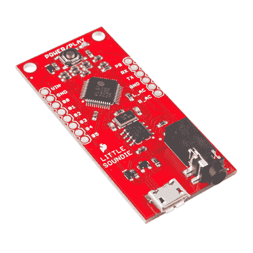

# 小 Soundie 音频播放器连接指南

> 原文：<https://learn.sparkfun.com/tutorials/little-soundie-audio-player-hookup-guide>

## 介绍

[Little Soundie](https://www.sparkfun.com/products/14006) 是一款有趣且易于使用的音频播放设备，突破了 [VLSI](http://www.vlsi.fi/) 的 [VS1000D](http://www.vlsi.fi/fileadmin/datasheets/vs1000.pdf) 音频编解码器。小 Soundie 可以解码 ogg vorbis(免许可证)和 WAV 类型的文件。

 

### [【spark fun 小音响】音频播放器](https://www.sparkfun.com/products/retired/14006)

[Retired](https://learn.sparkfun.com/static/bubbles/ "Retired") DEV-14006

Little Soundie 是一款突破 VS1000D 音频编解码器 IC 的微型音频播放设备，使该板能够…

2 **Retired**[Favorited Favorite](# "Add to favorites") 15[Wish List](# "Add to wish list")

[https://www.youtube.com/embed/_5Kb9ILVMJ4/?autohide=1&border=0&wmode=opaque&enablejsapi=1](https://www.youtube.com/embed/_5Kb9ILVMJ4/?autohide=1&border=0&wmode=opaque&enablejsapi=1)

开始时不需要编程，但了解二进制会有帮助。设置您的小音响只需几个步骤:

*   使用微型 USB 电缆连接到您的电脑
*   按下电源/播放按钮
*   出现提示时格式化磁盘
*   拖放您的。奥格还是。wav 文件

从这里开始，音频播放就是连接一个有源扬声器并触发 3.3V 逻辑的 GPIO 引脚。

### 所需材料

要跟随本教程，您将需要以下材料。你可能不需要所有的东西，这取决于你拥有什么。将它添加到您的购物车，通读指南，并根据需要调整购物车。