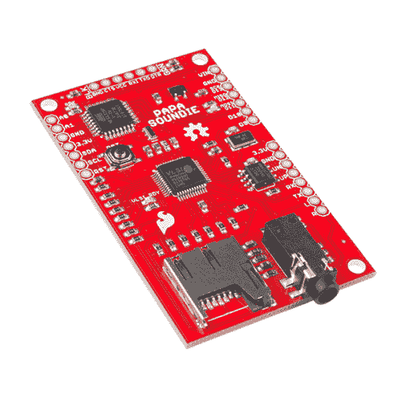

# Papa Soundie 音频播放器连接指南

> 原文：<https://learn.sparkfun.com/tutorials/papa-soundie-audio-player-hookup-guide>

## 介绍

[Papa Soundie](https://www.sparkfun.com/products/14554) 是一款音频播放设备，突破了 [VLSI](http://www.vlsi.fi/) 的 VS1000D 音频编解码器，可以解码 ogg vorbis(免许可)和 wav 类型文件。有了用于声音存储的 SD 卡和用 Arduino 编程的内置 ATMEGA328P，您就可以用更少的硬件在熟悉的编程环境中为您的项目添加自定义声音效果。

 

### [SparkFun Papa Soundie 音频播放器](https://www.sparkfun.com/products/retired/14554)

[Retired](https://learn.sparkfun.com/static/bubbles/ "Retired") DEV-14554

Papa Soundie 是一款音频播放设备，突破了 VS1000D 音频编解码器 IC 的限制，使该板能够解码 OG…

**Retired**[Favorited Favorite](# "Add to favorites") 10[Wish List](# "Add to wish list")

[https://www.youtube.com/embed/_5Kb9ILVMJ4/?autohide=1&border=0&wmode=opaque&enablejsapi=1](https://www.youtube.com/embed/_5Kb9ILVMJ4/?autohide=1&border=0&wmode=opaque&enablejsapi=1)

### 所需材料

要遵循本连接指南，您至少需要以下材料: