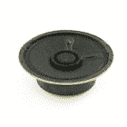

# 嘈杂的板球立体声放大器- 1.5W 连接指南

> 原文：<https://learn.sparkfun.com/tutorials/noisy-cricket-stereo-amplifier---15w-hookup-guide>

## 介绍

[高噪声 Cricket 立体声放大器](https://www.sparkfun.com/products/14475)使用 LM4853，它可以配置为在单声道操作(4ω负载)下输出高达 1.5W 的功率，或在立体声操作(8ω负载)下输出每通道 300mW 的功率。该放大器配有一个双组电位计，内置开关来控制功率和调节左右声道增益。在本教程中，我们将展示如何连接它和曲柄了你的曲子！

 

将**添加到您的[购物车](https://www.sparkfun.com/cart)中！**

 **### [SparkFun 吵蟋蟀立体声放大器- 1.5W](https://www.sparkfun.com/products/14475)

[In stock](https://learn.sparkfun.com/static/bubbles/ "in stock") DEV-14475

嘈杂的板球立体声放大器，使用 LM4853，可配置输出高达 1.5W 的功率在单声道操作或…

$12.501[Favorited Favorite](# "Add to favorites") 15[Wish List](# "Add to wish list")** **[https://www.youtube.com/embed/_5Kb9ILVMJ4/?autohide=1&border=0&wmode=opaque&enablejsapi=1](https://www.youtube.com/embed/_5Kb9ILVMJ4/?autohide=1&border=0&wmode=opaque&enablejsapi=1)

### 建议的材料

以下是一些相关产品，可以帮助你开始接触吵闹的蟋蟀:

 

将**添加到您的[购物车](https://www.sparkfun.com/cart)中！**

 **### [SparkFun TRRS 3.5mm 插孔突破](https://www.sparkfun.com/products/11570)

[In stock](https://learn.sparkfun.com/static/bubbles/ "in stock") BOB-11570

TRRS 接口是音频类型的接口，你可以在一些电话、MP3 播放器和开发板上看到。TRRS 站在…

$4.506[Favorited Favorite](# "Add to favorites") 32[Wish List](# "Add to wish list")**** 

将**添加到您的[购物车](https://www.sparkfun.com/cart)中！**

 **### [扬声器- 0.5W (8 欧姆)](https://www.sparkfun.com/products/9151)

[In stock](https://learn.sparkfun.com/static/bubbles/ "in stock") COM-09151

一款小型音频扬声器，非常适合无线电和放大器项目，并且小到足以适合机器人项目。

$2.45[Favorited Favorite](# "Add to favorites") 29[Wish List](# "Add to wish list")**** 

将**添加到您的[购物车](https://www.sparkfun.com/cart)中！**

 **### [黑色旋钮- 15x19mm](https://www.sparkfun.com/products/9998)

[In stock](https://learn.sparkfun.com/static/bubbles/ "in stock") COM-09998

旋钮是完成项目的好方法，可以更容易地调整死亡射线的级别。这个旋钮与…相配

$1.05[Favorited Favorite](# "Add to favorites") 25[Wish List](# "Add to wish list")**** 

将**添加到您的[购物车](https://www.sparkfun.com/cart)中！**

 **### [音频插头- 3.5mm](https://www.sparkfun.com/products/11143)

[In stock](https://learn.sparkfun.com/static/bubbles/ "in stock") COM-11143

这是一个简单的 3.5 毫米 TRS 立体声音频插孔，带螺纹塑料罩。这些对于插入 head 的项目来说非常棒…

$0.55[Favorited Favorite](# "Add to favorites") 9[Wish List](# "Add to wish list")**** 

将**添加到您的[购物车](https://www.sparkfun.com/cart)中！**

 **### [【TRRS-18”(尾纤)](https://www.sparkfun.com/products/11580)

[In stock](https://learn.sparkfun.com/static/bubbles/ "in stock") CAB-11580

TRRS 接口是一些手机、MP3 播放器和开发板上常见的 3.5 毫米音频接口。TRRS 街…

$1.60[Favorited Favorite](# "Add to favorites") 20[Wish List](# "Add to wish list")**** 

### [表面换能器——大型](https://www.sparkfun.com/products/retired/10975)

[Retired](https://learn.sparkfun.com/static/bubbles/ "Retired") COM-10975

表面传感器给你强大的力量，几乎可以把任何表面变成扬声器。他们本质上只是一个扬声器…

11 **Retired**[Favorited Favorite](# "Add to favorites") 40[Wish List](# "Add to wish list") 

### [音频插孔-3.5 毫米(面板安装)](https://www.sparkfun.com/products/retired/11154)

[Retired](https://learn.sparkfun.com/static/bubbles/ "Retired") COM-11154

这是一个标准的 3.5 毫米立体声插孔，没有多余的装饰。面板安装在一个直径为 6 毫米的孔，一个漂亮干净的耳机，麦克风…

2 **Retired**[Favorited Favorite](# "Add to favorites") 10[Wish List](# "Add to wish list") 

### [黑色鸡头旋钮- 14x20mm](https://www.sparkfun.com/products/retired/10000)

[Retired](https://learn.sparkfun.com/static/bubbles/ "Retired") COM-10000

旋钮是完成项目的好方法，可以更容易地调整死亡射线的级别。这个旋钮与…相配

**Retired**[Favorited Favorite](# "Add to favorites") 3[Wish List](# "Add to wish list")********** **********### 工具

你需要一个烙铁、焊料和一般的焊接附件。

 

### [威勒 WLC100 焊台](https://www.sparkfun.com/products/14228)

[Out of stock](https://learn.sparkfun.com/static/bubbles/ "out of stock") TOL-14228

Weller 的 WLC100 是一款多功能的 5 瓦至 40 瓦焊台，非常适合业余爱好者、DIY 爱好者和学生。…

2[Favorited Favorite](# "Add to favorites") 17[Wish List](# "Add to wish list") 

将**添加到您的[购物车](https://www.sparkfun.com/cart)中！**

 **### [无铅焊料- 100 克线轴](https://www.sparkfun.com/products/9325)

[In stock](https://learn.sparkfun.com/static/bubbles/ "in stock") TOL-09325

这是带有水溶性树脂芯的无铅焊料的基本线轴。0.031 英寸规格，100 克。这是一个好主意…

$9.957[Favorited Favorite](# "Add to favorites") 33[Wish List](# "Add to wish list")** **### 推荐阅读

如果您不熟悉以下概念，我们建议您在继续之前查看这些教程。

 [### 如何焊接:通孔焊接](https://learn.sparkfun.com/tutorials/how-to-solder-through-hole-soldering) This tutorial covers everything you need to know about through-hole soldering.[Favorited Favorite](# "Add to favorites") 70 [### 使用导线](https://learn.sparkfun.com/tutorials/working-with-wire) How to strip, crimp, and work with wire.[Favorited Favorite](# "Add to favorites") 50 [### 按钮和开关基础知识](https://learn.sparkfun.com/tutorials/button-and-switch-basics) A tutorial on electronics' most overlooked and underappreciated component: the switch! Here we explain the difference between momentary and maintained switches and what all those acronyms (NO, NC, SPDT, SPST, ...) stand for.[Favorited Favorite](# "Add to favorites") 53 [### 采用 LTSpice 的运算放大器简介](https://learn.sparkfun.com/tutorials/introduction-to-operational-amplifiers-with-ltspice) Picking up where we left off in "Getting Started with LTSpice," we delve a little deeper into LTSpice through an introduction of Operational Amplifiers (OpAmps).[Favorited Favorite](# "Add to favorites") 12

## 硬件概述和组装

吵闹的板球是一个易于使用的板，有三个连接部分:

*   力量
*   投入
*   输出

### 力量

电源部分有三个连接:VCC、VCC 输出和 GND。VCC 和 VCC OUT 都要求电压范围为 **2.4-5.5VDC** ，但只需要一个连接。控制音量的锅有一个内置开关。VCC 在开关的“输入”侧，这意味着当锅被逆时针旋转到底时，放大器关闭，当你听到开关顺时针旋转时，放大器打开。VCC 输出位于开关的“输出”侧，这意味着当电源施加于此引脚时，无论开关如何，放大器都会开启。该开关的额定电流为 3A，这意味着您可以将 5V 音频源连接到 VCC 输出，并同时打开两块电路板的电源，而不必连接多个开关来为所有电子设备供电。

### 投入

输入部分有三个接口:左输入、右输入和 GND，用于音频输入。放大器的增益由外部电阻控制，如下图所示:

开箱即用，电阻器被配置为从您的计算机或电话获取耳机输出信号。当调到 11 时，输出会失真，但这是故意的，以确保你能够从放大器获得最大功率。在**立体声操作**中，两个声道都是有效的反相放大器，这允许我们使用以下公式计算增益:Av = -Rf / Ri，或**Av =-Rpot/2.2kω**。在**单声道操作**中，一个放大器 180°反相，因此增益变为 Avd = Vout / (Vinl + Vinr) = 2 * (Rf/Ri)，或**Avd = Rpot/2.2kω**。

### 输出

嘈杂蟋蟀的输出可以配置为立体声或单声道。

#### 立体声操作

在立体声工作模式下，输出的最大功率输出为 300 MW/通道(负载为 8ω)。要连接立体声扬声器，您需要将每个扬声器连接到左、右输出引脚，并接地，如下所示。

*Stereo Amplifier Wiring*

为了从放大器获得最大输出功率，你需要将嘈杂的蟋蟀配置为单声道放大器。当配置为单声道放大器时，左右输入声道组合起来驱动单个扬声器。

要启用单声道操作，使用焊料短接电路板背面标有“ **ENABLE MONO OUTPUT** ”的两个焊盘。还建议闭合另一个标有“**单声道低音增强**”的焊接跳线。每个输出都有一个 100μF 去耦电容，用于立体声放大。然而，在单声道模式下，输出不需要电容，会过滤掉一些较低的低音频率，因此，音频听起来会更“微弱”。单声道低音增强跳线短路左输出去耦电容，允许低频通过。

#### 单声道操作

在单声道工作模式下，输出的最大功率输出为 1.5W(负载为 4ω)。要连接您的扬声器，您需要将扬声器的一个引脚连接到左输出引脚，另一个引脚连接到单声道输出引脚(但**不接地！**)如下图。

*Mono Amplifier Wiring*

## 选择电源和扬声器

如前所述，嘈杂的板球在立体声操作中的输出功率高达 300 MW/声道，在单声道中为 1.5W。功率输出不仅取决于输出负载，还取决于电源。借用[数据手册](https://cdn.sparkfun.com/assets/0/f/e/b/b/lm4853.pdf)中的一些图表，应该有助于我们理解我们的电源和扬声器选择。

在第一张图中，我们看到负载(扬声器)对可用输出功率的影响。我们可以看到，负载电阻和输出功率之间存在反比关系。为了最大限度地利用嘈杂的板球，建议在单声道操作中使用 4ω扬声器，在立体声操作中使用 8ω扬声器。

下一张图中，我们仍在观察输出功率与负载电阻的关系，但功率不是以瓦特为单位，而是以毫瓦为单位。那么是什么原因呢？改变的变量是电源电压，VDD。在第一张图中，VDD 等于 5V，第二个 VDD 设置为 2.7V。在电压约为一半的情况下，相同负载下的输出功率约为四分之一。虽然放大器的工作电压低至 2.4V，但这意味着如果负载电阻保持不变(根据欧姆定律)，则可用的输出功率会减少。要了解电源电压对几种常见负载的全部影响，请参考下图。

考虑到这些图表并使功率输出最大化，我们推荐 5V 的电源电压，额定电流至少为 100mA。对于立体声放大器，使用 8ω扬声器。对于单声道放大器，使用 4ω扬声器。

## 资源和更进一步

现在我们知道了如何使用吵闹的蟋蟀，是时候在你自己的项目中使用它了！想了解更多关于吵闹蟋蟀的信息，请点击下面的链接:

*   [示意图(PDF)](https://cdn.sparkfun.com/assets/7/2/4/6/4/SparkFun_Noisy_Cricket.pdf)
*   [老鹰文件(ZIP)](https://cdn.sparkfun.com/assets/c/3/f/0/b/SparkFun_Noisy_Cricket_1.zip)
*   [LM4853 数据手册(PDF)](https://cdn.sparkfun.com/assets/0/f/e/b/b/lm4853.pdf)
*   [GitHub 回购](https://github.com/sparkfun/Noisy_Cricket-1.5W_Stereo_Amplifier_Breakout)
*   [SparkFun 产品展示:吵闹的蟋蟀& Soundie 音频板](https://www.youtube.com/watch?v=_5Kb9ILVMJ4)

你的下一个项目需要一些灵感吗？查看一些相关教程:

 [### RN-52 蓝牙连接指南](https://learn.sparkfun.com/tutorials/rn-52-bluetooth-hookup-guide) A hookup guide to get you started with the RN-52 Audio Bluetooth Module Breakout Board.[Favorited Favorite](# "Add to favorites") 16 [### Si4703 调频收音机接收器连接指南](https://learn.sparkfun.com/tutorials/si4703-fm-radio-receiver-hookup-guide) Add some tunes to your project with the Si4703 FM Radio Receiver Breakout.[Favorited Favorite](# "Add to favorites") 5 [### MP3 播放器防护罩连接指南 V15](https://learn.sparkfun.com/tutorials/mp3-player-shield-hookup-guide-v15) How to get your Arduino groovin' using the MP3 Player Shield.[Favorited Favorite](# "Add to favorites") 6 [### 带 BC127 的无线音频蓝牙适配器](https://learn.sparkfun.com/tutorials/wireless-audio-bluetooth-adapter-w-bc127) Build a custom wireless audio Bluetooth adapter using BlueCreation's BC127 and add it to your old speaker system 14 [### 海啸连接指南](https://learn.sparkfun.com/tutorials/tsunami-hookup-guide) Hit the ground running with Tsunami, the Super Wav Trigger.[Favorited Favorite](# "Add to favorites") 2 [### Papa Soundie 音频播放器连接指南](https://learn.sparkfun.com/tutorials/papa-soundie-audio-player-hookup-guide) Add sound effects to your project, prop or costume with Papa Soundie Audio Player.[Favorited Favorite](# "Add to favorites") 3**************