# 将 Raspberry Pi 3 设置为接入点

> 原文：<https://learn.sparkfun.com/tutorials/setting-up-a-raspberry-pi-3-as-an-access-point>

## 介绍

**Note:** This tutorial was based on instructions found on [this blog](https://frillip.com/using-your-raspberry-pi-3-as-a-wifi-access-point-with-hostapd/).

[Raspberry Pi 3](https://www.sparkfun.com/products/14643) 配有内置无线适配器，可以轻松将其配置为 WiFi 热点，以共享互联网或托管您自己的内部网站。本指南的第一部分将向您展示如何设置 Pi 来广播其 SSID、接受 WiFi 连接以及分发 IP 地址(使用 DHCP)。下一节将向您展示如果您想要共享您的互联网连接，如何启用直通以太网连接。

[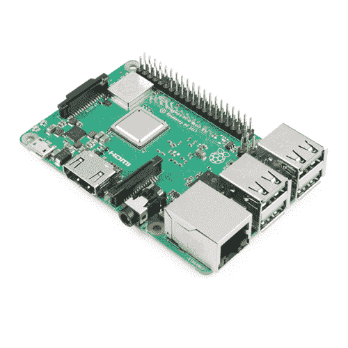](https://www.sparkfun.com/products/14643) 

### [树莓派 3 B+](https://www.sparkfun.com/products/14643)

[Out of stock](https://learn.sparkfun.com/static/bubbles/ "out of stock") DEV-14643

Raspberry Pi 3 B+在这里为您提供与以前相同的 Pi，但现在具有千兆位和 PoE 能力的以太网！

35[Favorited Favorite](# "Add to favorites") 75[Wish List](# "Add to wish list")

### 在你开始之前！

你会想要一个[树莓 PI 3](https://www.sparkfun.com/products/14643) 或[树莓 Pi Zero W](https://www.sparkfun.com/products/14277) 以及你可能需要的任何连接配件(例如，[一个电源适配器](https://www.sparkfun.com/products/13831)和[微型 SD 卡](https://www.sparkfun.com/products/13833))。

您需要将操作系统(OS)加载到 SD 卡上，并能够登录到 Pi 并打开终端。

**Note:** This tutorial was created with Raspbian Stretch (version: March 2018). Using a different version may require performing different steps than what's shown in this tutorial. If you would like to download the March 2018 version of Raspbian, it can be found below.

[Raspbian Stretch (version: March 2018) Download (ZIP)](http://downloads.raspberrypi.org/raspbian/images/raspbian-2018-03-14/2018-03-13-raspbian-stretch.zip)

如果您需要在 Raspberry Pi 上安装操作系统的帮助，这些教程可能会有所帮助:

*   《树莓 Pi 3 入门套件指南》的[获取操作系统部分](https://learn.sparkfun.com/tutorials/raspberry-pi-3-starter-kit-hookup-guide#getting-an-os)带你了解在 Pi 上安装 NOOBS 的几个选项。
*   [开始使用 Raspberry Pi Zero 无线教程](https://learn.sparkfun.com/tutorials/getting-started-with-the-raspberry-pi-zero-wireless)如果你有一个 Pi Zero W，这是一个很好的开始。
*   如果您想在没有显示器、键盘或鼠标的情况下配置您的 Pi(例如，通过串口或 SSH 登录)，那么 [Headless Raspberry Pi 设置指南](https://learn.sparkfun.com/tutorials/headless-raspberry-pi-setup)非常有用。

### 推荐阅读

如果您不熟悉以下概念，我们建议您在继续之前查看这些教程。

[](https://learn.sparkfun.com/tutorials/raspberry-pi-3-starter-kit-hookup-guide) [### 树莓 Pi 3 入门套件连接指南](https://learn.sparkfun.com/tutorials/raspberry-pi-3-starter-kit-hookup-guide) Guide for getting going with the Raspberry Pi 3 Model B and Raspberry Pi 3 Model B+ starter kit.[Favorited Favorite](# "Add to favorites") 13[](https://learn.sparkfun.com/tutorials/getting-started-with-the-raspberry-pi-zero-wireless) [### Raspberry Pi Zero Wireless 入门](https://learn.sparkfun.com/tutorials/getting-started-with-the-raspberry-pi-zero-wireless) Learn how to setup, configure and use the smallest Raspberry Pi yet, the Raspberry Pi Zero - Wireless.[Favorited Favorite](# "Add to favorites") 17[](https://learn.sparkfun.com/tutorials/headless-raspberry-pi-setup) [### 无头 Raspberry Pi 设置](https://learn.sparkfun.com/tutorials/headless-raspberry-pi-setup) Configure a Raspberry Pi without a keyboard, mouse, or monitor.[Favorited Favorite](# "Add to favorites") 16

## 设置 WiFi 接入点

确定您的 Raspberry Pi 已接入互联网。打开一个[终端窗口](https://learn.sparkfun.com/tutorials/terminal-basics/command-line-windows-mac-linux)(在控制台窗口或通过串行/SSH 连接)。

### 安装软件包

要安装所需的软件包，请在控制台中输入以下内容:

```
language:bash
sudo apt-get -y install hostapd dnsmasq 
```

*Hostapd* 是一个允许你使用 WiFi 无线电作为接入点的程序， *Dnsmasq* 是 DHCP 和 DNS 服务的轻量级组合(分发 IP 地址并将域名翻译成 IP 地址)。

### 设置静态 IP 地址

在 Raspbian 的最新版本中，网络配置由 *dhcpcd* 程序管理。因此，我们需要告诉它忽略无线接口 *wlan0* ，并在别处设置一个静态 IP 地址。

**Note:** If you are connected to your Raspberry Pi using SSH over wireless, you will want to connect with a keyboard/mouse/monitor, Ethernet, or serial instead until we get the access point configured.

编辑 *dhcpcd* 文件:

```
language:bash
sudo nano /etc/dhcpcd.conf 
```

向下滚动，在文件底部添加:

```
language:bash
denyinterfaces wlan0 
```

您的终端窗口应该看起来类似下图。

[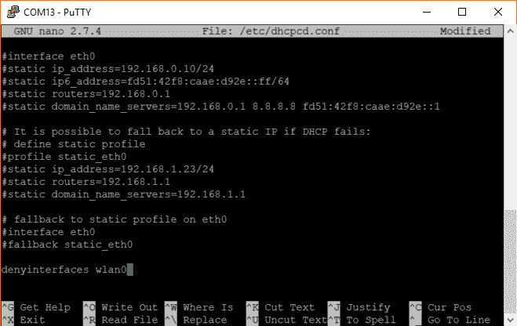](https://cdn.sparkfun.com/assets/learn_tutorials/7/6/1/RPi_AP_screenshot_01.png)

当被询问时，按`ctrl` + `x`和`y`保存并退出。

接下来，我们需要告诉树莓派为 WiFi 接口设置一个静态 IP 地址。用以下命令打开*接口*文件:

```
language:bash
sudo nano /etc/network/interfaces 
```

在该文件的底部，添加以下内容:

```
language:bash
auto lo
iface lo inet loopback

auto eth0
iface eth0 inet dhcp

allow-hotplug wlan0
iface wlan0 inet static
    address 192.168.5.1
    netmask 255.255.255.0
    network 192.168.5.0
    broadcast 192.168.5.255 
```

您的终端窗口应该看起来类似下图。

[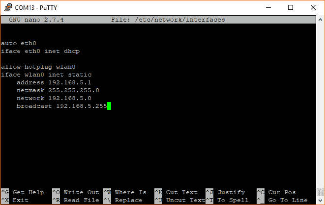](https://cdn.sparkfun.com/assets/learn_tutorials/7/6/1/RPi_AP_screenshot_02a.png)

当被询问时，按`ctrl` + `x`和`y`保存并退出。

### 配置 Hostapd

我们需要设置 *hostapd* 来告诉它广播一个特定的 SSID，并允许在某个频道上进行 WiFi 连接。使用以下命令编辑 *hostapd.conf* 文件(这将创建一个新文件，因为这个文件可能还不存在):

```
language:bash
sudo nano /etc/hostapd/hostapd.conf 
```

在该文件中输入以下内容。觉得把`ssid` (WiFi 网络名称)和`wpa_passphrase`(加入网络的密码)改成自己喜欢的就可以了。你也可以将`channel`改为 1-11 范围内的某个数字(如果 6 频道在你所在的地区太拥挤的话)。

```
language:bash
interface=wlan0
driver=nl80211
ssid=MyPiAP
hw_mode=g
channel=6
ieee80211n=1
wmm_enabled=1
ht_capab=[HT40][SHORT-GI-20][DSSS_CCK-40]
macaddr_acl=0
auth_algs=1
ignore_broadcast_ssid=0
wpa=2
wpa_key_mgmt=WPA-PSK
wpa_passphrase=raspberry
rsn_pairwise=CCMP 
```

您的终端窗口应该看起来类似下图。

[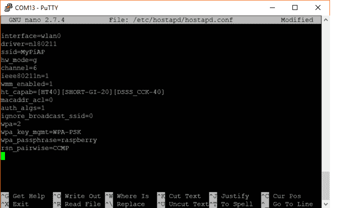](https://cdn.sparkfun.com/assets/learn_tutorials/7/6/1/RPi_AP_screenshot_03.png)

当被询问时，按`ctrl` + `x`和`y`保存并退出。

不幸的是， *hostapd* 不知道在哪里可以找到这个配置文件，所以我们需要向 *hostapd* 启动脚本提供它的位置。打开 */etc/default/hostapd* :

```
language:bash
sudo nano /etc/default/hostapd 
```

找到行`#DAEMON_CONF=""`并替换为:

```
language:bash
DAEMON_CONF="/etc/hostapd/hostapd.conf" 
```

您的终端窗口应该看起来类似下图。

[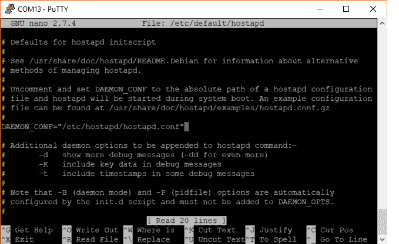](https://cdn.sparkfun.com/assets/learn_tutorials/7/6/1/RPi_AP_screenshot_04.png)

当被询问时，按`ctrl` + `x`和`y`保存并退出。

### 配置 Dnsmasq

随着新设备连接到我们的网络，Dnsmasq 将帮助我们自动分配 IP 地址，并在网络名称和 IP 地址之间进行转换。**。 *Dnsmasq* 附带的 conf** 文件中有很多有用的信息，因此保存它(作为备份)而不是删除它可能是值得的。保存后，打开一个新的进行编辑:

```
language:bash
sudo mv /etc/dnsmasq.conf /etc/dnsmasq.conf.bak
sudo nano /etc/dnsmasq.conf 
```

在空白文件中，粘贴以下文本。请注意，我们设置了 DHCP 来为`192.168.5.100`和`192.168.5.200`之间的设备分配地址。记住`192.168.5.1`是为圆周率保留的。因此，`192.168.5.2 - 192.168.5.9`和`192.168.5.201 - 192.168.5.254`之间的任何东西都可以用于具有静态 IP 地址的设备。

```
language:bash
interface=wlan0 
listen-address=192.168.5.1
bind-interfaces 
server=8.8.8.8
domain-needed
bogus-priv
dhcp-range=192.168.5.100,192.168.5.200,24h 
```

您的终端窗口应该看起来类似下图。

[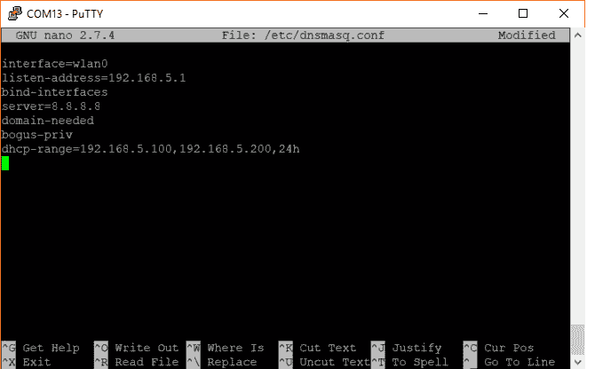](https://cdn.sparkfun.com/assets/learn_tutorials/7/6/1/RPi_AP_screenshot_05.png)

当被询问时，按`ctrl` + `x`和`y`保存并退出。

### 测试 WiFi 连接

使用以下命令重新启动 Raspberry Pi:

```
language:bash
sudo reboot 
```

在您的 Pi 重启后(不需要登录)，您应该看到 **MyPiAP** 从您的计算机上显示为一个潜在的无线网络。

[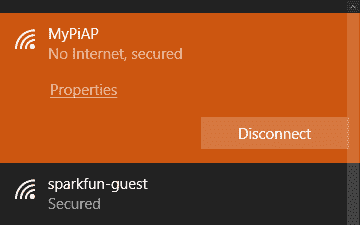](https://cdn.sparkfun.com/assets/learn_tutorials/7/6/1/RPi_AP_screenshot_06.png)

连接到它(网络密码是**树莓**，除非你在 *hostapd.conf* 文件里改了)。打开电脑上的终端，输入命令`ipconfig` (Windows)或`ifconfig` (Mac，Linux)。你应该看到你已经被分配了一个在`192.168.5.100 - 192.168.5.200`范围内的 IP 地址。

以下是无线连接到 Pi 后您可能会看到的一个示例。

[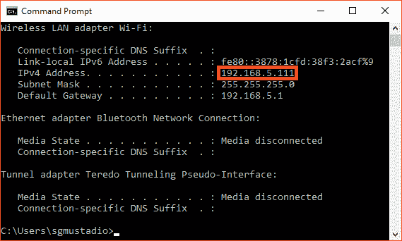](https://cdn.sparkfun.com/assets/learn_tutorials/7/6/1/RPi_AP_screenshot_07a.png)

如果您只是想将 Pi 用作独立的 WiFi 接入点，您可以在此停止。如果您想要将其连接到另一个网络(通过以太网)以共享互联网(很像 WiFi 路由器)，请继续。

## 启用数据包转发

我们可以使用 Raspberry Pi 作为路由器，通过以太网将其连接到另一个网络，并让 WiFi 连接的设备能够与该网络通话。通过这样做，我们可以从 Pi 共享互联网连接。

### 配置 NAT

确保您已登录到您的 Pi。编辑 */etc/sysctl.conf* 文件:

```
language:bash
sudo nano /etc/sysctl.conf 
```

查找行`#net.ipv4.ip_forward=1`，通过删除`#`取消注释。

```
language:bash
net.ipv4.ip_forward=1 
```

您的终端窗口应该看起来类似下图。

[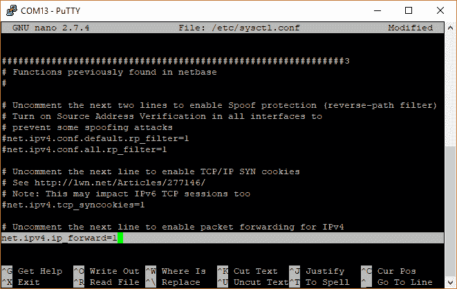](https://cdn.sparkfun.com/assets/learn_tutorials/7/6/1/RPi_AP_screenshot_08.png)

出现提示时，按`ctrl` + `x`和`y`保存并退出。

最后，我们需要在以太网和 WiFi 接口之间配置网络地址转换(NAT ),以允许两个网络上的设备相互通信。在终端中，输入以下内容:

```
language:bash
sudo iptables -t nat -A POSTROUTING -o eth0 -j MASQUERADE  
sudo iptables -A FORWARD -i eth0 -o wlan0 -m state --state RELATED,ESTABLISHED -j ACCEPT
sudo iptables -A FORWARD -i wlan0 -o eth0 -j ACCEPT 
```

这暂时可以工作，但是在重新启动时，Pi 将恢复到以前的状态。为了解决这个问题，我们需要在每次启动时应用这些 NAT 规则。使用以下命令将当前规则保存到文件中:

```
language:bash
sudo sh -c "iptables-save > /etc/iptables.ipv4.nat" 
```

Linux 为我们提供了许多在启动时运行命令的方法。通常，最简单的方法是将这些命令放入 */etc/rc.local* 脚本中。为了在引导时恢复 NAT 规则，我们编辑了 *rc.local* 文件:

```
language:bash
sudo nano /etc/rc.local 
```

就在`exit 0`行(结束脚本)的上方，添加以下内容:

```
language:bash
iptables-restore < /etc/iptables.ipv4.nat 
```

您的终端窗口应该看起来类似下图。

[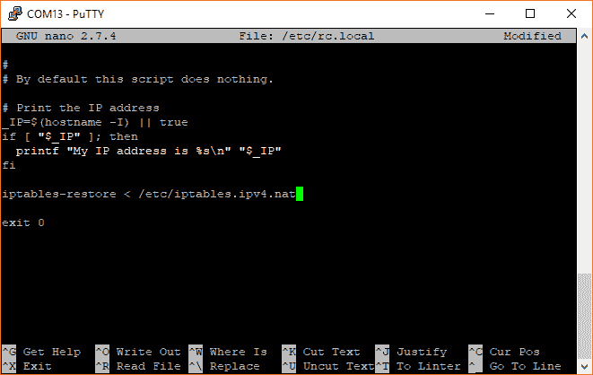](https://cdn.sparkfun.com/assets/learn_tutorials/7/6/1/RPi_AP_screenshot_09.png)

出现提示时，按`ctrl` + `x`和`y`保存并退出。

### 测试一下

重新启动您的 Pi:

```
language:bash
sudo reboot 
```

给你的 Pi 几分钟重新启动(同样，不需要登录)。从您的互联网路由器(或交换机等)连接以太网电缆。)到你的 Pi。Pi 启动后，从您的计算机连接到 **MyPiAP** 网络。打开 web 浏览器，导航到您选择的网站。

[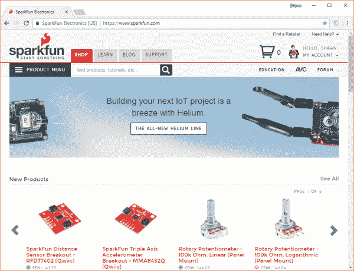](https://cdn.sparkfun.com/assets/learn_tutorials/7/6/1/RPi_AP_screenshot_10.png)

你也可以在电脑上打开一个终端，ping 一个已知的互联网地址(例如`8.8.8.8`是谷歌的一个公共 DNS 服务器)。

[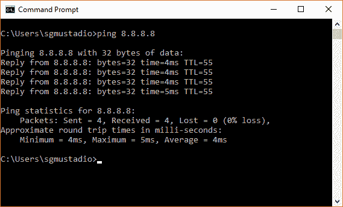](https://cdn.sparkfun.com/assets/learn_tutorials/7/6/1/RPi_AP_screenshot_11.png)

## 资源和更进一步

将 Raspberry Pi 设置为访问点后，您现在可以将其配置为托管一个网站(例如使用 Apache)、共享驱动器空间(例如 Samba)以及您可能想要的任何其他有趣的路由器定制(但是改为在 Pi 上！).

为你的树莓派寻找灵感？查看这些教程:

[](https://learn.sparkfun.com/tutorials/raspberry-pi-twitter-monitor) [### Raspberry Pi Twitter 监视器](https://learn.sparkfun.com/tutorials/raspberry-pi-twitter-monitor) How to use a Raspberry Pi to monitor Twitter for hashtags and blink an LED.[Favorited Favorite](# "Add to favorites") 6[](https://learn.sparkfun.com/tutorials/raspberry-gpio) [### 树莓 gPIo](https://learn.sparkfun.com/tutorials/raspberry-gpio) How to use either Python or C++ to drive the I/O lines on a Raspberry Pi.[Favorited Favorite](# "Add to favorites") 17[](https://learn.sparkfun.com/tutorials/raspberry-pi-zero-helmet-impact-force-monitor) [### Raspberry Pi 零头盔冲击力监控器](https://learn.sparkfun.com/tutorials/raspberry-pi-zero-helmet-impact-force-monitor) How much impact can the human body handle? This tutorial will teach you how to build your very own impact force monitor using a helmet, Raspberry Pi Zero, and accelerometer 2[](https://learn.sparkfun.com/tutorials/setting-up-the-pi-zero-wireless-pan-tilt-camera) [### 设置 Pi Zero 无线云台摄像机](https://learn.sparkfun.com/tutorials/setting-up-the-pi-zero-wireless-pan-tilt-camera) This tutorial will show you how to assemble, program, and access the Raspberry Pi Zero as a headless wireless pan-tilt camera.[Favorited Favorite](# "Add to favorites") 12[](https://learn.sparkfun.com/tutorials/using-flask-to-send-data-to-a-raspberry-pi) [### 使用 Flask 向 Raspberry Pi 发送数据](https://learn.sparkfun.com/tutorials/using-flask-to-send-data-to-a-raspberry-pi) In this tutorial, we'll show you how to use the Flask framework for Python to send data from ESP8266 WiFi nodes to a Raspberry Pi over an internal WiFi network.[Favorited Favorite](# "Add to favorites") 7[](https://learn.sparkfun.com/tutorials/raspberry-pi-stand-alone-programmer) [### Raspberry Pi 独立程序员](https://learn.sparkfun.com/tutorials/raspberry-pi-stand-alone-programmer) This tutorial will show you how to use a headless Raspberry Pi to flash hex files onto AVR microcontrollers as a stand-alone programmer. It also tells the story about production programming challenges, how SparkFun came to this solution, and all the lessons learned along the way.[Favorited Favorite](# "Add to favorites") 12

## 有兴趣了解更多关于 WiFi 的知识吗？

了解 WiFi 如何工作的背景，以及可以帮助您无线连接项目的硬件。

[Take me there!](https://www.sparkfun.com/wifi)