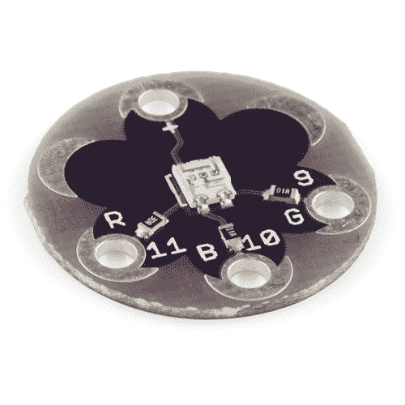

# LilyPad 三色 LED 连接指南

> 原文：<https://learn.sparkfun.com/tutorials/lilypad-tri-color-led-hookup-guide>

## 介绍

**Heads up!** This tutorial was written for the LilyPad Tri-Color LED with common anode. If you are using the LilyPad RGB LED with common cathode, please refer to the [LilyPad RGB LED Hookup Guide](https://learn.sparkfun.com/tutorials/lilypad-rgb-led-hookup-guide).

[LilyPad 三色 LED](https://www.sparkfun.com/products/8467) 是一种可以产生多种颜色的专用板。板上有一个 RGB(红绿蓝)LED，由三个微小的 LED 连接在一起组成。RGB LED 中的每种颜色都连接到电路板上标有 R、G 和 b 的 sew 选项卡。

 

### [LilyPad 三色 LED](https://www.sparkfun.com/products/retired/8467)

[Retired](https://learn.sparkfun.com/static/bubbles/ "Retired") DEV-08467

眨你需要的任何颜色！使用三色 LED 板作为一个简单的指标，或通过脉冲红色，绿色和蓝色通道，…

2 **Retired**[Favorited Favorite](# "Add to favorites") 7[Wish List](# "Add to wish list")

为了跟随代码示例，我们建议: