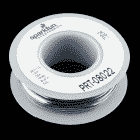

# 可寻址 LED 霓虹灯软线连接指南

> 原文：<https://learn.sparkfun.com/tutorials/addressable-led-neon-flex-rope-hookup-guide>

## 介绍

可寻址的 [LED 霓虹灯软线](https://www.sparkfun.com/products/14555)为室内和室外使用增加了酷炫的照明效果，包括走廊和楼梯、节日照明等等！在本连接指南中，您将学习如何使用 Arduino 连接、供电和控制 LED 灯段。

[](https://www.sparkfun.com/products/retired/14555) 

### [LED 霓虹灯软线](https://www.sparkfun.com/products/retired/14555)

[Retired](https://learn.sparkfun.com/static/bubbles/ "Retired") COM-14555

这种霓虹软绳大约 6.5 英尺(2 米)长，不可寻址的 LED 条模拟你在商店前看到的霓虹效果…

2 **Retired**[Favorited Favorite](# "Add to favorites") 15[Wish List](# "Add to wish list")

[https://www.youtube.com/embed/4DT3d4xyxto/?autohide=1&border=0&wmode=opaque&enablejsapi=1](https://www.youtube.com/embed/4DT3d4xyxto/?autohide=1&border=0&wmode=opaque&enablejsapi=1)

### 所需材料

要跟随本项目教程，您将需要以下材料。你可能不需要所有的东西，这取决于你拥有什么。将它添加到您的购物车，通读指南，并根据需要调整购物车。如果你只是想给 LED 霓虹灯软线加电，并使用它的演示模式，你将需要以下。

[](https://www.sparkfun.com/products/10288) 

将**添加到您的[购物车](https://www.sparkfun.com/cart)中！**

 **### [DC 筒式千斤顶适配器——母](https://www.sparkfun.com/products/10288)

[In stock](https://learn.sparkfun.com/static/bubbles/ "in stock") PRT-10288

此适配器允许您将筒式插孔连接器连接到裸线。一端有螺丝端子，另一端有一个 5.5…

$3.501[Favorited Favorite](# "Add to favorites") 24[Wish List](# "Add to wish list")****[](https://www.sparkfun.com/products/retired/13758) 

### [电源- 24V (5A)](https://www.sparkfun.com/products/retired/13758)

[Retired](https://learn.sparkfun.com/static/bubbles/ "Retired") TOL-13758

该 5A 电源输出 24v 直流电压，端接一个中心正极 5.5 x 2.1mm 毫米筒形连接器。

**Retired**[Favorited Favorite](# "Add to favorites") 4[Wish List](# "Add to wish list") 

### 电力电缆- 10A 直径 m

[Retired](https://learn.sparkfun.com/static/bubbles/ "Retired") TOL-14935

此电源线的一端有一个 C13 连接器，另一端有一个标准的美国三脚插头。它在 125 伏电压下的额定电流为 10A。

**Retired********Note:** The product showcases uses a [24VDC/14.6A Meanwell switching power supply](https://www.sparkfun.com/products/14100) with adapter cable. We will be using the 24V/5A power supply throughout this tutorial.

为了测试和控制区段，您需要下列材料。

[](https://www.sparkfun.com/products/13975) 

将**添加到您的[购物车](https://www.sparkfun.com/cart)中！**

 **### [spark fun red board——用 Arduino 编程 T3](https://www.sparkfun.com/products/13975)

[In stock](https://learn.sparkfun.com/static/bubbles/ "in stock") DEV-13975

SparkFun RedBoard 结合了 UNO 的 Optiboot 引导程序的简单性、FTDI 的稳定性和 shield com…

$21.5049[Favorited Favorite](# "Add to favorites") 89[Wish List](# "Add to wish list")****[](https://www.sparkfun.com/products/14303) 

将**添加到您的[购物车](https://www.sparkfun.com/cart)中！**

 **### [【带辫子的鳄鱼夹(10 个装)](https://www.sparkfun.com/products/14303)

[In stock](https://learn.sparkfun.com/static/bubbles/ "in stock") CAB-14303

这是一种 10 条装的电线，一端带有鳄鱼夹，另一端带有插头。

$7.504[Favorited Favorite](# "Add to favorites") 13[Wish List](# "Add to wish list")****[](https://www.sparkfun.com/products/11301) 

将**添加到您的[购物车](https://www.sparkfun.com/cart)中！**

 **### [SparkFun USB 迷你-B 线- 6 脚](https://www.sparkfun.com/products/11301)

[In stock](https://learn.sparkfun.com/static/bubbles/ "in stock") CAB-11301

这是一条 USB 2.0 型到 Mini-B 型 5 针电缆。你知道，通常带有 USB 集线器、相机、MP3 的迷你 B 连接器…

$4.503[Favorited Favorite](# "Add to favorites") 20[Wish List](# "Add to wish list")****[](https://www.sparkfun.com/products/8022) 

将**添加到您的[购物车](https://www.sparkfun.com/cart)中！**

 **### [【黑色连接线(22 AWG)】](https://www.sparkfun.com/products/8022)

[In stock](https://learn.sparkfun.com/static/bubbles/ "in stock") PRT-08022

标准 22 AWG 固体黑色挂钩线。使用这与你的面包板或任何项目，你需要坚固的电线。来了…

$2.951[Favorited Favorite](# "Add to favorites") 19[Wish List](# "Add to wish list")****[](https://www.sparkfun.com/products/11456) 

将**添加到您的[购物车](https://www.sparkfun.com/cart)中！**

 **### [USB 壁式充电器- 5V，1A(黑色)](https://www.sparkfun.com/products/11456)

[In stock](https://learn.sparkfun.com/static/bubbles/ "in stock") TOL-11456

现在 USB 越来越多地被作为一种电源连接标准来实现，但是你并不总是在 han 上有一台计算机…

$4.502[Favorited Favorite](# "Add to favorites") 10[Wish List](# "Add to wish list")********** **********### 工具

根据不同的应用，你可能需要一个烙铁、焊料和[通用焊接附件](https://www.sparkfun.com/categories/49)来实现更安全的连接。否则，以下工具将足以进行连接和测试。

[](https://www.sparkfun.com/products/9146) 

将**添加到您的[购物车](https://www.sparkfun.com/cart)中！**

 **### [SparkFun 迷你螺丝刀](https://www.sparkfun.com/products/9146)

[In stock](https://learn.sparkfun.com/static/bubbles/ "in stock") TOL-09146

这只是你的基本可逆螺丝刀口袋大小！有平头和十字头可供选择。配有别针和…

$1.053[Favorited Favorite](# "Add to favorites") 11[Wish List](# "Add to wish list")****[](https://www.sparkfun.com/products/retired/12630) 

### [剥线钳-30a WG](https://www.sparkfun.com/products/retired/12630)

[Retired](https://learn.sparkfun.com/static/bubbles/ "Retired") TOL-12630

使用 Hakko 的剥线钳非常方便和舒适。这些是任何一个黑客的必备技能…

3 **Retired**[Favorited Favorite](# "Add to favorites") 14[Wish List](# "Add to wish list")** **### 推荐阅读

如果您不熟悉以下概念，我们建议您在继续之前查看这些教程。

[](https://learn.sparkfun.com/tutorials/what-is-an-arduino) [### 什么是 Arduino？](https://learn.sparkfun.com/tutorials/what-is-an-arduino) What is this 'Arduino' thing anyway? This tutorials dives into what an Arduino is and along with Arduino projects and widgets.[Favorited Favorite](# "Add to favorites") 50[](https://learn.sparkfun.com/tutorials/installing-arduino-ide) [### 安装 Arduino IDE](https://learn.sparkfun.com/tutorials/installing-arduino-ide) A step-by-step guide to installing and testing the Arduino software on Windows, Mac, and Linux.[Favorited Favorite](# "Add to favorites") 16

## 硬件概述

LED 霓虹灯柔性绳使用 UCS1903 芯片组和 LED。电子设备密封在防水的 IP65 硅树脂外壳中，并扩散 led 发出的光。

### 插脚引线图

要给 LED 霓虹灯软线供电或控制，您需要连接到母裸线连接器。 **24V** 需要使用带红色条纹的电线给 LED 霓虹灯软线供电。使用微控制器时，中心线是数据引脚。另一边的第三根线是地线。

[](https://cdn.sparkfun.com/assets/learn_tutorials/7/6/3/LEDNeonFlexRopePinout.png)

下面列出了引脚排列的连接表，以供参考。

| LED 霓虹灯软线 | 插脚引线图 |
| Vcc(红色条纹) | 24V |
| DAT(中间) | 数据 |
| GND(侧面) | 地面 |

### LED 灯条段

对于那些有兴趣减少 LED 霓虹软绳的人来说，你可以借助外壳底部的彩色标记来减少长度。标记是指南，而不是 LED 段之间的精确位置。

[](https://cdn.sparkfun.com/assets/learn_tutorials/7/6/3/LED_Neon_Flex_Rope_Tutorial_Markers.jpg)

每个 LED 灯带段大约 20 英寸长。

[](https://cdn.sparkfun.com/assets/learn_tutorials/7/6/3/LED_Neon_Flex_Rope_Tutorial_Length_Between_Markers.jpg)

每个段使用导线连接密封在外壳中的每个 LED 灯条。

| [](https://cdn.sparkfun.com/assets/learn_tutorials/7/6/3/LED_Neon_Flex_Rope_Tutorial_Cut_Closeup.jpg) | [](https://cdn.sparkfun.com/assets/learn_tutorials/7/6/3/LED_Neon_Flex_Rope_Tutorial_Teardown.jpg) |
| *切割 LED 霓虹灯软线的特写侧视图* | *拆除 LED 霓虹灯软线* |

**Heads up!** Remember the colored markers are guides and are not exact locations between the LED segments. We recommend using a box cutter and hobby knife to partially cut into the housing. If necessary, you can individually address the LEDs to help determine the relative location between the segments. The parts that are not as bright is the gap between the LED strips.

[](https://cdn.sparkfun.com/assets/learn_tutorials/7/6/3/14555-LED_Neon_Flex_Rope-Action-Sections.jpg)
Once you determine the location of the wires connecting the LED segments, you can completely cut through the LED neon flex rope. Make sure that the LED strip is not powered when adjusting the length.

如果你决定把长条切下来，确保用一些环氧树脂或热胶密封暴露的电路。

## 仅带电源的硬件连接

当仅用电源给 LED 霓虹灯软线供电时，它将显示一个演示。将三脚电源线插入 24V 电源。然后，使用 DC 筒式插孔母接头进行以下连接。

| 24V 电源 | 母 DC 筒式插孔适配器 | LED 霓虹灯软线引脚排列 |
| 中心正片 | + | Vcc(红色条纹)= 24V |
|  |  | 透明(中间)= DAT |
| GND | - | 清晰(侧面)= GND |

连接后，将适配器插入并固定到 LED 霓虹灯软线的阴性裸线连接器上。设置应该如下图所示。由于电线暴露在外，所以用胶带将 DAT 引脚绝缘。

[](https://cdn.sparkfun.com/assets/learn_tutorials/7/6/3/LEDNeon_FlexRopeHardwareHookup_Demo.jpg)

## 演示模式

通过只连接到电源引脚，LED 霓虹灯软线将运行演示模式。这可以包括使用不同图案的绳索循环颜色。这可以包括:

*   一种纯色
*   脉动和渐变
*   颜色交替变化
*   每一段逐渐用一种颜色点亮

## 带 Arduino 的硬件连接

**Heads up!** For a more secure connection make sure to solder the wires and make a custom connection.

对于想要控制动画或对传感器输入做出反应的用户，可以使用 Arduino 微控制器来控制 LED neon flex rope 的线段。为了快速连接，我们将使用一个带尾纤和连接线的鳄鱼夹。

### 连接到 DAT 引脚

对于初始测试，我们将使用带尾纤的鳄鱼夹将 LED Neon flex 的 DAT 引脚连接到 Arduino 上的软件定义控制引脚。使用鳄鱼夹夹住 DAT 引脚线，然后将另一端连接到 D5。

### 附加电源和 GND 参考

由于通过筒形插孔为 RedBoard 提供的建议输入电压为 **15V** ，因此需要额外的电源。在本教程的范围内，我们将使用 Arduino 上的迷你 USB 连接器用 **5V** 为控制电路供电。测试期间可以使用计算机的 5V USB 端口。在项目或安装中为 Arduino 供电时，可以使用 5V USB 墙壁适配器。

由于我们增加了额外的电源，请确保将 LED 霓虹灯软线与控制电路接地。[剥去一段电线](https://learn.sparkfun.com/tutorials/working-with-wire)。然后将 DC 筒式插孔适配器上的“-”连接到 Arduino 的 GND 引脚。把电线缠在一起，使连接更牢固。

| [](https://cdn.sparkfun.com/assets/learn_tutorials/7/6/3/LED_Neon_Flex_Rope_Circuit_Ground.jpg) | [](https://cdn.sparkfun.com/assets/learn_tutorials/7/6/3/LED_Neon_Flex_Rope_Secure_Ground_Wire.jpg) |
| *将电线插入 GND 作为参考* | *拧入 GND 线* |

### 连接表

基于上面描述的连接，这里有一个连接的连接表。

| 24V 电源 | 母 DC 筒式插孔适配器 | LED 霓虹灯软线引脚排列 | 阿尔杜伊诺 | 5V 电源 |
| 中心正片 | + | Vcc(红色条纹)= 24V |  |  |
|  |  |  | 5V | 5V |
|  |  | 清除(中间线)= DAT | 插针 5(或任何定义的东西) |  |
| GND | - | 清晰(侧面)= GND | GND | GND |

最终的电路应该类似于下图。

[](https://cdn.sparkfun.com/assets/learn_tutorials/7/6/3/LED_Neon_Flex_Rope_Hardware_Hookup_Arduino.jpg)

## 库概述

**注意:**此示例假设您在桌面上使用的是最新版本的 Arduino IDE。如果这是你第一次使用 Arduino，请回顾我们关于[安装 Arduino IDE 的教程。](https://learn.sparkfun.com/tutorials/installing-arduino-ide)如果您之前没有安装 Arduino 库，请查看我们的[安装指南。](https://learn.sparkfun.com/tutorials/installing-an-arduino-library)

要控制 LED Neon Flex 绳，您可以使用基于 5V Arduino 的微控制器。你需要使用库管理器下载并安装丹尼尔·加西亚的 FastLED 库。您也可以从下面的按钮下载库，从 [GitHub 库](https://github.com/FastLED/FastLED)手动安装。

[Download FastLED Library (ZIP) Here](https://github.com/FastLED/FastLED/archive/master.zip)

### 因素

使用 FastLED 库时，需要调整某些参数以与芯片组兼容。当使用 FastLED 库时，`LED_TYPE`将被定义为`UCS1903`芯片组。每个 LED 霓虹灯软线有 16 段控制，所以`NUM_LEDs`是`16`。`COLOR_ORDER`是`BRG`所以:

```
red = blue
green = red
blue = green 
```

## 示例代码

FastLED 库包括一些可寻址 LED 芯片组的入门示例。以下示例将演示如何修改示例以用于 UCS1903 芯片组。更多信息，请查看图书馆的 wiki。

[FastLED Library Wiki: Chipset Reference](https://github.com/FastLED/FastLED/wiki/Chipset-reference#other-stuff)

### 快速闪烁修改

为简单起见，让我们按照下面列出的步骤，使用 FastLED 的 **Blink.ino** 示例来闪烁一段 LED 霓虹柔索:

*   首先将灯条中的 led 数量调整为 16 个。
*   将`DATA_PIN`改为引脚 5。
*   注释掉`CLOCK_PIN`和`neopixel`的 LED 排列。
*   取消注释`UCS1903`芯片组的 LED 排列。
*   通过将`RGB`更改为`BRG`来修改颜色顺序。

或者将修改后的示例复制并粘贴到 Arduino 草图中。上传后，您应该会看到一个片段闪烁着红色。

```
language:c
/*Modified FastLED Blink.ino Example
 * 
 * Description: This modified example is used to control one segment 
     * of the LED Neon Flex Rope.
 */
#include "FastLED.h"

// How many leds in your strip?
#define NUM_LEDS 16 //# of segments on the LED Neon Flex Rope

// For led chips like Neopixels, which have a data line, ground, and power, you just
// need to define DATA_PIN.  For led chipsets that are SPI based (four wires - data, clock,
// ground, and power), like the LPD8806 define both DATA_PIN and CLOCK_PIN
#define DATA_PIN 5
//#define CLOCK_PIN 13

// Define the array of leds
CRGB leds[NUM_LEDS];

void setup() { 
      // Uncomment/edit one of the following lines for your leds arrangement.
      // FastLED.addLeds<TM1803, DATA_PIN, RGB>(leds, NUM_LEDS);
      // FastLED.addLeds<TM1804, DATA_PIN, RGB>(leds, NUM_LEDS);
      // FastLED.addLeds<TM1809, DATA_PIN, RGB>(leds, NUM_LEDS);
      // FastLED.addLeds<WS2811, DATA_PIN, RGB>(leds, NUM_LEDS);
      // FastLED.addLeds<WS2812, DATA_PIN, RGB>(leds, NUM_LEDS);
      // FastLED.addLeds<WS2812B, DATA_PIN, RGB>(leds, NUM_LEDS);
      //FastLED.addLeds<NEOPIXEL, DATA_PIN>(leds, NUM_LEDS);
      // FastLED.addLeds<APA104, DATA_PIN, RGB>(leds, NUM_LEDS);
      FastLED.addLeds<UCS1903, DATA_PIN, BRG>(leds, NUM_LEDS);
      // FastLED.addLeds<UCS1903B, DATA_PIN, RGB>(leds, NUM_LEDS);
      // FastLED.addLeds<GW6205, DATA_PIN, RGB>(leds, NUM_LEDS);
      // FastLED.addLeds<GW6205_400, DATA_PIN, RGB>(leds, NUM_LEDS);

      // FastLED.addLeds<WS2801, RGB>(leds, NUM_LEDS);
      // FastLED.addLeds<SM16716, RGB>(leds, NUM_LEDS);
      // FastLED.addLeds<LPD8806, RGB>(leds, NUM_LEDS);
      // FastLED.addLeds<P9813, RGB>(leds, NUM_LEDS);
      // FastLED.addLeds<APA102, RGB>(leds, NUM_LEDS);
      // FastLED.addLeds<DOTSTAR, RGB>(leds, NUM_LEDS);

      // FastLED.addLeds<WS2801, DATA_PIN, CLOCK_PIN, RGB>(leds, NUM_LEDS);
      // FastLED.addLeds<SM16716, DATA_PIN, CLOCK_PIN, RGB>(leds, NUM_LEDS);
      // FastLED.addLeds<LPD8806, DATA_PIN, CLOCK_PIN, RGB>(leds, NUM_LEDS);
      // FastLED.addLeds<P9813, DATA_PIN, CLOCK_PIN, RGB>(leds, NUM_LEDS);
      // FastLED.addLeds<APA102, DATA_PIN, CLOCK_PIN, RGB>(leds, NUM_LEDS);
      // FastLED.addLeds<DOTSTAR, DATA_PIN, CLOCK_PIN, RGB>(leds, NUM_LEDS);
}

void loop() { 
  // Turn the LED on, then pause
  leds[0] = CRGB::Red;
  FastLED.show();
  delay(500);
  // Now turn the LED off, then pause
  leds[0] = CRGB::Black;
  FastLED.show();
  delay(500);
} 
```

### 闪烁每个片段

要用 control 控制所有的段，您需要用一种颜色来寻址数组中的每个段。编写代码以寻址阵列中定义的每个段，并减少每次闪烁之间的延迟。或者将修改后的 blink 示例复制并粘贴到 Arduino 草图中。上传后，您应该会看到每个片段闪烁红色。

```
language:c
/*Modified FastLED Blink.ino Example
* 
* Description: This modified example is used to control all segments
* of the LED Neon Flex Rope.
*/
#include "FastLED.h"

// How many leds in your strip?
#define NUM_LEDS 16 //# of segments on the LED Neon Flex Rope

// For led chips like Neopixels, which have a data line, ground, and power, you just
// need to define DATA_PIN.  For led chipsets that are SPI based (four wires - data, clock,
// ground, and power), like the LPD8806 define both DATA_PIN and CLOCK_PIN
#define DATA_PIN 5
//#define CLOCK_PIN 13 //not used with UCS1903 chipset

// Define the array of leds
CRGB leds[NUM_LEDS];

void setup() { 
    // Uncomment/edit one of the following lines for your leds arrangement.
    // FastLED.addLeds<TM1803, DATA_PIN, RGB>(leds, NUM_LEDS);
    // FastLED.addLeds<TM1804, DATA_PIN, RGB>(leds, NUM_LEDS);
    // FastLED.addLeds<TM1809, DATA_PIN, RGB>(leds, NUM_LEDS);
    // FastLED.addLeds<WS2811, DATA_PIN, RGB>(leds, NUM_LEDS);
    // FastLED.addLeds<WS2812, DATA_PIN, RGB>(leds, NUM_LEDS);
    // FastLED.addLeds<WS2812B, DATA_PIN, RGB>(leds, NUM_LEDS);
    //FastLED.addLeds<NEOPIXEL, DATA_PIN>(leds, NUM_LEDS);
    // FastLED.addLeds<APA104, DATA_PIN, RGB>(leds, NUM_LEDS);
    FastLED.addLeds<UCS1903, DATA_PIN, BRG>(leds, NUM_LEDS);
    // FastLED.addLeds<UCS1903B, DATA_PIN, RGB>(leds, NUM_LEDS);
    // FastLED.addLeds<GW6205, DATA_PIN, RGB>(leds, NUM_LEDS);
    // FastLED.addLeds<GW6205_400, DATA_PIN, RGB>(leds, NUM_LEDS);

    // FastLED.addLeds<WS2801, RGB>(leds, NUM_LEDS);
    // FastLED.addLeds<SM16716, RGB>(leds, NUM_LEDS);
    // FastLED.addLeds<LPD8806, RGB>(leds, NUM_LEDS);
    // FastLED.addLeds<P9813, RGB>(leds, NUM_LEDS);
    // FastLED.addLeds<APA102, RGB>(leds, NUM_LEDS);
    // FastLED.addLeds<DOTSTAR, RGB>(leds, NUM_LEDS);

    // FastLED.addLeds<WS2801, DATA_PIN, CLOCK_PIN, RGB>(leds, NUM_LEDS);
    // FastLED.addLeds<SM16716, DATA_PIN, CLOCK_PIN, RGB>(leds, NUM_LEDS);
    // FastLED.addLeds<LPD8806, DATA_PIN, CLOCK_PIN, RGB>(leds, NUM_LEDS);
    // FastLED.addLeds<P9813, DATA_PIN, CLOCK_PIN, RGB>(leds, NUM_LEDS);
    // FastLED.addLeds<APA102, DATA_PIN, CLOCK_PIN, RGB>(leds, NUM_LEDS);
    // FastLED.addLeds<DOTSTAR, DATA_PIN, CLOCK_PIN, RGB>(leds, NUM_LEDS);
}

void loop() {
// Turn the LED on, then pause
leds[0] = CRGB::Red;
FastLED.show();
delay(250);
// Now turn the LED off, then pause
leds[0] = CRGB::Black;
FastLED.show();
delay(250);

// Turn the LED on, then pause
leds[1] = CRGB::Red;
FastLED.show();
delay(250);
// Now turn the LED off, then pause
leds[1] = CRGB::Black;
FastLED.show();
delay(250);

// Turn the LED on, then pause
leds[2] = CRGB::Red;
FastLED.show();
delay(250);
// Now turn the LED off, then pause
leds[2] = CRGB::Black;
FastLED.show();
delay(250);

// Turn the LED on, then pause
leds[3] = CRGB::Red;
FastLED.show();
delay(250);
// Now turn the LED off, then pause
leds[3] = CRGB::Black;
FastLED.show();
delay(250);

// Turn the LED on, then pause
leds[4] = CRGB::Red;
FastLED.show();
delay(250);
// Now turn the LED off, then pause
leds[4] = CRGB::Black;
FastLED.show();
delay(250);

// Turn the LED on, then pause
leds[5] = CRGB::Red;
FastLED.show();
delay(250);
// Now turn the LED off, then pause
leds[5] = CRGB::Black;
FastLED.show();
delay(250);

// Turn the LED on, then pause
leds[6] = CRGB::Red;
FastLED.show();
delay(250);
// Now turn the LED off, then pause
leds[6] = CRGB::Black;
FastLED.show();
delay(250);

// Turn the LED on, then pause
leds[7] = CRGB::Red;
FastLED.show();
delay(250);
// Now turn the LED off, then pause
leds[7] = CRGB::Black;
FastLED.show();
delay(250);

// Turn the LED on, then pause
leds[8] = CRGB::Red;
FastLED.show();
delay(250);
// Now turn the LED off, then pause
leds[8] = CRGB::Black;
FastLED.show();
delay(250);

// Turn the LED on, then pause
leds[9] = CRGB::Red;
FastLED.show();
delay(250);
// Now turn the LED off, then pause
leds[9] = CRGB::Black;
FastLED.show();
delay(250);

// Turn the LED on, then pause
leds[10] = CRGB::Red;
FastLED.show();
delay(250);
// Now turn the LED off, then pause
leds[10] = CRGB::Black;
FastLED.show();
delay(250);

// Turn the LED on, then pause
leds[11] = CRGB::Red;
FastLED.show();
delay(250);
// Now turn the LED off, then pause
leds[11] = CRGB::Black;
FastLED.show();
delay(250);

// Turn the LED on, then pause
leds[12] = CRGB::Red;
FastLED.show();
delay(250);
// Now turn the LED off, then pause
leds[12] = CRGB::Black;
FastLED.show();
delay(250);

// Turn the LED on, then pause
leds[13] = CRGB::Red;
FastLED.show();
delay(250);
// Now turn the LED off, then pause
leds[13] = CRGB::Black;
FastLED.show();
delay(250);

// Turn the LED on, then pause
leds[14] = CRGB::Red;
FastLED.show();
delay(250);
// Now turn the LED off, then pause
leds[14] = CRGB::Black;
FastLED.show();
delay(250);

// Turn the LED on, then pause
leds[15] = CRGB::Red;
FastLED.show();
delay(250);
// Now turn the LED off, then pause
leds[15] = CRGB::Black;
FastLED.show();
delay(250);
} 
```

### 调色板修改

让我们尝试修改来自快速 LED 库的另一个示例，将彩色 paltette 动画添加到 LED Neon Flex Rope 灯中。上传后，你应该看到模式循环。

```
language:c
/*Modified FastLED ColorPalette.ino Example
* 
* Description: This modified ColorPalette example is used to control all segments
* of the LED Neon Flex Rope.
*/

#include <FastLED.h>

#define LED_PIN     5
#define NUM_LEDS    16
#define BRIGHTNESS  255
#define LED_TYPE    UCS1903
#define COLOR_ORDER BRG
CRGB leds[NUM_LEDS];

#define UPDATES_PER_SECOND 100

// This example shows several ways to set up and use 'palettes' of colors
// with FastLED.
//
// These compact palettes provide an easy way to re-colorize your
// animation on the fly, quickly, easily, and with low overhead.
//
// USING palettes is MUCH simpler in practice than in theory, so first just
// run this sketch, and watch the pretty lights as you then read through
// the code.  Although this sketch has eight (or more) different color schemes,
// the entire sketch compiles down to about 6.5K on AVR.
//
// FastLED provides a few pre-configured color palettes, and makes it
// extremely easy to make up your own color schemes with palettes.
//
// Some notes on the more abstract 'theory and practice' of
// FastLED compact palettes are at the bottom of this file.

CRGBPalette16 currentPalette;
TBlendType    currentBlending;

extern CRGBPalette16 myRedWhiteBluePalette;
extern const TProgmemPalette16 myRedWhiteBluePalette_p PROGMEM;

void setup() {
    delay( 3000 ); // power-up safety delay
    FastLED.addLeds<LED_TYPE, LED_PIN, COLOR_ORDER>(leds, NUM_LEDS).setCorrection( TypicalLEDStrip );
    FastLED.setBrightness(  BRIGHTNESS );

    currentPalette = RainbowColors_p;
    currentBlending = LINEARBLEND;
}

void loop()
{
    ChangePalettePeriodically();

    static uint8_t startIndex = 0;
    startIndex = startIndex + 1; /* motion speed */

    FillLEDsFromPaletteColors( startIndex);

    FastLED.show();
    FastLED.delay(1000 / UPDATES_PER_SECOND);
}

void FillLEDsFromPaletteColors( uint8_t colorIndex)
{
    uint8_t brightness = 255;

    for( int i = 0; i < NUM_LEDS; i++) {
        leds[i] = ColorFromPalette( currentPalette, colorIndex, brightness, currentBlending);
        colorIndex += 3;
    }
}

// There are several different palettes of colors demonstrated here.
//
// FastLED provides several 'preset' palettes: RainbowColors_p, RainbowStripeColors_p,
// OceanColors_p, CloudColors_p, LavaColors_p, ForestColors_p, and PartyColors_p.
//
// Additionally, you can manually define your own color palettes, or you can write
// code that creates color palettes on the fly.  All are shown here.

void ChangePalettePeriodically()
{
    uint8_t secondHand = (millis() / 1000) % 60;
    static uint8_t lastSecond = 99;

    if( lastSecond != secondHand) {
        lastSecond = secondHand;
        if( secondHand ==  0)  { currentPalette = RainbowColors_p;         currentBlending = LINEARBLEND; }
        if( secondHand == 10)  { currentPalette = RainbowStripeColors_p;   currentBlending = NOBLEND;  }
        if( secondHand == 15)  { currentPalette = RainbowStripeColors_p;   currentBlending = LINEARBLEND; }
        if( secondHand == 20)  { SetupPurpleAndGreenPalette();             currentBlending = LINEARBLEND; }
        if( secondHand == 25)  { SetupTotallyRandomPalette();              currentBlending = LINEARBLEND; }
        if( secondHand == 30)  { SetupBlackAndWhiteStripedPalette();       currentBlending = NOBLEND; }
        if( secondHand == 35)  { SetupBlackAndWhiteStripedPalette();       currentBlending = LINEARBLEND; }
        if( secondHand == 40)  { currentPalette = CloudColors_p;           currentBlending = LINEARBLEND; }
        if( secondHand == 45)  { currentPalette = PartyColors_p;           currentBlending = LINEARBLEND; }
        if( secondHand == 50)  { currentPalette = myRedWhiteBluePalette_p; currentBlending = NOBLEND;  }
        if( secondHand == 55)  { currentPalette = myRedWhiteBluePalette_p; currentBlending = LINEARBLEND; }
    }
}

// This function fills the palette with totally random colors.
void SetupTotallyRandomPalette()
{
    for( int i = 0; i < 16; i++) {
        currentPalette[i] = CHSV( random8(), 255, random8());
    }
}

// This function sets up a palette of black and white stripes,
// using code.  Since the palette is effectively an array of
// sixteen CRGB colors, the various fill_* functions can be used
// to set them up.
void SetupBlackAndWhiteStripedPalette()
{
    // 'black out' all 16 palette entries...
    fill_solid( currentPalette, 16, CRGB::Black);
    // and set every fourth one to white.
    currentPalette[0] = CRGB::White;
    currentPalette[4] = CRGB::White;
    currentPalette[8] = CRGB::White;
    currentPalette[12] = CRGB::White;

}

// This function sets up a palette of purple and green stripes.
void SetupPurpleAndGreenPalette()
{
    CRGB purple = CHSV( HUE_PURPLE, 255, 255);
    CRGB green  = CHSV( HUE_GREEN, 255, 255);
    CRGB black  = CRGB::Black;

    currentPalette = CRGBPalette16(
                                green,  green,  black,  black,
                                purple, purple, black,  black,
                                green,  green,  black,  black,
                                purple, purple, black,  black );
}

// This example shows how to set up a static color palette
// which is stored in PROGMEM (flash), which is almost always more
// plentiful than RAM.  A static PROGMEM palette like this
// takes up 64 bytes of flash.
const TProgmemPalette16 myRedWhiteBluePalette_p PROGMEM =
{
    CRGB::Red,
    CRGB::Gray, // 'white' is too bright compared to red and blue
    CRGB::Blue,
    CRGB::Black,

    CRGB::Red,
    CRGB::Gray,
    CRGB::Blue,
    CRGB::Black,

    CRGB::Red,
    CRGB::Red,
    CRGB::Gray,
    CRGB::Gray,
    CRGB::Blue,
    CRGB::Blue,
    CRGB::Black,
    CRGB::Black
};

// Additionl notes on FastLED compact palettes:
//
// Normally, in computer graphics, the palette (or "color lookup table")
// has 256 entries, each containing a specific 24-bit RGB color.  You can then
// index into the color palette using a simple 8-bit (one byte) value.
// A 256-entry color palette takes up 768 bytes of RAM, which on Arduino
// is quite possibly "too many" bytes.
//
// FastLED does offer traditional 256-element palettes, for setups that
// can afford the 768-byte cost in RAM.
//
// However, FastLED also offers a compact alternative.  FastLED offers
// palettes that store 16 distinct entries, but can be accessed AS IF
// they actually have 256 entries; this is accomplished by interpolating
// between the 16 explicit entries to create fifteen intermediate palette
// entries between each pair.
//
// So for example, if you set the first two explicit entries of a compact 
// palette to Green (0,255,0) and Blue (0,0,255), and then retrieved 
// the first sixteen entries from the virtual palette (of 256), you'd get
// Green, followed by a smooth gradient from green-to-blue, and then Blue. 
```

### 更多例子！

现在我们已经有了一些使用其中两个例子的经验，试着修改和测试 FastLED 库中的其他例子吧！

[FastLED > Examples](https://github.com/FastLED/FastLED/tree/master/examples)

## 资源和更进一步

既然你已经成功地安装并运行了 LED 霓虹灯柔性绳，是时候把它整合到你自己的项目中了！

有关更多信息，请查看以下资源:

*   [UCS1903 数据表(PDF)](https://cdn.sparkfun.com/assets/6/d/6/c/3/UCS1903_IC-manul.pdf)
*   [GitHub Repo FastLED 库](https://github.com/FastLED/FastLED)
*   [GitHub LED 霓虹灯软线示例代码](https://github.com/sparkfun/LED-Neon-Flex-Rope)

你的下一个项目需要一些灵感吗？查看一些相关教程:

[](https://learn.sparkfun.com/tutorials/mp3-player-shield-music-box) [### MP3 播放器屏蔽音乐盒](https://learn.sparkfun.com/tutorials/mp3-player-shield-music-box) Music Box Project based on the Dr. Who TARDIS.[Favorited Favorite](# "Add to favorites") 8[](https://learn.sparkfun.com/tutorials/spectral-triad-as7265x-hookup-guide) [### 光谱三联体(AS7265x)连接指南](https://learn.sparkfun.com/tutorials/spectral-triad-as7265x-hookup-guide) Learn how to wield the power of 18 channels of UV to NIR spectroscopy with AS72651 (UV), AS72652 (VIS), and AS72653 (NIR) sensors 1[](https://learn.sparkfun.com/tutorials/live-spotify-album-art-display) [### 现场 Spotify 专辑图片展示](https://learn.sparkfun.com/tutorials/live-spotify-album-art-display) Learn how to turn our 64x64 RGB LED Matrix Panel into a display for your current Spotify album art using an ESP32\.[Favorited Favorite](# "Add to favorites") 14[](https://learn.sparkfun.com/tutorials/qwiic-led-stick---apa102c-hookup-guide) [### Qwiic LED 棒- APA102C 连接指南](https://learn.sparkfun.com/tutorials/qwiic-led-stick---apa102c-hookup-guide) Add some I2C RGB to your project with the SparkFun Qwiic LED Stick - APA102C[Favorited Favorite](# "Add to favorites") 1**************