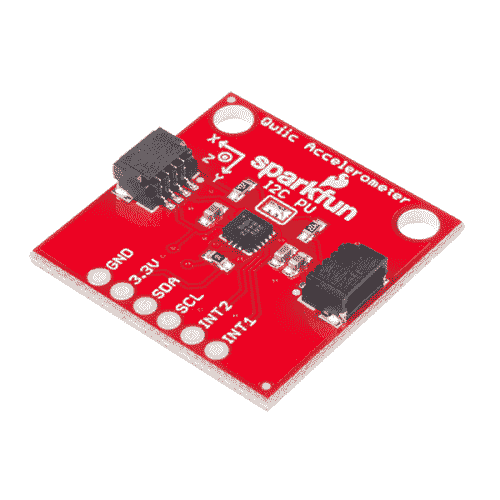
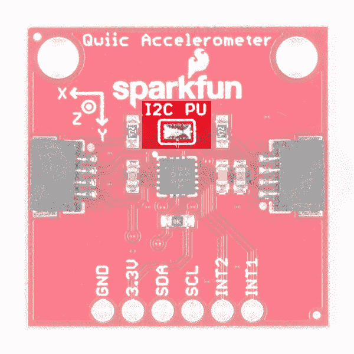
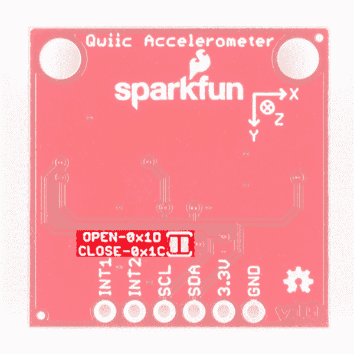
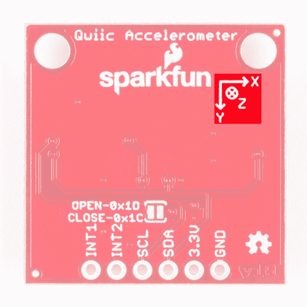
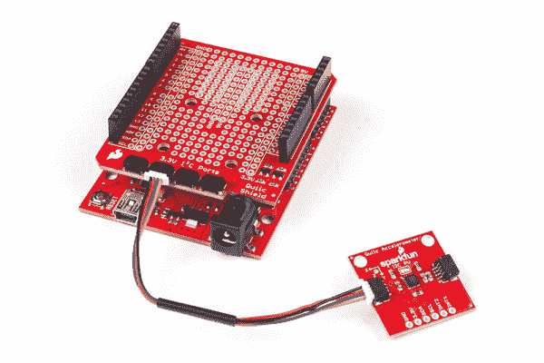
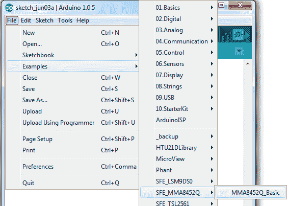
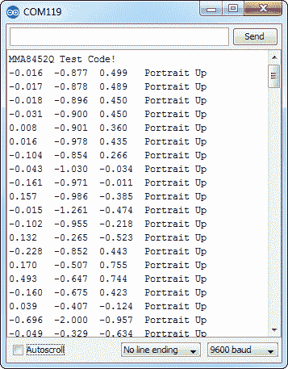

# Qwiic 加速度计(MMA8452Q)连接指南

> 原文：<https://learn.sparkfun.com/tutorials/qwiic-accelerometer-mma8452q-hookup-guide>

## 介绍

飞思卡尔的 [MMA8452Q](https://www.sparkfun.com/products/10953) 是一款智能、低功耗、三轴、电容式微机械加速度计，具有 12 位分辨率。它非常适合任何需要感知方向或运动的项目。我们已经把那个加速度计放在一个[支持 Qwiic 的分线板](https://www.sparkfun.com/products/14587)上，以便更容易与微小的 QFN 封装接口。这是 SparkFun 的 [Qwiic 系统](https://www.sparkfun.com/categories/399)的一部分，所以你不需要做任何焊接来弄清楚东西是如何定向的。

[](https://www.sparkfun.com/products/retired/14587) 

### [【spark fun 三轴加速度计突破- MMA8452Q (Qwiic)](https://www.sparkfun.com/products/retired/14587)

[Retired](https://learn.sparkfun.com/static/bubbles/ "Retired") SEN-14587

这种分线板使得在您的项目中使用微型 MMA8452Q 加速度计通过 I2C 进行通信变得非常容易。

1 **Retired**[Favorited Favorite](# "Add to favorites") 10[Wish List](# "Add to wish list")

MMA8452Q 是一款坚固耐用、功能丰富的三轴加速度计。它支持三种可选的检测范围:2g、4g 或 8g。它还具有方向检测、单击和双击感应以及低功耗模式等功能。这是一个数字传感器——通过启用 Qwiic 的 I ² C 接口进行通信——因此您将通过启用 Qwiic 的 I ² C 端口获得可靠、无噪声的数据。

在本连接指南中，我们将传感器连接到我们选择的微控制器，并读取 X、Y 和 Z 加速度计通道，以计算出我们在这些方向上的加速度。然后，我们将了解如何使用方向检测来确定传感器的方向。

[https://www.youtube.com/embed/v7ke4qhQAXQ/?autohide=1&border=0&wmode=opaque&enablejsapi=1](https://www.youtube.com/embed/v7ke4qhQAXQ/?autohide=1&border=0&wmode=opaque&enablejsapi=1)

### 所需材料

首先，你需要一个微控制器来控制一切。

[](https://www.sparkfun.com/products/13975) 

将**添加到您的[购物车](https://www.sparkfun.com/cart)中！**

 **### [spark fun red board——用 Arduino 编程 T3](https://www.sparkfun.com/products/13975)

[In stock](https://learn.sparkfun.com/static/bubbles/ "in stock") DEV-13975

SparkFun RedBoard 结合了 UNO 的 Optiboot 引导程序的简单性、FTDI 的稳定性和 shield com…

$21.5049[Favorited Favorite](# "Add to favorites") 89[Wish List](# "Add to wish list")****[](https://www.sparkfun.com/products/13907) 

将**添加到您的[购物车](https://www.sparkfun.com/cart)中！**

 **### [SparkFun ESP32 东西](https://www.sparkfun.com/products/13907)

[In stock](https://learn.sparkfun.com/static/bubbles/ "in stock") DEV-13907

SparkFun ESP32 Thing 是 Espressif 的 ESP32 的综合开发平台，ESP32 是他们的超级充电版本…

$23.5069[Favorited Favorite](# "Add to favorites") 83[Wish List](# "Add to wish list")****[](https://www.sparkfun.com/products/13774) 

将**添加到您的[购物车](https://www.sparkfun.com/cart)中！**

 **### [【粒子光子】](https://www.sparkfun.com/products/13774)

[Out of stock](https://learn.sparkfun.com/static/bubbles/ "out of stock") WRL-13774

Particle 的 IoT(物联网)硬件开发板 Photon 提供了构建互联网络所需的一切…

$19.0032[Favorited Favorite](# "Add to favorites") 51[Wish List](# "Add to wish list")****[](https://www.sparkfun.com/products/retired/13825) 

### [树莓派 3](https://www.sparkfun.com/products/retired/13825)

[Retired](https://learn.sparkfun.com/static/bubbles/ "Retired") DEV-13825

每个人都知道并喜欢 Raspberry Pi，但如果您不需要额外的外设来使其无线化会怎么样呢？覆盆子…

92 **Retired**[Favorited Favorite](# "Add to favorites") 97[Wish List](# "Add to wish list")****** ******现在，要进入 Qwiic 生态系统，关键是以下 Qwiic 屏蔽之一，以符合您对微控制器的偏好:

[](https://www.sparkfun.com/products/14352) 

将**添加到您的[购物车](https://www.sparkfun.com/cart)中！**

 **### [ArduinoT3 的 SparkFun Qwiic 盾](https://www.sparkfun.com/products/14352)

[In stock](https://learn.sparkfun.com/static/bubbles/ "in stock") DEV-14352

SparkFun Qwiic Shield 是一种易于组装的板，它提供了一种简单的方法来将 Qwiic Connect 系统与

$7.508[Favorited Favorite](# "Add to favorites") 39[Wish List](# "Add to wish list")****[](https://www.sparkfun.com/products/14459) 

将**添加到您的[购物车](https://www.sparkfun.com/cart)中！**

 **### [树莓派的 SparkFun Qwiic 帽子](https://www.sparkfun.com/products/14459)

[In stock](https://learn.sparkfun.com/static/bubbles/ "in stock") DEV-14459

树莓派的 SparkFun Qwiic 帽子是进入 Qwiic 生态系统的最快捷、最简单的方式，并且仍然适用于

$6.505[Favorited Favorite](# "Add to favorites") 33[Wish List](# "Add to wish list")****[](https://www.sparkfun.com/products/14477) 

将**添加到您的[购物车](https://www.sparkfun.com/cart)中！**

 **### [光子盾](https://www.sparkfun.com/products/14477)

[28 available](https://learn.sparkfun.com/static/bubbles/ "28 available") DEV-14477

SparkFun Qwiic Shield for Photon 是一个易于组装的板，提供了一种简单的方法来整合 Qwiic 系统…

$6.50[Favorited Favorite](# "Add to favorites") 7[Wish List](# "Add to wish list")****** ******你还需要一根 Qwiic 电缆来连接屏蔽层和加速度计，选择适合你需要的长度。

[](https://www.sparkfun.com/products/14427) 

将**添加到您的[购物车](https://www.sparkfun.com/cart)中！**

 **### [Qwiic 线缆- 100mm](https://www.sparkfun.com/products/14427)

[In stock](https://learn.sparkfun.com/static/bubbles/ "in stock") PRT-14427

这是一条 100 毫米长的 4 芯电缆，带有 1 毫米 JST 端接。它旨在将支持 Qwiic 的组件连接在一起…

$1.50[Favorited Favorite](# "Add to favorites") 32[Wish List](# "Add to wish list")****[](https://www.sparkfun.com/products/14429) 

将**添加到您的[购物车](https://www.sparkfun.com/cart)中！**

 **### [Qwiic 线缆- 500mm](https://www.sparkfun.com/products/14429)

[In stock](https://learn.sparkfun.com/static/bubbles/ "in stock") PRT-14429

这是一根 500mm 长的 4 芯电缆，带有 1mm JST 端接。它旨在将支持 Qwiic 的组件连接在一起…

$1.951[Favorited Favorite](# "Add to favorites") 25[Wish List](# "Add to wish list")****[](https://www.sparkfun.com/products/14426) 

将**添加到您的[购物车](https://www.sparkfun.com/cart)中！**

 **### [Qwiic 线缆- 50mm](https://www.sparkfun.com/products/14426)

[In stock](https://learn.sparkfun.com/static/bubbles/ "in stock") PRT-14426

这是一根 50 毫米长的 4 芯电缆，带有 1 毫米 JST 端接。它旨在将支持 Qwiic 的组件连接在一起…

$0.95[Favorited Favorite](# "Add to favorites") 29[Wish List](# "Add to wish list")****[](https://www.sparkfun.com/products/14428) 

### [Qwiic 线缆- 200mm](https://www.sparkfun.com/products/14428)

[Out of stock](https://learn.sparkfun.com/static/bubbles/ "out of stock") PRT-14428

这是一根 200 毫米长的 4 芯电缆，带有 1 毫米 JST 端接。它旨在将支持 Qwiic 的组件连接在一起…

[Favorited Favorite](# "Add to favorites") 21[Wish List](# "Add to wish list")****** ******### 推荐阅读

如果你不熟悉 Qwiic 系统，我们推荐你在这里阅读[以获得一个概述](https://www.sparkfun.com/qwiic)。

| [](https://www.sparkfun.com/qwiic) |
| *[Qwiic 连接系统](https://www.sparkfun.com/qwiic)* |

如果你不熟悉下面的教程，我们也建议你看一看。

[](https://learn.sparkfun.com/tutorials/i2c) [### I2C](https://learn.sparkfun.com/tutorials/i2c) An introduction to I2C, one of the main embedded communications protocols in use today.[Favorited Favorite](# "Add to favorites") 128[](https://learn.sparkfun.com/tutorials/qwiic-shield-for-arduino--photon-hookup-guide) [### Arduino 和光子连接指南的 Qwiic 屏蔽](https://learn.sparkfun.com/tutorials/qwiic-shield-for-arduino--photon-hookup-guide) Get started with our Qwiic ecosystem with the Qwiic shield for Arduino or Photon.[Favorited Favorite](# "Add to favorites") 5

## 硬件概述

让我们来看一下 [MMA8452Q 传感器](https://cdn.sparkfun.com/datasheets/Sensors/Accelerometers/MMA8452Q.pdf)的一些特征，以便我们对它的行为有更多的了解。

| **特性** | **范围** |
| 工作电压 | **1.95V - 3.6V** |
| 目前的 | 7-165 微安 |
| 测定范围 | &plusmn2g，&plusmn4g，&plusmn8g |
| I ² C 地址 | **0x1D(开路跳线，默认)**或 0x1C(闭路跳线) |

### 腿

下表列出了 MMA8452Q 上可用引脚的特性。

| Pin Label | 引脚功能 | 输入/输出 | 笔记 |
| 3.3V | 电源 | 投入 | 应该在 1.95-3.6 伏之间 |
| 国家药品监督管理局 | I ² C 数据信号 | 双向的 | 双向数据线。电压不应超过电源电压(例如 3.3V)。 |
| SCL | I ² C 时钟信号 | 投入 | 主控时钟信号。电压不应超过电源电压(例如 3.3V)。 |
| INT2 | 中断 2 | 输出 | 可编程中断—可以指示数据就绪、方向改变、点击等。 |
| INT1 | 中断 1 | 输出 | 可编程中断—可以指示数据就绪、方向改变、点击等。 |
| GND | 地面 | 投入 | 0V/公共电压。 |

### 可选功能

#### 上拉电阻跳线

Qwiic 加速度计具有板载 I ² C 上拉电阻；如果多个传感器连接到总线并使能上拉电阻，并联等效电阻将产生过强的上拉电阻，使总线无法正常工作。一般来说，如果总线上连接了多个器件，则除一对上拉电阻外，应禁用所有上拉电阻。如果需要断开上拉电阻，可以通过移除下面突出显示的相应跳线上的焊料来移除。

[](https://cdn.sparkfun.com/assets/learn_tutorials/7/3/4/i2cpu.png)

#### 地址选择跳线

电路板背面有一个额外的跳线，如果同一 I ² C 总线上有多个加速度计，它允许 I ² C 从默认的 0x1D 更改为 0x1C。然而，如果你有 2 个以上的加速度计，你将需要 [Qwiic Mux](https://www.sparkfun.com/products/14293) 把它们都放在同一 I ² C 总线上。跳线在下面突出显示。常开时，跳线将 I ² C 地址设置为 0x1D。用焊料闭合跳线将得到 0x1C 的 I ² C 地址。

[](https://cdn.sparkfun.com/assets/learn_tutorials/7/3/4/addr.png)

#### 轴参考

此外，请务必查看主板背面的标签，标签上标明了 X、Y 和 Z 轴的正方向，这样您就可以知道数据的确切含义。

[](https://cdn.sparkfun.com/assets/learn_tutorials/7/3/4/orient.png)

## 硬件装配

如果你还没有组装好你的 Qwiic 盾，现在是时候去上那个教程了。随着盾牌的组装，Sparkfun 的新 Qwiic 环境意味着连接传感器不可能更容易。只需将 qw IC 电缆的一端插入加速度计分接头，另一端插入您选择的 qw IC 屏蔽，您就可以上传草图并计算出您的电路板是如何移动的。它似乎太容易使用了，但这就是为什么我们要这样做！

[](https://cdn.sparkfun.com/assets/learn_tutorials/7/3/4/Qwiic_Accelerometer_Tutorial-03.jpg)

## 示例代码

**注意:**此示例假设您在桌面上使用的是最新版本的 Arduino IDE。如果这是你第一次使用 Arduino，请回顾我们关于[安装 Arduino IDE 的教程。](https://learn.sparkfun.com/tutorials/installing-arduino-ide)如果您之前没有安装 Arduino 库，请查看我们的[安装指南。](https://learn.sparkfun.com/tutorials/installing-an-arduino-library)

我们已经编写了一个 Arduino 库，使与 MMA8452Q 的接口尽可能简单。点击下面的按钮下载库。或者你可以在[库的 GitHub 库](https://github.com/sparkfun/SparkFun_MMA8452Q_Arduino_Library)上下载最新最好的版本。

[Download MMA8452Q Arduino Library (ZIP)](https://github.com/sparkfun/SparkFun_MMA8452Q_Arduino_Library/archive/main.zip)

### 加载示例草图

一旦你安装了 *SFE_MMA8452Q* 库，重启 Arduino。然后进入**文件** > **实例**>**SFE _ MMA 8452 q**>MMA 8452 q _ Basic 打开实例草图。

[](https://cdn.sparkfun.com/assets/learn_tutorials/2/4/9/opening-example.png)

一旦你设置好你的板和串口，上传草图到你的 Arduino。然后**打开[串口监视器](https://learn.sparkfun.com/tutorials/terminal-basics)T3。除了关于传感器方向的一些信息之外，您将开始看到加速度值流过。**

[](https://cdn.sparkfun.com/assets/learn_tutorials/2/4/9/serial-monitor-example.png)

尝试移动传感器来改变这些值。如果它是静止的，平放在桌子上，那么在 z 轴上应该感觉到 1g 的加速度，而其他的感觉在 0 左右。通过旋转棋盘并让他们感受重力的拉力来测试其他轴。

### 使用 SFE_MMA8452Q 库

这里有一些关于使用 MMA8452Q Arduino 库的技巧，这样你就可以把它嵌入到你自己的 Arduino 草图中。

#### 包括库(全局)

首先，您需要在草图中“包含”该库:

```
language:c
#include <Wire.h> // Must include Wire library for I2C
#include <SFE_MMA8452Q.h> // Includes the SFE_MMA8452Q library 
```

该库还要求您在草图中包含`Wire.h`。确保在之前包含了*，并且包含了 *SFE_MMA8452Q.h* 文件。*

#### 创建 MMA8452Q 对象(全局)

一旦包含了这个库，就可以创建一个 MMA8452Q 对象。这行代码将为您完成这项工作:

```
language:c
MMA8452Q accel; // Default MMA8452Q object create. (Address = 0x1D) 
```

或者，您可以在此参数中定义 MMA8452Q 的 7 位 **I ² C 地址**，使用以下代码行之一:

```
language:c
MMA8452Q accel(0x1C); // Initialize the MMA8452Q with an I2C address of 0x1C (SA0=0)
MMA8452Q accel(0x1D); // Initialize the MMA8452Q with an I2C address of 0x1D (SA0=1) 
```

但是，如果您没有接触[地址跳线](https://learn.sparkfun.com/tutorials/qwiic-accelerometer-hookup-guide/hardware-overview#address-jumper)(意味着“SA0”引脚连接到 VCC)，您可以调用前面显示的默认(无参数)构造函数。

#### 初始化 MMA8452Q(设置)

最后，在草图的`setup()`函数中，您可以使用`init()`函数初始化加速度计。`init()`功能验证与加速度计的通信，并设置**满量程范围**和**输出数据速率**。

同样，您有几个选择。您可以使用如下的简单声明。这将初始化加速度计，量程为 **2g** ，输出数据速率为 **800 Hz** (将加速度计调到最大！):

```
language:c
accel.init(); // Default init: +/-2g and 800Hz ODR 
```

如果您想指定加速度和输出数据速率，您可以使用如下的`init()`函数:

```
language:c
accel.init([scale], [odr]); // Init and customize the FSR and ODR 
```

标度可以是`SCALE_2G`、`SCALE_4G`或`SCALE_8G`。“odr”变量可以是`ODR_800`、`ODR_400`、`ODR_200`、`ODR_100`、`ODR_50`、`ODR_12`、`ODR_6`或`ODR_1`，分别将数据速率设置为 800、400、200、100、50、12.5、6.25 或 1.56 Hz。

#### 读取和使用值

一旦你设置好加速度计，你就可以立即开始读取来自芯片的数据。读取和使用这些值是一个两步过程。首先，调用`read()`函数来获取值。

```
language:c
accel.read(); // Update acceleromter data 
```

*在*之后，你已经调用了`read()`函数，你可以使用两组数值中的任何一组来使用数据。从`x`、`y`和`z`类变量读取将返回直接从加速度计读取的有符号 12 位整数。

```
language:c
xAcceleration = accel.x; // Read in raw x-axis acceleration data
Serial.print("Acceleration on the x-axis is ");
Serial.println(xAcceleration); 
```

或者，如果您想要一个带有物理单位的值，您可以使用`cx`、`cy`和`cz`类变量。这些是从加速度计读出的**计算的**加速度值；它们将以 g 为单位。

```
language:c
zAcceleration = accel.cz; // Read in calculated z-axis acceleration
Serial.print("Acceleration on the z-axis is: ");
Serial.print(zAcceleration);
Serial.println(" g's"); 
```

记住！那些变量只在调用了`read()`函数的之后被更新*。确保在开始使用加速度值之前发生这种情况。*

#### 阅读纵向/横向

MMA8452Q 有各种各样漂亮的额外功能，其中之一是**方向检测** -它可以估计它是处于风景模式、肖像模式还是平面模式。

要从加速度计读取纵向/横向数据，使用`readPL()`功能。该函数返回一个字节，该字节将等于`PORTRAIT_U`、`PORTRAIT_D`、`LANDSCAPE_R`、`LANDSCAPE_L`或`LOCKOUT`。

```
language:c
byte pl = accel.readPL();
switch (pl)
{
case PORTRAIT_U:
    Serial.print("Portrait Up");
    break;
case PORTRAIT_D:
    Serial.print("Portrait Down");
    break;
case LANDSCAPE_R:
    Serial.print("Landscape Right");
    break;
case LANDSCAPE_L:
    Serial.print("Landscape Left");
    break;
case LOCKOUT:
    Serial.print("Flat");
    break;
} 
```

如上例所示，您可以使用`if`或`switch`语句来检查加速度计的方位。

## 资源和更进一步

感谢阅读！我们很高兴看到您使用 MMA8452Q 构建的产品。如果您还需要更多与 MMA8452Q 相关的文档，请查阅以下资源:

*   [Qwiic MMA8452Q 原理图(PDF)](https://cdn.sparkfun.com/assets/f/5/1/8/8/Qwiic_Accelerometer-MMA8452Q.pdf)-Qwiic MMA 8452 q 分线板的 PDF 原理图。
*   [Qwiic MMA8452Q Eagle 文件(ZIP)](https://cdn.sparkfun.com/assets/e/8/4/c/8/Qwiic_Accelerometer-MMA8452Q_1.zip)-qw IIC MMA 8452 q 分线板的 PCB 设计文件。
*   [Qwiic 登陆页面](https://www.sparkfun.com/qwiic)
*   [MMA8452Q 数据表(PDF)](http://cdn.sparkfun.com/datasheets/Sensors/Accelerometers/MMA8452Q.pdf) -关于 MMA8452Q 的电气特性、寄存器、通信规范等大量信息。
*   与 MMA8452Q 相关的设计文件和示例代码。
*   库 GitHub Repo
    *   [Arduino 库](https://github.com/sparkfun/SparkFun_MMA8452Q_Arduino_Library/tree/master) -用于 MMA8452Q 的 Arduino 库。
    *   [光子库](https://github.com/sparkfun/SparkFun_MMA8452Q_Particle_Library)-MMA 8452 q 的光子库。
*   [SFE 产品展示区](https://youtu.be/v7ke4qhQAXQ)

你的下一个项目需要一些灵感吗？查看一些相关教程:

[](https://learn.sparkfun.com/tutorials/dungeons-and-dragons-dice-gauntlet) [### 龙与地下城骰子战书](https://learn.sparkfun.com/tutorials/dungeons-and-dragons-dice-gauntlet) A playful, geeky tutorial for a leather bracer that uses a LilyPad Arduino, LilyPad accelerometer, and seven segment display to roll virtual 4, 6, 8, 10, 12, 20, and 100 side dice for gaming.[Favorited Favorite](# "Add to favorites") 9[](https://learn.sparkfun.com/tutorials/das-blinken-top-hat) [### 闪烁的顶部](https://learn.sparkfun.com/tutorials/das-blinken-top-hat) A top hat decked out with LED strips makes for a heck of a wedding gift.[Favorited Favorite](# "Add to favorites") 1[](https://learn.sparkfun.com/tutorials/blynk-board-washerdryer-alarm) [### Blynk 板洗衣机/烘干机警报](https://learn.sparkfun.com/tutorials/blynk-board-washerdryer-alarm) How to configure the Blynk Board and app to notify you when your washer or dryer is done shaking.[Favorited Favorite](# "Add to favorites") 9[](https://learn.sparkfun.com/tutorials/raspberry-pi-zero-helmet-impact-force-monitor) [### Raspberry Pi 零头盔冲击力监控器](https://learn.sparkfun.com/tutorials/raspberry-pi-zero-helmet-impact-force-monitor) How much impact can the human body handle? This tutorial will teach you how to build your very own impact force monitor using a helmet, Raspberry Pi Zero, and accelerometer 2

或者看看这篇博客:

[](https://www.sparkfun.com/news/2961 "August 8, 2019: New LulzBot + new car = new project") [### 今日英语:3D 打印的哈利·波特会说话的头

August 8, 2019](https://www.sparkfun.com/news/2961 "August 8, 2019: New LulzBot + new car = new project")[Favorited Favorite](# "Add to favorites") 1******************