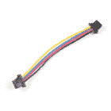

# Qwiic 距离传感器(RFD77402)连接指南

> 原文：<https://learn.sparkfun.com/tutorials/qwiic-distance-sensor-rfd77402-hookup-guide>

## 介绍

[RFD77402](https://www.sparkfun.com/products/14539) 使用红外 VCSEL ( [垂直腔面发射激光器](https://en.wikipedia.org/wiki/Vertical-cavity_surface-emitting_laser) ) TOF ( [飞行时间](https://en.wikipedia.org/wiki/Time_of_flight))模块，能够读取高达 2 米的毫米精度距离。它也是 SparkFun 的 [Qwiic 系统](https://www.sparkfun.com/categories/399)的一部分，所以你不必做任何焊接来计算事物有多远。

[](https://www.sparkfun.com/products/retired/14539) 

### [【spark fun 距离传感器分接头- RFD77402 (Qwiic)](https://www.sparkfun.com/products/retired/14539)

[Retired](https://learn.sparkfun.com/static/bubbles/ "Retired") SEN-14539

SparkFun 距离传感器分线点利用 Simblee 的 RFD77402 3D ToF 传感器模块，为您提供最精确的 m…

1 **Retired**[Favorited Favorite](# "Add to favorites") 11[Wish List](# "Add to wish list")

在本连接指南中，我们将首先从一些基本的距离读数开始，然后我们将添加一个置信度值，以确保传感器不会返回“垃圾”数据。最后，我们将提高采样率以尽可能快地获得读数。

[https://www.youtube.com/embed/v7ke4qhQAXQ/?autohide=1&border=0&wmode=opaque&enablejsapi=1](https://www.youtube.com/embed/v7ke4qhQAXQ/?autohide=1&border=0&wmode=opaque&enablejsapi=1)

### 所需材料

首先，你需要一个微控制器来控制一切。

[](https://www.sparkfun.com/products/13975) 

将**添加到您的[购物车](https://www.sparkfun.com/cart)中！**

 **### [spark fun red board——用 Arduino 编程 T3](https://www.sparkfun.com/products/13975)

[In stock](https://learn.sparkfun.com/static/bubbles/ "in stock") DEV-13975

SparkFun RedBoard 结合了 UNO 的 Optiboot 引导程序的简单性、FTDI 的稳定性和 shield com…

$21.5049[Favorited Favorite](# "Add to favorites") 89[Wish List](# "Add to wish list")****[](https://www.sparkfun.com/products/13907) 

将**添加到您的[购物车](https://www.sparkfun.com/cart)中！**

 **### [SparkFun ESP32 东西](https://www.sparkfun.com/products/13907)

[In stock](https://learn.sparkfun.com/static/bubbles/ "in stock") DEV-13907

SparkFun ESP32 Thing 是 Espressif 的 ESP32 的综合开发平台，ESP32 是他们的超级充电版本…

$23.5069[Favorited Favorite](# "Add to favorites") 83[Wish List](# "Add to wish list")****[](https://www.sparkfun.com/products/13774) 

将**添加到您的[购物车](https://www.sparkfun.com/cart)中！**

 **### [【粒子光子】](https://www.sparkfun.com/products/13774)

[Out of stock](https://learn.sparkfun.com/static/bubbles/ "out of stock") WRL-13774

Particle 的 IoT(物联网)硬件开发板 Photon 提供了构建互联网络所需的一切…

$19.0032[Favorited Favorite](# "Add to favorites") 51[Wish List](# "Add to wish list")****[](https://www.sparkfun.com/products/retired/13825) 

### [树莓派 3](https://www.sparkfun.com/products/retired/13825)

[Retired](https://learn.sparkfun.com/static/bubbles/ "Retired") DEV-13825

每个人都知道并喜欢 Raspberry Pi，但如果您不需要额外的外设来使其无线化会怎么样呢？覆盆子…

92 **Retired**[Favorited Favorite](# "Add to favorites") 97[Wish List](# "Add to wish list")****** ******现在，要进入 Qwiic 生态系统，关键是以下 Qwiic 屏蔽之一，以符合您对微控制器的偏好:

[](https://www.sparkfun.com/products/14352) 

将**添加到您的[购物车](https://www.sparkfun.com/cart)中！**

 **### [ArduinoT3 的 SparkFun Qwiic 盾](https://www.sparkfun.com/products/14352)

[In stock](https://learn.sparkfun.com/static/bubbles/ "in stock") DEV-14352

SparkFun Qwiic Shield 是一种易于组装的板，它提供了一种简单的方法来将 Qwiic Connect 系统与

$7.508[Favorited Favorite](# "Add to favorites") 39[Wish List](# "Add to wish list")****[](https://www.sparkfun.com/products/14459) 

将**添加到您的[购物车](https://www.sparkfun.com/cart)中！**

 **### [树莓派的 SparkFun Qwiic 帽子](https://www.sparkfun.com/products/14459)

[In stock](https://learn.sparkfun.com/static/bubbles/ "in stock") DEV-14459

树莓派的 SparkFun Qwiic 帽子是进入 Qwiic 生态系统的最快捷、最简单的方式，并且仍然适用于

$6.505[Favorited Favorite](# "Add to favorites") 33[Wish List](# "Add to wish list")****[](https://www.sparkfun.com/products/14477) 

将**添加到您的[购物车](https://www.sparkfun.com/cart)中！**

 **### [光子盾](https://www.sparkfun.com/products/14477)

[28 available](https://learn.sparkfun.com/static/bubbles/ "28 available") DEV-14477

SparkFun Qwiic Shield for Photon 是一个易于组装的板，提供了一种简单的方法来整合 Qwiic 系统…

$6.50[Favorited Favorite](# "Add to favorites") 7[Wish List](# "Add to wish list")****** ******您还需要一根 Qwiic 电缆来连接屏蔽层和距离传感器，选择适合您需求的长度。

[](https://www.sparkfun.com/products/14427) 

将**添加到您的[购物车](https://www.sparkfun.com/cart)中！**

 **### [Qwiic 线缆- 100mm](https://www.sparkfun.com/products/14427)

[In stock](https://learn.sparkfun.com/static/bubbles/ "in stock") PRT-14427

这是一条 100 毫米长的 4 芯电缆，带有 1 毫米 JST 端接。它旨在将支持 Qwiic 的组件连接在一起…

$1.50[Favorited Favorite](# "Add to favorites") 32[Wish List](# "Add to wish list")****[](https://www.sparkfun.com/products/14429) 

将**添加到您的[购物车](https://www.sparkfun.com/cart)中！**

 **### [Qwiic 线缆- 500mm](https://www.sparkfun.com/products/14429)

[In stock](https://learn.sparkfun.com/static/bubbles/ "in stock") PRT-14429

这是一根 500mm 长的 4 芯电缆，带有 1mm JST 端接。它旨在将支持 Qwiic 的组件连接在一起…

$1.951[Favorited Favorite](# "Add to favorites") 25[Wish List](# "Add to wish list")****[](https://www.sparkfun.com/products/14426) 

将**添加到您的[购物车](https://www.sparkfun.com/cart)中！**

 **### [Qwiic 线缆- 50mm](https://www.sparkfun.com/products/14426)

[In stock](https://learn.sparkfun.com/static/bubbles/ "in stock") PRT-14426

这是一根 50 毫米长的 4 芯电缆，带有 1 毫米 JST 端接。它旨在将支持 Qwiic 的组件连接在一起…

$0.95[Favorited Favorite](# "Add to favorites") 29[Wish List](# "Add to wish list")****[](https://www.sparkfun.com/products/14428) 

### [Qwiic 线缆- 200mm](https://www.sparkfun.com/products/14428)

[Out of stock](https://learn.sparkfun.com/static/bubbles/ "out of stock") PRT-14428

这是一根 200 毫米长的 4 芯电缆，带有 1 毫米 JST 端接。它旨在将支持 Qwiic 的组件连接在一起…

[Favorited Favorite](# "Add to favorites") 21[Wish List](# "Add to wish list")****** ******### 推荐阅读

如果你不熟悉 Qwiic 系统，我们推荐你在这里阅读[以获得一个概述](https://www.sparkfun.com/qwiic)。

| [](https://www.sparkfun.com/qwiic) |
| *[Qwiic 连接系统](https://www.sparkfun.com/qwiic)* |

如果你不熟悉下面的教程，我们也建议你看一看。

[](https://learn.sparkfun.com/tutorials/i2c) [### I2C](https://learn.sparkfun.com/tutorials/i2c) An introduction to I2C, one of the main embedded communications protocols in use today.[Favorited Favorite](# "Add to favorites") 128[](https://learn.sparkfun.com/tutorials/qwiic-shield-for-arduino--photon-hookup-guide) [### Arduino 和光子连接指南的 Qwiic 屏蔽](https://learn.sparkfun.com/tutorials/qwiic-shield-for-arduino--photon-hookup-guide) Get started with our Qwiic ecosystem with the Qwiic shield for Arduino or Photon.[Favorited Favorite](# "Add to favorites") 5

## 硬件概述

让我们先来看看我们正在处理的 [RFD77402 传感器](https://cdn.sparkfun.com/assets/a/d/3/e/2/Simblee_RFD77402_Datasheet_Rev_1-8__1_.pdf)的一些特性，这样我们就知道电路板会有什么结果了。

| **特性** | **范围** |
| 工作电压 | **3.3V** |
| 目前的 | 10Hz 时平均 7 mA |
| 测定范围 | 约 50 毫米至 2000 毫米 |
| 精确 | +/-10% |
| 光源 | 850nm VCSEL |
| I ² C 地址 | 0x4C |
| 视野 | 55 度 |
| 照明区 | 23 度 |
| 最大读取速率 | 10Hz(我们在实践中已经看到高达 20Hz) |

### 腿

下表列出了 RFD77402 的所有引脚及其功能。

| 别针 | 描述 | 方向 |
| GND | 地面 | 在…里 |
| 3.3V | 力量 | 在…里 |
| 国家药品监督管理局 | 数据 | 在…里 |
| SCL | 时钟 | 在…里 |
| INT | 中断，当数据就绪时变为低电平。 | 在外 |

### 可选功能

RFD77402 分线点具有板载 I ² C 上拉电阻；如果多个传感器连接到总线并使能上拉电阻，并联等效电阻将产生过强的上拉电阻，使总线无法正常工作。一般来说，如果总线上连接了多个器件，则除一对上拉电阻外，应禁用所有上拉电阻。如果需要断开上拉电阻，可以通过移除下面突出显示的相应跳线上的焊料来移除。

[](https://cdn.sparkfun.com/assets/learn_tutorials/7/2/9/PU.png)

## 硬件装配

如果你还没有组装好你的 Qwiic 盾，现在是时候去上那个教程了。随着盾牌的组装，Sparkfun 的新 Qwiic 环境意味着连接传感器不可能更容易。只需将 Qwiic 电缆的一端插入 RFD77402 分支，另一端插入 Qwiic 屏蔽，您就可以上传草图，并计算出您离那边的那个东西有多远。它看起来太容易使用了，但这就是为什么我们要这样做！

[](https://cdn.sparkfun.com/assets/learn_tutorials/7/2/9/Distance_Sensor-02.jpg)

## 库概述

**注意:**此示例假设您在桌面上使用的是最新版本的 Arduino IDE。如果这是你第一次使用 Arduino，请回顾我们关于[安装 Arduino IDE 的教程。](https://learn.sparkfun.com/tutorials/installing-arduino-ide)如果您之前没有安装 Arduino 库，请查看我们的[安装指南。](https://learn.sparkfun.com/tutorials/installing-an-arduino-library)

首先，你需要下载 SparkFun 的 RFD77402 库。这可以通过使用下面的按钮或利用 Arduino 库管理器来完成。你也可以在[库的 GitHub 库](https://github.com/sparkfun/SparkFun_RFD77402_Arduino_Library)上下载最新最好的版本。

[Download SparkFun RFD77402 Library (ZIP)](https://github.com/sparkfun/SparkFun_RFD77402_Arduino_Library/archive/master.zip)

在开始之前，让我们检查一下我们库的公共可用功能。

*   **`boolean begin(TwoWire &wirePort = Wire, uint32_t i2cSpeed = I2C_SPEED_STANDARD);`** -用给定的 I ² C 速度初始化给定 I ² C 总线上的 RFD77402 传感器。如果不带任何参数调用，该函数将默认为主要 I ² C 总线和标准 I ² C 速度。
*   **`uint8_t takeMeasurement();`** -进行单次测量并用新数据设置全局变量。
*   **`uint16_t getDistance();`** -将局部变量`distance`返回给调用者。
*   **`uint8_t getValidPixels();`** -返回测量时找到的有效像素数。
*   **`uint16_t getConfidenceValue();`** -返回表示传感器对其报告的距离有多大把握的定性值。
*   **`uint8_t getMode();`** -读取命令操作码并转换到相应的模式。
*   **`boolean goToStandbyMode();`**——告诉 MCPU 进入待机模式。如果成功，则返回 true。
*   **`boolean goToOffMode();`**——告诉 MCPU 去关州。如果成功，则返回 true。
*   **`boolean goToOnMode();`**——告诉 MCPU 去登州。如果成功，则返回 true。
*   **`boolean goToMeasurementMode();`**——告诉 MCPU 进入测量模式。进行测量。如果测量数据准备好了，返回 true。
*   **`uint8_t getPeak();`** -返回 VCSEL 峰值的 4 位值。
*   **`void setPeak(uint8_t peakValue);`** -设置 VCSEL 峰值的 4 位值。
*   **`uint8_t getThreshold();`** -返回 VCSEL 阈值的 4 位值。
*   **`void setThreshold(uint8_t threshold);`** -设置 VCSEL 阈值的 4 位值。
*   **`uint8_t getFrequency();`** -返回 VCSEL 频率的 4 位值。
*   **`void setFrequency(uint8_t threshold);`** -设置 VCSEL 频率的 4 位值。
*   **`uint16_t getMailbox();`**——获取‘MCPU 主机’邮箱里的任何东西。读取前检查中断控制状态寄存器位 5。
*   **`void reset();`** -软件重置设备
*   **`uint16_t getChipID();`** -返回芯片 ID。应为 0xAD01 或更高。
*   **`boolean getCalibrationData();`** -从 MCPU 检索 2 组 27 字节，用于校准参数的计算。将 54 个字节读入校准数组，如果新的校准数据加载成功，则返回 true。
*   **`uint16_t readRegister16(uint8_t addr);`** -从 RFD77402 的给定位置读取两个字节。
*   **`uint8_t readRegister(uint8_t addr);`** -从 RFD77402 的给定位置读取。
*   **`void writeRegister16(uint8_t addr, uint16_t val);`**——向 RFD77402 中的一个点写入一个 16 位值。
*   **`void writeRegister(uint8_t addr, uint8_t val);`**——向 RFD77402 中的一个点写入一个值。

## 示例代码

在上一步中，您应该已经下载了 SparkFun RFD77402 库，如果没有，请返回上一步，继续下载，因为您很快就会需要它。本连接指南介绍了库中包含的 3 个示例。

### 例 1 -基本阅读

示例 1 让我们开始从传感器获取一些基本的距离读数。只需上传下面的示例代码，打开波特率为 9600 的[串行监视器](https://learn.sparkfun.com/tutorials/terminal-basics)，开始获取读数！

```
language:c
#include <SparkFun_RFD77402_Arduino_Library.h> //Use Library Manager or download here: https://github.com/sparkfun/SparkFun_RFD77402_Arduino_Library
RFD77402 myDistance; //Hook object to the library

void setup()
{
  Serial.begin(9600); //Begins Serial communication
  while (!Serial);
  Serial.println("RFD77402 Read Example");

  if (myDistance.begin() == false) //Initializes the sensor. Tells the user if initialization has failed.
  {
    Serial.println("Sensor failed to initialize. Check wiring.");
    while (1); //Freeze!
  }
  Serial.println("Sensor online!");
}

void loop()
{
  myDistance.takeMeasurement(); //Tell sensor to take measurement and populate distance variable with measurement value

  unsigned int distance = myDistance.getDistance(); //Retrieve the distance value

  Serial.print("distance: "); //Print the distance
  Serial.print(distance);
  Serial.print("mm");
  Serial.println();
} 
```

第一个示例只是一个接一个地输出距离，输出应该类似下图。

[](https://cdn.sparkfun.com/assets/learn_tutorials/7/2/9/ex1.PNG)

### 示例 2 -置信度值

第二个例子让我们继续拒绝或接受我们的数据作为一个成功的读数(即传感器没有达到最大限度)。这可以简单地通过使用`getConfidenceValue()`函数来完成，该函数返回一个介于 0 和 2047 之间的值，其中 2047 是“最有把握的”。换句话说，置信值 2047 意味着传感器正在获得非常强的、干净的 TOF 飞行读数。这是忽略任何超出传感器范围的数据的好方法。下面的示例代码将让你开始阅读这些信心指数。该草图还将根据错误代码检查距离值，以查看传感器是否给我们一个错误，如果是，是哪个错误。

```
language:c
#include <SparkFun_RFD77402_Arduino_Library.h> //Use Library Manager or download here: https://github.com/sparkfun/SparkFun_RFD77402_Arduino_Library
RFD77402 myDistance; //Hook object to the library

void setup()
{
  Serial.begin(9600);
  while (!Serial);
  Serial.println("RFD77402 Read Example");

  if (myDistance.begin() == false)
  {
    Serial.println("Sensor failed to initialize. Check wiring.");
    while (1); //Freeze!
  }
  Serial.println("Sensor online!");
}

void loop()
{

  byte errorCode = myDistance.takeMeasurement();
  if (errorCode == CODE_VALID_DATA) //Checks to see that data is not any of the error codes
  {
    unsigned int distance = myDistance.getDistance();
    byte pixels = myDistance.getValidPixels();
    unsigned int confidence = myDistance.getConfidenceValue(); //Pulls the confidence value from the sensor

    Serial.print("distance: ");
    Serial.print(distance);
    Serial.print("mm pixels: ");
    Serial.print(pixels);
    Serial.print(" confidence: ");
    Serial.print(confidence);

//Error Codes are outlined below

    if(distance > 2000) Serial.print(" Nothing sensed");
  }
  else if (errorCode == CODE_FAILED_PIXELS)
  {
    Serial.print("Not enough pixels valid");
  }
  else if (errorCode == CODE_FAILED_SIGNAL)
  {
    Serial.print("Not enough signal");
  }
  else if (errorCode == CODE_FAILED_SATURATED)
  {
    Serial.print("Sensor pixels saturated");
  }
  else if (errorCode == CODE_FAILED_NOT_NEW)
  {
    Serial.print("New measurement failed");
  }
  else if (errorCode == CODE_FAILED_TIMEOUT)
  {
    Serial.print("Sensors timed out");
  }

  Serial.println();
} 
```

将串行监视器打开到 9600 波特应该会产生类似于前面所示的输出。

[](https://cdn.sparkfun.com/assets/learn_tutorials/7/2/9/ex2.PNG)

### 例 3 -快速阅读

以下示例不仅允许您使用距离传感器测量距离，还允许您测量样本之间的时间。启用更快的 I ² C 速度减少了我们与传感器通话的时间，因此我们能够准确地测量读数之间的时间。这允许用户计算速度甚至加速度，如果他们愿意的话。如果你是物理学新手，请查看[运动方程](https://en.wikipedia.org/wiki/Equations_of_motion)以获得更好的解释。

在下面的例子中，注意两件事，第一件是在`setup()`函数中。注意我们如何调用一个非默认的`begin()`函数，用`I2C_SPEED_FAST`初始化传感器，这增加了 I ² C 总线上的时钟速度。第二件要注意的事情是我们的`void loop()`开头的三行，它启动定时器功能，并允许我们知道读数之间的时间。

```
language:c
#include <SparkFun_RFD77402_Arduino_Library.h> //Use Library Manager or download here: https://github.com/sparkfun/SparkFun_RFD77402_Arduino_Library
RFD77402 myDistance; //Hook object to the library

void setup()
{
  Serial.begin(115200);
  while (!Serial);
  Serial.println("RFD77402 Read Example");

  //Initialize sensor. Tell it use the Wire port (Wire1, Wire2, softWire, etc) and at 400kHz (I2C_SPEED_FAST or _NORMAL)
  if (myDistance.begin(Wire, I2C_SPEED_FAST) == false)
  {
    Serial.println("Sensor failed to initialize. Check wiring.");
    while (1); //Freeze!
  }
  Serial.println("Sensor online!");
}

void loop()
{
  long startTimer = millis();
  byte errorCode = myDistance.takeMeasurement();
  long timeDelta = millis() - startTimer;

  if (errorCode == CODE_VALID_DATA)
  {
    unsigned int distance = myDistance.getDistance();
    byte pixels = myDistance.getValidPixels();
    unsigned int confidence = myDistance.getConfidenceValue();

    Serial.print("distance: ");
    Serial.print(distance);
    Serial.print("mm timeDelta: ");
    Serial.print(timeDelta);

    if(distance > 2000) Serial.print(" Nothing sensed");
  }
  else if (errorCode == CODE_FAILED_PIXELS)
  {
    Serial.print("Not enough pixels valid");
  }
  else if (errorCode == CODE_FAILED_SIGNAL)
  {
    Serial.print("Not enough signal");
  }
  else if (errorCode == CODE_FAILED_SATURATED)
  {
    Serial.print("Sensor pixels saturated");
  }
  else if (errorCode == CODE_FAILED_NOT_NEW)
  {
    Serial.print("New measurement failed");
  }
  else if (errorCode == CODE_FAILED_TIMEOUT)
  {
    Serial.print("Sensors timed out");
  }

  Serial.println();
} 
```

将串行监视器打开到 115200 波特应该会产生类似下图的结果。

[](https://cdn.sparkfun.com/assets/learn_tutorials/7/2/9/ex3.PNG)

## 资源和更进一步

既然你已经确切地知道那个东西有多远了，是时候把它纳入你自己的项目了！有关 Qwiic 距离传感器(RFD77402)的更多信息，请查看以下链接:

*   [Qwiic 距离传感器(RFD77402)原理图(PDF)](https://cdn.sparkfun.com/assets/7/d/1/e/a/RFD77402_TOF_Sensor_Breakout.pdf)
*   [Qwiic 距离传感器(RFD77402) KiCad 文件(ZIP)](https://cdn.sparkfun.com/assets/0/1/f/4/a/RFD77402_ToF_Sensor.zip)
*   [Qwiic 距离传感器(RFD77402)数据手册(PDF)](https://cdn.sparkfun.com/assets/a/d/3/e/2/Simblee_RFD77402_Datasheet_Rev_1-8__1_.pdf)
*   [Qwiic 系统登陆页面](https://www.sparkfun.com/qwiic)
*   [SparkFun Qwiic 距离传感器(RFD77402) GitHub 存储库](https://github.com/sparkfun/Qwiic_Distance_RFD77402)-qw IIC qw IIC 距离传感器(RFD77402)的电路板设计文件。
*   [RFD77402 Arduino 库 GitHub Repo](https://github.com/sparkfun/SparkFun_RFD77402_Arduino_Library)
    *   [SparkFun RFD77402 库(ZIP)](https://github.com/sparkfun/SparkFun_RFD77402_Arduino_Library/archive/master.zip)
*   [SFE 产品展示区](https://youtu.be/v7ke4qhQAXQ)

你的下一个项目需要一些灵感吗？查看一些相关教程:

[](https://learn.sparkfun.com/tutorials/vl6180-hookup-guide) [### VL6180 连接指南](https://learn.sparkfun.com/tutorials/vl6180-hookup-guide) Get started with your VL6180 based sensor or the VL6180 breakout board.[Favorited Favorite](# "Add to favorites") 6[](https://learn.sparkfun.com/tutorials/building-an-autonomous-vehicle-the-batmobile) [### 建造自主车辆:蝙蝠战车](https://learn.sparkfun.com/tutorials/building-an-autonomous-vehicle-the-batmobile) Documenting a six-month project to race autonomous Power Wheels at the SparkFun Autonomous Vehicle Competition (AVC) in 2016\.[Favorited Favorite](# "Add to favorites") 8[](https://learn.sparkfun.com/tutorials/lidar-lite-v3-hookup-guide) [### LIDAR-Lite v3 连接指南](https://learn.sparkfun.com/tutorials/lidar-lite-v3-hookup-guide) A tutorial for connecting the Garmin LIDAR-Lite v3 or the LIDAR-Lite v3HP to an Arduino to measure distance.[Favorited Favorite](# "Add to favorites") 6******************