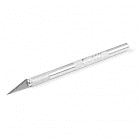

# 如何使用跳线焊盘和 PCB 走线

> 原文：<https://learn.sparkfun.com/tutorials/how-to-work-with-jumper-pads-and-pcb-traces>

## 介绍

处理 PCB 跳线焊盘和走线是一项基本技能。在本教程中，您将学习如何切割 PCB 走线，并在焊盘之间添加一个焊料跳线来重新布线连接。您还将学习如何在迹线损坏时用绿线法修复迹线。

*[Pete](https://www.sparkfun.com/users/19939) Cutting a Trace on the SparkFun Lumenati Boards*

### 推荐阅读

如果您不熟悉以下概念，我们建议您在继续之前查看这些教程。

 [### 如何焊接:通孔焊接](https://learn.sparkfun.com/tutorials/how-to-solder-through-hole-soldering) This tutorial covers everything you need to know about through-hole soldering.[Favorited Favorite](# "Add to favorites") 70 [### PCB 基础知识](https://learn.sparkfun.com/tutorials/pcb-basics) What exactly IS a PCB? This tutorial will breakdown what makes up a PCB and some of the common terms used in the PCB world.[Favorited Favorite](# "Add to favorites") 50 [### 什么是电路？](https://learn.sparkfun.com/tutorials/what-is-a-circuit) Every electrical project starts with a circuit. Don't know what a circuit is? We're here to help.[Favorited Favorite](# "Add to favorites") 82 [### 如何使用万用表](https://learn.sparkfun.com/tutorials/how-to-use-a-multimeter) Learn the basics of using a multimeter to measure continuity, voltage, resistance and current.[Favorited Favorite](# "Add to favorites") 67

### 所需材料

要学习本教程，您需要以下材料:

 

将**添加到您的[购物车](https://www.sparkfun.com/cart)中！**

 **### 

[In stock](https://learn.sparkfun.com/static/bubbles/ "in stock") PRT-11367

各种颜色的电线:你知道这是一个美丽的东西。六种不同颜色的硬纸板实芯焊丝…

$21.5037[Favorited Favorite](# "Add to favorites") 86[Wish List](# "Add to wish list")**** 

将**添加到您的[购物车](https://www.sparkfun.com/cart)中！**

 **### [-数字万用表基础](https://www.sparkfun.com/products/12966)

[In stock](https://learn.sparkfun.com/static/bubbles/ "in stock") TOL-12966

数字万用表(DMM)是每个电子爱好者的必备工具。斯帕克芬数字万用表，高…

$16.50 $9.9023[Favorited Favorite](# "Add to favorites") 57[Wish List](# "Add to wish list")**** 

将**添加到您的[购物车](https://www.sparkfun.com/cart)中！**

 **### [无铅焊料- 15 克管](https://www.sparkfun.com/products/9163)

[In stock](https://learn.sparkfun.com/static/bubbles/ "in stock") TOL-09163

这是你的无铅焊料的基本管，带有不干净的水溶性树脂芯。0.031 英寸规格，15 克

$3.954[Favorited Favorite](# "Add to favorites") 14[Wish List](# "Add to wish list")**** 

将**添加到您的[购物车](https://www.sparkfun.com/cart)中！**

 **### [烙铁- 30W(美国，110V)](https://www.sparkfun.com/products/9507)

[33 available](https://learn.sparkfun.com/static/bubbles/ "33 available") TOL-09507

这是一个非常简单的固定温度，快速加热，30W 110/120 VAC 烙铁。我们真的很喜欢使用更贵的 iro…

$10.957[Favorited Favorite](# "Add to favorites") 21[Wish List](# "Add to wish list")**** 

将**添加到您的[购物车](https://www.sparkfun.com/cart)中！**

 **### [爱好刀](https://www.sparkfun.com/products/9200)

[In stock](https://learn.sparkfun.com/static/bubbles/ "in stock") TOL-09200

就像一把 Xacto 刀，只是更好。我们在处理多氯联苯时广泛使用这些技术。这些小刀子很适合切割…

$3.502[Favorited Favorite](# "Add to favorites") 18[Wish List](# "Add to wish list")********** **********## 什么是跳线？

跳线是一种电气连接，用于断开或闭合两点或多点之间的电路。根据 PCB 的不同，可以在设计中添加跳线来改变电路板的默认值:

*   串行 UART
*   I ² C 地址
*   精力
*   电压电平
*   上拉电阻
*   方式

### 跳线垫

下面是一些用于 SparkFun 板的 1x2 和 1x3 跳线垫示例。焊盘之间的间距通常很近，便于添加焊料。

|  |  |  |
| *[Sunny Buddy](https://www.sparkfun.com/products/12885) w/ JP1 闭合跳线，JP2 打开跳线垫* | *[5V FTDI](https://www.sparkfun.com/products/9716) 带 1x3 开和关跳线垫* | *[Si7021 湿度和温度传感器](https://www.sparkfun.com/products/13763) w/ 1x3 闭合 I ² C 拉起跳线垫* |

### 带有电镀通孔焊盘的跳线

然而，对于跳高运动员来说，情况可能并不总是如此。标准 0.1 英寸间距的针脚可以有更宽的间隙，或者开发板的针脚可以位于不同的位置。可能需要额外的焊料、2 针跳线块和跳线进行连接。

|  |  |  |
| *使用[可咬合原型板](https://www.sparkfun.com/products/13268)的定制电缆适配器，在电线和连接器之间使用焊接跳线。* | *[电动 Imp 分接头](https://www.sparkfun.com/products/12886)带有割台上的 2 针跳线* | *[GPS 记录器屏蔽](https://www.sparkfun.com/products/13750)带软件串行重新路由带跳线* |

## 在跳线焊盘之间切割走线

找到要断开的跟踪。跳线的功能因电路板的设计而异。有关更多信息，请尝试查看您的主板的相关文档。

在本例中，我们将查看 [5V FTDI 基本分线点](https://www.sparkfun.com/products/9716)，以将默认电压水平从 5V 调整到 3.3V。电路板背面有三个焊盘。如果仔细观察 5V FTDI 分线点的背面，默认情况下，中间和右边的焊盘通过一条走线连接在一起。在 3.3V FTDI 上，走线默认连接到 3.3V。

使用[业余爱好刀](https://www.sparkfun.com/products/9200)，小心地来回移动刀片穿过小痕迹，切断红色阻焊膜下的连接。

**Caution!** When cutting a trace, be careful not to cut any adjacent traces, pads, and your hand! The metal blade on a hobby knife is sharp so make sure to take your time.

There is a [ceramic blade](https://www.sparkfun.com/products/14508) available as an alternative to reduce the risk of injury.

## 添加焊接跳线

要添加有意的焊接跳线，请将烙铁的尖端放在 3.3V 侧(相对于面向下的接头引脚的左侧焊盘)和中心焊盘上。

如果您决定将 FTDI 设置回默认的 5V，只需用烙铁加热有意的焊接跳线，并将焊料移回右侧。如有必要，请随意添加更多的焊料。

某些 PCB 已经有一个焊接跳线连接焊盘。您可能只需要通过移除焊接跳线来调整连接。

## 测试连接

在给 PCB 通电之前，通过用[万用表](https://www.sparkfun.com/products/12966)测试连接，确保跳线焊盘之间的走线已经被切断。

将万用表设置为测量导通性后，将一支探针放在中间焊盘上，另一支放在右侧焊盘上。如果迹线没有完全切断，万用表的蜂鸣器会发出响声。如果迹线被完全切断，就可以给电路板供电了！

有关使用万用表测试连续性的更多信息，请查看我们的万用表教程。

[Multimeter Continuity Test](https://learn.sparkfun.com/tutorials/how-to-use-a-multimeter#continuity)

## 重新布线和绿线修复

让我们来看看 Nate 关于用电动 Imp 进行[无线 Arduino 编程的教程。在用业余爱好刀修改串行 UART 连接时，一个相邻的走线被意外切断！](https://learn.sparkfun.com/tutorials/wireless-arduino-programming-with-electric-imp#hardware-connections)

看不出问题？这是被切断的连接的特写。

不幸的是，内特走得太快了，TX 追踪到的小恶魔不小心被切断了。在排除故障并使用万用表探测连接后，他发现 TX 没有连接。

用一些[电线](https://www.sparkfun.com/products/11367)、[剥线钳](https://www.sparkfun.com/products/12630)和一些[锁紧镊子](https://www.sparkfun.com/products/12572)，通过连接到帐篷状过孔，迹线被迅速修复。连接修复后，电路板恢复正常并开始工作。

**Tip:** While it was apparent with the Electric Imp Shield, the next available exposed copper connection may by harder to find on more complex boards. Depending on the board that you are repairing, you may need to pull up a board's layout file to highlight the connection.

记住，在切割痕迹时要花费额外的时间和精力，以免切割超过或划伤附近的痕迹！

## 资源和更进一步

现在，您已经知道如何修改跳线焊盘、切割走线和重新布线连接，是时候走出去做一些项目了！

有关从制造错误或意外损坏的焊盘中恢复 PCB 板的更多信息，请查看以下内容。

|  |  |
| 从 [PCB 制造错误](https://www.sparkfun.com/news/1161)中恢复电路板。 | [“绿色”线修复 PCB 设计不良或焊盘损坏的](https://www.sparkfun.com/tutorials/99)。 |

需要一些灵感吗？查看这些 SparkFun 板上实现的跳线垫设计:

*   [二进制爆能器](https://learn.sparkfun.com/tutorials/binary-blaster-assembly-guide#troubleshooting-buttons)
*   [西蒙说 PTH 试剂盒](https://learn.sparkfun.com/tutorials/simon-says-assembly-guide)
*   [西蒙倾斜](https://learn.sparkfun.com/tutorials/simon-tilts-assembly-guide)
*   [GPS 记录器屏蔽](https://learn.sparkfun.com/tutorials/gps-logger-shield-hookup-guide/hardware-overview)
*   [电动 Imp 2 针跳线](https://learn.sparkfun.com/tutorials/electric-imp-breakout-hookup-guide/all#about-the-breakout)
*   [ESP8266 物开发板](https://learn.sparkfun.com/tutorials/esp8266-thing-development-board-hookup-guide)

如果您决定设计自己的跳线垫，请尝试查看跳线垫的 Eagle 包，这些包可以在 SparkFun 的 Eagle 库中的 GitHub 上找到:

[GitHub SparkFun Eagle Library: Jumpers](https://github.com/sparkfun/SparkFun-Eagle-Libraries/blob/master/SparkFun-Jumpers.lbr)**********