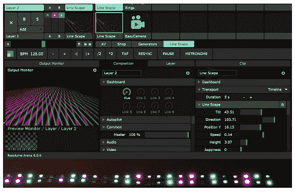

# 使用 Artnet DMX 和 ESP32 驱动像素

> 原文：<https://learn.sparkfun.com/tutorials/using-artnet-dmx-and-the-esp32-to-drive-pixels>

## 介绍

我比一个色盲的人更喜欢让事物发光，我一直在寻找新的有趣的方法来控制不同照明应用的输出，而不必硬编码不同的颜色序列。我希望能够有某种复杂的视觉，然后能够在灯光上播放，而不必考虑显示器中哪个 LED 需要什么颜色。

### 所需材料

要学习本项目教程，您需要以下材料: