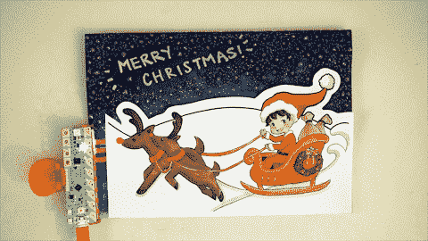
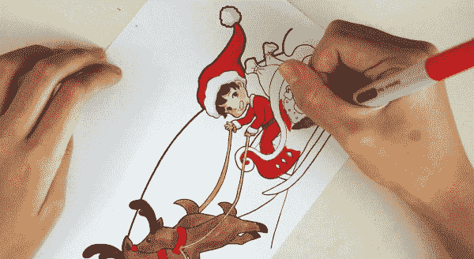
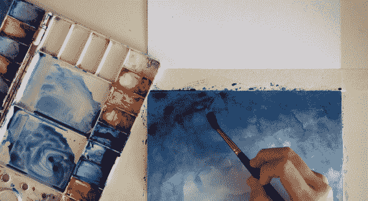
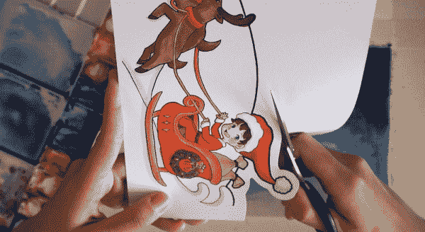
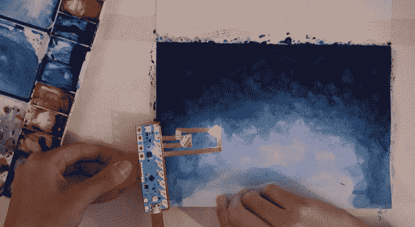
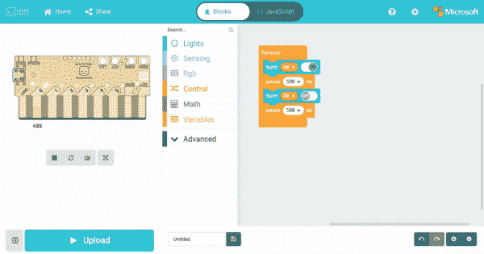
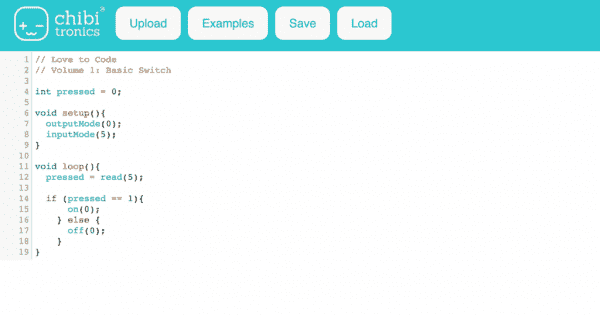
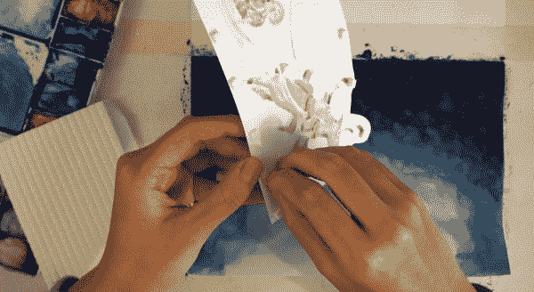
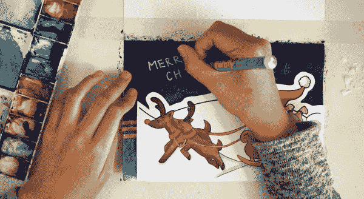
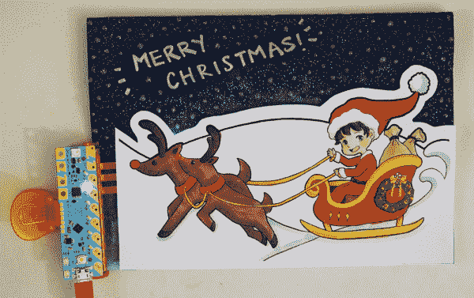

# 用爱来编写节日问候代码

> 原文：<https://learn.sparkfun.com/tutorials/craft-a-holiday-greeting-with-love-to-code>

## 介绍

**Note:** Content and images courtesy of [Chibitronics](https://chibitronics.com/ltc-holiday-2017/).

Chibitronics 的 Shicheng Lim([@ caligomartia](https://www.instagram.com/caligomartia/)on insta gram)设计了一个有趣的彩色发光节日贺卡模板活动，这样你就可以使用 Chibi 芯片制作自己的节日问候，并喜欢编码！

### 建议的视频

如果你在寻找如何制作节日贺卡的灵感，看看石城制作节日贺卡的延时视频吧！

[https://player.vimeo.com/video/247194925?portrait=0](https://player.vimeo.com/video/247194925?portrait=0)

*[从](https://vimeo.com/247194925) [Chibitronics](https://vimeo.com/user46109774) 到 [Vimeo](https://vimeo.com) 制作爱码节日贺卡。*

### 推荐阅读

 [### 纸质电路大指南](https://learn.sparkfun.com/tutorials/the-great-big-guide-to-paper-circuits) Let's take a look at different materials we can use to combine paper crafting and electronics.[Favorited Favorite](# "Add to favorites") 26 [### Chibi Chip and Clip 入门](https://learn.sparkfun.com/tutorials/getting-started-with-chibi-chip-and-clip) This tutorial goes over the how to assemble the Chibitronics' Chibi Chip programmable microcontroller with the Chibi Clip to add more functionality to your paper circuits! Start programming your Chibi Chip by writing code (block-based and text-based) in a browser-based code editor and then transmit code through sound to your board 2

## 材料和工具

要跟随本教程，您将需要以下材料。你可能不需要所有的东西，这取决于你拥有什么。将它添加到您的购物车，通读指南，并根据需要调整购物车。任何拥有[爱编码创意代码包](https://www.sparkfun.com/products/14590)的人都将拥有做这个项目的电子部件。您也可以单独购买这些零件。

*   [赤壁芯片可编程微控制器板](https://www.sparkfun.com/products/14591)
*   [赤壁夹子安装附件](https://www.sparkfun.com/products/14593)
*   5 毫米铜带([普通](https://www.sparkfun.com/products/10561)或[导电胶](https://www.sparkfun.com/products/13827)
*   Chibitronics LED 贴纸( [RYB](https://www.sparkfun.com/products/14594) 或[白色](https://www.sparkfun.com/products/14595)
*   带 USB 和音频连接器的编程电缆
*   USB 电源
    *   (即电脑、墙上插头或便携式 USB 电池充电器)
*   带有 3 毫米音频插孔的编程设备
    *   (即电脑、手机或平板电脑)
*   互联网连接

您还需要:

*   最喜欢的艺术用品来给场景上色
    *   即记号笔、铅笔、钢笔或蜡笔
*   剪刀
*   胶带(最好是双面泡沫胶带)
*   制卡片的纸料

## 步骤 1:打印模板

首先，下载 Chibitronics 节日贺卡模板。卡片模板由两部分组成:前景场景和背景场景。背景场景包含灯光和天空/地平线颜色，这两种颜色都用于突出前景场景。

[Chibitronics Holiday Card Template](https://cdn.sparkfun.com/assets/learn_tutorials/7/5/7/holiday2017-ltc.pdf)

然后打印出两页模板，最好是在厚纸或卡片纸上。

## 第二步:装饰

前景场景中的颜色。

接下来，绘制背景场景。背景是模板的“天空”，所以在这种情况下，石城正在使用水彩绘制夜空。

## 第三步:剪掉

把前景场景剪下来，这样就可以粘贴到背景场景上而不遮挡天空了！

## 步骤 4:创建铜迹线

在背景上制作电路。在这张照片中，石城正在即兴表演。但是，你的模板已经简化电路模板来帮助你了！这也是在粘贴到前景场景之前，通过在 Chibi 芯片上编程和剪辑来测试电路的好时机。

## 第五步:编程赤壁芯片

如果您需要一个简单的例子来说明如何在 led 上放置灯光效果，请根据电路模板的引脚位置来尝试这个 MakeCode 示例。

[Chibi Chip's MakeCode Online Editor: Holiday Greeting Example Code](https://makecode.chibitronics.com/66050-31540-74629-34963)

您也可以在 Microsoft MakeCode 或 ChibiScript Arduino Editor 中创建自己的代码。

|  |  |
| [赤壁芯片的 MakeCode 在线编辑](https://makecode.chibitronics.com/) | [ChibiScript Arduino 在线编辑](https://ltc.chibitronics.com/) |

## 步骤 6:将磁带添加到前台

将双面胶带添加到前景场景的背面。如果可能的话，使用厚泡沫胶带来创建三维效果，同时稍微漫射 LED 的光。

## 步骤 7:完成定制

粘贴前景场景，完成个性化你的节日贺卡。

用电源夹上你的赤壁芯片。

享受你的节日问候！

## 资源和更进一步

感谢您在项目中试用 Chibitronics Love to Code board。他们会喜欢你的反馈，以使体验更好！你对我们有什么想法或意见吗？请在 info@chibitronics.com 把它们寄给我们。快乐制造！

* * *

有关更多信息，请查看以下资源:

*   [Chibitronics 假日卡模板](https://cdn.sparkfun.com/assets/learn_tutorials/7/5/7/holiday2017-ltc.pdf)
*   [MakeCode 赤壁芯片示例代码](https://makecode.chibitronics.com/66050-31540-74629-34963)
*   [Vimeo -爱心代码节日贺卡制作](https://vimeo.com/247194925) -正在制作节日贺卡的延时视频。

你的下一个项目需要一些灵感吗？查看一些相关教程:

 [### 快速照明箱](https://learn.sparkfun.com/tutorials/quick-illuminated-boxes) A quick tutorial to show you how to add LEDs to gift or holiday bags or boxes.[Favorited Favorite](# "Add to favorites") 5 [### 纸质电路大指南](https://learn.sparkfun.com/tutorials/the-great-big-guide-to-paper-circuits) Let's take a look at different materials we can use to combine paper crafting and electronics.[Favorited Favorite](# "Add to favorites") 26 [### 纸质电路引脚](https://learn.sparkfun.com/tutorials/paper-circuit-pin) This quick craft project shows you how to create a circuit using copper tape instead of wire to light up an LED and make a wearable piece of e-craft art.[Favorited Favorite](# "Add to favorites") 10 [### 用爱来编写节日问候代码](https://learn.sparkfun.com/tutorials/craft-a-holiday-greeting-with-love-to-code) Craft your own paper circuit holiday greeting using the LEDs, a Chibi Chip, Love to Code 1