# Chibi Chip and Clip 入门

> 原文：<https://learn.sparkfun.com/tutorials/getting-started-with-chibi-chip-and-clip>

## 介绍

**Note:** Content and images courtesy of [Chibitronics](https://chibitronics.com/).

想给你的纸质电路增加更多功能吗？本教程讲述了如何组装 Chibi 芯片可编程微控制器与 Chibi 剪辑，以增加更多的功能到您的纸电路！我们还将介绍如何在基于浏览器的代码编辑器中编写代码(基于块和基于文本),然后通过声音将代码传输到您的电路板，从而对 Chibi Chip 微控制器电路板进行编程。

[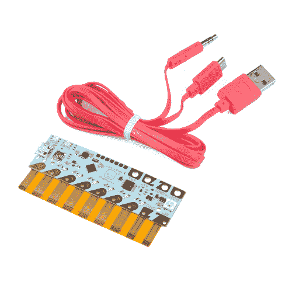](https://www.sparkfun.com/products/retired/14591) 

### [爱来码赤壁芯片单片机板](https://www.sparkfun.com/products/retired/14591)

[Retired](https://learn.sparkfun.com/static/bubbles/ "Retired") DEV-14591

赤壁芯片是 LTC 系统的心脏。您可以使用赤壁芯片为您的赤壁灯 LED 贴纸带来生命…

**Retired**[Favorited Favorite](# "Add to favorites") 4[Wish List](# "Add to wish list")[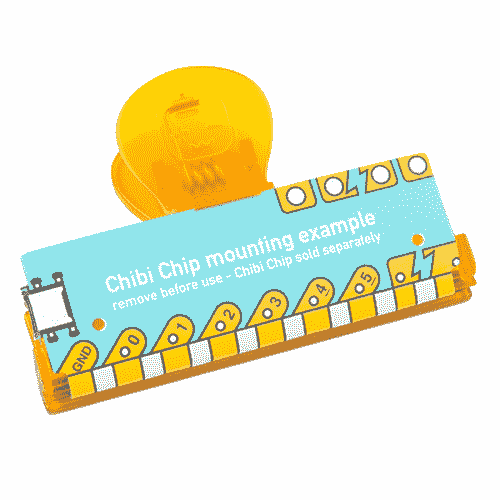](https://www.sparkfun.com/products/retired/14593) 

### [爱来码赤壁夹装裱配件](https://www.sparkfun.com/products/retired/14593)

[Retired](https://learn.sparkfun.com/static/bubbles/ "Retired") DEV-14593

赤壁芯片的基本伴侣，赤壁剪辑安装配件，使快速测试和重复使用的微控制器。

**Retired**[Favorited Favorite](# "Add to favorites") 2[Wish List](# "Add to wish list")

准备好了吗？我们开始吧！

### 所需材料

要跟随本教程，您将需要以下材料。你可能不需要所有的东西，这取决于你拥有什么。将它添加到您的购物车，通读指南，并根据需要调整购物车。

*   赤壁芯片可编程微控制器板
*   赤壁夹子安装附件
*   带 USB 和音频连接器的编程电缆
*   USB 电源
    *   (即电脑、墙上插头或便携式 USB 电池充电器)
*   带有 3 毫米音频插孔的编程设备
    *   (即电脑、手机或平板电脑)
*   互联网连接

### 建议的视频

[https://www.youtube.com/embed/ivo5NyeLNqQ/?autohide=1&border=0&wmode=opaque&enablejsapi=1](https://www.youtube.com/embed/ivo5NyeLNqQ/?autohide=1&border=0&wmode=opaque&enablejsapi=1)

### 推荐阅读

在使用这些电路板之前，您可能需要了解以下概念:

 [### 什么是电路？](https://learn.sparkfun.com/tutorials/what-is-a-circuit) Every electrical project starts with a circuit. Don't know what a circuit is? We're here to help.[Favorited Favorite](# "Add to favorites") 82 [### 电压、电流、电阻和欧姆定律](https://learn.sparkfun.com/tutorials/voltage-current-resistance-and-ohms-law) Learn about Ohm's Law, one of the most fundamental equations in all electrical engineering.[Favorited Favorite](# "Add to favorites") 132 [### 极性](https://learn.sparkfun.com/tutorials/polarity) An introduction to polarity in electronic components. Discover what polarity is, which parts have it, and how to identify it.[Favorited Favorite](# "Add to favorites") 52 [### 纸质电路大指南](https://learn.sparkfun.com/tutorials/the-great-big-guide-to-paper-circuits) Let's take a look at different materials we can use to combine paper crafting and electronics.[Favorited Favorite](# "Add to favorites") 26

## 组装你的赤壁夹

**Note:** The Chibi Chip and Clip will be pre-assembled in the Love to Code Creative Coding Kit.

以下将向您展示如何将 Chibi Chip 可编程板连接到可重复使用的夹子中，为您的纸质电路增加更多功能！

[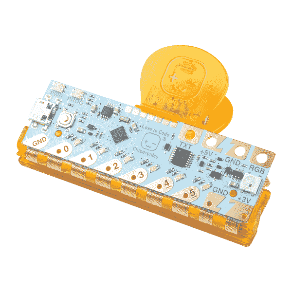](https://cdn.sparkfun.com/assets/learn_tutorials/7/5/6/14590-Love_to_Code_Chibi_Chip_Starting_Kit_Paper_Circuit.jpg)

### 建议观看

[https://www.youtube.com/embed/yaa89aKtxGs/?autohide=1&border=0&wmode=opaque&enablejsapi=1](https://www.youtube.com/embed/yaa89aKtxGs/?autohide=1&border=0&wmode=opaque&enablejsapi=1)

### 硬件连接

取出示例插页。

[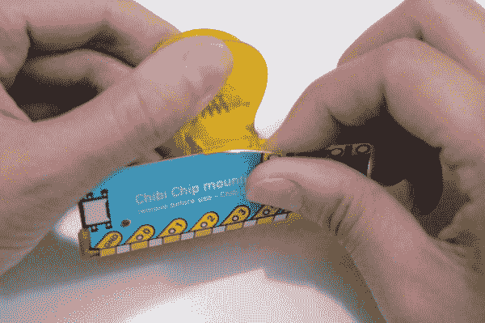](https://cdn.sparkfun.com/assets/learn_tutorials/7/5/6/Chibitronics_ChibiChipClip_1_RemovePaper.jpg)

从夹子夹上撕下胶带。

[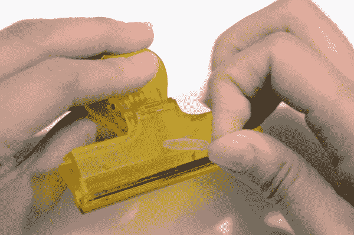](https://cdn.sparkfun.com/assets/learn_tutorials/7/5/6/Chibitronics_ChibiChipClip2_RemoveGlue.jpg)

翻转夹子，使显示“Chibitronics”的平面朝上，然后打开夹子。

[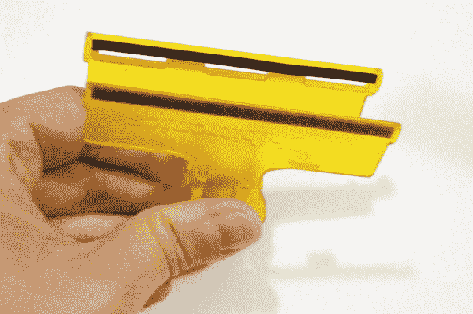](https://cdn.sparkfun.com/assets/learn_tutorials/7/5/6/Chibitronics_ChibiChipClip3_FlipOpenClip.jpg)

将您的 Chibi Chip 平面朝上，将弹性部分插入夹子口的三个凹槽中。

| [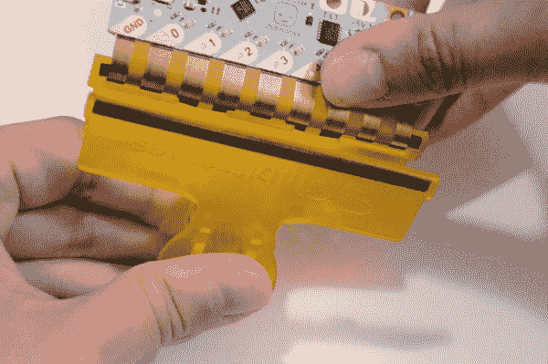](https://cdn.sparkfun.com/assets/learn_tutorials/7/5/6/Chibitronics_ChibiChipClip4_InsertBoard.jpg) | [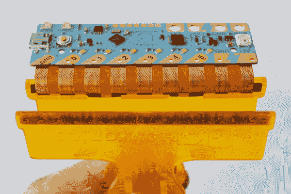](https://cdn.sparkfun.com/assets/learn_tutorials/7/5/6/Chibitronics_ChibiChipClip4_InsertedBoard.jpg) |

合上夹子，轻轻地将电路板向上弯到夹子上。

[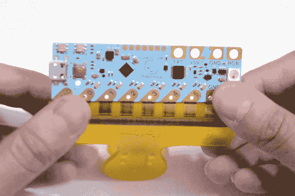](https://cdn.sparkfun.com/assets/learn_tutorials/7/5/6/Chibitronics_ChibiChipClip5_FlipBoard.jpg)

将刚性板滑入夹子顶部的挂钩中。

[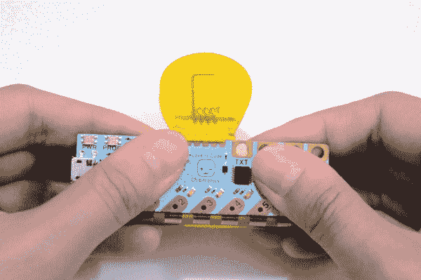](https://cdn.sparkfun.com/assets/learn_tutorials/7/5/6/Chibitronics_ChibiChipClip6_InsertHook.jpg)

你完了！现在您可以打开和关闭夹与您的赤壁芯片重视。

| [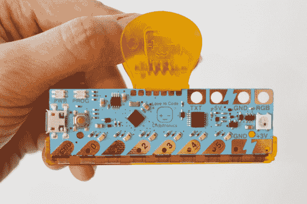](https://cdn.sparkfun.com/assets/learn_tutorials/7/5/6/Chibitronics_ChibiChipClip6_FinalAssemblyClosed.jpg) | [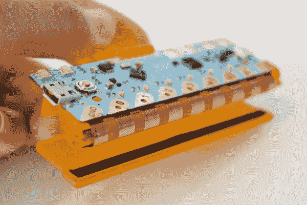](https://cdn.sparkfun.com/assets/learn_tutorials/7/5/6/Chibitronics_ChibiChipClip6_FinalAssemblyOpen.jpg) |

尝试用一个 LED 和与 Chibi 芯片和夹片对齐的轨迹创建一个[简单电路。](https://chibitronics.com/how-to-page/#basic-circuits)

[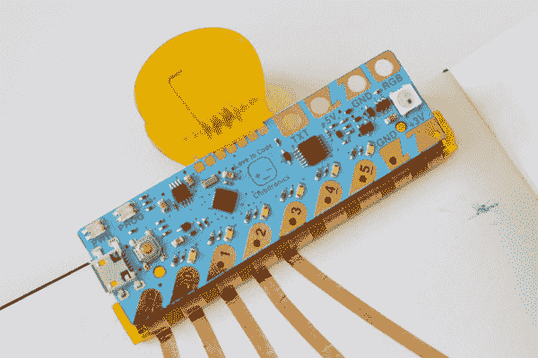](https://cdn.sparkfun.com/assets/learn_tutorials/7/5/6/Chibitronics_ChibiChipClip_Clipped_to_Circuit.jpg)

### 从夹子中取出 Chibi 芯片

如果您需要从夹子中取出 Chibi 芯片，请从夹子中滑出弹性部分，电路板的其余部分将会滑落。

[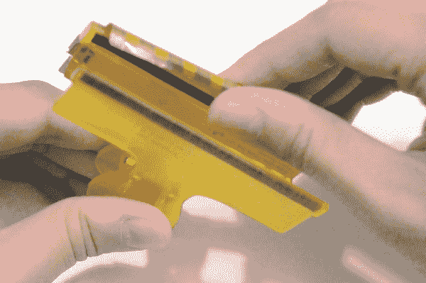](https://cdn.sparkfun.com/assets/learn_tutorials/7/5/6/Chibitronics_ChibiChipClip8_RemoveBoard.jpg)

## 给你的电路供电

你可以用任何一个 **5V** USB 电源给你的赤壁芯片供电！这里有几个例子。

### 爱代码驱动的活页夹

**Heads up!** You will need 3x AA batteries, which are not included with the Love to Code Creative Coding Kit. The Love to Code powered binder can run on regular and rechargeable batteries.

[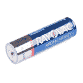](https://www.sparkfun.com/products/retired/9100) 

### [1500 毫安碱性电池——AA](https://www.sparkfun.com/products/retired/9100)

[Retired](https://learn.sparkfun.com/static/bubbles/ "Retired") PRT-09100

这些是 Rayovac 的标准 1.5V AA 碱性电池。想都别想给这些充电。大约 150…

**Retired**[Favorited Favorite](# "Add to favorites") 1[Wish List](# "Add to wish list")

如果你喜欢用电池给活页夹充电，你可以把 USB 线直接插入活页夹。要打开活页夹，请像这样向左滑动电源开关:

[https://player.vimeo.com/video/240610644?byline=0&portrait=0](https://player.vimeo.com/video/240610644?byline=0&portrait=0)

*[插上电源](https://vimeo.com/240610644)[上的](https://vimeo.com/user46109774)和[上的](https://vimeo.com)上的【Vimeo】。*

### 计算机 USB 端口

你也可以使用电脑或笔记本电脑的 USB 端口为 Chibi 芯片供电。

[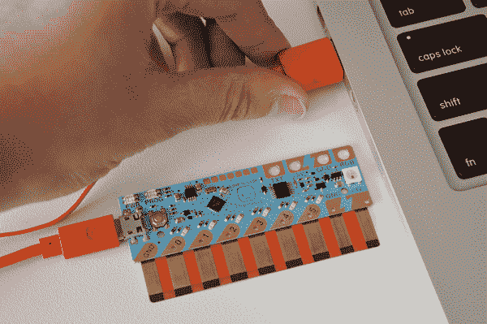](https://cdn.sparkfun.com/assets/learn_tutorials/7/5/6/Chibitronics_PoweringChibiChip_ComputerUSBPort.png)

### USB 墙壁适配器

USB 墙壁适配器也是很好的电源，因为你不需要担心电池耗尽。

[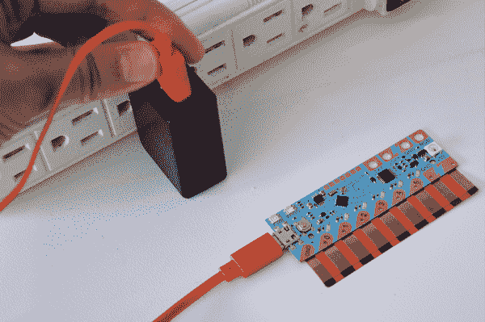](https://cdn.sparkfun.com/assets/learn_tutorials/7/5/6/Chibitronics_PoweringChibiChip_WallAdapter.png)

### USB 电池组

最后，USB 手机充电器电池组作为一个方便的便携式电源工作！确保您的充电器电池组有一个开/关开关，以便您可以保持电源打开。Chibi 芯片在低功率下运行，因此电池组可能会自动关闭。

## 通过音频上传

赤壁芯片使用音频连接器上传代码！让我们复习一下如何建立联系。

### 硬件连接

将 micro-B USB 的另一端插入赤壁芯片板的 USB 连接器。

[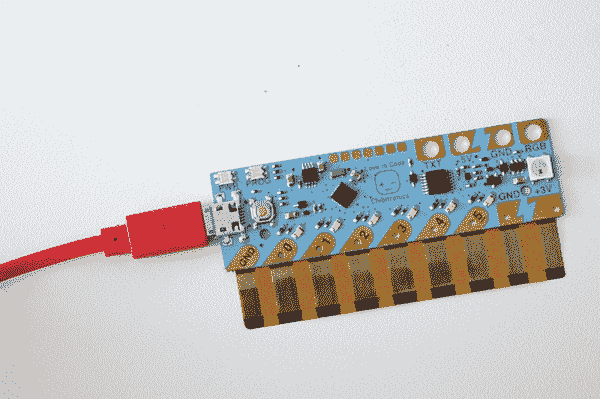](https://cdn.sparkfun.com/assets/learn_tutorials/7/5/6/Chibitronics_ChibiChip_microB_USB.png)

将音频线插入编程设备(如电脑、手机或平板电脑)的音频插孔。

| [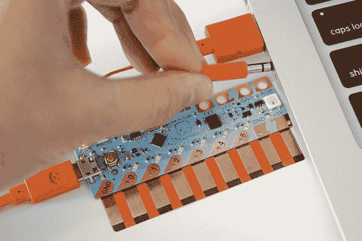](https://cdn.sparkfun.com/assets/learn_tutorials/7/5/6/Chibitronics_ChibiChip_AudioLaptop.png) | [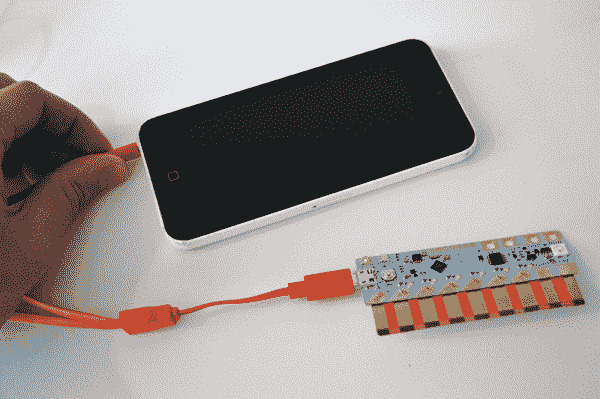](https://cdn.sparkfun.com/assets/learn_tutorials/7/5/6/Chibitronics_ChibiChip_AudioPhone.png) | [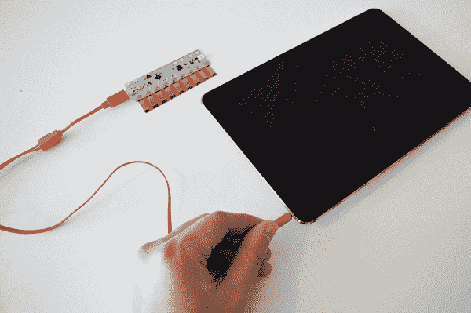](https://cdn.sparkfun.com/assets/learn_tutorials/7/5/6/Chibitronics_ChibiChip_AudioTablet.png) |

取消设备静音，并将音量调至最大。这将确保代码播放到您的赤壁芯片响亮和清晰！

按住 Chibi 芯片上的 **PROG** 按钮，直到 PROG 灯闪烁并保持红色。这将使你的 Chibi 芯片进入编程模式——它会知道监听代码！

| [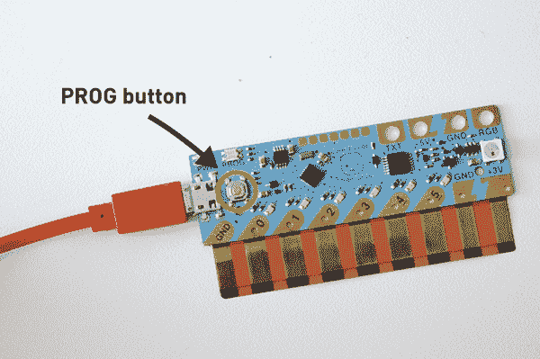](https://cdn.sparkfun.com/assets/learn_tutorials/7/5/6/Chibitronics_ChibiChip_PROGbutton.png) | [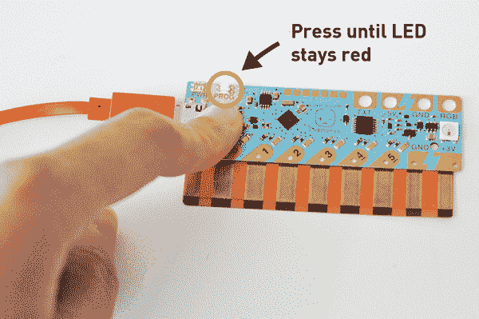](https://cdn.sparkfun.com/assets/learn_tutorials/7/5/6/Chibitronics_ChibiChip_PROGred.png) |

打开您选择的编程编辑器并编写一些代码！您可以使用基于块的代码编辑器或基于文本的代码编辑器。

## 软件:生成代码

要对 Chibi 芯片进行编程，根据您的喜好，有两个选项可供选择。两者都需要互联网连接才能将代码上传到微控制器。

### 使用 Microsoft MakeCode 在线编辑器的基于块的代码

如果您是代码新手，请在 Microsoft MakeCode 中尝试 Chibitronic 基于 Scratch 的基于块的代码编辑器！

要在编辑器中开始编码，请前往[https://makecode.chibitronics.com/](https://makecode.chibitronics.com/)。

[Chibi Chip's MakeCode Online Editor](https://makecode.chibitronics.com/)

## 上传基于块的代码

一旦你开始制作代码，点击“ **+新项目**”。您也可以点击**开始学习！>开始教程**来指导你这个教程。

[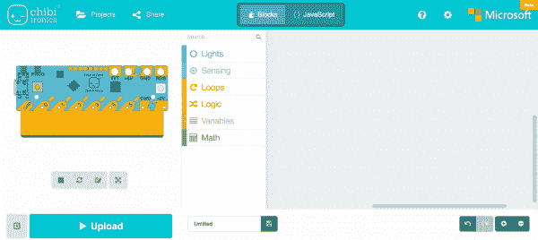](https://cdn.sparkfun.com/assets/learn_tutorials/7/5/6/Chibitronics_ChibiChip_MakeCode.png)

然后拖拽*控件*类别中的*永久*和*暂停*代码块。

[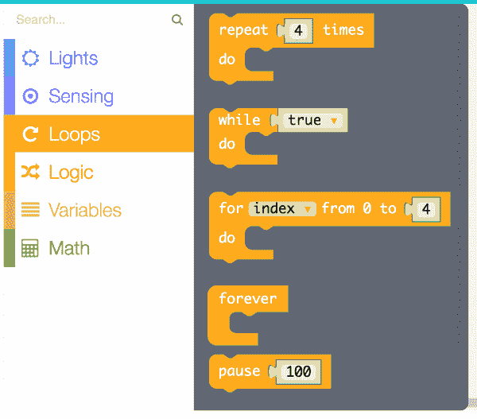](https://cdn.sparkfun.com/assets/learn_tutorials/7/5/6/Chibitronics_ChibiChip_MakeCode_Loop_Functions.png)

然后拖拽两个*设置 D0 到*灯*类别的*块上。将其中一个块的*改为关闭*。

[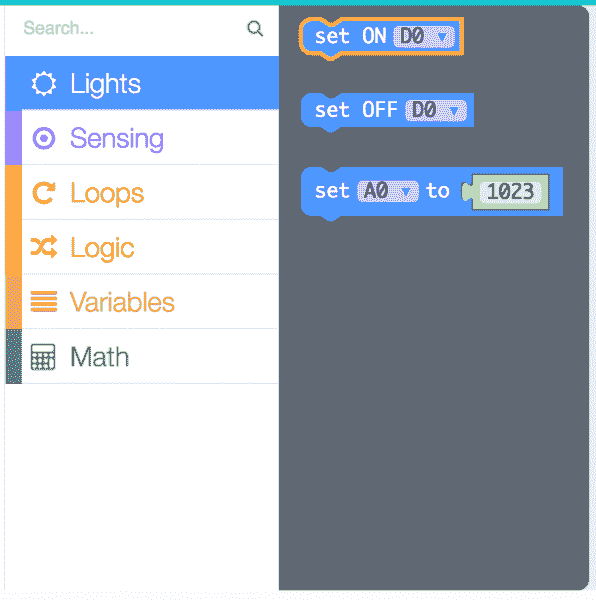](https://cdn.sparkfun.com/assets/learn_tutorials/7/5/6/Chibitronics_ChibiChip_MakeCode_Digital_Pin.png)

将积木连接在一起，使 LED 像这样闪烁。

[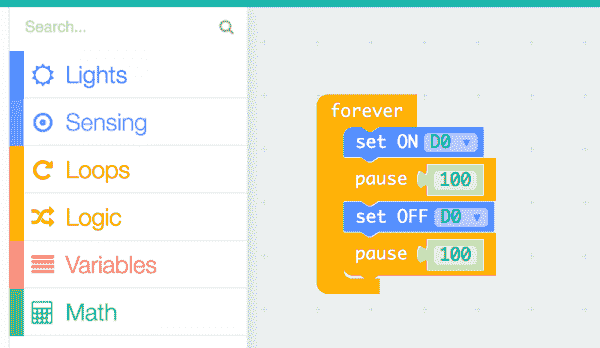](https://cdn.sparkfun.com/assets/learn_tutorials/7/5/6/Chibitronics_ChibiChip_MakeCode_Blink_Example.png)

检查主板上的 PROG 灯是否为红色。如果不是，按下 PROG 按钮，直到灯保持红色。

然后按页面底部的**上传**按钮。

[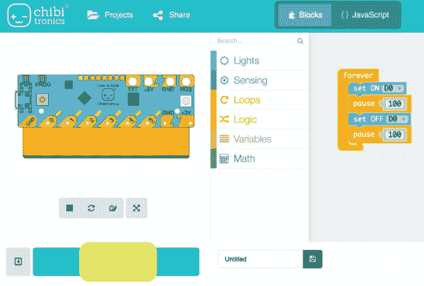](https://cdn.sparkfun.com/assets/learn_tutorials/7/5/6/Chibitronics_ChibiChip_MakeCode_Upload_Blink.png)

现在你应该看到这个声音动画出现在屏幕上。当声音动画停止时，代码完成上传。恭喜你。您已经上传了您的代码！

[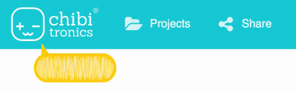](https://cdn.sparkfun.com/assets/learn_tutorials/7/5/6/Chibitronics_ChibiChip_MakeCode_Audio_Upload.png)

现在你的板应该有一个闪烁的灯。

[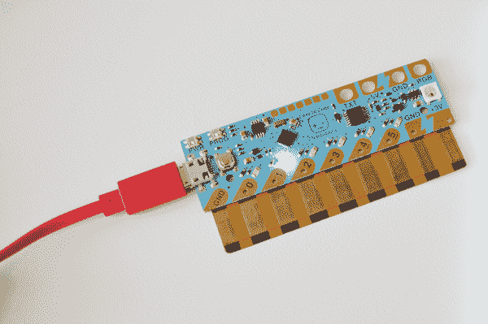](https://cdn.sparkfun.com/assets/learn_tutorials/7/5/6/Chibitronics_ChibiChip__DoneProgramming-2.png)

现在你已经上传了你的第一个程序。尝试玩代码，创造自己的光和闪烁模式！

## 软件:ChibiScript (Arduino)

如果您想从基于文本的编码开始，请尝试使用 ChibiScript，这是一种基于 Arduino 的初学者友好的编码语言。用这个基于文本的编辑器可以直接用 Arduino 编程语言编码！

[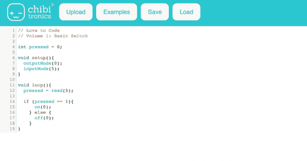](https://cdn.sparkfun.com/assets/learn_tutorials/7/5/6/Chibitronics_ChibiScript_Arduino_Code_Online_Editor_Text_Programming.png)

要开始编码，前往[https://ltc.chibitronics.com/](https://ltc.chibitronics.com/)。

[ChibiScript Arduino Online Editor](https://ltc.chibitronics.com/)

## 上传基于文本的代码

在前往 ChibiScript 后，点击**示例> 1。基础知识>眨眼**打开眨眼示例代码。它看起来应该类似于下图。

[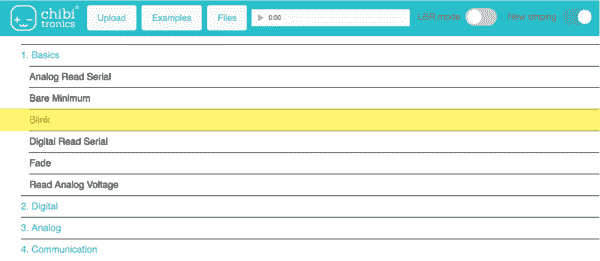](https://cdn.sparkfun.com/assets/learn_tutorials/7/5/6/Chibitronics_ChibiChip_ChibiScript_ArduinoExamples.png)

打开闪烁示例后，您应该会看到一个如何闪烁连接到引脚 0 的 LED 的示例，如下图所示。让我们通过将“`0`”替换为“`1`”来更改 pin。

[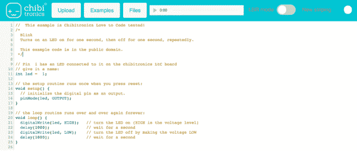](https://cdn.sparkfun.com/assets/learn_tutorials/7/5/6/Chibitronics_ChibiChip_ChibiScript_Arduino_BlinkExample1.png)

检查主板上的 PROG 灯是否为红色。如果不是，按下 PROG 按钮，直到灯保持红色。

最后点击**上传**按钮，将代码播放到你的赤壁芯片中！

[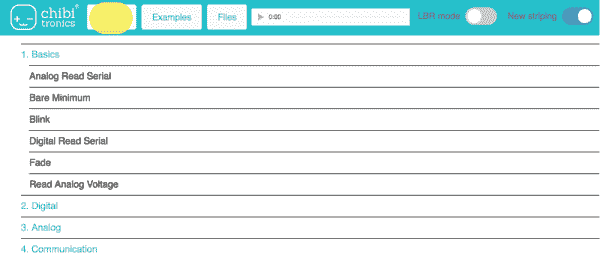](https://cdn.sparkfun.com/assets/learn_tutorials/7/5/6/Chibitronics_ChibiChip_ChibiScript_ArduinoUpload.png)

你会看到一个声音动画出现在屏幕的底部。

[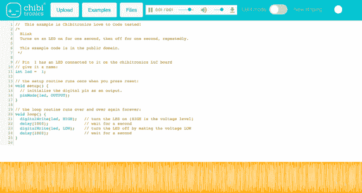](https://cdn.sparkfun.com/assets/learn_tutorials/7/5/6/Chibitronics_ChibiChip_ChibiScript_ArduinoUpload_Audio1.png)

这意味着代码正在上传！代码上传完成后，板上的红色 PROG 灯将变回绿色，让您知道编程已成功完成。现在，您应该会看到 LED 在定义的引脚上闪烁。恭喜你。你已经上传了你的代码。你的赤壁芯片现在应该有一个灯闪烁！

现在你已经上传了你的第一个程序。尝试玩代码，创造自己的光和闪烁模式！

## 爱编码(LtC)

### STEM 重塑:工艺与代码的结合

**Note for Educators:** Love to Code Vol 1 is made available under a CC BY-SA-4.0 license. This means you are free to download, copy, print, translate, and remix elements of the book.

We only require that you attribute Chibitronics, and that any derivative works (such as translations and lesson plans) also use the same [CC BY-SA-4.0 license](http://creativecommons.org/licenses/by-sa/4.0/). Please click the CC link for more details on the license.

查看齐杰对基于 MakeCode 块和基于 ChibiScript/Arduino 文本的编辑器的代码卷 1 的热爱。您将学习使用循环和变量使 LED 灯闪亮和闪烁，制作纸开关并用条件语句对其进行编程，并用多线程编程制作复杂的灯光图案。最后，通过我们的调试章节提高你的编码技能，这一章向你展示了如何在项目中发现和修复问题。

[https://player.vimeo.com/video/238669263?byline=0&portrait=0](https://player.vimeo.com/video/238669263?byline=0&portrait=0)

*[弗恩的故事](https://vimeo.com/238669263)出自[奇比托罗尼](https://vimeo.com/user46109774)于 [Vimeo](https://vimeo.com) 。*

### 爱编码第 1 卷

**Note:** The Love to Code (LtC) Volume 1 storybook is included in the [Love to Code Chibi Chip Starting Kit](https://www.sparkfun.com/products/14590). It uses the Chibiscript and Arduino code.

 

### 爱来码创意编码套装

[Retired](https://learn.sparkfun.com/static/bubbles/ "Retired") KIT-14590

Chibitronics 的 Love to Code 创意编码套件是一种使用 Chibi 芯片微控制器进行编码的有趣方式…

**Retired**

这两个版本都可以免费下载！根据您的编程偏好点击下面的链接，下载 Chibi 芯片开始编码。

| [")](https://cdn.sparkfun.com/assets/learn_tutorials/7/5/6/lovetocode-vol1-makecode.pdf) | [")](https://cdn.sparkfun.com/assets/learn_tutorials/7/5/6/lovetocode-vol1-ChibiScript_Arduino.pdf) |
| [爱来码第 1 卷
MakeCode (PDF)](https://cdn.sparkfun.com/assets/learn_tutorials/7/5/6/lovetocode-vol1-makecode.pdf) | [爱为
ChibiScript 和 Arduino (PDF)](https://cdn.sparkfun.com/assets/learn_tutorials/7/5/6/lovetocode-vol1-ChibiScript_Arduino.pdf) 编码第 1 卷 |

### 走查演示视频

查看 Chibitroinics 演示视频，帮助您浏览各个章节。以下视频是为 Chibiscript 和 Arduino 代码拍摄的。如果你跟随《热爱代码》第一卷 MakeCode Edition，代码将是相似的，但是是基于块的代码。

#### 第 1 章:点亮 LED

[https://player.vimeo.com/video/245953352?byline=0&portrait=0](https://player.vimeo.com/video/245953352?byline=0&portrait=0)

*[第 1 章演练:在](https://vimeo.com/245953352) [Vimeo](https://vimeo.com) 上点亮来自 [Chibitronics](https://vimeo.com/user46109774) 的 LED 。*

#### 第 2 章:代码眨眼！

[https://player.vimeo.com/video/246234513?byline=0&portrait=0](https://player.vimeo.com/video/246234513?byline=0&portrait=0)

*[第二章演练:代码一眨眼！](https://vimeo.com/246234513)从[奇比特龙](https://vimeo.com/user46109774)到[维梅奥](https://vimeo.com)。*

#### 第 3 章:添加交换机

[https://player.vimeo.com/video/247018381?byline=0&portrait=0](https://player.vimeo.com/video/247018381?byline=0&portrait=0)

*[第 3 章演练:添加交换机！(第一部分)](https://vimeo.com/247018381)从[奇比特龙](https://vimeo.com/user46109774)到 [Vimeo](https://vimeo.com) 。*

[https://player.vimeo.com/video/247087931?byline=0&portrait=0](https://player.vimeo.com/video/247087931?byline=0&portrait=0)

*[第 3 章演练:添加交换机！(第二部)](https://vimeo.com/247087931)从[奇比特龙](https://vimeo.com/user46109774)到[维梅奥](https://vimeo.com)*

#### 第四章:淡入淡出！

[https://player.vimeo.com/video/248091911?byline=0&portrait=0](https://player.vimeo.com/video/248091911?byline=0&portrait=0)

*[第 4 章演练:淡入淡出！](https://vimeo.com/248091911)从[奇比特龙](https://vimeo.com/user46109774)到[维梅奥](https://vimeo.com)。*

## 解决纷争

*   如果声音动画没有出现，请尝试刷新页面并再次上传。
*   检查你的音量是否已经调至最大并且没有静音。您可以通过拔掉音频电缆来测试这一点，看看您是否能听到静电干扰(这是您的代码！)当你按上传键的时候。如果您听到声音，请插回音频电缆，然后再次尝试上传。
*   记得在点击上传之前按下板上的 **PROG** 按钮，这样它就处于编程模式，并且 **PROG** 灯为红色。
*   如果您的电路或编译代码有问题，请查看中列出的调试技巧或章节:
    *   [爱代码 MakeCode:调试第 1 卷(PDF pg 70)](https://cdn.sparkfun.com/assets/learn_tutorials/7/5/6/lovetocode-vol1-makecode.pdf)
    *   [喜欢为 ChibiScript 和 Arduino 编写第 1 卷代码:调试(PDF pg 68)](https://cdn.sparkfun.com/assets/learn_tutorials/7/5/6/lovetocode-vol1-ChibiScript_Arduino.pdf)

还有挑战吗？请发送电子邮件至 info@chibitronics.com 的。

## 资源和更进一步

感谢您试用 Chibitronics Love to Code boards。他们会喜欢你的反馈，以使体验更好！你对我们有什么想法或意见吗？请在 info@chibitronics.com 把它们寄给我们。快乐制造！

* * *

既然您已经成功地启动并运行了您的 Chibi 芯片，那么是时候将它合并到您自己的项目中了！有关纸质电路和 Chibi 芯片的更多信息，请查看以下资源:

*   [Chibitronics 官网](https://chibitronics.com/)
    *   教育工作者:课程计划&纸质电路模板 -课程计划和纸质电路模板。
    *   [操作指南](https://chibitronics.com/how-to-page/) -在这里，您可以找到如何开始使用 Chibitronics 产品的分步说明、指南和视频。
    *   [项目库](https://chibitronics.com/projects/) -使用 Chibitronics 产品的附加教程和示例。
*   热爱编码
    *   [微软 MakeCode 编辑器(块)](https://makecode.chibitronics.com/)
    *   [爱到码第 1 卷 MakeCode (PDF)](https://cdn.sparkfun.com/assets/learn_tutorials/7/5/6/lovetocode-vol1-makecode.pdf)
    *   [ChibiScript 和 Arduino 编辑器(文本)](https://ltc.chibitronics.com/)
    *   [爱为 ChibiScript 和 Arduino 编码第 1 卷(PDF)](https://cdn.sparkfun.com/assets/learn_tutorials/7/5/6/lovetocode-vol1-ChibiScript_Arduino.pdf)
*   [Chibitronics GitHub 库](https://github.com/chibitronics)
    *   [赤壁芯片默认固件](https://github.com/chibitronics/ltc-os)
    *   [赤壁芯片示意图(PDF)](https://github.com/chibitronics/ltc-chibichip-hardware/blob/master/micro-ltc-pvt1.pdf)
*   Vimeo: Chibitronics -演示视频
*   [SparkFun 产品展示:Chibitronics 纸和贴纸电路](https://youtu.be/ivo5NyeLNqQ)
*   [SparkFun 纸电路模板](https://learn.sparkfun.com/resources/tags/e-craft)

你的下一个项目需要一些灵感吗？尝试制作自己的 Chibitronics 纸质电路节日贺卡！

 [### 用爱来编写节日问候代码

#### 2018 年 3 月 23 日](https://learn.sparkfun.com/tutorials/craft-a-holiday-greeting-with-love-to-code) Craft your own paper circuit holiday greeting using the LEDs, a Chibi Chip, Love to Code 1

或者查看一些相关教程:

 [### 纸质电路大指南](https://learn.sparkfun.com/tutorials/the-great-big-guide-to-paper-circuits) Let's take a look at different materials we can use to combine paper crafting and electronics.[Favorited Favorite](# "Add to favorites") 26 [### 折纸电路](https://learn.sparkfun.com/tutorials/origami-paper-circuits) A quick tutorial to get you started in the world of light up origami flowers.[Favorited Favorite](# "Add to favorites") 8 [### LED 机器人弹出卡](https://learn.sparkfun.com/tutorials/led-robot-pop-up-card-) Craft a paper circuit pop up card with a cycling RGB LED, battery, and copper tape.[Favorited Favorite](# "Add to favorites") 13 [### Red Hat 仪器套件连接指南](https://learn.sparkfun.com/tutorials/red-hat-instrument-kit-hookup-guide) Get started with the Red Hat Instrument kit 0