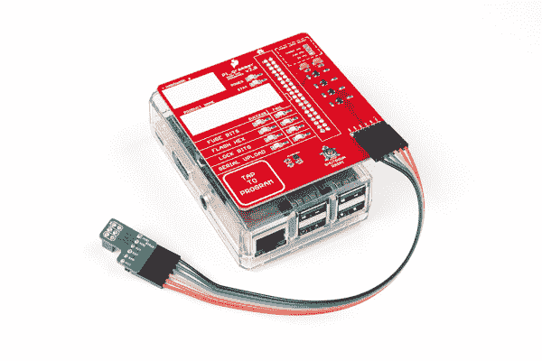
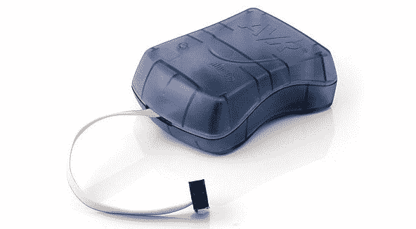
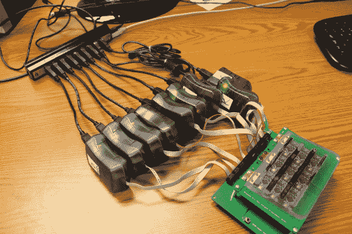
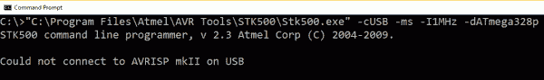

# Raspberry Pi 独立程序员

> 原文：<https://learn.sparkfun.com/tutorials/raspberry-pi-stand-alone-programmer>

## 介绍

借助 Raspberry Pi、Python、avrdude(一个带电缆适配器的定制帽子)的力量，我们开发了自己的 AVR 编程，结果证明非常健壮。除了创建一个独立的解决方案之外，了解更多关于运行 Raspberry Pi“headless”、在启动时自动启动 python 模块、文件管理、文件解析、通用 GPIO 控制、使用 Raspberry Pi 上的内置 SPI 硬件，甚至一些逻辑电平转换，也是一个很好的实验。

如果你想创建自己的“无头”AVR 编程器，所有的硬件设计文件和代码都存放在 GitHub 上:

[SparkFun Pi AVR Programmer Github Repository](https://github.com/sparkfun/SparkFun_Pi_AVR_Programmer_HAT)

提交历史记录讲述了这个故事的很多内容，但是本教程填补了一些空白，并且包括了更多在我们的特定应用程序之外有用的一般信息。

## 背景

在过去的 10 多年里，我们在 SparkFun 产品中使用了一个名为 AVR ISP MKII 的程序员。它为我们提供了很好的服务，但由于一些棘手的问题和最终的停产通知，是时候升级了。

乍一看，有人可能会想:“好吧，ATMEL 最新的程序员是什么？我们就不能把它们换成旧的吗？”用我们目前的编程方法，结果比那要复杂一点。此外，我们在 SparkFun 做了许多 AVR 编程，涉及 50 多个产品，所以这个问题实际上是一个相当大的问题，需要一个可靠的长期解决方案。

我们在生产中大量使用批处理文件。如果我们必须运行一个可执行的 GUI 来对产品上的 IC 进行编程，那么我们会立即尝试找到该程序的命令行版本，并尽可能地实现自动化。

对于 MKII 程序员，我们有两个选择:使用 GUI (AVR Studio)，或者全部在命令行中完成。一旦你知道了你的命令，你就可以把它们放到一个批处理文件中，技术人员只需双击一个批处理文件就可以开始编程了——哇哦！！我们一直都是这么做的。

**(Oldschool Memory Lane 旁注)**实际上，就在我 2007 年加入时，我们手动将文本文件中的命令剪切并粘贴到我们的命令行窗口中，并读取所有输出以找到“Flash verified”该死，真痛苦。我记得当时想，“肯定有更好的办法！”。然后我疯狂地进行批处理文件，三年后做了一些相当不靠谱的 DIY 联动编程。看看这只野兽:

您还可以在此查看测试方法的进展:

 [### 质量控制方面的不断创新

#### 2013 年 12 月 11 日](https://learn.sparkfun.com/tutorials/constant-innovation-in-quality-control) In this article, we share our recent advancements in quality control. Along with making our tests more thorough, we have also made them more efficient and robust.[Favorited Favorite](# "Add to favorites") 7

所以这一切表明:问题比我们想象的要大。当时，我们为 AVR 芯片编写的每个程序都使用了一个名为*STK500.exe*的定制批处理文件，它被深埋在 AVR studio 文件结构中。

在探索了一些现成的产品后，我们很快成为了典型工程师诅咒的受害者，并想，“嘿，我自己可以设计得更好！”像往常一样，这种冒险变成了一次漫长的旅程。

AVR 芯片编程的单机解决方案一直是我的梦想。如果有现成的解决方案(类似于 PICkit3 for PICs)，那么我们可能会迁移得更快。但是没有，所以我们继续使用 MKIIs。随着日常事务和大量新产品的出现，很难为这类项目腾出时间。因此，这个解决方案(在这里被称为 Pi_Grammer)已经成为我的一个项目将近两年了。

虽然，称它为“我们自己的”并不正确，因为它确实建立在许多已经可用的开源工具之上。这是我们如何创建一个独立的 AVR 程序员的自旋。因此，在真正的开源时尚中，这里有一个教程来分享我们一路走来学到的东西！

## AVR ISP MKII 的难点

总的来说，考虑到我们使用 MKII 的时间和数量，MKII 程序员做得相当不错。我们对自己的设备非常小心，但是在编程了成千上万的 IC 之后，你必须预料到硬件和软件都会有些不稳定。

我和我的团队在 SparkFun 以质量控制著称。我们的职责之一是设计、建造、记录和维护生产测试设备。这不仅包括我们设计的测试夹具，还包括确保他们的 windows 桌面计算机正常工作，并拥有最新的(或已破解的)驱动程序来满足我们所有的测试需求。

如果生产部门发现任何问题，他们会打电话给我们，我们会立即尝试解决问题。它通常对时间非常敏感，因为我们在生产中运行这样一艘精益船。无论什么版本被搁置，都可能在接下来的几个小时内脱销，所以我们立即开始编程是非常重要的！

在过去(2008 年左右)，这是每小时都会发生的事情。当只有我一个人做生产部唯一的质量控制人员时，我记得生产问题响应会占用我一天的大部分时间。只有一期的一天被认为是好的一天！现在我们可能一个月只看到几期。

了解了这一点，就可以清楚地看到，当生产中出现任何问题时，都会给 QC 带来很大的痛苦。

主要难点如下:

*   **驱动程序** - Windows 更新与设备驱动程序冲突。我们经常会在编程批处理文件中看到以下消息:

    

    造成这种情况的原因通常是 Windows 会在周末进行自动更新，然后技术人员在周一早上来查看他们的批处理文件中的这一故障。啊！

    顺便提一下，让我们在 Windows 7 上使用 MKIIs 的最后一个变通方法是一个叫做 Zadig 的很棒的小工具。如果你需要强制你的电脑使用你想要的驱动程序，我推荐你去看看:

    [Zadig - USB Driver Installation Made Easy](http://zadig.akeo.ie/)
*   AVR Studio 版本-AVR Studio 的新版本与旧版本冲突。我们开始使用 Atmel ICE 对 SAMD21 芯片进行一些编程，这需要最新的 AVR Studio 6 或 7(它带有一个名为“ *ATPROGRAM* ”的新程序)，我们所有的旧批处理文件都调用“【STK500.exe】T5”，所以这是一个问题。在每个技术人员的计算机上，关于他们安装了哪个版本，以什么顺序安装，以及哪个“实际的”卸载正确地发生，成了一场舞蹈。不好玩。

*   **带状电缆磨损** -带状电缆在多次循环后无法连接。带状电缆非常适合 20、30、50？周期，但经过这么长时间，这些无焊料刀片连接变得松散，不再连接。

*   **内部服务器宕机** -最后一种情况非常罕见，但偶尔我们的内部服务器会宕机，批处理文件不会运行，因为无法访问网络托管的十六进制文件。

### 解决方案:独立 AVR 程序员

我们如何永久消除所有这些问题？在内部开发新的解决方案，完全独立！不再自动更新！

## 第一次尝试——芯片对芯片编程

我的第一个方法是使用另一个 AVR 芯片来进行编程。之前已经有一些人做过了，并且有很好的记录。

这是我第一次遇到的情况:

[Adafruit's Standalone AVR Chip Programmer Tutorial](https://learn.adafruit.com/standalone-avr-chip-programmer/overview)

我发现，对于我们的一些组合十六进制文件，这是不适合在闪存。此外，将十六进制数据放入数组和程序员使用的编译代码的过程有点乏味。无论如何，我跳进了这个兔子洞，并认为这将是红板编程的解决方案。这是我想出来的一次 12 只的野兽:

> 我的一次 12 个红板编程夹具已经完成了 99%。我等不及明天早上把它送到野外去了！[pic.twitter.com/2BkhlOFp3p](http://t.co/2BkhlOFp3p)
> 
> — QCPete (@qcpete) [October 14, 2015](https://twitter.com/qcpete/status/654368157591666688?ref_src=twsrc%5Etfw)