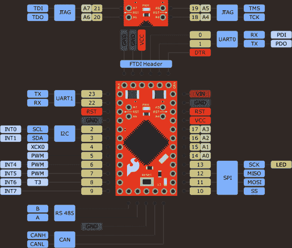
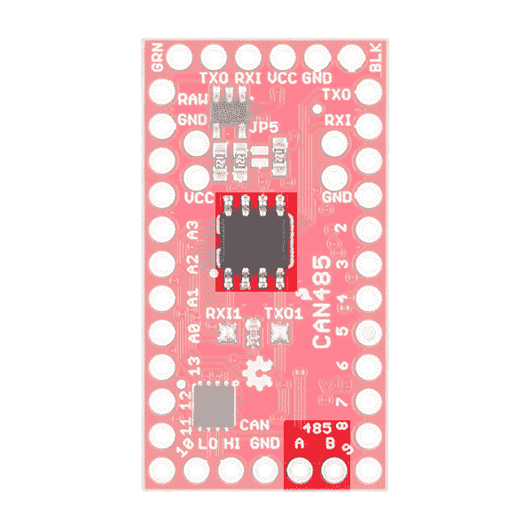
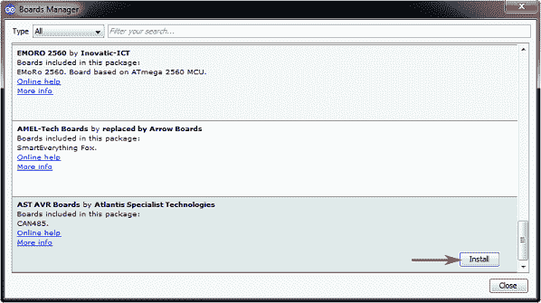

# AST-CAN485 连接指南

> 原文：<https://learn.sparkfun.com/tutorials/ast-can485-hookup-guide>

## 介绍

[AST-CAN485](https://www.sparkfun.com/products/14483) 是 Arduino Pro Mini 的小型 Arduino。除了所有常见功能外，它还具有板载 CAN 和 RS485 端口，能够快速轻松地与多种工业设备接口。CAN485 在制造商和工业空间之间架起了一座桥梁。

[](https://www.sparkfun.com/products/14483) 

将**添加到您的[购物车](https://www.sparkfun.com/cart)中！**

### [SparkFun AST-CAN485 开发板](https://www.sparkfun.com/products/14483)

[Out of stock](https://learn.sparkfun.com/static/bubbles/ "out of stock") DEV-14483

SparkFun AST-CAN485 开发板是一个迷你 Arduino，拥有板载 CAN(控制区域网络)和 RS485 端口，支持 q…

$48.506[Favorited Favorite](# "Add to favorites") 21[Wish List](# "Add to wish list")** **CAN485 基于流行的 Arduino 平台。它与 Arduino Pro Mini 引脚兼容，外形小巧，非常适合嵌入到项目中。它支持 Arduino IDE、Arduino 核心库，并且可以使用 boards manager 安装。提供库来支持 CAN 和 RS485 端口。板载 CAN 和 RS485 收发器允许与任何基于 CAN 或 RS485 的网络进行开箱即用的接口。CAN 和 RS485 构成了许多通信协议的基础，应用于自动化、工业系统、楼宇管理、汽车系统、OBDII 等领域。

[https://www.youtube.com/embed/1-fZtnLK0eM/?autohide=1&border=0&wmode=opaque&enablejsapi=1](https://www.youtube.com/embed/1-fZtnLK0eM/?autohide=1&border=0&wmode=opaque&enablejsapi=1)

### 推荐阅读

如果您不熟悉以下概念，我们建议您在继续之前查看这些教程。

[](https://learn.sparkfun.com/tutorials/how-to-solder-through-hole-soldering) [### 如何焊接:通孔焊接](https://learn.sparkfun.com/tutorials/how-to-solder-through-hole-soldering) This tutorial covers everything you need to know about through-hole soldering.[Favorited Favorite](# "Add to favorites") 70[](https://learn.sparkfun.com/tutorials/serial-communication) [### 串行通信](https://learn.sparkfun.com/tutorials/serial-communication) Asynchronous serial communication concepts: packets, signal levels, baud rates, UARTs and more 100[](https://learn.sparkfun.com/tutorials/what-is-an-arduino) [### 什么是 Arduino？](https://learn.sparkfun.com/tutorials/what-is-an-arduino) What is this 'Arduino' thing anyway? This tutorials dives into what an Arduino is and along with Arduino projects and widgets.[Favorited Favorite](# "Add to favorites") 50[](https://learn.sparkfun.com/tutorials/installing-arduino-ide) [### 安装 Arduino IDE](https://learn.sparkfun.com/tutorials/installing-arduino-ide) A step-by-step guide to installing and testing the Arduino software on Windows, Mac, and Linux.[Favorited Favorite](# "Add to favorites") 16[](https://learn.sparkfun.com/tutorials/logic-levels) [### 逻辑电平](https://learn.sparkfun.com/tutorials/logic-levels) Learn the difference between 3.3V and 5V devices and logic levels.[Favorited Favorite](# "Add to favorites") 82[](https://learn.sparkfun.com/tutorials/resistors) [### 电阻](https://learn.sparkfun.com/tutorials/resistors) A tutorial on all things resistors. What is a resistor, how do they behave in parallel/series, decoding the resistor color codes, and resistor applications.[Favorited Favorite](# "Add to favorites") 57

## 硬件概述

CAN485 采用与 Pro Mini 相同的微型外形，尺寸约为 34.65 毫米 x 19.20mm 毫米，使其可以轻松嵌入空间有限的应用中。引脚布局与 Arduino Pro Mini 相同。这使得它与现有的 Pro Mini 屏蔽和应用引脚兼容。第四侧复位按钮下方的一排附加引脚包含 CAN 和 RS485 端口。

| [](https://cdn.sparkfun.com/assets/learn_tutorials/5/4/1/14483-CAN485ArduinoProMiniDimension.jpg) | [](https://cdn.sparkfun.com/assets/learn_tutorials/5/4/1/11113-02bProMiniDimension.jpg) |
| AST-CAN485 尺寸 | Arduino Pro 迷你尺寸 |

### 插脚引线图

虽然引脚分配与 Arduino Pro Mini 相似，但它们的功能有所不同。在 CAN485 上使用专为 Pro Mini 设计的屏蔽时应小心。图形数据手册提供了引脚及其功能的更多细节。

[](https://cdn.sparkfun.com/assets/learn_tutorials/5/4/1/CAN485__Pinout2.png)*Having a hard time seeing the image? Click the image for a closer look.*

CAN485 基于 Atmel AT90CAN128 处理器。该处理器运行频率为 16MHz，具有 128KB 或闪存、4KB SRAM，并配有一个硬件 CAN 控制器。CAN485 提供常用的通信端口和引脚功能，包括:I2C、SPI、UARTs、8 个模拟输入和 6 个中断使能引脚。

更多信息可在 AT90CAN128 数据表和 [AST-CAN485 原理图](https://github.com/Atlantis-Specialist-Technologies-Admin/CAN485/blob/master/Documentation/CAN485%201.0.0.pdf)中找到。

**Note for Advanced Users:** The CAN485's AT90CAN128 uses an Arduino bootloader. For those that are trying to flash the chip with an AVR programmer and Atmel Studio, the ICSP pins are not in a location that you would expect. Instead of the SPI pins for D12 (MISO) and D11(MOSI), it is actually located on the FTDI's header pins D1 (TX0) and D0 (RXI) :

| 目标的外部力量 | CAN485 | AVR Programmer |
|  | FTDI 报头上的 D1 (TX0) | 军事情报部门组织(Military Intelligence Service Organization) |
|  | D13 (SCK) | 血清肌酸激酶 |
|  | 英特尔的快速储存技术 | 英特尔的快速储存技术 |
| 5V | 5V | 5V |
|  | FTDI 接头上的 D0 (RXI) | MOSI |
| GND | GND | GND |

More information can be found on page 349 of the AT90CAN128 datasheet in **section 25.7** for **SPI Serial Programming**.

### 力量

CAN485 有多种供电方式。

[](https://cdn.sparkfun.com/assets/learn_tutorials/5/4/1/14483-SparkFun_AST-CAN485_Dev_Board-InputPower.jpg)

CAN485 具有一个片上调节器，允许在 **RAW** 引脚上提供未调节的输入电压。允许的输入电压范围为 *7-16V* ，但推荐使用**7-12V**。

**Note:** Input voltage should be kept under **12V** if the CAN port is being used at the same time as more than 5 digital outputs.

稳压 5V 电源也可以直接提供给 **Vcc** 。供应的电压必须在 **4.5V 到 5.5V** 的范围内。也可以通过 FTDI 分支向 FTDI 集管供电。

**Warning:** Incorrect power supply may cause damage to the CAN485 or other connected devices.

一旦板通电，PWR led 将亮起。

[](https://cdn.sparkfun.com/assets/learn_tutorials/5/4/1/14483-SparkFun_AST-CAN485_Dev_Board-PowerLED.jpg)

### FTDI 编程标题

与 Pro Mini 一样，CAN485 没有板载 USB 连接。需要一个外部 FTDI 分线板来编程该板或将其连接到 PC。

[](https://cdn.sparkfun.com/assets/learn_tutorials/5/4/1/14483-SparkFun_AST-CAN485_Dev_Board-ProgrammingHeader.jpg)

要进行连接，您需要一个 5V 的 FTDI、用于连接的插头和一根 mini-B USB 电缆。

[](https://www.sparkfun.com/products/9716) 

将**添加到您的[购物车](https://www.sparkfun.com/cart)中！**

### [SparkFun FTDI 基础突破- 5V](https://www.sparkfun.com/products/9716)

[In stock](https://learn.sparkfun.com/static/bubbles/ "in stock") DEV-09716

这是 FTDI FT232RL USB 转串行 ic 的基本分线板。此板的引脚匹配 FTDI 电缆工作…

$16.50122[Favorited Favorite](# "Add to favorites") 78[Wish List](# "Add to wish list")****[](https://www.sparkfun.com/products/116) 

将**添加到您的[购物车](https://www.sparkfun.com/cart)中！**

### [破开头球——直击](https://www.sparkfun.com/products/116)

[In stock](https://learn.sparkfun.com/static/bubbles/ "in stock") PRT-00116

一排标题-打破适应。40 个引脚，可切割成任何尺寸。用于定制 PCB 或通用定制接头。

$1.7520[Favorited Favorite](# "Add to favorites") 133[Wish List](# "Add to wish list")****[](https://www.sparkfun.com/products/11301) 

将**添加到您的[购物车](https://www.sparkfun.com/cart)中！**

### [SparkFun USB 迷你-B 线- 6 脚](https://www.sparkfun.com/products/11301)

[In stock](https://learn.sparkfun.com/static/bubbles/ "in stock") CAB-11301

这是一条 USB 2.0 型到 Mini-B 型 5 针电缆。你知道，通常带有 USB 集线器、相机、MP3 的迷你 B 连接器…

$4.503[Favorited Favorite](# "Add to favorites") 20[Wish List](# "Add to wish list")****** ******### 曹色情

CAN 控制器是硬件加速的，允许以最小的处理器开销进行高速 CAN 通信。板载 CAN 收发器意味着 CAN485 可以直接连接到 CAN 网络，无需额外的电子设备。

| [](https://cdn.sparkfun.com/assets/learn_tutorials/5/4/1/14483-SparkFun_AST-CAN485_Dev_Board-CANportFront.jpg) | [](https://cdn.sparkfun.com/assets/learn_tutorials/5/4/1/14483-SparkFun_AST-CAN485_Dev_Board-03_CANportBack.png) |
| *AST-CAN485 前侧:CAN 端口* | *AST-CAN485 正面:CAN IC 和端口* |

#### 连接到 CAN 网络

下图显示了 CAN485 和 CAN 网络之间的典型连接。该网络由两条线路组成(CANH 和 CANL)。在这些线路上可以并联多个设备。总线的每一端都必须端接终端电阻(典型值为 100ω至 120ω)。

[](https://cdn.sparkfun.com/assets/learn_tutorials/5/4/1/ConnectingCAN485toCANNetwork.png)

欲了解更多信息，请查看[CAN 总线](https://learn.sparkfun.com/tutorials/ast-can485-hookup-guide#introduction-to-can-bus)简介。

### RS485 端口

与 CAN 端口类似，CAN485 具有一个板载 RS485 收发器，可轻松连接到任何 RS485 网络。虽然 UART1 由 RS485 端口消耗，但如果用户更愿意将其用作串行端口，它也会在引脚 22 和 23 上断开。

| [](https://cdn.sparkfun.com/assets/learn_tutorials/5/4/1/14483-SparkFun_AST-CAN485_Dev_Board-RS485portFront.jpg) | [](https://cdn.sparkfun.com/assets/learn_tutorials/5/4/1/14483-SparkFun_AST-CAN485_Dev_Board-03_RS485portBack.png) |
| *AST-CAN485 前侧:RS485 端口* | *AST-CAN485 背面:RS485 IC 和端口* |

#### 连接到 RS485 网络

下图显示了 CAN485 和 RS485 网络之间的典型连接。网络由两条线路(A 和 B)组成，设备并联在这些线路上。总线的每一端必须端接一个端接电阻(典型值为 100ω至 120ω)

[](https://cdn.sparkfun.com/assets/learn_tutorials/5/4/1/ConnectingCAN485toRS485Network.png)

欲了解更多信息，请查看 RS485 的[介绍。](https://learn.sparkfun.com/tutorials/ast-can485-hookup-guide#introduction-to-rs485)

### JTAG

JTAG 编程和调试接口在引脚 18-21 上断开。这允许 Atmel Studio 用户进行更高级的调试。

[](https://cdn.sparkfun.com/assets/learn_tutorials/5/4/1/14483-SparkFun_AST-CAN485_Dev_Board-JTAGpins.jpg)

一个重要的含义是，为了使用这些引脚进行 I/O，JTAG 接口**必须**被禁用。这可以通过向`setup()`函数添加一小段代码来实现。

[AST JTAG_Software_Disable.ino](https://github.com/Atlantis-Specialist-Technologies/CAN485/blob/master/Examples/JTAG_Software_Disable/JTAG_Software_Disable.ino)

### 软件序列，带 AltSoftSerial

遗憾的是，AT90CAN128 芯片的引脚不支持更改中断。因此，Arduino SoftwareSerial 库**不受**支持。AltSoftSerial 库可以用作替代。

AltSoftSerial 库有一些限制。它使用微处理器上的定时器资源。只有一个定时器可用，因此只有**一个** AltSoftSerial 端口可用，并且固定在引脚 5 和 9 上。AST 修改了标准 AltSoftSerial 库以支持 CAN485。该库可在 AST 的 GitHub 上获得。

[AST AltSoftSerial Library](https://github.com/Atlantis-Specialist-Technologies/AltSoftSerial)

## 硬件连接

CAN485 没有焊接接头。对于您的项目，我们将由您来决定是否将接头或电线焊接到电路板上。选项包括可堆叠接头、弯曲接头或直接将电线焊接到引脚焊盘上。

[](https://www.sparkfun.com/products/116) 

将**添加到您的[购物车](https://www.sparkfun.com/cart)中！**

### [破开头球——直击](https://www.sparkfun.com/products/116)

[In stock](https://learn.sparkfun.com/static/bubbles/ "in stock") PRT-00116

一排标题-打破适应。40 个引脚，可切割成任何尺寸。用于定制 PCB 或通用定制接头。

$1.7520[Favorited Favorite](# "Add to favorites") 133[Wish List](# "Add to wish list")****[](https://www.sparkfun.com/products/553) 

将**添加到您的[购物车](https://www.sparkfun.com/cart)中！**

### [挣脱男头球-直角](https://www.sparkfun.com/products/553)

[In stock](https://learn.sparkfun.com/static/bubbles/ "in stock") PRT-00553

一排直角公接头-断开以适合。40 个引脚，可切割成任何尺寸。用于定制 PCB 或一般定制…

$2.255[Favorited Favorite](# "Add to favorites") 47[Wish List](# "Add to wish list")****[](https://www.sparkfun.com/products/14322) 

将**添加到您的[购物车](https://www.sparkfun.com/cart)中！**

### [光子可堆叠接头- 12 针](https://www.sparkfun.com/products/14322)

[In stock](https://learn.sparkfun.com/static/bubbles/ "in stock") PRT-14322

这些可堆叠的头部可以与粒子光子和光子原盾板一起工作。每个标题增加了一个伟大的数据…

$0.75[Favorited Favorite](# "Add to favorites") 5[Wish List](# "Add to wish list")****** ******如果你是焊接新手，看看通孔焊接教程。你需要一个烙铁、焊料和[通用焊接配件](https://www.sparkfun.com/categories/49)。

[](https://www.sparkfun.com/products/9325) 

将**添加到您的[购物车](https://www.sparkfun.com/cart)中！**

### [无铅焊料- 100 克线轴](https://www.sparkfun.com/products/9325)

[In stock](https://learn.sparkfun.com/static/bubbles/ "in stock") TOL-09325

这是带有水溶性树脂芯的无铅焊料的基本线轴。0.031 英寸规格，100 克。这是一个好主意…

$9.957[Favorited Favorite](# "Add to favorites") 33[Wish List](# "Add to wish list")****[](https://www.sparkfun.com/products/retired/11704) 

### [Hakko FX888D 焊台](https://www.sparkfun.com/products/retired/11704)

[Retired](https://learn.sparkfun.com/static/bubbles/ "Retired") TOL-11704

50 多年来，Hakko 一直生产高质量的焊接和脱焊工具。他们是可靠的，一个很好的价值…

53 **Retired**[Favorited Favorite](# "Add to favorites") 49[Wish List](# "Add to wish list")** **原型制作的标准配置是使引脚面朝下，以便于进行试验板测试，同时使 FTDI 面朝外，通信引脚朝上，以便通过跳线进行访问。

[](https://cdn.sparkfun.com/assets/learn_tutorials/5/4/1/AST-CAN485_HeaderPins.jpg)

## 软件安装

**注意:**如果您使用的是 1.6.3 之前的版本，您将需要升级。此示例假设您在桌面上使用的是最新版本的 Arduino IDE。如果这是你第一次使用 Arduino，请回顾我们关于[安装 Arduino IDE 的教程。](https://learn.sparkfun.com/tutorials/installing-arduino-ide)

下一步是将 CAN485 板安装到 Arduino IDE 中。有两种安装方法。第一种是使用 Arduino 板管理器，这是首选方法。第二种方法是从 GitHub 存储库中手动复制文件。

### 使用电路板管理器安装电路板

使用 Arduino IDE 的板管理器是首选的安装方法。

在 Arduino IDE 中打开首选项窗口(**文件>首选项**)。复制以下 URL 并将其添加到 boards manager URLs 列表中:

```
https://raw.githubusercontent.com/Atlantis-Specialist-Technologies/Arduino-Boards-Packages/master/package_ast_boards_index.json 
```

[](https://cdn.sparkfun.com/assets/learn_tutorials/5/4/1/CAN485ArduinoBoardManagerPreferences.png)

打开董事会管理器(**工具>董事会>董事会管理器...**):

[](https://cdn.sparkfun.com/assets/learn_tutorials/5/4/1/CAN485ArduinoBoardManager.png)

滚动到 **AST AVR 板**并点击**安装**按钮:

[](https://cdn.sparkfun.com/assets/learn_tutorials/5/4/1/CAN485ArduinoInstallBoardAddOn.png)

AST AVR 板现在可以在 boards 菜单下使用。上传到开发板时选择 **Can485** 。

[](https://cdn.sparkfun.com/assets/learn_tutorials/5/4/1/CAN485ArduinoBoardSelection.png)

### 手动板安装

手动安装 **AST AVR 插件板**:

*   从 GitHub 下载 [CAN485 库](https://github.com/Atlantis-Specialist-Technologies/CAN485/archive/master.zip)。
*   解压文件夹。
*   将 **ast** 文件夹复制到* *…\ my documents \ Arduino \ hardware * *。
*   目录结构应该是:**…\ my documents \ Arduino \ hardware \ ast**。

### 手动库安装

**注意:**如果您之前没有安装 Arduino 库，请查看我们的[安装指南](https://learn.sparkfun.com/tutorials/installing-an-arduino-library)。

手动安装**罐库**:

*   从 GitHub 下载 [AST_CAN_Arduino_Library 库](https://github.com/Atlantis-Specialist-Technologies/AST_CAN_Arduino_Library/archive/master.zip)。
*   解压*AST _ CAN _ Arduino _ Library-master . zip*文件夹。
*   点击**...\ AST _ CAN _ Arduino _ Library-master**文件夹。
*   将**AST _ CAN _ Arduino _ Library-master**文件夹移动到 Arduino libraries 文件夹:**...\ my documents \ Arduino \ libraries * *。
    *   *(如果资源库文件夹不存在，则创建该文件夹)*
*   最终的目录结构应该是:**...\ my documents \ Arduino \ libraries \ AST _ CAN _ Arduino _ Library-master**。

手动安装 **RS485 库**:

*   从 GitHub 下载 [AST_RS485_Arduino_Library 库](https://github.com/Atlantis-Specialist-Technologies/AST_RS485_Arduino_Library/archive/master.zip)。
*   解压*AST _ RS485 _ Arduino _ Library-master . zip*文件夹。
*   点击**...\ AST _ RS485 _ Arduino _ Library-master**文件夹。
*   将**AST _ RS485 _ Arduino _ Library**文件夹移动到 Arduino libraries 文件夹:**...\ my documents \ Arduino \ libraries * *
    *   *(如果资源库文件夹不存在，则创建该文件夹)*
*   最终的目录结构应该是:**...\ my documents \ Arduino \ libraries \ AST _ RS485 _ Arduino _ Library-master**。

要手动安装 **AST AltSoftSerial 库**:

*   从 GitHub 下载 [RS485 库储存库](https://github.com/Atlantis-Specialist-Technologies/AltSoftSerial/archive/master.zip)。
*   解压 *AltSoftSerial-master.zip* 文件夹。
*   点击**...\AltSoftSerial-master** 文件夹。
*   解压缩到 Arduino libraries 文件夹:**...\ my documents \ Arduino \ libraries * *
    *   *(如果资源库文件夹不存在，则创建该文件夹)*
*   最终的目录结构应该是:**...\ my documents \ Arduino \ libraries \ AltSoftSerial-master**。

**Troubleshooting:** If you manually install the libraries in your Arduino Documents folder, make sure that the library is not within a subfolder! The Arduino IDE will not recognize the library and there will be issues compiling. For example, if you manually install the CAN library and your library structure is **...\Documents\Arduino\libraries\AST_CAN_Arduino_Library-master\AST_CAN_Arduino_Library-master** with the **src** folder is in the second path "**AST_CAN_Arduino_Library-master**", the Arduino IDE will not recognize the source files. To fix, simply move all the library contents in the subfolder up a directory and restart your Arduino IDE.**Troubleshooting:** If you are using the custom AST "AltSoftSerial" library with PaulStoffregen's "AltSoftSerial" installed you may have a library conflict. The Arduino IDE will get confused and probably use the first AltSoftSerial library that it sees. Here's a possible compile error that one may see:

`Multiple libraries were found for "AltSoftSerial.h"
  Used: ...\Documents\Arduino\libraries\AltSoftSerial
  Not used: ...\Documents\Arduino\libraries\AST_AltSoftSerial_Arduino_Library
exit status 1
Error compiling for board Can485.`

One quick fix is to move the PaulStoffregen's "AltSoftSerial" out of the Arduino libraries folder and only use AST's "AltSoftSerial" library when compiling code for the AST-CAN485\. This will avoid conflicts with multiple libraries using the same name.

### 上传代码

如图所示，将 FTDI 编程电缆连接至 FTDI 接头:

[](https://cdn.sparkfun.com/assets/learn_tutorials/5/4/1/ProgrammingASTCAN485_Fritzingbb.png)

打开 Arduino IDE，在工具菜单中选择 CAN485 板。确保使用了正确的 COM 端口。上传眨眼示例(示例> 01。基础>眨眼)。您应该会看到连接到 13 号引脚的内置 LED 闪烁。

## CAN 总线介绍

**Heads up!** This section gives a brief overview of some of the important features of CAN bus. For more detailed information refer to the links provided in the [Resource and Going Further](https://learn.sparkfun.com/tutorials/ast-can485-hookup-guide#resources-and-going-further).

控制器局域网(CAN)总线是一种通信标准，起源于汽车行业。它有几个内置的功能，使其强大和噪音容忍。这是一种基于消息的协议，能够支持多个节点。在不到 40 米的距离上支持高达 1Mbps 的速度，而在较低速度下可以支持更长的距离(125Kbps 时为 500 米)。CAN 总线还具有一种仲裁方法，可自动区分消息的优先级并解决数据包冲突。

CAN 在工业应用中用作现场总线，包括许多高层协议所基于的较低层。CANopen 和 DeviceNet 是基于 CAN 总线的常见高层协议，用于工业自动化领域。CAN 总线也用于 OBDII 车辆诊断标准，这是美国和欧盟对现代汽车的强制性要求。

### 信号描述

CAN 总线由两个信号(CAN H 和 CAN L)组成，并在每一端以一个端接电阻(通常为 100ω至 120ω)端接。对于高速，建议使用 120ω端接电阻。这些线通常缠绕成双绞线。

总线有一个隐性状态(逻辑 1)和一个显性状态(逻辑 0)。总线需要由其中一个节点主动驱动到支配状态。如果它没有被任何节点驱动到显性状态，总线将返回到隐性状态。这种显性和隐性行为意味着，如果两个节点同时传输，显性位将优先。一种仲裁方法利用这种行为来解决数据包冲突。

CAN 收发器需要在微处理器使用的线路状态和逻辑状态之间进行转换。

[](https://cdn.sparkfun.com/assets/learn_tutorials/5/4/1/CANSignals_2.png)*Having a hard time seeing the image? Click the image for a closer look.*

### 网络结构

多个节点可以并联连接。线路两端必须端接一个端接电阻(典型值为 100ω至 120ω)。对于高速 CAN 总线，下面的网络在每端包括一个 120ω的端接电阻。

[](https://cdn.sparkfun.com/assets/learn_tutorials/5/4/1/CANNetwork_1.png)

### 数据包结构

CAN 消息具有标准格式，包括消息 ID、数据长度字段、数据帧、CRC 和其他控制位。作为基于消息的协议，没有节点地址，而是有一个消息 ID。数据与 ID 相关联，而不是与设备相关联，并且一个节点可以使用几个消息 ID 进行传输。这种行为非常有用。例如，一个节点可以在三个不同的消息 id 上报告电机速度、位置和加速度，允许任何接收节点容易地识别参数。

消息 id 应该是唯一的。如果两个节点试图同时发送具有相同 ID 的消息，将会导致错误。消息 ID 也用于仲裁过程，以确定当两个节点试图同时传输时哪个消息具有优先权。

CAN 数据包有两种标准格式:基本格式(CAN2.0A)和扩展格式(CAN2.0B)。扩展格式具有 29 位 ID，而基本格式具有 11 位 ID。扩展格式向后兼容，允许在任何 CAN 网络上使用这两种格式。

[](https://cdn.sparkfun.com/assets/learn_tutorials/5/4/1/CAN_PacketStructureFrames_1.png)*Having a hard time seeing the image? Click the image for a closer look.*

### 仲裁

当两个节点试图同时传输时，仲裁过程确定哪一个优先。传输时，每个节点还会读取总线状态。如果一个节点检测到它的一个隐性位被另一个节点驱动为显性位，那么它将停止传输。这导致较低的 id 优先于较高的 id。如果节点仲裁失败，一旦当前传输完成，它将尝试重新发送消息。这种行为会自动确定优先级并解决冲突。

[](https://cdn.sparkfun.com/assets/learn_tutorials/5/4/1/CANArbitration_1.png)*Having a hard time seeing the image? Click the image for a closer look.*

## 示例:简单的 CAN 网络

在本例中，构建了一个简单的双节点 CAN 总线网络。一个节点发送信息，另一个节点接收信息并通过串行端口传递给 PC。

### 所需材料

本例需要以下材料。你可能不需要所有的东西，这取决于你拥有什么。将它添加到您的购物车，通读指南，并根据需要调整购物车。

*   2 个 CAN485
*   2 个 120ω电阻*
*   FTDI
*   usb 电缆
*   试验板、跳线等。

***Don't have a 120Ω resistor?** You can add the one 100Ω and two 10Ω [resistors in series](https://learn.sparkfun.com/tutorials/resistors#series-and-parallel-resistors) for 120Ω.

### 硬件连接

如图所示构建网络。

[](https://cdn.sparkfun.com/assets/learn_tutorials/5/4/1/ASTCAN485_SimpleCANNetwork_Fritzingbb.png)

### 上传代码

确保已安装 CAN485 板和 CAN 库。示例代码随 CAN 库一起安装。它位于 Arduino IDE 的“示例”菜单下。

[](https://cdn.sparkfun.com/assets/learn_tutorials/5/4/1/CANExamples.png)

将变送器示例代码上传至变送器节点。然后将接收者示例代码上传到接收者节点。

### 你应该看到什么

发射机节点将每 500 毫秒发送一条消息。接收器节点将接收它，并通过串行端口将其传递给 PC。使用 [Arduino 串行监视器(或您喜欢的串行终端)](https://learn.sparkfun.com/tutorials/terminal-basics)打开 PC 上的串行端口，并选择**1000000(1 兆波特)**。

## 示例:多节点 CAN 网络

在本例中，构建了一个更大的 CAN 网络。多个节点发送消息，一个节点通过串行端口将消息转发给 PC。

### 所需材料

本例需要以下材料。你可能不需要所有的东西，这取决于你拥有什么。将它添加到您的购物车，通读指南，并根据需要调整购物车。

*   3 倍或更多 CAN485
*   2 个 120ω电阻*
*   FTDI
*   usb 电缆
*   试验板、跳线等
*   1 个外部电源**
*   1 个 DC 筒式插孔适配器母**

***Don't have a 120Ω resistor?** You can add the one 100Ω and two 10Ω [resistors in series](https://learn.sparkfun.com/tutorials/resistors#series-and-parallel-resistors) for 120Ω.****Note:** It is a good idea to use an external power supply to rather than relying on power from the FTDI converter.

### 硬件连接

如图所示构建网络。

[](https://cdn.sparkfun.com/assets/learn_tutorials/5/4/1/ASTCAN485_MultiNodeCANNetwork_Fritzingbb.png)

### 上传代码

确保已安装 CAN485 板和 CAN 库。示例代码随 CAN 库一起安装。它位于 Arduino IDE 的“示例”菜单下。

将变送器示例代码上传到每个变送器节点。确保将消息 id(`MESSAGE_ID`)更改为每个节点的唯一值。

然后将接收者示例代码上传到接收者节点。

### 你应该看到什么

发射机节点将每隔 500 毫秒发送一条消息。接收器节点将接收它，并通过串行端口将其传递给 PC。使用 Arduino 串行监视器(或您喜欢的串行终端)打开 PC 上的串行端口，并选择**1000000(1 兆波特)**。

## RS485 简介

RS485 是串行通信系统中广泛使用的标准。只有电气接口由 RS485 定义。该标准没有规定具体的通信协议；相反，它形成了许多不同协议的物理层。例如，串行端口可以在 RS485 物理链路上运行。

RS485 在双绞线上使用差分信号，使其对噪声具有弹性。也支持多个节点，其数量通常由使用的协议决定。距离可达 1200 米，传输速度可达 10Mb。然而，在距离和速度之间有一个权衡。例如，一根 50m 长的电缆可以 2Mbps 的速度运行。

RS485 是常用的物理层之一。应用包括工业系统、计算、汽车和建筑管理。Modbus 和 Profibus 是两种使用 RS485 的常见工业协议。

### 信号描述

该接口由带有信号 A 和 b 的两条线组成，当总线空闲时，两条线都悬空。在操作中，一个节点充当控制器并控制总线，将两条线驱动到适当的电压。其他节点充当外围设备，接收正在传输的数据。这些线被驱动到相反的极性；如果 A 为正，B 为负。通过反转信号，逻辑电平 0 或 1 是可能的。

[](https://cdn.sparkfun.com/assets/learn_tutorials/5/4/1/RS485Signals_1.png)*Having a hard time seeing the image? Click the image for a closer look.*

### 网络结构

多个节点可以并联连接。线路两端必须端接一个端接电阻(典型值为 100ω至 120ω)。

[](https://cdn.sparkfun.com/assets/learn_tutorials/5/4/1/RS485Network.png)

## 示例:简单的 RS485 网络

在本例中，构建了一个简单的双节点 RS485 总线网络。一个节点每 500 毫秒发送一条消息。另一个接收它，并通过串行端口将其传递给 PC。

### 所需材料

本例需要以下材料。你可能不需要所有的东西，这取决于你拥有什么。将它添加到您的购物车，通读指南，并根据需要调整购物车。

*   2 个 CAN485
*   FTDI
*   usb 电缆
*   2 个 120ω电阻*
*   试验板、跳线等

***Don't have a 120Ω resistor?** You can add the one 100Ω and two 10Ω [resistors in series](https://learn.sparkfun.com/tutorials/resistors#series-and-parallel-resistors) for 120Ω.

### 硬件连接

如图所示构建网络。

[](https://cdn.sparkfun.com/assets/learn_tutorials/5/4/1/ASTCAN485_SimpleRS485Network_Fritzingbb.png)

### 上传代码

确保已安装 CAN485 板和 RS485 库。示例代码随 RS485 库一起安装。它位于 Arduino IDE 的“示例”菜单下。

[](https://cdn.sparkfun.com/assets/learn_tutorials/5/4/1/RS485Examples.png)

将接收者示例代码上传到接收者节点。然后将变送器示例代码上传到变送器节点。

### 你应该看到什么

发射机节点将每 500 毫秒发送一条消息。接收器节点将接收它，并通过串行端口将其传递给 PC。使用 Arduino 串行监视器(或您喜欢的串行终端)以 115200 波特打开 PC 上的串行端口。

## 同伴板

如果您希望使用 CAN485 控制 24V 输入和输出，请检查有线连接的 [I/O 屏蔽(24V)](https://learn.sparkfun.com/tutorials/ast-can485-io-shield-24v-hookup-guide) 。

[](https://learn.sparkfun.com/tutorials/ast-can485-io-shield-24v-hookup-guide) [### AST-CAN485 I/O 屏蔽(24V)连接指南

#### 2019 年 2 月 14 日](https://learn.sparkfun.com/tutorials/ast-can485-io-shield-24v-hookup-guide) The AST-CAN485 I/O Shield is an Arduino shield that will allow the user to interface the AST-CAN485 Dev Board with 24V inputs and outputs, which expands its usefulness into industrial systems.[Favorited Favorite](# "Add to favorites") 0

如果您需要远程控制 RS485 或 CAN 设备，请查看 [WiFi 屏蔽](https://learn.sparkfun.com/tutorials/ast-can485-wifi-shield-hookup-guide)..

[](https://learn.sparkfun.com/tutorials/ast-can485-wifi-shield-hookup-guide) [### AST-CAN485 WiFi 屏蔽连接指南

#### 2019 年 2 月 14 日](https://learn.sparkfun.com/tutorials/ast-can485-wifi-shield-hookup-guide) Hookup Guide for the AST-CAN485 WiFi Shield.[Favorited Favorite](# "Add to favorites") 0

## 资源和更进一步

现在，您已经成功启动并运行了 AST-CAN485 开发板，是时候将它集成到您自己的项目中了！

有关更多信息，请查看以下资源:

*   [示意图](https://cdn.sparkfun.com/assets/2/8/3/4/7/SparkFun_AST-CAN485.pdf)
*   [老鹰档案](https://cdn.sparkfun.com/assets/c/4/c/e/5/SparkFun_AST-CAN485_1.zip)
*   [AST GitHub Repo](https://github.com/Atlantis-Specialist-Technologies)
    *   [CAN485 产品回购](https://github.com/Atlantis-Specialist-Technologies/CAN485)
    *   [AST CAN 库](https://github.com/Atlantis-Specialist-Technologies/AST_CAN_Arduino_Library)
    *   [AST RS485 库](https://github.com/Atlantis-Specialist-Technologies/AST_RS485_Arduino_Library)
    *   [AST 替代软件材料](https://github.com/Atlantis-Specialist-Technologies/AltSoftSerial)
    *   [Arduino 板卡包](https://github.com/Atlantis-Specialist-Technologies/Arduino-Boards-Packages)
*   数据表
    *   AT90CAN128
    *   [CAN 收发器](https://github.com/Atlantis-Specialist-Technologies/CAN485/blob/master/Documentation/Datasheet%20CAN%20Transciever.pdf)
    *   [RS485 收发器](https://github.com/Atlantis-Specialist-Technologies/CAN485/blob/master/Documentation/Datasheet%20RS485%20Transceiver.pdf)
*   CAN 总线
    *   [维基 CAN 总线](https://en.wikipedia.org/wiki/CAN_bus)
    *   [CAN 2.0 规范](http://esd.cs.ucr.edu/webres/can20.pdf)(已被 ISO 标准取代)
    *   [ISO 标准](https://www.iso.org/standard/63648.html)
    *   [CANopen](https://en.wikipedia.org/wiki/CANopen)
    *   [DeviceNet](https://en.wikipedia.org/wiki/DeviceNet)
    *   [电子堆栈交换——为什么 CAN 总线使用 120 欧姆的电阻作为终端电阻，而不是其他值？](https://electronics.stackexchange.com/questions/55389/why-does-the-can-bus-use-a-120-ohm-resistor-as-the-terminating-resistor-and-not)
*   RS485
    *   [维基百科 RS485](https://en.wikipedia.org/wiki/RS-485)
    *   [Modbus](https://en.wikipedia.org/wiki/Modbus)
    *   [Modbus 库](https://github.com/4-20ma/ModbusMaster)
    *   [Profibus](https://en.wikipedia.org/wiki/Profibus)
    *   [电子堆栈交换 RS485 网络需要多长的终端电阻？](https://electronics.stackexchange.com/questions/32135/at-what-cable-lengths-are-termination-resistors-required-for-rs-485-networks)
*   [产品展示:SparkFun AST-CAN485 开发板](https://www.youtube.com/watch?v=1-fZtnLK0eM)

你的下一个项目需要一些灵感吗？查看一些相关教程:

[](https://learn.sparkfun.com/tutorials/obd-ii-uart-hookup-guide) [### OBD II UART 连接指南](https://learn.sparkfun.com/tutorials/obd-ii-uart-hookup-guide) How to start working with the OBD-II Uart board.[Favorited Favorite](# "Add to favorites") 8[](https://learn.sparkfun.com/tutorials/can-bus-shield-hookup-guide) [### CAN 总线屏蔽连接指南](https://learn.sparkfun.com/tutorials/can-bus-shield-hookup-guide) A basic introduction to working with the CAN-Bus shield.[Favorited Favorite](# "Add to favorites") 11[](https://learn.sparkfun.com/tutorials/getting-started-with-obd-ii) [### OBD-II 入门](https://learn.sparkfun.com/tutorials/getting-started-with-obd-ii) A general guide to the OBD-II protocols used for communication in automotive and industrial applications.[Favorited Favorite](# "Add to favorites") 28

或根据 Pete 进一步深入了解有关 RS485 的更多信息。

[](https://www.sparkfun.com/news/2652 "April 2, 2018: Looking for a beefy, wired data bus where RF won’t cut it? We dig into RS-485 and explore how it works and why it just might be the one you need!
") [### 据皮特说:RS-485 是如何工作的

April 2, 2018](https://www.sparkfun.com/news/2652 "April 2, 2018: Looking for a beefy, wired data bus where RF won’t cut it? We dig into RS-485 and explore how it works and why it just might be the one you need!
")[Favorited Favorite](# "Add to favorites") 1****************