# 指纹扫描仪(GT-521Fxx)连接指南

> 原文：<https://learn.sparkfun.com/tutorials/fingerprint-scanner-gt-521fxx-hookup-guide>

## 介绍

**Note:** This tutorial is for the GT-521Fxx models. If you are using any of the previous models (i.e. GT-511C1R and GT-511C3), please refer to the older [Fingerprint Scanner Hookup Guide](https://learn.sparkfun.com/tutorials/fingerprint-scanner-hookup-guide).

你有没有想过在你的项目中加入指纹识别？SparkFun 提供了一款来自 ADH Tech 的指纹扫描仪，专为此而设计！ [GT-521F32](https://www.sparkfun.com/products/14518) 和 [GT-521F52](https://www.sparkfun.com/products/14585) 包括一个用于读取指纹的光学传感器和一个内置指纹算法的处理 IC。在这里，您可以找到有关连接指纹扫描仪以及如何将其与 Hawley 的 FPS_GT511C3 库配合使用的信息。

[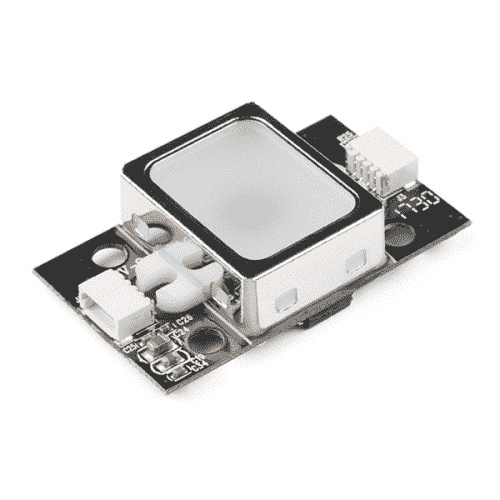](https://www.sparkfun.com/products/14518) 

将**添加到您的[购物车](https://www.sparkfun.com/cart)中！**

### [【指纹扫描仪- TTL (GT-521F32)](https://www.sparkfun.com/products/14518)

[In stock](https://learn.sparkfun.com/static/bubbles/ "in stock") SEN-14518

这个伟大的 GT-521F32 指纹模块从 ADH-Tech 通过 TTL 串行通信，所以你可以很容易地将其嵌入到你的下一个…

$38.507[Favorited Favorite](# "Add to favorites") 59[Wish List](# "Add to wish list")****[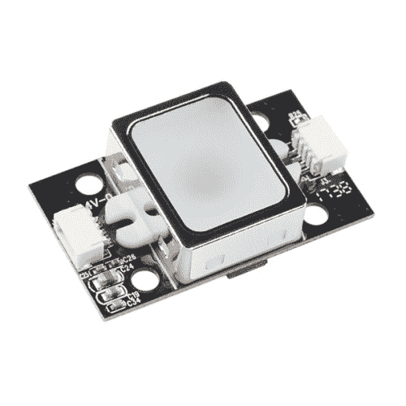](https://www.sparkfun.com/products/14585) 

将**添加到您的[购物车](https://www.sparkfun.com/cart)中！**

### [【指纹扫描仪- TTL (GT-521F52)](https://www.sparkfun.com/products/14585)

[In stock](https://learn.sparkfun.com/static/bubbles/ "in stock") SEN-14585

这款来自 ADH-Tech 的 GT-521F52 指纹模块通过 TTL 串行通信，因此您可以轻松地将其嵌入到您的下一个…

$58.953[Favorited Favorite](# "Add to favorites") 39[Wish List](# "Add to wish list")**** ****[https://www.youtube.com/embed/PPNoO5uaUhM/?autohide=1&border=0&wmode=opaque&enablejsapi=1](https://www.youtube.com/embed/PPNoO5uaUhM/?autohide=1&border=0&wmode=opaque&enablejsapi=1)

### 推荐阅读

根据您连接到指纹扫描仪的方式，在使用这些板之前，您可能需要了解以下概念:

[](https://learn.sparkfun.com/tutorials/how-to-solder-through-hole-soldering) [### 如何焊接:通孔焊接](https://learn.sparkfun.com/tutorials/how-to-solder-through-hole-soldering) This tutorial covers everything you need to know about through-hole soldering.[Favorited Favorite](# "Add to favorites") 70[](https://learn.sparkfun.com/tutorials/serial-communication) [### 串行通信](https://learn.sparkfun.com/tutorials/serial-communication) Asynchronous serial communication concepts: packets, signal levels, baud rates, UARTs and more 100[](https://learn.sparkfun.com/tutorials/installing-an-arduino-library) [### 安装 Arduino 库](https://learn.sparkfun.com/tutorials/installing-an-arduino-library) How do I install a custom Arduino library? It's easy! This tutorial will go over how to install an Arduino library using the Arduino Library Manager. For libraries not linked with the Arduino IDE, we will also go over manually installing an Arduino library.[Favorited Favorite](# "Add to favorites") 22[](https://learn.sparkfun.com/tutorials/logic-levels) [### 逻辑电平](https://learn.sparkfun.com/tutorials/logic-levels) Learn the difference between 3.3V and 5V devices and logic levels.[Favorited Favorite](# "Add to favorites") 82[](https://learn.sparkfun.com/tutorials/terminal-basics) [### 串行终端基础知识](https://learn.sparkfun.com/tutorials/terminal-basics) This tutorial will show you how to communicate with your serial devices using a variety of terminal emulator applications.[Favorited Favorite](# "Add to favorites") 46

## 硬件概述

### 特征

GT-521F32 和 GT-521F52 与之前的车型有很多共同之处。它们具有相同的协议命令和数据包结构。为以前的模型实现的代码在功能上应该是相同的。指纹扫描仪能够:

*   注册指纹
*   辨认指纹
*   能够 360 度识别

然而，这两种电路板还是有一些不同之处。其中包括:

*   不同的电路板布局
*   4x 安装孔
*   2 个 JST SH 连接器
*   触摸界面

在项目中集成指纹扫描仪时要记住的一个重要区别是设备可以容纳的指纹数量。GT-521F32 价格更低，但只能容纳 200 个指纹。GT-521F52 稍微贵一点，但是可以保存 3000 个指纹。

| 技术规格 | GT-521F32 / GT-521F52 |
| *CPU* | 臂皮层 M3 皮层 |
| *传感器* | 视觉的 |
| *窗口* | 16.9 毫米 x 12.9mm 毫米 |
| *传感器的有效面积* | 14 毫米 x 12.5mm 毫米 |
| *图像尺寸* | 258x202 像素 |
| *分辨率* | 450 dpi |
| *指纹的最大数量* | 200 / 3000 |
| *匹配模式* | 1:1，1:N |
| *模板尺寸* | 496 字节(模板)+ 2 字节(校验和) |
| *串行通信* | UART(默认:9600 波特)和 USB v2.0(全速) |
| *错误接受率(FAR)* | < 0.001% |
| *错误拒绝率(FRR)* | < 0.01% |
| *报名时间* | 不到 3 秒(3 个指纹) |
| *识别时间* | <1.5 |
| *工作电压* | 3.3V ~ 6Vdc |
| *工作电流* | < 130 毫安 |
| *触摸工作电压* | 3.3 伏直流电 |
| *触摸工作电流* | < 3mA |
| *触摸待机电流* | < μ5 |

下图显示了指纹扫描仪的光学感应区域，设备将能够在该区域扫描您的指纹。

[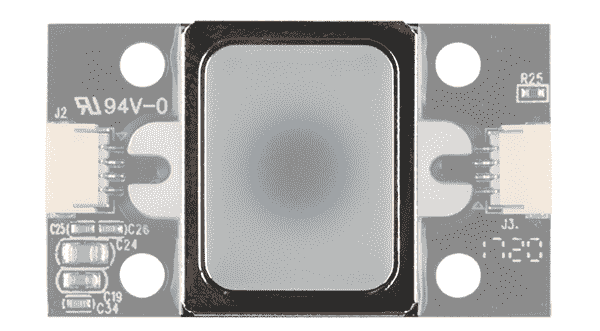](https://cdn.sparkfun.com/assets/learn_tutorials/7/2/3/14518-04OpticalSensingArea.png)

JST-SH 连接器旁边有一个指示极性的标记。JST-SH 连接器断开串行 UART 和电源的引脚。当输入电压在 **3.3V 到 6V** 之间时，UART 的逻辑电平只有 **3.3V** 。您将需要一个[逻辑电平转换器](https://www.sparkfun.com/products/12009)或[分压器](https://learn.sparkfun.com/tutorials/voltage-dividers)来安全地与 5V 设备通信。

[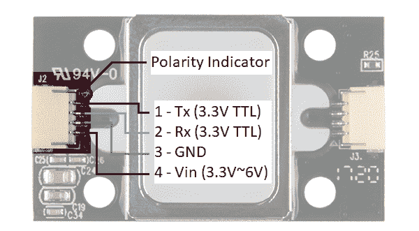](https://cdn.sparkfun.com/assets/learn_tutorials/7/2/3/14518-04SerialPowerConnectorLabel.png)**Note:** Make sure that you are connecting to the correct JST connector indicated by the polarity marker and capacitors. The JST connector on the other side of the board are not connected to the same pins for serial UART.[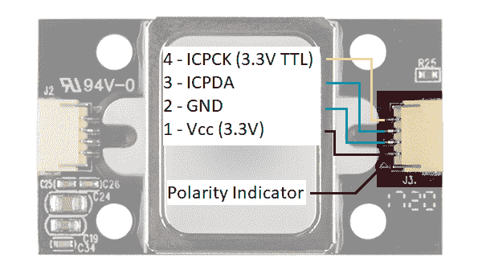](https://cdn.sparkfun.com/assets/learn_tutorials/7/2/3/14518-04TouchICConnector.png)

GT-521F32 和 GT-521F52 能够感应手指是否放在光学感应区域。当接触到光学感测区域周围的金属框架时，ICPCK 将输出 3.3V(高)。否则，ICPCK 将为 0V(低电平)

| 触摸状态 | ICPCK 引脚状态 |
| *手指最初接触框架* | 低= >高 |
| *没有手指触碰* | 低= >低 |
| *手指触摸框架* | 高= >高 |
| *从框架上取下手指* | 高= >低 |

**Note:** If the fingerprint scanner is powered from the UART side, you will need to still provide **3.3V** to power the touch interface. The GND is connected to GND plane.

## 硬件连接

指纹扫描仪需要串行 UART 连接和电源。根据您使用的 UART 设备，有几种连接到传感器的选项。最简单的方法是使用 FTDI，但也可以使用任何具有 UART 的微控制器。

### 1.)连接带 3.3V FTDI 的

#### 选项 1: Qwiic 电缆

要将指纹扫描仪连接到您的计算机，建议将 JST SH 电缆连接到 USB 转串行转换器。以下是您开始工作所需的最少部件:

*   指纹扫描仪( [GT-521F32](https://www.sparkfun.com/products/14518) 或 [GT-521F52](https://www.sparkfun.com/products/14585) )
*   [Qwiic 电缆](https://www.sparkfun.com/products/14207) -兼容试验板
*   [3.3V FTDI 基本分线点](https://www.sparkfun.com/products/9873)
*   [Mini-B USB 线缆](https://www.sparkfun.com/products/11301)

以下是您需要使用标记为 J2 的 JST-SH 连接器进行的连接:

| 指纹扫描仪*【Pin #】* | FTDI 3.3V |
| UART_TX (3.3V TTL) *【引脚 1】* | 药方(prescription 的缩写) |
| UART_RX (3.3V TTL) *【引脚 2】* | 谢谢 |
| GND *【插脚 3】* | GND |
| Vin (3.3V~6V) *【引脚 4】* | 3.3V |

连接后，设置应该如下图所示。

[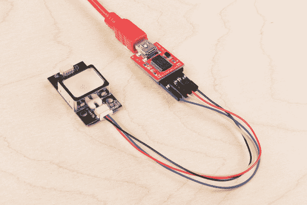](https://cdn.sparkfun.com/assets/learn_tutorials/7/2/3/FPS_3V3_FTDI.jpg)**Note:** The colors of the Qwiic Cable are standard for [I²C](https://learn.sparkfun.com/tutorials/i2c) connections, not UART, so the colors will not match typical standards for colored cables. For example, the red wire in this circuit connects Rx to Tx. Double check your connections before powering the scanner.

#### 选项 2:制作自定义适配器

如果您使用的是 [JST SH 跳线 4 线组件](https://www.sparkfun.com/products/10359)而不是 Qwiic 电缆，强烈建议您通过焊接到线的末端来制作一个定制适配器，以实现安全连接。这将确保在将其插入 FTDI 或 RedBoard/Arduino Uno 的母头插座时，连接不会松动。与母头插座相比，电缆线较小。一个小小的碰撞可能会干扰指纹扫描仪和转换器之间的串行 UART 或电源。这可能需要您将扫描仪重新连接到您的计算机或设备。制作一个适配器还可以快速访问扫描仪上的小型 4 针 JST-SH 连接器。

有关如何制作自定义适配器的更多信息，请参考旧教程。请记住，pin 位置是相同的，因此适配器可以与当前的指纹扫描仪一起工作。

[Making a Custom FPS Adapter](https://learn.sparkfun.com/tutorials/fingerprint-scanner-hookup-guide#CustomFPSAdapter)

### 2.)连接带有 5V Arduino 的

在使用 Arduino 的示例代码之前，请确保逻辑电平匹配。如果您使用 5V Arduino，您可以使用专用的逻辑电平转换器或电阻进行分压。以下是您开始使用时需要的最少部件:

*   指纹扫描仪( [GT-521F32](https://www.sparkfun.com/products/14518) 或 [GT-521F52](https://www.sparkfun.com/products/14585) )
*   [Qwiic 电缆](https://www.sparkfun.com/products/14207)
*   [Redboard](https://www.sparkfun.com/products/13975) 或 [Arduino Uno](https://www.sparkfun.com/products/11021)
*   [迷你试验板](https://www.sparkfun.com/products/12044)
*   [双向逻辑电平转换器](https://www.sparkfun.com/products/12009)或[3x 10k 欧姆电阻](https://www.sparkfun.com/products/11508)
*   [M/M 跳线](https://www.sparkfun.com/products/8431)

#### 选项 1:专用双向逻辑电平转换器(LLC)

如果使用 5V Arduino 微控制器，建议使用专用双向 LLC 实现可靠连接。假设已经将接头引脚焊接到逻辑电平转换器，则需要进行以下连接:

| 指纹扫描仪 *(Pin #)* | 逻辑电平转换器*(低端)* | 逻辑电平转换器*(高端)* | 5V Arduino，带 Atmega328P |
| UART_TX (3.3V TTL) *(引脚 1)* | LV1 | HV1 | RX *(引脚 4)* |
| UART_RX (3.3V TTL) *(引脚 2)* | LV4 | HV4 | TX *(引脚 5)* |
| GND *(引脚 3)* | GND | GND | GND |
|  | LV |  | 3.3V |
| Vin (3.3V~6V) *(引脚 4)* |  | 超速(Hyper-Velocity) | 5V |

**Note:** Make sure to connect 3.3V to the LV side to power the low side of the logic level converters.

完成电路布线后，应该是这样的:

[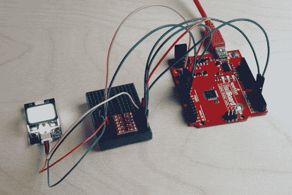](https://cdn.sparkfun.com/assets/learn_tutorials/7/2/3/FPSLLCArduino.jpg)

#### 选项 2:带 3 个 10kω电阻的分压

否则，您可以使用 3 个 10kOhm 电阻[将电压](https://learn.sparkfun.com/tutorials/voltage-dividers)从 5V Arduino 分压至指纹扫描仪(FPS)的 3.3V，类似于我们的旧逻辑电平转换器上的“单向”应用电路，如下所示:

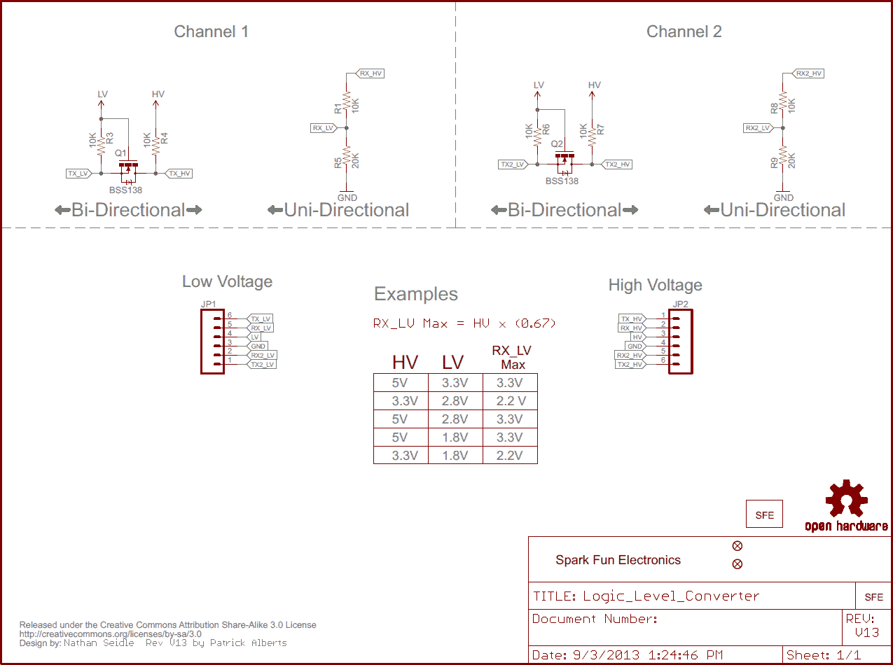

下面是 FPS、5V Arduino 和分压电阻之间的连接:

| 分压器 | 指纹扫描仪 *(Pin #)* | 分压器 | 5V Arduino，带 Atmega328P |
|  | UART_TX (3.3V TTL) *(引脚 1)* |  | RX *(引脚 4)* |
| GND<10k 欧姆T2【10k 欧姆】 | UART_RX (3.3V TTL) *(引脚 2)* | 10k 欧姆 | TX *(引脚 5)* |
| GND | GND *(引脚 3)* | GND | GND |
|  | Vin (3.3V~6V) *(引脚 4)* |  | 5V |

*注意:您可以将两个 10k 欧姆的[电阻串联](https://learn.sparkfun.com/tutorials/resistors#series-and-parallel-resistors)增加到 20k 欧姆。*

接通电路后，应该是这样的:

[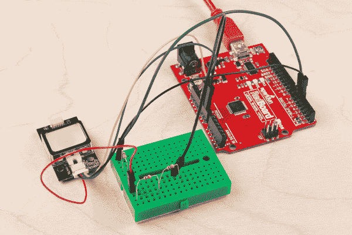](https://cdn.sparkfun.com/assets/learn_tutorials/7/2/3/FPSVoltageDividerArduino.jpg)

## 使用带 FTDI 的演示软件

连接 3.3V FTDI 后，将 USB 电缆连接到电脑。假设已经安装了 [FTDI 驱动程序](https://learn.sparkfun.com/tutorials/how-to-install-ftdi-drivers)，记下 FTDI 枚举的 COM 端口。在 Windows 电脑上，我可以在设备管理器中查看它，如下所示:

[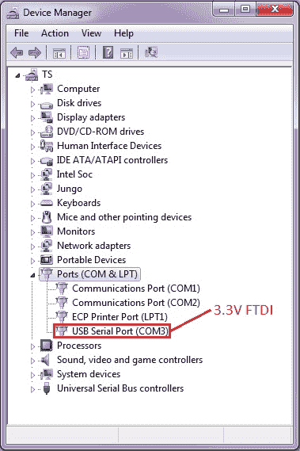](https://cdn.sparkfun.com/assets/learn_tutorials/6/5/4/FTDI_DeviceManager.jpg)

### 打开并连接到 *SDK_Demo.exe*

对于演示软件的基本操作，建议下载演示软件开发工具包(SDK ),该工具包链接在产品页面的文档部分。每个演示软件对于该版本的扫描仪都是唯一的，它可能无法与其他型号一起使用。

要在计算机上使用演示 SDK:

1.  从“文档”选项卡下的产品页面下载 *SDK_DEMO.exe* 。
2.  解压文件夹。
3.  转到解压后的目录，看起来应该是这样的:*...\20171129-SDK 演示版 1.9 \发布*。
4.  打开 *SDK_DEMO.exe* 可执行文件。
5.  在串行端口号的下拉菜单中选择 FTDI 枚举到的 COM 端口。*
6.  在波特率的下拉菜单中选择 9600。
7.  点击*打开*按钮。

***注**:可用的 COM 端口范围为“COM3”到“COM10”。如果您的 USB 到串行转换器枚举到一个比这个更高的数字，您将需要转到您的计算机的设备管理器来强制它到一个更低的 COM 端口号。

下图显示了 *SDK_DEMO.exe* 在连接之前的样子:

[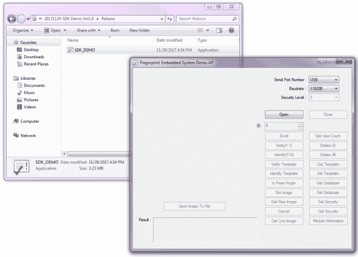](https://cdn.sparkfun.com/assets/learn_tutorials/7/2/3/OpenDirectoryFingerprintScannerSDK.png)

一旦打开演示 SDK，它将如下所示:

[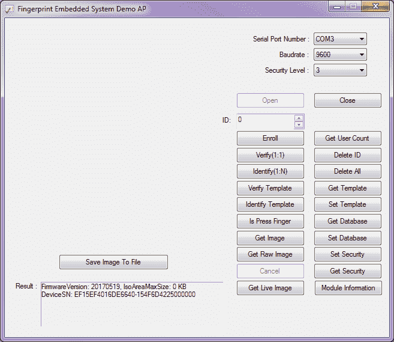](https://cdn.sparkfun.com/assets/learn_tutorials/7/2/3/FingerprintScannerConnectSDK.png)

根据制造商分配的序列号，*固件版本*和*设备编号*可能不同。将指纹扫描仪连接到 FTDI 后，我能够利用数据手册中提到的所有功能。演示软件中的功能基于协议命令。我们将在本节中讨论两个经常使用的功能。如果您感兴趣，请随意试验和测试其他特性。

### 参加

要将指纹注册到模块中，您需要为每个 ID 注册三次手指，然后扫描仪才能将其保存为模板。白色 LED 将亮起，开始读取您的指纹:

[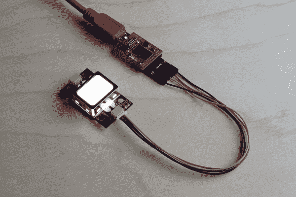](https://cdn.sparkfun.com/assets/learn_tutorials/7/2/3/FPSQwiicFTDIEnroll_1.jpg)

要注册指纹:

1.  通过调整 *ID:* 字段中的数字，选择一个没有存储指纹模板的 ID。对于这个例子，我们将假设模板*“0”*中没有任何内容。
2.  按下*注册*按钮。 *SDK_Demo.exe* 将通过请求*“输入手指 1！”在*结果:*输出中做出响应*
3.  将手指放在 FPS 上。输出将表明它是*“正在处理指纹...”*
4.  当它要求*“输入手指 2！”时，移开你的手指*
5.  放置和移开手指，直到 FPS 成功读取您的指纹 3 次。
6.  当您成功注册指纹后，将会收到通知。对于模板 *0* ，它会回应:*“注册 Ok (ID=0)！”*此时，指纹扫描仪的白色 LED 将熄灭。

如果扫描仪无法识别唯一的指纹或检测到放在扫描仪上的手指，它将停止注册并以*“超时！”*。如果在注册过程中扫描仪无法识别指纹，您将收到一个响应:*“注册失败！”*确保与扫描仪充分接触，并且在注册时手指放在相同的位置。

该模板将有一个与指纹扫描仪相关联的编号，并将保存在其本地数据库中。

### 识别

注册后，您将需要测试指纹是否可以被识别。为了测试和验证，按下*识别(1:N)* 。白色 LED 将会亮起，并向*发出“输入手指”的请求**SDK _ demo . exe*将检查本地数据库，看它是否能根据保存的指纹模板识别指纹。如果成功，它将响应一个匹配的 ID 和识别所用的时间:*" ID = 0:546 ms；"*。

## Arduino 的示例代码

### 使用*SDK _ demo . exe*w/*FPS _ Serial _ pass through . ino*

使用基于 Arduino Uno 的微控制器(即 [RedBoard 编程的 Arduino](https://www.sparkfun.com/products/13975) 或 [Arduino Uno](https://www.sparkfun.com/products/11021) )和[串行通过代码](https://github.com/sparkfun/Fingerprint_Scanner-TTL/blob/master/examples/FPS_Serial_Passthrough/FPS_Serial_Passthrough.ino)进行测试，我能够连接到指纹扫描仪产品页面上提供的 SDK 演示软件。如果您没有 3.3V FTDI 连接到指纹扫描仪，这可能是另一种选择。

要在 Arduino 微控制器连接到指纹扫描仪的情况下使用 SDK 演示，您需要:

1.  使用逻辑电平转换在 Arduino 和扫描仪之间建立一个电路。这是假设你使用 5V 的 Arduino。
2.  在 Arduion IDE 中，将*FPS _ Serial _ pass through . ino*草图上传到您的 Arduino。
3.  在标有*串口号*的 *SDK_demo.exe* 中，选择一个低于 COM10 的 COM 口(COM3 应该是你能使用的最低的)。
4.  选择波特率 *9600* 。
5.  在会话期间上传串行直通代码或第一次给 Arduino 通电后，您需要重置 Arduino。按下重置按钮。
6.  Arduino 初始化后，按下 SDK 中的“打开”按钮

**Note**: The available COM ports range from "COM3" to "COM10". If your USB-to-serial converter enumerates to a number higher than that, you would need to go to your computer's device manager to force it to a lower COM port number.

下图显示了 SDK_Demo 在使用 Arduino on *COM7* 和波特率 *9600* 打开之前的情况:

[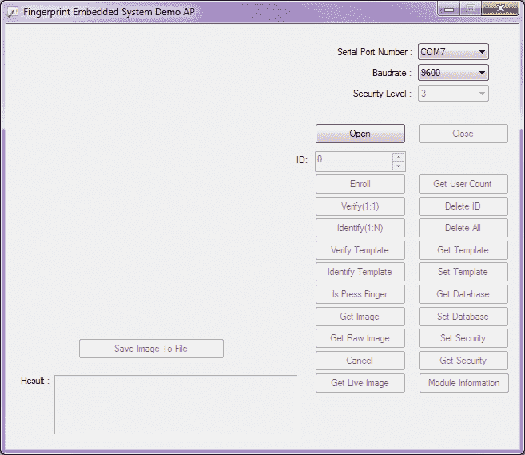](https://cdn.sparkfun.com/assets/learn_tutorials/7/2/3/FingerprintScannerConnectSDKArduinoSoftwareSerial.png)

### Hawley 面向 Arduino 的 FPS_GT511C3 库

**注意:**此示例假设您在桌面上使用的是最新版本的 Arduino IDE。如果这是你第一次使用 Arduino，请回顾我们关于[安装 Arduino IDE 的教程。](https://learn.sparkfun.com/tutorials/installing-arduino-ide)如果您之前没有安装 Arduino 库，请查看我们的[安装指南。](https://learn.sparkfun.com/tutorials/installing-an-arduino-library)

要创建一个不借助计算机就能读取指纹的独立系统，你需要用 Arduino 代码复制演示软件所做的事情。幸运的是有一个指纹扫描仪 Arduino 库是由 *jhawley* 写的。代码为您做了大部分的工作，并处理了许多复杂的协议命令。你可以使用下面的链接直接下载，或者在 [GitHub repo](https://github.com/sparkfun/Fingerprint_Scanner-TTL) 上找到源文件。

[FPS_GT511C3 Arduino Library](https://github.com/sparkfun/Fingerprint_Scanner-TTL/archive/master.zip)

与 *SDK_Demo.exe* 相比，这个库的功能有限，但它完成了工作。如果您查看 FPS_GT511C3 库中的注释，由于 Atmega328P 的内存限制，某些功能没有实现。某些功能在最初编写时也是不需要的。FPS_GT511C3 库和示例代码适用于 GT511C3 和 GT511C1R 型号。

本库有三个例子。每个人用 FPS 执行不同的任务:

1.  白色 LED 闪烁。
2.  注册指纹。
3.  尝试根据本地数据库识别指纹。

#### 示例 1:基本串行测试 w/ *FPS_Blink.ino*

[*FPS_Blink.ino*](https://github.com/sparkfun/Fingerprint_Scanner-TTL/blob/master/examples/FPS_Blink/FPS_Blink.ino) 草图是一个基本测试，用于查看 Arduino 是否能够通过串行 UART 与指纹扫描仪进行通信。作为基本的健全性检查，建议测试该代码，以确保您的连接是正确的，并且扫描仪能够发送/接收命令。该代码设置 Arduino 的硬件串行 UART 进行调试，并告诉扫描仪发送串行调试消息。该代码还初始化与指纹扫描仪的连接。

一旦设置完成，Arduino 将告诉指纹扫描仪切换白色 LED。通过在 *9600* 波特打开[串行监视器](https://learn.sparkfun.com/tutorials/terminal-basics/arduino-serial-monitor-windows-mac-linux)，你应该看到这个输出:

```
FPS - Open
FPS - SEND: "55 AA 01 00 00 00 00 00 01 00 01 01"
FPS - RECV: "55 AA 01 00 00 00 00 00 30 00 30 01"

FPS - LED on
FPS - SEND: "55 AA 01 00 01 00 00 00 12 00 13 01"
FPS - RECV: "55 AA 01 00 00 00 00 00 30 00 30 01"

FPS - LED off
FPS - SEND: "55 AA 01 00 00 00 00 00 12 00 12 01"
FPS - RECV: "55 AA 01 00 00 00 00 00 30 00 30 01" 
```

打印到串行监视器时，代码将重复并切换指示灯。

#### 示例 2:注册 w/ *FPS_Enroll.ino*

[*FPS_Enroll.ino*](https://github.com/sparkfun/Fingerprint_Scanner-TTL/blob/master/examples/FPS_Enroll/FPS_Enroll.ino) 用于在每次 Arduino 复位时注册指纹。指纹将保存在扫描仪本地数据库的模板中。代码将像 *FPS_Blink.ino* 草图一样初始化。LED 将保持亮起以扫描指纹，而不是切换 LED。在 *setup()* 函数结束之前，会跳转到 *Enroll()* 函数。 *Enroll()* 函数将寻找一个空的模板 ID，并开始注册您的指纹。

成功注册手指后，串行监视器会显示以下内容:

```
 Press finger to Enroll #3
    Remove finger
    Press same finger again
    Remove finger
    Press same finger yet again
    Remove finger
    Enrolling Successful 
```

如果扫描仪在注册过程中无法识别您的手指，它将拒绝指纹。如果您的手指没有放在与其他扫描相同的位置，模板将不会被保存。发生这种情况时，您需要重新启动注册过程。

如果第一次扫描与第二次扫描不匹配，当扫描仪失败时，会出现以下情况。

```
 Press finger to Enroll #4
    Remove finger
    Press same finger again
    Failed to capture second finger 
```

尝试通过上传代码并遵循串行监视器的输出来注册指纹。要注册多个指纹，只需重置 Arduino。

#### 示例 3:识别 w/ *FPS_IDFinger.ino*

[*FPS_IDFinger.ino*](https://github.com/sparkfun/Fingerprint_Scanner-TTL/blob/master/examples/FPS_IDFinger/FPS_IDFinger.ino) 草图检查手指是否在扫描仪上。一旦手指被放在扫描仪上，它就会对照本地数据库中保存的任何指纹来检查指纹。如果指纹与某个 ID 匹配，如果指纹未找到，或者当它无法读取指纹时，将通过串行监视器通知您。检查并抬起手指后，它会要求检查另一个指纹。

使用此示例时，您会看到以下内容:

```
Verified ID:0
Finger not found
Finger not found
Verified ID:0
Verified ID:0
Please press finger
Please press finger
Please press finger
Verified ID:2
Please press finger
Verified ID:2
Please press finger 
```

查看输出，“Finger not found”通常意味着:指纹与任何模板 id 都不匹配，或者扫描仪无法清楚地读取指纹。如果手指已注册，您需要确保将指纹放在扫描仪上，就像扫描手指时一样。

### 调整 GT-521 f52 3000 ID 的代码

根据您使用的型号，请确保更改指纹 id 的数量。例如，GT521F52 可以容纳 3000 个指纹 id，而不是 200 个。将指纹注册到 GT-521F52 时，您需要确保将 *[FPS_GT511C3.cpp](https://github.com/sparkfun/Fingerprint_Scanner-TTL/blob/master/src/FPS_GT511C3.cpp)* 文件中的`FPS_GT511C3::Enroll1()`、`FPS_GT511C3::Enroll2()`和`FPS_GT511C3::Enroll3()`功能的`retval < 200` 更改为`retval < 3000`。

当使用 GT-521F52 识别指纹时，确保将 *FPS_GT511C3.cpp* 文件中的`FPS_GT511C3::Identify1_N()`功能的`if (retval > 200) retval = 200;`更新为`if (retval > 3000) retval = 3000;`。您还需要将*[FPS _ id finger . ino](https://github.com/sparkfun/Fingerprint_Scanner-TTL/blob/master/examples/FPS_IDFinger/FPS_IDFinger.ino)*文件中的`id <200`更改为`id <3000`。

尝试用代码测试扫描仪，看看扫描仪是否能够读取注册的指纹。

### 带其他微控制器的软件串行

演示代码最初是为 Arduino Uno 上的 ATmega328P 设计的。如果你是配合 ATmega2560(即 Arduino Mega 2560)或 ATmega32U4(即 Arduino Leonardo、Pro Micro 5V/16MHz、Pro Micro 3.3V/8Mhz、FioV3 等)使用。)，您需要重新配置软件串行引脚定义并调整连接。并非所有引脚都支持串行 Rx 引脚的更改中断，具体取决于所使用的 Arduino 微控制器。有关更多信息，请尝试查看[软件串行库](https://www.arduino.cc/en/Reference/SoftwareSerial)的参考语言。

要在 Arduino Mega 2560 或 Arduino Leonardo 上使用 FPS，您只需注释掉以下代码行:

```
language:c
SoftwareSerial fps(4, 5); // (Arduino SS_RX = pin 4, Arduino SS_TX = pin 5) 
```

并取消注释该行:

```
language:c
SoftwareSerial fps(10, 11); // (Arduino SS_RX = pin 10, Arduino SS_TX = pin 11) 
```

一旦您更改了代码，请确保重新布线您的连接以遵循引脚定义。

***注意:**FPS _ gt 511 c 3 库可能不适用于所有使用 Arduino IDE 的微控制器。当您脱离 ATmega328P 系列时，您可能需要修改代码或移植库以使其工作。让 Atmega328P 引导加载 Arduino 来处理 FPS 代码会更容易、更快。要使用指纹扫描仪，您只需编写额外的代码，让 ATmega328P 向另一个微控制器发送串行数据。*

## 固件概述

如果您感兴趣的话，这一节会更进一步，简单地看一下命令协议。我们将快速浏览指纹扫描仪的[闪烁示例](https://github.com/sparkfun/Fingerprint_Scanner-TTL/blob/master/examples/FPS_Blink/FPS_Blink.ino)和 Arduino，以及命令协议如何根据手册运行。

**验证校验和值**

要验证*命令包(命令)*或*响应包(应答)*的校验和，您需要添加命令开始代码、设备 id、参数和命令/响应的字节。查看 Arduino 闪烁示例，串行监视器输出:

```
FPS - Open
FPS - SEND: "55 AA 01 00 00 00 00 00 01 00 01 01"
FPS - RECV: "55 AA 01 00 00 00 00 00 30 00 30 01"

FPS - LED on
FPS - SEND: "55 AA 01 00 01 00 00 00 12 00 13 01"
FPS - RECV: "55 AA 01 00 00 00 00 00 30 00 30 01"

FPS - LED off
FPS - SEND: "55 AA 01 00 00 00 00 00 12 00 12 01"
FPS - RECV: "55 AA 01 00 00 00 00 00 30 00 30 01" 
```

该示例将数据包结构显示为多字节项，表示为 [little endian](https://learn.sparkfun.com/tutorials/binary#counting-and-converting) 。分解 LED 命令以十六进制关闭 LED，它是:

```
55 AA 01 00 00 00 00 00 12 00 12 01
, where Command Start code1 = 0x55
        Command Start code2 = 0xAA
        Device ID = 0x00 01
        Input parameter = 0x00 00 00 00
        Command Code = 0x00 12 
```

通过用程序员计算器将十六进制值相加，如数据手册所述:

OFFSET[0]+OFFSET[1]+OFFSET[2]+OFFSET[3]+OFFSET[4]+OFFSET[5]+OFFSET[6]+OFFSET[7]+OFFSET[8]+OFFSET[9]= 0x 55+0x aa+0x 01+0x 00+0x 00+0x 00+0x 00+0x 00+0x 12+0x 00

，我们能够获得与命令包的校验和相同的输出结果:

```
Checksum = 0x01 12 
```

由于校验和被读取为小端，因此输出将校验和读取为“12 01”。

## FPS 实验

在外壳下面，扫描仪使用发光二极管和微型摄像头读取指纹。在背面，有一个处理器，它将试图读取放在扫描仪外壳顶部的任何东西。

### 手绘“指纹”

我有兴趣看看指纹扫描仪是否能够识别放置在指纹扫描仪上的任何其他物品。我用便利贴上的几张图进行了测试:

[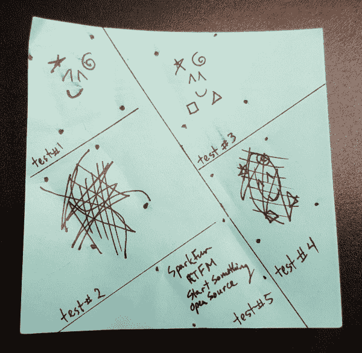](https://cdn.sparkfun.com/assets/learn_tutorials/7/2/3/FingerprintScribbleDrawing.jpg)

我画了基准点，将指纹扫描仪与下图中的图纸对齐。这确保了每次扫描指纹都放在相同的位置。

[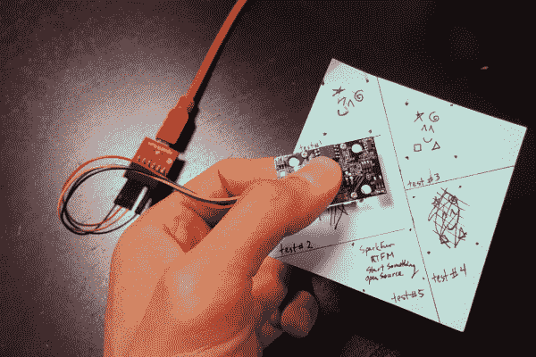](https://cdn.sparkfun.com/assets/learn_tutorials/7/2/3/GT-521FxxFingerprintScribbleScan.jpg)

我首先在测试#1 和测试#2 中画了一个图案。测试#1 未能正确注册，因为它没有很多详细信息。我继续在测试#1 中测试该绘图，看看扫描仪何时会接受该绘图。测试#2 通过添加更多的细节成功地注册和识别。在测试#3 中，我多画了一点，但是指纹扫描仪无法识别。测试 4 中的图画足以让扫描仪通过添加线条和涂鸦来识别，这些线条和涂鸦类似于人指纹的独特图案。在测试#5 中，我感兴趣的是看看扫描仪是否能够将单词识别为指纹。虽然指纹扫描仪能够识别出有“手指”按在扫描仪上，但它无法完成注册过程。这些文字可能没有创造出扫描仪能够接受的足够多的图案。

我还对每张图片扫描后的样子感兴趣。幸运的是， *SDK_Demo.exe* 有一个获取图像并保存为位图的特性。“获取图像”按钮要求在设备开始扫描之前按下有效的指纹。“获取原始图像”会立即扫描扫描仪上的任何内容，即使它不是有效的指纹图案。点击“保存图像到文件”后，一个 240x216 大小的位图图像从 GT-511C1R 的光学感应区被取出并保存到我的电脑上。以下是保存模式后的测试图像:

| 测试#1(失败) | 测试#2(通过) | 测试#3(失败) | 测试#4(通过) | 测试#5(失败) |
| [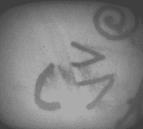](https://cdn.sparkfun.com/assets/learn_tutorials/7/2/3/GetRawImageTest1.bmp) | [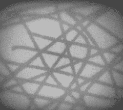](https://cdn.sparkfun.com/assets/learn_tutorials/7/2/3/GetRawImageTest2.bmp) | [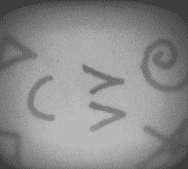](https://cdn.sparkfun.com/assets/learn_tutorials/7/2/3/GetRawImageTest3.bmp) | [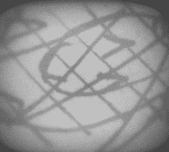](https://cdn.sparkfun.com/assets/learn_tutorials/7/2/3/GetRawImageTest4.bmp) | [](https://cdn.sparkfun.com/assets/learn_tutorials/7/2/3/GetRawImageTest5.bmp) |

### 更多失败的尝试

我尝试使用丝印和 SparkFun EL 测序仪的痕迹，看看扫描仪是否能够注册。不幸的是，它不能接受董事会作为指纹。纸板似乎离得太远，导致图像光线暗淡，丝网印刷不足以作为图案传递。下面是一张未能注册的 SparkFun EL Sequencer 的丝网印刷图片:

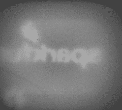

作为最后的测试，扫描仪被用于手掌。虽然它能够注册一次，但扫描仪在大多数情况下无法识别它。将指纹扫描仪放在手掌的同一位置并不容易。扫描仪只能识别手掌一次。有可能手掌上的隆起和施加在扫描仪上的压力不够大。

## 解决纷争

下面列出了与指纹扫描仪相关的常见问题的常见问题解答和技术支持提示。

**1。)我不确定指纹扫描仪是否会响应我的 Arduino 的任何命令。我能怎么做呢？**

确保没有松动的连接。如果您使用的是 [JST SH 跳线 4 线组件](https://www.sparkfun.com/products/10359)，与 Arduino 的插座相比，电缆的电线相对较细。轻微的碰撞可能会中断连接，需要重启指纹扫描仪或重置 Arduino。

此外，确保根据 Arduino 型号和定义的软件串行引脚，将指纹扫描仪正确连接到微控制器。

**2。)扫描仪注册时不识别你的手指？**

使用 *SDK_Demo.exe* 或 Arduino 示例代码时，尝试注册可能会出现问题。这通常是由于手指干燥，与扫描仪接触不良。对于所有三次登记，手指必须被施加相同的压力并被放置在相同的位置。手指放在扫描仪上的时间也有点棘手。一名技术支持代表必须尝试几次才能注册一个手指。这在任何指纹扫描仪中都很常见，比如智能手机上的指纹扫描仪。

如果您看到这些错误，您可能没有在每次注册时将手指充分放在指纹扫描仪上:

```
Bad finger! 
```

或者

```
Failed to capture second finger 
```

或者

```
The enrollment is failed! 
```

如果您正在使用 FTDI，请尝试按照说明再次注册 FTDI。在重新注册之前，您可能需要关闭该程序并拔出/重新插入 FTDI。如果您使用的是 Arduino，请将手指放在扫描仪上，重置 Arduino，然后按照串行监视器中的说明进行操作，再次尝试注册过程。

**3。)验证时扫描仪不识别你的手指？**

如果您尝试验证指纹，请确保将手指放在扫描仪上，就像注册时一样。如上所述，扫描指纹的相同条件适用于注册。

**4。)GT-521F32 / GT-521F52 指纹扫描仪能和 FPS_GT511C3 库一起工作吗？**

是的，会的。已经测试过了。每个指纹扫描仪都使用相同的命令协议，因此 Arduino 示例代码可以用于任何扫描仪。但是，如果您使用不是由 ADH-Tech 制造的不同扫描仪，该库将不兼容。

**5。)我可以使用 Arduino Due 吗？**

遗憾的是，的指纹扫描仪的 Arduino 示例代码不能与 Arduino 一起使用。您需要修改代码并将其用于硬件串行 UARTs，因为 Arduino Due 不支持软件串行。这篇旧论坛帖子将解释为什么使用 Arduino Due board definition = >[Arduino . cc Forums:software serial for Arduino Due](http://forum.arduino.cc/index.php?topic=142902.0)的示例代码会出现编译错误。

**6。)指纹扫描仪的尺寸有多大？**

数据表第 8 页[中列出了尺寸。](https://cdn.sparkfun.com/assets/learn_tutorials/7/2/3/GT-521FX2_datasheet_V1.1__003_.pdf)

7 .**。)我焊接到指纹扫描仪的背面，没有一个 Arduino 示例工作。**

如果你想将指纹扫描仪直接连接到 USB 端口，这些引脚是断开的。USB 数据线不同于串行 UART 协议。如果您的项目使用 Arduino 示例，建议连接到 JST SH 连接器。如果您有兴趣将扫描仪直接插入计算机的 COM 端口，请随意测试和试验。它已经过测试，可以与以前的型号一起使用。

*指纹扫描仪 USB 引脚排列*

惊喜！您找到了关于如何连接 USB 引脚的额外部分！本教程的开始部分没有包括 USB 连接，因为主要目的是在带有 Arduino 微控制器的嵌入式项目中使用它。要将指纹扫描仪与演示软件和计算机的 USB 端口连接，您可以将主板背面标有 *J1* 的焊盘直接连接到计算机的 USB 端口。下图和下表显示了引脚排列:

[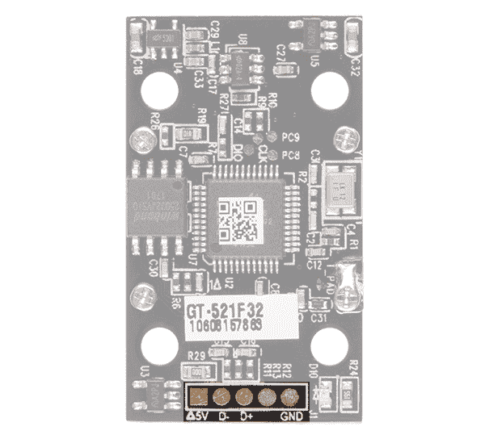](https://cdn.sparkfun.com/assets/learn_tutorials/7/2/3/14518-03_FPS_USB.png)

| 指纹扫描仪 | 通用串行总线接口 |
| 屏蔽(最右边的引脚) | USB 屏蔽(如果使用 USB 分线板，则不需要)。与 GND 有关。 |
| GND | GND(标准 USB 黑线) |
| D+ | D+(标准 USB 白色电线) |
| D- | D-(标准 USB 绿线) |
| 方形焊盘 | 5V(标准 USB 红线) |

有关焊接到 USB 焊盘的更多信息，请查看旧教程中提供的说明。方向基本上是一样的。

[Connecting to the Fingerprint Scanner's USB Data Pins](https://learn.sparkfun.com/tutorials/fingerprint-scanner-hookup-guide#fps_usb_hookup)

## 资源和更进一步

既然您已经成功地启动并运行了您的指纹扫描仪，那么是时候将它整合到您自己的项目中了！

有关更多信息，请查看以下资源:

*   GT-521F32/GT-521F52
    *   [数据表](https://cdn.sparkfun.com/assets/learn_tutorials/7/2/3/GT-521FX2_datasheet_V1.1__003_.pdf)
    *   [编程指南](https://cdn.sparkfun.com/assets/learn_tutorials/7/2/3/GT-521F52_Programming_guide_V10_20161001.pdf)
    *   [SDK 演示软件](https://cdn.sparkfun.com/assets/learn_tutorials/7/2/3/20171129-SDK_Demo_Ver1.9.zip)
*   [GitHub 储存库，用于 FPS 的 Arduino 示例代码](https://github.com/sparkfun/Fingerprint_Scanner-TTL)
*   [SparkFun 产品展示:GT-521Fx2 指纹扫描仪](https://youtu.be/PPNoO5uaUhM)
    *   [肖恩的产品展示要点演示代码](https://gist.github.com/ShawnHymel/6598b93dcaf6346cd1d0c1bf57388ce5)

* * *

### 更多教程和项目示例！

有关使用 ADH-Tech 旧型号指纹扫描仪的更多教程和项目想法，请查看以下内容。下面列出的大多数例子都使用了旧的模块，但是您应该不会注意到这两种型号之间在功能性上的任何显著差异。

#### 阿尔杜伊诺

*   [Instructables.com-DIY 指纹扫描车库门开门器](http://www.instructables.com/id/DIY-Fingerprint-Scanning-Garage-Door-Opener/)
*   [黑客日:生物安全 Goflcart 允许无钥匙启动](https://hackaday.com/2014/08/20/biometric-secured-golfcart-allows-for-keyless-start/#more-129587)
    *   [要点:GT511-C1 和阿蒂尼](https://gist.github.com/ramicaza/c1fafa49951767e7a31c)
*   [GitHub: GT5X Arduino 库](https://github.com/brianrho/GT5X)
*   [启动电子设备- GT-511C3 指纹扫描仪硬件、接线和连接器编号](http://startingelectronics.org/articles/GT-511C3-fingerprint-scanner-hardware/)
*   [Homa automation-在 arduino 上玩指纹扫描仪(FPS)](http://www.homautomation.org/2014/10/11/playing-with-finger-print-scanner-fps-on-arduino/)
*   SparkFun 的万物之友！-物联网 Ep 1:气闸演示项目 w/ 3 因子认证和 [GitHub Repo for IoT 3 因子验证](https://github.com/sparkfun/IoT_Airlock/blob/master/Arduino/Three_step_varification_code/Three_step_varification_sensor_code.ino)

#### 树莓派

如果你看一下用户 [*让·马楚卡*在 Pi 论坛](https://www.raspberrypi.org/forums/viewtopic.php?f=61&t=74178)的帖子，就会发现这个指纹扫描仪有一个 Raspberry Pi Python 库。

似乎有一篇文章使用 GT-511C1R 和一个树莓 Pi 作为服务器和 SQLite [ [FingerScanner:在树莓 Pi](https://www.ncbi.nlm.nih.gov/pmc/articles/PMC4801596/) 中嵌入指纹扫描仪。根据这些信息，可以从一台服务器远程管理多台指纹扫描仪上的数据库。

#### 节点. js

Node.js 中有一个例子，在-AjK 的 GitHub 库中有一个 API。

#### 比格犬骨黑

有一个 BeagleBone 黑色 Python 库，由用户[jamemarcoliese _ 的顶点设计团队](https://github.com/JamesMarcogliese/Fingerprint_Scanner-TTL)开发。

#### 。网

或者去看看 Unosquare 的[。GitHub 上的. NET 实现](https://github.com/unosquare/sparkfunfingerprint)。****