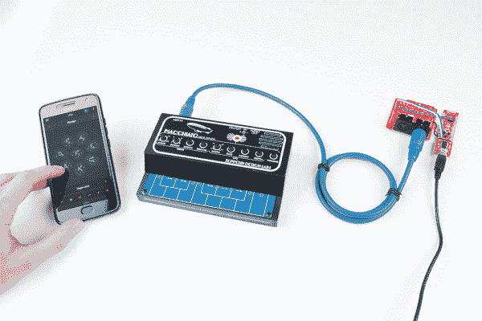
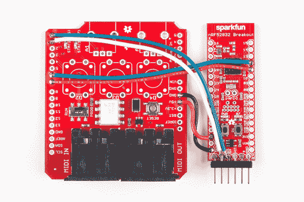
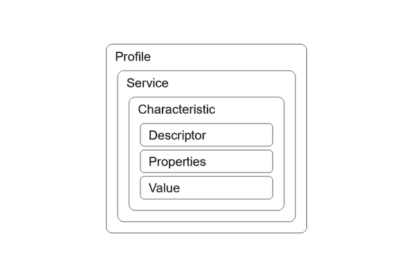
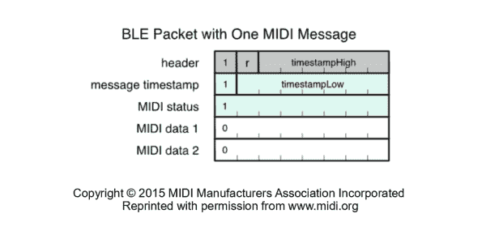
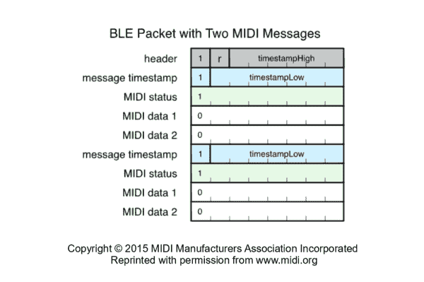
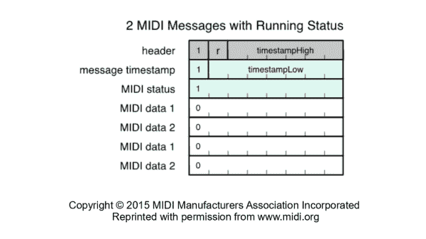
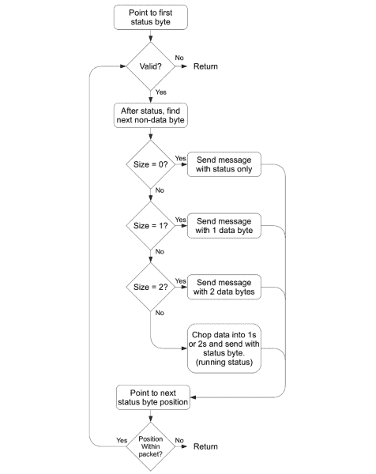
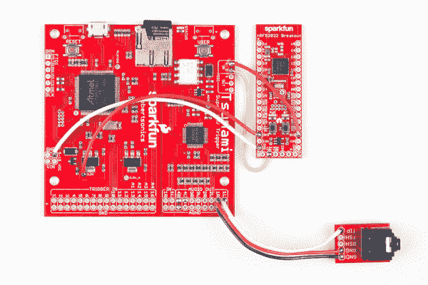

# 迷笛 BLE 教程

> 原文：<https://learn.sparkfun.com/tutorials/midi-ble-tutorial>

## 介绍

当引入新技术时，旧技术通常会被扭曲以符合新标准。MIDI 也不例外，通过蓝牙低能耗链接，它非常容易使用。

[](https://cdn.sparkfun.com/assets/learn_tutorials/7/0/2/Marshallnursday-04.jpg)*A cellphone can control an instrument as if by magic*.

本教程使用 nRF52832 分线板作为 BLE 无线电和 MIDI 解析处理器。为了便于学习，分线点连接到一个标准的 [MIDI 屏蔽](https://www.sparkfun.com/products/12898)。串行 MIDI 到 BLE 已经可以作为一种消费产品，但它是一个很好的平台来讨论这个问题的各个部分。

这包括:

*   MIDI 的基本 BLE 配置。
*   解码 MIDI BLE 数据包并对其进行处理。
*   编码 MIDI BLE 包。
*   创建完整的 BLE 到 DIN 转换工具。

这里展示的部分或全部代码可以作为构建 MIDI BLE 设备的起点。

### 背景要求

完成本教程需要以下内容。

1.  对原始 MIDI 规范的理解。在[www.midi.org](https://www.midi.org/)*有完整版(大量使用 midi？免费加入并成为会员！)*。SparkFun [MIDI 教程](https://learn.sparkfun.com/tutorials/midi-tutorial/)深入分解了规范。如果只需要简单复习一下，midi.org 的[midi 消息摘要](https://www.midi.org/specifications/item/table-1-summary-of-midi-message)是用于实现 MIDI 协议的特定页面。

2.  可以与 MIDI BLE 设备接口的电脑或移动设备。

3.  一个 [nRF52832 分线点](https://www.sparkfun.com/products/13990)和 [FTDI 基本分线点- 3.3V](https://www.sparkfun.com/products/9873)

4.  本教程中的代码示例保存在 GitHub repo [MIDI-BLE 适配器](https://github.com/sparkfun/MIDI-BLE-Adapter)中。克隆它。

5.  nRF52832 的 Arduino 和板包安装。按照 [nRF52832 分线板连接指南](https://learn.sparkfun.com/tutorials/nrf52832-breakout-board-hookup-guide)安装板文件和 BLEPeriphrial 库。

**Isolating Windows Installations** To create a stand-alone Arduino installation in windows that doesn't tie into any other installations,

*   以 zip 格式下载 Arduino 程序，并解压缩到一个新位置
*   第一次启动 Arduino 之前，在提取的位置创建一个名为“portable”的新文件夹。一看到‘便携’Arduino 就知道用这个做包裹。
*   创建一个名为“localSB”的文件夹(名称和位置无关紧要)
*   运行 Arduino 并将你的本地 sketchbook 设置到你创建的文件夹中，Arduino 会将库填充到其中。

### MIDI BLE 支持的设备。

迷笛 BLE 只存在了几年，所以支持是不稳定的。花些时间谷歌一下你的设备和“BLE 迷笛”，看看会出现什么。这里有一些一般信息。有成功吗？请在评论中发布设备和操作系统信息。

#### 苹果个人计算机

通过*工具- >系统信息*进入你的“系统报告”。MIDI BLE 可用于“LMP 版本”0x06 或更高版本。在这篇关于 imore.com[的文章](https://www.imore.com/how-tell-if-your-mac-has-bluetooth-40)中有更多关于检查你的 Mac 的信息。

*   使用音频 MIDI 设置来搜索设备。
*   尝试 Pocket MIDI 来测试通信。

#### 苹果手机

一般来说，iOS 8 应该支持 BLE MIDI，但这是未经测试的。

#### Windows 操作系统

完全更新的 Windows 10 机器应该有 MIDI BLE 支持。

程序 [MIDIBerry](https://www.microsoft.com/en-us/store/p/midiberry/9n39720h2m05) 非常简单，但可以用来将 BLE 设备连接到其他 Windows 程序。

#### 机器人

Android 6.0 棉花糖或更高版本应该有软件支持。尝试应用程序 [MIDI BLE 连接](https://play.google.com/store/apps/details?id=com.mobileer.example.midibtlepairing&hl=en)，看看你是否可以扫描设备。

### 推荐的材料和工具

#### 开发硬件

虽然运行代码只需要 nRF52832 分线点和 FTDI，但建议附加一个 [MIDI 屏蔽](https://www.sparkfun.com/products/12898)。下一节将详细介绍如何将这两者结合起来。

#### MIDI 外设

有一堆可用的 midi 设备。当处理如此多的未知问题时，最好有一些熟悉的、可以依赖的东西来帮助缩小问题发生的范围。

以下是一些选项:

*   有线 MIDI 接收器，可以在 MIDI 数据包经过时显示它们。这可以是带有另一个运行 [MIDI 分析软件](https://learn.sparkfun.com/tutorials/midi-shield-hookup-guide/example-3-midi-analyzer)的 MIDI shield 的 Arduino UNO，或者是带有软件的物理 MIDI 端口的计算机。
*   有线 MIDI 发射器。通常是键盘。
*   BLE 迷笛接收器。在 Mac 上,“袖珍 MIDI”程序运行得非常好。对于 windows 来说，MIDIBerry 还可以。
*   BLE 迷笛发射机。再说一遍，电脑上的软件可以完成这项工作。

## 开发硬件

### 硬件连接

通过向 FTDI 串行引脚添加接头来准备 nRF52832 分线板。通过在两个 MIDI 插孔中焊接来准备 MIDI 屏蔽。

[](https://cdn.sparkfun.com/assets/learn_tutorials/7/0/2/Marshallnursday-03.jpg)*The assembled MIDI shield and nRF52832*

用松散的电线进行以下连接。RX 和 TX 通孔被 FTDI 引脚头占据，将它们钉在引脚背面。

| nRF52832 分线板引脚
 | MIDI 屏蔽引脚
 |
| GND | 全球导航卫星系统(T0) |
| 3.3V
 | 5V
 |
| 26(RX)
 | RX
 |
| 27(TX)
 | TX
 |
| Eleven | 7(红色发光二极管)
 |
| 12
 | 6(绿色发光二极管)
 |

**Notice** the nRF52832 is providing 3.3V for the MIDI shield which is intended to operate at 5.0V. To help boost currents at the lower voltage, the series resistors should be changed from 220 Ohm to 150 Ohm. For the handful of devices tested during this tutorial the shield has been found to work OK without modification.

### 健全性检查

花一点时间来确保开发链已经启动并正常工作。

#### 代码可以上传到 nRF52832 吗？

确保基本的眨眼草图有效。尝试驱动 3 个状态 led，低电平有效。测试串行消息是否到达您的计算机。编程后，nRF82832 喜欢冻结其串行总线，需要通过按钮手动复位。熟悉如何让主板进入引导模式。

**Entering the Bootloader:** Sometimes it can be challanging to get back into the bootloader. Try using a flat object, like the side of a pen, to push both buttons at the same time. Then roll off with different rates, keeping button 'D6' depressed longer.

#### 所需的库是否存在？

**注意:**这些示例假设您在桌面上使用的是最新版本的 Arduino IDE。如果这是你第一次使用 Arduino，请回顾我们关于[安装 Arduino IDE 的教程。](https://learn.sparkfun.com/tutorials/installing-arduino-ide)如果您之前没有安装 Arduino 库，请查看我们的[安装指南。](https://learn.sparkfun.com/tutorials/installing-an-arduino-library)

确保可以在不中断构建过程的情况下添加以下包含。

```
language:c
#include <MIDI.h>
#include <BLEPeripheral.h> 
```

此外，请确保正在使用的 MIDI 库不是来自 Arduino 或可疑的来源。应该是最新最好的从[到](https://github.com/FortySevenEffects/arduino_midi_library)的 GitHub，应该是**手动**安装:

[Arduino MIDI Library](https://github.com/FortySevenEffects/arduino_midi_library)

详细调试打开时，构建日志显示 MIDI.cpp 来自本地 sketchbook 库文件夹。

```
"C:\ArduinoConfigurations\arduino-1.8.2_nRF52\localSB\libraries\arduino_midi_library\src\MIDI.cpp" -o 
```

#### MIDI 屏蔽是否配置为“PROG”？

midi 屏蔽上的开关将数据流导向处理器。当切换到“运行”时，MIDI IN 端口和 FTDI 的 TX 引脚都连接到 nRF52832。由于它的连线方式，MIDI IN 将压倒 FTDI，程序将无法加载。或者，在“PROG”位置，MIDI IN 端口断开，可以进行编程。

#### 你有美味的饮料吗？

使用协议可能需要一点耐心。坚持住！

## 创建基本的 BLE 外围设备

这里的目标是制作一个符合 MIDI BLE 规范的程序，并在扫描蓝牙设备时出现。BLEPeripheral 库在抽象出通信细节方面做得很好，但是了解一点 BLE 的工作方式对于赋予设置 BLE 外设时所用的单词以意义是很有用的。

BLE 旨在支持各种设备，因此需要可扩展的架构。使用术语 GATT，它代表通用属性配置文件。

该配置文件描述了特定 BLE 系统所需的对象集合。

一个配置文件可以有多个服务，每个服务都是一个或多个特征的集合。

特征包含将被操作的数据。每个只能有一个值和一个属性。对于 nRF52832，该值最多可达 20 个字节。

每个服务和每个特征都有一个唯一的名称，告诉连接的系统它正在处理哪种设备。它被称为 UUID(通用唯一标识符)，可以是 16 位或 128 位。

有关更多信息，请参见[bluetooth.com](https://www.bluetooth.com/specifications/gatt/generic-attributes-overview)的文档。

#### MIDI BLE 配置文件

MIDI BLE 是一个非常简单的拓扑结构的实现。有一项服务和一个特征是必需的。

[](https://cdn.sparkfun.com/assets/learn_tutorials/7/0/2/BLETopo.png)*A MIDI BLE device has a very simple topology, with a single service and single characteristic*.

作为 midi.org 发布标准的一部分，设备应具备:

*   *MIDI 服务*的 UUID 为:03b 80 e5a-ede 8-4b 33-A751-6 ce 34 EC 4c 700
*   *MIDI 特性*的 UUID 为:7772 e5db-3868-4112-a1a 9-f 2669d 106 BF 3，具有以下特性:
    *   写而无回应
    *   阅读
    *   通知

接下来，使用 BLEPeripheral 库来描述拓扑——它的 API[记录在 GitHub](https://github.com/sandeepmistry/arduino-BLEPeripheral/blob/master/API.md) 上。通过使用 API 来告诉库如何形成自己，nRF52832 将成为一个 MIDI BLE 设备，并且可以通过特征值访问数据。

要使用 BLEPeripheral 库，请将各层的内存空间声明为持久对象，然后将它们添加到 BLE 外围对象中。然后，可以启动和使用外围对象。

声明了主对象。这是固定其他物体和操作无线电的东西。

```
language:c
BLEPeripheral blePeripheral; 
```

为服务和特征声明单独的层对象(属性)。该特征也是用最大值大小 20 构造的，这是 nRF52832 允许的最大大小。

```
language:c
BLEService service("03B80E5A-EDE8-4B33-A751-6CE34EC4C700");
BLECharacteristic characteristic("7772E5DB-3868-4112-A1A9-F2669D106BF3", BLERead | BLEWriteWithoutResponse | BLENotify, 20 ); 
```

此外，还会创建一个描述符。它是可选的，告诉中央服务器禁用通知，这意味着 ble 外围设备可以在中央服务器上发送数据而无需确认。这可能有影响，也可能没有影响，具体取决于中央处理器的编程方式。

```
language:c
BLEDescriptor descriptor = BLEDescriptor("2902", 0); 
```

单独创建对象不会有任何效果。为了方便起见，还有一些事情放在一个名为`setupBLE()`的例程中。在`setup()`期间调用一次。外围设备被命名，被告知通告服务的 UUID，并被赋予一个初始值。然后，外设通过`.begin()`启动，连接到系统。此时，BLE 设备应该是可被发现的。

```
language:c
void setupBLE()
{
    blePeripheral.setLocalName("BLE MIDI Starter"); //local name sometimes used by central
    blePeripheral.setDeviceName("BLE MIDI Starter"); //device name sometimes used by central
    blePeripheral.setAdvertisedServiceUuid(service.uuid()); //Advertise MIDI UUID

    // add attributes (services, characteristics, descriptors) to peripheral
    blePeripheral.addAttribute(service);
    blePeripheral.addAttribute(characteristic);
    blePeripheral.addAttribute(descriptor);

    // set initial value
    characteristic.setValue(0);

    blePeripheral.begin();
} 
```

在主程序循环中，在本地创建一个对象，用于确定外设是否连接到中央处理器。这段代码的结构取自 BLEPeripheral 示例。

```
language:c
void loop()
{
    BLECentral central = blePeripheral.central();
    if (central) {
        while (central.connected()) {
            if (characteristic.written()) {
            }
        }

    }
} 
```

综上所述，可以编写一个简单的程序来建立与 BLE 中心的连接。如果设备已连接，它会打开绿色 LED。如果数据写入器件，器件会闪烁红色 LED，并将写入串行端子的值打印为十六进制。

```
language:c
#include <BLEPeripheral.h>

#define BLUE_STAT_PIN     7   // LED on pin 7
#define RED_STAT_PIN     11   // LED on pin 11
#define GREEN_STAT_PIN   12   // LED on pin 12
#define BTN_PIN           6   // User button 

// create peripheral instance, see pinouts above
//const char * localName = "nRF52832 MIDI";
BLEPeripheral blePeripheral;
BLEService service("03B80E5A-EDE8-4B33-A751-6CE34EC4C700");
BLECharacteristic characteristic("7772E5DB-3868-4112-A1A9-F2669D106BF3", BLERead | BLEWriteWithoutResponse | BLENotify, 20 );
BLEDescriptor descriptor = BLEDescriptor("2902", 0);

void setup() {
    Serial.begin(115200);
    delay(3000);
    Serial.println("Program Started");

    //Setup diag leds
    pinMode(BLUE_STAT_PIN, OUTPUT);
    pinMode(RED_STAT_PIN, OUTPUT);
    pinMode(GREEN_STAT_PIN, OUTPUT);
    digitalWrite(BLUE_STAT_PIN, 1);
    digitalWrite(RED_STAT_PIN, 1);
    digitalWrite(GREEN_STAT_PIN, 1);

    //Setup nRF52832 user button
    pinMode(BTN_PIN, INPUT_PULLUP);

    setupBLE();

}

void loop()
{
    BLECentral central = blePeripheral.central();
    if (central) {
        while (central.connected()) {
            digitalWrite(GREEN_STAT_PIN, 0);
            //Check if data exists coming in from BLE
            if (characteristic.written()) {
                digitalWrite(RED_STAT_PIN, 0);

                //Receive the written packet and parse it out here.
                Serial.print("Rx size: ");
                Serial.println(characteristic.valueLength());
                uint8_t * buffer = (uint8_t*)characteristic.value();
                Serial.print("0x");
                for( int i = 0; i < characteristic.valueLength(); i++ ){
                    if( buffer[i] < 0x10 ) Serial.print("0");
                    Serial.print( buffer[i], HEX );
                }
                Serial.println();

                digitalWrite(RED_STAT_PIN, 1); 
            }
        }

    }
    digitalWrite(BLUE_STAT_PIN, 1);
    digitalWrite(GREEN_STAT_PIN, 1);
    delay(500);
}

void setupBLE()
{
    blePeripheral.setLocalName("BLE MIDI Starter"); //local name sometimes used by central
    blePeripheral.setDeviceName("BLE MIDI Starter"); //device name sometimes used by central
    //blePeripheral.setApperance(0x0000); //default is 0x0000, what should this be?
    blePeripheral.setAdvertisedServiceUuid(service.uuid()); //Advertise MIDI UUID

    // add attributes (services, characteristics, descriptors) to peripheral
    blePeripheral.addAttribute(service);
    blePeripheral.addAttribute(characteristic);
    blePeripheral.addAttribute(descriptor);

    // set initial value
    characteristic.setValue(0);

    // set event handlers - Alternate ways of checking for BLE activity
    //characteristic.setEventHandler(BLEWritten, BLEWrittenCallback);
    //characteristic.setEventHandler(BLESubscribed, BLESubscribedCallback);
    //characteristic.setEventHandler(BLEUnsubscribed, BLEUnsubscribedCallback);

    blePeripheral.begin();
} 
```

为了测试该程序，它被加载到 nRF52832，NRF 52832 被能够发送 MIDI BLE 数据的计算机发现。电脑发送 MIDI 数据来设置乐器的配置，串行控制台中会出现以下内容。数据将在“封装 MIDI 数据”一节中进行分析。

输出:

```
Program Started
Rx size: 13
0xB9FDB06248FDB00600FDB0260A 
```

## 封装 MIDI 数据

转述自 [MIDI 教程](https://learn.sparkfun.com/tutorials/midi-tutorial/)，

> 根据最高有效位的设置，MIDI 信息的字节分为两大类。如果一个字节的 MSB 为 0，则它是一个包含 7 个可用数据位的数据字节。如果 MSB 为 1，则为状态字节(如果使用 SysEx 消息，则可能是一种特殊情况，但此处忽略不计)。
> 
> 串行 MIDI 数据包以状态字节开始，然后包含多个数据字节，具体取决于状态字节所指示的数据包类型(更多信息，参见[MIDI 消息摘要](https://www.midi.org/specifications/item/table-1-summary-of-midi-message))。

在 BLE 的世界中，数据是根据特征来考虑的，特征只是可以写入的数据的大小，并且可以通过链路的不可见协商在连接的两端获得。

[蓝牙 LE MIDI 规范](https://www.midi.org/specifications/item/bluetooth-le-midi)作为下一节的素材来源。**去 midi.org**注册免费下载，这有助于他们了解谁在使用这些信息。他们是一个伟大的组织，并允许直接重印本教程的版权材料。

该规范允许在一个特性中存在几种类型的 MIDI 包。

### 带有一个完整 MIDI 信息的 BLE 数据包

最基本的 MIDI BLE 包或特征值是包含单个 MIDI 信息的包。

第一个和第二个字节是实际 midi 有效载荷的开销。

*   第一个字节描述时间戳的高 6 位，并设置了 MSB。
*   第二个字节描述时间戳的低 7 位，也设置了 MSB。
*   剩余的字节是有效载荷。被封装的是原始的 midi 信息。

[](https://cdn.sparkfun.com/assets/learn_tutorials/7/0/2/midipacket1.png)

如此处所示，一个 3 字节的 MIDI 信息被附加到一个时间戳，以创建一个 BLE 包。如果 midi 信息只有 2 字节长，BLE 包的大小将是 4 字节，依此类推。

还要注意，MSB 是为不是数据的任何字节*设置的。这在解析出其他形式的 MIDI 信息时会很有用。*

### 带有多个完整 MIDI 信息的 BLE 数据包

一个 BLE 特征可以被写入一个可变的大小，并且可以包含一个以上的 MIDI 信息。当两个或更多的 MIDI 信息连接在一起时，时间戳的高 6 位可以省略，因为它不能在每个 BLE 数据包中翻转两次。所有包含的消息共享相同的时间戳高位，并有自己的低位。

[](https://cdn.sparkfun.com/assets/learn_tutorials/7/0/2/midipacket2.png)

这里，两个 MIDI 信息包含在一个特征中。第二条消息具有相同的头字节，因此为了减少开销，省略了它。

看看基本 BLE 外围设备示例的输出。

```
0xB9FDB06248FDB00600FDB0260A 
```

下表中对此进行了手动解码。

| 抵消 | 十六进制
 | 二进制的 | BLE Name
 | MIDI 解码
 |
| 0x00
 | 0xB9 | 10111001b | 页眉 |  |
| 0x01 | 0xFD | 11111101b | 时间戳 |  |
| 0x02 | 0xB0 | 10110000b | 状态 | 控制变化
通道 0
 |
| 0x03 | 0x62 | 01100010b | 数据 | 控制器 98
 |
| 0x04 | 0x48 | 01001000b | 数据 | Seventy-four |
| 0x05 | 0xFD | 11111101b | 时间戳 |  |
| 0x06 | 0xB0 | 10110000b | 状态 | 控制变化
通道 0 |
| 0x07 | 0x06 | 00000110b | 数据 | 控制器 6
 |
| 0x08 | 0x00 | 00000000b | 数据 | 0
 |
| 0x09 | 0xFD | 11111101b | 时间戳 |  |
| 0x0A | 0xB0 | 10110000b | 状态 | 控制变化
通道 0 |
| 0x0B | 0x26 | 00100110b | 数据 | 控制器 38
 |
| 0x0C | 0x0A | 00001010b | 数据 | Ten |

这是 NRPN 的信息。这是三个顺序发送的控制器更换命令。正如 MIDI 规范所示，数据包由单个报头和每个消息的唯一时间戳组成(尽管它们似乎都是同时产生的)。

### 带有运行状态 MIDI 消息的 BLE 数据包

最后一种 BLE 数据包是运行状态消息。在这样的消息中，许多 MIDI 消息都有相同的时间戳和 MIDI 状态，因此时间戳和状态只发送一次，后面跟着一个数据块。MIDI 状态指示数据的大小(根据消息类型),并且可以相应地解析数据。

[](https://cdn.sparkfun.com/assets/learn_tutorials/7/0/2/midipacket3.png)

在前面的例子中，MacBook Air 发送了 3 条消息，*确实与*具有相同的时间戳和状态。这是不寻常的，它被指示发送这些作为完整的信息，而不是运行状态信息。

## 使用 FortySevenEffects MIDI 库

Arduino MIDI 库的黄金标准是 GitHub 用户 FortySevenEffects 编写的 [Arduino MIDI 库](https://github.com/FortySevenEffects/arduino_midi_library)。

从 MIDI 教程中，

> *   它可以使用硬件或软件串口(留下硬件串口用于打印调试消息！).
> *   可以通过轮询接收传入的消息，也可以安装特定消息的回调。
> *   资源库可以过滤特定 midi 通道上的信息，或接收所有通道上的信息。
> *   它实现了一个可选的“软通过”端口，可以配置为将输入回显到输出端口。
> 
> 它还有[T2【doxygen](https://fortyseveneffects.github.io/arduino_midi_library/)格式的详细文档。
> 
> 对于演示这个库的一些实际例子，请看一下 [SparkFun MIDI Shield](https://www.sparkfun.com/products/12898) 的[连接指南](https://learn.sparkfun.com/tutorials/midi-shield-hookup-guide)。

该库将在本教程的剩余部分以这种方式配置:

*   硬件串行端口
*   将通过轮询接收消息
*   设备接收 OMNI 模式
*   软通过被禁用

修改该库以在 nRF52832 上运行相当简单。像往常一样，`HardwareSerial`对象可以被传递给`MIDI_CREATE_INSTANCE`函数，库通过串行端口运行。但是，波特率设置不正确。nRF52832 板封装只允许标准离散波特率，因此必须在调用`MIDI.begin()`后对端口进行欺骗

使用下面的代码片段将端口弯曲成 **31250** 波特。

```
language:c
#include "nrf52.h"

    ...

    MIDI.begin(MIDI_CHANNEL_OMNI);

    ...

    // The nRF52832 converts baud settings to the discrete standard rates.
    // Use the nrf52.h names to write a custom value, 0x7FFC80 after beginning midi
    NRF_UARTE_Type * myUart;
    myUart = (NRF_UARTE_Type *)NRF_UART0_BASE;
    myUart->BAUDRATE = 0x7FFC80; 
```

草图“ *midi-lib-starter.ino* ”是前面示例“ *ble-starter.ino* ”的扩展版本，包含并配置了 midi 库。在本例中，当程序启动时，一对音符开音符关的信息从串行端口发出，以证明系统正在工作。运行时，可以按下 nRF52832 的用户按钮，将数据从端口发送出去。

当 BLE 连接有效时，会定期调用一个名为`parseMIDIonDIN()`的函数。在内部，`MIDI.read()`被检查以查看新数据是否可用。如果是这样，红色 LED 会闪烁，但不会出现其他情况。这是 MIDI 数据被解码和处理的地方。

```
language:c
#include <MIDI.h>
#include "nrf52.h"
#include <BLEPeripheral.h>

#define LED_PIN    7 // LED on pin 7
#define RED_STAT_PIN    11 // LED on pin 7
#define GREEN_STAT_PIN    12 // LED on pin 7
#define BTN_PIN    6

uint8_t msgBuf[5];

unsigned long msOffset = 0;
#define MAX_MS 0x01FFF //13 bits, 8192 dec

// create peripheral instance, see pinouts above
//const char * localName = "nRF52832 MIDI";
BLEPeripheral blePeripheral;
BLEService service("03B80E5A-EDE8-4B33-A751-6CE34EC4C700");
BLECharacteristic characteristic("7772E5DB-3868-4112-A1A9-F2669D106BF3", BLERead | BLEWriteWithoutResponse | BLENotify, 20 );
BLEDescriptor descriptor = BLEDescriptor("2902", 0);

MIDI_CREATE_INSTANCE(HardwareSerial, Serial, MIDI);

void setup() {
    delay(1000);

    //Setup diag leds
    pinMode(LED_PIN, OUTPUT);
    pinMode(RED_STAT_PIN, OUTPUT);
    pinMode(GREEN_STAT_PIN, OUTPUT);
    pinMode(BTN_PIN, INPUT_PULLUP);
    digitalWrite(LED_PIN, 1);
    digitalWrite(RED_STAT_PIN, 1);
    digitalWrite(GREEN_STAT_PIN, 1);

    setupBLE();

    // Initiate MIDI communications, listen to all channels
    MIDI.begin(MIDI_CHANNEL_OMNI);
    MIDI.turnThruOff();

    // The nRF52832 converts baud settings to the discrete standard rates.
    // Use the nrf52.h names to write a custom value, 0x7FFC80 after beginning midi
    NRF_UARTE_Type * myUart;
    myUart = (NRF_UARTE_Type *)NRF_UART0_BASE;
    myUart->BAUDRATE = 0x7FFC80;

    //Write data to the serial output pin to make sure the serial output is working.
    //Sometimes serial output only allows 1 byte out then hangs.  Resetting the
    //nRF52832 resolves the issue
    digitalWrite(RED_STAT_PIN, 0);
    MIDI.sendNoteOn(42, 66, 1);
    delay(500);
    MIDI.sendNoteOff(42, 66, 1); 
    digitalWrite(RED_STAT_PIN, 1);

}

void loop()
{
    BLECentral central = blePeripheral.central();
    //Send midi data by the press of the button to test while running.
    if(digitalRead(BTN_PIN) == 0){
        digitalWrite(GREEN_STAT_PIN, 0);
        MIDI.sendNoteOn(0x45, 80, 1);
        delay(100);
        MIDI.sendNoteOff(0x45, 80, 1);
        digitalWrite(GREEN_STAT_PIN, 1);
    }
    if (central) {
        while (central.connected()) {
            digitalWrite(GREEN_STAT_PIN, 0);
            //If connected, send midi data by the button here
            if(digitalRead(BTN_PIN) == 0){
                digitalWrite(GREEN_STAT_PIN, 0);
                MIDI.sendNoteOn(0x45, 80, 1);
                delay(100);
                MIDI.sendNoteOff(0x45, 80, 1);
                digitalWrite(GREEN_STAT_PIN, 1);
            }
            //Check if data exists coming in from BLE
            if (characteristic.written()) {
                digitalWrite(RED_STAT_PIN, 0);
                processPacket();
                digitalWrite(RED_STAT_PIN, 1); 
            }
            //Check if data exists coming in from the serial port
            parseMIDIonDIN();
        }

    }
    digitalWrite(LED_PIN, 1);
    digitalWrite(GREEN_STAT_PIN, 1);
    delay(500);
}

void processPacket()
{
    //Receive the written packet and parse it out here.
    uint8_t * buffer = (uint8_t*)characteristic.value();
    uint8_t bufferSize = characteristic.valueLength();
    //hang to give the LED time to show (not necessary if routines are here)
    delay(10);
}

void parseMIDIonDIN()
{
    if (  MIDI.read())
    {
        digitalWrite(RED_STAT_PIN, 0);
        //hang to give the LED time to show (not necessary if routines are here)
        delay(10);
        digitalWrite(RED_STAT_PIN, 1);
    }
}

void setupBLE()
{
    blePeripheral.setLocalName("MIDI BLE Starter"); //local name sometimes used by central
    blePeripheral.setDeviceName("MIDI BLE Starter"); //device name sometimes used by central
    //blePeripheral.setApperance(0x0000); //default is 0x0000, what should this be?
    blePeripheral.setAdvertisedServiceUuid(service.uuid()); //Advertise MIDI UUID

    // add attributes (services, characteristics, descriptors) to peripheral
    blePeripheral.addAttribute(service);
    blePeripheral.addAttribute(characteristic);
    blePeripheral.addAttribute(descriptor);

    // set initial value
    characteristic.setValue(0);

    // set event handlers - Alternate ways of checking for BLE activity
    //characteristic.setEventHandler(BLEWritten, BLEWrittenCallback);
    //characteristic.setEventHandler(BLESubscribed, BLESubscribedCallback);
    //characteristic.setEventHandler(BLEUnsubscribed, BLEUnsubscribedCallback);

    blePeripheral.begin();
} 
```

如果作为使用 BLE MIDI 配置和 FortySevenEffects MIDI 配置的框架，此代码是有用的。下一部分将用代码填充`parseMIDIonDIN()`,将输入的 MIDI 信息转换成 BLE 特征信息。

## DIN to BLE

将串行 MIDI 包转换成 BLE 特征包的策略是

*   忽略所有 SysEx 消息
*   为每个传入的消息附加一个标头(和时间戳)
*   把它写在特征上

#### 检测传入的 MIDI 信息

功能`parseMIDIonDIN()`之前只是检查`MIDI.read()`，如果数据存在，LED 闪烁。现在，这个函数被一个包构建和发送例程所填充。

#### 计算时间戳

为了计算时间戳，使用了内置的`millis()`。然而，BLE 标准只规定了 13 位的毫秒数据，所以它与`0x1FFF`进行逐位“与”运算，得到一个 13 位的重复周期。

这是在检测到 MIDI 信息后立即完成的。它分为 6 个高位，7 个低位，两个字节的 MSB 都设置为表示这是一个报头字节。这两个字节都放在数组的前两个位置，为 MIDI 消息做准备。

#### 解释 MIDI 信息并构建可变长度特征

[MIDI Shield 连接指南](https://learn.sparkfun.com/tutorials/midi-shield-hookup-guide)包含一个用于构建 MIDI 分析器的开关语句。这段代码被用来构建解释器。它调用`MIDI.getType()`并比较 midi 范围的类型，例如`midi::NoteOff`和`midi::PitchBend`，以确定要构建什么类型(更重要的是，长度)的包。

然后，正在构建的数组获取编程的 statysByte，如果有数据，则获取数据。事后，`characteristic.setValue(...)`谓之。它传递了一个数组(一个指针)和一个大小，这是由`MIDI.getType()`的结果得知的

#### 节目单

```
language:c
#include <MIDI.h>
#include "nrf52.h"
#include <BLEPeripheral.h>

#define BLUE_STAT_PIN     7   // LED on pin 7
#define RED_STAT_PIN     11   // LED on pin 11
#define GREEN_STAT_PIN   12   // LED on pin 12
#define BTN_PIN           6   // User button 

// create peripheral instance, see pinouts above
//const char * localName = "nRF52832 MIDI";
BLEPeripheral blePeripheral;
BLEService service("03B80E5A-EDE8-4B33-A751-6CE34EC4C700");
BLECharacteristic characteristic("7772E5DB-3868-4112-A1A9-F2669D106BF3", BLERead | BLEWriteWithoutResponse | BLENotify, 20 );
BLEDescriptor descriptor = BLEDescriptor("2902", 0);

MIDI_CREATE_INSTANCE(HardwareSerial, Serial, MIDI);

void setup() {
    delay(1000);

    //Setup diag leds
    pinMode(BLUE_STAT_PIN, OUTPUT);
    pinMode(RED_STAT_PIN, OUTPUT);
    pinMode(GREEN_STAT_PIN, OUTPUT);
    digitalWrite(BLUE_STAT_PIN, 1);
    digitalWrite(RED_STAT_PIN, 1);
    digitalWrite(GREEN_STAT_PIN, 1);

    //Setup nRF52832 user button
    pinMode(BTN_PIN, INPUT_PULLUP);

    setupBLE();

    // Initiate MIDI communications, listen to all channels
    MIDI.begin(MIDI_CHANNEL_OMNI);
    MIDI.turnThruOff();

    // The nRF52832 converts baud settings to the discrete standard rates.
    // Use the nrf52.h names to write a custom value, 0x7FFC80 after beginning midi
    NRF_UARTE_Type * myUart;
    myUart = (NRF_UARTE_Type *)NRF_UART0_BASE;
    myUart->BAUDRATE = 0x7FFC80;

    //Write data to the serial output pin to make sure the serial output is working.
    //Sometimes serial output only allows 1 byte out then hangs.  Resetting the
    //nRF52832 resolves the issue
    digitalWrite(RED_STAT_PIN, 0);
    MIDI.sendNoteOn(42, 66, 1);
    delay(500);
    MIDI.sendNoteOff(42, 66, 1); 
    digitalWrite(RED_STAT_PIN, 1);

}

void loop()
{
    BLECentral central = blePeripheral.central();
    if(digitalRead(BTN_PIN) == 0){
        digitalWrite(GREEN_STAT_PIN, 0);
        MIDI.sendNoteOff(0x45, 80, 1);
        delay(100);
        digitalWrite(GREEN_STAT_PIN, 1);
    }
    if (central) {
        //Prep the timestamp
        msOffset = millis();

        digitalWrite(BLUE_STAT_PIN, 0);
        // central connected to peripheral

        while (central.connected()) {
            digitalWrite(GREEN_STAT_PIN, 0);
            //If connected, send midi data by the button here
            if(digitalRead(BTN_PIN) == 0){
                digitalWrite(GREEN_STAT_PIN, 0);
                MIDI.sendNoteOn(0x45, 80, 1);
                delay(100);
                MIDI.sendNoteOff(0x45, 80, 1);
                digitalWrite(GREEN_STAT_PIN, 1);
            }
            //Check if data exists coming in from BLE
            if (characteristic.written()) {
                digitalWrite(RED_STAT_PIN, 0);
                //hang to give the LED time to show (not necessary if routines are here)
                delay(10);
                digitalWrite(RED_STAT_PIN, 1); 
            }
            //Check if data exists coming in from the serial port
            parseMIDIonDIN();
        }
    }
    //No longer connected.  Turn off the LEDs.
    digitalWrite(BLUE_STAT_PIN, 1);
    digitalWrite(GREEN_STAT_PIN, 1);
    //Delay to show off state for a bit
    delay(100);
}

//This function is called to check if MIDI data has come in through the serial port.  If found, it builds a characteristic buffer and sends it over BLE.
void parseMIDIonDIN()
{
    uint8_t msgBuf[5]; //Outgoing buffer

    //Calculate timestamp.
    uint16_t currentTimeStamp = millis() & 0x01FFF;

    msgBuf[0] = ((currentTimeStamp >> 7) & 0x3F) | 0x80; //6 bits plus MSB
    msgBuf[1] = (currentTimeStamp & 0x7F) | 0x80; //7 bits plus MSB

    //Check MIDI object for new data.
    if (  MIDI.read())
    {
        digitalWrite(RED_STAT_PIN, 0);
        uint8_t statusByte = ((uint8_t)MIDI.getType() | ((MIDI.getChannel() - 1) & 0x0f));
        switch (MIDI.getType())
        {
            //2 Byte Channel Messages
            case midi::NoteOff :
            case midi::NoteOn :
            case midi::AfterTouchPoly :
            case midi::ControlChange :
            case midi::PitchBend :
                msgBuf[2] = statusByte;
                msgBuf[3] = MIDI.getData1();
                msgBuf[4] = MIDI.getData2();
                characteristic.setValue(msgBuf, 5);
                break;
            //1 Byte Channel Messages
            case midi::ProgramChange :
            case midi::AfterTouchChannel :
                msgBuf[2] = statusByte;
                msgBuf[3] = MIDI.getData1();
                characteristic.setValue(msgBuf, 4);
                break;
            //System Common Messages
            case midi::TimeCodeQuarterFrame :
                msgBuf[2] = 0xF1;
                msgBuf[3] = MIDI.getData1();
                characteristic.setValue(msgBuf, 4);
                break;
            case midi::SongPosition :
                msgBuf[2] = 0xF2;
                msgBuf[3] = MIDI.getData1();
                msgBuf[4] = MIDI.getData2();
                characteristic.setValue(msgBuf, 5);
                break;
            case midi::SongSelect :
                msgBuf[2] = 0xF3;
                msgBuf[3] = MIDI.getData1();
                characteristic.setValue(msgBuf, 4);
                break;
            case midi::TuneRequest :
                msgBuf[2] = 0xF6;
                characteristic.setValue(msgBuf, 3);
                break;
                //Real-time Messages
            case midi::Clock :
                msgBuf[2] = 0xF8;
                characteristic.setValue(msgBuf, 3);
                break;
            case midi::Start :
                msgBuf[2] = 0xFA;
                characteristic.setValue(msgBuf, 3);
                break;
            case midi::Continue :
                msgBuf[2] = 0xFB;
                characteristic.setValue(msgBuf, 3);
                break;
            case midi::Stop :
                msgBuf[2] = 0xFC;
                characteristic.setValue(msgBuf, 3);
                break;
            case midi::ActiveSensing :
                msgBuf[2] = 0xFE;
                characteristic.setValue(msgBuf, 3);
                break;
            case midi::SystemReset :
                msgBuf[2] = 0xFF;
                characteristic.setValue(msgBuf, 3);
                break;
            //SysEx
            case midi::SystemExclusive :
//              {
//                  // Sysex is special.
//                  // could contain very long data...
//                  // the data bytes form the length of the message,
//                  // with data contained in array member
//                  uint16_t length;
//                  const uint8_t  * data_p;
//  
//                  Serial.print("SysEx, chan: ");
//                  Serial.print(MIDI.getChannel());
//                  length = MIDI.getSysExArrayLength();
//  
//                  Serial.print(" Data: 0x");
//                  data_p = MIDI.getSysExArray();
//                  for (uint16_t idx = 0; idx < length; idx++)
//                  {
//                      Serial.print(data_p[idx], HEX);
//                      Serial.print(" 0x");
//                  }
//                  Serial.println();
//              }
                break;
            case midi::InvalidType :
            default:
                break;
        }
        digitalWrite(RED_STAT_PIN, 1);
    }

}

void setupBLE()
{
    blePeripheral.setLocalName("DIN to BLE"); //local name sometimes used by central
    blePeripheral.setDeviceName("DIN to BLE"); //device name sometimes used by central
    //blePeripheral.setApperance(0x0000); //default is 0x0000, what should this be?
    blePeripheral.setAdvertisedServiceUuid(service.uuid()); //Advertise MIDI UUID

    // add attributes (services, characteristics, descriptors) to peripheral
    blePeripheral.addAttribute(service);
    blePeripheral.addAttribute(characteristic);
    blePeripheral.addAttribute(descriptor);

    // set initial value
    characteristic.setValue(0);

    blePeripheral.begin();
} 
```

## BLE to DIN

在前面将串行信息转换为 BLE 信息的示例中，使用了“仅发送单个完整的 MIDI 信息包”的快捷方式。另一方面，这更困难，因为中央不能配置为只发送一种类型的包，它们将按照 MIDI BLE 标准的定义打包。程序必须将多种形式的数据分开。

为此，创建了一个例程(名为`processPacket`),其逻辑流程如下。

[](https://cdn.sparkfun.com/assets/learn_tutorials/7/0/2/BLEParser.png)

为了实现，程序使用数组索引，左和右。左边的字节从数组位置 2 开始，因为它总是一个状态字节。接下来，向右移动，通过查看 MSB 位置来寻找下一个状态字节。之后，左侧状态字节之后的数据大小就已知了，并且可以进行处理。然后，将左索引移动到下一个状态字节，并重复该过程，直到索引超过界限。

在内部，它调用另一个与 FortySevenEffects 库接口的例程(`transmitMIDIonDIN`)。这是为了将功能相互隔离，并提供一种在没有完整系统运行的情况下测试例程的方法。

**processPacket() Unit Test** See [/test-programs/parserUnitTest/parserUnitTest.ino](https://github.com/sparkfun/MIDI-BLE-Adapter/blob/master/test-programs/parserUnitTest/parserUnitTest.ino) to try out just the parser that matches this flow chart. It creates a fake characteristic that is filled with test vectors, and outputs to the [serial monitor.](https://learn.sparkfun.com/tutorials/terminal-basics)

此代码是 MIDI BLE 启动程序，具有扩展的 processPacket 功能，将输入的 BLE 包转换为串行 MIDI。

```
language:c
#include <MIDI.h>
#include "nrf52.h"
#include <BLEPeripheral.h>

#define BLUE_STAT_PIN     7   // LED on pin 7
#define RED_STAT_PIN     11   // LED on pin 11
#define GREEN_STAT_PIN   12   // LED on pin 12
#define BTN_PIN           6   // User button 

unsigned long msOffset = 0;
#define MAX_MS 0x01FFF //13 bits, 8192 dec

// create peripheral instance, see pinouts above
//const char * localName = "nRF52832 MIDI";
BLEPeripheral blePeripheral;
BLEService service("03B80E5A-EDE8-4B33-A751-6CE34EC4C700");
BLECharacteristic characteristic("7772E5DB-3868-4112-A1A9-F2669D106BF3", BLERead | BLEWriteWithoutResponse | BLENotify, 20 );
BLEDescriptor descriptor = BLEDescriptor("2902", 0);

MIDI_CREATE_INSTANCE(HardwareSerial, Serial, MIDI);

void setup() {
    delay(1000);

    //Setup diag leds
    pinMode(BLUE_STAT_PIN, OUTPUT);
    pinMode(RED_STAT_PIN, OUTPUT);
    pinMode(GREEN_STAT_PIN, OUTPUT);
    digitalWrite(BLUE_STAT_PIN, 1);
    digitalWrite(RED_STAT_PIN, 1);
    digitalWrite(GREEN_STAT_PIN, 1);

    //Setup nRF52832 user button
    pinMode(BTN_PIN, INPUT_PULLUP);

    setupBLE();

    // Initiate MIDI communications, listen to all channels
    MIDI.begin(MIDI_CHANNEL_OMNI);
    MIDI.turnThruOff();

    // The nRF52832 converts baud settings to the discrete standard rates.
    // Use the nrf52.h names to write a custom value, 0x7FFC80 after beginning midi
    NRF_UARTE_Type * myUart;
    myUart = (NRF_UARTE_Type *)NRF_UART0_BASE;
    myUart->BAUDRATE = 0x7FFC80;

    //Write data to the serial output pin to make sure the serial output is working.
    //Sometimes serial output only allows 1 byte out then hangs.  Resetting the
    //nRF52832 resolves the issue
    digitalWrite(RED_STAT_PIN, 0);
    MIDI.sendNoteOn(42, 66, 1);
    delay(500);
    MIDI.sendNoteOff(42, 66, 1); 
    digitalWrite(RED_STAT_PIN, 1);

}

void loop()
{
    BLECentral central = blePeripheral.central();
    if(digitalRead(BTN_PIN) == 0){
        digitalWrite(GREEN_STAT_PIN, 0);
        MIDI.sendNoteOff(0x45, 80, 1);
        delay(100);
        digitalWrite(GREEN_STAT_PIN, 1);
    }
    if (central) {
        //Prep the timestamp
        msOffset = millis();

        digitalWrite(BLUE_STAT_PIN, 0);
        // central connected to peripheral

        while (central.connected()) {
            digitalWrite(GREEN_STAT_PIN, 0);
            //If connected, send midi data by the button here
            if(digitalRead(BTN_PIN) == 0){
                digitalWrite(GREEN_STAT_PIN, 0);
                MIDI.sendNoteOn(0x45, 80, 1);
                delay(100);
                MIDI.sendNoteOff(0x45, 80, 1);
                digitalWrite(GREEN_STAT_PIN, 1);
            }
            //Check if data exists coming in from BLE
            if (characteristic.written()) {
                digitalWrite(RED_STAT_PIN, 0);
                processPacket();
                digitalWrite(RED_STAT_PIN, 1); 
            }
        }
    }
    //No longer connected.  Turn off the LEDs.
    digitalWrite(BLUE_STAT_PIN, 1);
    digitalWrite(GREEN_STAT_PIN, 1);
    //Delay to show off state for a bit
    delay(100);
}

//This function decodes the BLE characteristics and calls transmitMIDIonDIN
//if the packet contains sendable MIDI data.
void processPacket()
{
    //Receive the written packet and parse it out here.
    uint8_t * buffer = (uint8_t*)characteristic.value();
    uint8_t bufferSize = characteristic.valueLength();

    //Pointers used to search through payload.
    uint8_t lPtr = 0;
    uint8_t rPtr = 0;
    //lastStatus used to capture runningStatus 
    uint8_t lastStatus;
    //Decode first packet -- SHALL be "Full MIDI message"
    lPtr = 2; //Start at first MIDI status -- SHALL be "MIDI status"
    //While statement contains incrementing pointers and breaks when buffer size exceeded.
    while(1){
        lastStatus = buffer[lPtr];
        if( (buffer[lPtr] < 0x80) ){
            //Status message not present, bail
            return;
        }
        //Point to next non-data byte
        rPtr = lPtr;
        while( (buffer[rPtr + 1] < 0x80)&&(rPtr < (bufferSize - 1)) ){
            rPtr++;
        }
        //look at l and r pointers and decode by size.
        if( rPtr - lPtr < 1 ){
            //Time code or system
            transmitMIDIonDIN( lastStatus, 0, 0 );
        } else if( rPtr - lPtr < 2 ) {
            transmitMIDIonDIN( lastStatus, buffer[lPtr + 1], 0 );
        } else if( rPtr - lPtr < 3 ) {
            transmitMIDIonDIN( lastStatus, buffer[lPtr + 1], buffer[lPtr + 2] );
        } else {
            //Too much data
            //If not System Common or System Real-Time, send it as running status
            switch( buffer[lPtr] & 0xF0 )
            {
            case 0x80:
            case 0x90:
            case 0xA0:
            case 0xB0:
            case 0xE0:
                for(int i = lPtr; i < rPtr; i = i + 2){
                    transmitMIDIonDIN( lastStatus, buffer[i + 1], buffer[i + 2] );
                }
                break;
            case 0xC0:
            case 0xD0:
                for(int i = lPtr; i < rPtr; i = i + 1){
                    transmitMIDIonDIN( lastStatus, buffer[i + 1], 0 );
                }
                break;
            default:
                break;
            }
        }
        //Point to next status
        lPtr = rPtr + 2;
        if(lPtr >= bufferSize){
            //end of packet
            return;
        }
    }
}

//This function takes a midi packet as input and calls the appropriate library
//function to transmit the data.  It's a little redundant because the library
//reforms midi data from the calls and sends it out the serial port.
//
//Ideally, the MIDI BLE object would feed a MIDI library object as a serial
//object removing all of this code.
//
//A benefit of this redundant code is that it's easy to filter messages, and
//exposes how the library works.
void transmitMIDIonDIN( uint8_t status, uint8_t data1, uint8_t data2 )
{
    uint8_t channel = status & 0x0F;
    channel++;
    uint8_t command = (status & 0xF0) >> 4;
    switch(command)
    {
    case 0x08: //Note off
        MIDI.sendNoteOff(data1, data2, channel);
        break;
    case 0x09: //Note on
        MIDI.sendNoteOn(data1, data2, channel);
        break;
    case 0x0A: //Polyphonic Pressure
        MIDI.sendAfterTouch(data1, data2, channel);
        break;
    case 0x0B: //Control Change
        MIDI.sendControlChange(data1, data2, channel);
        break;
    case 0x0C: //Program Change
        MIDI.sendProgramChange(data1, channel);
        break;
    case 0x0D: //Channel Pressure
        MIDI.sendAfterTouch(data2, channel);
        break;
    case 0x0E: //Pitch Bend
        MIDI.send(midi::PitchBend, data1, data2, channel);
        break;
    case 0x0F: //System
        switch(status)
        {
            case 0xF1: //MTC Q frame
                MIDI.sendTimeCodeQuarterFrame( data1 );
                break;
            case 0xF2: //Song position
                MIDI.sendSongPosition(( (uint16_t)(data1 & 0x7F) << 7) | (data2 & 0x7F));
                break;
            case 0xF3: //Song select
                MIDI.sendSongSelect( data1 );
                break;
            case 0xF6: //Tune request
                MIDI.sendTuneRequest();
                break;
            case 0xF8: //Timing Clock
            case 0xFA: //Start
            case 0xFB: //Continue
            case 0xFC: //Stop
            case 0xFE: //Active Sensing
            case 0xFF: //Reset
                MIDI.sendRealTime( (midi::MidiType)status );
                break;
            default:
                break;
        }
        break;
    default:
        break;
    }   
}

void setupBLE()
{
    blePeripheral.setLocalName("BLE to DIN"); //local name sometimes used by central
    blePeripheral.setDeviceName("BLE to DIN"); //device name sometimes used by central
    //blePeripheral.setApperance(0x0000); //default is 0x0000, what should this be?
    blePeripheral.setAdvertisedServiceUuid(service.uuid()); //Advertise MIDI UUID

    // add attributes (services, characteristics, descriptors) to peripheral
    blePeripheral.addAttribute(service);
    blePeripheral.addAttribute(characteristic);
    blePeripheral.addAttribute(descriptor);

    // set initial value
    characteristic.setValue(0);

    blePeripheral.begin();
} 
```

## 全 MIDI BLE 转换器

结合 MIDI BLE 启动程序、DIN 到 BLE 程序和 BLE 到 DIN 程序，编写了一个完整的双向转换 MIDI 信息的程序。如果没有屏蔽，它可以放在 nRF52832 上，连接到另一个处理器的 UART，以将 MIDI BLE 添加到现有的 MIDI 设备，如 Tsunami。

```
language:c
#include <MIDI.h>
#include "nrf52.h"
#include <BLEPeripheral.h>

#define BLUE_STAT_PIN     7   // LED on pin 7
#define RED_STAT_PIN     11   // LED on pin 11
#define GREEN_STAT_PIN   12   // LED on pin 12
#define BTN_PIN           6   // User button 

unsigned long msOffset = 0;
#define MAX_MS 0x01FFF //13 bits, 8192 dec

// create peripheral instance, see pinouts above
//const char * localName = "nRF52832 MIDI";
BLEPeripheral blePeripheral;
BLEService service("03B80E5A-EDE8-4B33-A751-6CE34EC4C700");
BLECharacteristic characteristic("7772E5DB-3868-4112-A1A9-F2669D106BF3", BLERead | BLEWriteWithoutResponse | BLENotify, 20 );
BLEDescriptor descriptor = BLEDescriptor("2902", 0);

MIDI_CREATE_INSTANCE(HardwareSerial, Serial, MIDI);

void setup() {
    delay(1000);

    //Setup diag leds
    pinMode(BLUE_STAT_PIN, OUTPUT);
    pinMode(RED_STAT_PIN, OUTPUT);
    pinMode(GREEN_STAT_PIN, OUTPUT);
    digitalWrite(BLUE_STAT_PIN, 1);
    digitalWrite(RED_STAT_PIN, 1);
    digitalWrite(GREEN_STAT_PIN, 1);

    //Setup nRF52832 user button
    pinMode(BTN_PIN, INPUT_PULLUP);

    setupBLE();

    // Initiate MIDI communications, listen to all channels
    MIDI.begin(MIDI_CHANNEL_OMNI);
    MIDI.turnThruOff();

    // The nRF52832 converts baud settings to the discrete standard rates.
    // Use the nrf52.h names to write a custom value, 0x7FFC80 after beginning midi
    NRF_UARTE_Type * myUart;
    myUart = (NRF_UARTE_Type *)NRF_UART0_BASE;
    myUart->BAUDRATE = 0x7FFC80;

    //Write data to the serial output pin to make sure the serial output is working.
    //Sometimes serial output only allows 1 byte out then hangs.  Resetting the
    //nRF52832 resolves the issue
    digitalWrite(RED_STAT_PIN, 0);
    MIDI.sendNoteOn(42, 66, 1);
    delay(500);
    MIDI.sendNoteOff(42, 66, 1); 
    digitalWrite(RED_STAT_PIN, 1);

}

void loop()
{
    BLECentral central = blePeripheral.central();
    if(digitalRead(BTN_PIN) == 0){
        digitalWrite(GREEN_STAT_PIN, 0);
        MIDI.sendNoteOff(0x45, 80, 1);
        delay(100);
        digitalWrite(GREEN_STAT_PIN, 1);
    }
    if (central) {
        //Prep the timestamp
        msOffset = millis();

        digitalWrite(BLUE_STAT_PIN, 0);
        // central connected to peripheral

        while (central.connected()) {
            digitalWrite(GREEN_STAT_PIN, 0);
            //If connected, send midi data by the button here
            if(digitalRead(BTN_PIN) == 0){
                digitalWrite(GREEN_STAT_PIN, 0);
                MIDI.sendNoteOn(0x45, 80, 1);
                delay(100);
                MIDI.sendNoteOff(0x45, 80, 1);
                digitalWrite(GREEN_STAT_PIN, 1);
            }
            //Check if data exists coming in from BLE
            if (characteristic.written()) {
                digitalWrite(RED_STAT_PIN, 0);
                processPacket();
                digitalWrite(RED_STAT_PIN, 1); 
            }
            //Check if data exists coming in from the serial port
            parseMIDIonDIN();
        }
    }
    //No longer connected.  Turn off the LEDs.
    digitalWrite(BLUE_STAT_PIN, 1);
    digitalWrite(GREEN_STAT_PIN, 1);
    //Delay to show off state for a bit
    delay(100);
}

//This function decodes the BLE characteristics and calls transmitMIDIonDIN
//if the packet contains sendable MIDI data.
void processPacket()
{
    //Receive the written packet and parse it out here.
    uint8_t * buffer = (uint8_t*)characteristic.value();
    uint8_t bufferSize = characteristic.valueLength();

    //Pointers used to search through payload.
    uint8_t lPtr = 0;
    uint8_t rPtr = 0;
    //lastStatus used to capture runningStatus 
    uint8_t lastStatus;
    //Decode first packet -- SHALL be "Full MIDI message"
    lPtr = 2; //Start at first MIDI status -- SHALL be "MIDI status"
    //While statement contains incrementing pointers and breaks when buffer size exceeded.
    while(1){
        lastStatus = buffer[lPtr];
        if( (buffer[lPtr] < 0x80) ){
            //Status message not present, bail
            return;
        }
        //Point to next non-data byte
        rPtr = lPtr;
        while( (buffer[rPtr + 1] < 0x80)&&(rPtr < (bufferSize - 1)) ){
            rPtr++;
        }
        //look at l and r pointers and decode by size.
        if( rPtr - lPtr < 1 ){
            //Time code or system
            transmitMIDIonDIN( lastStatus, 0, 0 );
        } else if( rPtr - lPtr < 2 ) {
            transmitMIDIonDIN( lastStatus, buffer[lPtr + 1], 0 );
        } else if( rPtr - lPtr < 3 ) {
            transmitMIDIonDIN( lastStatus, buffer[lPtr + 1], buffer[lPtr + 2] );
        } else {
            //Too much data
            //If not System Common or System Real-Time, send it as running status
            switch( buffer[lPtr] & 0xF0 )
            {
            case 0x80:
            case 0x90:
            case 0xA0:
            case 0xB0:
            case 0xE0:
                for(int i = lPtr; i < rPtr; i = i + 2){
                    transmitMIDIonDIN( lastStatus, buffer[i + 1], buffer[i + 2] );
                }
                break;
            case 0xC0:
            case 0xD0:
                for(int i = lPtr; i < rPtr; i = i + 1){
                    transmitMIDIonDIN( lastStatus, buffer[i + 1], 0 );
                }
                break;
            default:
                break;
            }
        }
        //Point to next status
        lPtr = rPtr + 2;
        if(lPtr >= bufferSize){
            //end of packet
            return;
        }
    }
}

//This function takes a midi packet as input and calls the appropriate library
//function to transmit the data.  It's a little redundant because the library
//reforms midi data from the calls and sends it out the serial port.
//
//Ideally, the MIDI BLE object would feed a MIDI library object as a serial
//object removing all of this code.
//
//A benefit of this redundant code is that it's easy to filter messages, and
//exposes how the library works.
void transmitMIDIonDIN( uint8_t status, uint8_t data1, uint8_t data2 )
{
    uint8_t channel = status & 0x0F;
    channel++;
    uint8_t command = (status & 0xF0) >> 4;
    switch(command)
    {
    case 0x08: //Note off
        MIDI.sendNoteOff(data1, data2, channel);
        break;
    case 0x09: //Note on
        MIDI.sendNoteOn(data1, data2, channel);
        break;
    case 0x0A: //Polyphonic Pressure
        MIDI.sendAfterTouch(data1, data2, channel);
        break;
    case 0x0B: //Control Change
        MIDI.sendControlChange(data1, data2, channel);
        break;
    case 0x0C: //Program Change
        MIDI.sendProgramChange(data1, channel);
        break;
    case 0x0D: //Channel Pressure
        MIDI.sendAfterTouch(data2, channel);
        break;
    case 0x0E: //Pitch Bend
        MIDI.send(midi::PitchBend, data1, data2, channel);
        break;
    case 0x0F: //System
        switch(status)
        {
            case 0xF1: //MTC Q frame
                MIDI.sendTimeCodeQuarterFrame( data1 );
                break;
            case 0xF2: //Song position
                MIDI.sendSongPosition(( (uint16_t)(data1 & 0x7F) << 7) | (data2 & 0x7F));
                break;
            case 0xF3: //Song select
                MIDI.sendSongSelect( data1 );
                break;
            case 0xF6: //Tune request
                MIDI.sendTuneRequest();
                break;
            case 0xF8: //Timing Clock
            case 0xFA: //Start
            case 0xFB: //Continue
            case 0xFC: //Stop
            case 0xFE: //Active Sensing
            case 0xFF: //Reset
                MIDI.sendRealTime( (midi::MidiType)status );
                break;
            default:
                break;
        }
        break;
    default:
        break;
    }   
}

//This function is called to check if MIDI data has come in through the serial port.  If found, it builds a characteristic buffer and sends it over BLE.
void parseMIDIonDIN()
{
    uint8_t msgBuf[5]; //Outgoing buffer

    //Calculate timestamp.
    unsigned long currentMillis = millis();
    if(currentMillis < 5000){
        if(msOffset > 5000){
            //it's been 49 days! millis rolled.
            while(msOffset > 5000){
                //roll msOffset - this should preserve current ~8 second count.
                msOffset += MAX_MS;
            }
        }
    }
    //if the offset is more than 2^13 ms away, move it up in 2^13 ms intervals
    while(currentMillis >= (unsigned long)(msOffset + MAX_MS)){
        msOffset += MAX_MS;
    }
    unsigned long currentTimeStamp = currentMillis - msOffset;
    msgBuf[0] = ((currentTimeStamp >> 7) & 0x3F) | 0x80; //6 bits plus MSB
    msgBuf[1] = (currentTimeStamp & 0x7F) | 0x80; //7 bits plus MSB

    //Check MIDI object for new data.
    if (  MIDI.read())
    {
        digitalWrite(RED_STAT_PIN, 0);
        uint8_t statusByte = ((uint8_t)MIDI.getType() | ((MIDI.getChannel() - 1) & 0x0f));
        switch (MIDI.getType())
        {
            //2 Byte Channel Messages
            case midi::NoteOff :
            case midi::NoteOn :
            case midi::AfterTouchPoly :
            case midi::ControlChange :
            case midi::PitchBend :
                msgBuf[2] = statusByte;
                msgBuf[3] = MIDI.getData1();
                msgBuf[4] = MIDI.getData2();
                characteristic.setValue(msgBuf, 5);
                break;
            //1 Byte Channel Messages
            case midi::ProgramChange :
            case midi::AfterTouchChannel :
                msgBuf[2] = statusByte;
                msgBuf[3] = MIDI.getData1();
                characteristic.setValue(msgBuf, 4);
                break;
            //System Common Messages
            case midi::TimeCodeQuarterFrame :
                msgBuf[2] = 0xF1;
                msgBuf[3] = MIDI.getData1();
                characteristic.setValue(msgBuf, 4);
                break;
            case midi::SongPosition :
                msgBuf[2] = 0xF2;
                msgBuf[3] = MIDI.getData1();
                msgBuf[4] = MIDI.getData2();
                characteristic.setValue(msgBuf, 5);
                break;
            case midi::SongSelect :
                msgBuf[2] = 0xF3;
                msgBuf[3] = MIDI.getData1();
                characteristic.setValue(msgBuf, 4);
                break;
            case midi::TuneRequest :
                msgBuf[2] = 0xF6;
                characteristic.setValue(msgBuf, 3);
                break;
                //Real-time Messages
            case midi::Clock :
                msgBuf[2] = 0xF8;
                characteristic.setValue(msgBuf, 3);
                break;
            case midi::Start :
                msgBuf[2] = 0xFA;
                characteristic.setValue(msgBuf, 3);
                break;
            case midi::Continue :
                msgBuf[2] = 0xFB;
                characteristic.setValue(msgBuf, 3);
                break;
            case midi::Stop :
                msgBuf[2] = 0xFC;
                characteristic.setValue(msgBuf, 3);
                break;
            case midi::ActiveSensing :
                msgBuf[2] = 0xFE;
                characteristic.setValue(msgBuf, 3);
                break;
            case midi::SystemReset :
                msgBuf[2] = 0xFF;
                characteristic.setValue(msgBuf, 3);
                break;
            //SysEx
            case midi::SystemExclusive :
//              {
//                  // Sysex is special.
//                  // could contain very long data...
//                  // the data bytes form the length of the message,
//                  // with data contained in array member
//                  uint16_t length;
//                  const uint8_t  * data_p;
//  
//                  Serial.print("SysEx, chan: ");
//                  Serial.print(MIDI.getChannel());
//                  length = MIDI.getSysExArrayLength();
//  
//                  Serial.print(" Data: 0x");
//                  data_p = MIDI.getSysExArray();
//                  for (uint16_t idx = 0; idx < length; idx++)
//                  {
//                      Serial.print(data_p[idx], HEX);
//                      Serial.print(" 0x");
//                  }
//                  Serial.println();
//              }
                break;
            case midi::InvalidType :
            default:
                break;
        }
        digitalWrite(RED_STAT_PIN, 1);
    }

}

void setupBLE()
{
    blePeripheral.setLocalName("nRF52832 MIDI"); //local name sometimes used by central
    blePeripheral.setDeviceName("nRF52832 MIDI"); //device name sometimes used by central
    //blePeripheral.setApperance(0x0000); //default is 0x0000, what should this be?
    blePeripheral.setAdvertisedServiceUuid(service.uuid()); //Advertise MIDI UUID

    // add attributes (services, characteristics, descriptors) to peripheral
    blePeripheral.addAttribute(service);
    blePeripheral.addAttribute(characteristic);
    blePeripheral.addAttribute(descriptor);

    // set initial value
    characteristic.setValue(0);

    blePeripheral.begin();
} 
```

## 资源和更进一步

一旦你弄清楚了基本原理，nRF52832 就可以直接部署到设备上来构建 MIDI 乐器或控制器。

[](https://cdn.sparkfun.com/assets/learn_tutorials/7/0/2/Marshallnursday-02.jpg)*An nRF52832 directly connected to a MIDI capable device. Here, the Tsunami has a MIDI input opto-isolator, and so the input is wired to 3.3V reference rather than ground.*

查看帖子中描述的电路的一些细节:

[](https://www.sparkfun.com/news/2615 "February 22, 2018: Tsunami looping firmware is released, and connectable by MIDI. And why not MIDI BLE? It's done with the nRF52832 this week.") [### 今日英语:BLE 迷笛为海啸干杯！

February 22, 2018](https://www.sparkfun.com/news/2615 "February 22, 2018: Tsunami looping firmware is released, and connectable by MIDI. And why not MIDI BLE? It's done with the nRF52832 this week.")[Favorited Favorite](# "Add to favorites") 1

如果您对构建自己的 MIDI 系统感兴趣，我们有一些产品可以帮助您入门。

*   如果你想构建自己的 MIDI 设备，你可以从兼容 Arduino 的 [MIDI Shield](https://www.sparkfun.com/products/12898) 开始。盾牌的[连接指南](https://learn.sparkfun.com/tutorials/midi-shield-hookup-guide)有几个示例草图。
*   海啸超级 WAV 触发器包括一个 MIDI 端口，可以有线接受 TTL 串行，是一种超级简单的方式，当按键时可以播放音频文件。
*   [Teensy 系列](https://www.sparkfun.com/categories/267)可以通过板载 DAC 或音频板产生合成音频，功能非常强大。它可以直接连接到 nRF52832，创建一个 BLE MIDI 合成器。
*   如果屏蔽是多余的，我们也有原始的 MIDI 连接器。
*   哔哔声博士在第二版[哔哔声鼓](https://www.sparkfun.com/products/12976)中加入了 MIDI。

有关 MIDI 和 BLE 协议的更多信息，请查看下面列出的信息。

*   [MIDI.org](http://MIDI.org)是 MIDI 制造商协会的官方网站。在这里你可以找到原始的 MIDI 标准以及 MIDI BLE 标准。
*   www.bluetooth.com 提供完整的蓝牙规范，包括通用的 GATT 特征、声明、描述符和服务。
*   Arduino MIDI 库非常用户友好且可配置，是处理串行 MIDI 数据的一个很好的层。
*   MIDI 设备长期以来一直是 DIY 微控制器项目的支柱。MIDIbox 是一个用于构建各种 MIDI 设备的平台。
*   维基百科上的 MIDI 文章。
*   如果你真的对 MIDI 很认真，你可能想要一份完整的 MIDI 1.0 详细规范的印刷本。