# Walabot 入门

> 原文：<https://learn.sparkfun.com/tutorials/getting-started-with-walabot>

## 介绍

通过 Walabot 使用无线电频率的力量，可以看穿墙壁、跟踪物体、监控呼吸模式等等！

[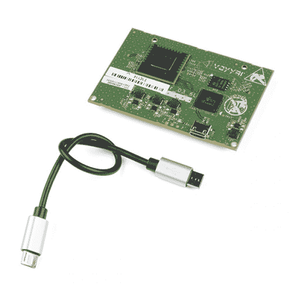](https://www.sparkfun.com/products/14534) 

将**添加到您的[购物车](https://www.sparkfun.com/cart)中！**

### [瓦拉博特起动机](https://www.sparkfun.com/products/14534)

[Only 2 left!](https://learn.sparkfun.com/static/bubbles/ "only 2 left!") SEN-14534

Walabot Starter 是一个小型的可编程传感器工具，它使用无线电频率技术探测物体

$149.95[Favorited Favorite](# "Add to favorites") 14[Wish List](# "Add to wish list")****[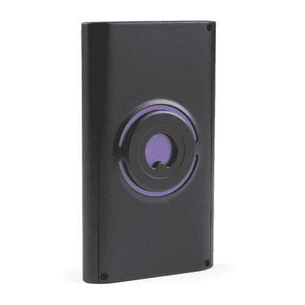](https://www.sparkfun.com/products/retired/14535) 

### [Walabot 开发者](https://www.sparkfun.com/products/retired/14535)

[Retired](https://learn.sparkfun.com/static/bubbles/ "Retired") SEN-14535

Walabot Developer 是一个保护外壳内的可编程 3D 传感器，它使用无线电频率查看物体…

**Retired**[Favorited Favorite](# "Add to favorites") 11[Wish List](# "Add to wish list")** **[https://www.youtube.com/embed/OZyNXnP0HuY/?autohide=1&border=0&wmode=opaque&enablejsapi=1](https://www.youtube.com/embed/OZyNXnP0HuY/?autohide=1&border=0&wmode=opaque&enablejsapi=1)

在本教程中，我们将使用 Windows 上的软件演示工具包(SDK)和基于 Linux 的嵌入式项目操作系统上的应用编程接口(API)来探索 Walabot 的特性。

### 所需材料

要跟随本教程，您将需要以下材料开始。你可能不需要所有的东西，这取决于你拥有什么。将它添加到您的购物车，通读指南，并根据需要调整购物车:

* wala bot(初学者或开发者)*电脑(Windows、Linux) w/ USB 端口* [micro-B 转 A 型 USB 线](https://www.sparkfun.com/products/10215)

对于使用 Raspberry Pi 的更多嵌入式应用，您将需要以下材料:

*   [树莓 Pi 3 入门套件](https://www.sparkfun.com/products/13826)
*   [LCD 7"](https://www.sparkfun.com/products/13733) 或显示器，带 HDMI 线缆
*   [键盘和鼠标](https://www.sparkfun.com/products/14271)

### 推荐阅读

如果您在使用 Raspberry Pi 时不熟悉以下概念，我们建议您在继续之前查看这些教程。

[](https://learn.sparkfun.com/tutorials/terminal-basics) [### 串行终端基础知识](https://learn.sparkfun.com/tutorials/terminal-basics) This tutorial will show you how to communicate with your serial devices using a variety of terminal emulator applications.[Favorited Favorite](# "Add to favorites") 46[](https://learn.sparkfun.com/tutorials/sd-cards-and-writing-images) [### SD 卡和书写图像](https://learn.sparkfun.com/tutorials/sd-cards-and-writing-images) How to upload images to an SD card for Raspberry Pi, PCDuino, or your favorite SBC.[Favorited Favorite](# "Add to favorites") 19

## 硬件概述

### 特征

Walabot 利用射频技术来感知环境。使用线性极化宽带天线阵列发射、接收和记录信号，重建环境图像。数据被处理并通过 USB 电缆发送到主机设备。主机设备可以是你的电脑，单板电脑，甚至是智能手机！

[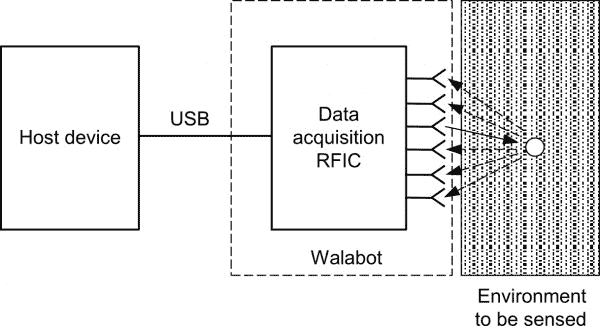](https://cdn.sparkfun.com/assets/learn_tutorials/7/2/4/WalabotDiagram.jpg)

根据 Walabot 模型，以下是一些可能的应用:

*   室内成像
*   目标检测、定位和跟踪
*   动作感应(即呼吸模式、手势)
*   速度测量
*   墙内成像
*   材料的介电特性

### 初学者与开发者

Walabot 有三种型号。对于教程的范围，我们将使用 starter 和 developer 开始。启动器使用 3 个天线而不是 18 个天线来检测环境。启动器能够进行基本的距离测量和监测呼吸模式。由于它可用的天线数量，它将无法感应材料后面的物体。启动器也没有外壳。

开发者用 18x 天线有更高的分辨率。它支持前面列出的应用程序。然而，根据配置的不同，开发人员可能会消耗更多的功率，并且需要更多的时间来处理数据。下面是数据手册中的对比。

| 能力\模型 | 瓦剌队开球 | 瓦拉博特显影剂 |
| 物理规格 |
| *天线数量* | three | Eighteen |
| *电路板尺寸* | [72 毫米* 48 毫米](https://cdn.sparkfun.com/assets/parts/1/2/6/2/4/14534-02.jpg) | [72 毫米* 140 毫米](https://cdn.sparkfun.com/assets/parts/1/2/6/2/5/14535-03.jpg) |
| 外部供电选项 |  | -好的 |
| 围场 |  | -好的 |
| 软件 API 功能 |
| *基本 API 函数* | -好的 | -好的 |
| *2D 收购* | -好的 | -好的 |
| *3D 采集* |  | -好的 |
| *多端口记录仪(原始数据)* |  | -好的 |
| 软件应用能力 |
| *呼吸检测* | -好的 | -好的 |
| *物体检测* | -好的 | -好的 |
| *近距离成像* |  | -好的 |

### 围场

Walabot 启动器不在外壳中。要保护裸板，您可以:

*   [剪下一个纸板外壳](https://www.hackster.io/kuzma/cardboard-housing-for-walabot-pro-a99496)
*   [激光切割亚克力](https://www.hackster.io/user5016473805/drone-race-practice-companion-7c368a)
*   [3D 打印案例](https://www.thingiverse.com/thing:2754128)

请务必调整 Walabot 启动器外壳的尺寸。

### 带其他无线设备的 Walabot

如第 8 页的[数据表所述，Walabot 在一个频率范围内运行。请确保配置您的设备，使其不会干扰项目中使用的其他无线设备。Walabot 的工作频率高于以下范围，因此不应有任何干扰:](https://cdn.sparkfun.com/assets/learn_tutorials/7/2/4/walabot-tech-brief-416.pdf)

*   蓝牙
*   Zigbee
*   细胞的

### 天线

有天线的一面应该朝外，以感知环境。下图显示了 Walabot Starter 的 3 根天线。

[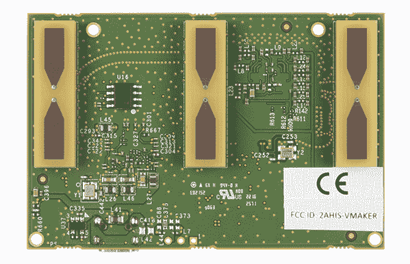](https://cdn.sparkfun.com/assets/learn_tutorials/7/2/4/14534-03_WalabotStaterAntennas.jpg)

下图显示了 Walabot 开发人员安装在电路板上的 18x 天线。确保外壳的平坦面朝外，以感知环境。

[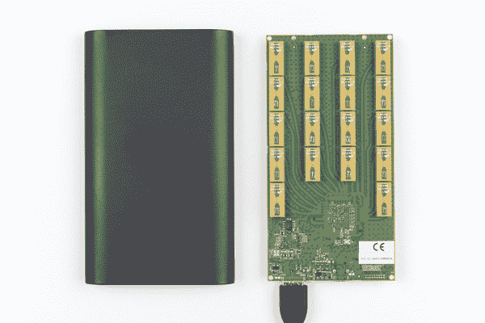](https://cdn.sparkfun.com/assets/learn_tutorials/7/2/4/WalabotDeveloperFront.jpg)

### 功率消耗

Walabot 需要一个 **5V (+/-10%)** 电源。该板可以使用 USB 端口供电。根据应用和操作情况，Walabot 可能消耗高达 **0.4A 至 0.9A** 的电流。Walabot 开发人员可能需要额外的电源。如有必要，用 Phillips 精密螺丝刀打开 Walabot 外壳。

[](https://cdn.sparkfun.com/assets/learn_tutorials/7/2/4/WalabotDeveloperBack.jpg)

红色突出显示的是数据传输和 Walabot 供电的默认跳线位置。要使用外部电源为主板供电，请将跳线移至左侧，并将附加电源连接至以绿色突出显示的 USB 端口。USB 连接器仅用于供电，因此您仍然需要在正确的连接器上连接 USB 电缆。

[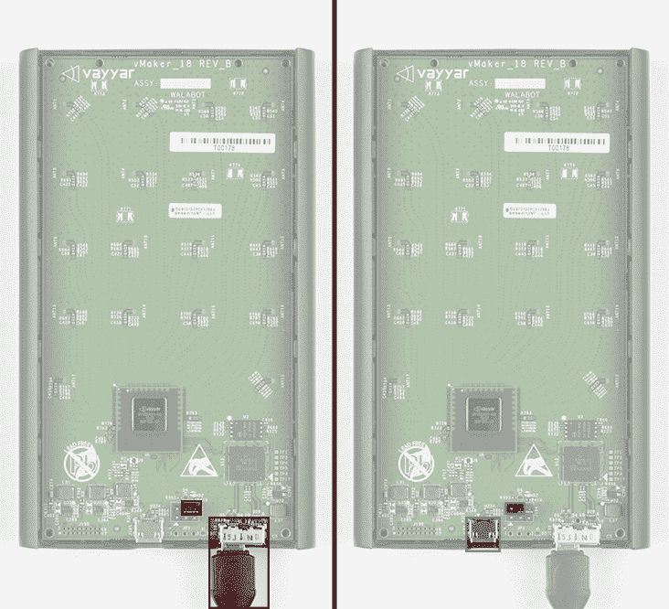](https://cdn.sparkfun.com/assets/learn_tutorials/7/2/4/WalabotDeveloperBackJumpers3.png)

## 硬件装配

### 瓦剌队开球

**Note:** The micro-B cable included with the Walabot Starter is an OTG cable. You will need to an additional cable to connect the device to a computer for development.

If are using a USB cable that is not included with the Walabot, make sure that the data lines are connected when using the cable with the Walabot! Certain cables are designed to be charging cables, so there might not be any data lines connected in the USB cable.

要连接 Walabot 启动器，您需要将 micro-B USB 电缆的“D”形与端口对齐。

[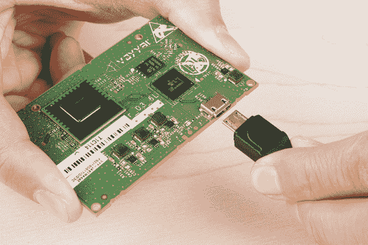](https://cdn.sparkfun.com/assets/learn_tutorials/7/2/4/WalabotStartermicroBUSB.jpg)

一旦电缆连接到 Walabot，将另一端连接到计算机的 USB 端口。

### 瓦拉博特显影剂

**Note:** If are using a USB cable that is not included with the Walabot, make sure that the data lines are connected when using the cable with the Walabot! Certain cables are designed to be charging cables, so there might not be any data lines connected in the USB cable.

要连接 Walabot 开发人员，请将 USB 电缆的 micro-B 端插入 Walabot 的 USB 端口。您可以使用单独的 micro-B USB 2.0 电缆或附带的 micro-B USB 3.0 电缆。默认情况下，有一个跳线使用最靠近 Walabot 边缘的端口。

| [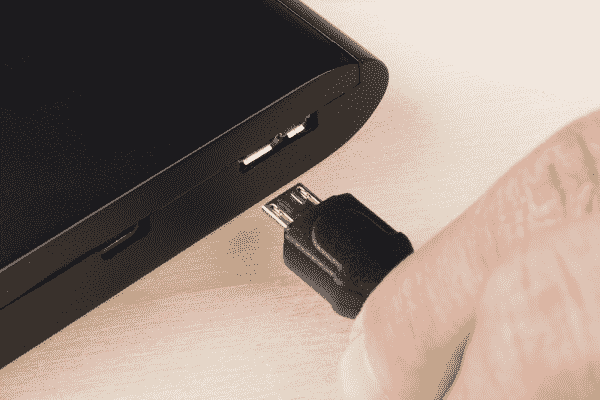](https://cdn.sparkfun.com/assets/learn_tutorials/7/2/4/WalabotDevelopermicroBUSB-2_0.jpg) | [](https://cdn.sparkfun.com/assets/learn_tutorials/7/2/4/WalabotDevelopermicroBUSB-3_0.jpg) |
| *用单独的 micro-B USB 2.0 线连接。* | *使用随附的 micro-B USB 3.0 线缆进行连接。* |

如果您决定使用单独的 micro-B USB 2.0 电缆连接您的电脑，您需要将其与 micro-B USB 3.0 连接器的“D”形对齐，如下图所示。

[](https://cdn.sparkfun.com/assets/learn_tutorials/7/2/4/WalabotDevelopermicroBUSB-2_0PartiallyConnected.jpg)

一旦电缆连接到 Walabot，将另一端连接到计算机的 USB 端口。

### 增加

测试期间，您可能需要安装电路板。抓住一些绝缘胶带或使用支架将 Walabot 启动器安装到一个盒子上。Walabot 开发人员包括一个磁盘，可以粘附在机器人、智能手机或墙壁等表面上。有了磁性底座，它可以很容易地与表面连接和分离。在提供的示例中，启动器和开发人员被安装在一个红盒子上，或者放在桌子上进行测试。

## 软件安装(Windows)

要开始使用 Walabot，最简单的方法是在 Windows 上使用 Walabot 演示来可视化传感器数据。这是一个很好的图形用户界面，能够显示传感器数据。转到下载部分，开始下载 Walabot 软件开发工具包(SDK)。

[Walabot (SDK) Installation for Windows](https://walabot.com/getting-started)

点击 **Windows Installer** 按钮，下载演示软件的最新稳定版本。下载后，打开可执行文件安装软件。

**Note:** When installing the Windows SDK, a window may pop up with the following question for User Account Control:

`Do you want to allow the following program from an unknown publisher to make changes to this computer?`

To install the **WalabotSDK_1.0.35.exe**, click **Yes** button.

## 示例 SDK

一旦你安装了 Walabot SDK，桌面上应该会有一个快捷方式。点击桌面上的*WalabotSDK.WalabotAPItutorial.exe*图标打开程序。如果还没有，请将设备插入计算机的 COM 端口。

### 传感器-目标检测

第一个演示应用程序寻找 Walabot 前面的对象。开始之前，请确保传感器前面没有移动的物体。在下面的例子中，传感器安装在一个盒子上。

[](https://cdn.sparkfun.com/assets/learn_tutorials/7/2/4/WalabotCalibration.jpg)*Walabot Starter or Developer Calibration*

点击 SDK 中标有**传感器-目标检测**的标签。Walabot 将开始校准。这个范围似乎有点小，所以**R【cm】**的竞技场尺寸增加到了 200cm。调整后，点击**应用&校准**按钮进行重新校准。

[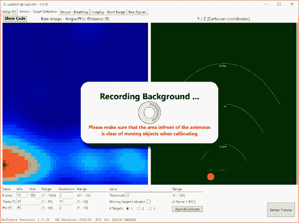](https://cdn.sparkfun.com/assets/learn_tutorials/7/2/4/WalabotSDK_Sensor-TargetDetectionCalibration.png)

校准后，试着在传感器前移动一个物体。在这个例子中，试着站在远离传感器的地方测试 Walabot。为了简单起见，站在 Walabot 正前方，直到传感器检测到你。

[](https://cdn.sparkfun.com/assets/learn_tutorials/7/2/4/WalabotTargetDetection1.jpg)

这是当一个物体在 SDK 中处于远处时的样子。

[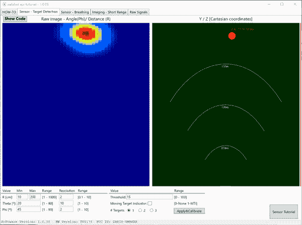](https://cdn.sparkfun.com/assets/learn_tutorials/7/2/4/WalabotSDK_Sensor-TargetDetectionFar.png)

然后试着靠近 Walabot。

[](https://cdn.sparkfun.com/assets/learn_tutorials/7/2/4/WalabotTargetDetection2.jpg)

这是当一个物体在 SDK 中更近时的样子。

[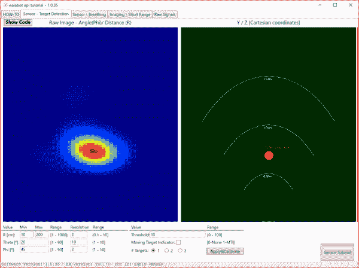](https://cdn.sparkfun.com/assets/learn_tutorials/7/2/4/WalabotSDK_Sensor-TargetDetectionClose.png)

相比之下，您会注意到 SDK 会随着范围内的任何对象实时更新。尝试调整范围，看看传感器能探测到多远的目标！您还可以调整要查看的目标数量！

**Tip:!** To help in visualizing the arena size, grab a tape measure.

### 传感器呼吸

第二个演示应用程序监控呼吸模式并绘制读数。你需要在离传感器一定距离的地方才能阅读。默认值在 20 厘米到 80 厘米之间。点击 SDK 中标有“**传感器呼吸**的选项卡。

[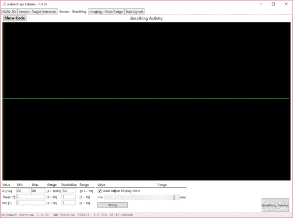](https://cdn.sparkfun.com/assets/learn_tutorials/7/2/4/WalabotSDK_Sensor-Breathing_2.png)

站在传感器前，吸入一些空气。

[](https://cdn.sparkfun.com/assets/learn_tutorials/7/2/4/WalabotBreathing_Inhale.jpg)

当你吸气时，图表会实时更新。随着你的呼吸，图表应该上升。下面是你在 SDK 中深呼吸时的样子。

[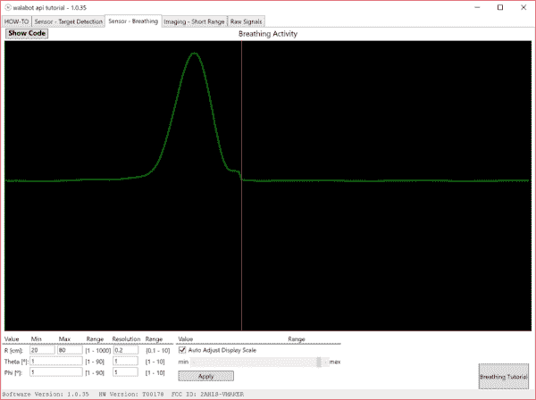](https://cdn.sparkfun.com/assets/learn_tutorials/7/2/4/WalabotSDK_Sensor-BreathingInhale.png)

仍然站在前面，呼出聚集在肺部的空气。

[](https://cdn.sparkfun.com/assets/learn_tutorials/7/2/4/WalabotBreathing_Exhale.jpg)

当你呼气时，图表会下降。这是你在 SDK 中呼气时的样子。

[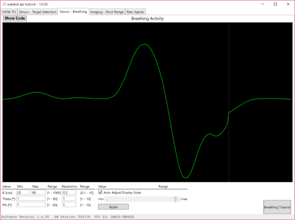](https://cdn.sparkfun.com/assets/learn_tutorials/7/2/4/WalabotSDK_Sensor-BreathingExhale.png)

尝试调整范围，看看 Walabot 可以感知你的呼吸到什么程度！

### 成像-短程

**Note:** Due to the limitations of the Walabot Starter, it is not able view objects behind walls.

第三个演示让您查看墙后的对象。因为我们处理的是射频信号，所以要确保墙壁不是金属制成的。为了快速测试，让我们试着在一个平板后面观察一个材料。拿一根木棒、金属管、聚氯乙烯或一段电线进行测试。

[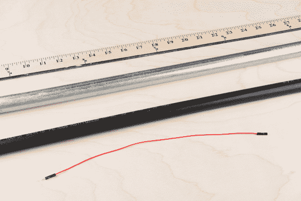](https://cdn.sparkfun.com/assets/learn_tutorials/7/2/4/WalabotWallDetectionMaterials.jpg)

传感器将需要观察它所透过的材料。将 Walabot 放在平板上。

[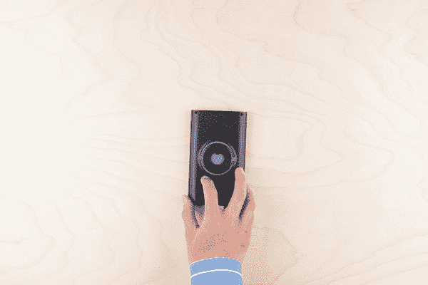](https://cdn.sparkfun.com/assets/learn_tutorials/7/2/4/WalabotShortRangeImaging_1.jpg)

点击标签为“**成像-短程**”的选项卡。

[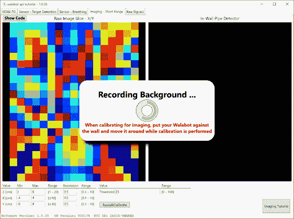](https://cdn.sparkfun.com/assets/learn_tutorials/7/2/4/WalabotSDK_Imaging-ShortRangeCalibration.png)

传感器将开始校准。建议在此校准过程中以圆周运动方式缓慢移动 Walabot。

| [](https://cdn.sparkfun.com/assets/learn_tutorials/7/2/4/WalabotShortRangeImagingCalibration_1.jpg) | [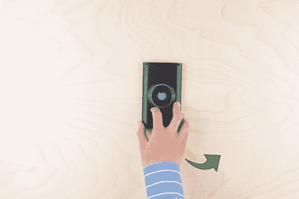](https://cdn.sparkfun.com/assets/learn_tutorials/7/2/4/WalabotShortRangeImagingCalibration_2.jpg) | [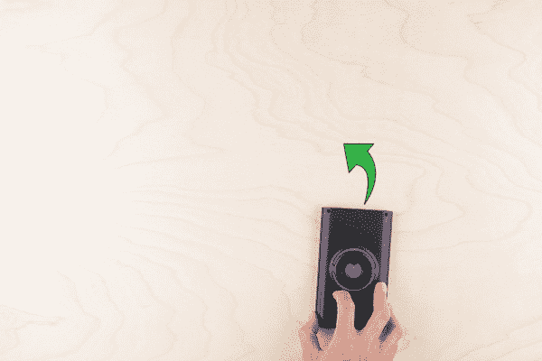](https://cdn.sparkfun.com/assets/learn_tutorials/7/2/4/WalabotShortRangeImagingCalibration_3.jpg) |

校准后，试着将材料放在桌子后面。

[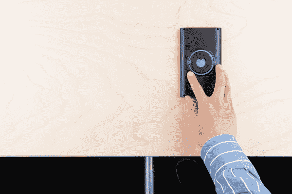](https://cdn.sparkfun.com/assets/learn_tutorials/7/2/4/WalabotShortRangeImagingNoObject_1.jpg)

将 Walabot 移动到材料上。

[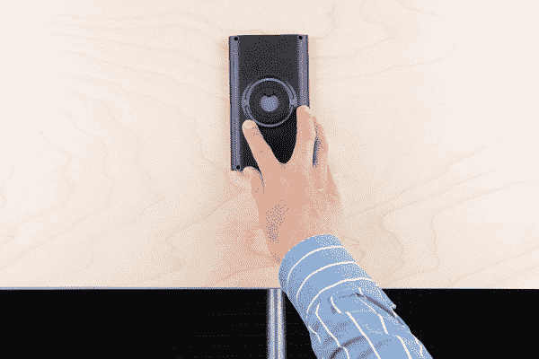](https://cdn.sparkfun.com/assets/learn_tutorials/7/2/4/WalabotShortRangeImagingParallelObject_1.jpg)

墙内管道检测器应显示图形，并指示桌子后面管道的方向。墙壁的材料厚度(在这种情况下是一张桌子)和那里有物体的概率显示为*深度*和*置信度*。

[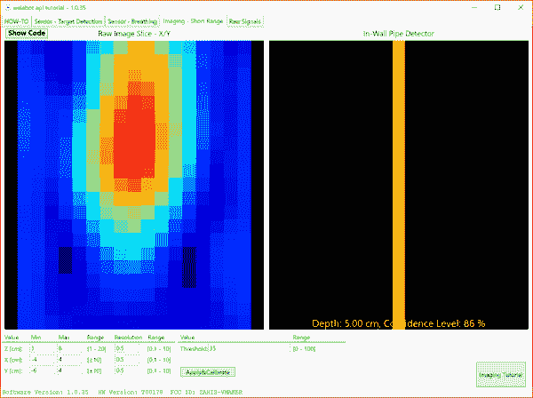](https://cdn.sparkfun.com/assets/learn_tutorials/7/2/4/WalabotSDK_Imaging-ShortRangePipeParallel.png)

旋转 Walabot。

[](https://cdn.sparkfun.com/assets/learn_tutorials/7/2/4/WalabotShortRangeImagingPerpendicularObject_1.jpg)

墙内管道探测器将通过显示旋转的材料做出响应。

[](https://cdn.sparkfun.com/assets/learn_tutorials/7/2/4/WalabotSDK_Imaging-ShortRangePipePerpendicular.png)

现在试着在墙上测试一下，看看你是否能找到一个螺柱或一束电线通向墙上的插座！Walabot 开发人员可以看到材料后面大约 4 英寸(大约 10 厘米)的地方！

### 原始信号

**Note:** Due to the limitations of the Walabot Starter, you will not be able to control and view the raw signals with the SDK.

第四个演示控制天线阵列。它对于特定应用的波形可视化非常有用。点击标签为“**原始信号**”的选项卡。

在户外使用默认的天线对，信号将看起来像右图。

| [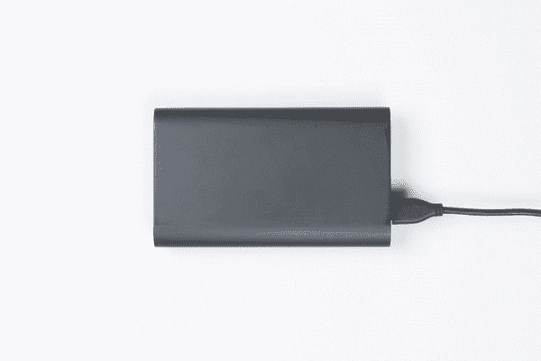](https://cdn.sparkfun.com/assets/learn_tutorials/7/2/4/WalabotRawSignal_NoObject.jpg) | [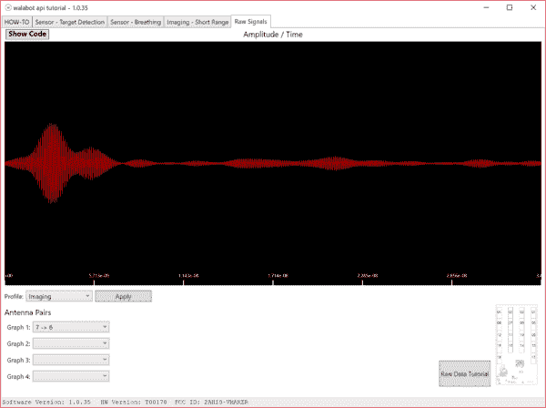](https://cdn.sparkfun.com/assets/learn_tutorials/7/2/4/WalabotSDK_RawSignal.png) |
| *露天测量 Walabot】* | *在户外使用天线对 7 - > 6 的原始信号。* |

让我们试一试纸、石头、剪刀，看看 Walabot 能多好地识别手势的微小变化。将你的手直接放在石头形状的 Walabot 上，信号应该看起来像右图一样。

| [](https://cdn.sparkfun.com/assets/learn_tutorials/7/2/4/WalabotRawSignal_Rock.jpg) | [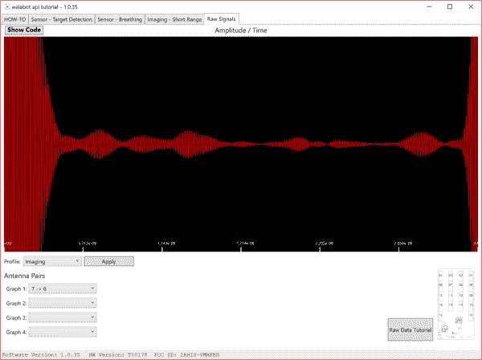](https://cdn.sparkfun.com/assets/learn_tutorials/7/2/4/WalabotSDK_RawSignal_Rock.png) |
| *瓦拉博特测量岩石。* | *带天线对的原始信号 7 - >带摇滚的 6。* |

打开纸张形状的 had，您会注意到图表中的显著变化。

| [](https://cdn.sparkfun.com/assets/learn_tutorials/7/2/4/WalabotRawSignal_Paper.jpg) | [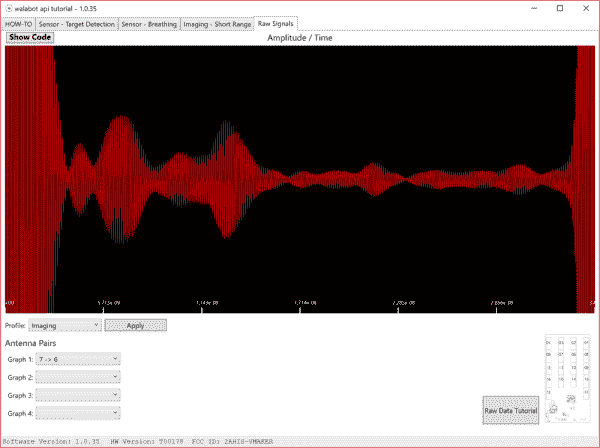](https://cdn.sparkfun.com/assets/learn_tutorials/7/2/4/WalabotSDK_RawSignal_Paper.png) |
| *瓦拉博特测量纸。* | *天线对 7 的原始信号- >纸对 6。* |

将您的手的形状改为剪刀，您应该会注意到整个信号振幅的微小变化。

| [](https://cdn.sparkfun.com/assets/learn_tutorials/7/2/4/WalabotRawSignal_Scissors.jpg) | [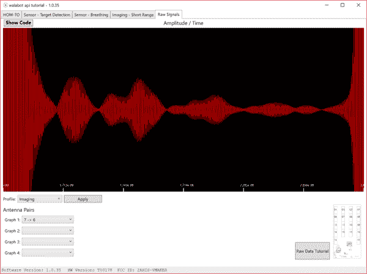](https://cdn.sparkfun.com/assets/learn_tutorials/7/2/4/WalabotSDK_RawSignal_Scissors.png) |
| *瓦拉博特测量剪刀。* | *使用天线对 7 的原始信号- >使用剪刀 6。* |

尝试使用不同的天线对，看看在为您的定制应用编写代码时什么效果最好！

* * *

### Walabot's Demo Video

这里有一个使用 Walabot 和 Windows SDK 的解释。

[https://www.youtube.com/embed/8PHS0c8JBW8/?autohide=1&border=0&wmode=opaque&enablejsapi=1](https://www.youtube.com/embed/8PHS0c8JBW8/?autohide=1&border=0&wmode=opaque&enablejsapi=1)

### Walabot API Library

按下**显示代码**按钮可以查看 Walabot SDK 中使用的每个示例的伪代码。还有一个**教程**按钮，提供关于 Walabot 相关图形的解释。在为 Windows 开发应用程序时，请访问 Walabot API 库，了解有关函数、参数和错误代码的更多信息。

[Walabot API library](http://api.walabot.com/_install.html#_windowsInstall)

## 软件安装(Linux)

### Walabot API Library

**Note:** Make sure that you have Python version 2 or 3 installed. Raspberry Pi should have it installed already. To verify, open a serial terminal and type `python -V` in the command line. Pressing the `Enter` key should notify you if Python is installed. If Python is not currently installed, head over to [Python's download page](https://www.python.org/downloads/).

安装 Walabot API for Linux 和 Raspberry Pi 的过程是相同的。唯一的区别是要下载的包。去 Walabot 的网站下载这个包。

[Walabot's Download Page](https://walabot.com/getting-started)

向下滚动页面，并单击您要分发的包。就本教程的范围而言，我们将选择 Raspberry Pi 的包。

下载后，您可能会收到以下警告:

This type of file can harm your computer. Do you want to keep "*walabot_maker_1.0.34_raspberry_arm32.deb* anyway?

点击**保持**按钮确认下载。

[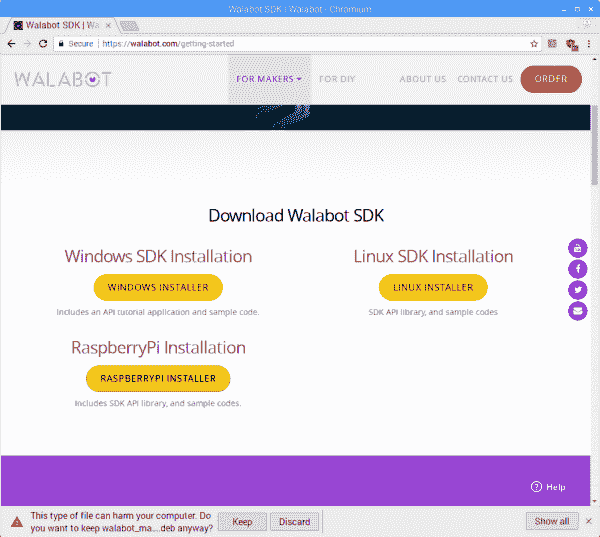](https://cdn.sparkfun.com/assets/learn_tutorials/7/2/4/WalabotRaspberryPiDownload_Warning.png)

按照下图中绿色箭头和高亮图标的指示打开命令行。

[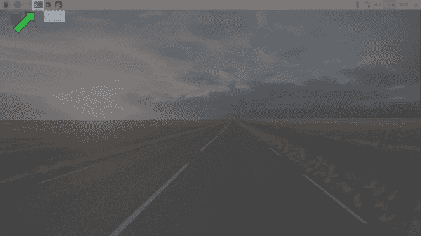](https://cdn.sparkfun.com/assets/learn_tutorials/7/2/4/RaspberryPiCommandLine.png)

前往下载软件包的位置。最有可能的是，它被放在“*下载*”文件夹中。键入该命令，并按下“**回车**键

```
cd Downloads 
```

**Note:** This tutorial was written with the "*walabot_maker_1.0.34_raspberry_arm32.deb*" package. You may need to adjust the package name depending when on the package that was downloaded."

要查看内容，请随意键入以下命令:

```
ls 
```

在命令行中，根据* **键入此命令。下载的 deb** 包:

```
sudo dpkg -i walabot_maker_1.0.34_raspberry_arm32.deb 
```

一旦命令准备好并与下载的包匹配，点击“**回车**键。

[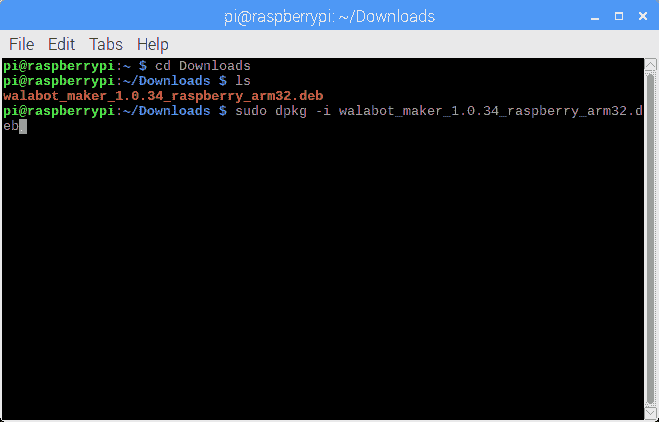](https://cdn.sparkfun.com/assets/learn_tutorials/7/2/4/WalabotCommandLine_dpkg.png)

安装时，可能会提示您最终用户许可协议。通读一遍，按下键盘上的“→”键，然后点击“**回车**”

[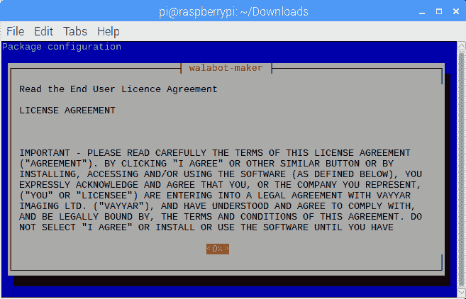](https://cdn.sparkfun.com/assets/learn_tutorials/7/2/4/WalabotAPI_EULA.png)

您将再次被提示另一个问题。通读短信，导航至“ **<是>** ”，点击“**进入**

[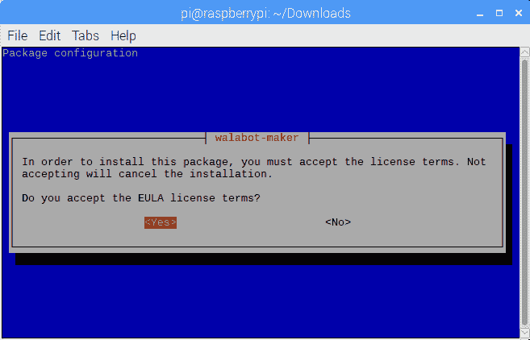](https://cdn.sparkfun.com/assets/learn_tutorials/7/2/4/WalabotAPI_EULA_Accept.png)

以下路径和文件将安装在这些位置:

*   **/usr/lib/libwalabotapi . so**-wala bot 库。
*   **/usr/include/walabotapi . h**-Walabot 库头文件。
*   **/var/lib/walabot/...**-wala bot 数据库和配置文件。将此路径指定给 Walabot_SetSettingsFolder。
*   **/usr/share/doc/walabot/...** -示例代码、许可证和自述文件。
*   **/etc/udev/rules.d/...**-wala bot 设备的特殊 udev 规则，因此无需 root 权限即可访问。

* * *

有关 Walabot API 库的更多信息，请参阅 Walabot 的文档。

[Walabot API Library](http://api.walabot.com/)

## 示例 API

让我们试试 Python 中的例子吧！这些示例使用户能够将传感器数据用于嵌入式项目。有一些运行这些例子的方法。因为我们仍然打开命令行，所以我们将通过终端打开 Python 示例。使用以下命令导航到示例:

```
cd /usr/share/doc/walabot/examples/python 
```

键入此命令将列出该路径中的三个示例:

```
ls 
```

将 Walabot 连接到 USB 端口，开始测试 Walabot 示例。

[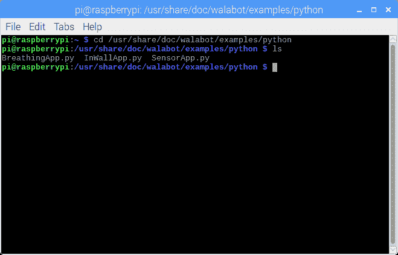](https://cdn.sparkfun.com/assets/learn_tutorials/7/2/4/WalabotCommandLine_listExamples.png)

### 目标检测 w/ *SensorApp.py*

要运行 *SensorApp.py* 示例，请在目录中键入以下命令。

```
python SensorApp.py 
```

同样，当程序开始时，确保传感器前面没有移动的物体。 *SensorApp.py* 就像 Windows SDK 中演示的目标检测示例。传感器数据将在终端中输出，如下所示。

[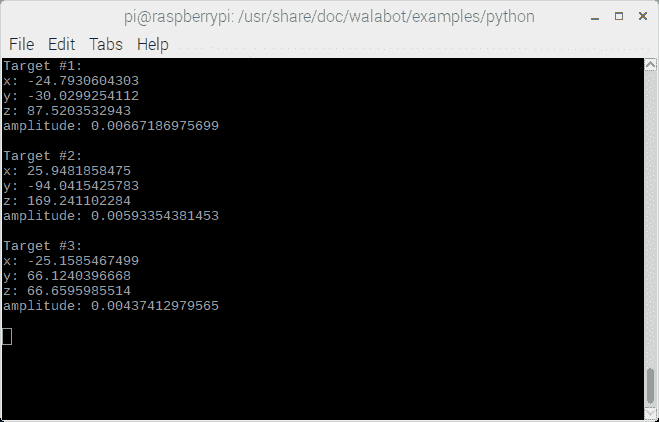](https://cdn.sparkfun.com/assets/learn_tutorials/7/2/4/WalabotPython_SensorApp.png)

尝试在传感器前移动您的手，感受一下传感器值。在命令行中键入 **Ctrl** + **c** 来停止程序。

### 呼吸 w/ *BreathingApp.py*

要运行 *BreathingApp.py* 示例，请键入以下命令:

```
python BreathingApp.py 
```

这就像 Windows SDK 中演示的呼吸示例一样。Walabot 前面没有任何东西，输出应该是一个非常小的值。

[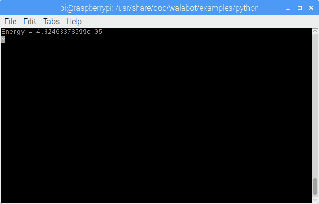](https://cdn.sparkfun.com/assets/learn_tutorials/7/2/4/WalabotPython_BreathingAppNoPerson.png)

站在墙前，深呼吸。当你吸气时，这个值可能看起来像下面的输出。该值可能会有所不同，这取决于您离 Walalbot 有多远。

[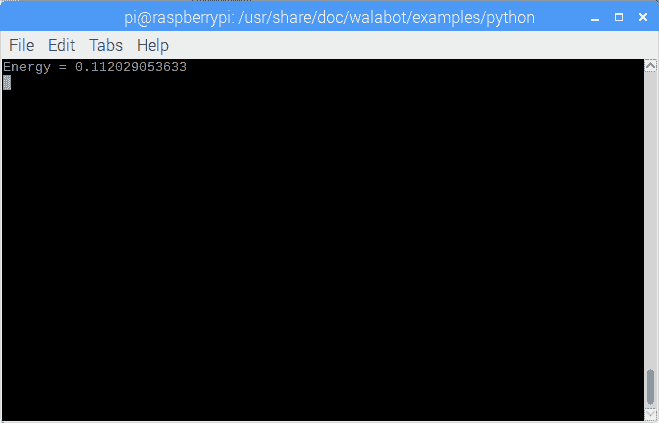](https://cdn.sparkfun.com/assets/learn_tutorials/7/2/4/WalabotPython_BreathingAppInhale.png)

当你呼气时，这个值会降低。输出可能类似于下面的输出。

[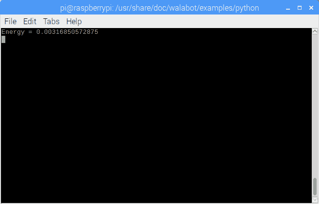](https://cdn.sparkfun.com/assets/learn_tutorials/7/2/4/WalabotPython_BreathingAppExhale.png)

在命令行中键入 **Ctrl** + **c** 来停止程序。

### 检测材料后的物体 w/ *InWallApp.py*

**Note:** Due to the limitations of the Walabot Starter, it is not able view objects behind walls.

要运行 *InWallApp.py* 示例，请键入以下命令:

```
python InWallApp.py 
```

同样，一旦程序开始，慢慢地移动 Walabot 在平面上做圆周运动。当墙或桌子后面没有物体时，输出可能是这样的。

[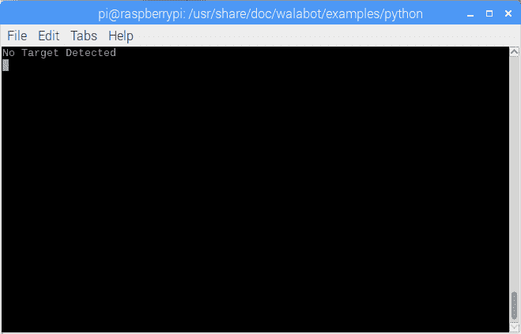](https://cdn.sparkfun.com/assets/learn_tutorials/7/2/4/WalabotPython_InWallAppNothing.png)

当表面后面有金属管时，输出可能是这样的。

[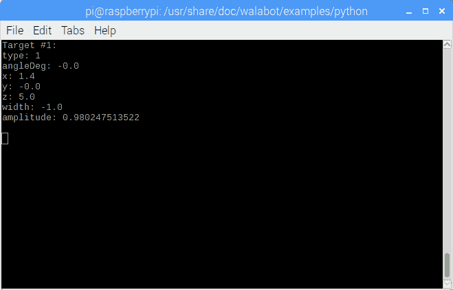](https://cdn.sparkfun.com/assets/learn_tutorials/7/2/4/WalabotPython_InWallAppPipeParallel.png)

旋转 Walabot，这是表面后面有金属管时的输出。

[](https://cdn.sparkfun.com/assets/learn_tutorials/7/2/4/WalabotPython_InWallAppPipePerpendicular.png)

在命令行中键入 **Ctrl** + **c** 来停止程序。

### 显示目标 w/ *SensorTargets.py*

让我们再看一个来自 Walabot 的 GitHub 库的例子:

[Walabot Projects GitHub Repository](https://github.com/Walabot-Projects)

为了简单起见，我们将前往 **Walabot-SensorTargets** 存储库。其他示例可能需要您调整代码和硬件来运行这些示例。点击**克隆或下载**按钮下载示例。再次点击**下载 ZIP** 。通过键入以下命令，转到下载文件的目录:

```
cd Downloads 
```

拉开**的拉链。用这个命令压缩**:

```
unzip Walabot-SensorTargets-master.zip 
```

在命令行中，键入以下内容:

```
pip install WalabotAPI --no-index --find-links="/usr/share/walabot/python/" 
```

更改示例解压缩的当前目录:

```
cd Walabot-SensorTargets-master 
```

通过键入以下命令运行该示例:

```
python SensorTargets.py 
```

程序将开始运行并打开一个单独的窗口。点击 **Start** 按钮开始读取，并确保 Walabot 前面没有任何东西在移动。

[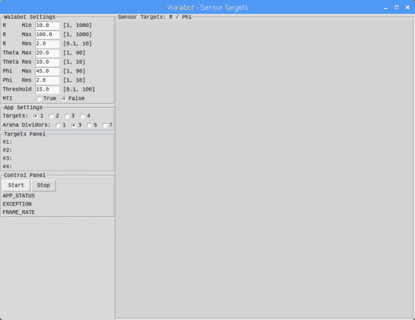](https://cdn.sparkfun.com/assets/learn_tutorials/7/2/4/WalabotPython_SensorTargetWindow.png)

当一个物体在 Walabot 前面时，它应该显示在竞技场中。在这个例子中，我只是把我的手放在 Walabot 前面。

[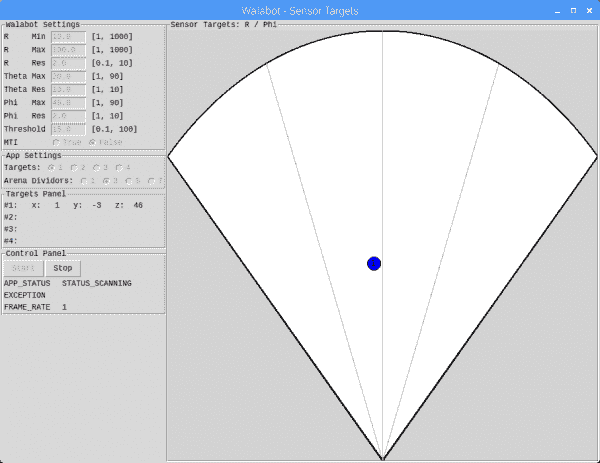](https://cdn.sparkfun.com/assets/learn_tutorials/7/2/4/WalabotPython_SensorTarget_1.png)

既然我们已经测试了 *SensorTargets.py* ，请尝试 GitHub 资源库中列出的其他示例！*seethrougdemo . py*是一个简洁的例子，它可以直观地通知您墙后是否有物体，而不仅仅是在 *InWallApp.py* 中的输出值。RawImage.py 以图形方式显示视图中对象的图像，就像 Windows 中的 SDK 一样。

### 解决纷争

以下是在 Raspberry Pi 上使用 Walabot 时的一些故障排除技巧。

#### • Missing Walabot API

如果您在从 GitHub 运行 Python 示例时遇到问题，Walabot API 的 Python 包可能没有安装。您可能会收到类似以下输出的错误。

```
language:emacs
Traceback (most recent call last):
  File "sensorTargets.py, line 3, in <module>
    import WalabotAPI
ImportError:NoModule named WalabotAPI 
```

尝试使用前面解释过的`pip`命令。

#### 暂停的程序

如果你输入了 **Ctrl** + **z** ，程序被暂停。您可能会得到与下面的输出类似的错误。

```
language:emacs
^Z
[1]+  Stopped                 python SensorApp.py
pi@raspberrypi:/usr/share/doc/walabot/examples/python $ python SensorApp.py
Traceback (most recent call last):
  File "SensorApp.py", line 74, in <module>
    SensorApp()
  File "SensorApp.py", line 38, in SensorApp
    wlbt.ConnectAny()
  File "/usr/share/walabot/python/WalabotAPI.py", line 186, in ConnectAny
    _RaiseIfErr(_wlbt.Walabot_ConnectAny())
  File "/usr/share/walabot/python/WalabotAPI.py", line 122, in _RaiseIfErr
    raise WalabotError(message, res, extended)
WalabotAPI.WalabotError: WALABOT_INSTRUMENT_NOT_FOUND
pi@raspberrypi:/usr/share/doc/walabot/examples/python $ 
Traceback (most recent call last):
  File "SensorApp.py", line 74, in <module>
    SensorApp()
  File "SensorApp.py", line 38, in SensorApp
    wlbt.ConnectAny()
  File "/usr/share/walabot/python/WalabotAPI.py", line 186, in ConnectAny
    _RaiseIfErr(_wlbt.Walabot_ConnectAny())
  File "/usr/share/walabot/python/WalabotAPI.py", line 122, in _RaiseIfErr
    raise WalabotError(message, res, extended)
WalabotAPI.WalabotError: WALABOT_INSTRUMENT_NOT_FOUND 
```

您可以尝试关闭命令行并重新启动程序。

## 资源和更进一步

现在，您已经成功地启动并运行了 Walabot，是时候将它整合到您自己的项目中了！

有关 Walabot 的更多信息，请查看以下链接:

*   [Walalbot.com](https://walabot.com/)-瓦拉博特的官方网站。
    *   [技术数据表(PDF)](https://cdn.sparkfun.com/assets/learn_tutorials/7/2/4/walabot-tech-brief-416.pdf)
    *   [SDK 和 API 包下载](https://walabot.com/getting-started) -在这里下载最新稳定的 SDK 和 API 包。
    *   [API 库](http://api.walabot.com/)-wala bot API 的文档
    *   [GitHub 项目回购](https://github.com/Walabot-Projects) - Walabot 的项目仓库。
    *   [社区](https://walabot.com/community)-hackster . io 上列出的 Walabot 社区的项目。根据你的呼吸模式控制 led，检测跌倒，或为你的机器人/无人机添加独特的传感功能。一些教程已经完成，而其他人仍在记录。有许多用途，但以下是一些实际应用，链接如下:
    *   [盲人家庭监控和警报](https://www.hackster.io/team-penteon/home-monitoring-and-alerts-for-the-blind-e6056a)
    *   [使用 Walabot 进行人员和跌倒检测](https://www.hackster.io/42748/people-and-fall-detection-with-walabot-8db4aa)
    *   [Walabot 睡眠质量跟踪器](https://www.hackster.io/71432/walabot-sleep-quality-tracker-3f168f)
    *   [WalaBreathe——一种无线呼吸转语音辅助设备](https://www.hackster.io/geeve-george/walabreathe-a-wireless-breath-to-speech-assistive-device-0d8857)
    *   [带 Alexa 命令和控制的 Walabot 安全机器人](https://www.hackster.io/user462411/walabot-security-robot-with-alexa-command-and-control-c979e6)
    *   [车辆后视](https://www.hackster.io/safer-drivers/vehicle-rear-vision-530a18)
    *   [具有 Walabot 功能的检查无人机](https://www.hackster.io/user462411/inspection-drone-with-walabot-capability-df77e6)
    *   [无线灯光开关操纵器](https://www.hackster.io/einsteinunicorn/wireless-light-switch-manipulator-cdb0c3)
*   [SFE 产品展示区](https://youtu.be/OZyNXnP0HuY)

有关支架和外壳的信息，请查看这些项目中使用的 3D 模型:

*   智多星
    *   瓦拉博特·袖手旁观·戴维埃克
    *   [maker hill 的 Walabot 外壳](https://www.thingiverse.com/thing:2754128)

要获得有用的 Raspberry Pi 命令列表，请访问以下页面:

*   [电路基础:42 个最有用的 Raspberry Pi 命令](http://www.circuitbasics.com/useful-raspberry-pi-commands/)

你的下一个项目需要一些灵感吗？查看一些相关教程:

[](https://learn.sparkfun.com/tutorials/hackers-in-residence---cosmic-ray-detector-) [### 黑客常驻-宇宙射线探测器](https://learn.sparkfun.com/tutorials/hackers-in-residence---cosmic-ray-detector-) Learn how to detect cosmic rays with this simple and cheap detector, built by Hacker in Residence Pete Marchetto.[Favorited Favorite](# "Add to favorites") 2[](https://learn.sparkfun.com/tutorials/ml8511-uv-sensor-hookup-guide) [### ML8511 紫外线传感器连接指南](https://learn.sparkfun.com/tutorials/ml8511-uv-sensor-hookup-guide) Get up and running quickly with this simple to use UV sensor.[Favorited Favorite](# "Add to favorites") 3[](https://learn.sparkfun.com/tutorials/qwiic-uv-sensor-veml6075-hookup-guide) [### Qwiic 紫外线传感器(VEML6075)连接指南](https://learn.sparkfun.com/tutorials/qwiic-uv-sensor-veml6075-hookup-guide) Learn how to connect your VEML6075 UV Sensor and figure out just when you should put some sunscreen on.[Favorited Favorite](# "Add to favorites") 2[](https://learn.sparkfun.com/tutorials/digital-temperature-sensor-breakout---as6212-qwiic-hookup-guide) [### 数字温度传感器分线点- AS6212 (Qwiic)连接指南](https://learn.sparkfun.com/tutorials/digital-temperature-sensor-breakout---as6212-qwiic-hookup-guide) Get started measuring highly accurate temperatures at extremely low power with the AS6212 temperature sensor on the SparkFun Digital Temperature Sensor Breakout - AS6212 (Qwiic).[Favorited Favorite](# "Add to favorites") 1**