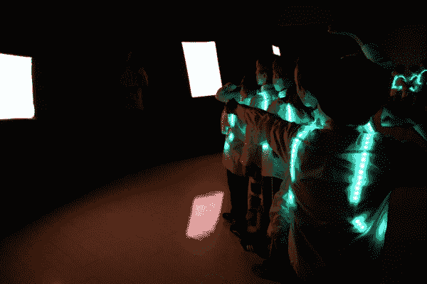

# 原型可穿戴 LED 舞蹈背带

> 原文：<https://learn.sparkfun.com/tutorials/prototype-wearable-led-dance-harness>

## 介绍

你有没有想过把科技融入到你的舞蹈中？在本教程中，您将学习如何设计和制作用于舞蹈表演的可穿戴 LED 安全带。设计不仅仅局限于舞蹈。你也可以用它来指导服装。

### 所需材料

要跟随本教程，您将需要以下材料。你可能不需要所有的东西，这取决于你拥有什么。将它添加到您的购物车，通读指南，并根据需要调整购物车。