# FreeSoC2 连接指南 V14

> 原文：<https://learn.sparkfun.com/tutorials/freesoc2-hookup-guide-v14>

## 介绍

**Note:** This guide is for the latest version of the FreeSoC2, V14\. If you have an older version (the version number can be found on the back of the PCB), please refer to [this tutorial](https://learn.sparkfun.com/tutorials/freesoc2-introduction).

* * *

[FreeSoc2 是 SparkFun 的 PSoC5LP 开发板](https://www.sparkfun.com/products/13714)具有完整的板载调试器，支持 5V 和 3.3V IO 电压，以及 CY8C5888AXI-LP096 处理器，具有 256kB 闪存、64kB SRAM 和 2kB EEPROM。板载振荡器可以以高达 80MHz 的速度驱动处理器，而 Cortex-M3 内核提供了卓越的性能。

[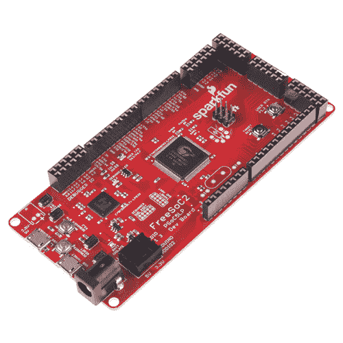](https://www.sparkfun.com/products/13714) 

### [FreeSoC2 开发板- PSoC5LP](https://www.sparkfun.com/products/13714)

[Out of stock](https://learn.sparkfun.com/static/bubbles/ "out of stock") DEV-13714

这是 FreeSoC2 开发板，SparkFun 对 PSoC5LP ARM Cortex 的处理。

1[Favorited Favorite](# "Add to favorites") 8[Wish List](# "Add to wish list")

然而，PSoC5LP 的真正威力并不在于处理器。围绕处理器的是丰富的模拟和数字可编程结构，它可以配置为提供许多功能，否则需要通过代码(降低系统性能)或外部电路(增加成本和电路板尺寸)来实现。此外，高度灵活的结构意味着几乎任何功能都可以路由到几乎任何引脚，这使得它成为一个非常好的开发工具，并且可以非常容易地解决电路板布局错误，至少暂时如此。从概念上讲，这种结构类似于一个 [FPGA](http://en.wikipedia.org/wiki/Field-programmable_gate_array) 或 [CPLD](http://en.wikipedia.org/wiki/Complex_programmable_logic_device) 。

### 本教程涵盖的内容

我们将讨论挖掘 PSoC 力量的两种不同方式。我们已经将 Arduino 内核移植到 PSoC5LP，因此您可以在标准 Arduino IDE 中为该板编写代码。该板在引脚上复制了 Arduino Uno R3 的各种硬件外设的功能，因此许多示例、库和屏蔽都可以开箱即用。

然而，使用 Arduino IDE 的缺点是它缺少任何配置可编程结构的方法(至少目前是这样)。为了充分利用该设备，您需要使用 PSoC Creator IDE，这是 Cypress Semiconductor 免费提供的，没有代码限制。遗憾的是，PSoC Creator 软件目前只适用于 Windows。如果你想看到这种变化，可以考虑在[柏树论坛](http://www.cypress.com/?app=forum&id=2492&rID=41953)上发表意见！

在本教程中，我们将讨论电路板的详细规格和布局，如何在 Arduino IDE 中添加对电路板的支持，以及如何在 PSoC Creator IDE 上开始一个简单的 blink 项目。

### 所需材料

我们要保持简单。FreeSoC2 有一个板载 LED 和用户可操作的按钮。我们会用这些来上课。这意味着你只需要 FreeSoC2 板和一根 [micro-B USB 线](https://www.sparkfun.com/products/10215)。但是，您可能会发现拥有第二根 USB 电缆很有用，因为这将允许您同时连接到调试器和目标。

### 推荐阅读

如果你不熟悉 Arduino IDE，但想学习，请查看我们关于安装 Arduino IDE 的教程。

与任何开发平台一样，阅读数据手册总是明智之举。继续之前，查看 PSoC5LP CY8C58LP 的[数据表。](https://cdn.sparkfun.com/datasheets/Dev/ARM/CY8C58LP_001-84932_0H_V.pdf)

## 硬件概述

这块板上有很多东西:两个处理器、两个 USB 端口、大量接头和各种可配置选项。

[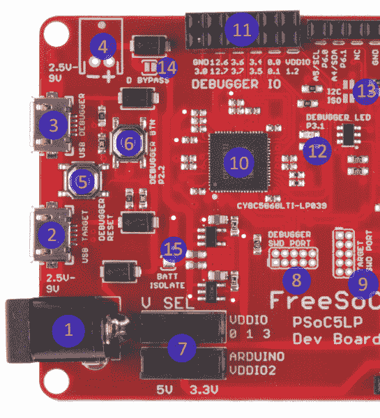](https://cdn.sparkfun.com/assets/learn_tutorials/5/5/6/freesoc2_left_half_labeled.png)

我们将进行硬件之旅，一次一个元素，从左边的调试和连接元素开始。

1.  5.5 毫米 x 2.1mm 毫米中心正极桶形插孔-这适合所有 SparkFun 的标准“壁式电源”。虽然 FreeSoC2 上的调节器可以处理高达 12V 的输入电压**，但最好将输入电压**尽可能保持在 5V 左右**。**
2.  “目标”USB 端口-提供与目标处理器(CY8C5888)的 USB 连接。当通过 Arduino IDE 上传代码时，您将连接到此端口。
3.  “调试器”USB 端口-连接到调试器 IC。连接到此端口还会创建一个 USB 串行端口，可用于从目标处理器上的 UART 接收数据或向其发送数据。
4.  2.5 毫米 JST PH 系列连接器尺寸-我们的[通孔 2 针 JST PH 连接器](https://www.sparkfun.com/products/9749)适合此处，允许您使用我们的任何标准[锂离子聚合物电池](https://www.sparkfun.com/categories/54)为电路板供电。
5.  调试器重置按钮-重置调试器。你可能永远也不会用到它。
6.  调试器用户按钮-可用于向调试器 IC 提供输入；目前未使用。
7.  IO 电压选择开关——这些开关允许您在目标处理器上选择 I/O 信号的电压，3.3V 或 5V。PSoC5LP 有四个 I/O 电压象限；底部开关允许您选择提供 Arduino 头信号的象限的电压，顶部开关控制所有其他信号。
8.  调试器 IC JTAG/SWD 接头-这种 2x5 0.050”间距接头可用于编程和调试调试器本身。它旨在支持从 Cypress 到 [MiniProg3](http://www.cypress.com/?rID=38154) 编程器/调试器的连接。你可能永远都不需要使用它。
9.  目标 IC JTAG/SWD 标题-本质上类似于调试器的标题；这些引脚上的信号也来自调试器 IC。
10.  调试器 IC -调试 IC 也是一个 PSoC5LP-在这种情况下，CY8C5868LTI-LP039。它预装的固件(称为“KitProg”)可以免费下载和修改；该器件可引导加载，以替换固件或在新固件可用时更新固件。
11.  调试器 IC IO 接口——这个接口上有许多可用的信号；默认情况下不使用它们，但是您可以在使用它们的调试器 IC 上实现额外的调试功能。
12.  调试器 IC 用户 LED -如果调试器不能检测到主机，将被点亮，并在数据传输(即编程或调试)期间闪烁。
13.  I ² C 隔离跳线-这些常开焊接跳线允许您将目标板上的 I ² C 线与调试器连接。使用赛普拉斯的 KitProg 调试软件，你可以从目标 ic 中窥探 I ² C 数据流量。通常，这些是打开的，禁用此功能。用焊点封闭它们，将调试器连接到目标的 I ² C 总线。
14.  电池供电二极管旁路-如果您使用 2.5 毫米 JST 连接器，并使用 LiPo 电池运行 FreeSoC2，您可能会发现二极管两端的电压降约为 0.5V，该二极管将电池电源接入主供电轨。该跳线可以用一滴焊料封闭，以绕过该二极管。

    **Caution:** if you close this jumper but fail to open the "BATT ISOLATE" jumper (item 15), plugging the board into USB power may cause damage to your battery or even a fire as the 5V USB supply shorts to the LiPo battery output.
15.  电池隔离跳线-无论何时关闭“D 旁路”跳线(项目 14)，该跳线**必须**打开，以避免损坏电池或火灾的风险。

[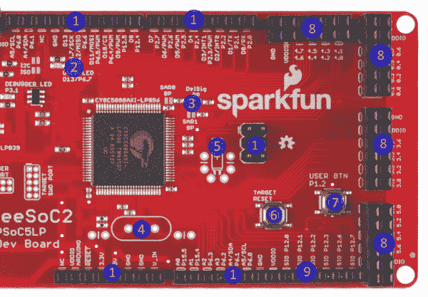](https://cdn.sparkfun.com/assets/learn_tutorials/5/5/6/freesoc2_right_half_labeled.png)

电路板的右半部分包含目标 IC(cy8c 5888 axi-LP 096)和相关接头。

1.  Arduino Uno R3 型接头-在大多数情况下，这些接头与 Uno R3 板完全兼容。唯一的例外是 VREF 引脚，它通常位于 I ² C 引脚和 D13 以上的地之间，不连接该板。
2.  目标用户 LED -连接到端口 6 的引脚 7，对应于 Arduino 映射接头上的 D13。
3.  ADC 基准电压源旁路电容跳线——这些跳线允许您在 PSoC 器件的三个引脚上添加一个 100nF 电容，为 ADC 基准电压源提供旁路，以提高基准电压源的精度。
4.  高频晶体足迹-如果你需要比板载振荡器更好的精度，你可以在这里添加一个标准的 HC/49 晶体。
5.  低频晶振 foo print——如果你想实现一个 RTC，你可以在这里加一个 [32.768kHz 时钟晶振](https://www.sparkfun.com/products/540)。
6.  目标 IC 复位按钮-该按钮仅复位目标 IC 的**。**
7.  目标 IC 用户按钮-该按钮可以映射到应用程序中的任何目的；该按钮下拉至地，不与任何其它接头相连。
8.  附加 IO 接头-这些 2x6 接头都是附加 I/O，它们的电压电平(以及这些接头的 VDDIO 引脚上的电压)由电路板左端顶部的 VDDIO set 开关控制，可以设置为 3.3V 或 5V。
9.  SIO 引脚——这六个引脚很特别，因为它们可以连接到高于其标称 I/O 电压的信号电压。当然，它们也可以正常使用。当其余 IO 引脚以 3.3V 运行时，这些引脚可以耐受 5V 电压。

## 使用 Arduino IDE

## 向 Arduino IDE 添加对 FreeSoC2 的支持

**Important:** please make sure you have Arduino.cc IDE version 1.6.4 or later before attempting to use the FreeSoC2 within the IDE!

目前，将 FreeSoC2 支持添加到 Arduino IDE 的唯一方法是直接下载文件并手动安装。下面是如何操作的说明。第一步是使用板管理器添加对 ARM 处理器内核的支持。

### 添加 ARM 处理器支持

与 Uno 或 Leonardo 等“真正的”Arduino 主板不同，PSoC5LP 使用 ARM Cortex-M3 处理器内核。最新型号的主板，如 Due 和 Zero，也使用 ARM 处理器，因此 Arduino 团队将 ARM-GCC 工具集添加到了官方支持的工具链中。这对我们来说很好，因为这意味着我们不必做太多工作(至少在工具链上)来增加对 PSoC 的支持。

你需要做的就是打开 Arduino IDE，并启动电路板管理器(见下图)。

[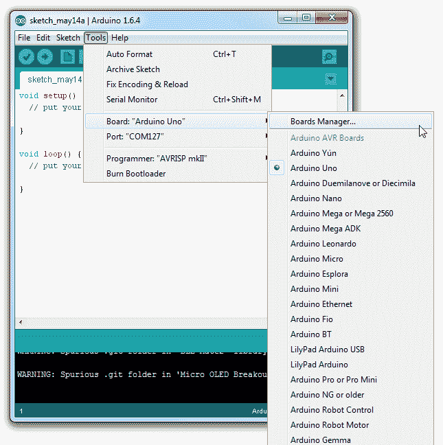](https://cdn.sparkfun.com/assets/learn_tutorials/3/7/9/arduino_board_manager.png)

默认可用选项之一是“Arduino SAM 板”；这些板使用 ARM Cortex 处理器(具体来说，是 Atmega SAM 器件)。只需单击该框将其高亮显示，然后单击“安装”。

[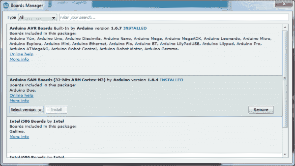](https://cdn.sparkfun.com/assets/learn_tutorials/3/7/9/Boards_Manager.png)

安装完成后，您会在 Arduino ARM 板的板菜单中看到一个新的子组。现在，是时候添加对 PSoC 的支持了。

[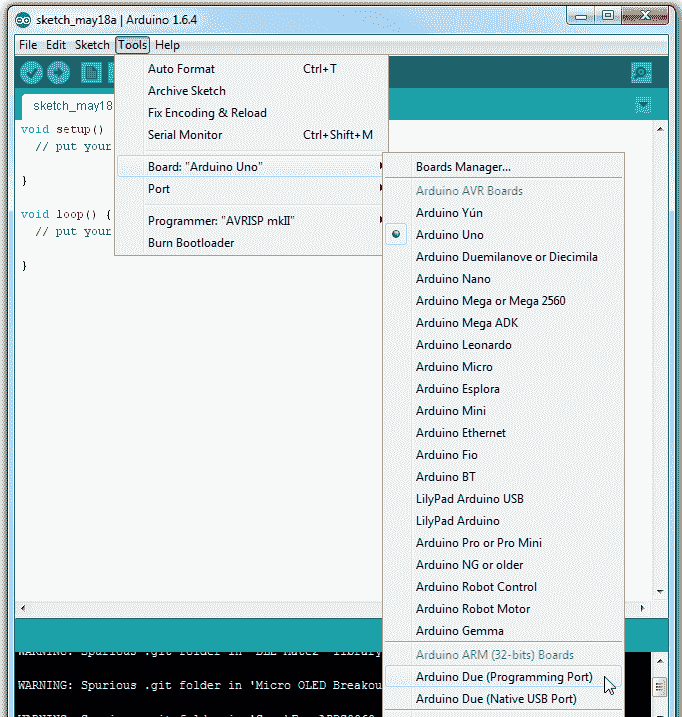](https://cdn.sparkfun.com/assets/learn_tutorials/3/7/9/boards_w_sam.png)

## 增加对 PSoC 板的支持

### 手动添加支持

要手动添加支持，您需要从 GitHub 库下载文件。

[Download the support files as a zip](https://github.com/sparkfun/PSoC_Arduino_Support/archive/master.zip)

一旦你下载了你的副本，你需要做的就是将“硬件”目录复制到你的 sketchbook(你可以在 Arduino 的首选项窗口中找到你的 sketchbook 路径)或者 Arduino IDE 的主安装目录中。无论哪种方式，如果有一个现有的“硬件”目录。这些文件应该与现有文件一起安装。

文件夹中的其他文件是 PSoC Creator IDE 项目文件，用于实现 Arduino 硬件和核心软件。一旦您熟悉了在 Arduino IDE 中使用 FreeSoC2，您可能希望打开它，作为使用该器件全部功能的第一步。

[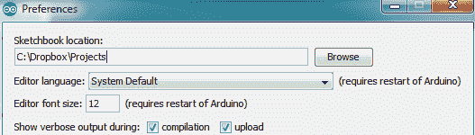](https://cdn.sparkfun.com/assets/learn_tutorials/3/7/9/Preferences.png)

如果 sketchbook 里有*不是*一个“硬件”目录，那没问题。只需将“硬件”目录从 zip 存档拖到 sketchbook 中。

重启 Arduino IDE，你应该会在“boards”菜单中看到电路板。

## 用 Arduino 引导程序对 FreeSoC2 板进行编程

如果您已经购买了早期版本的 FreeSoC2 (V11 或更早版本；查看主板背面，在版本号的电源连接器下)，或者如果您之前使用 PSoC Creator 软件在 FreeSoC2 主板上进行开发，您会发现它不会响应 Arduino IDE 的引导加载命令。

你需要一台 Windows 电脑(目前；我们正在为不久的将来开发 Mac/Linux 解决方案)使用引导加载程序十六进制文件对器件进行编程。

[Download the PSoC Programmer software](https://cdn.sparkfun.com/downloads/PSoCProgrammerSetup_3.22.3_3-24-15.exe)

安装软件后，请遵循以下说明:

1.  将板卡插入计算机，通过“调试器”端口连接(硬件导览图[左半部分的第 3 项)。**此时不要连接到“目标”端口。**](https://cdn.sparkfun.com/assets/learn_tutorials/5/5/6/freesoc2_left_half_labeled.png)
2.  KitBridge 编程器/调试器(在 FreeSoC2 上)的驱动程序已经作为编程器安装的一部分安装。如果 Windows 未能自动检测到它们，可以在编程器安装目录中找到它们。如果你有 Windows 8，你可能想看看这个关于安装未签名驱动程序的教程。
3.  启动编程器。您将看到以下窗口:

    [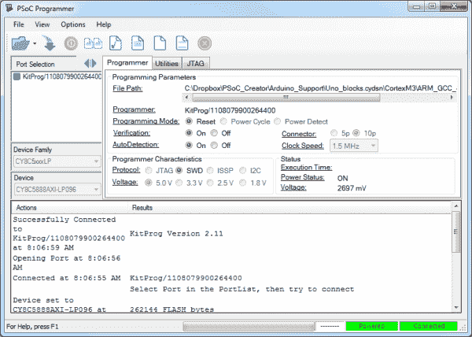](https://cdn.sparkfun.com/assets/learn_tutorials/3/7/9/programmer_open.png)

4.  加载“Bootloader.hex”文件，该文件位于您在上面下载的支持包(“Hardware/SparkFun/psoc”)中。

    [](https://cdn.sparkfun.com/assets/learn_tutorials/3/7/9/programmer_load.png)

5.  点击“KitProg”条目，选择电路板进行编程。如果菜单中没有“KitProg”条目，请检查以确保驱动程序已完成安装。如果您不能选择 KitProg，请检查以确保没有另一个 Programmer(或者 PSoC Creator)在另一个窗口中运行。

    [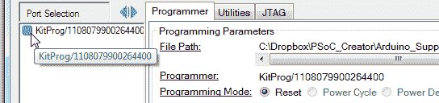](https://cdn.sparkfun.com/assets/learn_tutorials/3/7/9/kitprog_select.png)

6.  为“验证”和“自动检测”选择“开”。

    [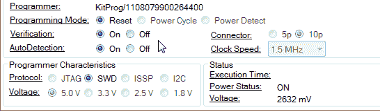](https://cdn.sparkfun.com/assets/learn_tutorials/3/7/9/verification_and_autodetect.png)

7.  单击“程序”按钮，将引导程序加载到主板上。

    [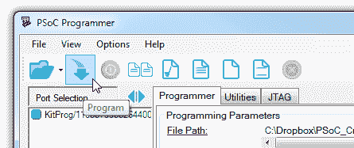](https://cdn.sparkfun.com/assets/learn_tutorials/3/7/9/program_button.png)

8.  连接板上的“目标”USB 端口。该驱动程序可以在您上面下载的支持包中找到(“Hardware/SparkFun/psoc”)。

如果一切顺利，你会有一个新的 com 端口(名为“Cypress USB UART”)，如果你在 Arduino IDE 中打开[串行监视器](https://learn.sparkfun.com/tutorials/terminal-basics)并发送“H”和“L”，你应该会看到板上的 LED 开关。

## 用 Arduino 编写代码

### FreeSoC2 和其他 Arduino 板的区别

PSoC 的核心支持与 Arduino Uno R3 非常相似，总体而言，在 Uno R3 上运行的代码将在 FreeSoC2 上运行，几乎不做任何更改。以下是需要注意的一些差异:

1.  管脚 0 和 1 上的硬件串口是`Serial1`，而不是`Serial`，就像 [Arduino Leonardo](https://www.sparkfun.com/products/11286) 上的一样。通过 USB 端口向计算机进行串行打印。
2.  FreeSoC2 上未连接 AREF 引脚。
3.  random()返回 24 位值，而不是 32 位值。
4.  一些更高级的字符串操作还没有实现。
5.  管脚号应该定义为`long`而不是`int`。

我们已经将大多数核心库移植到 FreeSoC: SPI、Wire (I ² C)和 Servo，并且我们已经为 [WS281x 可编程 RGB led](https://www.sparkfun.com/products/11820)创建了一个驱动程序库。其他原生 Arduino 库可能工作，也可能不工作。以下是我们在 Arduino 中用 FreeSoC2 验证过的库列表:

*   [我们的 APDS-9960 手势传感器库](https://www.sparkfun.com/products/12787)
*   [我们的微 OLED 突破库](https://www.sparkfun.com/products/13003)

#### 额外串行端口

如上所述，所有的`Serial`命令都通过目标与 PC 保持的 USB 连接。不过，这很尴尬，因为这意味着在代码开始运行和用户打开终端窗口之间的这段时间内，重置后立即发送的文本经常会丢失。

然而，FreeSoC2 有一个选项:当调试器 USB 端口连接到 PC 时，它将枚举为另一个串行端口。该端口可用于通过`Serial1`接口发送和接收来自 Arduino 应用程序的数据。我们将在下面演示。

### 例子

这个例子将向你展示如何访问不在正常 Arduino 范围内的管脚，以及如何使用串行端口。

记得在“板”菜单中选择“PSoC 开发板”!

```
language:c
/******************************************************************************
Example.ino

Simple example demonstrating the use of Serial ports and extra pins on the
FreeSoC2 board within the Arduino IDE.

14 May 2015

Developed/Tested with:
FreeSoC2
Arduino.cc IDE 1.6.4
This code is beerware; if you see me (or any other SparkFun employee) at the 
local, and you've found our code helpful, please buy us a round!

Distributed as-is; no warranty is given. 
******************************************************************************/
// Note the use of long here instead of int! This is important.
const long LEDPin = 13; // As on most Arduino compatible boards, there's an LED
                       //  tied to pin 13\. pinMode() works the same with the
                       //  FreeSoC2 as it does normally.
const long buttonPin = P1_D2; // Pins can also be referred to by port number
                       //  and pin number. These numbers are given on the board
                       //  as P<port>.<pin>. P1_D2 is connected to the user
                       //  button on one side ang ground on the other.

void setup() 
{
  // pinMode() functions are unchanged.
  pinMode(LEDPin, OUTPUT); 
  // The onboard user button needs to be a pullup-enabled input.
  pinMode(buttonPin, INPUT_PULLUP); 
  Serial.begin(9600);  // This is the same as it is on the Arduino Leonardo.
                       //  It represents the logical serial port connection to
                       //  the PC.
  Serial1.begin(9600); // Again, same as the Leonardo. This port is the physical
                       //  IO pins (0 and 1) on the headers. It can be accessed
                       //  via the KitProg serial port which is available when
                       //  the Debugger port is connected.
}

void loop() 
{
  // digitalRead() is unchanged.
  int pinDown = digitalRead(buttonPin);

  // Check for button pressed...
  if (pinDown == LOW)
  {
    Serial1.println("KitProg! Button pressed!");
    Serial.println("USB! Button pressed!");
    digitalWrite(LEDPin, HIGH);
  }
  else
  {
    digitalWrite(LEDPin, LOW);
  }

  delay(250);
} 
```

## PSoC Creator 入门

如果你想超越基础，你需要安装 [Cypress 的 PSoC Creator IDE](https://cdn.sparkfun.com/downloads/PSoCCreatorSetup_3.1_sp3_5-1-15.exe) 。它是免费的，没有代码大小的限制，尽管 Cypress 要求你在下载前注册。

遗憾的是，它只适用于 Windows。

我们将在这里完成一个非常简单的项目，只是比普通的“眨眼”例子多了一步。

### 连接电路板

对于 PSoC Creator 中的编程和调试，您需要通过“调试器”USB 端口连接电路板。驱动程序应该已经作为 Creator 安装过程的一部分进行了安装。如果没有，您可以在 Creator 安装目录中找到它们。如果你发现 Windows 8 下的驱动安装有问题，我们有一个[教程来帮助你解决这个](https://learn.sparkfun.com/tutorials/disabling-driver-signature-on-windows-8)。

没有必要连接“目标”端口，除非您实际上正在创建一个使用 USB 的项目，这超出了本教程的范围。

### 创建项目

[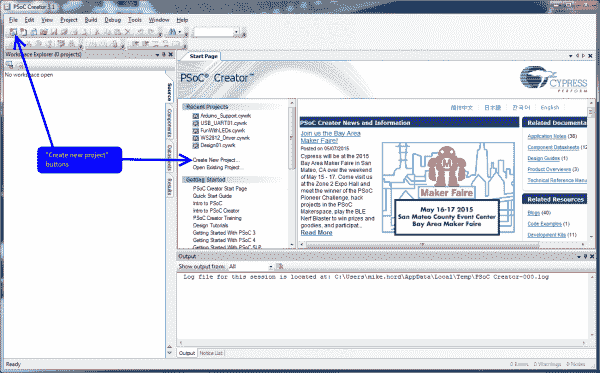](https://cdn.sparkfun.com/assets/learn_tutorials/3/7/9/creator_start_project_start.png)

这是您启动 Creator 时将看到的内容。要启动新项目，您可以单击“创建新项目...”链接在起始页上，菜单栏中的"新建"按钮，或者打开"文件"菜单并选择"项目..."在“新建”子菜单中。

[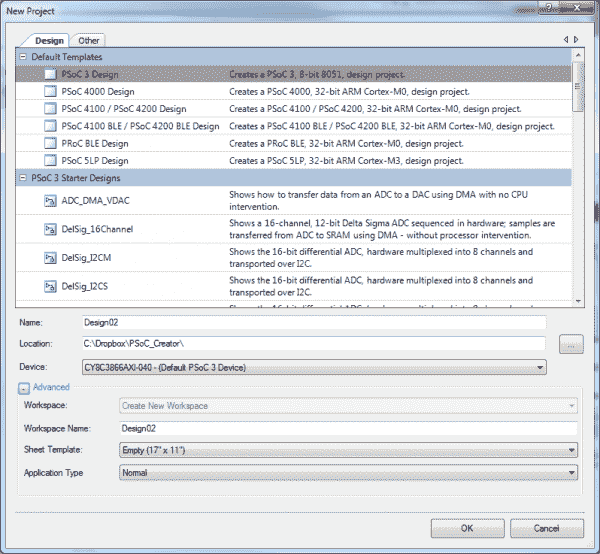](https://cdn.sparkfun.com/assets/learn_tutorials/3/7/9/new_project_window.png)

这将打开这个窗口。我点击了“高级”旁边的“+”来显示更多选项。

首先要做的是从“默认模板”列表中选择“PSoC 5LP 设计”。这将为您设置一些东西，包括设置编译器选项和路径。

[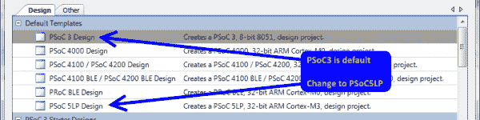](https://cdn.sparkfun.com/assets/learn_tutorials/3/7/9/project_type.png)

“名称”字段是**项目**的名称。PSoC Creator 将应用程序组织到**工作区**中，其中包含一个或多个**项目**。例如，您可能希望将一个应用程序及其引导装载程序作为一个工作空间的一部分，以保持它们的相关性。

在“高级”文件夹下面，您会看到更多与项目和工作区管理相关的选项。如果您当前有一个打开的工作区，您可以选择(通过“工作区”下拉菜单)将该项目添加到该工作区。否则，它将变灰，您需要提供一个工作区名称。

IDE 将在“位置:”字段中指定的目录中创建一个名为**工作区**的新目录；它将在*目录中创建一个子目录，并以项目的名称命名(如“项目:”字段中所声明的)。*

*[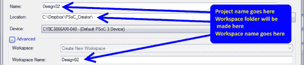](https://cdn.sparkfun.com/assets/learn_tutorials/3/7/9/project_workspace_name.png)

在“设备”菜单中，您可以找到启动设备选择器的选项。

[](https://cdn.sparkfun.com/assets/learn_tutorials/3/7/9/device_select_dropdown.png)

这将弹出所有不同 PSoC5LP 器件的列表。找到 **CY8C5888AXI-LP096** ，高亮显示该行，点击确定。您可能再也不需要更改它了；创造者记得你过去用过的部分。

[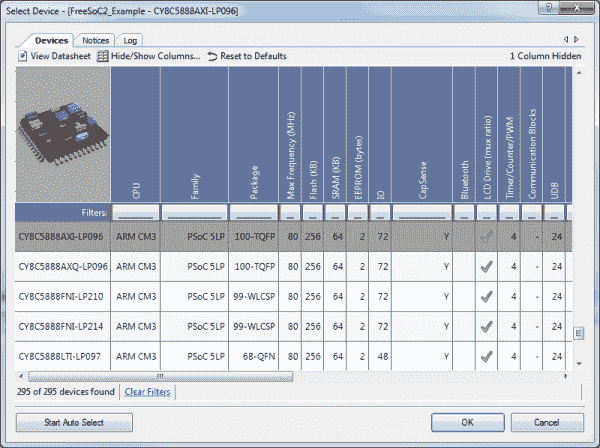](https://cdn.sparkfun.com/assets/learn_tutorials/3/7/9/device_selector.png)

“图纸模板”是用于定义设计硬件组件的原理图捕获图纸的大小和格式。我选择了 11"x17 "的分类帐大小，这是一个很好的起点，直到您习惯于将项目分解成更小的块并在库中制作组件。

最后，您可以选择您的应用程序是引导加载程序、可引导加载程序还是多应用程序引导加载程序(以提供故障安全操作)。我们暂时把它保持在“正常”状态。

[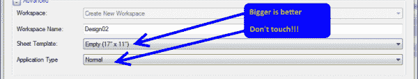](https://cdn.sparkfun.com/assets/learn_tutorials/3/7/9/sheet_and_app.png)

单击“确定”进入下一步。

### 添加硬件

在继续之前，您需要在原理图中添加一些硬件。当您向原理图添加硬件元素时，IDE 将生成 API 文件来支持硬件。

[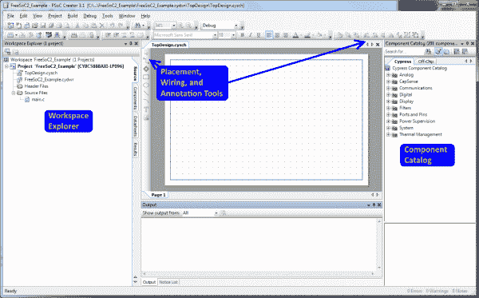](https://cdn.sparkfun.com/assets/learn_tutorials/3/7/9/new_project_2.png)

在屏幕的右侧，您可以看到一个称为“组件目录”的树形结构框架。这些都是你可以让 IDE 利用芯片资源构建的各种硬件设备。“Cypress”选项卡包含实际上将要创建的有源器件，“Off-Chip”选项卡允许您添加开关和 led 之类的东西。花点时间回顾一下可用的组件。这里面有很多非常好的东西，通常要么需要片外资源，要么需要大量占用资源的代码来实现。

左边是“Workspace Explorer”，这是包含在这个工作区中的项目中的文件的树形视图。活动工作区(即，当您单击快捷栏中的“构建”按钮时构建/程序的工作区)是粗体的。注意，虽然这个列表中有“文件夹”，但是这些文件夹与文件的实际位置没有任何关系！

[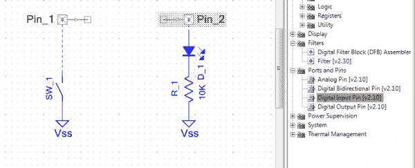](https://cdn.sparkfun.com/assets/learn_tutorials/3/7/9/added_pins.png)

我从器件目录中找到了几个器件:从“端口和引脚”、“数字输入引脚”和“数字输出引脚”，以及从片外部分、开关、电阻和 led。同样，这些片外器件纯粹是为了美观，对产生的输出没有任何影响，就像在原理图上画一只蝴蝶一样。

要连接它们，要么选择原理图窗口左边的“wire”工具，要么按“w”键。

双击输入引脚 Pin_1。您将看到组件配置窗口，在这里您可以设置在构建时定义部件的各种参数。

[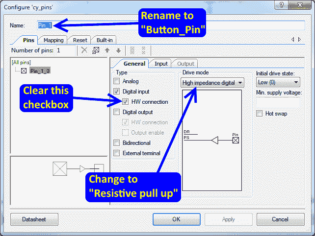](https://cdn.sparkfun.com/assets/learn_tutorials/3/7/9/input_configure.png)

从这里，你可以做很多事情。现在，我们要做三件事:重命名引脚，将驱动模式更改为“阻性上拉”并清除“硬件连接”复选框。“硬件连接”提供了一个在内部连接组件的位置；例如，PWM 输出或计数器的输入。如果你不想给它附加什么东西，你必须禁用这个复选框，否则 IDE 会报错。

也重命名 pinpin 的名称很重要，因为它将指示 IDE 将生成的函数的名称，以便为该对象提供代码接口。

[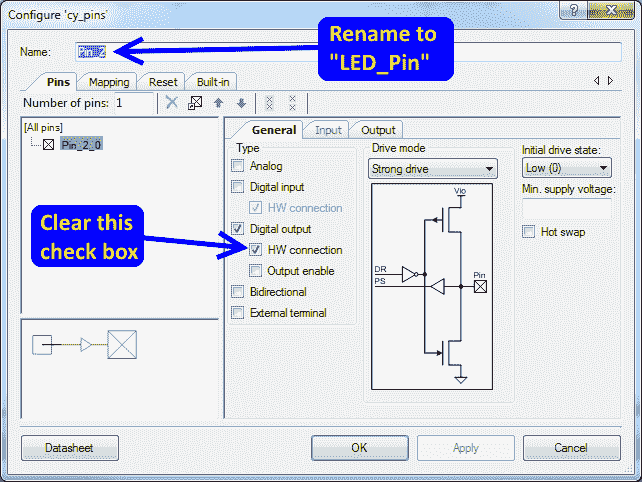](https://cdn.sparkfun.com/assets/learn_tutorials/3/7/9/output_configure.png)

我们将对输出引脚做同样的事情，只是这里我们可以保持驱动模式不变。

这里需要注意的另一件事是左下角的按钮:“数据表”。每个组件都有一个精心编写的数据表，描述其功能、配置窗口中的每个设置是什么、如何使用 API，以及预计它会消耗多少可用的数字或模拟资源。

在编写代码之前，我们要做的最后一件事是将这些逻辑引脚分配给封装上的一个物理引脚。为此，打开**。cydwr** 文件来自窗口左侧的工作区资源管理器。你会得到类似这样的东西:

[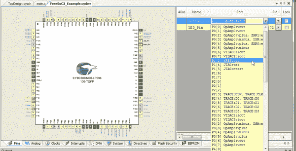](https://cdn.sparkfun.com/assets/learn_tutorials/3/7/9/cydwr_example.png)

暂时忽略底部边缘的标签。

在右侧，有一个引脚对象、端口引脚和物理引脚号的列表。如果您没有为物理端口分配 pin，IDE 会为您分配。在 FreeSoC2 上，用户按钮连接到端口 1 的引脚 2，用户连接到端口 6 的引脚 7，现在让我们进行分配。请注意，当您更改设置时,“锁定”框是如何被选中的；这可以防止 IDE 重新分配该 pin。

您还会注意到，许多引脚都有一些额外的文本与其端口/引脚信息相关联；例如，P1.2 也标记为“XRES:opt”。这些是可以与引脚相关联以提高性能的特殊功能，而不是强制给定引脚用于特定功能。

### 软件

我们写点代码吧！

首先要做的是创建必要的 API 文件，以支持您之前在原理图中放置的硬件。为此，在“构建”菜单中选择“生成应用程序”项。

[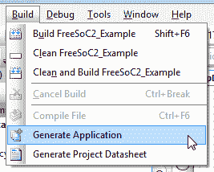](https://cdn.sparkfun.com/assets/learn_tutorials/3/7/9/generate_application.png)

您会注意到在工作区浏览器中弹出了一堆新文件。这些是组件的支持文件。不要编辑它们。事实上，它们只是标准的 C 文件，你*可以*修改它们来满足你的需要，但是 IDE 可以，也确实经常重新生成这些文件，这会清除你所做的任何更改。

[](https://cdn.sparkfun.com/assets/learn_tutorials/3/7/9/code_editor.png)

这是我们的 main.c 文件。这是自动生成的，您可以安全地更改它，而不用担心 IDE 会破坏它。

将这段代码放入`for(;;)`循环部分:

```
language:c
if (Button_Pin_Read() == 0)
{
  LED_Pin_Write(1);
}
else
{
  LED_Pin_Write(0);
} 
```

很简单:按下按钮时打开 LED，松开按钮时关闭。

现在，您可以将代码上传到处理器。下图中的红色大箭头显示了三种方法:“构建”菜单中的菜单项、菜单栏上的按钮和作为热键的 CTRL-F5。确保您连接到“调试”USB 端口！“目标”端口只能用于通过引导加载程序上传代码。

[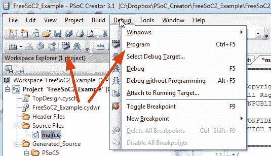](https://cdn.sparkfun.com/assets/learn_tutorials/3/7/9/program_1.png)

IDE 将自动保存所有打开的、已更改的文件，并在必要时启动重建。然后，它会找到任何附加的程序员，并自动连接和编程。

### 五金器具

不过，这是 PSoC，对吧？因此，我们可以完全跳过代码部分！

删除您刚刚添加到 main.c 文件中的代码，让我们在原理图中完成它。

**再次打开这些引脚配置窗口，这次勾选“硬件连接”复选框。**如果不这样做，您将无法将引脚相互连接。

然后，在这些引脚符号上出现的小方框之间添加一条导线(可通过键入“w”或使用原理图左边的工具栏来激活导线工具)，如下所示:

[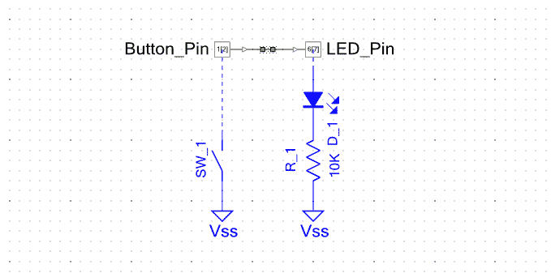](https://cdn.sparkfun.com/assets/learn_tutorials/3/7/9/hardware_connection.png)

现在，再次点击“程序”按钮，让我们看看会发生什么...

哎呦！按下按钮时灯灭，松开按钮时灯亮！极性颠倒了。我们需要一个逆变器。在数字/逻辑下的元件目录中找到“非”元件。在连接变频器之前，不要忘记删除两个引脚之间的电线！

[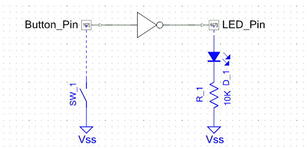](https://cdn.sparkfun.com/assets/learn_tutorials/3/7/9/inverter.png)

啊！我们走吧。现在它工作正常，*和*它不需要任何代码，也不需要对设备外部的物理硬件做任何改变。

### 继续前进！

Creator 提供了很多例子；可以从“示例...”中将它们添加到现有的工作区中“文件”菜单中的菜单项。

[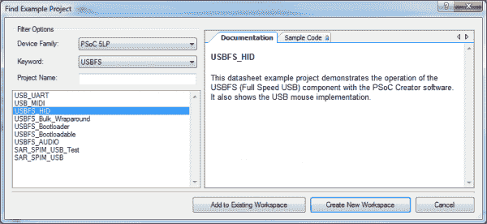](https://cdn.sparkfun.com/assets/learn_tutorials/3/7/9/examples.png)

示例按关键字排序；几乎每个问题都有一个例子。

## 资源和更进一步

PSoC 社区非常活跃，Cypress 为业余爱好者和专业工程师提供了很多非常好的资源:

*   [100 天 100 个项目](http://www.element14.com/community/thread/23736/l/100-projects-in-100-days?displayFullThread=true#Projects Released)——赛普拉斯联合 Element-14，创作了 100 个项目，并向社区发布。这些器件基于 PSoC4，但非常适合 PSoC5LP。
*   [论坛](http://www.cypress.com/?app=forum) - Cypress 也有一个蓬勃发展的论坛社区。
*   Reddit-PSoC 也有一个相当活跃的子网站。
*   [视频教程](http://www.cypress.com/?rID=40547)-PSoC Creator 官方培训视频。这些都是信息密集，超级有用。

更多自由社会 2 的乐趣，请查看其他 SparkFun 教程...

[](https://learn.sparkfun.com/tutorials/making-music-with-the-freesoc2) [### 用自由足球制作音乐 2

#### 2015 年 8 月 14 日](https://learn.sparkfun.com/tutorials/making-music-with-the-freesoc2) Create a synth keyboard with the FreeSoC2 from SparkFun.[Favorited Favorite](# "Add to favorites") 1*