# 3D 打印照明棒道具

> 原文：<https://learn.sparkfun.com/tutorials/3d-printed-illuminated-wand-prop>

## 介绍

在本教程中，我们将了解如何通过 3D 打印棒和添加 LED 来创建表演的舞台道具。

### 所需材料

要跟随本项目教程，您将需要以下材料。你可能不需要所有的东西，这取决于你拥有什么。将它添加到您的购物车，通读指南，并根据需要调整购物车。

 

将**添加到您的[购物车](https://www.sparkfun.com/cart)中！**

### [【电阻器套件- 1/4W(共 500)](https://www.sparkfun.com/products/10969)

[Out of stock](https://learn.sparkfun.com/static/bubbles/ "out of stock") COM-10969

电阻是个好东西，事实上，在许多电路设计中，电阻是至关重要的。唯一的问题似乎是…

$8.95180[Favorited Favorite](# "Add to favorites") 185[Wish List](# "Add to wish list")**** 

将**添加到您的[推车](https://www.sparkfun.com/cart)！**

### [纽扣电池- 20mm (CR2032)](https://www.sparkfun.com/products/338)

[In stock](https://learn.sparkfun.com/static/bubbles/ "in stock") PRT-00338

CR2032 锂金属 3V 250mAh 纽扣电池。非常适合为低功耗处理器供电或连续几周闪烁 LED 灯…

$2.10[Favorited Favorite](# "Add to favorites") 33[Wish List](# "Add to wish list")****[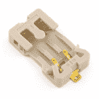](https://www.sparkfun.com/products/8822) 

将**添加到您的[购物车](https://www.sparkfun.com/cart)中！**

### 20mm 纽扣电池座(可缝)

[In stock](https://learn.sparkfun.com/static/bubbles/ "in stock") DEV-08822

这是普通 CR2032 型电池的硬币电池座。持有人有一个整洁的插入，弹出功能，使改变…

$1.504[Favorited Favorite](# "Add to favorites") 13[Wish List](# "Add to wish list")**** 

将**添加到您的[购物车](https://www.sparkfun.com/cart)中！**

### [热收缩套装](https://www.sparkfun.com/products/9353)

[In stock](https://learn.sparkfun.com/static/bubbles/ "in stock") PRT-09353

我们喜欢热收缩！我们用它来做各种各样方便的项目。用它来加强连接，保护设备和电子…

$8.957[Favorited Favorite](# "Add to favorites") 40[Wish List](# "Add to wish list")****[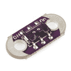](https://www.sparkfun.com/products/9350) 

将**添加到您的[购物车](https://www.sparkfun.com/cart)中！**

### [LilyPad 滑动开关](https://www.sparkfun.com/products/9350)

[In stock](https://learn.sparkfun.com/static/bubbles/ "in stock") DEV-09350

这是一个简单的 LilyPad 滑动开关。使用它作为一个简单的开/关开关，或控制发光二极管，蜂鸣器，传感器等。T…

$1.992[Favorited Favorite](# "Add to favorites") 26[Wish List](# "Add to wish list")**** 

将**添加到您的[购物车](https://www.sparkfun.com/cart)中！**

### [【黑色连接线(22 AWG)】](https://www.sparkfun.com/products/8022)

[In stock](https://learn.sparkfun.com/static/bubbles/ "in stock") PRT-08022

标准 22 AWG 固体黑色挂钩线。使用这与你的面包板或任何项目，你需要坚固的电线。来了…

$2.951[Favorited Favorite](# "Add to favorites") 19[Wish List](# "Add to wish list")****[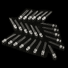](https://www.sparkfun.com/products/9850) 

将**添加到您的[购物车](https://www.sparkfun.com/cart)中！**

### [【LED-超高亮白色(25 个装)](https://www.sparkfun.com/products/9850)

[31 available](https://learn.sparkfun.com/static/bubbles/ "31 available") COM-09850

我们都知道，发光二极管越多越好。别担心，我们会掩护你的。这是一包 25 个发光二极管都很方便…

$9.502[Favorited Favorite](# "Add to favorites") 16[Wish List](# "Add to wish list")************** ************### 工具

你需要一个[焊接工具](https://www.sparkfun.com/categories/49)，一台 3D 打印机和 ABS 细丝。热风枪或热空气返工站是可选的，用于加热热收缩或如果你想平滑热胶的边缘。

[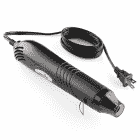](https://www.sparkfun.com/products/10326) 

将**添加到您的[购物车](https://www.sparkfun.com/cart)中！**

### [Heaterizer XL-3000 热风枪](https://www.sparkfun.com/products/10326)

[In stock](https://learn.sparkfun.com/static/bubbles/ "in stock") TOL-10326

Heaterizer XL-3000 热风枪非常适合热缩、熔化物品，甚至非常基本的低温返工。

$14.9519[Favorited Favorite](# "Add to favorites") 49[Wish List](# "Add to wish list")**** 

将**添加到您的[购物车](https://www.sparkfun.com/cart)中！**

### [【烙铁- 60W(可调温度)](https://www.sparkfun.com/products/14456)

[In stock](https://learn.sparkfun.com/static/bubbles/ "in stock") TOL-14456

当你不想倾家荡产，但又需要一个可靠的烙铁时，这个可调节温度的烙铁是一个很好的工具…

$16.5016[Favorited Favorite](# "Add to favorites") 43[Wish List](# "Add to wish list")**** 

将**添加到您的[购物车](https://www.sparkfun.com/cart)中！**

### [无铅焊料- 15 克管](https://www.sparkfun.com/products/9163)

[In stock](https://learn.sparkfun.com/static/bubbles/ "in stock") TOL-09163

这是你的无铅焊料的基本管，带有不干净的水溶性树脂芯。0.031 英寸规格，15 克

$3.954[Favorited Favorite](# "Add to favorites") 14[Wish List](# "Add to wish list")****[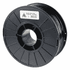](https://www.sparkfun.com/products/retired/12954) 

### [ABS 长丝 3mm - 1kg(黑色)](https://www.sparkfun.com/products/retired/12954)

[Retired](https://learn.sparkfun.com/static/bubbles/ "Retired") TOL-12954

这是一个 1 千克(2.2 磅)的 3 毫米黑色 ABS(丙烯腈丁二烯苯乙烯)塑料细丝卷轴，用于 3D 打印。腹肌是 grea…

1 **Retired**[Favorited Favorite](# "Add to favorites") 3[Wish List](# "Add to wish list") 

### [TAZ 6 3D 打印机](https://www.sparkfun.com/products/retired/13880)

[Retired](https://learn.sparkfun.com/static/bubbles/ "Retired") TOL-13880

LulzBot TAZ 6 是有史以来最可靠、最易于使用的桌面 3D 打印机，具有创新的自调平和自…

2 **Retired**[Favorited Favorite](# "Add to favorites") 11[Wish List](# "Add to wish list") 

### [剥线钳- 20-30AWG](https://www.sparkfun.com/products/retired/14763)

[Retired](https://learn.sparkfun.com/static/bubbles/ "Retired") TOL-14763

这些是 Techni-Tool 的高级剥线钳，带有弯曲的手柄，如果您需要拆卸，这是一个实惠的选择

3 **Retired**[Favorited Favorite](# "Add to favorites") 0[Wish List](# "Add to wish list")****** ******您还需要:

*   剪刀
*   热胶枪和胶棒
*   砂纸或过滤器

### 推荐阅读

如果您不熟悉以下概念，我们建议您在继续之前查看这些教程。手电筒套件是一个很好的开始套件，如果你没有焊接过！

 [### 如何为项目提供动力](https://learn.sparkfun.com/tutorials/how-to-power-a-project) A tutorial to help figure out the power requirements of your project.[Favorited Favorite](# "Add to favorites") 67 [### LilyPad 按钮和开关](https://learn.sparkfun.com/tutorials/lilypad-buttons-and-switches) Learn about the button and switch offerings in the LilyPad line and how to use them.[Favorited Favorite](# "Add to favorites") 2 [### 手电筒套件](https://learn.sparkfun.com/tutorials/flashlight-kit) This is an assembly guide for the SparkFun Flashlight Kit, a basic learn to solder kit.[Favorited Favorite](# "Add to favorites") 3

## 3D 打印出来

在浏览 Thingiverse 后，我发现有吸引力的型号是[“Jake reves”elder wand](https://www.thingiverse.com/thing:1069671)。去那里下载文件，打印出你的尺寸模型。由于打印区域较小，您需要分两部分打印零件。

[Thingiverse: The Elder Wand](https://www.thingiverse.com/thing:1069671)

## 了解您的电路

电路很简单，由一个 LED、10 个&ohm;电阻、LilyPad 开关和一个电池盒组成。我选择在 LED 的阳极(较长的腿)和电池座的“ **+** ”端子之间添加一个限流电阻。电阻器可能是不必要的，因为硬币电池不能提供足够的电流来损坏 LED。尽管如此，还是添加了一个电阻作为良好的做法。在 LED 的阴极(较短的腿)和电池座的“ **-** ”端子之间增加了 LilyPad 开关。

[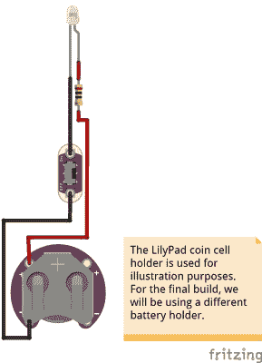](https://cdn.sparkfun.com/assets/learn_tutorials/8/3/4/Lilypad_LED_Wand_Circuit_Fritzing_bb.jpg)

虽然开关的方向不影响电路的整体功能，但我确实决定让 LilyPad 开关的 on 侧面向用户的 LED。此外，与魔杖的尺寸相比，LilyPad 硬币盒有点大，所以这个项目选择了一个较小的盒子。支架上将有标记，指示带有备用支架的“ **+** ”和“ **-** ”端子。

| [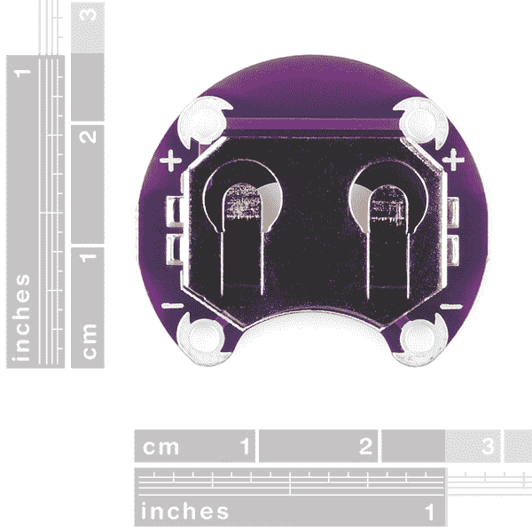](https://cdn.sparkfun.com/assets/learn_tutorials/8/3/4/10730-02a_LilyPad_Coin_Cell_Battery_Holder_CR2032.jpg) | [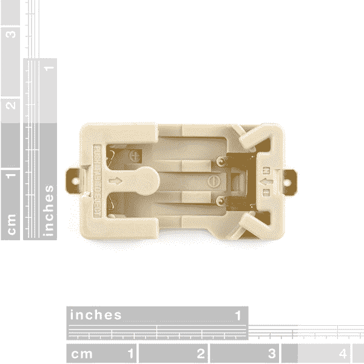](https://cdn.sparkfun.com/assets/learn_tutorials/8/3/4/08822-01-L_Coin_Cell_Battery_Holder_CR2032.jpg) |
| *lily pad 硬币电池座尺寸
[PRT-10730](https://www.sparkfun.com/products/retired/10730)* | *硬币电池座尺寸
[ [DEV-08822](https://www.sparkfun.com/products/8822) ]* |

## 硬件连接

**Note:** I used a Lulzbot Taz 5 for the print. The Lulzbot Taz 6 should have a sufficient enough area to print the wand pieces.

在 3D 打印机上打印棒并将其从打印区域移除后，您需要移除棒下的 raft 支架。用钳子小心地拆下支架。根据我的设置，在把两个部件粘在一起之前，手柄上还印着一些需要移除的支撑物。准备好之后，在手柄的凹窝里加入一些热胶水，将两块连接在一起。

[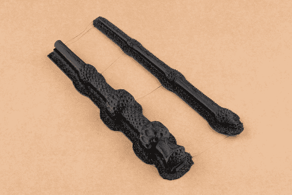](https://cdn.sparkfun.com/assets/learn_tutorials/8/3/4/3D_Printed_Illuminated_Wand_2_Pieces.jpg)**Tip:** If you are using hot glue, try using a hot air rework station to smooth out the rough sections of glue holding the part together. Just try not to apply too much heat as this can warp or melt the wand that was printed with ABS.

[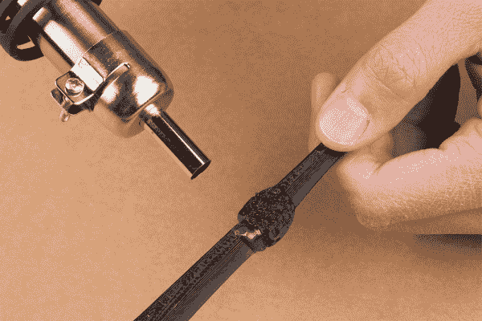](https://cdn.sparkfun.com/assets/learn_tutorials/8/3/4/3D_Printed_Illuminated_Wand_Hot_Air_Smooth_Hot_Glue.jpg)

组装完成后，你的魔杖看起来应该和下图相似。

让我们从魔杖的电子部分开始。超高亮白色 LED 很亮，但从各个角度都很难看到。为了漫射 LED 并增加 LED 的视角，您需要打磨环氧树脂透镜。使用砂纸或锉刀打磨 LED 的外部。确保将支脚靠近 LED，以免损坏从环氧树脂透镜中脱出的针脚。

[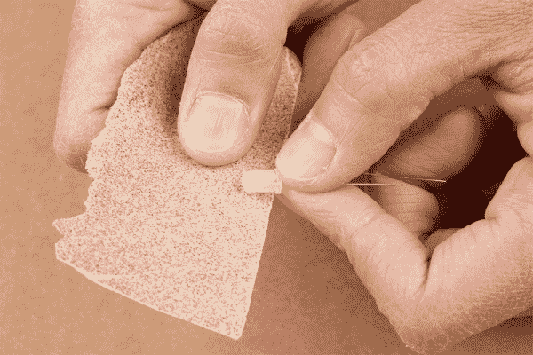](https://cdn.sparkfun.com/assets/learn_tutorials/8/3/4/3D_Printed_Illuminated_Wand_LED_Sanding.jpg)

在 LED 的一端缠绕一个限流电阻。在这种情况下，我在 LED 的较长引脚(即 **+** ，阳极侧)添加了一个 10 &ohm;电阻。然后[焊接](https://learn.sparkfun.com/tutorials/how-to-solder-through-hole-soldering)并用平切刀修剪剩余的端子。请务必小心处理电阻器端子，因为与 LED 端子相比，它们很薄。

[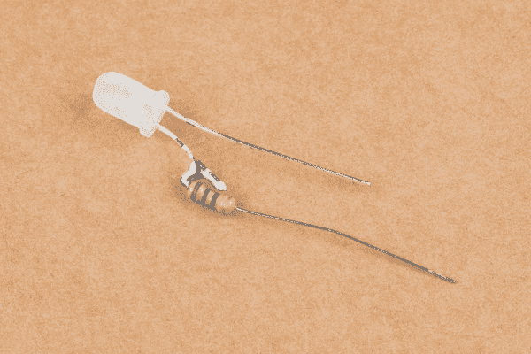](https://cdn.sparkfun.com/assets/learn_tutorials/8/3/4/3D_Printed_Illuminated_Wand_LED_Current_Limiting_Resistor.jpg)

切断两根实心线，使它们能够沿着棒的长度延伸。你会想要一点额外的空间来处理电线。[剥去电线末端](https://learn.sparkfun.com/tutorials/working-with-wire)，将一根电线焊接到 LED 的较短引线上(即 **-** ，阴极侧)。然后将第二根导线焊接到电阻器的另一端。

[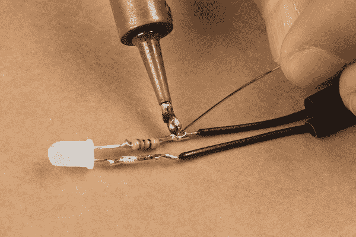](https://cdn.sparkfun.com/assets/learn_tutorials/8/3/4/3D_Printed_Illuminated_Wand_Soldering_Wire_to__LED.jpg)**Note:** While you can use stranded core wire, solid core wire will hold its shape better compared to stranded wires.

切掉一些热缩膜，盖住 LED 和电阻的裸露端子。将热缩管滑下电线，滑过端子。将电线缠绕在魔杖上。你需要用一只手按住电线，同时将电线缠绕在魔杖上。确保电线固定在棒上。如果您对为开关和硬币电池座的“ **+** ”端子提供的电线长度感到满意，请加热热缩管。

[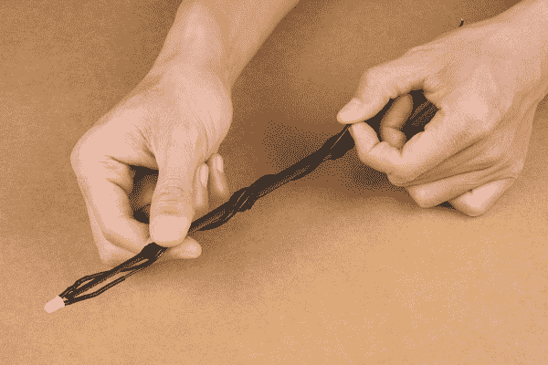](https://cdn.sparkfun.com/assets/learn_tutorials/8/3/4/3D_Printed_Illuminated_Wand_Wrapping_Wire.jpg)

在将电线焊接到开关和硬币电池座之前，请注意要添加组件的位置。开关将在下图所示的凹槽之间的棒的顶部。如图所示，电池盒将放在凹槽之间的棒下面(救生筏支架被移除的地方)。

[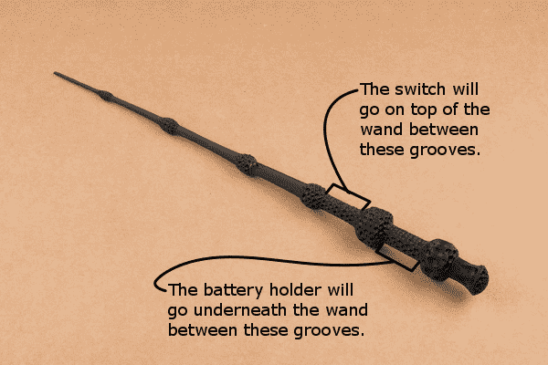](https://cdn.sparkfun.com/assets/learn_tutorials/8/3/4/3D_Printed_Wand_Grooves.jpg)

你应该有足够的电线来添加一个开关和电池座。将 LED 阴极侧(即“T0”—“T1”，较长的引线)的电线焊接到与 ON 位置相邻的端子上。如果你不确定极性，用纽扣电池或万用表测试一下。

[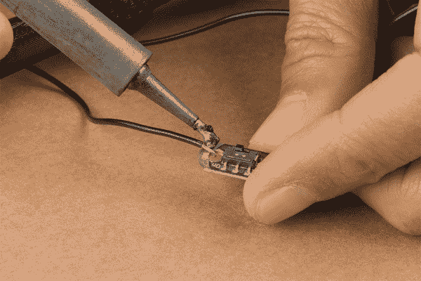](https://cdn.sparkfun.com/assets/learn_tutorials/8/3/4/3D_Printed_Illuminated_Wand_Soldering_LilyPad_Switch.jpg)**Tip:** The plated through hole on the LilyPad switch was designed to provide enough area for contact when using conductive thread and hold the component against fabric. However, you can still solder to the pad. If necessary, you could hook and clamp the wire down against the hole using pliers. You may need to use a 3rd hand or tape to hold the wire and switch down when soldering the joint.

使用剥线器的末端小心地弯曲硬币电池盒的端子，以便它可以很好地安装在棒的凹槽之间。

[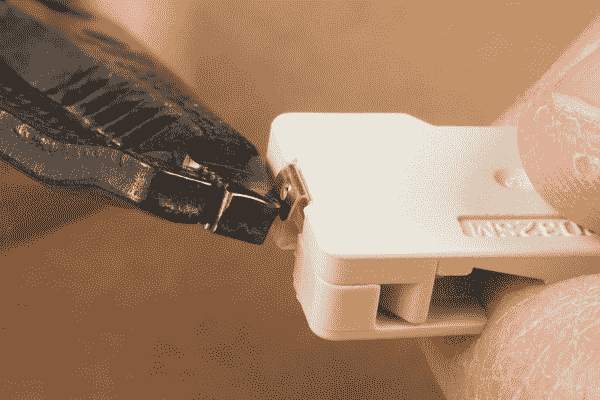](https://cdn.sparkfun.com/assets/learn_tutorials/8/3/4/3D_Printed_Illuminated_Wand_Bending_Terminals.jpg)

剥去导线与电阻器相连的另一端，将导线的裸露端滑过“ **+** ”端子通孔的顶部。如果你对长度满意，就把电线焊接到端子上。然后剪下并剥去另一段电线，加在开关的 OFF 位置和灯座的“ **-** ”端子之间。

[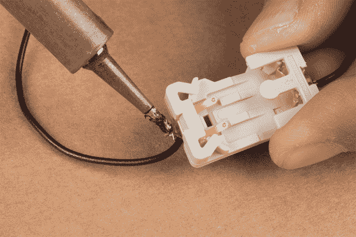](https://cdn.sparkfun.com/assets/learn_tutorials/8/3/4/3D_Printed_Illuminated_Wand_Soldering_Coin_Cell_Holder.jpg)

此时，用纽扣电池或万用表测试连接。确保开关拨到 ON 位置。如果您使用的是硬币电池，电池不需要完全插入硬币电池座即可点亮。

剪下一些透明的热收缩带，并将其套在 LED 和魔杖尖上。向热收缩层加热。

[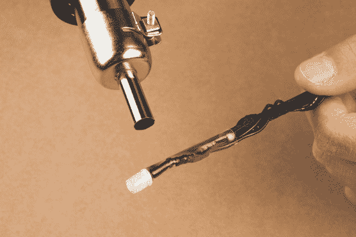](https://cdn.sparkfun.com/assets/learn_tutorials/8/3/4/3D_Printed_Illuminated_Wand_Clear_Heat_Shrink_LED.jpg)

如果你对连接满意，将开关和硬币电池盒的底部热粘在棒上。避免在币形电池盒上添加过多的热胶。如果支架与电池的接触被盖住，可能会干扰电路，导致 LED 不亮。一旦热熔胶冷却下来，将币形电池完全插入固定器。

[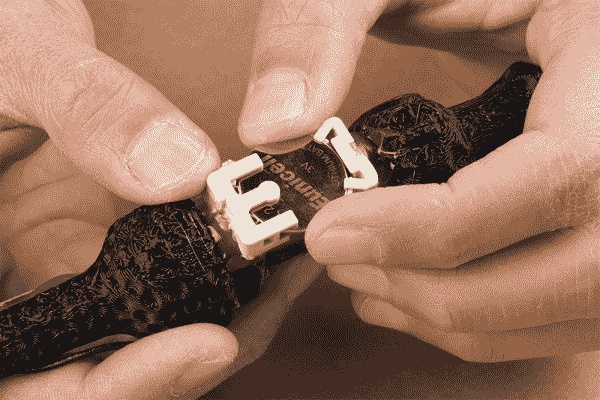](https://cdn.sparkfun.com/assets/learn_tutorials/8/3/4/3D_Printed_Illuminated_Wand_Testing_with_CR2032_Coin_Cell_Battery.jpg)

魔杖的手柄看起来应该和下图相似。

[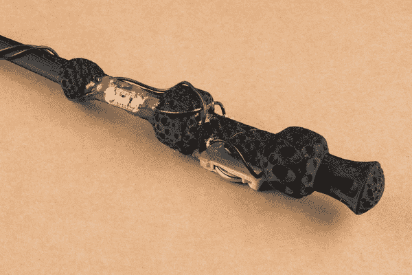](https://cdn.sparkfun.com/assets/learn_tutorials/8/3/4/3D_Printed_Illuminated_Wand_Hot_Glue_Circuit.jpg)

你完全组装好的 3D 打印发光棒看起来应该和下图相似！

如果您还没有，请翻转开关给 LED 通电。即使在明亮的房间里，漫射 LED 仍然可见！

| [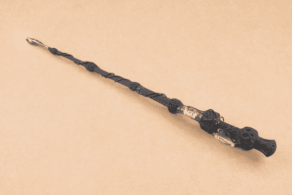](https://cdn.sparkfun.com/assets/learn_tutorials/8/3/4/3D_Printed_Illuminated_Wand_LED_Circuit_Assembled_Bright_Room.jpg) |  |
| *明亮房间中的照明棒* | *弱光下的照明棒* |

重复以上步骤，为你所有的巫师制作更多的魔杖！

## 现场压力测试

### 排练

当我把发光的魔杖交给我的学生时，情况如何？他们不介意电路缠绕在魔杖的外面。孩子们开始念魔法咒语，跑来跑去轻弹想象中的能量球，并试着让东西悬浮起来。结果没人关注。幸运的是，在秋季演出前的最后一次排练中，我把他们的发光魔杖交给了他们。至少他们真的很入戏？

|  |  |

### 表演时间！

当演出开始时，一切都按计划进行。照明棒在整个技术期间、演出期间和演出结束后持续存在。这是他们上场后的照片！

## 让它变得更好

总有改进的空间。项目完成后，我有了一些让道具更实用的想法。下面列出了未来版本中可能实现的升级和改进。

*   **微控制器和传感器** -如果我有更多的时间，我会想给每根魔杖添加一个微控制器和传感器(即加速度计和陀螺仪)，这样 LED 就会根据手势打开。
*   定制 3D 模型 -我也想从头开始设计一个魔杖，将电子元件放在里面，类似于 Thingiverse 上的其他模型。

## 资源和更进一步

有关该项目的更多信息，请查看以下资源:

*   [东西:接骨木魔杖](https://www.thingiverse.com/thing:1069671)

你的下一个项目需要一些灵感吗？查看一些相关教程:

 [### 原型可穿戴 LED 舞蹈背带](https://learn.sparkfun.com/tutorials/prototype-wearable-led-dance-harness) A project tutorial to add an extra effect for dancers performing a choreographed piece. The harness can be added quickly under a costume.[Favorited Favorite](# "Add to favorites") 4 [### 帝国之声:冲锋队变声器](https://learn.sparkfun.com/tutorials/vox-imperium-stormtrooper-voice-changer) Add some flair to your Imperial uniform by changing your voice using a Teensy 3.2 and Prop Shield.[Favorited Favorite](# "Add to favorites") 8 [### TeensyView 连接指南](https://learn.sparkfun.com/tutorials/teensyview-hookup-guide) A guide to using the TeensyView OLED board to display text and graphics.[Favorited Favorite](# "Add to favorites") 5 [### 互动 3D 打印 LED 钻石道具](https://learn.sparkfun.com/tutorials/interactive-3d-printed-led-diamond-prop) In this tutorial, we will learn about how to create an interactive theatrical prop for a performance by 3D printing a translucent diamond prop using a non-addressable RGB LED strip and AT42QT1011 capacitive touch sensing.[Favorited Favorite](# "Add to favorites") 5

或者看看下面的一些博客帖子来寻找灵感:

 [### 电子营火

March 4, 2015](https://www.sparkfun.com/news/1718 "March 4, 2015: A walk-through of building what turned out to be a complicated prop.")[Favorited Favorite](# "Add to favorites") 2 [### 硬件高峰日:一天的光剑制作

May 3, 2017](https://www.sparkfun.com/news/2375 "May 3, 2017: Celebrate the 4th, Jedi style, with a "spectacular" lightsaber build!")[Favorited Favorite](# "Add to favorites") 0 [### 3D 打印市场的灰色阴影

February 21, 2018](https://www.sparkfun.com/news/2618 "February 21, 2018: When it comes to readily available OS designs, what is the role and responsibility of sellers and buyers in the 3D printing marketplace? And why buy when you can DIY? ")[Favorited Favorite](# "Add to favorites") 2 [### 用 EasyVR 制造魔法

December 20, 2018](https://www.sparkfun.com/news/2839 "December 20, 2018: It's like clap-on, clap-off, but nerdier. ")[Favorited Favorite](# "Add to favorites") 1******************