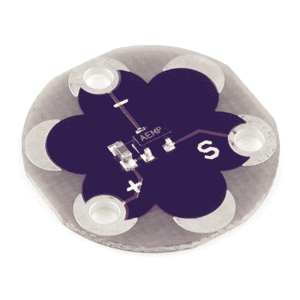

# LilyPad 温度传感器连接指南

> 原文：<https://learn.sparkfun.com/tutorials/lilypad-temperature-sensor-hookup-guide>

## 介绍

[LilyPad 温度传感器](https://www.sparkfun.com/products/8777)可以让你在可穿戴项目上检测环境(或压在传感器上的物体)的温度变化。

 

将**添加到您的[购物车](https://www.sparkfun.com/cart)中！**

 **### [LilyPad 温度传感器](https://www.sparkfun.com/products/8777)

[In stock](https://learn.sparkfun.com/static/bubbles/ "in stock") DEV-08777

MCP9700 是一种小型热敏电阻型温度传感器。LilyPad 是一种可穿戴的电子纺织品技术，由……

$5.50[Favorited Favorite](# "Add to favorites") 21[Wish List](# "Add to wish list")** **温度传感器板将在设定温度下输出特定电压-每摄氏度(°C)10mV，0 摄氏度设置为 0.5V。流经信号选项卡的电流可由 LilyPad Arduino 板上的模拟选项卡读取，并通过公式转换为摄氏度或华氏度。继续学习，了解如何将传感器电压转换为项目中可用的温度数据。

您需要将传感器连接到 LilyPad Arduino 或其他微控制器，以读取输出值并在代码中使用。

### 所需材料

为了跟随代码示例，我们建议:**