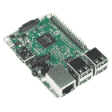
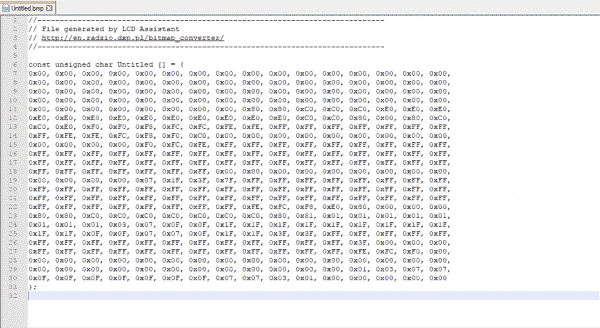

# Qwiic 微型有机发光二极管连接指南

> 原文：<https://learn.sparkfun.com/tutorials/qwiic-micro-oled-hookup-guide>

## 介绍

Qwiic 微型有机发光二极管是我们微型有机发光二极管显示器的 Qwiic 支持版本！这款小型黑白蓝底有机发光二极管显示器显示出难以置信的清晰图像

[](https://www.sparkfun.com/products/14532) 

将**添加到您的[购物车](https://www.sparkfun.com/cart)中！**

 **### [【spark fun 微有机发光二极管突围(Qwiic)](https://www.sparkfun.com/products/14532)

[In stock](https://learn.sparkfun.com/static/bubbles/ "in stock") LCD-14532

SparkFun Qwiic 微型有机发光二极管突破是 Qwiic 启用版本的流行微视图和微型有机发光二极管显示器！

$18.506[Favorited Favorite](# "Add to favorites") 45[Wish List](# "Add to wish list")** **[https://www.youtube.com/embed/OBOgxnctzwI/?autohide=1&border=0&wmode=opaque&enablejsapi=1](https://www.youtube.com/embed/OBOgxnctzwI/?autohide=1&border=0&wmode=opaque&enablejsapi=1)

该连接指南将向您展示如何开始在您的有机发光二极管上绘制对象和字符。

### 所需材料

首先，你需要一个微控制器来控制一切。

[](https://www.sparkfun.com/products/13975) 

将**添加到您的[购物车](https://www.sparkfun.com/cart)中！**

 **### [spark fun red board——用 Arduino 编程 T3](https://www.sparkfun.com/products/13975)

[In stock](https://learn.sparkfun.com/static/bubbles/ "in stock") DEV-13975

SparkFun RedBoard 结合了 UNO 的 Optiboot 引导程序的简单性、FTDI 的稳定性和 shield com…

$21.5049[Favorited Favorite](# "Add to favorites") 89[Wish List](# "Add to wish list")****[](https://www.sparkfun.com/products/13907) 

将**添加到您的[购物车](https://www.sparkfun.com/cart)中！**

 **### [SparkFun ESP32 东西](https://www.sparkfun.com/products/13907)

[In stock](https://learn.sparkfun.com/static/bubbles/ "in stock") DEV-13907

SparkFun ESP32 Thing 是 Espressif 的 ESP32 的综合开发平台，ESP32 是他们的超级充电版本…

$23.5069[Favorited Favorite](# "Add to favorites") 83[Wish List](# "Add to wish list")****[](https://www.sparkfun.com/products/13774) 

将**添加到您的[购物车](https://www.sparkfun.com/cart)中！**

 **### [【粒子光子】](https://www.sparkfun.com/products/13774)

[Out of stock](https://learn.sparkfun.com/static/bubbles/ "out of stock") WRL-13774

Particle 的 IoT(物联网)硬件开发板 Photon 提供了构建互联网络所需的一切…

$19.0032[Favorited Favorite](# "Add to favorites") 51[Wish List](# "Add to wish list")****[](https://www.sparkfun.com/products/retired/13825) 

### [树莓派 3](https://www.sparkfun.com/products/retired/13825)

[Retired](https://learn.sparkfun.com/static/bubbles/ "Retired") DEV-13825

每个人都知道并喜欢 Raspberry Pi，但如果您不需要额外的外设来使其无线化会怎么样呢？覆盆子…

92 **Retired**[Favorited Favorite](# "Add to favorites") 97[Wish List](# "Add to wish list")****** ******现在，要进入 Qwiic 生态系统，关键是以下 Qwiic 屏蔽之一，以符合您对微控制器的偏好:

[](https://www.sparkfun.com/products/14352) 

将**添加到您的[购物车](https://www.sparkfun.com/cart)中！**

 **### [ArduinoT3 的 SparkFun Qwiic 盾](https://www.sparkfun.com/products/14352)

[In stock](https://learn.sparkfun.com/static/bubbles/ "in stock") DEV-14352

SparkFun Qwiic Shield 是一种易于组装的板，它提供了一种简单的方法来将 Qwiic Connect 系统与

$7.508[Favorited Favorite](# "Add to favorites") 39[Wish List](# "Add to wish list")****[](https://www.sparkfun.com/products/14459) 

将**添加到您的[购物车](https://www.sparkfun.com/cart)中！**

 **### [树莓派的 SparkFun Qwiic 帽子](https://www.sparkfun.com/products/14459)

[In stock](https://learn.sparkfun.com/static/bubbles/ "in stock") DEV-14459

树莓派的 SparkFun Qwiic 帽子是进入 Qwiic 生态系统的最快捷、最简单的方式，并且仍然适用于

$6.505[Favorited Favorite](# "Add to favorites") 33[Wish List](# "Add to wish list")****[](https://www.sparkfun.com/products/14477) 

将**添加到您的[购物车](https://www.sparkfun.com/cart)中！**

 **### [光子盾](https://www.sparkfun.com/products/14477)

[28 available](https://learn.sparkfun.com/static/bubbles/ "28 available") DEV-14477

SparkFun Qwiic Shield for Photon 是一个易于组装的板，提供了一种简单的方法来整合 Qwiic 系统…

$6.50[Favorited Favorite](# "Add to favorites") 7[Wish List](# "Add to wish list")****** ******您还需要一根 Qwiic 电缆将屏蔽层连接到有机发光二极管，选择适合您需要的长度。

[](https://www.sparkfun.com/products/14427) 

将**添加到您的[购物车](https://www.sparkfun.com/cart)中！**

 **### [Qwiic 线缆- 100mm](https://www.sparkfun.com/products/14427)

[In stock](https://learn.sparkfun.com/static/bubbles/ "in stock") PRT-14427

这是一条 100 毫米长的 4 芯电缆，带有 1 毫米 JST 端接。它旨在将支持 Qwiic 的组件连接在一起…

$1.50[Favorited Favorite](# "Add to favorites") 32[Wish List](# "Add to wish list")****[](https://www.sparkfun.com/products/14429) 

将**添加到您的[购物车](https://www.sparkfun.com/cart)中！**

 **### [Qwiic 线缆- 500mm](https://www.sparkfun.com/products/14429)

[In stock](https://learn.sparkfun.com/static/bubbles/ "in stock") PRT-14429

这是一根 500mm 长的 4 芯电缆，带有 1mm JST 端接。它旨在将支持 Qwiic 的组件连接在一起…

$1.951[Favorited Favorite](# "Add to favorites") 25[Wish List](# "Add to wish list")****[](https://www.sparkfun.com/products/14426) 

将**添加到您的[购物车](https://www.sparkfun.com/cart)中！**

 **### [Qwiic 线缆- 50mm](https://www.sparkfun.com/products/14426)

[In stock](https://learn.sparkfun.com/static/bubbles/ "in stock") PRT-14426

这是一根 50 毫米长的 4 芯电缆，带有 1 毫米 JST 端接。它旨在将支持 Qwiic 的组件连接在一起…

$0.95[Favorited Favorite](# "Add to favorites") 29[Wish List](# "Add to wish list")****[](https://www.sparkfun.com/products/14428) 

### [Qwiic 线缆- 200mm](https://www.sparkfun.com/products/14428)

[Out of stock](https://learn.sparkfun.com/static/bubbles/ "out of stock") PRT-14428

这是一根 200 毫米长的 4 芯电缆，带有 1 毫米 JST 端接。它旨在将支持 Qwiic 的组件连接在一起…

[Favorited Favorite](# "Add to favorites") 21[Wish List](# "Add to wish list")****** ******### 推荐阅读

如果你不熟悉 Qwiic 系统，我们推荐你在这里阅读[以获得一个概述](https://www.sparkfun.com/qwiic)。

| [](https://www.sparkfun.com/qwiic) |
| *[Qwiic 连接系统](https://www.sparkfun.com/qwiic)* |

如果你不熟悉下面的教程，我们也建议你看一看。

[](https://learn.sparkfun.com/tutorials/i2c) [### I2C](https://learn.sparkfun.com/tutorials/i2c) An introduction to I2C, one of the main embedded communications protocols in use today.[Favorited Favorite](# "Add to favorites") 128[](https://learn.sparkfun.com/tutorials/qwiic-shield-for-arduino--photon-hookup-guide) [### Arduino 和光子连接指南的 Qwiic 屏蔽](https://learn.sparkfun.com/tutorials/qwiic-shield-for-arduino--photon-hookup-guide) Get started with our Qwiic ecosystem with the Qwiic shield for Arduino or Photon.[Favorited Favorite](# "Add to favorites") 5

## 硬件概述

下面列出了 Qwiic 微型有机发光二极管的一些工作范围和特性。

| 特性 | 范围 |
| 电压 | **3.3V****** |
| 温度 | -40 摄氏度至 85 摄氏度 |
| I ² C 地址 | 0X3D(默认)或 0X3C(闭合跳线) |

### 腿

| 别针 | 描述 | 方向 |
| GND | 地面 | 在…里 |
| 3.3V | 力量 | 在…里 |
| 国家药品监督管理局 | 数据 | 在…里 |
| SCL | 时钟 | 在…里 |

## 可选功能

板上有几个跳线可以改变，以促进几种不同的功能。第一个是 I ² C 上拉跳线，如下图所示。如果多个板连接到 I ² C 总线，等效电阻下降，增加你的上拉强度。如果多块电路板连接在同一总线上，请确保只有一块电路板连接了上拉电阻。

[](https://cdn.sparkfun.com/assets/learn_tutorials/7/1/8/pu.PNG)

ADDR 跳线(下面突出显示)可用于更改电路板的 I ² C 地址。默认跳线默认打开，将地址引脚拉高，给我们一个 I ² C 地址 **0X3D** 。闭合该跳线将使地址引脚接地，从而为我们提供 0X3C 的 I ² C 地址。

[](https://cdn.sparkfun.com/assets/learn_tutorials/7/1/8/addr.PNG)

## 硬件装配

如果你还没有组装好你的 Qwiic 盾，现在是时候去上那个教程了。随着盾牌的组装，Sparkfun 的新 Qwiic 环境意味着连接屏幕不可能更容易。只需将 qw IC 线缆的一端插入有机发光二极管显示器，另一端插入 qw IC 保护罩，您就可以开始在您的小显示器上显示图像了。

[](https://cdn.sparkfun.com/assets/learn_tutorials/7/1/8/Qwiic_OLED-03.jpg)

有机发光二极管屏幕本身最初是松散地附着在分线板上的，所以要小心处理它！您可以使用自己的外壳来展示有机发光二极管，也可以使用一些双面胶带作为不太持久的解决方案。

[](https://cdn.sparkfun.com/assets/learn_tutorials/7/1/8/Qwiic_OLED-01.jpg)

## 库概述

**注意:**此示例假设您在桌面上使用的是最新版本的 Arduino IDE。如果这是你第一次使用 Arduino，请回顾我们关于[安装 Arduino IDE 的教程。](https://learn.sparkfun.com/tutorials/installing-arduino-ide)如果您之前没有安装 Arduino 库，请查看我们的[安装指南。](https://learn.sparkfun.com/tutorials/installing-an-arduino-library)

首先，你需要下载并安装 **SparkFun 微型有机发光二极管库**。你可以在 Arduino IDE 的库管理器中通过搜索“**微型有机发光二极管突破**”来自动安装这个库。也可以从 [GitHub 库](https://github.com/sparkfun/SparkFun_Micro_OLED_Arduino_Library)手动下载。此外，请务必下载 Qwiic 示例草图，我们将在本教程中回顾这些草图。

[Download the SparkFun Micro OLED Library (ZIP)](https://github.com/sparkfun/SparkFun_Micro_OLED_Arduino_Library/archive/main.zip)[Download the SparkFun Qwiic Micro OLED Example Sketches (ZIP)](https://cdn.sparkfun.com/assets/learn_tutorials/7/1/8/Arduino_Sketchs_Qwiic_OLED.zip)

在我们开始开发草图之前，让我们看看这个库的可用功能。

*   **`void command(uint8_t c);`** -向显示器发送一个命令字节。
*   **`void data(uint8_t c);`** -发送显示一个数据字节。
*   **`void setColumnAddress(uint8_t add);`** -设置列地址。
*   **`void setPageAddress(uint8_t add);`** -设置页面地址。

### LCD 绘图功能

*   **`void clear(uint8_t mode):`** -清除有机发光二极管内存中的屏幕缓冲区，传入 mode = ALL 清除有机发光二极管控制器中的 GDRAM。传入 mode = PAGE 以清除屏幕页面缓冲区。
*   **`void clear(uint8_t mode, uint8_t c);`** -清除有机发光二极管内存中的屏幕缓冲区，用字符‘c’替换。
*   **`void invert(boolean inv);`** -将每个黑色像素变为白色，将所有白色像素变为黑色。
*   **`void contrast(uint8_t contrast);`** -在 0 到 255 之间任意改变对比度值。
*   **`void display(void);`** -将显示内存移动到屏幕以绘制内存中的图像。
*   **`void setCursor(uint8_t x, uint8_t y);`** -将光标位置设置为(x，y)。
*   **`void pixel(uint8_t x, uint8_t y);`** -使用当前前景色和当前绘制模式在屏幕缓冲区的 x，y 位置绘制一个像素。
*   **`void pixel(uint8_t x, uint8_t y, uint8_t color, uint8_t mode);`**——在屏幕缓冲区的 x，y 位置用范数或异或绘制模式绘制一个像素。
*   **`void line(uint8_t x0, uint8_t y0, uint8_t x1, uint8_t y1);`** -使用当前前景色和当前绘制模式从屏幕缓冲区的 x0，y0 到 x1，y1 绘制线条。
*   **`void line(uint8_t x0, uint8_t y0, uint8_t x1, uint8_t y1, uint8_t color, uint8_t mode);`** -使用屏幕缓冲区的颜色和模式从 x0，y0 到 x1，y1 画线。
*   **`void lineH(uint8_t x, uint8_t y, uint8_t width);`** -使用当前前景色和当前绘制模式从屏幕缓冲区的 x，y 到 x+width，y 绘制水平线。
*   **`void lineH(uint8_t x, uint8_t y, uint8_t width, uint8_t color, uint8_t mode);`**——使用屏幕缓冲区的颜色和模式从 x，y 到 x+width，y 绘制水平线。
*   **`void lineV(uint8_t x, uint8_t y, uint8_t height);`** -使用当前前景色和当前绘制模式从 x，y 到 x，y+屏幕缓冲区高度绘制垂直线。
*   **`void lineV(uint8_t x, uint8_t y, uint8_t height, uint8_t color, uint8_t mode);`** -使用颜色和模式从 x，y 到 x，y+屏幕缓冲区的高度绘制垂直线。
*   **`void rect(uint8_t x, uint8_t y, uint8_t width, uint8_t height);`** -使用当前前景色和当前绘制模式绘制矩形，从 x，y 到 x+宽度，y+高度的屏幕缓冲区。
*   **`void rect(uint8_t x, uint8_t y, uint8_t width, uint8_t height, uint8_t color , uint8_t mode);`** -使用颜色和模式绘制矩形，从 x，y 到 x+宽度，y+高度的屏幕缓冲区。
*   **`void rectFill(uint8_t x, uint8_t y, uint8_t width, uint8_t height);`** -使用当前前景色和当前绘制模式绘制填充矩形，从 x，y 到 x+宽度，y+高度的屏幕缓冲区。
*   **`void rectFill(uint8_t x, uint8_t y, uint8_t width, uint8_t height, uint8_t color , uint8_t mode);`** -使用颜色和模式从 x，y 到 x+宽度，y+高度的屏幕缓冲区绘制填充矩形。
*   **`void circle(uint8_t x, uint8_t y, uint8_t radius);`** -使用当前前景色和当前绘制模式，以屏幕缓冲区的 x，y 为中心，绘制半径为的圆。
*   **`void circle(uint8_t x, uint8_t y, uint8_t radius, uint8_t color, uint8_t mode);`** -使用颜色和模式，以屏幕缓冲区的 x，y 为圆心，画一个半径为的圆。
*   **`void circleFill(uint8_t x0, uint8_t y0, uint8_t radius);`** -使用当前前景色和当前绘制模式，以屏幕缓冲区的 x，y 为中心，绘制半径为的实心圆。
*   **`void circleFill(uint8_t x0, uint8_t y0, uint8_t radius, uint8_t color, uint8_t mode);`** -使用颜色和模式绘制半径为实心圆，圆心在屏幕缓冲区的 x，y 轴。
*   **`void drawChar(uint8_t x, uint8_t y, uint8_t c);`** -在位置(x，y)绘制一个字符。
*   **`void drawChar(uint8_t x, uint8_t y, uint8_t c, uint8_t color, uint8_t mode);`** -在位置(x，y)使用颜色和模式绘制一个字符
*   **`void drawBitmap(uint8_t * bitArray);`** -绘制预加载的位图。
*   **`uint8_t getLCDWidth(void);`** -获取 LCD 的宽度作为一个字节。
*   **`uint8_t getLCDHeight(void);`** -以字节为单位获取 LCD 的高度。

### 字体设置

*   **`uint8_t getFontWidth(void);`** -以字节形式获取当前字体宽度。
*   **`uint8_t getFontHeight(void);`** -以字节形式获取当前字体高度。
*   **`uint8_t getTotalFonts(void);`** -返回加载到 MicroOLED 的闪存中的字体总数。
*   **`uint8_t getFontType(void);`** -返回当前字体的字体类型号(字体类型如下所示)。
*   **`uint8_t setFontType(uint8_t type);`** -设置字体类型(字体类型如下所示)。

| 字体类型 | 最大列数 | 最大行数 | 描述 |
| Zero | Ten | six | 最小的 5x7 像素字符。 |
| one | six | three | 中等，8x16 像素字符。 |
| Two | five | three | 7 段显示样式字符，每段 10x16 像素。 |
| three | five | one | 大，12x48(整个屏幕高度)字符。 |

*   **`uint8_t getFontStartChar(void);`** -返回当前字体的起始 ASCII 字符。
*   **`uint8_t getFontTotalChar(void);`** -返回当前字体的总字符数。

### 旋转和滚动

以下功能将在每个功能的不同指定方向上滚动屏幕。开始和停止表示将要滚动的行/列的范围。

*   **`void scrollRight(uint8_t start, uint8_t stop);`** -卷轴右
*   **T2`void scrollLeft(uint8_t start, uint8_t stop);`**
*   **T2`void scrollVertRight(uint8_t start, uint8_t stop);`**
*   **T2`void scrollVertLeft(uint8_t start, uint8_t stop);`**
*   **`void scrollStop(void);`** 下面两个函数非常简单，如果`flip`为真，它们将翻转图形。
*   **T2`void flipVertical(boolean flip);`**
*   **T2`void flipHorizontal(boolean flip);`**

## 例子

### 示例:功能演示

第一个示例通过几个应用程序演示了屏幕的许多可用功能。请记住，在看这个例子时，画任何东西都需要两步。你必须首先把你希望屏幕显示的内容写入屏幕的内存，然后你必须告诉屏幕显示内存中的内容。首先，我们必须包括使用 I ² C 的`Wire`库，以及控制屏幕的`SFE_MicroOLED`库。然后代码使用`DC_JUMPER = 1`初始化有机发光二极管。如果您已经关闭分线板上的跳线，使用`DC_JUMPER = 0`。

```
language:c
#include <Wire.h>  // Include Wire if you're using I2C
#include <SFE_MicroOLED.h>  // Include the SFE_MicroOLED library
#define PIN_RESET 9  
#define DC_JUMPER 1 
MicroOLED oled(PIN_RESET, DC_JUMPER);    // I2C declaration

void setup()
{
  delay(100);
  Wire.begin();
  oled.begin();    // Initialize the OLED
  oled.clear(ALL); // Clear the display's internal memory
  oled.display();  // Display what's in the buffer (splashscreen)
  delay(1000);     // Delay 1000 ms
  oled.clear(PAGE); // Clear the buffer.

  randomSeed(analogRead(A0) + analogRead(A1));
} 
```

下面的代码告诉微控制器如何打印每个例子。这是查看前面讨论的函数是如何实现的示例的好地方。

```
language:c
void lineExample()
{
  int middleX = oled.getLCDWidth() / 2;
  int middleY = oled.getLCDHeight() / 2;
  int xEnd, yEnd;
  int lineWidth = min(middleX, middleY);

  printTitle("Lines!", 1);

  for (int i=0; i<3; i++)
  {
    for (int deg=0; deg<360; deg+=15)
    {
      xEnd = lineWidth * cos(deg * PI / 180.0);
      yEnd = lineWidth * sin(deg * PI / 180.0);

      oled.line(middleX, middleY, middleX + xEnd, middleY + yEnd);
      oled.display();
      delay(10);
    }
    for (int deg=0; deg<360; deg+=15)
    {
      xEnd = lineWidth * cos(deg * PI / 180.0);
      yEnd = lineWidth * sin(deg * PI / 180.0);

      oled.line(middleX, middleY, middleX + xEnd, middleY + yEnd, BLACK, NORM);
      oled.display();
      delay(10);
    }
  }
}

void shapeExample()
{
  printTitle("Shapes!", 0);

  // Silly pong demo. It takes a lot of work to fake pong...
  int paddleW = 3;  // Paddle width
  int paddleH = 15;  // Paddle height
  // Paddle 0 (left) position coordinates
  int paddle0_Y = (oled.getLCDHeight() / 2) - (paddleH / 2);
  int paddle0_X = 2;
  // Paddle 1 (right) position coordinates
  int paddle1_Y = (oled.getLCDHeight() / 2) - (paddleH / 2);
  int paddle1_X = oled.getLCDWidth() - 3 - paddleW;
  int ball_rad = 2;  // Ball radius
  // Ball position coordinates
  int ball_X = paddle0_X + paddleW + ball_rad;
  int ball_Y = random(1 + ball_rad, oled.getLCDHeight() - ball_rad);//paddle0_Y + ball_rad;
  int ballVelocityX = 1;  // Ball left/right velocity
  int ballVelocityY = 1;  // Ball up/down velocity
  int paddle0Velocity = -1;  // Paddle 0 velocity
  int paddle1Velocity = 1;  // Paddle 1 velocity

  //while(ball_X >= paddle0_X + paddleW - 1)
  while ((ball_X - ball_rad > 1) && 
         (ball_X + ball_rad < oled.getLCDWidth() - 2))
  {
    // Increment ball's position
    ball_X+=ballVelocityX;
    ball_Y+=ballVelocityY;
    // Check if the ball is colliding with the left paddle
    if (ball_X - ball_rad < paddle0_X + paddleW)
    {
      // Check if ball is within paddle's height
      if ((ball_Y > paddle0_Y) && (ball_Y < paddle0_Y + paddleH))
      {
        ball_X++;  // Move ball over one to the right
        ballVelocityX = -ballVelocityX; // Change velocity
      }
    }
    // Check if the ball hit the right paddle
    if (ball_X + ball_rad > paddle1_X)
    {
      // Check if ball is within paddle's height
      if ((ball_Y > paddle1_Y) && (ball_Y < paddle1_Y + paddleH))
      {
        ball_X--;  // Move ball over one to the left
        ballVelocityX = -ballVelocityX; // change velocity
      }
    }
    // Check if the ball hit the top or bottom
    if ((ball_Y <= ball_rad) || (ball_Y >= (oled.getLCDHeight() - ball_rad - 1)))
    {
      // Change up/down velocity direction
      ballVelocityY = -ballVelocityY;
    }
    // Move the paddles up and down
    paddle0_Y += paddle0Velocity;
    paddle1_Y += paddle1Velocity;
    // Change paddle 0's direction if it hit top/bottom
    if ((paddle0_Y <= 1) || (paddle0_Y > oled.getLCDHeight() - 2 - paddleH))
    {
      paddle0Velocity = -paddle0Velocity;
    }
    // Change paddle 1's direction if it hit top/bottom
    if ((paddle1_Y <= 1) || (paddle1_Y > oled.getLCDHeight() - 2 - paddleH))
    {
      paddle1Velocity = -paddle1Velocity;
    }

    // Draw the Pong Field
    oled.clear(PAGE);  // Clear the page
    // Draw an outline of the screen:
    oled.rect(0, 0, oled.getLCDWidth() - 1, oled.getLCDHeight());
    // Draw the center line
    oled.rectFill(oled.getLCDWidth()/2 - 1, 0, 2, oled.getLCDHeight());
    // Draw the Paddles:
    oled.rectFill(paddle0_X, paddle0_Y, paddleW, paddleH);
    oled.rectFill(paddle1_X, paddle1_Y, paddleW, paddleH);
    // Draw the ball:
    oled.circle(ball_X, ball_Y, ball_rad);
    // Actually draw everything on the screen:
    oled.display();
    delay(25);  // Delay for visibility
  }
  delay(1000);
}

void textExamples()
{
  printTitle("Text!", 1);

  // Demonstrate font 0\. 5x8 font
  oled.clear(PAGE);     // Clear the screen
  oled.setFontType(0);  // Set font to type 0
  oled.setCursor(0, 0); // Set cursor to top-left
  // There are 255 possible characters in the font 0 type.
  // Lets run through all of them and print them out!
  for (int i=0; i<=255; i++)
  {
    // You can write byte values and they'll be mapped to
    // their ASCII equivalent character.
    oled.write(i);  // Write a byte out as a character
    oled.display(); // Draw on the screen
    delay(10);      // Wait 10ms
    // We can only display 60 font 0 characters at a time.
    // Every 60 characters, pause for a moment. Then clear
    // the page and start over.
    if ((i%60 == 0) && (i != 0))
    {
      delay(500);           // Delay 500 ms
      oled.clear(PAGE);     // Clear the page
      oled.setCursor(0, 0); // Set cursor to top-left
    }
  }
  delay(500);  // Wait 500ms before next example

  // Demonstrate font 1\. 8x16\. Let's use the print function
  // to display every character defined in this font.
  oled.setFontType(1);  // Set font to type 1
  oled.clear(PAGE);     // Clear the page
  oled.setCursor(0, 0); // Set cursor to top-left
  // Print can be used to print a string to the screen:
  oled.print(" !\"#$%&'()*+,-./01234");
  oled.display();       // Refresh the display
  delay(1000);          // Delay a second and repeat
  oled.clear(PAGE);
  oled.setCursor(0, 0);
  oled.print("56789:;<=>?@ABCDEFGHI");
  oled.display();
  delay(1000);
  oled.clear(PAGE);
  oled.setCursor(0, 0);
  oled.print("JKLMNOPQRSTUVWXYZ[\\]^");
  oled.display();
  delay(1000);
  oled.clear(PAGE);
  oled.setCursor(0, 0);
  oled.print("_`abcdefghijklmnopqrs");
  oled.display();
  delay(1000);
  oled.clear(PAGE);
  oled.setCursor(0, 0);
  oled.print("tuvwxyz{|}~");
  oled.display();
  delay(1000);

  // Demonstrate font 2\. 10x16\. Only numbers and '.' are defined. 
  // This font looks like 7-segment displays.
  // Lets use this big-ish font to display readings from the
  // analog pins.
  for (int i=0; i<25; i++)
  {
    oled.clear(PAGE);            // Clear the display
    oled.setCursor(0, 0);        // Set cursor to top-left
    oled.setFontType(0);         // Smallest font
    oled.print("A0: ");          // Print "A0"
    oled.setFontType(2);         // 7-segment font
    oled.print(analogRead(A0));  // Print a0 reading
    oled.setCursor(0, 16);       // Set cursor to top-middle-left
    oled.setFontType(0);         // Repeat
    oled.print("A1: ");
    oled.setFontType(2);
    oled.print(analogRead(A1));
    oled.setCursor(0, 32);
    oled.setFontType(0);
    oled.print("A2: ");
    oled.setFontType(2);
    oled.print(analogRead(A2));
    oled.display();
    delay(100);
  }

  // Demonstrate font 3\. 12x48\. Stopwatch demo.
  oled.setFontType(3);  // Use the biggest font
  int ms = 0;
  int s = 0;
  while (s <= 5)
  {
    oled.clear(PAGE);     // Clear the display
    oled.setCursor(0, 0); // Set cursor to top-left
    if (s < 10)
      oled.print("00");   // Print "00" if s is 1 digit
    else if (s < 100)     
      oled.print("0");    // Print "0" if s is 2 digits
    oled.print(s);        // Print s's value
    oled.print(":");      // Print ":"
    oled.print(ms);       // Print ms value
    oled.display();       // Draw on the screen
    ms++;         // Increment ms
    if (ms >= 10) // If ms is >= 10
    {
      ms = 0;     // Set ms back to 0
      s++;        // and increment s
    }
  }
}

// Center and print a small title
// This function is quick and dirty. Only works for titles one
// line long.
void printTitle(String title, int font)
{
  int middleX = oled.getLCDWidth() / 2;
  int middleY = oled.getLCDHeight() / 2;

  oled.clear(PAGE);
  oled.setFontType(font);
  // Try to set the cursor in the middle of the screen
  oled.setCursor(middleX - (oled.getFontWidth() * (title.length()/2)),
                 middleY - (oled.getFontWidth() / 2));
  // Print the title:
  oled.print(title);
  oled.display();
  delay(1500);
  oled.clear(PAGE);
} 
```

然后，示例代码将在所有示例之间循环。这是一个很好的方法来查看你的代码在屏幕上的样子。

```
void loop()
{
  lineExample();   // Then the line example function
  shapeExample();  // Then the shape example
  textExamples();  // Finally the text example
} 
```

示例代码将类似于下面的 GIF。

[](https://cdn.sparkfun.com/assets/learn_tutorials/7/1/8/Tennis.gif)

### 示例:绘制位图

也可以将您自己的自定义图像的位图加载到屏幕上。这可以使用这个[位图生成器](http://en.radzio.dxp.pl/bitmap_converter/)来完成。这个工具非常简单，只需加载一个图像，告诉工具你的屏幕是 64x48，进入文件，保存输出。

[](https://cdn.sparkfun.com/assets/learn_tutorials/7/1/8/bmpconvert.PNG)

打开生成为文本文件的文件，它看起来应该类似下图。

[](https://cdn.sparkfun.com/assets/learn_tutorials/7/1/8/bmptext.PNG)

这个数组是屏幕将要显示的图像，所以现在我们只需要将它作为正确的数据类型粘贴到`bitmaps.h`头文件中，这样我们的编译器就能够找到这个图像。确保将数组更改为`uint8_t`。粘贴的位图应该类似下图，变量类型改为`uint8_t`。

[](https://cdn.sparkfun.com/assets/learn_tutorials/7/1/8/bmpfinal.PNG)

现在我们将能够调用`drawBitmap(Untitled)`来绘制我们的图像。下面是一些显示如何显示一些 Rick 和 Morty 位图的示例代码。

```
language:c
#include <Wire.h>  // Include Wire if you're using I2C
#include <SFE_MicroOLED.h>  // Include the SFE_MicroOLED library
#include "bitmaps.h"

//The library assumes a reset pin is necessary. The Qwiic OLED has RST hard-wired, so pick an arbitrarty IO pin that is not being used
#define PIN_RESET 9  
//The DC_JUMPER is the I2C Address Select jumper. Set to 1 if the jumper is open (Default), or set to 0 if it's closed.
#define DC_JUMPER 0

MicroOLED oled(PIN_RESET, DC_JUMPER);    // I2C declaration

void setup()
{
  delay(100);
  oled.begin();    // Initialize the OLED
  oled.clear(ALL); // Clear the display's internal memory
  oled.display();  // Display what's in the buffer (splashscreen)
  delay(1000);     // Delay 1000 ms
  oled.clear(PAGE); // Clear the buffer.

}

void loop()
{
    drawRick();
    delay(5000);
    drawMorty();
    delay(5000);
}

void drawRick()
{
    oled.clear(ALL);
    oled.clear(PAGE);
    oled.drawBitmap(rick);//Display Logo
    oled.display();
}

void drawMorty()
{
    oled.clear(ALL);
    oled.clear(PAGE);
    oled.drawBitmap(morty);//Display Logo
    oled.display();
} 
```

这段代码的输出将类似于下面的 GIF。

[](https://cdn.sparkfun.com/assets/learn_tutorials/7/1/8/Rickandmorty.gif)

## 资源和更进一步

现在你已经成功地得到了你的有机发光二极管展示的东西，是时候把它结合到你自己的项目中了！

欲了解更多关于 Qwiic 微型有机发光二极管的信息，请点击以下链接:

*   [示意图(PDF)](https://cdn.sparkfun.com/assets/d/0/e/4/1/Qwiic_OLED_Breakout.pdf)
*   [老鹰文件(ZIP)](https://cdn.sparkfun.com/assets/c/b/c/f/d/Qwiic_OLED_Breakout_1.zip)
*   [数据表(PDF)](https://cdn.sparkfun.com/assets/learn_tutorials/3/0/8/SSD1306.pdf)
*   [位图生成器](http://en.radzio.dxp.pl/bitmap_converter/)
*   [Qwiic 系统登陆页面](https://www.sparkfun.com/qwiic)
*   [SparkFun 微有机发光二极管 Arduino 库](https://github.com/sparkfun/SparkFun_Micro_OLED_Arduino_Library)
*   [Qwiic 微有机发光二极管 Python 包](https://github.com/sparkfun/Qwiic_Micro_OLED_Py)
*   [SparkFun Qwiic Micro 有机发光二极管 GitHub 库](https://github.com/sparkfun/Qwiic_Micro_OLED)-Qwiic Micro 有机发光二极管的电路板设计文件。
*   [产品展示:Qwiic 存在感传感器&有机发光二极管](https://www.youtube.com/watch?v=OBOgxnctzwI)

你的下一个项目需要一些灵感吗？查看一些相关教程:

[](https://learn.sparkfun.com/tutorials/micro-oled-breakout-hookup-guide) [### 微型有机发光二极管分线架连接指南](https://learn.sparkfun.com/tutorials/micro-oled-breakout-hookup-guide) Learn how to hook up the Micro OLED breakout to an Arduino. Then draw pixels, shapes, text and bitmaps all over it 12[](https://learn.sparkfun.com/tutorials/photon-oled-shield-hookup-guide) [### 光子有机发光二极管屏蔽连接指南](https://learn.sparkfun.com/tutorials/photon-oled-shield-hookup-guide) The Photon OLED Shield has everything you need to add a small yet crisp OLED screen to your Photon projects. This hookup guide will show you how to get started.[Favorited Favorite](# "Add to favorites") 10[](https://learn.sparkfun.com/tutorials/microview-hookup-guide) [### 显微视图连接指南](https://learn.sparkfun.com/tutorials/microview-hookup-guide) A quick tutorial to get you up and running with your MicroView Development Board.[Favorited Favorite](# "Add to favorites") 7

或者看看下面的博客。

[](https://www.sparkfun.com/news/2968 "July 25, 2019: Prototyping an outdoor lightning warning system.") [### Enginursday:步道的闪电探测器

July 25, 2019](https://www.sparkfun.com/news/2968 "July 25, 2019: Prototyping an outdoor lightning warning system.")[Favorited Favorite](# "Add to favorites") 9[](https://www.sparkfun.com/news/3086 "September 5, 2019: The trail-ready lightning detector has been out in the wild getting some good use. As summer nears its end, it is a great time to take the project back to the drawing board and figure out what should be upgraded, what should be added and what can be removed – just in time for some fall outdoor adventures!") [### 今日英语:升级闪电探测器

September 5, 2019](https://www.sparkfun.com/news/3086 "September 5, 2019: The trail-ready lightning detector has been out in the wild getting some good use. As summer nears its end, it is a great time to take the project back to the drawing board and figure out what should be upgraded, what should be added and what can be removed – just in time for some fall outdoor adventures!")[Favorited Favorite](# "Add to favorites") 3[](https://www.sparkfun.com/news/3417 "October 15, 2020: Zach Halvorson, an engineering student at Boston University and a coffee enthusiast, is out to create the most affordable, technological tools to perfect the coffee roasting process.") [### 用 Qwiic 光电探测器突破完善咖啡烘焙

October 15, 2020](https://www.sparkfun.com/news/3417 "October 15, 2020: Zach Halvorson, an engineering student at Boston University and a coffee enthusiast, is out to create the most affordable, technological tools to perfect the coffee roasting process.")[Favorited Favorite](# "Add to favorites") 2********************