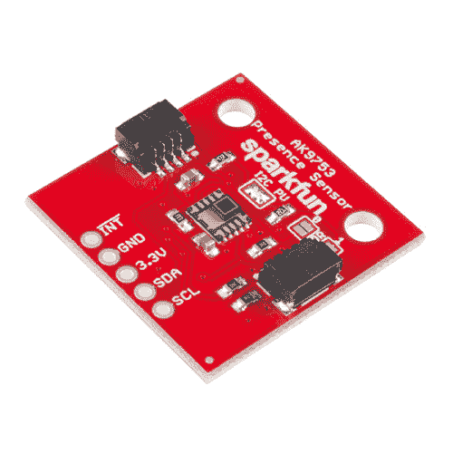
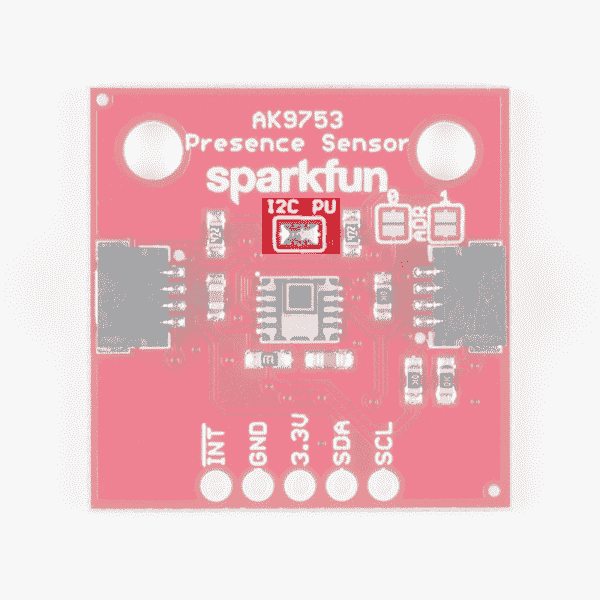
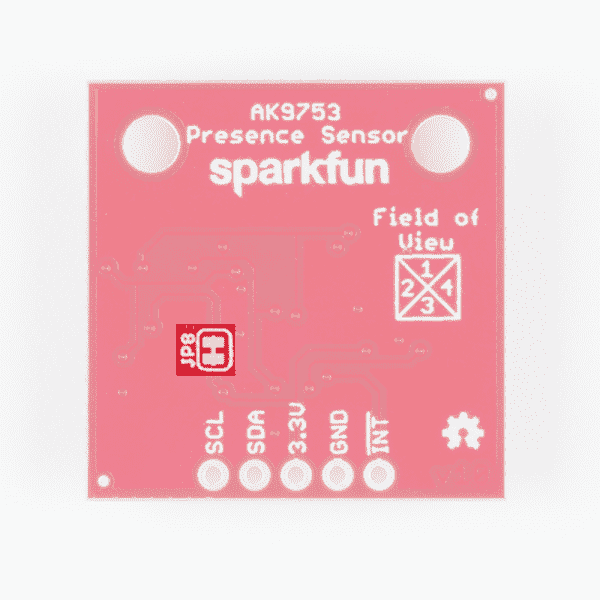
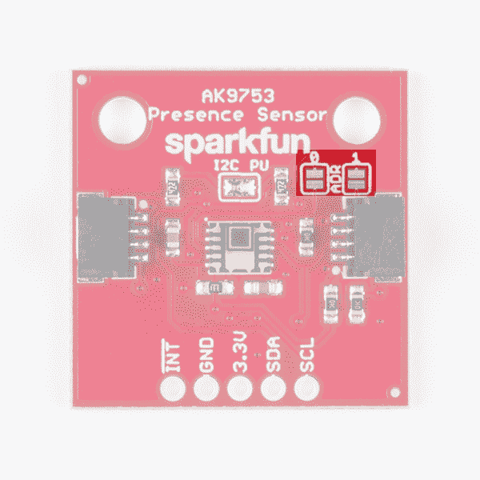
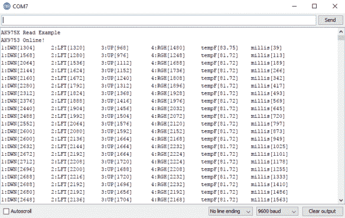
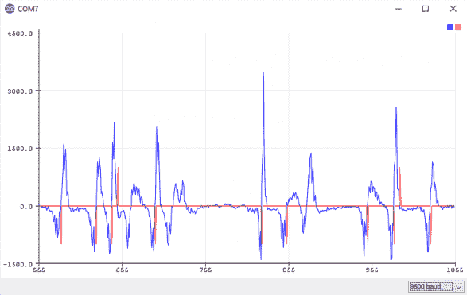

# Qwiic 人体感应传感器(AK9753)连接指南

> 原文：<https://learn.sparkfun.com/tutorials/qwiic-human-presence-sensor-ak9753-hookup-guide>

## 介绍

[AK9753 人类存在传感器](https://www.sparkfun.com/products/14349)是一个 Qwiic 使能、4 通道[非分散红外传感器(NDIR)](https://en.wikipedia.org/wiki/Nondispersive_infrared_sensor) 。每个通道都有不同的视野，因此 AK9753 不仅可以检测到人，还可以判断人正在向哪个方向移动。

[](https://www.sparkfun.com/products/14349) 

将**添加到您的[购物车](https://www.sparkfun.com/cart)中！**

### [SparkFun 人感传感器 Breakout - AK9753 (Qwiic)](https://www.sparkfun.com/products/14349)

[In stock](https://learn.sparkfun.com/static/bubbles/ "in stock") SEN-14349

这不是你正常的 PIR！SparkFun AK9753 人体存在传感器突破是一个 Qwiic 使能，4 通道非分散 I…

$29.502[Favorited Favorite](# "Add to favorites") 34[Wish List](# "Add to wish list")** **[https://www.youtube.com/embed/OBOgxnctzwI/?autohide=1&border=0&wmode=opaque&enablejsapi=1](https://www.youtube.com/embed/OBOgxnctzwI/?autohide=1&border=0&wmode=opaque&enablejsapi=1)

本连接指南将向您展示如何开始从传感器获取基本读数。我们将涵盖读数的串行输出以及单通道读数的[导数](https://en.wikipedia.org/wiki/Derivative)的漂亮图形。

### 所需材料

首先，你需要一个微控制器来控制一切。

[](https://www.sparkfun.com/products/13975) 

将**添加到您的[购物车](https://www.sparkfun.com/cart)中！**

### [spark fun red board——用 Arduino 编程 T3](https://www.sparkfun.com/products/13975)

[In stock](https://learn.sparkfun.com/static/bubbles/ "in stock") DEV-13975

SparkFun RedBoard 结合了 UNO 的 Optiboot 引导程序的简单性、FTDI 的稳定性和 shield com…

$21.5049[Favorited Favorite](# "Add to favorites") 89[Wish List](# "Add to wish list")****[](https://www.sparkfun.com/products/13907) 

将**添加到您的[购物车](https://www.sparkfun.com/cart)中！**

### [SparkFun ESP32 东西](https://www.sparkfun.com/products/13907)

[In stock](https://learn.sparkfun.com/static/bubbles/ "in stock") DEV-13907

SparkFun ESP32 Thing 是 Espressif 的 ESP32 的综合开发平台，ESP32 是他们的超级充电版本…

$23.5069[Favorited Favorite](# "Add to favorites") 83[Wish List](# "Add to wish list")****[](https://www.sparkfun.com/products/13774) 

将**添加到您的[购物车](https://www.sparkfun.com/cart)中！**

### [【粒子光子】](https://www.sparkfun.com/products/13774)

[Out of stock](https://learn.sparkfun.com/static/bubbles/ "out of stock") WRL-13774

Particle 的 IoT(物联网)硬件开发板 Photon 提供了构建互联网络所需的一切…

$19.0032[Favorited Favorite](# "Add to favorites") 51[Wish List](# "Add to wish list")****[](https://www.sparkfun.com/products/retired/13825) 

### [树莓派 3](https://www.sparkfun.com/products/retired/13825)

[Retired](https://learn.sparkfun.com/static/bubbles/ "Retired") DEV-13825

每个人都知道并喜欢 Raspberry Pi，但如果您不需要额外的外设来使其无线化会怎么样呢？覆盆子…

92 **Retired**[Favorited Favorite](# "Add to favorites") 97[Wish List](# "Add to wish list")****** ******现在，要进入 Qwiic 生态系统，关键是以下 Qwiic 屏蔽之一，以符合您对微控制器的偏好:

[](https://www.sparkfun.com/products/14352) 

将**添加到您的[购物车](https://www.sparkfun.com/cart)中！**

### [ArduinoT3 的 SparkFun Qwiic 盾](https://www.sparkfun.com/products/14352)

[In stock](https://learn.sparkfun.com/static/bubbles/ "in stock") DEV-14352

SparkFun Qwiic Shield 是一种易于组装的板，它提供了一种简单的方法来将 Qwiic Connect 系统与

$7.508[Favorited Favorite](# "Add to favorites") 39[Wish List](# "Add to wish list")****[](https://www.sparkfun.com/products/14459) 

将**添加到您的[购物车](https://www.sparkfun.com/cart)中！**

### [树莓派的 SparkFun Qwiic 帽子](https://www.sparkfun.com/products/14459)

[In stock](https://learn.sparkfun.com/static/bubbles/ "in stock") DEV-14459

树莓派的 SparkFun Qwiic 帽子是进入 Qwiic 生态系统的最快捷、最简单的方式，并且仍然适用于

$6.505[Favorited Favorite](# "Add to favorites") 33[Wish List](# "Add to wish list")****[](https://www.sparkfun.com/products/14477) 

将**添加到您的[购物车](https://www.sparkfun.com/cart)中！**

### [光子盾](https://www.sparkfun.com/products/14477)

[28 available](https://learn.sparkfun.com/static/bubbles/ "28 available") DEV-14477

SparkFun Qwiic Shield for Photon 是一个易于组装的板，提供了一种简单的方法来整合 Qwiic 系统…

$6.50[Favorited Favorite](# "Add to favorites") 7[Wish List](# "Add to wish list")****** ******你还需要一根 Qwiic 电缆将屏蔽层连接到你的人感传感器，选择适合你需要的长度。

[](https://www.sparkfun.com/products/14427) 

将**添加到您的[购物车](https://www.sparkfun.com/cart)中！**

### [Qwiic 线缆- 100mm](https://www.sparkfun.com/products/14427)

[In stock](https://learn.sparkfun.com/static/bubbles/ "in stock") PRT-14427

这是一条 100 毫米长的 4 芯电缆，带有 1 毫米 JST 端接。它旨在将支持 Qwiic 的组件连接在一起…

$1.50[Favorited Favorite](# "Add to favorites") 32[Wish List](# "Add to wish list")****[](https://www.sparkfun.com/products/14429) 

将**添加到您的[购物车](https://www.sparkfun.com/cart)中！**

### [Qwiic 线缆- 500mm](https://www.sparkfun.com/products/14429)

[In stock](https://learn.sparkfun.com/static/bubbles/ "in stock") PRT-14429

这是一根 500mm 长的 4 芯电缆，带有 1mm JST 端接。它旨在将支持 Qwiic 的组件连接在一起…

$1.951[Favorited Favorite](# "Add to favorites") 25[Wish List](# "Add to wish list")****[](https://www.sparkfun.com/products/14426) 

将**添加到您的[购物车](https://www.sparkfun.com/cart)中！**

### [Qwiic 线缆- 50mm](https://www.sparkfun.com/products/14426)

[In stock](https://learn.sparkfun.com/static/bubbles/ "in stock") PRT-14426

这是一根 50 毫米长的 4 芯电缆，带有 1 毫米 JST 端接。它旨在将支持 Qwiic 的组件连接在一起…

$0.95[Favorited Favorite](# "Add to favorites") 29[Wish List](# "Add to wish list")****[](https://www.sparkfun.com/products/14428) 

### [Qwiic 线缆- 200mm](https://www.sparkfun.com/products/14428)

[Out of stock](https://learn.sparkfun.com/static/bubbles/ "out of stock") PRT-14428

这是一根 200 毫米长的 4 芯电缆，带有 1 毫米 JST 端接。它旨在将支持 Qwiic 的组件连接在一起…

[Favorited Favorite](# "Add to favorites") 21[Wish List](# "Add to wish list")****** ******### 推荐阅读

如果你不熟悉 Qwiic 系统，我们推荐你在这里阅读[以获得一个概述](https://www.sparkfun.com/qwiic)。

| [](https://www.sparkfun.com/qwiic) |
| *[Qwiic 连接系统](https://www.sparkfun.com/qwiic)* |

如果你不熟悉下面的教程，我们也建议你看一看。

[](https://learn.sparkfun.com/tutorials/i2c) [### I2C](https://learn.sparkfun.com/tutorials/i2c) An introduction to I2C, one of the main embedded communications protocols in use today.[Favorited Favorite](# "Add to favorites") 128[](https://learn.sparkfun.com/tutorials/qwiic-shield-for-arduino--photon-hookup-guide) [### Arduino 和光子连接指南的 Qwiic 屏蔽](https://learn.sparkfun.com/tutorials/qwiic-shield-for-arduino--photon-hookup-guide) Get started with our Qwiic ecosystem with the Qwiic shield for Arduino or Photon.[Favorited Favorite](# "Add to favorites") 5

## 硬件概述

下面列出了 AK9753 人体感应传感器的一些特性和工作范围。

| 特性 | 范围 |
| 工作电压 | **3.3V** |
| 工作温度 | -30 摄氏度至 85 摄氏度 |
| 电流消耗 | 10 μA(典型值。)，100 μA(最大值)(5V) |
| 光谱灵敏度 | 5 至 7 μm (5V) |
| 探测距离 | 3 米(5 伏) |
| 温度传感器范围 | -10 至 60 摄氏度 |

### 腿

| 别针 | 描述 | 方向 |
| GND | 地面 | 在…里 |
| 3.3V | 力量 | 在…里 |
| 国家药品监督管理局 | 数据 | 在…里 |
| SCL | 时钟 | 在…里 |
| INT | 中断，当数据准备好时变为高电平。读取数据后，引脚拉低 | 在外 |

### 可选功能

板上有几个跳线可以改变，以促进几种不同的功能。第一个是 I ² C 上拉跳线，如下图所示。如果多个传感器连接到 I ² C 总线并启用上拉电阻，并联等效电阻将产生太强的上拉，使总线无法正常工作。一般来说，如果总线上连接了多个器件，则除一对上拉电阻外，应禁用所有上拉电阻。如果您需要断开上拉电阻，可以通过[移除该跳线的焊料](https://learn.sparkfun.com/tutorials/how-to-solder-through-hole-soldering#advanced-techniques-and-troubleshooting)来移除它们。

[](https://cdn.sparkfun.com/assets/learn_tutorials/6/9/9/i2cpu.png)

电路板背面的 JP8 跳线(下面突出显示)可以用[业余爱好刀](https://www.sparkfun.com/products/9200)切开，以禁用中断功能。“视野”文本和框显示了 4 个传感器的视野。从传感器的角度来看，通道 1 在顶部，2 在左侧，3 在底部，4 在右侧。

[](https://cdn.sparkfun.com/assets/learn_tutorials/6/9/9/int.png)

地址 0 和 1 可用于更改电路板的 I ² C 地址，以防多个器件使用相同的地址。下表显示了对应于开路和闭路跳线不同组合的地址。

[](https://cdn.sparkfun.com/assets/learn_tutorials/6/9/9/adr.png)

| 地址 0 | 地址 1 | I ² C 地址 |
| Zero | Zero | 0x64 |
| Zero | one | 0x65 |
| one | Zero | 0x67 |
| one | one | 切换模式 |

如果您想完全避免使用 I ² C，可以使用开关模式。在开关模式下，数据写入中断引脚。当两个输出之间的差值(例如 IR1-IR3 或 IR2-IR4)大于制造商在 EEPROM 中设置的上限或下限。如果您的项目不需要太多的准确性，这种模式是一个很好的解决方案。

## 硬件装配

如果你还没有组装好你的 Qwiic 盾，现在是时候去看看那个教程了。随着盾牌的组装，Sparkfun 的新 Qwiic 环境意味着连接传感器不可能更容易。只需将 Qwiic 电缆的一端插入 AK9753 人类存在传感器，另一端插入 Qwiic 屏蔽，您就可以上传草图并开始感应人类了。这似乎太容易了，但这就是为什么我们这样做！

## 示例代码

**注意:**此示例假设您在桌面上使用的是最新版本的 Arduino IDE。如果这是你第一次使用 Arduino，请回顾我们关于[安装 Arduino IDE 的教程。](https://learn.sparkfun.com/tutorials/installing-arduino-ide)如果您之前没有安装 Arduino 库，请查看我们的[安装指南。](https://learn.sparkfun.com/tutorials/installing-an-arduino-library)

首先，你需要下载并安装 [SparkFun AK975X Arduino 库](https://github.com/sparkfun/SparkFun_AK975x_Arduino_Library)，这可以使用下面的按钮或使用 Arduino 库管理器来完成。

[Download the SparkFun AK975X Arduino Library](https://github.com/sparkfun/SparkFun_AK975X_Arduino_Library/archive/master.zip)

在我们开始开发草图之前，让我们看看这个库的可用功能。

*   `int16_t getIR1();` -从通道 1 返回值，还有函数`getIR2();`等等。
*   `void refresh();` -读取虚拟寄存器，告知传感器计算下一个读数。
*   `boolean available();` -如果数据准备就绪，则返回`true`。
*   `boolean overrun();` -如果溢出位被置位，则返回真。
*   `void softReset();` -通过软件重置 IC。
*   `void setMode(uint8_t mode = AK975X_MODE_0);` -设置传感器的模式。模式 0 是连续读取模式。
*   `void setCutoffFrequency(uint8_t frequency = AK975X_FREQ_8_8HZ);` -设置过滤频率。8Hz 速度最快，滤波最少。
*   `float getTemperature();` -返回传感器温度，单位为摄氏度。
*   `float getTemperatureF();` -返回传感器温度，单位为 f。
*   `void enableDebugging(Stream &debugPort = Serial);` -自我解释，允许输出各种额外消息以帮助调试。
*   `void disableDebugging();` -禁用调试消息。
*   `uint8_t readRegister(uint8_t location);`-I²C 寄存器的基本读取。
*   `void writeRegister(uint8_t location, uint8_t val);` -写入 I ² C 寄存器。
*   `uint16_t readRegister16(byte location);` -从 I ² C 寄存器中读取 16 位值。

### 例 1:基本系列阅读

下面显示的示例代码将让您开始从人感传感器获取基本的串行读数。这个草图相对简单，使用`getIRX();`函数提取值，并通过一个 9600 波特的[串行终端](https://learn.sparkfun.com/tutorials/terminal-basics)打印出来。

```
language:c
#include <Wire.h>

#include "SparkFun_AK975X_Arduino_Library.h" //Use Library Manager or download here: https://github.com/sparkfun/SparkFun_AK975X_Arduino_Library

AK975X movementSensor; //Hook object to the library

int ir1, ir2, ir3, ir4, temperature;

void setup()
{
  Serial.begin(9600);
  Serial.println("AK975X Read Example");

  Wire.begin();

  //Turn on sensor
  if (movementSensor.begin() == false)
  {
    Serial.println("Device not found. Check wiring.");
    while (1);
  }
}

void loop()
{
  if (movementSensor.available())
  {
    ir1 = movementSensor.getIR1();
    ir2 = movementSensor.getIR2();
    ir3 = movementSensor.getIR3();
    ir4 = movementSensor.getIR4();
    float tempF = movementSensor.getTemperatureF();

    movementSensor.refresh(); //Read dummy register after new data is read

    //Note: The observable area is shown in the silkscreen.
    //If sensor 2 increases first, the human is on the left
    Serial.print("1:DWN[");
    Serial.print(ir1);
    Serial.print("]\t2:LFT[");
    Serial.print(ir2);
    Serial.print("]\t3:UP[");
    Serial.print(ir3);
    Serial.print("]\t4:RGH[");
    Serial.print(ir4);
    Serial.print("]\ttempF[");
    Serial.print(tempF);
    Serial.print("]\tmillis[");
    Serial.print(millis());
    Serial.print("]");
    Serial.println();
  }
  delay(1);
} 
```

输出应该类似于下图，每行都有每个通道的值、温度和读数的时间戳。

[](https://cdn.sparkfun.com/assets/learn_tutorials/6/9/9/example1_basicserialoutput.PNG)*Click the image for a closer look.*

### 示例 2:绘制人感传感器串行数据

下一个示例获取单通道的导数，并将其显示在串行绘图仪上。这个例子的代码如下所示。请注意如何使用`sensitivity`值来改变人感传感器的灵敏度。默认设置为 50，低于该值将产生更高的灵敏度。

```
language:c
#include <Wire.h>

#include "SparkFun_AK975X_Arduino_Library.h" //Use Library Manager or download here: https://github.com/sparkfun/SparkFun_AK975X_Arduino_Library

AK975X movementSensor; //Hook object to the library

unsigned int upValue; // current proximity reading
unsigned int averageValue;   // low-pass filtered proximity reading
signed int fa2;              // FA-II value;
signed int fa2Derivative;     // Derivative of the FA-II value;
signed int fa2DerivativeLast;     // Last value of the derivative (for zero-crossing detection)
signed int sensitivity = 50;  // Sensitivity of touch/release detection, values closer to zero increase sensitivity

#define LOOP_TIME 30  // Loop duration in ms. 30ms works well.

//Exponential average weight parameter / cut-off frequency for high-pass filter
//#define EA 0.3  //Very steep
//#define EA 0.1  //Less steep
#define EA 0.05  //Less steep

void setup()
{
  Serial.begin(9600);

  Wire.begin();

  //Turn on sensor
  if (movementSensor.begin() == false)
  {
    Serial.println("Device not found. Check wiring.");
    while (1);
  }

  upValue = movementSensor.getIR3(); //Get one of the latest IR values
  averageValue = upValue;
  fa2 = 0;
  movementSensor.refresh(); //Read dummy register after new data is read
}

void loop()
{
  unsigned long startTime = millis();

  while (movementSensor.available() == false) delay(1); //Wait for new data

  upValue = movementSensor.getIR3(); //Get one of the latest IR values
  movementSensor.refresh(); //Read dummy register after new data is read

  fa2DerivativeLast = fa2Derivative;
  fa2Derivative = (signed int) averageValue - upValue - fa2;
  fa2 = (signed int) averageValue - upValue;

  //Turn on various variables to see how they respond on the graph
  //Serial.print(upValue);
  //Serial.print(",");
  //Serial.print(fa2);
  //Serial.print(",");
  Serial.print(fa2Derivative);
  Serial.print(",");

  //Look to see if the previous fa2Der was below threshold AND current fa2Der is above threshold
  //Basically, if the sign of the fa2Ders has switched since last reading then we have an event
  if ((fa2DerivativeLast < -sensitivity && fa2Derivative > sensitivity) || (fa2DerivativeLast > sensitivity && fa2Derivative < -sensitivity)) // zero crossing detected
  {
    if (fa2 < -sensitivity) // minimum
    {
      Serial.print(-1000); //Cause red line to indicate entering presence
      Serial.print(",");
      //Serial.print("Entered view");
    }
    else if (fa2 > sensitivity) // maximum
    {
      Serial.print(1000); //Cause red line to indicate exiting presence
      Serial.print(",");
      //Serial.print("Exited view");
    }
    else
    {
      Serial.print(0); //Cause red line to indicate no movement
      Serial.print(",");
      //Serial.print("No Movement");
    }
  }
  else
  {
    Serial.print(0);
    Serial.print(",");
  }

  Serial.println();

  // Do this last
  averageValue = EA * upValue + (1 - EA) * averageValue;
  while (millis() < startTime + LOOP_TIME); // enforce constant loop time
} 
```

同样，该示例代码的输出应该类似于下图。该图是我们的存在传感器上的单个通道的[导数](https://en.wikipedia.org/wiki/Derivative)，因此任何偏离 0 的变化都显示了信号的变化率。

[](https://cdn.sparkfun.com/assets/learn_tutorials/6/9/9/example2_derivativegraph.PNG)*Click the image for a closer look.*

### 示例 3:配置设置

第三个例子简单地告诉你如何在不同的地址、波特率和 I ² C 速度上设置你的 AK9753。简单地调用非默认的`begin()`函数，包括有线端口、I ² C 速度、I ² C 地址和波特率的参数。例如，调用`movementSensor.begin(Wire, I2C_SPEED_FAST, 0x64, 115200);`将在地址 0x64 上以快速 I ² C 速度启动传感器，波特率为 115200 bps。该示例的输出应该类似于示例 1。

### 示例 4:阈值测试

本例中，我们将介绍如何设置 AK9753 的差分中断功能。首先，打开`File` > `Examples` > `SparkFun AK9750 Human Presence Sensor Library` > `Example4_ThresholdTests`中的示例。让我们也将 AK9753 上的中断连接到 Arduino 上的引脚 **`A3`** ，因为这将读取中断引脚的状态。将此代码上传到我们的 Arduino，并将串行监视器的波特率设为 115200，将会打开一个菜单，显示如何更改与中断相关的各种设置。通过向我们的 Arduino 发送串行命令，我们可以改变中断特性，直到它们变成我们喜欢的样子。可用串行命令列表如下所示。

| **特性** | **命令(字节，[范围])** |
| 高阈值 | 1, [-2048, 2048] |
| 低阈值 | 2, [-2048, 2048] |
| 滞变 | 3, [0, 31] |
| 允许中断 | 4, [0, 31] |
| 读取中断状态 | five |
| 开始阅读 | six |
| 停止阅读 | seven |

例如，要设置高阈值，发送命令`1,x`，其中`x`是从-2048 到 2048 之间的任意数字。与...玩耍。发送串行命令变得棘手的唯一地方是中断使能，因为我们应该发送一个二进制值，但串行监视器是一个 ASCII 接口，所以我们必须将我们想要使能的中断的二进制转换成十进制值。下面的图表可以帮你解决这个问题。(IR13HI 表示介于 1 和 3 之间的高阈值中断，对于低阈值中断，H 将为 L)

| **中断** | **十进制值** |
| IR13HI | Sixteen |
| IR13LI | eight |
| IR24HI | four |
| IR24LI | Two |
| 数据读取器 | one |

如果你想激活`DATAREADY`和`IR13LI`，你可以把 1 加到 8，然后通过串口发送命令`4, 9`。

## 资源和更进一步

现在，您已经成功启动并运行了您的 AK9753，是时候将它整合到您自己的项目中了！

有关 AK9753 的更多信息，请查看以下资源:

*   [AK9753 原理图(PDF)](https://cdn.sparkfun.com/assets/3/8/c/3/2/AK9753_Human_Movement_Sensor.pdf)
*   [AK9753 鹰文件(ZIP)](https://cdn.sparkfun.com/assets/9/3/d/4/9/AK9753_Human_Movement_Sensor_1.zip)
*   [AK9753 数据表(PDF)](https://cdn.sparkfun.com/assets/6/7/9/8/e/AK9753_DS.pdf)
*   [产品展示:Qwiic 存在感传感器](https://www.youtube.com/watch?v=OBOgxnctzwI)
*   [Qwiic 系统登陆页面](https://www.sparkfun.com/qwiic)
*   [SparkFun AK975X Arduino 库 GitHub 库](https://github.com/sparkfun/SparkFun_AK975x_Arduino_Library) -本教程中使用的 Arduino 库的源文件和示例文件。
*   [GitHub 仓库](https://github.com/sparkfun/Qwiic_Human_Presence_Sensor_Breakout_AK9753) -产品回购。

你的下一个项目需要一些灵感吗？查看一些相关教程:

[](https://learn.sparkfun.com/tutorials/redboard-santa-trap) [### 红纸板圣诞老人陷阱](https://learn.sparkfun.com/tutorials/redboard-santa-trap) A fun holiday project to try for anyone looking to catch Santa on Christmas 2[](https://learn.sparkfun.com/tutorials/pir-motion-sensor-hookup-guide) [### PIR 运动传感器连接指南](https://learn.sparkfun.com/tutorials/pir-motion-sensor-hookup-guide) An overview of passive infrared (PIR) motion detecting sensors, and how to hook them up to an Arduino.[Favorited Favorite](# "Add to favorites") 7[](https://learn.sparkfun.com/tutorials/zx-distance-and-gesture-sensor-smd-hookup-guide) [### ZX 距离和姿态传感器 SMD 连接指南](https://learn.sparkfun.com/tutorials/zx-distance-and-gesture-sensor-smd-hookup-guide) How to connect and use the SparkFun ZX Distance and Gesture Sensor with an Arduino.[Favorited Favorite](# "Add to favorites") 4[](https://learn.sparkfun.com/tutorials/openpir-hookup-guide) [### OpenPIR 连接指南](https://learn.sparkfun.com/tutorials/openpir-hookup-guide) How to use and customize the SparkFun OpenPIR motion sensor.[Favorited Favorite](# "Add to favorites") 5********************