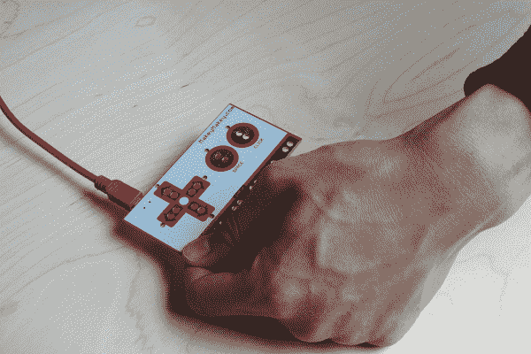
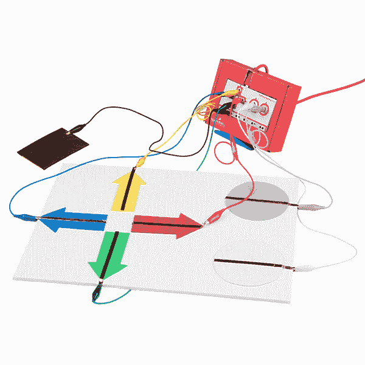
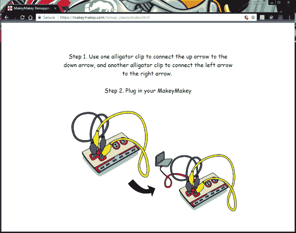

# Makey Makey 经典连接指南

> 原文：<https://learn.sparkfun.com/tutorials/makey-makey-classic-hookup-guide>

## 介绍

欢迎来到 Makey Makey 的世界！一个日常物品远比它们看起来要多的世界。香蕉不仅仅是一种弯曲的水果，它们还是虚拟钢琴的钥匙。Play-Doh 不仅仅是一个孩子的玩具——它是 Pacman 上/下/左/右背后的控制力。你简单的铅笔画是一个入口。

 

将**添加到您的[购物车](https://www.sparkfun.com/cart)中！**

 **### [Makey Makey 经典 by JoyLabz](https://www.sparkfun.com/products/14478)

[In stock](https://learn.sparkfun.com/static/bubbles/ "in stock") KIT-14478

JoyLabz 的 MaKey MaKey Classic 是一个发明工具包，它欺骗你的计算机认为几乎任何东西都是一个键…

$53.503[Favorited Favorite](# "Add to favorites") 17[Wish List](# "Add to wish list")** **准备好用全新的眼光看待日常物品。被点燃！世界是你的建筑工具箱。

[https://www.youtube.com/embed/rfQqh7iCcOU/?autohide=1&border=0&wmode=opaque&enablejsapi=1](https://www.youtube.com/embed/rfQqh7iCcOU/?autohide=1&border=0&wmode=opaque&enablejsapi=1)

### 所需材料

*   Makey Makey——节目的明星！套件应该已经**包括**:
    *   迷你 USB 电缆
    *   鳄鱼夹电缆
    *   镀锡尖电线
*   一台带有可用 USB 插槽的**计算机** (Windows、Mac OS X 或 Linux)
    *   读取按键的软件(例如 [Canabalt](http://www.adamatomic.com/canabalt/) 、[虚拟钢琴](http://www.virtualpiano.net/)、[俄罗斯方块](http://www.freetetris.org/game.php)等)。)
*   纽扣材料(例如，水果、玩具、锡箔、铜带、铅笔、朋友)
*   丰富的想象力

### 推荐阅读

 [### 什么是电路？](https://learn.sparkfun.com/tutorials/what-is-a-circuit) Every electrical project starts with a circuit. Don't know what a circuit is? We're here to help.[Favorited Favorite](# "Add to favorites") 82 [### 电压、电流、电阻和欧姆定律](https://learn.sparkfun.com/tutorials/voltage-current-resistance-and-ohms-law) Learn about Ohm's Law, one of the most fundamental equations in all electrical engineering.[Favorited Favorite](# "Add to favorites") 132

## 什么是 Makey Makey？

Makey Makey 是麻省理工学院媒体实验室的 Jay Silver 和 Eric Rosenbaum 与 SparkFun Electronics 的合作项目。这是一个发明工具包，它鼓励人们通过使用日常物品代替键盘和鼠标来找到与计算机交互的创造性方法。有了 Makey Makey，你可以用一根香蕉代替空格键，用 Play-Doh 移动和点击鼠标，或者与你最好的朋友击掌来播放 PowerPoint 幻灯片。

## 硬件概述

### 正面

Makey Makey 是一个双面电路板。在更简单的顶部，Makey Makey 有六个输入:上/下/左/右箭头键，以及空格键和鼠标左键单击:

所有这些输入以及非常重要的“接地棒”都以我喜欢称之为“鳄鱼诱饵”连接器的形式提供。您将使用附带的鳄鱼夹电缆直接夹入孔对。这将在下一节中更清楚地说明。现在，让我们继续总结你的 Makey Makey。

如果任何一个键被“接地棒”激活，一个相关的 LED 就会在键盘旁边亮起。

### 背面

当您将主板翻转到背面时，您会看到一个 mini-B USB 连接器和电源指示灯。连接器是您将 USB 电缆连接到计算机的地方。当主板通电时，LED 将会亮起。

您还可以通过黑色母头使用另外 12 把钥匙:

*   键盘一侧的 w、A、S、D、F 和 G
*   鼠标上/下/左/右移动和鼠标左/右点击

底部接头有六个额外的接地输出。

顶部集管是扩展/输出集管。它们的 KEY OUT 和 MS OUT 连接到背面的 led，分别指示您是按下了键盘还是鼠标键。这可以用来连接低功率发光二极管和小型电机。当连接到地时，复位将使板复位。也有通过 5V 和 GND 的电源引脚。最后两个引脚(PGD 和 PGC)由工厂用于编程。

穿过黑色母接头的针脚均以“跳线”连接器的形式提供，用于连接[公跳线](https://www.sparkfun.com/products/12795)、[接头针脚](https://www.sparkfun.com/products/116)、[剥皮线](https://learn.sparkfun.com/tutorials/working-with-wire#how-to-strip-a-wire)或镀锡尖头线。

## 硬件连接

你能做的最简单的 Makey Makey 钥匙是只使用你的**手指**的钥匙。下面是让自己成为一把钥匙的说明！

### 连接 USB 电缆

首先，抓住 Makey Makey 附带的迷你 USB 电缆，并将电缆插入连接器。将另一端连接到计算机的 USB 端口。

### 忽略弹出窗口

当您第一次将 Makey Makey 插入电脑时，可能会弹出一个窗口。您可以取消或关闭窗口。

### 接地

触摸**接地**杆将自己接地。

### 连接自己

同时触摸**空间**垫。在**空格**键上面的 LED 灯应该亮了，一个空格命令应该被发送到你的电脑。

现在尝试将一个手指放在地址栏上，同时快速点击空格键。有感觉了吗？它应该像你的标准空格键一样工作！

### 用文本编辑器测试

打开某种文本编辑器(记事本、Word、文本编辑等)。)来确认 Makey Makey 是否向您的计算机发送了一个空格。记住，就像你无聊的旧键盘一样，你的计算机会根据正在运行的程序对按键做出不同的解释。您也可以使用鼠标在下面显示的文本框中的单词之间单击。

 <textarea class="form-control" rows="5" id="comment">SparkFun Electronics Start Something! Makey Makey Classic Testing Area</textarea> **Warning!** Any text written in this textbox will be erased when you refresh this webpage!

### Makey Makey 的在线应用程序

寻找一些有趣的游戏来测试 Makey Makey？点击下面的链接，试用 JoyLabz 提供的在线应用程序！

[Online Apps for Makey Makey](https://labz.makeymakey.com/d/)

## 制作你的第一把钥匙

### Makey Makey 钥匙制作材料

要使用 Makey Makey 制作您的“标准”钥匙，您需要以下物品:

*   Makey Makey **输入**的连接。这可以使用孔对上的鳄鱼夹或黑色连接器插座上的跳线来完成。
*   连接到 Makey Makey **地**(地)。同样，您将使用鳄鱼夹或跳线连接到地面。
*   某种**密钥材料**。这是有趣/有创意的部分！外面有一大堆钥匙。任何稍微导电的东西都将成为计算机的输入。经典包括你的手指，香蕉和铅笔划痕。
*   通过连接按键材料和接地输入来激活按键的东西。你的手指在这方面做得很好。不过，任何稍微导电的东西都可以。

### 制作一把钥匙

激活一个键意味着创建一个闭合电路。为了使电路工作，电子必须能够从 Makey Makey 输入键流到 Makey Makey 的地。通常你的手指是这两者之间缺失的一环:

*Image courtesy of [JoyLabz](https://makeymakey.com/)*

让我们试着做一把真正的钥匙。首先，你需要找到某种关键对象。在你的房子周围翻一翻，检查一下你的水果篮或零钱包，或者拿起一支铅笔画一张图来试试。

挑选你最喜欢的颜色的鳄鱼夹电缆，打开其中一个夹子，把它扣在你的钥匙上。将夹子的另一端夹入 Makey Makey 顶部输入之一。**空格**非常适合测试目的，所以我们将从那个键盘开始:

现在，拿第二根电缆接地。黑色是经典的“底色”，但是自己定潮流，随便挑。将一根电缆的一端夹入接地棒，让另一端悬空。

打开某种**文本编辑器**(记事本、Word、TextEdit 等)。)在你的电脑上。或者您可以在下面提供的测试框中点击单词。

 <textarea class="form-control" rows="5" id="comment">SparkFun Electronics Start Something! Makey Makey Classic Testing Area</textarea> **Warning!** Any text written in this textbox will be erased when you refresh this webpage!

终于！用一只手抓住接地电缆的悬空端。确保接触到夹子的金属部分。然后用你的另一只手去摸香蕉，或者任何你的钥匙。嘭！太空！

### 试验关键材料

没有香蕉吗？尝试用不同的材料做实验。有些材料的导电性比其他材料好。某些材料在一段时间内也可以导电。试试吧！

下面是一个标准铅笔手绘钥匙的例子。在一张纸的两面画了一个虚线圆，一直延伸到中间。从每个延长线上画出交替长度的线(短的和长的),线之间有一个间隙，这样一个手指就可以用作钥匙。

第一张画有标记为“按钮 1”的细线的图在纸上是不良导体。然而，标有“按钮 2”的加粗粗线的第二幅图能够导电。在这种情况下，只有当有足够的材料时，铅笔才能导电。几次使用后，线条褪色，需要另一层石墨。

### 使用背面

还记得主板另一侧的黑色连接器吗？还有额外的钥匙可以连接！你可以遵循类似的步骤，用**跳线**替换鳄鱼线缆。Makey Makey 附带的电线是一种跳线。跳线可能更难连接到按键。一个简单的解决方案是将鳄鱼电缆连接到跳线的自由端。

让我们试一试。将镀锡导线的一端完全插入插座。将另一端连接到导电材料上。您可能需要使用鳄鱼电缆来延伸和连接到材料。重复接地连接。

下面的例子类似于手绘按钮。“按钮 3”用铜带代替铅笔。由于这种材料比手绘线更导电、更粗，所以只使用了两条条纹。用普通胶带将电线的镀锡端固定在纸和桌子上。几次使用后，铜比石墨铅笔表现得更好。

### 添加更多的键！

要添加更多键，只需将另一个鳄鱼夹连接到另一个 Makey Makey 输入(例如，箭头键或鼠标点击)，并将另一端连接到一个键材料。只要有接地连接，就不需要进一步的接地连接。发挥创意，将尽可能多的钥匙连接到 Makey Makey！

*Jim and a Makey Makey connected to various types of keys!*

### 钥匙是由什么组成的？导电性。

如果一种材料允许电流(哪怕只是一丁点)流动，它就是导体。这就是 Makey Makey 背后的魔力:世界的大部分*都是导电的*！几乎任何金属都会导电。“标准”导体是铜、银、金等。但是随着 Makey Makey 的出现，我们的指挥范围扩大了。大多数有机材料——像人的皮肤、液体、食物和青蛙腿——至少有一点导电性。这就是 Makey Makey 真正需要的。

如果一个物体不导电，它就是一个绝缘体。常见的绝缘体包括塑料、玻璃、陶瓷和木材。你通常可以通过观察某样东西来判断它是绝缘体还是导体。你必须小心像这样的物体，因为它们不能和 Makey Makey 一起工作。不过，为了避免这种情况，你可以用导电材料(比如[铜带](https://www.sparkfun.com/products/10561)，或者普通的旧[电线](https://www.sparkfun.com/products/8022))或油漆给它们做衬里。这就造成了它们在导电的错觉。

*Makey Makey held against an enclosure and connected to a controller with copper tape and alligator cables.*

**电阻**是衡量一个设备导电程度的指标。几乎任何标准的[万用表](https://www.sparkfun.com/products/9141)都可以测量电阻。任何电阻约为 4.5MΩ(这是一个非常高的电阻)或更低的物体都应该作为 Makey Makey 输入。如果你不确定某样东西是否能用，拿出一个万用表(必要的话买一个；它们是电子爱好者的必备工具)并测试电阻！或者，更好的是，只需将它连接到您的 Makey Makey 并进行实验。

## 重新映射键

Makey Makey v1.2 Classic 有一个选项，如果您需要更改默认键。要重新映射密钥，您需要使用任何互联网浏览器上网并前往 JoyLabz。单击下面的按钮打开一个新窗口。

[Remap Your Makey Makey Key!](https://makeymakey.com/remap/)

遵循 JoyLabz 提供的说明非常简单，但是我们也在下面列出了说明。通过点击链接，它应该已经打开了一个新的标签或窗口。你有两个选择。点击 Makey Makey 经典。

**Heads up!** When reprogramming the Makey Makey keys, you will need to have the browser window active. If you happen to click outside of the window, it will become dark. All you need to do is use your mouse and click back on the reprogramming window.

The page will also time out if you take too long of a break. When this happens, you will need to start at the beginning.

选择后，提示将要求您检查并确保您拥有正确的 Makey Makey 版本。在黑色母接头的背面，您会注意到电路板的版本号为 **v.1.2** 如果您没有该版本，您将无法使用这些说明重新映射按键。如果是 v.1.2，将 Mini-USB 电缆连接到 Makey Makey 并点击**开始**按钮。目前，不要将另一端连接到计算机的 USB 端口。

抓住两个鳄鱼夹，将向上(↑)和向下(↓)箭头连接在一起。然后连接左(←)和右(→)箭头。连接后，将 USB 电缆的另一端连接到电脑的 USB 端口。您会注意到绿色 led 开始淡入淡出，表示 Makey Makey 处于编程模式。

浏览器最终会响应一条提示，指出检测到 Makey Makey。如果看不到该消息，您可能需要从计算机上拔下 USB 电缆并重新启动。此外，请确保用于重新映射按键的浏览器处于活动状态。否则，如果 Makey Makey 处于编程模式，请按照提示移除鳄鱼夹。

用一只手触摸暴露的 GND 垫来接地。用另一只手触摸左或右键，导航到您想重新映射的键。

**Note:** You will only be able to use the Makey Makey to navigate. You will not be able to use your keyboard or mouse.

将被重新映射的键将以黄色突出显示。让我们重新映射鼠标左键点击 Makey Makey。导航到鼠标左键“点击”按钮。一旦选定，保持一只手在 GND 和触摸“点击”垫重新映射的关键。

被重新映射的键将以绿色突出显示。替换钥匙将以黄色突出显示。此时，您可以选择位于浏览器底部的替换密钥。使用 Makey Makey 的箭头板浏览按键。让我们通过移动到“enter”键的图标并触摸“CLICK”键盘来选择它。

浏览器会有一个很好的动画，并用新的键替换旧的键。此时，您可以继续重新映射其他键。现在，我们将只重新映射一个键。

按下向下按钮，导航至**保存**按钮。在这里，您可以**保存**重新映射的密钥，**取消**您所做的任何更改，或者**恢复**Makey Makey 默认密钥。让我们通过点击“点击”键盘来保存重新映射的键。

将弹出一个提示，要求您确认保存。使用左箭头垫突出显示“是”。点击“点击”按钮进行确认。

|  |  |

设置将被保存，你会看到一个“成功！”

## 解决纷争

没有按预期工作？查看 Makey Makey v.1.2 Classic 的故障排除部分:

[JoyLabz Troubleshooting for the Makey Makey Classic](https://makeymakey.com/how-to/classic/#troubleshooting)

你甚至可以看看他们的常见问题:

[JoyLabz FAQ for the Makey Makey](https://makeymakey.com/faq/#h.ggzwkib83bkb)

## 资源和更进一步

如果你在阅读完本教程后还有任何问题，这里是我们能找到的所有与 Makey Makey 相关的资源:

*   [MakeyMakey.com](http://www.makeymakey.com/)-Makey Makey 的官方住所
    *   原版[快速入门指南](http://makeymakey.com/howto.php)
    *   [Makey Makey 重新映射](https://makeymakey.com/remap/)
    *   【Makey Makey 的在线应用
    *   [画廊](https://labz.makeymakey.com/remixes) -查看人们在社区中创建了哪些项目
    *   [教育工作者](https://makeymakey.com/education/)
    *   [Labz](https://labz.makeymakey.com/) -课堂相关教程
    *   [导游](https://makeymakey.com/guides/) -团体活动

### 示例项目

有时候以身作则是最好的学习方式。如果你不确定从哪里开始做 Makey Makey，可以浏览一下这些例子。希望它们能启发你！如果你想把你的项目添加到这个列表中，请在下面的评论中发表，或者给我们发电子邮件！

*   [O 说你能看见(午餐)](https://www.youtube.com/watch?v=Uiq0DTCJvy0)
*   [j.viewz 和蔬菜玩泪珠](https://www.youtube.com/watch?v=xvmTav3SYsc)
*   [香蕉键盘搭配 Beau Silver](http://www.youtube.com/watch?v=C4XiICMoTgE&feature=related)
*   用 Makey Makey 玩《我的世界》
*   [办公设备鼓会议](http://www.youtube.com/watch?feature=player_embedded&v=3nZI_0zepY0)**