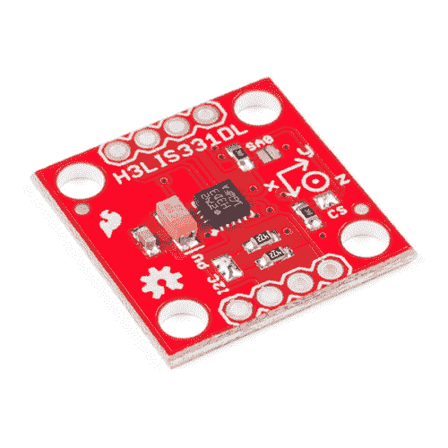

# H3LIS331DL 加速度计分线连接指南

> 原文：<https://learn.sparkfun.com/tutorials/h3lis331dl-accelerometer-breakout-hookup-guide>

## 介绍

[H3LIS331DL](https://www.sparkfun.com/products/14480) 是一款高 g 加速度计，具有 I2C 和 SPI 接口选项。它提供 100、200 或 400g 的可调输出范围，以及最高 1kHz 的可调数据速率。

 

将**添加到您的[购物车](https://www.sparkfun.com/cart)中！**

 **### [SparkFun 三轴加速度计 Breakout-H3 lis 331 dl](https://www.sparkfun.com/products/14480)

[In stock](https://learn.sparkfun.com/static/bubbles/ "in stock") SEN-14480

SparkFun H3LIS331DL 三轴加速度计突破是一款低功耗、高 g 加速度计，具有 I2C 和 SPI 接口

$13.50[Favorited Favorite](# "Add to favorites") 8[Wish List](# "Add to wish list")** **[https://www.youtube.com/embed/s1l7besiw6E/?autohide=1&border=0&wmode=opaque&enablejsapi=1](https://www.youtube.com/embed/s1l7besiw6E/?autohide=1&border=0&wmode=opaque&enablejsapi=1)

### 所需材料

请查看下面的愿望清单，了解完成本教程所需的项目。**