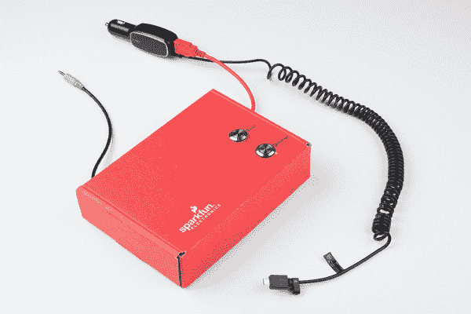

# 带 BC127 的无线音频蓝牙适配器

> 原文：<https://learn.sparkfun.com/tutorials/wireless-audio-bluetooth-adapter-w-bc127>

## 介绍

这一切都是从我和我的朋友在参加当地的舞蹈比赛时迟到开始的。我们一到，我的朋友迅速下车，抓起他的手机。在没有意识到的情况下，他已经从电缆上拔下了音频连接器，而电缆仍然连接着他的电话。就在那时，我决定通过添加音频蓝牙来升级我的音响系统。

### 所需材料

要配置 BC127，请确保具备以下部件:

 

将**添加到您的[购物车](https://www.sparkfun.com/cart)中！**

 **### [SparkFun FTDI 基础突破- 5V](https://www.sparkfun.com/products/9716)

[In stock](https://learn.sparkfun.com/static/bubbles/ "in stock") DEV-09716

这是 FTDI FT232RL USB 转串行 ic 的基本分线板。此板的引脚匹配 FTDI 电缆工作…

$16.50122[Favorited Favorite](# "Add to favorites") 78[Wish List](# "Add to wish list")**** 

将**添加到您的[购物车](https://www.sparkfun.com/cart)中！**

 **### [SparkFun USB 迷你-B 线- 6 脚](https://www.sparkfun.com/products/11301)

[In stock](https://learn.sparkfun.com/static/bubbles/ "in stock") CAB-11301

这是一条 USB 2.0 型到 Mini-B 型 5 针电缆。你知道，通常带有 USB 集线器、相机、MP3 的迷你 B 连接器…

$4.503[Favorited Favorite](# "Add to favorites") 20[Wish List](# "Add to wish list")**** 

将**添加到您的[购物车](https://www.sparkfun.com/cart)中！**

 **### [挣脱男头球-直角](https://www.sparkfun.com/products/553)

[In stock](https://learn.sparkfun.com/static/bubbles/ "in stock") PRT-00553

一排直角公接头-断开以适合。40 个引脚，可切割成任何尺寸。用于定制 PCB 或一般定制…

$2.255[Favorited Favorite](# "Add to favorites") 47[Wish List](# "Add to wish list")****** ******要构建无线音频蓝牙适配器，您需要以下部件。不过，你可能不需要所有的东西，这取决于你有什么和你想做什么。将它添加到您的购物车中，通读指南，并根据您的喜好对购物车进行必要的调整。******